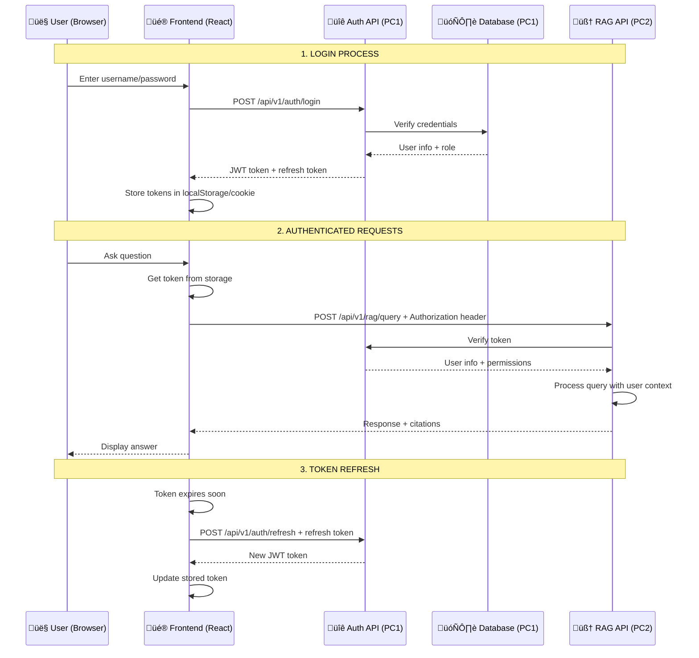
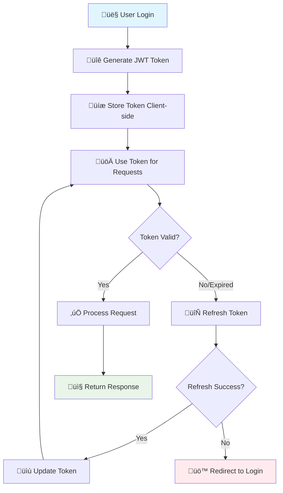

Tuyệt vời! Đây là câu hỏi rất quan trọng về **bảo mật và authentication flow**. Tôi sẽ giải thích chi tiết cơ chế JWT token trong dự án chatbot của bạn:

## 🔐 **CƠ CHẾ AUTHENTICATION FLOW HOÀN CHỈNH**



## 💾 **NƠI LƯU TRỮ TOKEN (CLIENT-SIDE)**

### **Option 1: localStorage (Phổ biến nhất)**
```javascript
// üîê Frontend - Login success
const handleLoginSuccess = (response) => {
    const { access_token, refresh_token, user_info } = response.data;
    
    // Lưu token vào localStorage
    localStorage.setItem('access_token', access_token);
    localStorage.setItem('refresh_token', refresh_token);
    localStorage.setItem('user_info', JSON.stringify(user_info));
    
    // Set token cho axios default header
    axios.defaults.headers.common['Authorization'] = `Bearer ${access_token}`;
    
    console.log('‚úÖ Login successful, token stored');
};

// 🔍 Sử dụng token cho request tiếp theo
const getStoredToken = () => {
    return localStorage.getItem('access_token');
};

// 🧹 Logout - Xóa token
const logout = () => {
    localStorage.removeItem('access_token');
    localStorage.removeItem('refresh_token');
    localStorage.removeItem('user_info');
    delete axios.defaults.headers.common['Authorization'];
    
    window.location.href = '/login';
};
```

### **Option 2: Secure HttpOnly Cookies (B·∫£o m·∫≠t h∆°n)**
```javascript
// üç™ Backend set cookie khi login
app.post('/api/v1/auth/login', async (req, res) => {
    // ... verify credentials ...
    
    const access_token = generateJWT(user);
    const refresh_token = generateRefreshToken(user);
    
    // Set HttpOnly cookie (không thể access từ JavaScript)
    res.cookie('access_token', access_token, {
        httpOnly: true,        // Không thể access từ JS
        secure: true,          // Chỉ gửi qua HTTPS
        sameSite: 'strict',    // CSRF protection
        maxAge: 15 * 60 * 1000 // 15 minutes
    });
    
    res.cookie('refresh_token', refresh_token, {
        httpOnly: true,
        secure: true,
        sameSite: 'strict',
        maxAge: 7 * 24 * 60 * 60 * 1000 // 7 days
    });
    
    res.json({ 
        success: true, 
        user: { id: user.id, username: user.username, role: user.role }
    });
});
```

### **Option 3: Memory + SessionStorage (Hybrid)**
```javascript
// 🧠 Token management service
class TokenManager {
    constructor() {
        this.accessToken = null;
        this.refreshToken = sessionStorage.getItem('refresh_token');
    }
    
    setTokens(accessToken, refreshToken) {
        // Access token: In memory (tự động mất khi close tab)
        this.accessToken = accessToken;
        
        // Refresh token: SessionStorage (mất khi close browser)
        sessionStorage.setItem('refresh_token', refreshToken);
        
        // Set cho axios
        this.setAuthHeader(accessToken);
    }
    
    setAuthHeader(token) {
        if (token) {
            axios.defaults.headers.common['Authorization'] = `Bearer ${token}`;
        } else {
            delete axios.defaults.headers.common['Authorization'];
        }
    }
    
    getAccessToken() {
        return this.accessToken;
    }
    
    clear() {
        this.accessToken = null;
        sessionStorage.removeItem('refresh_token');
        this.setAuthHeader(null);
    }
}

const tokenManager = new TokenManager();
```

## 🔄 **SỬ DỤNG TOKEN CHO CÁC REQUEST TIẾP THEO**

### **Automatic Token Injection (Axios Interceptor)**
```javascript
// 🚀 Setup axios interceptor tự động gắn token
import axios from 'axios';

// Request interceptor - Tự động gắn token
axios.interceptors.request.use(
    (config) => {
        const token = localStorage.getItem('access_token');
        if (token) {
            config.headers.Authorization = `Bearer ${token}`;
        }
        return config;
    },
    (error) => {
        return Promise.reject(error);
    }
);

// Response interceptor - Xử lý token expired
axios.interceptors.response.use(
    (response) => {
        return response;
    },
    async (error) => {
        const originalRequest = error.config;
        
        if (error.response?.status === 401 && !originalRequest._retry) {
            originalRequest._retry = true;
            
            try {
                // Thử refresh token
                const refreshToken = localStorage.getItem('refresh_token');
                const response = await axios.post('/api/v1/auth/refresh', {
                    refresh_token: refreshToken
                });
                
                const { access_token } = response.data;
                localStorage.setItem('access_token', access_token);
                
                // Retry request gốc với token mới
                originalRequest.headers.Authorization = `Bearer ${access_token}`;
                return axios(originalRequest);
                
            } catch (refreshError) {
                // Refresh token cũng expired
                logout();
                window.location.href = '/login';
            }
        }
        
        return Promise.reject(error);
    }
);
```

### **Manual Token Usage**
```javascript
// 💬 Chat API call với token
const sendChatMessage = async (message) => {
    try {
        const token = localStorage.getItem('access_token');
        
        const response = await axios.post('/api/v1/rag/query', {
            query: message,
            conversation_id: getCurrentConversationId()
        }, {
            headers: {
                'Authorization': `Bearer ${token}`,
                'Content-Type': 'application/json'
            }
        });
        
        return response.data;
    } catch (error) {
        if (error.response?.status === 401) {
            // Token expired
            await refreshTokenAndRetry();
        }
        throw error;
    }
};

// 🔄 Upload document với token
const uploadDocument = async (file, metadata) => {
    const token = localStorage.getItem('access_token');
    const formData = new FormData();
    formData.append('file', file);
    formData.append('metadata', JSON.stringify(metadata));
    
    return axios.post('/api/v1/documents/upload', formData, {
        headers: {
            'Authorization': `Bearer ${token}`,
            'Content-Type': 'multipart/form-data'
        }
    });
};
```

## 🛡️ **BACKEND TOKEN VERIFICATION**

### **JWT Middleware cho API Protection**
```python
# üîê auth_middleware.py
from fastapi import HTTPException, Depends, status
from fastapi.security import HTTPBearer, HTTPAuthorizationCredentials
import jwt
from datetime import datetime

security = HTTPBearer()

async def verify_token(credentials: HTTPAuthorizationCredentials = Depends(security)):
    """
    Verify JWT token và return user info
    """
    try:
        # Decode JWT token
        payload = jwt.decode(
            credentials.credentials, 
            SECRET_KEY, 
            algorithms=["HS256"]
        )
        
        # Check expiration
        if datetime.fromtimestamp(payload['exp']) < datetime.now():
            raise HTTPException(
                status_code=status.HTTP_401_UNAUTHORIZED,
                detail="Token expired"
            )
        
        # Get user info from token
        user_id = payload.get('user_id')
        username = payload.get('username')
        role = payload.get('role')
        department = payload.get('department')
        
        return {
            'user_id': user_id,
            'username': username,
            'role': role,
            'department': department,
            'permissions': get_role_permissions(role)
        }
        
    except jwt.InvalidTokenError:
        raise HTTPException(
            status_code=status.HTTP_401_UNAUTHORIZED,
            detail="Invalid token"
        )

# 🔒 Protected endpoint sử dụng token
@app.post("/api/v1/rag/query")
async def rag_query(
    request: QueryRequest,
    current_user: dict = Depends(verify_token)
):
    """
    RAG query v·ªõi user authentication
    """
    # Token đã verified, có thể dùng current_user
    user_role = current_user['role']
    user_dept = current_user['department']
    
    # Apply permissions dựa trên role
    allowed_documents = get_user_accessible_documents(
        user_role, user_dept
    )
    
    # Process query v·ªõi user context
    result = await process_rag_query(
        query=request.query,
        user_context=current_user,
        document_filter=allowed_documents
    )
    
    return result
```

### **Role-Based Access Control (RBAC)**
```python
# üé≠ rbac.py - Permission system
ROLE_PERMISSIONS = {
    'guest': {
        'documents': ['read_public'],
        'features': ['basic_chat']
    },
    'employee': {
        'documents': ['read_public', 'read_internal'],
        'features': ['basic_chat', 'document_search']
    },
    'manager': {
        'documents': ['read_public', 'read_internal', 'read_confidential'],
        'features': ['basic_chat', 'document_search', 'analytics']
    },
    'director': {
        'documents': ['read_all', 'write_all'],
        'features': ['full_access']
    }
}

def check_permission(current_user: dict, required_permission: str) -> bool:
    """
    Check nếu user có permission
    """
    user_role = current_user['role']
    user_permissions = ROLE_PERMISSIONS.get(user_role, {})
    
    # Check document permissions
    if required_permission.startswith('doc_'):
        doc_perms = user_permissions.get('documents', [])
        return any(perm in required_permission for perm in doc_perms)
    
    # Check feature permissions
    feature_perms = user_permissions.get('features', [])
    return required_permission in feature_perms

# üîí Permission decorator
def require_permission(permission: str):
    def decorator(func):
        async def wrapper(*args, current_user: dict = Depends(verify_token), **kwargs):
            if not check_permission(current_user, permission):
                raise HTTPException(
                    status_code=status.HTTP_403_FORBIDDEN,
                    detail=f"Missing permission: {permission}"
                )
            return await func(*args, current_user=current_user, **kwargs)
        return wrapper
    return decorator

# üìä Usage example
@app.get("/api/v1/analytics/reports")
@require_permission('analytics')
async def get_reports(current_user: dict = Depends(verify_token)):
    """
    Chỉ manager+ mới access được
    """
    return generate_analytics_report(current_user)
```

## üé® **FRONTEND TOKEN MANAGEMENT COMPONENT**

```jsx
// üîê AuthContext.jsx - React context cho authentication
import React, { createContext, useContext, useState, useEffect } from 'react';

const AuthContext = createContext();

export const AuthProvider = ({ children }) => {
    const [user, setUser] = useState(null);
    const [loading, setLoading] = useState(true);

    useEffect(() => {
        // Check existing token on app start
        checkAuthStatus();
    }, []);

    const checkAuthStatus = async () => {
        const token = localStorage.getItem('access_token');
        if (token) {
            try {
                // Verify token v·ªõi backend
                const response = await axios.get('/api/v1/auth/me', {
                    headers: { Authorization: `Bearer ${token}` }
                });
                setUser(response.data.user);
                axios.defaults.headers.common['Authorization'] = `Bearer ${token}`;
            } catch (error) {
                // Token invalid, clear storage
                logout();
            }
        }
        setLoading(false);
    };

    const login = async (username, password) => {
        try {
            const response = await axios.post('/api/v1/auth/login', {
                username,
                password
            });

            const { access_token, refresh_token, user } = response.data;
            
            // Store tokens
            localStorage.setItem('access_token', access_token);
            localStorage.setItem('refresh_token', refresh_token);
            
            // Set axios header
            axios.defaults.headers.common['Authorization'] = `Bearer ${access_token}`;
            
            setUser(user);
            return { success: true };
        } catch (error) {
            return { 
                success: false, 
                error: error.response?.data?.detail || 'Login failed' 
            };
        }
    };

    const logout = () => {
        localStorage.removeItem('access_token');
        localStorage.removeItem('refresh_token');
        delete axios.defaults.headers.common['Authorization'];
        setUser(null);
    };

    const value = {
        user,
        login,
        logout,
        loading,
        isAuthenticated: !!user
    };

    return (
        <AuthContext.Provider value={value}>
            {children}
        </AuthContext.Provider>
    );
};

export const useAuth = () => {
    const context = useContext(AuthContext);
    if (!context) {
        throw new Error('useAuth must be used within AuthProvider');
    }
    return context;
};
```

### **Protected Route Component**
```jsx
// 🛡️ ProtectedRoute.jsx
import React from 'react';
import { Navigate } from 'react-router-dom';
import { useAuth } from './AuthContext';

const ProtectedRoute = ({ children, requiredRole = null }) => {
    const { user, loading } = useAuth();

    if (loading) {
        return <div>Loading...</div>;
    }

    if (!user) {
        return <Navigate to="/login" replace />;
    }

    if (requiredRole && !hasRequiredRole(user.role, requiredRole)) {
        return <Navigate to="/unauthorized" replace />;
    }

    return children;
};

const hasRequiredRole = (userRole, requiredRole) => {
    const roleHierarchy = ['guest', 'employee', 'manager', 'director'];
    const userLevel = roleHierarchy.indexOf(userRole);
    const requiredLevel = roleHierarchy.indexOf(requiredRole);
    return userLevel >= requiredLevel;
};

export default ProtectedRoute;
```

## 📱 **SỬ DỤNG TRONG APP**

```jsx
// 🏠 App.jsx - Main application
import { AuthProvider } from './components/AuthContext';
import ProtectedRoute from './components/ProtectedRoute';
import ChatInterface from './components/ChatInterface';
import AnalyticsDashboard from './components/AnalyticsDashboard';

function App() {
    return (
        <AuthProvider>
            <Router>
                <Routes>
                    <Route path="/login" element={<LoginForm />} />
                    
                    <Route path="/chat" element={
                        <ProtectedRoute>
                            <ChatInterface />
                        </ProtectedRoute>
                    } />
                    
                    <Route path="/analytics" element={
                        <ProtectedRoute requiredRole="manager">
                            <AnalyticsDashboard />
                        </ProtectedRoute>
                    } />
                </Routes>
            </Router>
        </AuthProvider>
    );
}
```

## 🔄 **TOKEN LIFECYCLE**



## ✅ **TÓM TẮT FLOW TOKEN**

1. **Login** ‚Üí Backend t·∫°o JWT + Refresh token
2. **Store** ‚Üí Frontend l∆∞u token (localStorage/cookie/memory)
3. **Use** → Mọi request gắn `Authorization: Bearer <token>`
4. **Verify** ‚Üí Backend verify token + return user info
5. **Refresh** → Auto refresh khi token gần expired
6. **Logout** → Clear tất cả token và redirect

**Token này chứa user info (id, role, department) và được dùng để:**
- ✅ Xác thực người dùng
- ✅ Phân quyền truy cập documents  
- ‚úÖ Filter results theo department
- ‚úÖ Tracking user activity

Bạn muốn tôi detail thêm phần nào không? 🤔
