# TÀI LIỆU ĐẶC TẢ YÊU CẦU PHẦN MỀM (SRS)
## HỆ THỐNG TRỢ LÝ TRI THỨC NỘI BỘ (INTERNAL KNOWLEDGE ASSISTANT)

---

**Phiên bản:** 1.0  
**Ngày:** 28/08/2025  
**Người soạn thảo:** Chuyên gia Phân tích Nghiệp vụ  
**Trạng thái:** Dự thảo lần 1  

---

## 1. GIỚI THIỆU TỔNG QUAN

### 1.1 Mục đích tài liệu
Tài liệu này đặc tả chi tiết các yêu cầu chức năng và phi chức năng cho hệ thống Trợ lý Tri thức Nội bộ - một giải pháp AI Chatbot giúp nhân viên tra cứu tài liệu nội bộ một cách nhanh chóng và chính xác.

### 1.2 Phạm vi dự án
**Tên dự án:** Hệ thống Trợ lý Tri thức Nội bộ  
**Đối tượng:** Công ty kỹ thuật quản lý bay chuyên cung ứng sản phẩm sân bay  
**Quy mô tổ chức:** 400 nhân viên, 15 phòng ban  
**Người dùng mục tiêu:** Tối đa 100 người dùng đồng thời  

### 1.3 Bối cảnh và động lực
Hiện tại, nhân viên công ty đang gặp những khó khăn nghiêm trọng trong việc tra cứu thông tin nội bộ:
- Nhân viên R&D không biết quy trình mua hàng trình giám đốc
- Nhân viên kinh doanh thiếu hiểu biết về tính năng và cách sử dụng sản phẩm
- Nhân viên sản xuất không chắc chắn về tính chính xác của tài liệu họ đang sử dụng

Dự án này nhằm giải quyết các vấn đề trên thông qua việc xây dựng một hệ thống AI thông minh, giúp nhân viên tiếp cận thông tin một cách nhanh chóng và chính xác.

---

## 2. PHÂN TÍCH STAKEHOLDER VÀ NGƯỜI DÙNG

### 2.1 Stakeholder chính

| Vai trò | Mô tả | Lợi ích mong đợi |
|---------|-------|------------------|
| **Ban Giám đốc** | Người phê duyệt và tài trợ dự án | Nâng cao hiệu quả làm việc, giảm thời gian tìm kiếm thông tin |
| **Phòng IT** | Đội ngũ triển khai và vận hành hệ thống | Có công cụ hỗ trợ quản lý tri thức tổ chức |
| **Trưởng phòng các đơn vị** | Quản lý việc sử dụng hệ thống trong phòng ban | Nhân viên tiếp cận thông tin nhanh hơn, giảm câu hỏi lặp lại |
| **Nhân viên cuối** | Người sử dụng trực tiếp hệ thống | Tra cứu thông tin nhanh chóng, chính xác |

### 2.2 Phân loại người dùng

| Loại người dùng | Số lượng | Quyền truy cập | Mô tả |
|-----------------|----------|----------------|-------|
| **Guest** | Không giới hạn | Tài liệu public | Khách thăm quan, đối tác bên ngoài |
| **Nhân viên** | ~80 người | Tài liệu theo cấp độ nhân viên | Nhân viên thường các phòng ban |
| **Trưởng phòng** | ~15 người | Tài liệu cấp quản lý | Trưởng/Phó phòng các đơn vị |
| **Giám đốc** | ~5 người | Tất cả tài liệu | Ban Giám đốc và Phó Giám đốc |

---

## 3. YÊU CẦU CHỨC NĂNG

### 3.1 Module Quản lý Dữ liệu và Embedding (FR-01)

**FR-01.1 - Lựa chọn và Tối ưu Embedding Model**
- Hệ thống phải hỗ trợ test và so sánh tối thiểu 5 embedding models khác nhau
- Cung cấp metrics đánh giá: Hit Rate, Mean Reciprocal Rank (MRR)
- Cho phép lựa chọn 2-3 models tốt nhất để sử dụng trong production
- Hỗ trợ fine-tuning model trên dữ liệu nội bộ

**FR-01.2 - Thiết kế Cấu trúc Metadata**
- Mỗi tài liệu phải có các trường metadata bắt buộc:
  - document_id (unique)
  - source_file (đường dẫn file gốc)
  - version (phiên bản tài liệu)
  - department_owner (phòng ban sở hữu)
  - author (người tạo)
  - last_updated (ngày cập nhật cuối)
  - access_level (public, employee_only, manager_only, director_only)
  - document_type (policy, procedure, technical_guide, report)
  - tags (từ khóa tìm kiếm)

### 3.2 Module Quản trị Cơ sở Dữ liệu (FR-02)

**FR-02.1 - Hệ thống CSDL kép**
- **Vector Database**: Lưu trữ embeddings và thực hiện tìm kiếm ngữ nghĩa
  - Hỗ trợ ít nhất một trong: FAISS, Chroma, Weaviate
  - Khả năng lưu trữ tối thiểu 100,000 document chunks
- **Relational Database**: Quản lý metadata và phân quyền
  - Hỗ trợ PostgreSQL hoặc MySQL
  - Lưu trữ thông tin người dùng, phân quyền, audit log

**FR-02.2 - API Quản trị Thống nhất**
- Cung cấp RESTful API cho các thao tác CRUD
- Endpoint chính:
  - `/api/documents` - Quản lý tài liệu
  - `/api/users` - Quản lý người dùng
  - `/api/search` - Tìm kiếm tài liệu
  - `/api/access-control` - Quản lý phân quyền

### 3.3 Module Xử lý Dữ liệu (FR-03)

**FR-03.1 - Công cụ Raw-to-Clean Data**
- Web form để nhập metadata cho tài liệu mới
- Template chuẩn cho các loại tài liệu khác nhau
- Validation dữ liệu đầu vào bắt buộc
- Export tài liệu đã xử lý theo format chuẩn

**FR-03.2 - Công cụ Đánh giá Chất lượng Dữ liệu**
- Phát hiện tài liệu trùng lặp (ngữ nghĩa và từ khóa)
- Xác định nội dung mơ hồ, mâu thuẫn
- Đánh giá độ hoàn chỉnh của metadata
- Báo cáo chất lượng trực quan

**FR-03.3 - Pipeline Nạp Dữ liệu (Data Ingestion)**
- Tự động chunking tài liệu (size: 500-1000 tokens)
- Tạo embeddings cho từng chunk
- Lưu trữ đồng bộ vào Vector DB và Relational DB
- Hỗ trợ batch processing và real-time ingestion

### 3.4 Module RAG Core Engine (FR-04)

**FR-04.1 - Retrieval (Truy xuất)**
- Semantic search với độ chính xác tối thiểu 80%
- Hybrid search (kết hợp semantic và keyword)
- Filtering theo access level của user
- Trả về top-K documents có liên quan (K configurable, default=5)

**FR-04.2 - Synthesis (Tổng hợp)**
- Xây dựng context từ các documents truy xuất được
- Template hóa prompt cho LLM
- Xử lý trường hợp không tìm thấy thông tin phù hợp

**FR-04.3 - Generation (Tạo sinh)**
- Tích hợp với LLM (OpenAI GPT, Anthropic Claude, hoặc local model)
- Sinh câu trả lời dựa trên context và câu hỏi
- Cung cấp citation/reference cho câu trả lời

**FR-04.4 - API Endpoint**
- `/api/ask` - Endpoint chính cho chatbot
- Input: user_query, user_id, session_id
- Output: answer, references, confidence_score

### 3.5 Module Giao diện Chatbot (FR-05)

**FR-05.1 - Giao diện Chat**
- Real-time messaging interface
- Hiển thị lịch sử hội thoại
- Upload file để hỏi về tài liệu cụ thể
- Export cuộc hội thoại

**FR-05.2 - Tính năng Tương tác**
- Auto-suggestion câu hỏi phổ biến
- Quick actions (tìm policy, procedure, technical guide)
- Feedback mechanism (thumbs up/down)
- Multi-language support (Tiếng Việt, English)

### 3.6 Module Bảo mật và Phân quyền (FR-06)

**FR-06.1 - Authentication & Authorization**
- Single Sign-On (SSO) integration ready
- Session management với timeout
- Role-based access control (RBAC)
- Audit logging cho mọi truy cập

**FR-06.2 - Access Control Matrix**

| User Level | Public | Employee_only | Manager_only | Director_only | System_admin |
|------------|--------|---------------|--------------|---------------|--------------|
| Guest | ✓ | ✗ | ✗ | ✗ | ✗ |
| Employee | ✓ | ✓ | ✗ | ✗ | ✗ |
| Manager | ✓ | ✓ | ✓ | ✗ | ✗ |
| Director | ✓ | ✓ | ✓ | ✓ | ✗ |
| System Admin | ✓ | ✓ | ✓ | ✓ | ✓ |

---

## 4. YÊU CẦU PHI CHỨC NĂNG

### 4.1 Hiệu suất (Performance)
- **Thời gian phản hồi**: < 60 giây cho mọi truy vấn
- **Throughput**: Hỗ trợ tối thiểu 100 concurrent users
- **Availability**: 99.5% uptime trong giờ làm việc (8AM-6PM)
- **Scalability**: Có khả năng mở rộng lên 500 users và 1M documents

### 4.2 Bảo mật (Security)
- Mã hóa dữ liệu trong quá trình truyền (TLS 1.3)
- Mã hóa dữ liệu lưu trữ (AES-256)
- Không lưu trữ dữ liệu nhạy cảm trong log
- Regular security scanning và penetration testing

### 4.3 Khả năng sử dụng (Usability)
- Giao diện trực quan, không cần đào tạo phức tạp
- Thời gian học sử dụng cơ bản < 30 phút
- Hỗ trợ nhiều device (desktop, tablet, mobile)
- Responsive design cho mọi kích thước màn hình

### 4.4 Độ tin cậy (Reliability)
- Recovery time sau sự cố < 4 giờ
- Backup dữ liệu hàng ngày
- Error rate < 1% cho các truy vấn hợp lệ
- Graceful degradation khi một số component fail

### 4.5 Khả năng bảo trì (Maintainability)
- Modular architecture với loose coupling
- Comprehensive logging và monitoring
- API documentation đầy đủ
- Code coverage tối thiểu 80%

---

## 5. KIẾN TRÚC HỆ THỐNG

### 5.1 Kiến trúc Tổng thể
```
[Frontend UI] 
    ↓ HTTPS/REST API
[API Gateway] 
    ↓ 
[RAG Core Engine]
    ↓ ↘
[Vector DB]  [Relational DB]
```

### 5.2 Công nghệ Đề xuất

| Component | Công nghệ | Lý do lựa chọn |
|-----------|-----------|----------------|
| **Frontend** | React.js + TypeScript | Modern, scalable, good ecosystem |
| **Backend API** | Python FastAPI | High performance, easy async programming |
| **Vector DB** | Chroma/FAISS | Open source, good performance |
| **Relational DB** | PostgreSQL | Robust, excellent JSON support |
| **LLM Integration** | OpenAI API/Local LLM | Flexibility, cost control |
| **Deployment** | Docker + Kubernetes | Scalable, maintainable |

### 5.3 API Specification (Chính)

**POST /api/ask**
```json
Request:
{
  "query": "Quy trình mua hàng trình giám đốc như thế nào?",
  "user_id": "emp001",
  "session_id": "sess123",
  "department": "rd"
}

Response:
{
  "answer": "Quy trình mua hàng trình giám đốc gồm 5 bước...",
  "references": [
    {
      "doc_id": "proc_001",
      "title": "Quy trình Mua hàng",
      "chunk": "Bước 1: Tạo yêu cầu mua hàng...",
      "confidence": 0.95
    }
  ],
  "response_time": 2.3,
  "session_id": "sess123"
}
```

---

## 6. KẾ HOẠCH TRIỂN KHAI

### 6.1 Lộ trình 12 tuần (3 tháng)

| Giai đoạn | Thời gian | Công việc chính | Deliverables |
|-----------|-----------|-----------------|--------------|
| **Phase 1: Research & Design** | Tuần 1-3 | - Chọn Embedding Models<br>- Thiết kế CSDL Schema<br>- Xây dựng Database Management | - Model comparison report<br>- Database schema<br>- API specs |
| **Phase 2: Data Pipeline** | Tuần 4-6 | - Raw-to-Clean tools<br>- Data quality tools<br>- Ingestion pipeline | - Data processing tools<br>- Sample clean dataset<br>- Working ingestion |
| **Phase 3: Core Engine** | Tuần 7-9 | - RAG Core development<br>- API implementation<br>- Security layer | - Working RAG engine<br>- Complete API set<br>- Security framework |
| **Phase 4: UI & Integration** | Tuần 10-12 | - Chatbot UI<br>- System integration<br>- Testing & deployment | - Complete chatbot system<br>- User acceptance testing<br>- Production deployment |

### 6.2 Phân công Song song vs Nối tiếp

**Có thể thực hiện SONG SONG:**
- Tuần 1-3: Research Models + Database Design + UI Mockup
- Tuần 4-6: Data Tools + API Development + Frontend Development

**Phải thực hiện NỐI TIẾP:**
- Database → Data Ingestion → RAG Engine → Final Integration
- Model Selection → Embedding Pipeline → Search Engine

### 6.3 Ngân sách Dự kiến

| Hạng mục | Chi phí (VNĐ) | Ghi chú |
|----------|---------------|---------|
| **Nhân lực** | 800,000,000 | 4 developer × 3 tháng |
| **Hạ tầng** | 150,000,000 | Server, storage, network |
| **License** | 100,000,000 | LLM API, security tools |
| **Testing & QA** | 50,000,000 | Testing tools, QA resource |
| **Dự phòng** | 100,000,000 | 10% contingency |
| **Tổng cộng** | **1,200,000,000** | ~1.2 tỷ VNĐ |

---

## 7. QUẢN LÝ RỦI RO

### 7.1 Ma trận Rủi ro

| Rủi ro | Xác suất | Tác động | Mức độ | Biện pháp giảm thiểu |
|--------|----------|---------|--------|---------------------|
| **LLM API cost vượt budget** | Cao | Cao | CRITICAL | Implement caching, local LLM backup |
| **Data quality kém** | Trung bình | Cao | HIGH | Comprehensive data validation pipeline |
| **Performance không đạt yêu cầu** | Trung bình | Trung bình | MEDIUM | Early performance testing, optimization |
| **Security breach** | Thấp | Cao | MEDIUM | Multi-layer security, regular audit |
| **User adoption thấp** | Trung bình | Trung bình | MEDIUM | User training, change management |

### 7.2 Kế hoạch Contingency
- **Plan B cho LLM**: Sử dụng local model (Llama 2, Mistral) nếu API cost quá cao
- **Plan B cho Vector DB**: Fallback từ cloud solution về FAISS local
- **Plan B cho Performance**: Implement caching layer, pre-computed responses

---

## 8. TIÊU CHÍ CHẤP NHẬN VÀ TESTING

### 8.1 Acceptance Criteria

**Functional Requirements:**
- [ ] Hệ thống trả lời chính xác ≥80% câu hỏi trong test dataset
- [ ] Phân quyền hoạt động 100% chính xác (không có data leakage)
- [ ] API response time < 60 giây cho 95% requests
- [ ] UI responsive trên desktop, tablet, mobile

**Non-functional Requirements:**
- [ ] Hỗ trợ 100 concurrent users không degradation
- [ ] System uptime ≥99.5% trong 1 tháng pilot
- [ ] Security scan không phát hiện high/critical vulnerabilities
- [ ] User satisfaction score ≥4.0/5.0

### 8.2 Test Strategy

**Unit Testing:**
- Code coverage ≥80% cho core components
- Automated testing cho API endpoints

**Integration Testing:**
- End-to-end workflow testing
- Database integration testing
- External API integration testing

**Performance Testing:**
- Load testing với 100 concurrent users
- Stress testing với 200 concurrent users
- Spike testing cho traffic peaks

**Security Testing:**
- Penetration testing
- Vulnerability assessment
- Access control testing

**User Acceptance Testing:**
- Pilot với 20 users từ different departments
- Feedback collection và improvement
- Training và documentation validation

---

## 9. PHỤC LỤC

### 9.1 Glossary
- **RAG**: Retrieval-Augmented Generation
- **Embedding**: Vector representation của text
- **Chunk**: Đoạn text nhỏ được tách từ document lớn
- **Vector Database**: CSDL chuyên lưu trữ và tìm kiếm vectors
- **LLM**: Large Language Model

### 9.2 References
- IEEE 830-1998: Software Requirements Specifications
- ISO/IEC/IEEE 29148:2018: Systems and software engineering
- IREB Requirements Engineering Fundamentals

---

**Đây là bản dự thảo đầu tiên của tài liệu yêu cầu. Mời bạn xem qua và cho tôi biết nếu có bất kỳ điểm nào cần chỉnh sửa, làm rõ hoặc bổ sung nhé.**


cho tôi một bản Use Case Diagram (UML) bằng Mermaid để trực quan hóa quan hệ giữa User ↔ Hệ thống

# USE CASE DIAGRAM - HỆ THỐNG TRỢ LÝ TRI THỨC NỘI BỘ

```mermaid
graph TB
    %% Actors
    Guest[👤 Guest User]
    Employee[👤 Employee]
    Manager[👤 Manager]
    Director[👤 Director]
    Admin[👤 System Admin]
    
    %% System boundary
    subgraph "Hệ thống Trợ lý Tri thức Nội bộ"
        %% Core Use Cases
        UC1[Ask Question<br/>Đặt câu hỏi]
        UC2[View Public Documents<br/>Xem tài liệu công khai]
        UC3[Search Documents<br/>Tìm kiếm tài liệu]
        UC4[View Chat History<br/>Xem lịch sử chat]
        UC5[Export Conversation<br/>Xuất cuộc hội thoại]
        UC6[Upload Document Query<br/>Tải tài liệu để hỏi]
        UC7[Provide Feedback<br/>Đánh giá phản hồi]
        
        %% Employee+ Use Cases
        UC8[Access Employee Documents<br/>Truy cập tài liệu nhân viên]
        UC9[View Department Info<br/>Xem thông tin phòng ban]
        UC10[Request Document Access<br/>Yêu cầu quyền truy cập]
        
        %% Manager+ Use Cases
        UC11[Access Manager Documents<br/>Truy cập tài liệu quản lý]
        UC12[View Team Reports<br/>Xem báo cáo đội nhóm]
        UC13[Approve Access Requests<br/>Phê duyệt yêu cầu truy cập]
        
        %% Director+ Use Cases
        UC14[Access All Documents<br/>Truy cập mọi tài liệu]
        UC15[View Organization Reports<br/>Xem báo cáo tổ chức]
        UC16[Configure Access Policies<br/>Cấu hình chính sách truy cập]
        
        %% Admin Use Cases
        UC17[Manage Users<br/>Quản lý người dùng]
        UC18[Manage Documents<br/>Quản lý tài liệu]
        UC19[Configure System<br/>Cấu hình hệ thống]
        UC20[Monitor Performance<br/>Giám sát hiệu suất]
        UC21[Manage Embeddings<br/>Quản lý embedding models]
        UC22[Data Quality Control<br/>Kiểm soát chất lượng dữ liệu]
        UC23[Security Audit<br/>Kiểm tra bảo mật]
        UC24[Backup & Restore<br/>Sao lưu & khôi phục]
    end
    
    %% External Systems
    ExtDB[(Database<br/>System)]
    ExtLLM[(LLM<br/>Service)]
    ExtAuth[(Authentication<br/>Service)]
    
    %% Guest connections (public access only)
    Guest -.-> UC1
    Guest -.-> UC2
    Guest -.-> UC3
    Guest -.-> UC4
    Guest -.-> UC7
    
    %% Employee connections (inherits Guest + Employee level)
    Employee -.-> UC1
    Employee -.-> UC2
    Employee -.-> UC3
    Employee -.-> UC4
    Employee -.-> UC5
    Employee -.-> UC6
    Employee -.-> UC7
    Employee -.-> UC8
    Employee -.-> UC9
    Employee -.-> UC10
    
    %% Manager connections (inherits Employee + Manager level)
    Manager -.-> UC1
    Manager -.-> UC2
    Manager -.-> UC3
    Manager -.-> UC4
    Manager -.-> UC5
    Manager -.-> UC6
    Manager -.-> UC7
    Manager -.-> UC8
    Manager -.-> UC9
    Manager -.-> UC10
    Manager -.-> UC11
    Manager -.-> UC12
    Manager -.-> UC13
    
    %% Director connections (inherits Manager + Director level)
    Director -.-> UC1
    Director -.-> UC2
    Director -.-> UC3
    Director -.-> UC4
    Director -.-> UC5
    Director -.-> UC6
    Director -.-> UC7
    Director -.-> UC8
    Director -.-> UC9
    Director -.-> UC11
    Director -.-> UC12
    Director -.-> UC13
    Director -.-> UC14
    Director -.-> UC15
    Director -.-> UC16
    
    %% Admin connections (system management)
    Admin -.-> UC17
    Admin -.-> UC18
    Admin -.-> UC19
    Admin -.-> UC20
    Admin -.-> UC21
    Admin -.-> UC22
    Admin -.-> UC23
    Admin -.-> UC24
    
    %% System dependencies
    UC1 --> ExtLLM
    UC2 --> ExtDB
    UC3 --> ExtDB
    UC8 --> ExtAuth
    UC11 --> ExtAuth
    UC14 --> ExtAuth
    UC17 --> ExtAuth
    
    %% Styling
    classDef actor fill:#e1f5fe,stroke:#01579b,stroke-width:2px
    classDef usecase fill:#f3e5f5,stroke:#4a148c,stroke-width:1px
    classDef external fill:#fff3e0,stroke:#e65100,stroke-width:2px
    
    class Guest,Employee,Manager,Director,Admin actor
    class UC1,UC2,UC3,UC4,UC5,UC6,UC7,UC8,UC9,UC10,UC11,UC12,UC13,UC14,UC15,UC16,UC17,UC18,UC19,UC20,UC21,UC22,UC23,UC24 usecase
    class ExtDB,ExtLLM,ExtAuth external
```



## MÔ TẢ CHI TIẾT CÁC USE CASE

### 🌐 **Use Cases cho Guest (Khách)**
- **UC1**: Đặt câu hỏi đơn giản, chỉ nhận thông tin công khai
- **UC2**: Xem các tài liệu được đánh dấu "public"
- **UC3**: Tìm kiếm trong phạm vi tài liệu công khai
- **UC4**: Xem lại lịch sử câu hỏi trong session
- **UC7**: Đánh giá chất lượng câu trả lời

### 👤 **Use Cases cho Employee (Nhân viên)**
- Kế thừa tất cả quyền của Guest +
- **UC5**: Xuất cuộc trò chuyện ra file
- **UC6**: Upload tài liệu để hỏi về nội dung cụ thể  
- **UC8**: Truy cập tài liệu cấp nhân viên
- **UC9**: Xem thông tin quy trình phòng ban
- **UC10**: Yêu cầu quyền truy cập tài liệu cấp cao hơn

### 👨‍💼 **Use Cases cho Manager (Trưởng phòng)**
- Kế thừa tất cả quyền của Employee +
- **UC11**: Truy cập tài liệu cấp quản lý
- **UC12**: Xem báo cáo của đội nhóm
- **UC13**: Phê duyệt yêu cầu truy cập của nhân viên

### 🏢 **Use Cases cho Director (Giám đốc)**
- Kế thừa tất cả quyền của Manager +
- **UC14**: Truy cập mọi tài liệu (trừ system admin)
- **UC15**: Xem báo cáo tổng quan toàn tổ chức
- **UC16**: Cấu hình chính sách phân quyền

### ⚙️ **Use Cases cho System Admin**
- **UC17**: Quản lý tài khoản và phân quyền người dùng
- **UC18**: Quản lý tài liệu (thêm, sửa, xóa, phân loại)
- **UC19**: Cấu hình hệ thống (parameters, settings)
- **UC20**: Giám sát hiệu suất và usage metrics
- **UC21**: Quản lý embedding models và AI components
- **UC22**: Kiểm soát chất lượng dữ liệu
- **UC23**: Thực hiện audit bảo mật
- **UC24**: Sao lưu và khôi phục dữ liệu

## 🔗 **Mối quan hệ với External Systems**
- **Database System**: Lưu trữ tài liệu và metadata
- **LLM Service**: Xử lý câu hỏi và tạo câu trả lời
- **Authentication Service**: Xác thực và phân quyền người dùng

Diagram này thể hiện rõ ràng **hierachy của quyền truy cập** (Guest < Employee < Manager < Director) và **separation of concerns** giữa business users và system administration.

---
