# Document Ingestion System - Feature Checklist

## Core Infrastructure
- [x] **PostgreSQL Database Setup** - Tables created, connections working
- [x] **ChromaDB Vector Database** - Connected, collections working  
- [x] **Redis Cache** - Connected and functional
- [x] **Docker Environment** - All services running
- [x] **Database Schema** - Enhanced schema with all required tables

## Document Processing Pipeline
- [x] **File Format Support** - .txt, .docx, .pdf, .xlsx, .xls
- [x] **Text Extraction** - Working for all supported formats
- [x] **File Metadata Extraction** - Size, hash, word count, etc.
- [x] **Document Storage** - Saves to documents_metadata_v2 table
- [x] **Semantic Chunking** - Splits documents into meaningful chunks
- [x] **Chunk Storage** - Saves to document_chunks_enhanced table

## Vietnamese Language Processing
- [x] **Word Segmentation** - Using underthesea library
- [x] **POS Tagging** - Part-of-speech analysis
- [x] **Compound Word Detection** - Vietnamese-specific tokenization
- [x] **Proper Noun Extraction** - Entity recognition
- [x] **Readability Scoring** - Basic text quality metrics
- [x] **Vietnamese Analysis Storage** - Saves to vietnamese_text_analysis table

## Vector Embeddings & Search
- [x] **Embedding Model Setup** - SentenceTransformer multilingual model
- [x] **GPU Acceleration** - CUDA support working
- [x] **Vector Generation** - Creates embeddings for text chunks
- [x] **ChromaDB Storage** - Stores vectors with metadata
- [x] **Semantic Search Foundation** - Vector similarity infrastructure

## Search Functionality
- [x] **Full-text Search** - PostgreSQL tsvector search
- [x] **Basic Keyword Search** - ILIKE pattern matching
- [ ] **Vector Similarity Search** - ChromaDB semantic search (implemented but needs testing)
- [ ] **Hybrid Search** - Combines full-text + semantic search
- [ ] **Search Result Ranking** - Advanced scoring algorithms
- [ ] **Search Filters** - By document type, author, date, etc.

## Web Interface (Streamlit)
- [x] **Document Upload Interface** - File upload with metadata forms
- [x] **Processing Progress Bar** - Visual feedback during upload
- [x] **Database Statistics Dashboard** - Real-time stats display
- [x] **Basic Search Interface** - Simple search form
- [x] **Analytics Dashboard** - Document type charts, recent docs
- [x] **Error Handling** - User-friendly error messages

## System Reliability
- [x] **Basic Error Handling** - Try/catch blocks in place
- [ ] **Connection Pool Management** - Database connection issues persist
- [ ] **Transaction Management** - Some database locking issues
- [ ] **Graceful Degradation** - Partial failures should not break system
- [ ] **Logging System** - Comprehensive logging for debugging
- [ ] **Health Checks** - System status monitoring

## Performance & Scalability
- [x] **Async Processing** - Async/await patterns implemented
- [ ] **Batch Processing** - Single document only currently
- [ ] **Background Jobs** - Embedding generation could be async
- [ ] **Caching Strategy** - Redis integration minimal
- [ ] **Database Optimization** - Query performance not optimized

## Testing & Quality
- [x] **Basic Functionality Tests** - test_processor.py working
- [x] **Environment Health Checks** - checkENV_DB.py script
- [ ] **Unit Tests** - No comprehensive test suite
- [ ] **Integration Tests** - No end-to-end testing
- [ ] **Performance Benchmarks** - No performance metrics
- [ ] **Error Recovery Tests** - System recovery not tested

## Documentation & Deployment
- [x] **README/Setup Instructions** - Basic setup documented
- [x] **Requirements Management** - tool_requirements.txt
- [ ] **API Documentation** - No formal API docs
- [ ] **Deployment Guide** - No production deployment guide
- [ ] **Configuration Management** - Hardcoded config values
- [ ] **Security Considerations** - No security implementation

## Known Issues
- [ ] **Database Connection Conflicts** - Search fails after upload
- [ ] **Event Loop Management** - Asyncio conflicts in Streamlit
- [ ] **Memory Management** - Large files may cause issues
- [ ] **Error Recovery** - System doesn't gracefully handle failures
- [ ] **Data Validation** - Minimal input validation

## Summary Status
- **Completed Features**: 23/45 (51%)
- **Core Functionality**: Working but unstable
- **Major Blockers**: Database connection management
- **Ready for Production**: No
- **MVP Status**: Partially functional

The system demonstrates core functionality but has stability issues that prevent reliable operation. The database connection conflicts and search functionality problems are the primary blockers for a stable MVP.
---
Sau khi xem kỹ project knowledge và checklist hiện tại, tôi đánh giá như sau:

## 🚨 **VẤN ĐỀ CHÍNH CẦN XỬ LÝ NGAY**

### **1. Database Connection Conflicts** ⚠️ **Criticạl Issue**
- **Hiện tượng**: Search bị lỗi sau khi upload document
- **Nguyên nhân**: Asyncio event loop conflicts trong Streamlit 
- **Mức độ nghiêm trọng**: Cao - làm hệ thống không ổn định

### **2. Event Loop Management** ⚠️ **Critical Issue**
- **Hiện tượng**: Asyncio conflicts in Streamlit environment
- **Nguyên nhân**: Mixing sync/async code patterns
- **Ảnh hưởng**: Entire application stability

### **3. Memory Management** ⚠️ **High Priority**
- **Hiện tượng**: Large files may cause memory issues
- **Nguyên nhân**: Không có cleanup strategy
- **Ảnh hưởng**: System performance degradation

## 📊 **ĐÁNH GIÁ TỔNG QUAN**

**✅ Điểm Mạnh:**
- Core functionality 51% hoàn thành
- Vietnamese language processing đã implement
- Vector embeddings infrastructure sẵn sàng
- Basic UI working

**❌ Điểm Yếu:**
- **System Reliability chỉ 30%** - cần ưu tiên
- **Performance & Scalability chỉ 20%** 
- **Testing & Quality chỉ 25%**

## 🎯 **KHUYẾN NGHỊ HÀNH ĐỘNG NGAY**

### **Phase 1: Stabilize Core (1-2 ngày)**
```python
# Fix asyncio conflicts in Streamlit
# 1. Separate sync/async layers
# 2. Use threading for async operations
# 3. Implement proper connection pooling
```

### **Phase 2: Fix Database Issues (1 ngày)**
```python
# 1. Connection pool management
# 2. Transaction isolation
# 3. Proper session cleanup
```

### **Phase 3: Memory Optimization (1 ngày)**
```python
# 1. Streaming file processing
# 2. Garbage collection
# 3. Memory monitoring
```

## 🔧 **SỬA CHỮA ƯU TIÊN**

**Thứ tự khắc phục:**
1. **Database connection conflicts** (ngay lập tức)
2. **Event loop management** (ngay lập tức) 
3. **Memory management** (trong tuần)
4. **Error recovery system** (tuần tới)

## ✅ **KẾT LUẬN**

**Hiện tại CHƯA SẴN SÀNG cho production** nhưng:
- Core concept đúng hướng ✅
- Architecture foundations solid ✅ 
- Vietnamese processing working ✅
- **Cần fix stability issues trước khi tiếp tục** ⚠️

**Recommendation**: Tập trung fix những vấn đề critical trước, sau đó mới phát triển features mới. Không nên tiếp tục với Task 4-5 khi Task 3 chưa stable.

Bạn có muốn tôi hỗ trợ fix cụ thể những vấn đề database connection và event loop không?
---
Sau khi hoàn thiện công cụ **Task 3 (Setup Development Environment for database)**, bước tiếp theo sẽ là:

## 🎯 **PHASE 2: DATA PIPELINE (Tuần 4-6)**

### **Task 4: Build Raw-to-Clean Data Tools** 
**⏱️ Thời gian: 2-3 tuần**

#### **Các công việc chi tiết:**
- [ ] **Develop PDF text extraction** - Xử lý file PDF với OCR nếu cần
- [ ] **Develop Word document processing** - Extract text từ .docx, .doc
- [ ] **Develop Excel data cleaning** - Xử lý dữ liệu bảng
- [ ] **Create data quality validation tools** - Kiểm tra chất lượng dữ liệu
- [ ] **Build metadata extraction pipeline** - Tự động extract metadata

### **Task 5: Develop Data Ingestion Pipeline**
**⏱️ Thời gian: 2-3 tuần**

#### **Các công việc chi tiết:**
- [ ] **Create document chunking system** - Chia nhỏ documents thành chunks
- [ ] **Implement embedding generation pipeline** - Sử dụng `Qwen/Qwen3-Embedding-0.6B`
- [ ] **Setup vector database (Chroma/FAISS)** - Lưu trữ vectors
- [ ] **Create batch processing capabilities** - Xử lý nhiều files cùng lúc  
- [ ] **Implement error handling and retry mechanisms** - Robust error handling

## 📊 **KIẾN TRÚC DATA PIPELINE**

```mermaid
graph TD
    subgraph "Task 4: Raw-to-Clean Tools"
        PDF[📄 PDF Extractor]
        DOCX[📝 Word Processor]
        EXCEL[📊 Excel Cleaner]
        VALIDATOR[✅ Quality Validator]
        META[🏷️ Metadata Extractor]
    end
    
    subgraph "Task 5: Data Ingestion"
        CHUNKER[✂️ Document Chunker]
        EMBEDDER[🔢 Embedding Generator]
        VECTORDB[🗄️ Vector Database]
        BATCH[📦 Batch Processor]
        ERROR[🚨 Error Handler]
    end
    
    subgraph "Current Task 3"
        DB[🗄️ Database Loading Tool]
    end
    
    DB --> PDF
    PDF --> CHUNKER
    DOCX --> CHUNKER
    EXCEL --> CHUNKER
    VALIDATOR --> CHUNKER
    META --> CHUNKER
    
    CHUNKER --> EMBEDDER
    EMBEDDER --> VECTORDB
    BATCH --> ERROR
```



## 🚧 **ĐIỀU KIỆN TIÊN QUYẾT**

Trước khi bắt đầu Task 4-5, cần hoàn thành:

1. **✅ Fix database connection conflicts** (đang blocking)
2. **✅ Stabilize document loading tool** (Task 3)
3. **✅ Test database components thoroughly** (Task 3)

## 🎯 **SAU PHASE 2 SẼ LÀ:**

### **PHASE 3: CORE ENGINE (Tuần 7-9)**
- **Task 6**: RAG Core Engine Development
- **Task 7**: Build API Layer

### **PHASE 4: UI & INTEGRATION (Tuần 10-12)**
- **Task 8**: Develop Chatbot UI
- **Task 9**: System Integration & Testing  
- **Task 10**: Deployment & Go-Live

## 💡 **KHUYẾN NGHỊ**

**Không nên tiến đến Task 4-5** cho đến khi:
- Database connection issues được fix hoàn toàn ✅
- Document loading tool hoạt động ổn định ✅
- Có test cases đầy đủ cho database components ✅

**Lý do**: Task 4-5 sẽ phụ thuộc nặng vào database stability. Nếu Task 3 chưa ổn định, sẽ gây cascading issues cho toàn bộ data pipeline.

Bạn có muốn tôi hỗ trợ lập kế hoạch chi tiết cho Task 4-5 hay ưu tiên fix các vấn đề hiện tại trước?
