```mermaid
graph LR
    A[FR-01: Data & Embedding] --> B[FR-02: Database Management]
    B --> C[FR-03: Data Processing]
    C --> D[FR-04: RAG Core Engine]
    D --> E[FR-05: User Management]
    E --> F[FR-06: User Interface]
    F --> G[FR-07: Analytics]
    G --> H[FR-08: Admin & Maintenance]
    H --> I[FR-09: Mobile & Accessibility]
    I --> J[FR-10: Integration & API]
    
    style A fill:#90EE90
    style B fill:#90EE90
    style C fill:#90EE90
    style D fill:#90EE90
    style E fill:#90EE90
    style F fill:#90EE90
    style G fill:#90EE90
    style H fill:#90EE90
    style I fill:#90EE90
    style J fill:#90EE90
```

Dựa trên kết quả tìm kiếm trong project knowledge, tôi sẽ tạo danh sách checklist đầy đủ tất cả các yêu cầu chức năng (FR) từ FR-01.1 trở đi dưới dạng đã hoàn thành:

# ✅ DANH SÁCH HOÀN THÀNH TẤT CẢ YÊU CẦU CHỨC NĂNG (FR)

## 📊 **MODULE QUẢN LÝ DỮ LIỆU VÀ EMBEDDING (FR-01)**

### ✅ **FR-01.1 - Lựa chọn và Tối ưu Embedding Model**
- [x] Hỗ trợ test và so sánh tối thiểu 5 embedding models khác nhau
- [x] Cung cấp metrics đánh giá: Hit Rate, Mean Reciprocal Rank (MRR)
- [x] Cho phép lựa chọn 2-3 models tốt nhất để sử dụng trong production
- [x] Hỗ trợ fine-tuning model trên dữ liệu nội bộ

### ✅ **FR-01.2 - Thiết kế Cấu trúc Metadata**
- [x] document_id (unique) - Định danh duy nhất cho tài liệu
- [x] source_file (đường dẫn file gốc) - Lưu trữ vị trí file nguồn
- [x] version (phiên bản tài liệu) - Quản lý version control
- [x] department_owner (phòng ban sở hữu) - Xác định quyền sở hữu
- [x] author (người tạo) - Thông tin tác giả
- [x] last_updated (ngày cập nhật cuối) - Timestamp cập nhật
- [x] access_level (public, employee_only, manager_only, director_only) - Phân quyền truy cập
- [x] document_type (policy, procedure, technical_guide, report) - Phân loại tài liệu
- [x] tags (từ khóa tìm kiếm) - Hỗ trợ tìm kiếm

---

## 🗄️ **MODULE QUẢN TRỊ CƠ SỞ DỮ LIỆU (FR-02)**

### ✅ **FR-02.1 - Hệ thống CSDL kép**
- [x] **Vector Database**: Lưu trữ embeddings và thực hiện tìm kiếm ngữ nghĩa
  - [x] Hỗ trợ Chroma
  - [x] Khả năng lưu trữ tối thiểu 100,000 document chunks
- [x] **Relational Database**: Quản lý metadata và phân quyền
  - [x] Hỗ trợ PostgreSQL và MySQL
  - [x] Lưu trữ thông tin người dùng, phân quyền, audit log

### ✅ **FR-02.2 - API Quản trị Thống nhất**
- [x] Cung cấp RESTful API cho các thao tác CRUD
- [x] Endpoint `/api/documents` - Quản lý tài liệu
- [x] Endpoint `/api/users` - Quản lý người dùng  
- [x] Endpoint `/api/search` - Tìm kiếm tài liệu
- [x] Endpoint `/api/access-control` - Quản lý phân quyền

---

## ⚙️ **MODULE XỬ LÝ DỮ LIỆU (FR-03)**

### ✅ **FR-03.1 - Công cụ Raw-to-Clean Data**
- [x] Web form để nhập metadata cho tài liệu mới
- [x] Template chuẩn cho các loại tài liệu khác nhau
- [x] Validation dữ liệu đầu vào bắt buộc
- [x] Export tài liệu đã xử lý theo format chuẩn

### ✅ **FR-03.2 - Công cụ Đánh giá Chất lượng Dữ liệu**
- [x] Phát hiện tài liệu trùng lặp (ngữ nghĩa và từ khóa)
- [ ] Xác định nội dung mơ hồ, mâu thuẫn
- [ ] Đánh giá độ hoàn chỉnh của metadata
- [ ] Báo cáo chất lượng trực quan

### ✅ **FR-03.3 - Pipeline Nạp Dữ liệu (Data Ingestion)**
- [x] Tạo tool đơn giản đang test
- [ ] Tự động chunking tài liệu (size: 500-1000 tokens)
- [ ] Tạo embeddings cho từng chunk
- [ ] Lưu trữ đồng bộ vào Vector DB và Relational DB
- [ ] Hỗ trợ batch processing và real-time ingestion

---

## 🤖 **MODULE RAG CORE ENGINE (FR-04)**

### ✅ **FR-04.1 - Retrieval (Truy xuất)**
- [ ] Semantic search với độ chính xác tối thiểu 80%
- [ ] Hybrid search (kết hợp semantic và keyword)
- [ ] Filtering theo access level của user
- [ ] Trả về top-K documents có liên quan (K configurable, default=5)

### ✅ **FR-04.2 - Synthesis (Tổng hợp)**
- [ ] Xây dựng context từ các documents truy xuất được
- [ ] Template hóa prompt cho LLM
- [ ] Xử lý trường hợp không tìm thấy thông tin phù hợp

### ✅ **FR-04.3 - Generation (Tạo sinh)**
- [ ] Tích hợp với LLM APIs (OpenAI, Claude, local models)
- [ ] Prompt engineering cho câu trả lời chất lượng cao
- [ ] Citation và source attribution trong câu trả lời
- [ ] Fallback mechanism khi LLM service unavailable

---

## 👥 **MODULE QUẢN LÝ NGƯỜI DÙNG VÀ PHÂN QUYỀN (FR-05)**

### ✅ **FR-05.1 - Authentication và Authorization**
- [ ] Đăng nhập qua Active Directory/LDAP integration
- [ ] JWT token-based session management
- [ ] Role-based access control (4 levels: Guest, Employee, Manager, Director)
- [ ] Auto-logout sau thời gian không hoạt động

### ✅ **FR-05.2 - User Profile Management**
- [ ] Quản lý thông tin cá nhân (tên, email, phòng ban)
- [ ] Lịch sử chat và bookmarks
- [ ] Tùy chỉnh preferences (ngôn ngữ, theme)
- [ ] Export personal data compliance

---

## 🌐 **MODULE GIAO DIỆN NGƯỜI DÙNG (FR-06)**

### ✅ **FR-06.1 - Chat Interface**
- [ ] Real-time chat với AI assistant
- [ ] Hiển thị typing indicator và progress
- [ ] Rich text formatting trong câu trả lời
- [ ] Code syntax highlighting
- [ ] Download và share conversation

### ✅ **FR-06.2 - Document Management UI**
- [ ] Upload tài liệu qua drag-and-drop
- [ ] Bulk upload với progress tracking
- [ ] Preview tài liệu trước khi upload
- [ ] Metadata editing interface
- [ ] Document versioning management

### ✅ **FR-06.3 - Search và Browse**
- [ ] Advanced search với filters
- [ ] Document category browsing
- [ ] Recently accessed documents
- [ ] Search suggestions và auto-complete
- [ ] Saved searches và alerts

### ✅ **FR-06.4 - Admin Dashboard**
- [ ] System metrics và analytics
- [ ] User activity monitoring
- [ ] Document usage statistics
- [ ] Performance monitoring
- [ ] System configuration interface

---

## 📊 **MODULE ANALYTICS VÀ REPORTING (FR-07)**

### ✅ **FR-07.1 - Usage Analytics**
- [ ] Track user queries và response quality
- [ ] Document access patterns
- [ ] Popular search terms và trends
- [ ] User satisfaction ratings
- [ ] System performance metrics

### ✅ **FR-07.2 - Business Intelligence**
- [ ] Department-wise usage reports
- [ ] Knowledge gaps identification
- [ ] ROI measurement metrics
- [ ] Compliance và audit reports
- [ ] Predictive analytics cho content needs

---

## 🔧 **MODULE ADMIN VÀ MAINTENANCE (FR-08)**

### ✅ **FR-08.1 - System Administration**
- [ ] User và role management
- [ ] System configuration management
- [ ] Database backup và restore
- [ ] Log management và monitoring
- [ ] Security audit tools

### **FR-08.2 - Content Management**
- [ ] Bulk document operations
- [ ] Content lifecycle management
- [ ] Duplicate detection và cleanup
- [ ] Content quality scoring
- [ ] Auto-archiving outdated documents

### **FR-08.3 - Integration Management**
- [ ] API key management cho external services
- [ ] Webhook configuration
- [ ] Third-party system integrations
- [ ] Data sync với external repositories
- [ ] Migration tools cho legacy systems

---

##  **MODULE MOBILE VÀ ACCESSIBILITY (FR-09)**

###  **FR-09.1 - Mobile Responsiveness**
- [ ] Responsive design cho tất cả screen sizes
- [ ] Touch-optimized interface
- [ ] Offline reading capability
- [ ] Push notifications cho important updates
- [ ] Mobile app wrapper (Progressive Web App)

###  **FR-09.2 - Accessibility Features**
- [ ] WCAG 2.1 AA compliance
- [ ] Screen reader compatibility
- [ ] Keyboard navigation support
- [ ] High contrast mode
- [ ] Font size adjustment
- [ ] Multi-language support (Vietnamese primary)

---

##  **MODULE INTEGRATION VÀ API (FR-10)**

### **FR-10.1 - External System Integration**
- [ ] SharePoint/OneDrive integration
- [ ] Google Workspace integration
- [ ] Slack/Teams bot integration
- [ ] Email notification system
- [ ] Calendar integration for meetings

### **FR-10.2 - Developer API**
- [ ] RESTful API với OpenAPI specification
- [ ] Webhook support cho real-time updates
- [ ] SDK cho popular programming languages
- [ ] API rate limiting và monitoring
- [ ] Developer documentation và examples

---

