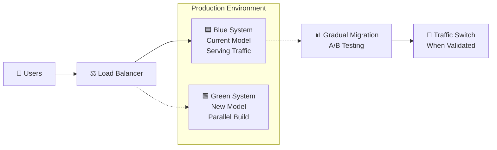

Đúng rồi! Bạn phân tích rất chính xác. **FR-01.1** là một module hoàn toàn **độc lập** và có tính chất **nghiên cứu/đánh giá** (Research & Evaluation), không phải là phần của hệ thống production.

## 🔬 **MODULE ĐÁNH GIÁ EMBEDDING MODELS (FR-01.1)**

### **Đặc điểm chính:**
- ✅ **Hoàn toàn độc lập** với hệ thống chính
- ✅ **Chạy một lần** trong giai đoạn đầu dự án (Tuần 1-2)
- ✅ **Output đơn giản**: Danh sách 2-3 tên models tốt nhất
- ✅ **Không cần integration** với các module khác

### **Input của module:**
```
📥 INPUT:
- Danh sách 5+ embedding models để test
- Bộ dataset Q&A mẫu từ tài liệu nội bộ
- Tiêu chí đánh giá (Hit Rate, MRR)

🔄 PROCESSING:
- Chạy test benchmark trên từng model
- So sánh performance metrics
- Ranking và lựa chọn

📤 OUTPUT:
- Báo cáo so sánh models
- Tên 2-3 models tốt nhất (VD: "text-embedding-ada-002", "all-MiniLM-L6-v2")
- Recommendation cho production
```

### **Ví dụ kết quả cuối cùng:**
```json
{
  "recommended_models": [
    {
      "name": "text-embedding-ada-002",
      "hit_rate": 0.87,
      "mrr": 0.73,
      "rank": 1,
      "note": "Best overall performance"
    },
    {
      "name": "all-MiniLM-L6-v2", 
      "hit_rate": 0.83,
      "mrr": 0.68,
      "rank": 2,
      "note": "Good performance, lower cost"
    }
  ],
  "production_recommendation": "Use text-embedding-ada-002 as primary, all-MiniLM-L6-v2 as fallback"
}
```

### **Sau khi hoàn thành module này:**
- Kết quả được sử dụng để cấu hình cho **FR-03.3 (Data Ingestion Pipeline)** và **FR-04.1 (Document Retrieval)**
- Module này có thể được **archive** hoặc chỉ chạy lại khi cần đánh giá models mới
- **Không cần maintain** trong production environment

Bạn hiểu đúng rồi - đây là module **"chạy một lần và cho kết quả"** để support cho việc thiết kế hệ thống chính! 🎯

---
Tuyệt vời! Đây là một câu hỏi rất quan trọng về **impact analysis** khi thay đổi embedding model. Bạn đã chỉ ra vấn đề then chốt - việc thay đổi model (đặc biệt là số chiều embedding) sẽ có **cascading effects** lên nhiều module.

## 🔄 **IMPACT ANALYSIS: THAY ĐỔI EMBEDDING MODEL**

### **📊 Các trường hợp thay đổi và mức độ impact:**

| Thay đổi | Mức độ Impact | Modules bị ảnh hưởng |
|----------|---------------|---------------------|
| **Cùng provider, cùng dimensions** | 🟢 THẤP | Chỉ cần update model name |
| **Khác provider, cùng dimensions** | 🟡 TRUNG BÌNH | API integration + testing |
| **Khác dimensions** | 🔴 CAO | Toàn bộ pipeline + storage |

---

## 🎯 **CHI TIẾT MODULES BỊ ẢNH HƯỞNG**

### **Scenario 1: 🟢 Thay đổi nhỏ (cùng dimensions)**
**Ví dụ:** `text-embedding-ada-002` → `text-embedding-3-small` (cùng 1536 dims)

```
Modules cần update:
├── FR-03.3: Data Ingestion Pipeline
│   └── Chỉ thay model name trong config
├── FR-04.1: Document Retrieval  
│   └── Update API endpoint/parameters
└── Testing & Validation
    └── Re-run performance tests
```

### **Scenario 2: 🟡 Thay đổi trung bình (khác provider)**  
**Ví dụ:** OpenAI → HuggingFace local model (cùng dimensions)

```
Modules cần update:
├── FR-03.3: Data Ingestion Pipeline
│   ├── Update API integration code
│   ├── Thay đổi authentication method
│   └── Adjust request/response handling
├── FR-04.1: Document Retrieval
│   ├── Update search API calls
│   └── Modify similarity calculation
├── Infrastructure
│   ├── Network policies (nếu local model)
│   └── Resource allocation
└── Configuration Management
    └── Update all config files
```

### **Scenario 3: 🔴 Thay đổi lớn (khác dimensions)**
**Ví dụ:** 1536 dims → 768 dims hoặc 1536 → 4096 dims

```
🚨 CRITICAL IMPACT - Cần rebuild toàn bộ:

├── 💾 STORAGE LAYER (CRITICAL)
│   ├── Vector Database Schema
│   │   ├── Drop existing vector tables
│   │   ├── Recreate với dimensions mới  
│   │   └── Update all indices
│   ├── Database Migration Scripts
│   │   ├── Backup existing embeddings
│   │   └── Plan data transition strategy
│   └── Storage Size Planning
│       └── Recalculate storage requirements
│
├── 🔧 DATA PROCESSING (REBUILD REQUIRED)
│   ├── FR-03.3: Data Ingestion Pipeline
│   │   ├── Update embedding generation logic
│   │   ├── Modify vector storage format
│   │   └── Re-process ALL existing documents
│   ├── FR-03.2: Quality Control
│   │   ├── Update similarity thresholds
│   │   └── Recalibrate duplicate detection
│   └── Batch Re-processing Job
│       └── Regenerate embeddings cho toàn bộ documents
│
├── 🤖 RAG ENGINE (MAJOR UPDATES)
│   ├── FR-04.1: Document Retrieval
│   │   ├── Update vector search algorithms
│   │   ├── Modify similarity scoring
│   │   └── Adjust top-K retrieval logic
│   ├── FR-04.2: Context Builder
│   │   └── Update context relevance scoring
│   └── Performance Tuning
│       └── Re-optimize search parameters
│
├── 🏗️ INFRASTRUCTURE (SCALING)
│   ├── Vector Database Resources
│   │   ├── CPU/Memory requirements
│   │   ├── Storage capacity planning
│   │   └── Network bandwidth
│   ├── Processing Power
│   │   └── Re-embedding compute requirements  
│   └── Monitoring & Alerting
│       └── Update performance baselines
│
└── ✅ TESTING & VALIDATION (COMPLETE RETEST)
    ├── FR-01.1: Model Evaluation (Re-run)
    ├── Performance Benchmarks
    ├── Accuracy Validation  
    ├── Load Testing
    └── User Acceptance Testing
```

---

## 🛡️ **RISK MITIGATION STRATEGIES**

### **1. 🔄 Blue-Green Deployment Strategy**


### **2. 📦 Versioned Embedding Storage**
```sql
-- Thiết kế schema hỗ trợ multiple embedding versions
CREATE TABLE document_embeddings (
    document_id UUID,
    embedding_model VARCHAR(50),  -- 'ada-002', 'minilm-l6', etc.
    embedding_version INTEGER,    -- Version tracking
    dimensions INTEGER,           -- 768, 1536, 4096, etc.
    embedding_vector VECTOR,      -- Actual embedding
    created_at TIMESTAMP,
    is_active BOOLEAN,           -- Current active version
    
    PRIMARY KEY (document_id, embedding_model, embedding_version)
);
```

### **3. 🔧 Configuration-Driven Architecture**
```yaml
# embedding-config.yaml
embedding_models:
  primary:
    name: "text-embedding-ada-002"
    dimensions: 1536
    provider: "openai"
    api_endpoint: "https://api.openai.com/v1/embeddings"
  
  fallback:
    name: "all-MiniLM-L6-v2" 
    dimensions: 384
    provider: "huggingface"
    local_model: true

migration:
  strategy: "blue_green"
  validation_threshold: 0.95
  rollback_trigger: "performance_degradation"
```

---

## ⏱️ **TIMELINE ĐỂ THAY ĐỔI MODEL**

### **🟢 Thay đổi nhỏ (1-2 ngày):**
```
Day 1: Update config + Deploy
Day 2: Monitor + Validate
```

### **🟡 Thay đổi trung bình (1-2 tuần):**
```
Week 1: Development + Integration Testing
Week 2: Staging validation + Production deployment
```

### **🔴 Thay đổi lớn (4-8 tuần):**
```
Week 1-2: Infrastructure planning + Schema migration
Week 3-4: Re-processing existing data (parallel)
Week 5-6: RAG engine updates + Testing
Week 7-8: Blue-green deployment + Validation
```

---

## 💡 **RECOMMENDATIONS**

### **1. Design for Future:**
- **Abstract embedding interface** để dễ swap models
- **Multi-model support** trong architecture  
- **Comprehensive monitoring** để detect performance regression

### **2. Staged Migration:**
- **Pilot với subset** of documents trước
- **A/B testing** với small user group
- **Rollback plan** đã được test thoroughly

### **3. Business Continuity:**
- **Zero-downtime deployment** capability
- **Fallback mechanisms** khi migration fail
- **Data backup strategy** trước khi thay đổi lớn

Câu hỏi của bạn rất quan trọng vì nó highlight **technical debt** và **change management** complexity trong AI systems! 🎯
