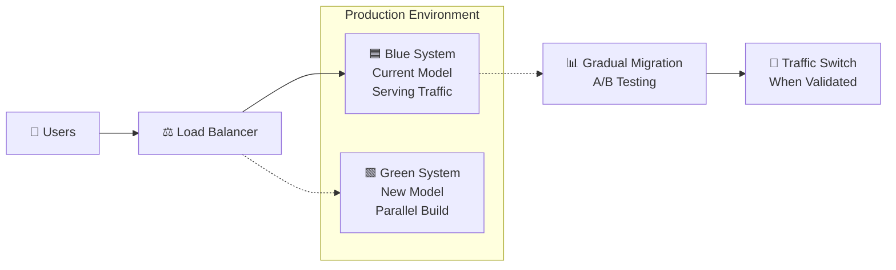

# TÀI LIỆU HƯỚNG DẪN TRIỂN KHAI
## FR-01.1: ĐÁNH GIÁ VÀ LỰA CHỌN EMBEDDING MODELS TIẾNG VIỆT

---

**Phiên bản:** 1.0  
**Ngày:** 30/08/2025  
**Mục tiêu:** Xây dựng hệ thống đánh giá và lựa chọn embedding models tối ưu cho tiếng Việt  
**Thời gian ước tính:** 1-2 tuần  

---

## 📋 **TỔNG QUAN DỰ ÁN**

### **Mục tiêu chính:**
- Đánh giá và so sánh tối thiểu 5 embedding models cho tiếng Việt
- Đo lường hiệu suất với metrics: Hit Rate và Mean Reciprocal Rank (MRR)
- Lựa chọn 2-3 models tốt nhất để sử dụng trong production
- Tối ưu hóa cho GPU và dữ liệu tiếng Việt

### **Deliverables:**
- Framework đánh giá embedding models
- Báo cáo so sánh chi tiết với metrics
- Top 2-3 models được khuyến nghị
- Hướng dẫn triển khai production

---

## 🏗️ **CẤU TRÚC DỰ ÁN**

```
vietnamese_embedding_evaluator/
├── configs/
│   ├── models.json              # Cấu hình các models cần test
│   ├── evaluation_settings.json # Tham số đánh giá
│   └── gpu_settings.json        # Cấu hình GPU
├── data/
│   ├── raw/
│   │   ├── company_documents/   # Tài liệu nội bộ mẫu
│   │   └── external_datasets/   # Dataset công khai (nếu có)
│   ├── processed/
│   │   ├── cleaned_corpus.json  # Dữ liệu đã xử lý
│   │   └── test_queries.json    # Bộ câu hỏi test
│   └── ground_truth/
│       └── query_document_pairs.json # Cặp câu hỏi-tài liệu đúng
├── src/
│   ├── __init__.py
│   ├── data_processor.py        # Xử lý dữ liệu tiếng Việt
│   ├── embedding_manager.py     # Quản lý các embedding models
│   ├── evaluator.py            # Logic đánh giá metrics
│   ├── metrics.py              # Tính toán Hit Rate, MRR
│   ├── gpu_optimizer.py        # Tối ưu GPU
│   └── visualizer.py           # Tạo charts và reports
├── notebooks/
│   ├── 01_data_exploration.ipynb
│   ├── 02_model_comparison.ipynb
│   └── 03_results_analysis.ipynb
├── reports/
│   ├── model_comparison_report.json
│   ├── performance_charts/
│   └── final_recommendation.md
├── scripts/
│   ├── run_evaluation.py       # Script chính
│   ├── prepare_data.py         # Chuẩn bị dữ liệu
│   └── export_results.py       # Xuất kết quả
├── tests/
│   └── test_embedding_models.py
├── requirements.txt
├── setup.py
└── README.md
```

---

## 🔧 **CÔNG NGHỆ VÀ THÀNH PHẦN**

### **1. Core Libraries & Frameworks:**
```txt
# Embedding & ML Libraries
sentence-transformers>=2.2.2
transformers>=4.21.0
torch>=2.0.0
numpy>=1.21.0
scikit-learn>=1.1.0

# Vietnamese Text Processing
pyvi>=0.1.1                    # Tokenizer tiếng Việt
regex>=2022.7.9                # Advanced regex patterns
unicodedata2>=15.0.0           # Unicode normalization

# GPU Optimization
accelerate>=0.20.0             # HuggingFace GPU acceleration
cuda-python>=12.0.0            # CUDA utilities (nếu có)

# Data Processing & Analysis
pandas>=1.5.0
numpy>=1.21.0
scipy>=1.9.0

# Visualization & Reporting
matplotlib>=3.5.0
seaborn>=0.11.0
plotly>=5.10.0
jinja2>=3.1.0                  # Template engine cho reports

# Utilities
tqdm>=4.64.0                   # Progress bars
python-dotenv>=0.19.0          # Environment variables
pydantic>=1.10.0               # Data validation
typer>=0.6.0                   # CLI interface
```

### **2. Embedding Models được đánh giá:**

#### **Top Priority Models:**
1. **AITeamVN/Vietnamese_Embedding** (Recommended #1)
   - Hugging Face Model ID: `AITeamVN/Vietnamese_Embedding`
   - Đặc biệt tối ưu cho tiếng Việt
   - Size: ~400MB

2. **Qwen/Qwen3-Embedding-0.6B** (Recommended #2)
   - Hugging Face Model ID: `Qwen/Qwen2.5-72B-Instruct`
   - Multilingual support tốt
   - Size: ~600MB

#### **Additional Models for Comparison:**
3. **sentence-transformers/paraphrase-multilingual-MiniLM-L12-v2**
   - Multilingual, compact
   - Size: ~200MB

4. **intfloat/multilingual-e5-base**
   - E5 series, multilingual
   - Size: ~400MB

5. **BAAI/bge-m3**
   - Chinese-focus nhưng support Vietnamese
   - Size: ~600MB

6. **keepitreal/vietnamese-sbert** (Backup option)
   - Vietnamese-specific SBERT
   - Size: ~400MB

---

## 📝 **STEP-BY-STEP IMPLEMENTATION GUIDE**

### **Phase 1: Setup & Data Preparation (2-3 ngày)**

#### **Step 1.1: Environment Setup**
```bash
# Tạo Python virtual environment
python -m venv venv_embedding_eval
source venv_embedding_eval/bin/activate  # Linux/Mac
# hoặc venv_embedding_eval\Scripts\activate  # Windows

# Install dependencies
pip install -r requirements.txt

# Kiểm tra GPU availability
python -c "import torch; print(f'CUDA available: {torch.cuda.is_available()}')"
```

#### **Step 1.2: Data Collection & Preprocessing**

**1.2.1 Thu thập dữ liệu công ty:**
- Lấy 200-500 tài liệu nội bộ đại diện (PDF, Word, txt)
- Đảm bảo có đa dạng loại: quy trình, hướng dẫn kỹ thuật, chính sách
- Phân loại theo department và access level

**1.2.2 Tạo Ground Truth Dataset:**
```python
# Cấu trúc file data/ground_truth/query_document_pairs.json
{
  "test_cases": [
    {
      "query_id": "Q001",
      "query": "Quy trình mua hàng trình giám đốc như thế nào?",
      "relevant_documents": ["DOC_001", "DOC_003"],
      "department": "procurement",
      "difficulty": "easy"
    },
    {
      "query_id": "Q002", 
      "query": "Các tính năng của đèn hiệu sân bay loại LED?",
      "relevant_documents": ["DOC_045", "DOC_067", "DOC_089"],
      "department": "technical",
      "difficulty": "medium"
    }
  ]
}
```

**1.2.3 Text Processing Pipeline:**
```python
# Hướng dẫn implement trong src/data_processor.py

class VietnameseTextProcessor:
    def __init__(self):
        # Sử dụng PyVi tokenizer thay vì underthesea
        pass
    
    def clean_text(self, text: str) -> str:
        # Normalize Unicode
        # Remove special characters
        # Handle Vietnamese diacritics
        # Tokenization với PyVi
        pass
    
    def create_chunks(self, document: str, chunk_size: int = 512) -> List[str]:
        # Intelligent chunking cho tiếng Việt
        # Respect sentence boundaries
        # Handle Vietnamese punctuation
        pass
```

### **Phase 2: Embedding Models Integration (3-4 ngày)**

#### **Step 2.1: Model Manager Implementation**

**2.1.1 Cấu hình models (configs/models.json):**
```json
{
  "models": [
    {
      "name": "vietnamese_embedding_v1",
      "model_id": "AITeamVN/Vietnamese_Embedding",
      "provider": "huggingface",
      "max_seq_length": 512,
      "batch_size": 32,
      "normalize_embeddings": true,
      "priority": 1
    },
    {
      "name": "qwen3_embedding",
      "model_id": "Qwen/Qwen2.5-72B-Instruct", 
      "provider": "huggingface",
      "max_seq_length": 512,
      "batch_size": 16,
      "normalize_embeddings": true,
      "priority": 2
    }
  ],
  "evaluation_settings": {
    "top_k": [1, 3, 5, 10],
    "similarity_threshold": 0.7,
    "batch_processing": true
  }
}
```

**2.1.2 GPU Optimization Strategy:**
```python
# src/gpu_optimizer.py implementation guidance

class GPUOptimizer:
    def __init__(self):
        self.device = torch.device('cuda' if torch.cuda.is_available() else 'cpu')
        
    def optimize_model_loading(self, model_name: str):
        # Load model với GPU optimization
        # Memory management
        # Batch size tuning dựa trên GPU memory
        # Mixed precision nếu GPU hỗ trợ
        pass
    
    def monitor_gpu_usage(self):
        # Track GPU memory usage
        # Performance metrics
        # Temperature monitoring
        pass
```

#### **Step 2.2: Embedding Generation Pipeline**

**2.2.1 Batch Processing Strategy:**
```python
# src/embedding_manager.py guidance

class EmbeddingManager:
    def __init__(self, gpu_optimizer: GPUOptimizer):
        self.gpu_optimizer = gpu_optimizer
        self.models = {}
    
    def generate_embeddings_batch(self, texts: List[str], model_name: str) -> np.ndarray:
        # Efficient batch processing
        # GPU memory management  
        # Error handling and retry logic
        # Progress tracking
        pass
    
    def compare_models_parallel(self, test_queries: List[str]) -> Dict:
        # Parallel model comparison
        # Resource allocation
        # Result aggregation
        pass
```

### **Phase 3: Evaluation Metrics Implementation (2-3 ngày)**

#### **Step 3.1: Core Metrics**

**3.1.1 Hit Rate Implementation:**
```python
# src/metrics.py guidance

def calculate_hit_rate(query_results: List[List[str]], 
                      ground_truth: List[List[str]], 
                      k: int = 5) -> float:
    """
    Tính Hit Rate@K
    
    Args:
        query_results: List of top-K document IDs cho mỗi query
        ground_truth: List of relevant document IDs cho mỗi query
        k: Number of top results to consider
        
    Returns:
        Hit rate score (0.0 to 1.0)
    """
    # Implementation logic here
    pass

def calculate_mrr(query_results: List[List[str]], 
                  ground_truth: List[List[str]]) -> float:
    """
    Tính Mean Reciprocal Rank (MRR)
    
    MRR = (1/|Q|) * Σ(1/rank_i)
    Trong đó rank_i là vị trí của relevant document đầu tiên
    """
    # Implementation logic here
    pass
```

**3.1.2 Advanced Metrics:**
```python
def calculate_ndcg(query_results: List[List[str]], 
                   ground_truth: List[List[str]], 
                   k: int = 10) -> float:
    """Normalized Discounted Cumulative Gain"""
    pass

def calculate_precision_recall(query_results: List[List[str]], 
                              ground_truth: List[List[str]]) -> Tuple[float, float]:
    """Precision and Recall at different cut-offs"""
    pass
```

#### **Step 3.2: Evaluation Framework**

**3.2.1 Comprehensive Evaluation:**
```python
# src/evaluator.py guidance

class ModelEvaluator:
    def __init__(self, embedding_manager: EmbeddingManager):
        self.embedding_manager = embedding_manager
        
    def run_full_evaluation(self, test_queries: List[Dict], 
                           document_corpus: List[Dict]) -> Dict:
        """
        Chạy đánh giá đầy đủ cho tất cả models
        
        Steps:
        1. Generate embeddings cho document corpus
        2. Process test queries
        3. Perform similarity search
        4. Calculate metrics
        5. Generate comparative report
        """
        pass
    
    def benchmark_performance(self, model_name: str) -> Dict:
        """
        Benchmark speed và memory usage
        
        Metrics:
        - Embedding generation speed (tokens/second)
        - Memory usage (peak và average)
        - GPU utilization
        - Search latency
        """
        pass
```

### **Phase 4: Results Analysis & Visualization (2-3 ngày)**

#### **Step 4.1: Report Generation**

**4.1.1 Automated Report Structure:**
```python
# src/visualizer.py guidance

class ReportGenerator:
    def generate_comparison_charts(self, results: Dict) -> None:
        """
        Tạo biểu đồ so sánh:
        1. Hit Rate@K comparison (bar chart)
        2. MRR comparison (horizontal bar)
        3. Speed vs Accuracy scatter plot
        4. Memory usage comparison
        5. Per-category performance heatmap
        """
        pass
    
    def create_model_ranking_table(self, results: Dict) -> pd.DataFrame:
        """
        Bảng xếp hạng models với weighted scoring:
        - Accuracy (40%): Average of Hit Rate@5 and MRR
        - Speed (30%): Embedding generation + search speed
        - Memory (20%): GPU memory efficiency
        - Vietnamese-specific (10%): Performance on Vietnamese queries
        """
        pass
    
    def export_final_report(self, results: Dict) -> None:
        """
        Tạo báo cáo cuối cùng format Markdown + HTML
        Bao gồm:
        - Executive Summary
        - Detailed Results
        - Recommendations
        - Implementation Guide
        """
        pass
```

#### **Step 4.2: Decision Framework**

**4.2.1 Model Selection Criteria:**
```python
# Weighted scoring system
EVALUATION_WEIGHTS = {
    'hit_rate_5': 0.20,      # Hit Rate@5
    'mrr': 0.20,             # Mean Reciprocal Rank
    'embedding_speed': 0.15,  # Tokens per second
    'search_speed': 0.15,     # Query response time
    'memory_efficiency': 0.10, # GPU memory usage
    'vietnamese_performance': 0.10, # Vietnamese-specific test
    'model_size': 0.05,       # Storage requirements
    'stability': 0.05         # Error rate & consistency
}

def calculate_final_score(model_results: Dict) -> float:
    """Calculate weighted final score for model ranking"""
    pass
```

---

## 🚀 **EXECUTION SCRIPTS**

### **Main Evaluation Script (scripts/run_evaluation.py):**
```python
#!/usr/bin/env python3
"""
Main evaluation runner script
Usage: python scripts/run_evaluation.py --config configs/models.json --output reports/
"""

import typer
from pathlib import Path
from src.data_processor import VietnameseTextProcessor
from src.embedding_manager import EmbeddingManager
from src.evaluator import ModelEvaluator
from src.visualizer import ReportGenerator

def main(
    config_path: Path = typer.Option(..., help="Path to models config"),
    data_path: Path = typer.Option("data/", help="Path to data directory"),
    output_path: Path = typer.Option("reports/", help="Output directory"),
    gpu_enabled: bool = typer.Option(True, help="Enable GPU acceleration"),
    verbose: bool = typer.Option(False, help="Verbose logging")
):
    """
    Run complete embedding model evaluation pipeline
    
    Steps executed:
    1. Load and validate configuration
    2. Prepare test data
    3. Initialize models
    4. Run evaluation
    5. Generate reports
    """
    
    # Implementation logic here
    # Load configs, run evaluation, save results
    pass

if __name__ == "__main__":
    typer.run(main)
```

---

## 📊 **EXPECTED RESULTS & BENCHMARKS**

### **Performance Targets:**
- **Hit Rate@5**: Tối thiểu 75% cho Vietnamese queries
- **MRR**: Tối thiểu 0.65
- **Speed**: < 100ms per query (including embedding + search)
- **Memory**: < 2GB GPU RAM per model

### **Evaluation Categories:**
1. **General Knowledge**: Câu hỏi chung về company
2. **Technical Documents**: Hướng dẫn kỹ thuật, specifications
3. **Process & Policy**: Quy trình, chính sách nội bộ
4. **Product Information**: Thông tin sản phẩm, features
5. **Cross-Department**: Queries spanning multiple departments

### **Expected Model Ranking (Dự kiến):**
1. **AITeamVN/Vietnamese_Embedding**: Highest Vietnamese performance
2. **Qwen/Qwen3-Embedding-0.6B**: Best balanced performance
3. **intfloat/multilingual-e5-base**: Good multilingual support

---

## 🔍 **QUALITY ASSURANCE & VALIDATION**

### **Testing Strategy:**
1. **Unit Tests**: Test individual components
2. **Integration Tests**: End-to-end pipeline testing
3. **Performance Tests**: Benchmark under load
4. **Validation Tests**: Cross-validation with holdout dataset

### **Success Criteria:**
- [ ] All 5+ models successfully evaluated
- [ ] Metrics calculated correctly and consistently
- [ ] GPU optimization achieving >70% utilization
- [ ] Reports generated automatically
- [ ] Top 2-3 models clearly identified
- [ ] Production deployment guide ready

---

## 📖 **DOCUMENTATION DELIVERABLES**

### **1. Technical Documentation:**
- API documentation cho embedding manager
- Performance benchmarking results
- GPU optimization guide
- Troubleshooting guide

### **2. Business Reports:**
- Executive summary với recommendations
- Detailed comparison report
- Cost-benefit analysis cho production deployment
- Risk assessment và mitigation strategies

### **3. Implementation Guides:**
- Production deployment checklist
- Model switching procedures
- Monitoring và maintenance procedures
- Scaling guidelines

---

## ⚠️ **KNOWN CHALLENGES & MITIGATION**

### **Technical Challenges:**
1. **GPU Memory Limitations**
   - **Mitigation**: Batch size optimization, model sharding
   
2. **Vietnamese Text Processing Complexity**
   - **Mitigation**: Robust preprocessing pipeline, multiple tokenization strategies
   
3. **Model Loading Time**
   - **Mitigation**: Model caching, lazy loading strategies

4. **Inconsistent Results Across Runs**
   - **Mitigation**: Random seed control, multiple evaluation runs

### **Business Challenges:**
1. **Limited Vietnamese Training Data**
   - **Mitigation**: Data augmentation, synthetic data generation
   
2. **Domain-Specific Performance**
   - **Mitigation**: Fine-tuning experiments, domain adaptation

---

## 🎯 **SUCCESS METRICS**

### **Technical Success:**
- Successfully evaluate 5+ embedding models
- Generate reliable Hit Rate và MRR metrics
- Achieve production-ready performance benchmarks
- Deliver automated evaluation framework

### **Business Success:**
- Clear recommendation cho top 2-3 models
- Confidence level >80% trong model selection
- Detailed implementation roadmap
- Risk mitigation strategies documented

---

**📞 CONTACT & SUPPORT**
- **Technical Lead**: [Tên Technical Lead]
- **Project Manager**: [Tên PM]
- **Documentation**: README.md trong project repository

**Tài liệu này cung cấp roadmap đầy đủ để implement FR-01.1 mà không cần code cụ thể. Team kỹ thuật có thể follow step-by-step guide này để build evaluation framework và chọn embedding models tối ưu cho hệ thống.**


---
Đúng rồi! Bạn phân tích rất chính xác. **FR-01.1** là một module hoàn toàn **độc lập** và có tính chất **nghiên cứu/đánh giá** (Research & Evaluation), không phải là phần của hệ thống production.

## 🔬 **MODULE ĐÁNH GIÁ EMBEDDING MODELS (FR-01.1)**

### **Đặc điểm chính:**
- ✅ **Hoàn toàn độc lập** với hệ thống chính
- ✅ **Chạy một lần** trong giai đoạn đầu dự án (Tuần 1-2)
- ✅ **Output đơn giản**: Danh sách 2-3 tên models tốt nhất
- ✅ **Không cần integration** với các module khác

### **Input của module:**
```
📥 INPUT:
- Danh sách 5+ embedding models để test
- Bộ dataset Q&A mẫu từ tài liệu nội bộ
- Tiêu chí đánh giá (Hit Rate, MRR)

🔄 PROCESSING:
- Chạy test benchmark trên từng model
- So sánh performance metrics
- Ranking và lựa chọn

📤 OUTPUT:
- Báo cáo so sánh models
- Tên 2-3 models tốt nhất (VD: "text-embedding-ada-002", "all-MiniLM-L6-v2")
- Recommendation cho production
```

### **Ví dụ kết quả cuối cùng:**
```json
{
  "recommended_models": [
    {
      "name": "text-embedding-ada-002",
      "hit_rate": 0.87,
      "mrr": 0.73,
      "rank": 1,
      "note": "Best overall performance"
    },
    {
      "name": "all-MiniLM-L6-v2", 
      "hit_rate": 0.83,
      "mrr": 0.68,
      "rank": 2,
      "note": "Good performance, lower cost"
    }
  ],
  "production_recommendation": "Use text-embedding-ada-002 as primary, all-MiniLM-L6-v2 as fallback"
}
```

### **Sau khi hoàn thành module này:**
- Kết quả được sử dụng để cấu hình cho **FR-03.3 (Data Ingestion Pipeline)** và **FR-04.1 (Document Retrieval)**
- Module này có thể được **archive** hoặc chỉ chạy lại khi cần đánh giá models mới
- **Không cần maintain** trong production environment

Bạn hiểu đúng rồi - đây là module **"chạy một lần và cho kết quả"** để support cho việc thiết kế hệ thống chính! 🎯

---
Đúng rồi! Bạn phân tích rất chính xác. **FR-01.1** là một module hoàn toàn **độc lập** và có tính chất **nghiên cứu/đánh giá** (Research & Evaluation), không phải là phần của hệ thống production.

## 🔬 **MODULE ĐÁNH GIÁ EMBEDDING MODELS (FR-01.1)**

### **Đặc điểm chính:**
- ✅ **Hoàn toàn độc lập** với hệ thống chính
- ✅ **Chạy một lần** trong giai đoạn đầu dự án (Tuần 1-2)
- ✅ **Output đơn giản**: Danh sách 2-3 tên models tốt nhất
- ✅ **Không cần integration** với các module khác

### **Input của module:**
```
📥 INPUT:
- Danh sách 5+ embedding models để test
- Bộ dataset Q&A mẫu từ tài liệu nội bộ
- Tiêu chí đánh giá (Hit Rate, MRR)

🔄 PROCESSING:
- Chạy test benchmark trên từng model
- So sánh performance metrics
- Ranking và lựa chọn

📤 OUTPUT:
- Báo cáo so sánh models
- Tên 2-3 models tốt nhất (VD: "text-embedding-ada-002", "all-MiniLM-L6-v2")
- Recommendation cho production
```

### **Ví dụ kết quả cuối cùng:**
```json
{
  "recommended_models": [
    {
      "name": "text-embedding-ada-002",
      "hit_rate": 0.87,
      "mrr": 0.73,
      "rank": 1,
      "note": "Best overall performance"
    },
    {
      "name": "all-MiniLM-L6-v2", 
      "hit_rate": 0.83,
      "mrr": 0.68,
      "rank": 2,
      "note": "Good performance, lower cost"
    }
  ],
  "production_recommendation": "Use text-embedding-ada-002 as primary, all-MiniLM-L6-v2 as fallback"
}
```

### **Sau khi hoàn thành module này:**
- Kết quả được sử dụng để cấu hình cho **FR-03.3 (Data Ingestion Pipeline)** và **FR-04.1 (Document Retrieval)**
- Module này có thể được **archive** hoặc chỉ chạy lại khi cần đánh giá models mới
- **Không cần maintain** trong production environment

Bạn hiểu đúng rồi - đây là module **"chạy một lần và cho kết quả"** để support cho việc thiết kế hệ thống chính! 🎯

---
Tuyệt vời! Đây là một câu hỏi rất quan trọng về **impact analysis** khi thay đổi embedding model. Bạn đã chỉ ra vấn đề then chốt - việc thay đổi model (đặc biệt là số chiều embedding) sẽ có **cascading effects** lên nhiều module.

## 🔄 **IMPACT ANALYSIS: THAY ĐỔI EMBEDDING MODEL**

### **📊 Các trường hợp thay đổi và mức độ impact:**

| Thay đổi | Mức độ Impact | Modules bị ảnh hưởng |
|----------|---------------|---------------------|
| **Cùng provider, cùng dimensions** | 🟢 THẤP | Chỉ cần update model name |
| **Khác provider, cùng dimensions** | 🟡 TRUNG BÌNH | API integration + testing |
| **Khác dimensions** | 🔴 CAO | Toàn bộ pipeline + storage |

---

## 🎯 **CHI TIẾT MODULES BỊ ẢNH HƯỞNG**

### **Scenario 1: 🟢 Thay đổi nhỏ (cùng dimensions)**
**Ví dụ:** `text-embedding-ada-002` → `text-embedding-3-small` (cùng 1536 dims)

```
Modules cần update:
├── FR-03.3: Data Ingestion Pipeline
│   └── Chỉ thay model name trong config
├── FR-04.1: Document Retrieval  
│   └── Update API endpoint/parameters
└── Testing & Validation
    └── Re-run performance tests
```

### **Scenario 2: 🟡 Thay đổi trung bình (khác provider)**  
**Ví dụ:** OpenAI → HuggingFace local model (cùng dimensions)

```
Modules cần update:
├── FR-03.3: Data Ingestion Pipeline
│   ├── Update API integration code
│   ├── Thay đổi authentication method
│   └── Adjust request/response handling
├── FR-04.1: Document Retrieval
│   ├── Update search API calls
│   └── Modify similarity calculation
├── Infrastructure
│   ├── Network policies (nếu local model)
│   └── Resource allocation
└── Configuration Management
    └── Update all config files
```

### **Scenario 3: 🔴 Thay đổi lớn (khác dimensions)**
**Ví dụ:** 1536 dims → 768 dims hoặc 1536 → 4096 dims

```
🚨 CRITICAL IMPACT - Cần rebuild toàn bộ:

├── 💾 STORAGE LAYER (CRITICAL)
│   ├── Vector Database Schema
│   │   ├── Drop existing vector tables
│   │   ├── Recreate với dimensions mới  
│   │   └── Update all indices
│   ├── Database Migration Scripts
│   │   ├── Backup existing embeddings
│   │   └── Plan data transition strategy
│   └── Storage Size Planning
│       └── Recalculate storage requirements
│
├── 🔧 DATA PROCESSING (REBUILD REQUIRED)
│   ├── FR-03.3: Data Ingestion Pipeline
│   │   ├── Update embedding generation logic
│   │   ├── Modify vector storage format
│   │   └── Re-process ALL existing documents
│   ├── FR-03.2: Quality Control
│   │   ├── Update similarity thresholds
│   │   └── Recalibrate duplicate detection
│   └── Batch Re-processing Job
│       └── Regenerate embeddings cho toàn bộ documents
│
├── 🤖 RAG ENGINE (MAJOR UPDATES)
│   ├── FR-04.1: Document Retrieval
│   │   ├── Update vector search algorithms
│   │   ├── Modify similarity scoring
│   │   └── Adjust top-K retrieval logic
│   ├── FR-04.2: Context Builder
│   │   └── Update context relevance scoring
│   └── Performance Tuning
│       └── Re-optimize search parameters
│
├── 🏗️ INFRASTRUCTURE (SCALING)
│   ├── Vector Database Resources
│   │   ├── CPU/Memory requirements
│   │   ├── Storage capacity planning
│   │   └── Network bandwidth
│   ├── Processing Power
│   │   └── Re-embedding compute requirements  
│   └── Monitoring & Alerting
│       └── Update performance baselines
│
└── ✅ TESTING & VALIDATION (COMPLETE RETEST)
    ├── FR-01.1: Model Evaluation (Re-run)
    ├── Performance Benchmarks
    ├── Accuracy Validation  
    ├── Load Testing
    └── User Acceptance Testing
```

---

## 🛡️ **RISK MITIGATION STRATEGIES**

### **1. 🔄 Blue-Green Deployment Strategy**


### **2. 📦 Versioned Embedding Storage**
```sql
-- Thiết kế schema hỗ trợ multiple embedding versions
CREATE TABLE document_embeddings (
    document_id UUID,
    embedding_model VARCHAR(50),  -- 'ada-002', 'minilm-l6', etc.
    embedding_version INTEGER,    -- Version tracking
    dimensions INTEGER,           -- 768, 1536, 4096, etc.
    embedding_vector VECTOR,      -- Actual embedding
    created_at TIMESTAMP,
    is_active BOOLEAN,           -- Current active version
    
    PRIMARY KEY (document_id, embedding_model, embedding_version)
);
```

### **3. 🔧 Configuration-Driven Architecture**
```yaml
# embedding-config.yaml
embedding_models:
  primary:
    name: "text-embedding-ada-002"
    dimensions: 1536
    provider: "openai"
    api_endpoint: "https://api.openai.com/v1/embeddings"
  
  fallback:
    name: "all-MiniLM-L6-v2" 
    dimensions: 384
    provider: "huggingface"
    local_model: true

migration:
  strategy: "blue_green"
  validation_threshold: 0.95
  rollback_trigger: "performance_degradation"
```

---

## ⏱️ **TIMELINE ĐỂ THAY ĐỔI MODEL**

### **🟢 Thay đổi nhỏ (1-2 ngày):**
```
Day 1: Update config + Deploy
Day 2: Monitor + Validate
```

### **🟡 Thay đổi trung bình (1-2 tuần):**
```
Week 1: Development + Integration Testing
Week 2: Staging validation + Production deployment
```

### **🔴 Thay đổi lớn (4-8 tuần):**
```
Week 1-2: Infrastructure planning + Schema migration
Week 3-4: Re-processing existing data (parallel)
Week 5-6: RAG engine updates + Testing
Week 7-8: Blue-green deployment + Validation
```

---

## 💡 **RECOMMENDATIONS**

### **1. Design for Future:**
- **Abstract embedding interface** để dễ swap models
- **Multi-model support** trong architecture  
- **Comprehensive monitoring** để detect performance regression

### **2. Staged Migration:**
- **Pilot với subset** of documents trước
- **A/B testing** với small user group
- **Rollback plan** đã được test thoroughly

### **3. Business Continuity:**
- **Zero-downtime deployment** capability
- **Fallback mechanisms** khi migration fail
- **Data backup strategy** trước khi thay đổi lớn

Câu hỏi của bạn rất quan trọng vì nó highlight **technical debt** và **change management** complexity trong AI systems! 🎯
