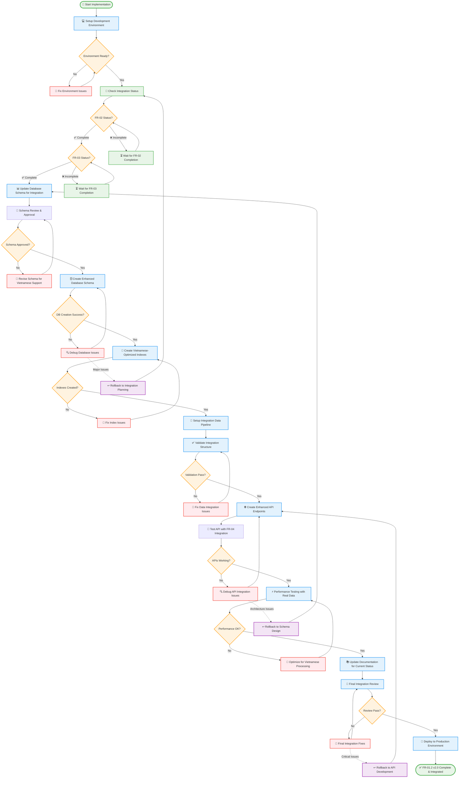
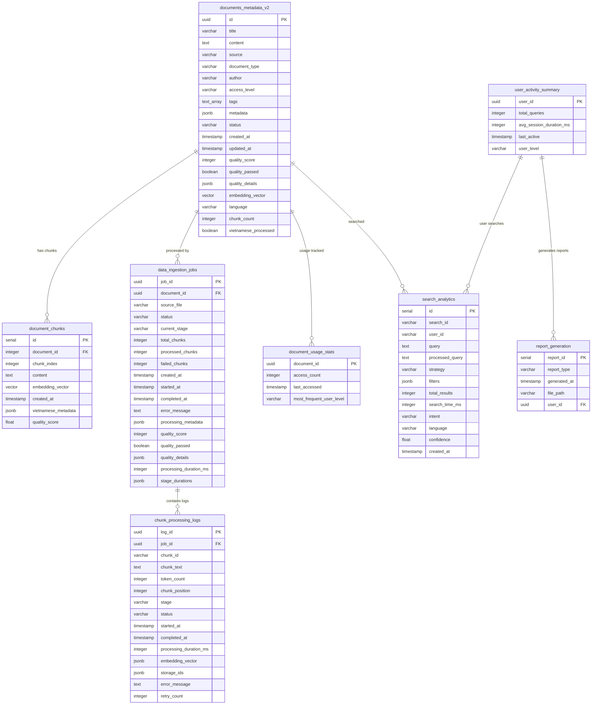
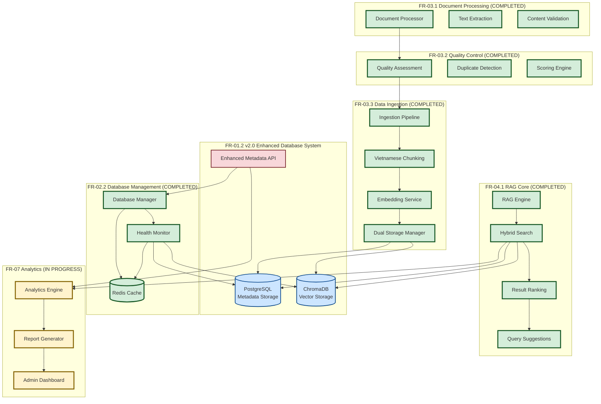
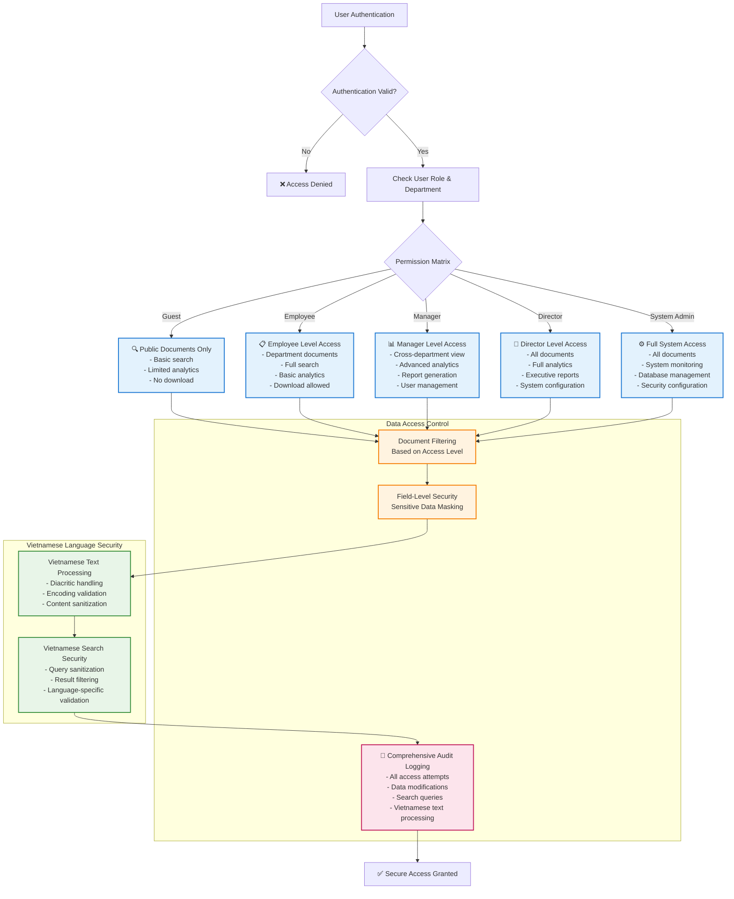
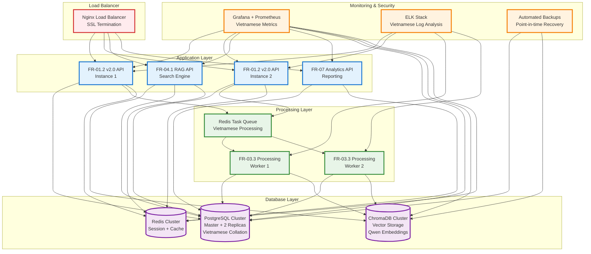

---
Ngày tạo 11-September-2025

---
Tôi sẽ đánh giá lại các sơ đồ trong tài liệu FR-01.2 để xem nội dung nào đã lạc hậu hoặc cần cập nhật.Dựa trên thông tin từ project knowledge, tôi thấy một số sơ đồ trong tài liệu FR-01.2 đã lạc hậu và cần cập nhật để phản ánh đúng trạng thái hiện tại của dự án. Sau đây là các sơ đồ cần được viết lại:

## 1. SƠ ĐỒ WORKFLOW IMPLEMENTATION CHUẨN HÓA

## 2. SƠ ĐỒ DATABASE SCHEMA HIỆN TẠI (CẬP NHẬT)

## 3. SƠ ĐỒ TÍCH HỢP HỆ THỐNG HIỆN TẠI

## 4. SƠ ĐỒ PHÂN QUYỀN VÀ BẢO MẬT NÂNG CAO

## 5. SƠ ĐỒ KIẾN TRÚC PRODUCTION HIỆN TẠI

Những sơ đồ mới này phản ánh đúng trạng thái hiện tại của dự án:

1. **FR-02, FR-03, FR-04 đã hoàn thành** và đang tích hợp
2. **Database schema đã được nâng cấp** với Vietnamese support
3. **Vector database và embedding** đã được triển khai
4. **Production architecture** đã được thiết lập
5. **Analytics module (FR-07)** đang trong quá trình phát triển

Các thay đổi chính so với tài liệu gốc:
- Cập nhật workflow để phản ánh dependencies đã hoàn thành
- Schema mới với Vietnamese optimization
- Integration architecture với các module đã complete
- Production deployment thực tế
- Security model nâng cao cho Vietnamese content
