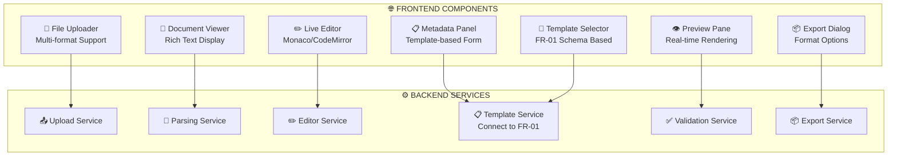

Bạn đúng rồi! Sau khi đọc tài liệu project, tôi hiểu rõ hơn về mối quan hệ giữa các module. Hãy cùng thiết kế lại FR-03.1 theo hướng mà bạn đề xuất:

# **🎯 TÁI THIẾT KẾ FR-03.1: DOCUMENT EDITOR & TEMPLATE PROCESSOR**

## **📋 PHÂN TÍCH YÊU CẦU MỚI**

### **🔄 Mối quan hệ với FR-01**
✅ **Template Schema** phải lấy từ **FR-01.2** - Cấu trúc Metadata chuẩn
✅ **Document Types** follow theo định nghĩa trong FR-01: `policy`, `procedure`, `technical_guide`, `report`
✅ **Metadata Fields** tuân theo schema đã định nghĩa: `document_id`, `source_file`, `version`, `department_owner`, etc.

### **🎯 Luồng xử lý mới**

```mermaid
graph LR
    subgraph "📥 INPUT"
        Upload[📄 Upload Document<br/>DOC, DOCX, PDF, TXT, MD]
        RawContent[📖 Raw Content<br/>Unstructured]
    end
    
    subgraph "🌐 WEB EDITOR"
        Parse[🔧 Parse & Display<br/>Structured View]
        Edit[✏️ Web Editor<br/>Live Editing]
        Preview[👁️ Live Preview<br/>Real-time]
    end
    
    subgraph "📋 TEMPLATE SYSTEM"
        SelectTemplate[🎯 Select Template<br/>Based on FR-01 Schema]
        ApplyTemplate[📐 Apply Template<br/>Metadata + Format]
        Validate[✅ Validate<br/>Business Rules]
    end
    
    subgraph "📤 OUTPUT"
        StandardMD[📝 Standard Markdown<br/>+ Metadata Header]
        Export[📦 Export Package<br/>Ready for FR-03.3]
    end
    
    Upload --> Parse
    Parse --> Edit
    Edit --> Preview
    Preview --> SelectTemplate
    SelectTemplate --> ApplyTemplate
    ApplyTemplate --> Validate
    Validate --> StandardMD
    StandardMD --> Export
    
    classDef input fill:#e3f2fd,stroke:#1976d2,stroke-width:2px
    classDef editor fill:#fff3e0,stroke:#f57c00,stroke-width:2px
    classDef template fill:#f3e5f5,stroke:#7b1fa2,stroke-width:2px
    classDef output fill:#e8f5e8,stroke:#388e3c,stroke-width:2px
    
    class Upload,RawContent input
    class Parse,Edit,Preview editor
    class SelectTemplate,ApplyTemplate,Validate template
    class StandardMD,Export output
```


---

## **🏗️ KIẾN TRÚC MODULE MỚI**

### **📱 Frontend: Web Document Editor**


---

## **📋 CHECKLIST PHÁT TRIỂN MỚI**

## **🚀 GIAI ĐOẠN 1: SETUP & INTEGRATION**

### **✅ Environment & Dependencies**
- [ ] **Setup Python 3.10.11** với all required packages
- [ ] **Install document parsers**: `python-docx`, `PyPDF2`, `markdown`
- [ ] **Frontend framework**: Next.js 18.x cho web editor
- [ ] **Rich text editor**: Monaco Editor hoặc TinyMCE
- [ ] **Real-time preview**: Markdown renderer với live update

### **✅ Integration với FR-01**
- [ ] **Connect to FR-01 database** để lấy template definitions
- [ ] **Import metadata schema** từ FR-01.2
- [ ] **Sync document types** và validation rules
- [ ] **Setup API calls** to FR-01 services cho template data

---

## **🚀 GIAI ĐOẠN 2: DOCUMENT PARSING & DISPLAY**

### **✅ Multi-format Parser**
```python
# Enhanced Document Parser
class DocumentParser:
    def parse_document(self, file_path: str, file_type: str) -> ParsedDocument:
        """Parse document và extract both content và structure"""
        if file_type == 'pdf':
            return self._parse_pdf(file_path)
        elif file_type in ['docx', 'doc']:
            return self._parse_docx(file_path)
        elif file_type == 'md':
            return self._parse_markdown(file_path)
        elif file_type == 'txt':
            return self._parse_text(file_path)
    
    def extract_structure(self, content: str) -> DocumentStructure:
        """Extract headers, paragraphs, tables, lists"""
        # Vietnamese text processing với underthesea
        pass
    
    def suggest_metadata(self, content: str) -> dict:
        """Auto-suggest metadata based on content analysis"""
        pass
```

### **✅ Web Document Viewer**
- [ ] **Structured display** với headers, paragraphs hierarchy
- [ ] **Table rendering** preserving original formatting
- [ ] **Image handling** và embedded media
- [ ] **Vietnamese text** proper rendering với diacritics
- [ ] **Search và highlight** functionality

---

## **🚀 GIAI ĐOẠN 3: WEB EDITOR IMPLEMENTATION**

### **✅ Live Editing Interface**
```typescript
// React component for document editor
interface DocumentEditorProps {
  initialContent: string;
  template: DocumentTemplate; // From FR-01
  onContentChange: (content: string) => void;
  onMetadataChange: (metadata: DocumentMetadata) => void;
}

const DocumentEditor: React.FC<DocumentEditorProps> = ({
  initialContent,
  template,
  onContentChange,
  onMetadataChange
}) => {
  return (
    <div className="editor-layout">
      <MetadataPanel template={template} onChange={onMetadataChange} />
      <ContentEditor content={initialContent} onChange={onContentChange} />
      <LivePreview content={content} metadata={metadata} />
    </div>
  );
};
```

### **✅ Core Editor Features**
- [ ] **Real-time editing** với debounced auto-save
- [ ] **Markdown syntax** highlighting và shortcuts
- [ ] **Vietnamese input** support với proper IME
- [ ] **Drag & drop** cho images và files
- [ ] **Collaborative editing** (future enhancement)

---

## **🚀 GIAI ĐOẠN 4: TEMPLATE INTEGRATION**

### **✅ Template Service từ FR-01**
```python
class TemplateIntegrationService:
    def get_available_templates(self) -> List[DocumentTemplate]:
        """Fetch templates từ FR-01 database"""
        # API call to FR-01.2 service
        pass
    
    def apply_template(self, 
                      content: str, 
                      metadata: dict, 
                      template_id: str) -> ProcessedDocument:
        """Apply template formatting và validation"""
        template = self.get_template(template_id)
        
        # Apply metadata schema từ FR-01
        validated_metadata = self.validate_metadata(metadata, template)
        
        # Format content theo template structure
        formatted_content = self.format_content(content, template)
        
        return ProcessedDocument(
            content=formatted_content,
            metadata=validated_metadata,
            template_id=template_id
        )
```

### **✅ Template Features**
- [ ] **Dynamic form generation** based on FR-01 schema
- [ ] **Real-time validation** với business rules từ FR-01
- [ ] **Template preview** cho different document types
- [ ] **Conditional fields** based on document_type selection
- [ ] **Multi-language support** cho Vietnamese/English

---

## **🚀 GIAI ĐOẠN 5: STANDARDIZED OUTPUT**

### **✅ Markdown với Metadata Header**
```markdown
---
document_id: "TECH_GUIDE_001_2025"
source_file: "/uploads/api_documentation.pdf"
version: "1.0"
department_owner: "rd"
author: "tech.lead@company.com"
title: "API Documentation Guide"
access_level: "employee_only"
document_type: "technical_guide"
tags: ["api", "documentation", "development"]
created_at: "2025-09-05T10:30:00Z"
last_updated: "2025-09-05T10:30:00Z"
---

# API Documentation Guide

## 1. Giới thiệu
Tài liệu này hướng dẫn cách tạo và maintain API documentation...

## 2. Cấu trúc API
### 2.1 RESTful Endpoints
...
```

### **✅ Export Options**
- [ ] **Standard Markdown** (.md) với YAML frontmatter
- [ ] **JSON Package** chứa content + metadata separated
- [ ] **HTML Export** với styled preview
- [ ] **PDF Export** cho archival purposes
- [ ] **Ready for FR-03.3** ingestion pipeline

---

## **🔧 CÔNG NGHỆ VÀ TOOLS**

### **Frontend Stack**
```json
{
  "framework": "Next.js 18.x",
  "editor": "Monaco Editor / CodeMirror",
  "ui": "Tailwind CSS + Headless UI",
  "state": "Zustand / React Query",
  "preview": "Marked.js + Prism.js"
}
```

### **Backend Stack**
```python
# requirements.txt
fastapi>=0.104.0
python-multipart>=0.0.6
python-docx>=0.8.11
PyPDF2>=3.0.1
markdown>=3.5.1
underthesea>=6.7.0
pyvi>=0.1.1
sentence-transformers>=2.2.2
```

---

## **🎯 OUTPUT CHUẨN CHO FR-03.3**

### **📦 Export Package Structure**
```
output/
├── document.md              # Main content với metadata header
├── metadata.json           # Structured metadata cho database
├── assets/                 # Images, attachments
│   ├── image1.png
│   └── diagram1.svg
└── processing_info.json    # Info cho FR-03.3 ingestion
```

### **📄 Processing Info for FR-03.3**
```json
{
  "document_id": "TECH_GUIDE_001_2025",
  "processing_status": "ready_for_ingestion",
  "content_file": "document.md",
  "metadata_file": "metadata.json",
  "assets_count": 2,
  "content_stats": {
    "word_count": 1250,
    "estimated_tokens": 1680,
    "suggested_chunk_size": 512,
    "language": "vi"
  },
  "quality_checks": {
    "metadata_complete": true,
    "content_structured": true,
    "vietnamese_processed": true,
    "ready_for_embedding": true
  }
}
```

---

## **🌟 KEY BENEFITS**

1. **🔗 Seamless Integration** với FR-01 metadata schema
2. **✏️ User-friendly** web editor cho content creation/editing  
3. **📋 Template-driven** processing đảm bảo consistency
4. **🇻🇳 Vietnamese-optimized** text processing
5. **📤 Standardized output** ready cho FR-03.3 ingestion
6. **⚡ Real-time preview** để ensure quality trước khi export

Thiết kế này sẽ tạo ra một công cụ mạnh mẽ để transform raw documents thành clean, structured content sẵn sàng cho RAG system, với user experience tốt và integration chặt chẽ với toàn bộ hệ thống!
