Nếu đã đủ thông tin hãy giúp tôi viết tài liệu thiết kế module dưới đây.
Tài liệu này cung cấp roadmap đầy đủ để implement FR-03.2 mà không cần code cụ thể nhưng 
có các bước làm cụ thể như chuẩn bị môi trường PC thế nào, phần mềm gì?
 để Team kỹ thuật có thể follow step-by-step guide này để thiết kế tối ưu cho hệ thống chatbot
 và có mermaidchart luồng công việc, điểm quay đầu khi bị fail.

3.3 Module Xử lý Dữ liệu (FR-03)
**FR-03.2 - Công cụ Đánh giá Chất lượng Dữ liệu**
- Phát hiện tài liệu trùng lặp (ngữ nghĩa và từ khóa)
- Xác định nội dung mơ hồ, mâu thuẫn
- Đánh giá độ hoàn chỉnh của metadata
- Báo cáo chất lượng trực quan
---
# TÀI LIỆU THIẾT KẾ MODULE - CÔNG CỤ ĐÁNH GIÁ CHẤT LƯỢNG DỮ LIỆU
## DATA QUALITY ASSESSMENT TOOL (FR-03.2)

---

**Module ID:** FR-03.2  
**Tên Module:** Công cụ Đánh giá Chất lượng Dữ liệu  
**Phiên bản:** 1.0  
**Ngày:** 31/08/2025  
**Người soạn thảo:** Chuyên gia Thiết kế Hệ thống  
**Trạng thái:** Ready for Implementation  

---

## 1. TỔNG QUAN MODULE

### 1.1 Mục đích
Module này đảm bảo chất lượng dữ liệu đầu vào cho hệ thống RAG bằng cách:
- Phát hiện và loại bỏ tài liệu trùng lặp (semantic & keyword-based)
- Xác định nội dung mơ hồ, mâu thuẫn trong tài liệu
- Đánh giá độ hoàn chỉnh của metadata
- Tạo báo cáo chất lượng trực quan cho stakeholders

### 1.2 Vị trí trong hệ thống
```
Raw Documents → [FR-03.1 Raw-to-Clean] → [FR-03.2 Quality Assessment] → [FR-03.3 Data Ingestion] → Vector DB
```

### 1.3 Input/Output
- **Input**: Clean documents từ FR-03.1 với metadata
- **Output**: Quality-validated documents + Quality Report + Rejected items log

---

## 2. CHUẨN BỊ MÔI TRƯỜNG PHÁT TRIỂN

### 2.1 Yêu cầu Hardware tối thiểu

| Component | Specification | Lý do |
|-----------|---------------|-------|
| **CPU** | 8 cores, 2.4GHz+ | Xử lý song song nhiều documents |
| **RAM** | 32GB+ | Load embedding models + vector operations |
| **Storage** | 1TB SSD | Fast I/O cho document processing |
| **GPU** | 8GB VRAM (optional) | Tăng tốc embedding generation |

### 2.2 Môi trường phần mềm

#### **Operating System**
```bash
# Recommended: Ubuntu 22.04 LTS hoặc CentOS 8+
# Windows 11 Pro (với WSL2) cũng được hỗ trợ
```

#### **Core Development Tools**

| Tool | Version | Installation Command | Purpose |
|------|---------|---------------------|---------|
| **Python** | 3.9+ | `sudo apt install python3.9 python3.9-venv` | Core language |
| **Node.js** | 18+ | `curl -fsSL https://deb.nodesource.com/setup_18.x \| sudo -E bash -` | Frontend dashboard |
| **Docker** | 24+ | `curl -fsSL https://get.docker.com -o get-docker.sh && sh get-docker.sh` | Containerization |
| **PostgreSQL** | 15+ | `sudo apt install postgresql-15 postgresql-client-15` | Metadata storage |
| **Redis** | 7+ | `sudo apt install redis-server` | Caching layer |

#### **Python Dependencies**
```bash
# Tạo virtual environment
python3 -m venv data_quality_env
source data_quality_env/bin/activate

# Core ML/NLP libraries
pip install torch>=2.0.0 transformers>=4.30.0
pip install sentence-transformers>=2.2.0
pip install scikit-learn>=1.3.0 numpy>=1.24.0 pandas>=2.0.0

# Text processing
pip install spacy>=3.6.0 nltk>=3.8.0
pip install textdistance>=4.5.0 fuzzywuzzy>=0.18.0

# Database & API
pip install psycopg2-binary>=2.9.0 redis>=4.5.0
pip install fastapi>=0.100.0 uvicorn>=0.22.0
pip install sqlalchemy>=2.0.0 alembic>=1.11.0

# Visualization & Reporting  
pip install plotly>=5.15.0 dash>=2.11.0
pip install matplotlib>=3.7.0 seaborn>=0.12.0
pip install reportlab>=4.0.0 jinja2>=3.1.0

# Quality assessment specific
pip install dedupe>=2.0.0 recordlinkage>=0.15.0
pip install textstat>=0.7.0 language-tool-python>=2.7.0
```

#### **Development Environment Setup**
```bash
# IDE Setup (chọn 1 trong các options)
# Option 1: VS Code
sudo snap install --classic code
code --install-extension ms-python.python
code --install-extension ms-toolsai.jupyter

# Option 2: PyCharm Professional
# Download từ JetBrains website

# Option 3: Jupyter Lab
pip install jupyterlab>=4.0.0
jupyter lab --generate-config
```

### 2.3 Database Setup

#### **PostgreSQL Configuration**
```sql
-- Tạo database và user
CREATE DATABASE data_quality_db;
CREATE USER dq_user WITH PASSWORD 'secure_password_here';
GRANT ALL PRIVILEGES ON DATABASE data_quality_db TO dq_user;

-- Tạo extensions cần thiết
\c data_quality_db;
CREATE EXTENSION IF NOT EXISTS "uuid-ossp";
CREATE EXTENSION IF NOT EXISTS "pg_trgm"; -- Cho fuzzy text matching
CREATE EXTENSION IF NOT EXISTS "btree_gin"; -- Tối ưu indexing
```

#### **Redis Configuration**
```bash
# Chỉnh sửa /etc/redis/redis.conf
maxmemory 8gb
maxmemory-policy allkeys-lru
save 900 1
save 300 10
```

---

## 3. KIẾN TRÚC MODULE VÀ LUỒNG CÔNG VIỆC

### 3.1 Module Architecture Overview

```mermaid
graph TB
    %% Input
    Input[📄 Clean Documents<br/>+ Metadata]
    
    %% Main Processing Engine
    subgraph "🔍 DATA QUALITY ASSESSMENT ENGINE"
        subgraph "1️⃣ Duplicate Detection"
            HashDup[🔢 Hash-based<br/>Duplicate Detection]
            SemDup[🧠 Semantic<br/>Duplicate Detection]
            KeywordDup[🔤 Keyword<br/>Duplicate Detection]
        end
        
        subgraph "2️⃣ Content Quality Analysis"
            AmbiguityDet[❓ Ambiguity<br/>Detector]
            ContradictDet[⚡ Contradiction<br/>Detector]
            ReadabilityCheck[📚 Readability<br/>Checker]
        end
        
        subgraph "3️⃣ Metadata Completeness"
            MetadataVal[✅ Metadata<br/>Validator]
            RequiredFields[📋 Required Fields<br/>Checker]
            DataTypes[🏷️ Data Type<br/>Validator]
        end
        
        subgraph "4️⃣ Quality Scoring"
            ScoreCalc[📊 Quality Score<br/>Calculator]
            RuleEngine[⚙️ Business Rules<br/>Engine]
            ThresholdCheck[🎯 Threshold<br/>Checker]
        end
    end
    
    %% Decision Point
    Decision{📋 Quality<br/>Passed?}
    
    %% Outputs
    Approved[✅ Approved<br/>Documents]
    Rejected[❌ Rejected<br/>Documents]
    Report[📊 Quality<br/>Report]
    
    %% Storage
    QualityDB[(🗄️ Quality<br/>Database)]
    Cache[(⚡ Redis<br/>Cache)]
    
    %% Flow
    Input --> HashDup
    Input --> SemDup
    Input --> KeywordDup
    Input --> AmbiguityDet
    Input --> ContradictDet
    Input --> ReadabilityCheck
    Input --> MetadataVal
    Input --> RequiredFields
    Input --> DataTypes
    
    HashDup --> ScoreCalc
    SemDup --> ScoreCalc
    KeywordDup --> ScoreCalc
    AmbiguityDet --> ScoreCalc
    ContradictDet --> ScoreCalc
    ReadabilityCheck --> ScoreCalc
    MetadataVal --> ScoreCalc
    RequiredFields --> ScoreCalc
    DataTypes --> ScoreCalc
    
    ScoreCalc --> RuleEngine
    RuleEngine --> ThresholdCheck
    ThresholdCheck --> Decision
    
    Decision -->|Yes| Approved
    Decision -->|No| Rejected
    
    Approved --> QualityDB
    Rejected --> QualityDB
    ScoreCalc --> Report
    
    %% Caching
    SemDup -.-> Cache
    ScoreCalc -.-> Cache
    
    %% Styling
    classDef input fill:#e3f2fd,stroke:#1976d2,stroke-width:2px
    classDef duplicate fill:#fff3e0,stroke:#f57c00,stroke-width:2px
    classDef content fill:#e8f5e8,stroke:#388e3c,stroke-width:2px
    classDef metadata fill:#f3e5f5,stroke:#7b1fa2,stroke-width:2px
    classDef scoring fill:#fce4ec,stroke:#c2185b,stroke-width:2px
    classDef decision fill:#ffebee,stroke:#c62828,stroke-width:3px
    classDef output fill:#e0f2f1,stroke:#00796b,stroke-width:2px
    classDef storage fill:#f1f8e9,stroke:#689f38,stroke-width:2px
    
    class Input input
    class HashDup,SemDup,KeywordDup duplicate
    class AmbiguityDet,ContradictDet,ReadabilityCheck content
    class MetadataVal,RequiredFields,DataTypes metadata
    class ScoreCalc,RuleEngine,ThresholdCheck scoring
    class Decision decision
    class Approved,Rejected,Report output
    class QualityDB,Cache storage
```



### 3.2 Detailed Workflow với Retry Logic

```mermaid
flowchart TD
    Start([🚀 Start Process])
    
    %% Input Validation
    InputCheck{📋 Input<br/>Valid?}
    InputFail[❌ Invalid Input<br/>Log Error]
    
    %% Duplicate Detection Phase
    DupPhase[🔍 Phase 1:<br/>Duplicate Detection]
    HashCheck[🔢 Hash Duplicate<br/>Check]
    HashFail{⚠️ Hash Check<br/>Failed?}
    HashRetry[🔄 Retry Hash<br/>Check (3x)]
    
    SemCheck[🧠 Semantic Duplicate<br/>Check]
    SemFail{⚠️ Semantic Check<br/>Failed?}
    SemRetry[🔄 Retry Semantic<br/>Check (3x)]
    
    KeywordCheck[🔤 Keyword Duplicate<br/>Check]
    KeywordFail{⚠️ Keyword Check<br/>Failed?}
    KeywordRetry[🔄 Retry Keyword<br/>Check (3x)]
    
    %% Content Quality Phase
    ContentPhase[📚 Phase 2:<br/>Content Quality]
    AmbiguityCheck[❓ Ambiguity<br/>Detection]
    AmbFail{⚠️ Ambiguity Check<br/>Failed?}
    AmbRetry[🔄 Retry Ambiguity<br/>Check (3x)]
    
    ContradictCheck[⚡ Contradiction<br/>Detection]
    ConFail{⚠️ Contradiction Check<br/>Failed?}
    ConRetry[🔄 Retry Contradiction<br/>Check (3x)]
    
    ReadabilityCheck[📖 Readability<br/>Assessment]
    ReadFail{⚠️ Readability Check<br/>Failed?}
    ReadRetry[🔄 Retry Readability<br/>Check (3x)]
    
    %% Metadata Phase
    MetadataPhase[🏷️ Phase 3:<br/>Metadata Validation]
    MetaCheck[✅ Metadata<br/>Completeness]
    MetaFail{⚠️ Metadata Check<br/>Failed?}
    MetaRetry[🔄 Retry Metadata<br/>Check (3x)]
    
    %% Scoring Phase
    ScoringPhase[📊 Phase 4:<br/>Quality Scoring]
    ScoreCalc[🧮 Calculate<br/>Quality Score]
    ScoreFail{⚠️ Scoring<br/>Failed?}
    ScoreRetry[🔄 Retry Scoring<br/>(3x)]
    
    %% Decision Phase
    Decision{🎯 Quality Score<br/>>= Threshold?}
    
    %% Output Handling
    Approve[✅ Approve<br/>Document]
    Reject[❌ Reject<br/>Document]
    
    %% Database Operations
    SaveApproved[💾 Save to<br/>Approved DB]
    SaveRejected[💾 Save to<br/>Rejected DB]
    
    SaveFail{⚠️ DB Save<br/>Failed?}
    SaveRetry[🔄 Retry DB Save<br/>(5x)]
    
    %% Report Generation
    GenReport[📊 Generate<br/>Quality Report]
    ReportFail{⚠️ Report Gen<br/>Failed?}
    ReportRetry[🔄 Retry Report<br/>Gen (3x)]
    
    %% Final States
    Success([✅ Process<br/>Completed])
    CriticalFail([💀 Critical<br/>Failure])
    
    %% Main Flow
    Start --> InputCheck
    InputCheck -->|Valid| DupPhase
    InputCheck -->|Invalid| InputFail
    InputFail --> CriticalFail
    
    %% Phase 1: Duplicate Detection
    DupPhase --> HashCheck
    HashCheck --> HashFail
    HashFail -->|Yes| HashRetry
    HashFail -->|No| SemCheck
    HashRetry -->|Max Retry| CriticalFail
    HashRetry -->|Retry| HashCheck
    
    SemCheck --> SemFail
    SemFail -->|Yes| SemRetry
    SemFail -->|No| KeywordCheck
    SemRetry -->|Max Retry| CriticalFail
    SemRetry -->|Retry| SemCheck
    
    KeywordCheck --> KeywordFail
    KeywordFail -->|Yes| KeywordRetry
    KeywordFail -->|No| ContentPhase
    KeywordRetry -->|Max Retry| CriticalFail
    KeywordRetry -->|Retry| KeywordCheck
    
    %% Phase 2: Content Quality
    ContentPhase --> AmbiguityCheck
    AmbiguityCheck --> AmbFail
    AmbFail -->|Yes| AmbRetry
    AmbFail -->|No| ContradictCheck
    AmbRetry -->|Max Retry| CriticalFail
    AmbRetry -->|Retry| AmbiguityCheck
    
    ContradictCheck --> ConFail
    ConFail -->|Yes| ConRetry
    ConFail -->|No| ReadabilityCheck
    ConRetry -->|Max Retry| CriticalFail
    ConRetry -->|Retry| ContradictCheck
    
    ReadabilityCheck --> ReadFail
    ReadFail -->|Yes| ReadRetry
    ReadFail -->|No| MetadataPhase
    ReadRetry -->|Max Retry| CriticalFail
    ReadRetry -->|Retry| ReadabilityCheck
    
    %% Phase 3: Metadata
    MetadataPhase --> MetaCheck
    MetaCheck --> MetaFail
    MetaFail -->|Yes| MetaRetry
    MetaFail -->|No| ScoringPhase
    MetaRetry -->|Max Retry| CriticalFail
    MetaRetry -->|Retry| MetaCheck
    
    %% Phase 4: Scoring
    ScoringPhase --> ScoreCalc
    ScoreCalc --> ScoreFail
    ScoreFail -->|Yes| ScoreRetry
    ScoreFail -->|No| Decision
    ScoreRetry -->|Max Retry| CriticalFail
    ScoreRetry -->|Retry| ScoreCalc
    
    %% Decision & Output
    Decision -->|Pass| Approve
    Decision -->|Fail| Reject
    
    Approve --> SaveApproved
    Reject --> SaveRejected
    
    SaveApproved --> SaveFail
    SaveRejected --> SaveFail
    
    SaveFail -->|Yes| SaveRetry
    SaveFail -->|No| GenReport
    SaveRetry -->|Max Retry| CriticalFail
    SaveRetry -->|Retry| SaveApproved
    
    GenReport --> ReportFail
    ReportFail -->|Yes| ReportRetry
    ReportFail -->|No| Success
    ReportRetry -->|Max Retry| CriticalFail
    ReportRetry -->|Retry| GenReport
    
    %% Styling
    classDef startEnd fill:#e3f2fd,stroke:#1976d2,stroke-width:3px
    classDef phase fill:#e8f5e8,stroke:#388e3c,stroke-width:2px
    classDef process fill:#fff3e0,stroke:#f57c00,stroke-width:2px
    classDef decision fill:#f3e5f5,stroke:#7b1fa2,stroke-width:2px
    classDef retry fill:#ffecb3,stroke:#f57f17,stroke-width:2px
    classDef fail fill:#ffebee,stroke:#c62828,stroke-width:2px
    classDef success fill:#e0f2f1,stroke:#00796b,stroke-width:2px
    
    class Start,Success,CriticalFail startEnd
    class DupPhase,ContentPhase,MetadataPhase,ScoringPhase phase
    class HashCheck,SemCheck,KeywordCheck,AmbiguityCheck,ContradictCheck,ReadabilityCheck,MetaCheck,ScoreCalc,SaveApproved,SaveRejected,GenReport process
    class InputCheck,HashFail,SemFail,KeywordFail,AmbFail,ConFail,ReadFail,MetaFail,ScoreFail,SaveFail,ReportFail,Decision decision
    class HashRetry,SemRetry,KeywordRetry,AmbRetry,ConRetry,ReadRetry,MetaRetry,ScoreRetry,SaveRetry,ReportRetry retry
    class InputFail fail
    class Approve,Reject success
```

---

## 4. IMPLEMENTATION ROADMAP (4 TUẦN)

### 4.1 Week 1: Core Infrastructure & Duplicate Detection

#### **Day 1-2: Environment Setup**
```bash
# Step 1: Clone repository structure
mkdir data_quality_module
cd data_quality_module
mkdir -p {src,tests,config,docs,scripts,data/{input,output,temp}}

# Step 2: Setup Python environment
python3 -m venv venv
source venv/bin/activate
pip install -r requirements.txt

# Step 3: Database setup
sudo -u postgres createdb data_quality_db
python scripts/init_db.py

# Step 4: Configuration
cp config/config.example.yaml config/config.yaml
# Edit config.yaml với database credentials
```

#### **Day 3-5: Hash-based Duplicate Detection**
```python
# File: src/duplicate_detection/hash_detector.py

"""
Implementation tasks:
1. MD5/SHA256 hash generation cho documents
2. Hash comparison algorithm
3. Near-duplicate detection using simhash
4. Database storage cho hash values
5. Batch processing optimization
"""

# Key algorithms to implement:
# - Exact hash matching: MD5, SHA256
# - Fuzzy hash matching: SimHash, TLSH
# - Content fingerprinting: MinHash, LSH
```

#### **Day 6-7: Semantic Duplicate Detection**
```python
# File: src/duplicate_detection/semantic_detector.py

"""
Implementation tasks:
1. Load pre-trained embedding model (sentence-transformers)
2. Generate document embeddings
3. Cosine similarity calculation
4. Clustering similar documents
5. Threshold tuning for semantic similarity
"""

# Key components:
# - Embedding model: all-MiniLM-L6-v2 or multilingual variants
# - Similarity metrics: Cosine, Euclidean, Jaccard
# - Clustering: KMeans, DBSCAN
# - Optimization: Approximate nearest neighbor (Annoy, FAISS)
```

### 4.2 Week 2: Content Quality Analysis

#### **Day 8-10: Ambiguity Detection**
```python
# File: src/content_analysis/ambiguity_detector.py

"""
Implementation approach:
1. Sentence-level ambiguity detection
   - Multiple interpretations
   - Unclear pronouns/references
   - Missing context

2. Word-level ambiguity
   - Polysemic words
   - Context-dependent meanings
   
3. Structural ambiguity
   - Grammar parsing issues
   - Sentence structure problems
"""

# Algorithms to implement:
# - Named Entity Recognition (NER) for unclear references
# - Part-of-speech tagging for grammatical ambiguity
# - Dependency parsing for structural issues
# - Custom rule-based patterns for domain-specific ambiguity
```

#### **Day 11-12: Contradiction Detection**
```python
# File: src/content_analysis/contradiction_detector.py

"""
Implementation strategy:
1. Within-document contradictions
   - Fact extraction and comparison
   - Negation detection
   - Temporal contradictions

2. Cross-document contradictions
   - Compare statements across documents
   - Version control conflicts
   - Policy contradictions
"""

# Technical approach:
# - Natural Language Inference (NLI) models
# - Fact extraction using Open Information Extraction
# - Negation scope detection
# - Temporal relation extraction
```

#### **Day 13-14: Readability Assessment**
```python
# File: src/content_analysis/readability_checker.py

"""
Metrics to implement:
1. Traditional readability scores
   - Flesch Reading Ease
   - Flesch-Kincaid Grade Level
   - SMOG Index
   - Coleman-Liau Index

2. Modern NLP-based metrics
   - Sentence complexity analysis
   - Vocabulary difficulty assessment
   - Technical jargon density
"""

# Implementation:
# - Use textstat library for traditional metrics
# - Custom analysis for technical content
# - Domain-specific vocabulary lists
# - Readability recommendations generator
```

### 4.3 Week 3: Metadata Validation & Scoring

#### **Day 15-17: Metadata Completeness Checker**
```python
# File: src/metadata_validation/completeness_checker.py

"""
Validation rules:
1. Required fields validation
   - document_id, title, author, department
   - creation_date, last_updated
   - access_level, document_type

2. Field format validation
   - Date format consistency
   - Email format for authors
   - Enum values for categories

3. Business logic validation
   - Department-author relationship
   - Access level permissions
   - Version numbering consistency
"""

# Schema definition:
metadata_schema = {
    "required_fields": ["document_id", "title", "author"],
    "optional_fields": ["tags", "description", "version"],
    "field_types": {
        "document_id": "uuid",
        "creation_date": "datetime",
        "access_level": "enum"
    },
    "business_rules": {
        "author_department_match": True,
        "version_increment": True
    }
}
```

#### **Day 18-19: Quality Scoring Engine**
```python
# File: src/scoring/quality_calculator.py

"""
Scoring algorithm:
Total Score = Σ(Component Score × Weight)

Components:
1. Duplicate Score (30%)
   - No duplicates: 100 points
   - Semantic similarity < 0.8: 80 points
   - High similarity: 0-50 points

2. Content Quality Score (40%)
   - Readability: 25%
   - Ambiguity level: 25%
   - Contradiction: 50%

3. Metadata Completeness (30%)
   - Required fields: 60%
   - Optional fields: 20%
   - Format compliance: 20%
"""

# Configurable thresholds:
quality_thresholds = {
    "excellent": 90,
    "good": 75,
    "acceptable": 60,
    "needs_improvement": 40,
    "reject": 0
}
```

#### **Day 20-21: Business Rules Engine**
```python
# File: src/scoring/rules_engine.py

"""
Rule categories:
1. Mandatory rules (auto-reject if failed)
   - Critical metadata missing
   - Exact duplicate found
   - Contains forbidden content

2. Scoring rules (affect quality score)
   - Readability below threshold
   - Ambiguous content detected
   - Incomplete metadata

3. Warning rules (flag for review)
   - Potential outdated information
   - Cross-references missing
   - Inconsistent formatting
"""

# Rule definition format:
rule_example = {
    "id": "META_001",
    "name": "Required Author Field",
    "type": "mandatory",
    "condition": "metadata.author is not null",
    "action": "reject",
    "message": "Author field is mandatory"
}
```

### 4.4 Week 4: Reporting & Integration

#### **Day 22-24: Quality Report Generation**
```python
# File: src/reporting/report_generator.py

"""
Report types:
1. Executive Summary
   - Overall quality metrics
   - Pass/fail statistics
   - Trending analysis

2. Technical Report
   - Detailed scoring breakdown
   - Failed validation rules
   - Recommended actions

3. Visual Dashboard
   - Interactive charts
   - Quality trends over time
   - Department-wise analysis
"""

# Report formats:
# - HTML dashboard (Plotly Dash)
# - PDF report (ReportLab)
# - JSON API response
# - Excel export
```

#### **Day 25-26: Web Dashboard Development**
```python
# File: src/dashboard/app.py

"""
Dashboard features:
1. Real-time quality monitoring
2. Document processing status
3. Quality trends visualization
4. Drill-down capability for failed documents
5. Bulk action interface
"""

# Tech stack:
# - Frontend: Plotly Dash
# - Backend: FastAPI
# - Database: PostgreSQL
# - Caching: Redis
```

#### **Day 27-28: Integration & Testing**
```python
# Integration checklist:
# 1. API endpoints cho external integration
# 2. Database migration scripts
# 3. Configuration management
# 4. Error handling và logging
# 5. Performance optimization
# 6. Unit tests và integration tests
# 7. Documentation update
```

---

## 5. CHI TIẾT TECHNICAL IMPLEMENTATION

### 5.1 Database Schema

```sql
-- Quality Assessment Tables
CREATE TABLE quality_assessments (
    id UUID PRIMARY KEY DEFAULT uuid_generate_v4(),
    document_id UUID NOT NULL,
    assessment_date TIMESTAMP DEFAULT NOW(),
    overall_score DECIMAL(5,2),
    status VARCHAR(20) CHECK (status IN ('approved', 'rejected', 'needs_review')),
    
    -- Duplicate detection results
    hash_duplicate_found BOOLEAN DEFAULT FALSE,
    semantic_similarity_score DECIMAL(5,4),
    keyword_similarity_score DECIMAL(5,4),
    
    -- Content quality results
    readability_score DECIMAL(5,2),
    ambiguity_score DECIMAL(5,2),
    contradiction_found BOOLEAN DEFAULT FALSE,
    
    -- Metadata quality
    metadata_completeness_score DECIMAL(5,2),
    required_fields_missing TEXT[],
    
    -- Additional metadata
    processing_time_ms INTEGER,
    quality_rules_applied JSONB,
    recommendations TEXT[],
    
    created_at TIMESTAMP DEFAULT NOW(),
    updated_at TIMESTAMP DEFAULT NOW()
);

CREATE TABLE duplicate_pairs (
    id UUID PRIMARY KEY DEFAULT uuid_generate_v4(),
    document_id_1 UUID NOT NULL,
    document_id_2 UUID NOT NULL,
    duplicate_type VARCHAR(20) CHECK (duplicate_type IN ('exact', 'semantic', 'keyword')),
    similarity_score DECIMAL(5,4),
    detected_at TIMESTAMP DEFAULT NOW()
);

CREATE TABLE quality_rules (
    id UUID PRIMARY KEY DEFAULT uuid_generate_v4(),
    rule_name VARCHAR(100) NOT NULL,
    rule_type VARCHAR(20) CHECK (rule_type IN ('mandatory', 'scoring', 'warning')),
    rule_condition TEXT NOT NULL,
    rule_action VARCHAR(50),
    rule_weight DECIMAL(3,2),
    is_active BOOLEAN DEFAULT TRUE,
    created_at TIMESTAMP DEFAULT NOW()
);

-- Indexes for performance
CREATE INDEX idx_quality_assessments_document_id ON quality_assessments(document_id);
CREATE INDEX idx_quality_assessments_status ON quality_assessments(status);
CREATE INDEX idx_quality_assessments_date ON quality_assessments(assessment_date);
CREATE INDEX idx_duplicate_pairs_doc1 ON duplicate_pairs(document_id_1);
CREATE INDEX idx_duplicate_pairs_doc2 ON duplicate_pairs(document_id_2);
```

### 5.2 API Specification

```python
# File: src/api/endpoints.py

from fastapi import FastAPI, HTTPException, BackgroundTasks
from pydantic import BaseModel
from typing import List, Optional

app = FastAPI(title="Data Quality Assessment API", version="1.0.0")

class QualityAssessmentRequest(BaseModel):
    document_id: str
    document_content: str
    metadata: dict
    assessment_options: Optional[dict] = {}

class QualityAssessmentResponse(BaseModel):
    document_id: str
    overall_score: float
    status: str
    detailed_results: dict
    recommendations: List[str]
    processing_time_ms: int

@app.post("/api/v1/assess-quality", response_model=QualityAssessmentResponse)
async def assess_document_quality(request: QualityAssessmentRequest):
    """
    Assess quality of a single document
    """
    # Implementation here
    pass

@app.post("/api/v1/batch-assess")
async def batch_assess_quality(
    documents: List[QualityAssessmentRequest],
    background_tasks: BackgroundTasks
):
    """
    Batch process multiple documents
    """
    # Implementation here
    pass

@app.get("/api/v1/quality-report/{document_id}")
async def get_quality_report(document_id: str):
    """
    Retrieve quality assessment report for specific document
    """
    # Implementation here
    pass

@app.get("/api/v1/quality-dashboard")
async def get_quality_dashboard():
    """
    Get dashboard data for quality overview
    """
    # Implementation here
    pass
```

### 5.3 Configuration Management

```yaml
# File: config/config.yaml

# Database Configuration
database:
  host: localhost
  port: 5432
  name: data_quality_db
  user: dq_user
  password: ${DB_PASSWORD}
  pool_size: 20
  max_overflow: 0

# Redis Configuration  
redis:
  host: localhost
  port: 6379
  db: 0
---
