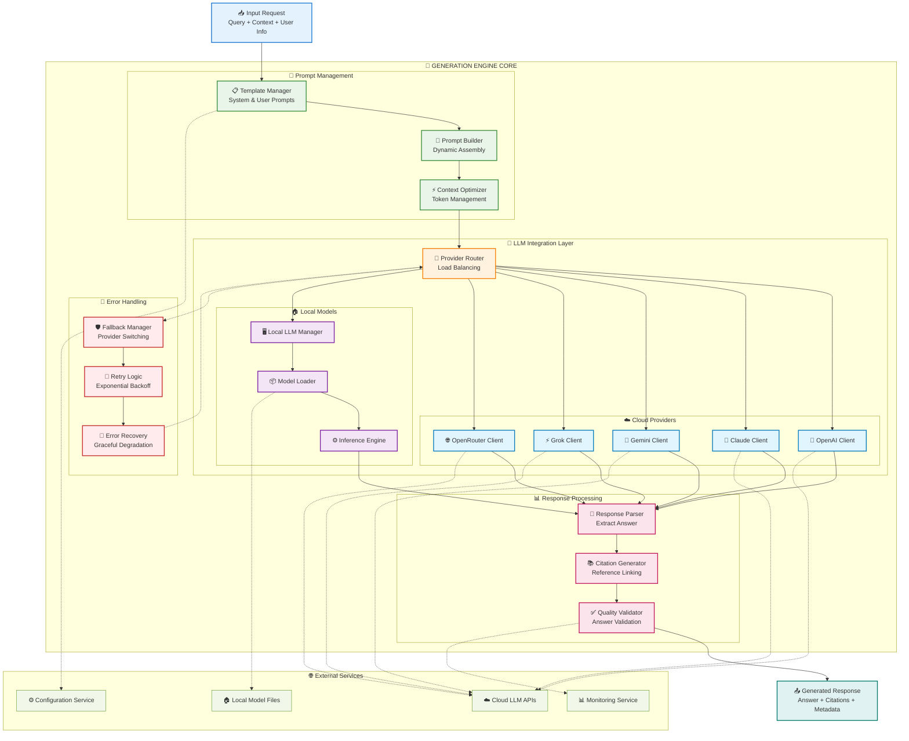
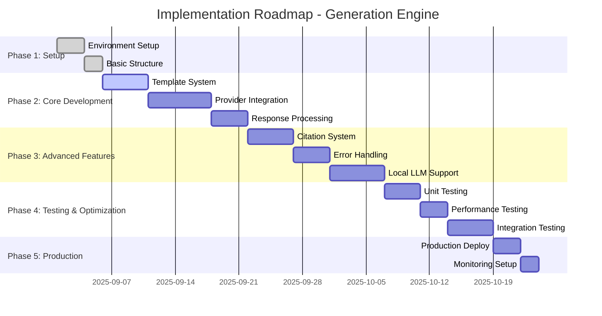

Nếu đã đủ thông tin hãy giúp tôi viết tài liệu thiết kế module dưới đây.
Tài liệu này cung cấp roadmap đầy đủ để implement FR-04.3 mà không cần code cụ thể nhưng 
có các bước làm cụ thể như chuẩn bị môi trường PC thế nào, phần mềm gì?
 để Team kỹ thuật có thể follow step-by-step guide này để thiết kế tối ưu cho hệ thống chatbot
 và có mermaidchart luồng công việc, điểm quay đầu khi bị fail.

### 3.4 Module RAG Core Engine (FR-04)

**FR-04.3 - Generation (Tạo sinh)**
- Tích hợp với LLM (OpenAI GPT, Anthropic Claude, hoặc local model)
- Sinh câu trả lời dựa trên context và câu hỏi
- Cung cấp citation/reference cho câu trả lời

---
# TÀI LIỆU THIẾT KẾ MODULE - RAG GENERATION ENGINE (FR-04.3)

---

**Module:** RAG Core Engine - Generation Service  
**Requirement:** FR-04.3 - Generation (Tạo sinh)  
**Phiên bản:** 1.0  
**Ngày:** 01/09/2025  
**Người soạn thảo:** Technical Design Team  

---

## 1. TỔNG QUAN MODULE

### 1.1 Mục đích
Module Generation Engine là thành phần quan trọng nhất trong RAG pipeline, chịu trách nhiệm:
- Tích hợp với các LLM providers (OpenAI, Anthropic Claude, Gemini, Grok, OpenRouter)
- Hỗ trợ local LLM models (Llama 2, Mistral, CodeLlama)
- Sinh câu trả lời chất lượng cao dựa trên context đã được retrieve
- Cung cấp citation và reference chính xác
- Xử lý fallback và error recovery

### 1.2 Input/Output Specification

**Input:**
```json
{
  "query": "Quy trình mua hàng trình giám đốc như thế nào?",
  "context_chunks": [
    {
      "chunk_id": "doc123_chunk_5",
      "content": "Bước 1: Tạo yêu cầu mua hàng...",
      "metadata": {
        "document_id": "proc_001",
        "title": "Quy trình Mua hàng",
        "page": 2,
        "confidence_score": 0.95
      }
    }
  ],
  "user_context": {
    "user_id": "emp001",
    "department": "rd",
    "access_level": "employee"
  },
  "conversation_history": []
}
```

**Output:**
```json
{
  "answer": "Quy trình mua hàng trình giám đốc gồm 5 bước chính...",
  "citations": [
    {
      "chunk_id": "doc123_chunk_5", 
      "reference": "[1] Quy trình Mua hàng, trang 2",
      "used_content": "Bước 1: Tạo yêu cầu mua hàng..."
    }
  ],
  "confidence_score": 0.92,
  "response_metadata": {
    "model_used": "openai-gpt-4",
    "tokens_used": 1250,
    "processing_time": 2.3,
    "cost_estimate": 0.025
  }
}
```

---

## 2. THIẾT KẾ KIẾN TRÚC MODULE

### 2.1 Architecture Overview



---

## 3. CHUẨN BỊ MÔI TRƯỜNG PHÁT TRIỂN

### 3.1 Hardware Requirements

**Minimum Requirements:**
- **CPU**: Intel i7/AMD Ryzen 7 (8 cores)
- **RAM**: 32GB (64GB recommended cho local LLM)
- **GPU**: NVIDIA RTX 3080/4080 (12GB+ VRAM) cho local inference
- **Storage**: 1TB NVMe SSD
- **Network**: Stable internet connection (minimum 100Mbps)

**Recommended Production Setup:**
- **CPU**: Intel Xeon/AMD EPYC (16+ cores)
- **RAM**: 128GB+
- **GPU**: NVIDIA A100/H100 cho production local LLM
- **Storage**: 2TB+ NVMe SSD với RAID configuration

### 3.2 Software Environment Setup

#### 3.2.1 Base Environment
```bash
# 1. Operating System
Ubuntu 22.04 LTS hoặc CentOS 8+
Windows 11 Pro (cho development)

# 2. Container Platform
Docker Desktop 4.20+
Docker Compose 2.18+
Kubernetes 1.27+ (cho production)

# 3. Programming Languages
Python 3.11+
Node.js 18+ (cho monitoring dashboard)
Go 1.21+ (optional, cho high-performance components)
```

#### 3.2.2 Python Environment
```bash
# Tạo virtual environment
python3.11 -m venv llm_generation_env
source llm_generation_env/bin/activate  # Linux/Mac
# llm_generation_env\Scripts\activate  # Windows

# Core packages
pip install --upgrade pip setuptools wheel

# LLM Integration
pip install openai==1.30.0
pip install anthropic==0.28.0
pip install google-cloud-aiplatform==1.51.0
pip install transformers==4.37.0
pip install torch==2.2.0 torchvision==0.17.0 torchaudio==2.2.0
pip install accelerate==0.27.0
pip install bitsandbytes==0.42.0

# API & Web Framework
pip install fastapi==0.109.0
pip install uvicorn==0.27.0
pip install httpx==0.26.0
pip install aiofiles==23.2.1

# Monitoring & Logging
pip install prometheus-client==0.19.0
pip install structlog==23.2.0
pip install sentry-sdk==1.40.0

# Data Processing
pip install pydantic==2.5.0
pip install tiktoken==0.6.0
pip install jinja2==3.1.3

# Testing
pip install pytest==8.0.0
pip install pytest-asyncio==0.23.0
pip install httpx==0.26.0
```

#### 3.2.3 Local LLM Setup (Optional)
```bash
# Ollama cho easy local LLM deployment
curl -fsSL https://ollama.ai/install.sh | sh

# HuggingFace Hub
pip install huggingface-hub==0.20.0

# vLLM cho high-performance inference
pip install vllm==0.3.0

# Text Generation Inference (TGI)
docker pull ghcr.io/huggingface/text-generation-inference:1.4
```

#### 3.2.4 Configuration Management
```bash
# Environment management
pip install python-dotenv==1.0.0
pip install pyyaml==6.0.1

# Secret management
pip install cryptography==42.0.0
pip install keyring==24.3.0
```

### 3.3 Development Tools

#### 3.3.1 IDE & Code Editor
```bash
# VS Code với extensions
- Python
- Pylance
- Docker
- Kubernetes
- REST Client
- GitLens

# JetBrains PyCharm Professional (recommended)
# Vim/Neovim với Python LSP setup
```

#### 3.3.2 Testing & Quality Tools
```bash
# Code formatting & linting
pip install black==24.0.0
pip install isort==5.13.0  
pip install flake8==7.0.0
pip install mypy==1.8.0

# Security scanning
pip install bandit==1.7.5
pip install safety==3.0.0

# Load testing
pip install locust==2.20.0
```

#### 3.3.3 Database & Cache
```bash
# Redis cho caching
docker run -d --name redis-cache -p 6379:6379 redis:7-alpine

# PostgreSQL cho metadata
docker run -d --name postgres-meta \
  -e POSTGRES_PASSWORD=dev_password \
  -p 5432:5432 postgres:15-alpine
```

---

## 4. IMPLEMENTATION ROADMAP

### 4.1 Development Phases



### 4.2 Detailed Implementation Steps

#### 4.2.1 Phase 1: Environment & Structure Setup (5 days)

**Day 1-3: Environment Setup**
```bash
# Step 1: Tạo project structure
mkdir rag-generation-engine
cd rag-generation-engine

mkdir -p {
  src/generation_engine/{core,providers,templates,utils},
  tests/{unit,integration,performance},
  configs/{development,staging,production},
  docs/{api,deployment},
  scripts/{setup,deployment,testing},
  docker/{development,production},
  monitoring/{prometheus,grafana}
}

# Step 2: Initialize Python project
touch src/generation_engine/__init__.py
touch requirements/{base.txt,dev.txt,prod.txt}
touch {.env.example,.gitignore,README.md,Dockerfile,docker-compose.yml}

# Step 3: Setup virtual environment
python3.11 -m venv venv
source venv/bin/activate
pip install -r requirements/dev.txt
```

**Day 4-5: Basic Project Structure**
```python
# src/generation_engine/core/models.py
from pydantic import BaseModel
from typing import List, Optional, Dict, Any
from enum import Enum

class LLMProvider(str, Enum):
    OPENAI = "openai"
    CLAUDE = "claude"
    GEMINI = "gemini"
    GROK = "grok"
    OPENROUTER = "openrouter"
    LOCAL = "local"

class GenerationRequest(BaseModel):
    query: str
    context_chunks: List[Dict[str, Any]]
    user_context: Dict[str, Any]
    conversation_history: Optional[List[Dict[str, str]]] = []
    preferred_provider: Optional[LLMProvider] = None

class GenerationResponse(BaseModel):
    answer: str
    citations: List[Dict[str, Any]]
    confidence_score: float
    response_metadata: Dict[str, Any]
```

#### 4.2.2 Phase 2: Core Development (16 days)

**Days 6-10: Template Management System**

**Checkpoint 1**: Template System hoạt động cơ bản
```python
# src/generation_engine/templates/manager.py
class TemplateManager:
    """Quản lý system và user prompt templates"""
    
    def __init__(self, config_path: str):
        self.templates = self._load_templates(config_path)
        
    def get_system_prompt(self, context_type: str) -> str:
        """Lấy system prompt theo loại context"""
        pass
        
    def build_user_prompt(self, query: str, context: List[str]) -> str:
        """Xây dựng user prompt với query và context"""
        pass

# configs/prompts/system_prompts.yaml
vietnamese_qa:
  template: |
    Bạn là một trợ lý AI chuyên nghiệp của công ty kỹ thuật hàng không.
    Nhiệm vụ của bạn là trả lời câu hỏi dựa trên tài liệu nội bộ được cung cấp.
    
    QUY TÂC QUAN TRỌNG:
    1. Chỉ trả lời dựa trên thông tin trong context được cung cấp
    2. Nếu không có thông tin, hãy nói "Tôi không tìm thấy thông tin này trong tài liệu"
    3. Luôn cung cấp nguồn tham khảo [số] cho mỗi thông tin
    4. Trả lời bằng tiếng Việt chuyên nghiệp
```

**Days 11-17: Provider Integration**

**Checkpoint 2**: Tích hợp thành công với ít nhất 2 providers (OpenAI + Claude)
```python
# src/generation_engine/providers/base.py
from abc import ABC, abstractmethod

class BaseLLMProvider(ABC):
    def __init__(self, config: Dict[str, Any]):
        self.config = config
        
    @abstractmethod
    async def generate(self, prompt: str, **kwargs) -> Dict[str, Any]:
        """Generate response từ LLM"""
        pass
        
    @abstractmethod
    def estimate_cost(self, input_tokens: int, output_tokens: int) -> float:
        """Ước tính chi phí API call"""
        pass

# src/generation_engine/providers/openai_provider.py
import openai
from .base import BaseLLMProvider

class OpenAIProvider(BaseLLMProvider):
    def __init__(self, config: Dict[str, Any]):
        super().__init__(config)
        self.client = openai.AsyncOpenAI(
            api_key=config["api_key"]
        )
    
    async def generate(self, prompt: str, **kwargs) -> Dict[str, Any]:
        response = await self.client.chat.completions.create(
            model=self.config.get("model", "gpt-4-turbo-preview"),
            messages=[{"role": "user", "content": prompt}],
            temperature=kwargs.get("temperature", 0.1),
            max_tokens=kwargs.get("max_tokens", 1000)
        )
        
        return {
            "text": response.choices[0].message.content,
            "tokens_used": response.usage.total_tokens,
            "model": response.model
        }
```

**Days 18-21: Response Processing**

**Checkpoint 3**: Response parsing và citation generation hoạt động
```python
# src/generation_engine/core/citation.py
class CitationGenerator:
    def __init__(self):
        self.citation_pattern = r'\[(\d+)\]'
        
    def generate_citations(self, answer: str, context_chunks: List[Dict]) -> List[Dict]:
        """Tạo citations từ answer và context chunks"""
        citations = []
        
        # Extract citation numbers from answer
        cited_numbers = re.findall(self.citation_pattern, answer)
        
        for num_str in cited_numbers:
            num = int(num_str) - 1  # Convert to 0-based index
            if num < len(context_chunks):
                chunk = context_chunks[num]
                citations.append({
                    "number": int(num_str),
                    "chunk_id": chunk["chunk_id"],
                    "reference": f"[{num_str}] {chunk['metadata']['title']}, trang {chunk['metadata'].get('page', 'N/A')}",
                    "used_content": chunk["content"][:200] + "..."
                })
        
        return citations
```

#### 4.2.3 Phase 3: Advanced Features (15 days)

**Days 22-26: Citation System Enhancement**

**Checkpoint 4**: Advanced citation với confidence scoring
```python
# src/generation_engine/core/citation_advanced.py
class AdvancedCitationGenerator:
    def __init__(self, embedding_model):
        self.embedding_model = embedding_model
        
    def calculate_citation_relevance(self, answer_part: str, context_chunk: str) -> float:
        """Tính toán độ liên quan giữa phần answer và context chunk"""
        # Sử dụng embedding similarity
        answer_embedding = self.embedding_model.encode([answer_part])
        context_embedding = self.embedding_model.encode([context_chunk])
        
        similarity = cosine_similarity(answer_embedding, context_embedding)[0][0]
        return float(similarity)
```

**Days 27-30: Error Handling & Fallback**

**Checkpoint 5**: Robust error handling với multiple fallback strategies
```python
# src/generation_engine/core/fallback.py
class FallbackManager:
    def __init__(self, providers: List[BaseLLMProvider]):
        self.providers = providers
        self.current_provider_index = 0
        
    async def generate_with_fallback(self, request: GenerationRequest) -> GenerationResponse:
        """Thử generate với fallback giữa các providers"""
        last_error = None
        
        for attempt in range(len(self.providers)):
            provider = self.providers[self.current_provider_index]
            
            try:
                result = await provider.generate(request)
                return result
                
            except Exception as e:
                last_error = e
                logger.warning(f"Provider {provider.__class__.__name__} failed: {e}")
                self.current_provider_index = (self.current_provider_index + 1) % len(self.providers)
                
                # Exponential backoff
                await asyncio.sleep(2 ** attempt)
        
        # Nếu tất cả providers đều fail
        raise GenerationError(f"All providers failed. Last error: {last_error}")
```

**Days 31-36: Local LLM Support**

**Checkpoint 6**: Local LLM integration hoạt động
```python
# src/generation_engine/providers/local_provider.py
class LocalLLMProvider(BaseLLMProvider):
    def __init__(self, config: Dict[str, Any]):
        super().__init__(config)
        self.model_name = config["model_name"]  # "llama2-7b-chat"
        self.inference_engine = self._setup_inference_engine()
        
    def _setup_inference_engine(self):
        if self.config["engine"] == "vllm":
            from vllm import LLM, SamplingParams
            return LLM(model=self.model_name)
        elif self.config["engine"] == "ollama":
            import ollama
            return ollama
        else:
            raise ValueError(f"Unsupported inference engine: {self.config['engine']}")
    
    async def generate(self, prompt: str, **kwargs) -> Dict[str, Any]:
        if self.config["engine"] == "vllm":
            sampling_params = SamplingParams(
                temperature=kwargs.get("temperature", 0.1),
                max_tokens=kwargs.get("max_tokens", 1000)
            )
            outputs = self.inference_engine.generate([prompt], sampling_params)
            
            return {
                "text": outputs[0].outputs[0].text,
                "tokens_used": len(outputs[0].outputs[0].token_ids),
                "model": self.model_name
            }
```

#### 4.2.4 Phase 4: Testing & Optimization (12 days)

**Days 37-40: Unit Testing**

**Checkpoint 7**: Test coverage > 80%
```python
# tests/unit/test_generation_core.py
import pytest
from unittest.mock import Mock, patch
from src.generation_engine.core.engine import GenerationEngine

class TestGenerationEngine:
    @pytest.fixture
    def mock_providers(self):
        return [Mock(), Mock(), Mock()]
    
    @pytest.fixture 
    def generation_engine(self, mock_providers):
        config = {"providers": mock_providers}
        return GenerationEngine(config)
    
    @pytest.mark.asyncio
    async def test_generate_success(self, generation_engine):
        # Setup
        request = GenerationRequest(
            query="Test query",
            context_chunks=[{"content": "test context"}],
            user_context={"user_id": "test_user"}
        )
        
        # Mock provider response
        generation_engine.providers[0].generate.return_value = {
            "text": "Test answer [1]",
            "tokens_used": 100,
            "model": "gpt-4"
        }
        
        # Test
        response = await generation_engine.generate(request)
        
        # Assert
        assert response.answer == "Test answer [1]"
        assert len(response.citations) == 1
        assert response.confidence_score > 0
```

**Days 41-43: Performance Testing**

**Checkpoint 8**: Performance benchmarks established
```python
# tests/performance/test_load.py
import asyncio
import time
from locust import HttpUser, task, between

class GenerationLoadTest(HttpUser):
    wait_time = between(1, 3)
    
    @task
    def test_generation_endpoint(self):
        payload = {
            "query": "Quy trình mua hàng như thế nào?",
            "context_chunks": [
                {
                    "content": "Bước 1: Tạo yêu cầu mua hàng...",
                    "metadata": {"title": "Quy trình mua hàng"}
                }
            ],
            "user_context": {"user_id": "test_user"}
        }
        
        with self.client.post("/api/generate", json=payload, catch_response=True) as response:
            if response.status_code == 200:
                json_response = response.json()
                if "answer" in json_response and "citations" in json_response:
                    response.success()
                else:
                    response.failure("Invalid response format")
            else:
                response.failure(f"HTTP {response.status_code}")

# Run với: locust -f tests/performance/test_load.py --host=http://localhost:8000
```

**Days 44-48: Integration Testing**

**Checkpoint 9**: End-to-end integration tests pass
```python
# tests/integration/test_full_pipeline.py
@pytest.mark.integration
class TestFullPipeline:
    @pytest.mark.asyncio
    async def test_end_to_end_generation(self):
        """Test complete pipeline từ request đến response"""
        
        # Setup real providers (với test API keys)
        config = load_test_config()
        engine = GenerationEngine(config)
        
        # Real request
        request = GenerationRequest(
            query="Quy trình mua hàng trình giám đốc như thế nào?",
            context_chunks=[
                {
                    "chunk_id": "test_chunk_1",
                    "content": "Quy trình mua hàng gồm 5 bước: 1) Tạo yêu cầu...",
                    "metadata": {
                        "document_id": "proc_001",
                        "title": "Quy trình Mua hàng",
                        "page": 1
                    }
                }
            ],
            user_context={
                "user_id": "test_user",
                "department": "rd", 
                "access_level": "employee"
            }
        )
        
        # Execute
        start_time = time.time()
        response = await engine.generate(request)
        end_time = time.time()
        
        # Assertions
        assert response.answer is not None
        assert len(response.answer) > 50  # Reasonable answer length
        assert response.confidence_score >= 0.5
        assert len(response.citations) > 0
        assert (end_time - start_time) < 60  # Under 60 seconds requirement
        assert response.response_metadata["tokens_used"] > 0
```

---

## 5. WORKFLOW VÀ ERROR HANDLING

### 5.1 Main Processing Workflow

```mermaid
flowchart TD
    Start([🚀 Start Generation Request]) --> ValidateInput{✅ Validate Input}
    
    ValidateInput -->|❌ Invalid| InputError[❌ Input Validation Error]
    ValidateInput -->|✅ Valid| SelectProvider[🎯 Select LLM Provider]
    
    SelectProvider --> CheckCache{💾 Check Response Cache}
    CheckCache -->|✅ Hit| ReturnCached[📋 Return Cached Response]
    CheckCache -->|❌ Miss| BuildPrompt[📝 Build Prompt Template]
    
    BuildPrompt --> OptimizeContext[⚡ Optimize Context Length]
    OptimizeContext --> CallLLM[🧠 Call LLM Provider]
    
    CallLLM --> LLMSuccess{✅ LLM Call Success?}
    
    %% Success Path
    LLMSuccess -->|✅ Success| ParseResponse[📄 Parse LLM Response]
    ParseResponse --> GenerateCitations[📚 Generate Citations]
    GenerateCitations --> ValidateQuality[🔍 Validate Response Quality]
    
    ValidateQuality --> QualityOK{✅ Quality OK?}
    QualityOK -->|✅ Pass| CacheResponse[💾 Cache Response]
    QualityOK -->|❌ Fail| RetryDifferentProvider[🔄 Retry with Different Provider]
    
    CacheResponse --> LogMetrics[📊 Log Performance Metrics]
    LogMetrics --> Success([✅ Return Success Response])
    
    %% Error Handling Paths
    LLMSuccess -->|❌ Fail| CheckErrorType{🔍 Check Error Type}
    
    CheckErrorType -->|🚫 Rate Limit| WaitAndRetry[⏳ Wait and Retry<br/>Exponential Backoff]
    CheckErrorType -->|💰 Quota Exceeded| SwitchProvider[🔄 Switch to Next Provider]
    CheckErrorType -->|🌐 Network Error| RetryCurrentProvider[🔄 Retry Current Provider]
    CheckErrorType -->|🔑 Auth Error| ProviderError[❌ Provider Auth Error]
    CheckErrorType -->|❓ Other Error| GenericError[❌ Generic Error]
    
    %% Retry Logic
    WaitAndRetry --> RetryAttempt{🔢 Retry Attempt < Max?}
    RetryAttempt -->|✅ Yes| CallLLM
    RetryAttempt -->|❌ No| SwitchProvider
    
    RetryCurrentProvider --> Retry
