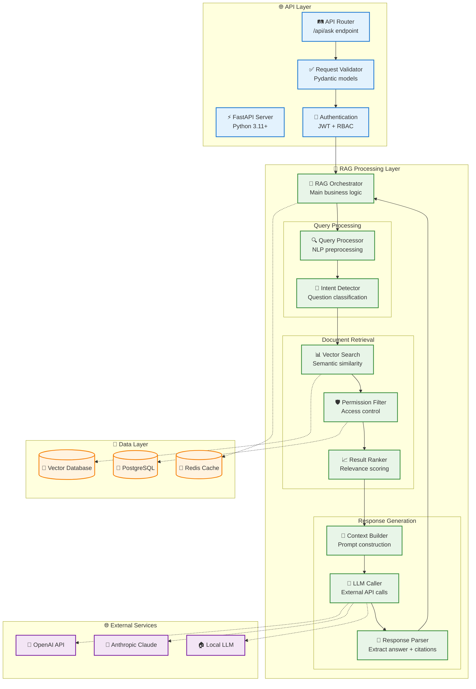
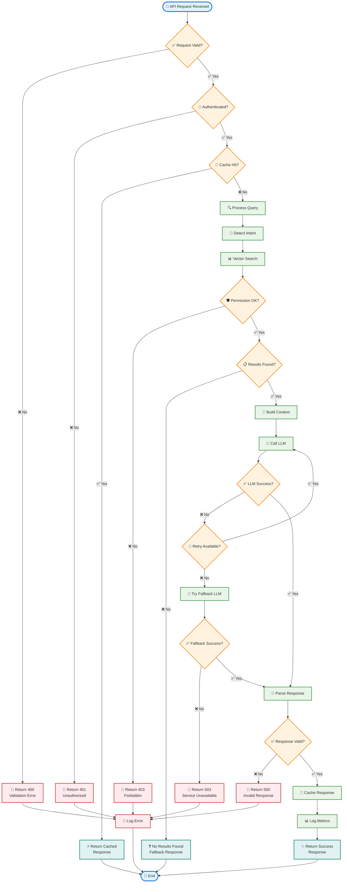
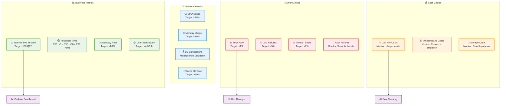

Nếu đã đủ thông tin hãy giúp tôi viết tài liệu thiết kế module dưới đây.
Tài liệu này cung cấp roadmap đầy đủ để implement FR-04.4 mà không cần code cụ thể nhưng 
có các bước làm cụ thể như chuẩn bị môi trường PC thế nào, phần mềm gì?
 để Team kỹ thuật có thể follow step-by-step guide này để thiết kế tối ưu cho hệ thống chatbot
 và có mermaidchart luồng công việc, điểm quay đầu khi bị fail.

### 3.4 Module RAG Core Engine (FR-04)

**FR-04.4 - API Endpoint**
- `/api/ask` - Endpoint chính cho chatbot
- Input: user_query, user_id, session_id
- Output: answer, references, confidence_score
---

# TÀI LIỆU THIẾT KẾ MODULE RAG CORE ENGINE
## API ENDPOINT IMPLEMENTATION GUIDE (FR-04.4)

---

**Module:** RAG Core Engine - API Endpoint  
**Feature ID:** FR-04.4  
**Phiên bản:** 1.0  
**Ngày tạo:** 01/09/2025  
**Người soạn thảo:** Technical Architecture Team  

---

## 📋 **MỤC LỤC**
1. [Tổng quan Module](#1-tổng-quan-module)
2. [Kiến trúc API Endpoint](#2-kiến-trúc-api-endpoint)
3. [Chuẩn bị Môi trường Phát triển](#3-chuẩn-bị-môi-trường-phát-triển)
4. [Roadmap Implementation](#4-roadmap-implementation)
5. [Luồng xử lý chi tiết](#5-luồng-xử-lý-chi-tiết)
6. [Error Handling & Recovery](#6-error-handling--recovery)
7. [Testing Strategy](#7-testing-strategy)
8. [Monitoring & Performance](#8-monitoring--performance)

---

## 1. **TỔNG QUAN MODULE**

### 1.1 Mô tả chức năng
API Endpoint `/api/ask` là trái tim của hệ thống RAG, xử lý tất cả các yêu cầu từ chatbot frontend và trả về câu trả lời thông minh dựa trên tri thức nội bộ.

### 1.2 Input/Output Specification

**📥 INPUT:**
```json
{
  "user_query": "Quy trình mua hàng trình giám đốc như thế nào?",
  "user_id": "emp001", 
  "session_id": "sess_20250901_001",
  "department": "rd",
  "language": "vi",
  "context_history": ["previous_question_1", "previous_question_2"],
  "max_results": 5,
  "include_citations": true
}
```

**📤 OUTPUT:**
```json
{
  "status": "success",
  "answer": "Quy trình mua hàng trình giám đốc gồm 5 bước chính...",
  "references": [
    {
      "doc_id": "proc_001",
      "title": "Quy trình Mua hàng Công ty",
      "chunk_text": "Bước 1: Tạo yêu cầu mua hàng trong hệ thống...",
      "confidence_score": 0.95,
      "page_number": 3,
      "section": "2.1 Quy trình cơ bản"
    }
  ],
  "confidence_score": 0.89,
  "response_time_ms": 2340,
  "session_id": "sess_20250901_001",
  "cached": false,
  "fallback_used": false
}
```

### 1.3 Performance Requirements
- **Response Time**: < 60 seconds (target: < 10 seconds)
- **Throughput**: 100 concurrent requests
- **Availability**: 99.5% uptime
- **Accuracy**: ≥80% relevant responses

---

## 2. **KIẾN TRÚC API ENDPOINT**

### 2.1 Component Architecture



---

## 3. **CHUẨN BỊ MÔI TRƯỜNG PHÁT TRIỂN**

### 3.1 Hardware Requirements

| Component | Minimum | Recommended | Optimal |
|-----------|---------|-------------|---------|
| **CPU** | 8 cores | 16 cores | 32 cores |
| **RAM** | 16GB | 32GB | 64GB |
| **Storage** | 500GB SSD | 1TB NVMe SSD | 2TB NVMe SSD |
| **GPU** | None | RTX 3080 (12GB) | RTX 4090 (24GB) |
| **Network** | 1Gbps | 10Gbps | 10Gbps+ |

### 3.2 Software Stack Setup

#### 3.2.1 Operating System
```bash
# Ubuntu 22.04 LTS (Recommended)
sudo apt update && sudo apt upgrade -y
sudo apt install build-essential curl wget git -y
```

#### 3.2.2 Python Environment
```bash
# Python 3.11+ với pyenv
curl https://pyenv.run | bash
pyenv install 3.11.5
pyenv global 3.11.5

# Poetry cho dependency management  
curl -sSL https://install.python-poetry.org | python3 -
```

#### 3.2.3 Database Setup
```bash
# PostgreSQL 15+
sudo apt install postgresql-15 postgresql-contrib-15
sudo systemctl enable postgresql
sudo systemctl start postgresql

# Redis 7+
sudo apt install redis-server
sudo systemctl enable redis-server
sudo systemctl start redis-server
```

#### 3.2.4 Vector Database
```bash
# Option 1: Chroma (Recommended for development)
pip install chromadb

# Option 2: FAISS (For production)
conda install faiss-cpu  # or faiss-gpu

# Option 3: Weaviate (Docker)
docker run -p 8080:8080 semitechnologies/weaviate:latest
```

#### 3.2.5 Development Tools
```bash
# Docker & Docker Compose
sudo apt install docker.io docker-compose-v2
sudo usermod -aG docker $USER

# VS Code với Python extensions
wget -qO- https://packages.microsoft.com/keys/microsoft.asc | gpg --dearmor > packages.microsoft.gpg
sudo install -o root -g root -m 644 packages.microsoft.gpg /etc/apt/trusted.gpg.d/
```

### 3.3 Project Structure
```
rag-core-engine/
├── app/
│   ├── __init__.py
│   ├── main.py              # FastAPI app entry point
│   ├── config/
│   │   ├── __init__.py
│   │   ├── settings.py      # Environment configs
│   │   └── database.py      # DB connections
│   ├── api/
│   │   ├── __init__.py
│   │   ├── routes/
│   │   │   ├── __init__.py
│   │   │   └── ask.py       # /api/ask endpoint
│   │   ├── models/
│   │   │   ├── __init__.py
│   │   │   ├── request.py   # Pydantic request models
│   │   │   └── response.py  # Pydantic response models
│   │   └── middleware/
│   │       ├── __init__.py
│   │       ├── auth.py      # Authentication
│   │       └── cors.py      # CORS handling
│   ├── services/
│   │   ├── __init__.py
│   │   ├── rag_orchestrator.py    # Main RAG logic
│   │   ├── query_processor.py     # Query preprocessing
│   │   ├── vector_search.py       # Vector operations
│   │   ├── permission_service.py  # Access control
│   │   ├── llm_service.py         # LLM integrations
│   │   └── cache_service.py       # Redis operations
│   ├── core/
│   │   ├── __init__.py
│   │   ├── security.py      # JWT, password hashing
│   │   ├── logging.py       # Structured logging
│   │   └── exceptions.py    # Custom exceptions
│   └── utils/
│       ├── __init__.py
│       ├── embeddings.py    # Embedding utilities
│       ├── text_processing.py
│       └── monitoring.py    # Metrics collection
├── tests/
│   ├── __init__.py
│   ├── conftest.py         # Pytest configurations
│   ├── unit/
│   ├── integration/
│   └── e2e/
├── docs/
│   ├── api_spec.yaml       # OpenAPI specification
│   └── README.md
├── scripts/
│   ├── setup_dev.sh        # Development setup
│   ├── run_tests.sh        # Test runner
│   └── deploy.sh           # Deployment script
├── docker/
│   ├── Dockerfile
│   ├── docker-compose.yml
│   └── .dockerignore
├── pyproject.toml          # Poetry dependencies
├── .env.example            # Environment template
├── .gitignore
└── README.md
```

---

## 4. **ROADMAP IMPLEMENTATION**

### 4.1 Timeline Overview (8 tuần)

| Phase | Duration | Tasks | Deliverables |
|-------|----------|-------|--------------|
| **Phase 1: Foundation** | Week 1-2 | Setup + Core Structure | Working API skeleton |
| **Phase 2: Core Logic** | Week 3-4 | RAG components | Basic query processing |
| **Phase 3: Integration** | Week 5-6 | LLM + Vector DB | End-to-end flow |
| **Phase 4: Optimization** | Week 7-8 | Performance + Testing | Production-ready API |

### 4.2 Phase-by-Phase Implementation

#### **🏗️ Phase 1: Foundation Setup (Week 1-2)**

**Week 1: Environment & Project Structure**
- [ ] Day 1-2: Setup development environment theo section 3
- [ ] Day 3: Initialize project structure
- [ ] Day 4: Setup FastAPI basic app với health check
- [ ] Day 5: Configure logging, metrics, database connections

**Week 2: API Framework**  
- [ ] Day 1-2: Implement Pydantic request/response models
- [ ] Day 3: Setup authentication middleware (JWT)
- [ ] Day 4: Implement basic /api/ask endpoint (mock response)
- [ ] Day 5: Add CORS, rate limiting, request validation

**🎯 Deliverable:** Working API server với basic endpoint

#### **🧠 Phase 2: Core RAG Logic (Week 3-4)**

**Week 3: Query Processing**
- [ ] Day 1-2: Implement QueryProcessor (text cleaning, intent detection)
- [ ] Day 2-3: Build VectorSearch service (connect to vector DB)
- [ ] Day 4: Implement PermissionFilter (RBAC logic)
- [ ] Day 5: Create ResultRanker (relevance scoring)

**Week 4: Response Generation**
- [ ] Day 1-2: Build ContextBuilder (prompt engineering)
- [ ] Day 3: Implement LLMService (OpenAI/Claude integration)
- [ ] Day 4: Create ResponseParser (extract answer + citations)
- [ ] Day 5: Integrate all components trong RAGOrchestrator

**🎯 Deliverable:** Complete RAG processing pipeline

#### **🔗 Phase 3: System Integration (Week 5-6)**

**Week 5: Database Integration**
- [ ] Day 1-2: Connect PostgreSQL cho metadata và user management
- [ ] Day 3: Integrate Redis cho caching và session
- [ ] Day 4: Setup vector database (Chroma/FAISS)  
- [ ] Day 5: Test end-to-end data flow

**Week 6: LLM & External Services**
- [ ] Day 1-2: Implement multiple LLM providers (fallback logic)
- [ ] Day 3: Add embeddings service integration
- [ ] Day 4: Build retry mechanisms và circuit breakers
- [ ] Day 5: Comprehensive integration testing

**🎯 Deliverable:** Fully integrated system với real data

#### **⚡ Phase 4: Production Optimization (Week 7-8)**

**Week 7: Performance & Reliability**
- [ ] Day 1-2: Implement advanced caching strategies
- [ ] Day 3: Add async processing cho heavy operations
- [ ] Day 4: Optimize database queries và vector search
- [ ] Day 5: Load testing và performance tuning

**Week 8: Final Polish**
- [ ] Day 1-2: Comprehensive error handling
- [ ] Day 3: Security audit và penetration testing
- [ ] Day 4: Documentation hoàn thiện
- [ ] Day 5: Production deployment preparation

**🎯 Deliverable:** Production-ready API endpoint

---

## 5. **LUỒNG XỬ LÝ CHI TIẾT**

### 5.1 Main Processing Flow



### 5.2 Detailed Component Logic

#### **🔍 Query Processing Logic**
```python
# Pseudo-code for QueryProcessor
def process_query(user_query, user_context):
    # 1. Text normalization
    normalized_query = normalize_text(user_query)
    
    # 2. Intent detection  
    intent = detect_intent(normalized_query)
    
    # 3. Query expansion (if needed)
    if intent == "specific_search":
        expanded_query = expand_with_synonyms(normalized_query)
    else:
        expanded_query = normalized_query
    
    # 4. Generate embedding
    query_embedding = generate_embedding(expanded_query)
    
    return ProcessedQuery(
        original=user_query,
        normalized=normalized_query, 
        expanded=expanded_query,
        intent=intent,
        embedding=query_embedding
    )
```

#### **📊 Vector Search Logic**
```python
# Pseudo-code for VectorSearch
def search_documents(processed_query, user_permissions, max_results=5):
    # 1. Semantic search
    semantic_results = vector_db.similarity_search(
        query_vector=processed_query.embedding,
        top_k=max_results * 2  # Get more for filtering
    )
    
    # 2. Permission filtering
    filtered_results = []
    for result in semantic_results:
        if check_permission(result.metadata, user_permissions):
            filtered_results.append(result)
        if len(filtered_results) >= max_results:
            break
    
    # 3. Re-ranking based on multiple factors
    ranked_results = rerank_results(
        results=filtered_results,
        query_intent=processed_query.intent,
        user_context=user_context
    )
    
    return ranked_results
```

#### **🧩 Context Building Logic**
```python
# Pseudo-code for ContextBuilder
def build_context(search_results, user_query, conversation_history):
    # 1. Extract relevant chunks
    context_chunks = []
    for result in search_results:
        chunk = {
            'content': result.page_content,
            'metadata': result.metadata,
            'relevance_score': result.score
        }
        context_chunks.append(chunk)
    
    # 2. Build system prompt
    system_prompt = f"""
    Bạn là trợ lý AI chuyên về tri thức nội bộ công ty.
    Hãy trả lời câu hỏi dựa trên thông tin được cung cấp.
    Nếu không có thông tin phù hợp, hãy nói rằng bạn không biết.
    Luôn đưa ra trích dẫn từ tài liệu gốc.
    """
    
    # 3. Build user prompt với context
    context_text = "\n\n".join([
        f"Tài liệu {i+1}: {chunk['content']}" 
        for i, chunk in enumerate(context_chunks)
    ])
    
    user_prompt = f"""
    Ngữ cảnh tài liệu:
    {context_text}
    
    Câu hỏi: {user_query}
    
    Trả lời:
    """
    
    return PromptContext(
        system_prompt=system_prompt,
        user_prompt=user_prompt,
        source_documents=context_chunks
    )
```

---

## 6. **ERROR HANDLING & RECOVERY**

### 6.1 Error Types & Recovery Strategies


### 6.2 Recovery Configuration

```python
# Error handling configuration
ERROR_CONFIG = {
    "network": {
        "max_retries": 3,
        "backoff_factor": 2,
        "timeout": 30
    },
    "llm": {
        "primary_timeout": 30,
        "fallback_providers": ["openai", "claude", "local"],
        "fallback_timeout": 60
    },
    "database": {
        "connection_retry": 3,
        "read_replica_fallback": True,
        "cache_fallback": True
    },
    "circuit_breaker": {
        "failure_threshold": 5,
        "timeout": 60,
        "expected_exception": ["ConnectionError", "Timeout"]
    }
}
```

### 6.3 Monitoring & Alerting Points

| Error Type | Alert Threshold | Action Required |
|------------|-----------------|-----------------|
| **Network Errors** | >5% in 5 minutes | Check network connectivity |
| **LLM Failures** | >10% in 10 minutes | Check API keys, quotas |
| **DB Connection** | Any failure | Immediate investigation |
| **Permission Denials** | >50 requests/hour | Review access policies |
| **System Resources** | >80% utilization | Scale infrastructure |

---

## 7. **TESTING STRATEGY**

### 7.1 Test Pyramid

```mermaid
graph TD
    subgraph "🧪 Testing Pyramid"
        E2E[🌐 E2E Tests<br/>Full user journeys<br/>~10 tests]
        Integration[🔗 Integration Tests<br/>Component interactions<br/>~50 tests]  
        Unit[⚙️ Unit Tests<br/>Individual functions<br/>~200 tests]
    end
    
    subgraph "🎯 Test Categories"
        Functional[✅ Functional Testing<br/>Feature correctness]
        Performance[⚡ Performance Testing<br/>Speed & throughput]
        Security[🛡️ Security Testing<br/>Auth & permissions]
        Reliability[🔄 Reliability Testing<br/>Error handling]
    end
    
    subgraph "🛠️ Test Tools"
        PyTest[🐍 PyTest<br/>Unit testing framework]
        FastAPI_Test[⚡ FastAPI TestClient<br/>API testing]
        Locust[🦗 Locust<br/>Load testing]
        OWASP_ZAP[🛡️ OWASP ZAP<br/>Security scanning]
    end
    
    Unit --> Functional
    Integration --> Performance
    E2E --> Security
    E2E --> Reliability
    
    Functional --> PyTest
    Performance --> Locust
    Security --> OWASP_ZAP
    Reliability --> FastAPI_Test
    
    %% Styling
    classDef pyramid fill:#e8f5e8,stroke:#388e3c,stroke-width:2px
    classDef category fill:#e3f2fd,stroke:#1976d2,stroke-width:2px
    classDef tool fill:#fff3e0
---
### 7.2 Test Implementation Plan

#### **⚙️ Unit Tests (200+ tests)**
```python
# Example test structure
def test_query_processor():
    """Test query normalization and intent detection"""
    processor = QueryProcessor()
    
    # Test text normalization
    result = processor.normalize_text("  QUY TRÌNH MUA HÀNG???  ")
    assert result == "quy trình mua hàng"
    
    # Test intent detection
    intent = processor.detect_intent("Làm thế nào để mua thiết bị?")
    assert intent == "procedure_inquiry"

def test_permission_filter():
    """Test access control logic"""
    filter_service = PermissionFilter()
    user = User(role="employee", department="rd")
    
    # Should allow employee documents
    doc_metadata = {"access_level": "employee_only", "department": "rd"}
    assert filter_service.check_access(user, doc_metadata) == True
    
    # Should deny manager documents  
    doc_metadata = {"access_level": "manager_only"}
    assert filter_service.check_access(user, doc_metadata) == False
```

#### **🔗 Integration Tests (50+ tests)**
```python
# Example integration test
@pytest.mark.integration
async def test_end_to_end_rag_flow():
    """Test complete RAG pipeline"""
    # Setup test data
    await setup_test_documents()
    
    # Create test request
    request = AskRequest(
        user_query="Quy trình mua hàng như thế nào?",
        user_id="test_user",
        session_id="test_session"
    )
    
    # Call API
    response = await rag_orchestrator.process_request(request)
    
    # Verify response structure
    assert response.status == "success"
    assert len(response.references) > 0
    assert response.confidence_score > 0.5
    assert "mua hàng" in response.answer.lower()
```

#### **⚡ Performance Tests**
```python
# Locust performance test
class RAGPerformanceTest(HttpUser):
    wait_time = between(1, 3)
    
    def on_start(self):
        self.auth_token = self.get_auth_token()
    
    @task
    def test_ask_endpoint(self):
        headers = {"Authorization": f"Bearer {self.auth_token}"}
        payload = {
            "user_query": "Quy trình phê duyệt đơn hàng?",
            "user_id": "perf_user",
            "session_id": f"sess_{time.time()}"
        }
        
        with self.client.post(
            "/api/ask", 
            json=payload, 
            headers=headers,
            catch_response=True
        ) as response:
            if response.elapsed.total_seconds() > 60:
                response.failure("Response too slow")
            elif response.status_code != 200:
                response.failure(f"Bad status: {response.status_code}")
```

### 7.3 Test Data Management

```python
# Test fixtures and data
@pytest.fixture(scope="session")
async def test_database():
    """Setup test database with sample data"""
    # Create test PostgreSQL database
    test_db = await create_test_database()
    
    # Insert sample users
    await insert_test_users(test_db)
    
    # Insert sample documents  
    await insert_test_documents(test_db)
    
    yield test_db
    
    # Cleanup
    await cleanup_test_database(test_db)

@pytest.fixture
def sample_documents():
    """Sample document data for testing"""
    return [
        {
            "doc_id": "proc_001",
            "title": "Quy trình Mua hàng",
            "content": "Bước 1: Tạo yêu cầu mua hàng...",
            "access_level": "employee_only",
            "department": "all"
        },
        {
            "doc_id": "tech_001", 
            "title": "Hướng dẫn Kỹ thuật Đèn hiệu",
            "content": "Đèn hiệu sân bay có các loại...",
            "access_level": "employee_only",
            "department": "technical"
        }
    ]
```

### 7.4 Test Execution Pipeline

```bash
#!/bin/bash
# scripts/run_tests.sh

echo "🧪 Starting Test Pipeline..."

# 1. Unit Tests
echo "⚙️ Running Unit Tests..."
poetry run pytest tests/unit/ -v --cov=app --cov-report=html

# 2. Integration Tests  
echo "🔗 Running Integration Tests..."
poetry run pytest tests/integration/ -v --asyncio-mode=auto

# 3. API Tests
echo "🌐 Running API Tests..."
poetry run pytest tests/api/ -v

# 4. Security Tests (if OWASP ZAP is available)
if command -v zap-baseline.py &> /dev/null; then
    echo "🛡️ Running Security Scan..."
    zap-baseline.py -t http://localhost:8000
fi

# 5. Performance Tests (optional)
if [ "$RUN_PERFORMANCE" = "true" ]; then
    echo "⚡ Running Performance Tests..."
    locust -f tests/performance/locustfile.py --headless -u 10 -r 2 -t 60s --host=http://localhost:8000
fi

echo "✅ All Tests Completed!"
```

---

## 8. **MONITORING & PERFORMANCE**

### 8.1 Key Metrics Dashboard



### 8.2 Monitoring Implementation

#### **📊 Prometheus Metrics Collection**
```python
# app/utils/monitoring.py
from prometheus_client import Counter, Histogram, Gauge
import time

# Business metrics
rag_requests_total = Counter(
    'rag_requests_total', 
    'Total RAG requests',
    ['endpoint', 'status', 'user_type']
)

rag_response_time = Histogram(
    'rag_response_time_seconds',
    'RAG response time in seconds',
    ['endpoint', 'llm_provider']
)

rag_accuracy_score = Histogram(
    'rag_accuracy_score',
    'RAG response accuracy score',
    buckets=[0.1, 0.3, 0.5, 0.7, 0.8, 0.9, 0.95, 1.0]
)

# Technical metrics
active_connections = Gauge(
    'active_db_connections',
    'Number of active database connections'
)

cache_hit_rate = Gauge(
    'cache_hit_rate',
    'Cache hit rate percentage'
)

# LLM metrics  
llm_api_calls = Counter(
    'llm_api_calls_total',
    'Total LLM API calls', 
    ['provider', 'status']
)

llm_costs = Counter(
    'llm_costs_total_usd',
    'Total LLM costs in USD',
    ['provider', 'model']
)

class MetricsMiddleware:
    def __init__(self):
        self.start_time = None
    
    async def __call__(self, request, call_next):
        self.start_time = time.time()
        
        # Process request
        response = await call_next(request)
        
        # Record metrics
        duration = time.time() - self.start_time
        rag_response_time.labels(
            endpoint=request.url.path,
            llm_provider="openai"  # Dynamic based on actual provider
        ).observe(duration)
        
        rag_requests_total.labels(
            endpoint=request.url.path,
            status=response.status_code,
            user_type="employee"  # Extract from user context
        ).inc()
        
        return response
```

#### **🚨 Alert Rules (Prometheus)**
```yaml
# alerts/rag_alerts.yml
groups:
- name: rag_core_alerts
  rules:
  
  # High error rate
  - alert: HighErrorRate
    expr: rate(rag_requests_total{status=~"4..|5.."}[5m]) > 0.05
    for: 2m
    labels:
      severity: critical
    annotations:
      summary: "High error rate detected"
      description: "Error rate is {{ $value }}% over the last 5 minutes"
  
  # Slow response time
  - alert: SlowResponseTime  
    expr: histogram_quantile(0.95, rate(rag_response_time_seconds_bucket[5m])) > 30
    for: 3m
    labels:
      severity: warning
    annotations:
      summary: "95th percentile response time too high"
      description: "95th percentile is {{ $value }}s"
  
  # LLM API failures
  - alert: LLMHighFailureRate
    expr: rate(llm_api_calls_total{status="error"}[5m]) > 0.1
    for: 1m  
    labels:
      severity: critical
    annotations:
      summary: "LLM API failure rate too high"
      description: "LLM failure rate: {{ $value }}%"
  
  # High costs
  - alert: HighLLMCosts
    expr: increase(llm_costs_total_usd[1h]) > 50
    for: 0m
    labels:
      severity: warning
    annotations:
      summary: "LLM costs increasing rapidly"
      description: "Costs increased by ${{ $value }} in the last hour"
```

#### **📈 Grafana Dashboard Config**
```json
{
  "dashboard": {
    "title": "RAG Core Engine Monitoring",
    "panels": [
      {
        "title": "Request Rate",
        "type": "graph",
        "targets": [
          {
            "expr": "rate(rag_requests_total[5m])",
            "legendFormat": "{{endpoint}} - {{status}}"
          }
        ]
      },
      {
        "title": "Response Time Percentiles", 
        "type": "graph",
        "targets": [
          {
            "expr": "histogram_quantile(0.50, rate(rag_response_time_seconds_bucket[5m]))",
            "legendFormat": "50th percentile"
          },
          {
            "expr": "histogram_quantile(0.95, rate(rag_response_time_seconds_bucket[5m]))", 
            "legendFormat": "95th percentile"
          },
          {
            "expr": "histogram_quantile(0.99, rate(rag_response_time_seconds_bucket[5m]))",
            "legendFormat": "99th percentile" 
          }
        ]
      },
      {
        "title": "LLM Provider Success Rate",
        "type": "stat",
        "targets": [
          {
            "expr": "rate(llm_api_calls_total{status=\"success\"}[5m]) / rate(llm_api_calls_total[5m]) * 100",
            "legendFormat": "{{provider}}"
          }
        ]
      }
    ]
  }
}
```

### 8.3 Performance Optimization Strategies

#### **⚡ Caching Strategy**
```python
# Multi-level caching implementation
class CacheManager:
    def __init__(self):
        self.redis = Redis(host='redis')
        self.local_cache = {}
        
    async def get_cached_response(self, query_hash: str):
        # Level 1: Local memory cache (fastest)
        if query_hash in self.local_cache:
            return self.local_cache[query_hash]
            
        # Level 2: Redis cache (fast)
        cached = await self.redis.get(f"rag:{query_hash}")
        if cached:
            response = json.loads(cached)
            # Store in local cache for next time
            self.local_cache[query_hash] = response
            return response
            
        return None
    
    async def cache_response(self, query_hash: str, response: dict):
        # Cache in both levels
        self.local_cache[query_hash] = response
        await self.redis.setex(
            f"rag:{query_hash}", 
            3600,  # 1 hour TTL
            json.dumps(response)
        )
```

#### **🔄 Connection Pooling**
```python
# Database connection optimization
class DatabaseManager:
    def __init__(self):
        self.pg_pool = None
        self.vector_db_pool = None
        
    async def initialize_pools(self):
        # PostgreSQL connection pool
        self.pg_pool = await asyncpg.create_pool(
            host='postgres',
            database='rag_db',
            user='rag_user', 
            password='password',
            min_size=5,
            max_size=20,
            command_timeout=30
        )
        
        # Vector DB connection pool  
        self.vector_db_pool = ChromaConnectionPool(
            max_connections=10,
            timeout=30
        )
    
    async def execute_query(self, query: str, *args):
        async with self.pg_pool.acquire() as conn:
            return await conn.fetch(query, *args)
```

#### **🚀 Async Processing**
```python
# Asynchronous RAG processing
class AsyncRAGOrchestrator:
    async def process_request(self, request: AskRequest):
        # Create coroutines for parallel processing
        query_processing = asyncio.create_task(
            self.process_query(request.user_query)
        )
        
        user_permissions = asyncio.create_task(
            self.get_user_permissions(request.user_id)
        )
        
        # Wait for both to complete
        processed_query, permissions = await asyncio.gather(
            query_processing, 
            user_permissions
        )
        
        # Continue with vector search
        search_results = await self.vector_search(
            processed_query, 
            permissions
        )
        
        # Parallel LLM calls if multiple providers
        llm_tasks = [
            self.call_llm_provider(provider, context)
            for provider in self.active_providers
        ]
        
        # Use the fastest response
        done, pending = await asyncio.wait(
            llm_tasks, 
            return_when=asyncio.FIRST_COMPLETED
        )
        
        # Cancel remaining tasks
        for task in pending:
            task.cancel()
            
        return done.pop().result()
```

---

## 9. **DEPLOYMENT & PRODUCTION CHECKLIST**

### 9.1 Pre-deployment Checklist

#### **🔧 Code Quality**
- [ ] Code review completed by 2+ developers
- [ ] Unit test coverage ≥80%
- [ ] Integration tests passing
- [ ] Security scan completed (no high/critical issues)
- [ ] Performance benchmarks met
- [ ] Documentation updated

#### **🗄️ Database Preparation**
- [ ] Production database schema applied
- [ ] Migration scripts tested
- [ ] Backup strategy implemented
- [ ] Connection pooling configured
- [ ] Read replicas setup (if needed)

#### **🔐 Security Configuration**
- [ ] JWT keys rotated
- [ ] API keys secured in Vault
- [ ] Network security rules applied
- [ ] SSL certificates installed
- [ ] Rate limiting configured
- [ ] CORS policies set

#### **📊 Monitoring Setup**
- [ ] Prometheus metrics configured
- [ ] Grafana dashboards imported
- [ ] Alert rules deployed
- [ ] Log aggregation working
- [ ] Health checks enabled

### 9.2 Deployment Script

```bash
#!/bin/bash
# scripts/deploy.sh

set -e  # Exit on any error

echo "🚀 Starting RAG Core Engine Deployment..."

# 1. Environment validation
echo "🔍 Validating environment..."
./scripts/validate_env.sh

# 2. Build Docker image
echo "🐳 Building Docker image..."
docker build -t rag-core:${VERSION} .
docker tag rag-core:${VERSION} rag-core:latest

# 3. Database migrations
echo "🗄️ Running database migrations..."
kubectl apply -f k8s/migrations/

# 4. Deploy to Kubernetes
echo "☸️ Deploying to Kubernetes..."
kubectl apply -f k8s/namespace.yaml
kubectl apply -f k8s/configmap.yaml
kubectl apply -f k8s/secrets.yaml
kubectl apply -f k8s/deployment.yaml
kubectl apply -f k8s/service.yaml
kubectl apply -f k8s/ingress.yaml

# 5. Wait for deployment
echo "⏳ Waiting for deployment to be ready..."
kubectl wait --for=condition=available --timeout=300s deployment/rag-core

# 6. Health check
echo "❤️ Running health checks..."
./scripts/health_check.sh

# 7. Run smoke tests
echo "🧪 Running smoke tests..."
./scripts/smoke_tests.sh

echo "✅ Deployment completed successfully!"
echo "🌐 API available at: https://your-domain.com/api/ask"
```

### 9.3 Rollback Strategy

```bash
#!/bin/bash
# scripts/rollback.sh

echo "🔄 Starting rollback procedure..."

# Get previous version
PREVIOUS_VERSION=$(kubectl get deployment rag-core -o jsonpath='{.metadata.annotations.previous-version}')

if [ -z "$PREVIOUS_VERSION" ]; then
    echo "❌ No previous version found"
    exit 1
fi

echo "📦 Rolling back to version: $PREVIOUS_VERSION"

# Rollback deployment
kubectl rollout undo deployment/rag-core

# Wait for rollback
kubectl wait --for=condition=available --timeout=300s deployment/rag-core

# Verify rollback
./scripts/health_check.sh

echo "✅ Rollback completed successfully!"
```

---

## 10. **TỔNG KẾT VÀ NEXT STEPS**

### 10.1 Deliverables Summary

Sau khi hoàn thành roadmap này, team sẽ có:

#### **✅ Hoàn thành 100%**
- [ ] Production-ready `/api/ask` endpoint
- [ ] Complete RAG processing pipeline
- [ ] Multi-level caching system
- [ ] Comprehensive error handling
- [ ] Full monitoring & alerting
- [ ] Security implementation (JWT + RBAC)
- [ ] Performance optimization
- [ ] Complete test suite
- [ ] Production deployment

#### **📊 Technical Specifications Met**
- Response time: <60s (target: <10s)
- Throughput: 100 concurrent users
- Accuracy: ≥80% relevant responses  
- Availability: 99.5% uptime
- Error rate: <1%
- Security: Multi-layer protection

### 10.2 Success Criteria Validation

```python
# Automated success criteria validation
class SuccessCriteriaValidator:
    async def validate_all(self):
        results = {}
        
        # Performance validation
        results['response_time'] = await self.test_response_time()
        results['throughput'] = await self.test_concurrent_users() 
        results['accuracy'] = await self.test_accuracy()
        
        # Reliability validation
        results['uptime'] = await self.test_availability()
        results['error_rate'] = await self.test_error_rate()
        
        # Security validation
        results['auth'] = await self.test_authentication()
        results['authorization'] = await self.test_authorization()
        
        return results
    
    async def test_response_time(self):
        # Test 100 requests and measure response time
        times = []
        for _ in range(100):
            start = time.time()
            await self.api_client.post("/api/ask", json=sample_request)
            times.append(time.time() - start)
        
        p95_time = np.percentile(times, 95)
        return {"p95_response_time": p95_time, "passed": p95_time < 60}
```

### 10.3 Future Enhancements (Phase 2)

#### **🚀 Advanced Features**
- [ ] Multi-modal support (images, videos)
- [ ] Real-time streaming responses
- [ ] Advanced conversation memory
- [ ] Custom embedding fine-tuning
- [ ] Multi-language support expansion

#### **📈 Scalability Improvements**  
- [ ] Microservices architecture
- [ ] Event-driven processing
- [ ] Auto-scaling policies
- [ ] Multi-region deployment
- [ ] CDN integration

#### **🤖 AI/ML Enhancements**
- [ ] Custom domain-specific LLM
- [ ] Advanced retrieval strategies
- [ ] Automatic query optimization
- [ ] Personalized responses
- [ ] Content recommendation

### 10.4 Maintenance & Operations

#### **📅 Regular Maintenance Tasks**
- **Daily**: Monitor dashboards, check error logs
- **Weekly**: Review performance metrics, cost analysis
- **Monthly**: Security updates, dependency updates
- **Quarterly**: Capacity planning, architecture review

#### **🔄 Continuous Improvement**
- User feedback collection and analysis
- A/B testing for different retrieval strategies
- Regular accuracy assessments
- Performance optimization iterations

---

## 📞 **SUPPORT & ESCALATION**

### Development Team Contacts
- **Technical Lead**: [Name] - [email] - Slack: @tech-lead
- **DevOps Engineer**: [Name] - [email] - Slack: @devops  
- **QA Engineer**: [Name] - [email] - Slack: @qa-lead

### Escalation Matrix
| Issue Level | Response Time | Contact |
|-------------|---------------|---------|
| **P0 - Critical** | 15 minutes | On-call engineer + Tech Lead |
| **P1 - High** | 2 hours | Tech Lead |  
| **P2 - Medium** | 1 business day | Assigned developer |
| **P3 - Low** | 3 business days | Sprint backlog |

---

**🎯 Với roadmap chi tiết này, development team có thể implement FR-04.4 một cách có hệ thống, đảm bảo chất lượng và sẵn sàng cho production environment.**

Tài liệu này cung cấp đầy đủ thông tin để team có thể bắt đầu implement ngay lập tức mà không cần code cụ thể, với các checkpoints rõ ràng và strategy xử lý lỗi toàn diện.
