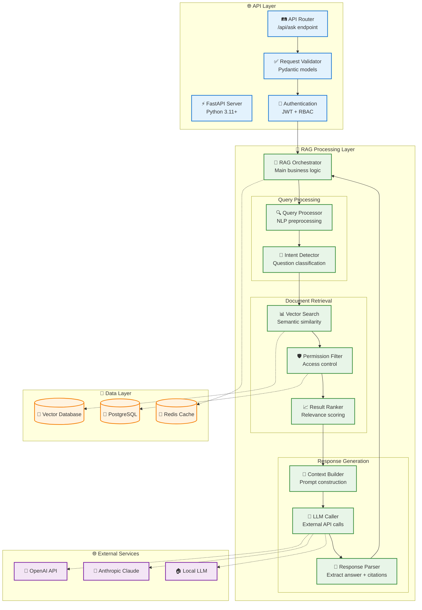
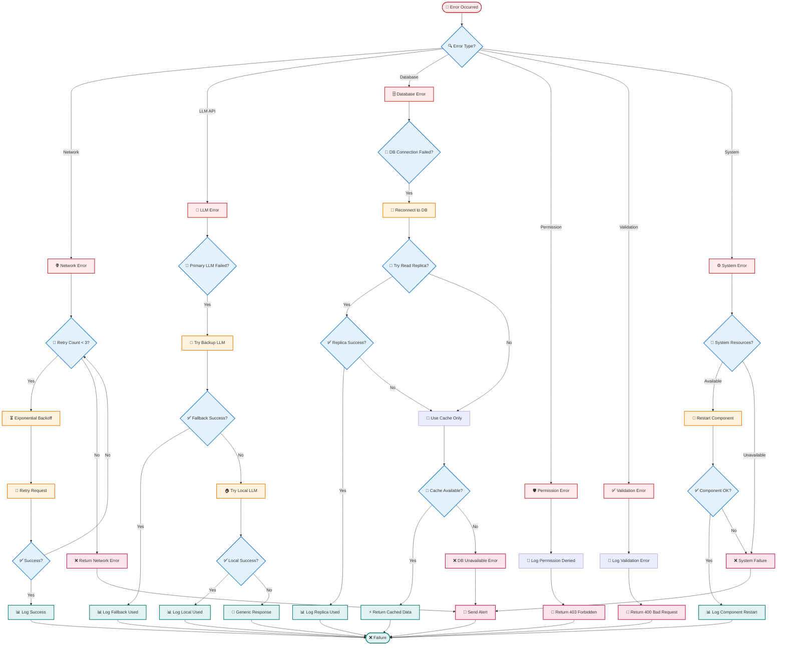

Nếu đã đủ thông tin hãy giúp tôi viết tài liệu thiết kế module dưới đây.
Tài liệu này cung cấp roadmap đầy đủ để implement FR-04.4 mà không cần code cụ thể nhưng 
có các bước làm cụ thể như chuẩn bị môi trường PC thế nào, phần mềm gì?
 để Team kỹ thuật có thể follow step-by-step guide này để thiết kế tối ưu cho hệ thống chatbot
 và có mermaidchart luồng công việc, điểm quay đầu khi bị fail.

### 3.4 Module RAG Core Engine (FR-04)

**FR-04.4 - API Endpoint**
- `/api/ask` - Endpoint chính cho chatbot
- Input: user_query, user_id, session_id
- Output: answer, references, confidence_score
---

# TÀI LIỆU THIẾT KẾ MODULE RAG CORE ENGINE
## API ENDPOINT IMPLEMENTATION GUIDE (FR-04.4)

---

**Module:** RAG Core Engine - API Endpoint  
**Feature ID:** FR-04.4  
**Phiên bản:** 1.0  
**Ngày tạo:** 01/09/2025  
**Người soạn thảo:** Technical Architecture Team  

---

## 📋 **MỤC LỤC**
1. [Tổng quan Module](#1-tổng-quan-module)
2. [Kiến trúc API Endpoint](#2-kiến-trúc-api-endpoint)
3. [Chuẩn bị Môi trường Phát triển](#3-chuẩn-bị-môi-trường-phát-triển)
4. [Roadmap Implementation](#4-roadmap-implementation)
5. [Luồng xử lý chi tiết](#5-luồng-xử-lý-chi-tiết)
6. [Error Handling & Recovery](#6-error-handling--recovery)
7. [Testing Strategy](#7-testing-strategy)
8. [Monitoring & Performance](#8-monitoring--performance)

---

## 1. **TỔNG QUAN MODULE**

### 1.1 Mô tả chức năng
API Endpoint `/api/ask` là trái tim của hệ thống RAG, xử lý tất cả các yêu cầu từ chatbot frontend và trả về câu trả lời thông minh dựa trên tri thức nội bộ.

### 1.2 Input/Output Specification

**📥 INPUT:**
```json
{
  "user_query": "Quy trình mua hàng trình giám đốc như thế nào?",
  "user_id": "emp001", 
  "session_id": "sess_20250901_001",
  "department": "rd",
  "language": "vi",
  "context_history": ["previous_question_1", "previous_question_2"],
  "max_results": 5,
  "include_citations": true
}
```

**📤 OUTPUT:**
```json
{
  "status": "success",
  "answer": "Quy trình mua hàng trình giám đốc gồm 5 bước chính...",
  "references": [
    {
      "doc_id": "proc_001",
      "title": "Quy trình Mua hàng Công ty",
      "chunk_text": "Bước 1: Tạo yêu cầu mua hàng trong hệ thống...",
      "confidence_score": 0.95,
      "page_number": 3,
      "section": "2.1 Quy trình cơ bản"
    }
  ],
  "confidence_score": 0.89,
  "response_time_ms": 2340,
  "session_id": "sess_20250901_001",
  "cached": false,
  "fallback_used": false
}
```

### 1.3 Performance Requirements
- **Response Time**: < 60 seconds (target: < 10 seconds)
- **Throughput**: 100 concurrent requests
- **Availability**: 99.5% uptime
- **Accuracy**: ≥80% relevant responses

---

## 2. **KIẾN TRÚC API ENDPOINT**

### 2.1 Component Architecture



---

## 3. **CHUẨN BỊ MÔI TRƯỜNG PHÁT TRIỂN**

### 3.1 Hardware Requirements

| Component | Minimum | Recommended | Optimal |
|-----------|---------|-------------|---------|
| **CPU** | 8 cores | 16 cores | 32 cores |
| **RAM** | 16GB | 32GB | 64GB |
| **Storage** | 500GB SSD | 1TB NVMe SSD | 2TB NVMe SSD |
| **GPU** | None | RTX 3080 (12GB) | RTX 4090 (24GB) |
| **Network** | 1Gbps | 10Gbps | 10Gbps+ |

### 3.2 Software Stack Setup

#### 3.2.1 Operating System
```bash
# Ubuntu 22.04 LTS (Recommended)
sudo apt update && sudo apt upgrade -y
sudo apt install build-essential curl wget git -y
```

#### 3.2.2 Python Environment
```bash
# Python 3.11+ với pyenv
curl https://pyenv.run | bash
pyenv install 3.11.5
pyenv global 3.11.5

# Poetry cho dependency management  
curl -sSL https://install.python-poetry.org | python3 -
```

#### 3.2.3 Database Setup
```bash
# PostgreSQL 15+
sudo apt install postgresql-15 postgresql-contrib-15
sudo systemctl enable postgresql
sudo systemctl start postgresql

# Redis 7+
sudo apt install redis-server
sudo systemctl enable redis-server
sudo systemctl start redis-server
```

#### 3.2.4 Vector Database
```bash
# Option 1: Chroma (Recommended for development)
pip install chromadb

# Option 2: FAISS (For production)
conda install faiss-cpu  # or faiss-gpu

# Option 3: Weaviate (Docker)
docker run -p 8080:8080 semitechnologies/weaviate:latest
```

#### 3.2.5 Development Tools
```bash
# Docker & Docker Compose
sudo apt install docker.io docker-compose-v2
sudo usermod -aG docker $USER

# VS Code với Python extensions
wget -qO- https://packages.microsoft.com/keys/microsoft.asc | gpg --dearmor > packages.microsoft.gpg
sudo install -o root -g root -m 644 packages.microsoft.gpg /etc/apt/trusted.gpg.d/
```

### 3.3 Project Structure
```
rag-core-engine/
├── app/
│   ├── __init__.py
│   ├── main.py              # FastAPI app entry point
│   ├── config/
│   │   ├── __init__.py
│   │   ├── settings.py      # Environment configs
│   │   └── database.py      # DB connections
│   ├── api/
│   │   ├── __init__.py
│   │   ├── routes/
│   │   │   ├── __init__.py
│   │   │   └── ask.py       # /api/ask endpoint
│   │   ├── models/
│   │   │   ├── __init__.py
│   │   │   ├── request.py   # Pydantic request models
│   │   │   └── response.py  # Pydantic response models
│   │   └── middleware/
│   │       ├── __init__.py
│   │       ├── auth.py      # Authentication
│   │       └── cors.py      # CORS handling
│   ├── services/
│   │   ├── __init__.py
│   │   ├── rag_orchestrator.py    # Main RAG logic
│   │   ├── query_processor.py     # Query preprocessing
│   │   ├── vector_search.py       # Vector operations
│   │   ├── permission_service.py  # Access control
│   │   ├── llm_service.py         # LLM integrations
│   │   └── cache_service.py       # Redis operations
│   ├── core/
│   │   ├── __init__.py
│   │   ├── security.py      # JWT, password hashing
│   │   ├── logging.py       # Structured logging
│   │   └── exceptions.py    # Custom exceptions
│   └── utils/
│       ├── __init__.py
│       ├── embeddings.py    # Embedding utilities
│       ├── text_processing.py
│       └── monitoring.py    # Metrics collection
├── tests/
│   ├── __init__.py
│   ├── conftest.py         # Pytest configurations
│   ├── unit/
│   ├── integration/
│   └── e2e/
├── docs/
│   ├── api_spec.yaml       # OpenAPI specification
│   └── README.md
├── scripts/
│   ├── setup_dev.sh        # Development setup
│   ├── run_tests.sh        # Test runner
│   └── deploy.sh           # Deployment script
├── docker/
│   ├── Dockerfile
│   ├── docker-compose.yml
│   └── .dockerignore
├── pyproject.toml          # Poetry dependencies
├── .env.example            # Environment template
├── .gitignore
└── README.md
```

---

## 4. **ROADMAP IMPLEMENTATION**

### 4.1 Timeline Overview (8 tuần)

| Phase | Duration | Tasks | Deliverables |
|-------|----------|-------|--------------|
| **Phase 1: Foundation** | Week 1-2 | Setup + Core Structure | Working API skeleton |
| **Phase 2: Core Logic** | Week 3-4 | RAG components | Basic query processing |
| **Phase 3: Integration** | Week 5-6 | LLM + Vector DB | End-to-end flow |
| **Phase 4: Optimization** | Week 7-8 | Performance + Testing | Production-ready API |

### 4.2 Phase-by-Phase Implementation

#### **🏗️ Phase 1: Foundation Setup (Week 1-2)**

**Week 1: Environment & Project Structure**
- [ ] Day 1-2: Setup development environment theo section 3
- [ ] Day 3: Initialize project structure
- [ ] Day 4: Setup FastAPI basic app với health check
- [ ] Day 5: Configure logging, metrics, database connections

**Week 2: API Framework**  
- [ ] Day 1-2: Implement Pydantic request/response models
- [ ] Day 3: Setup authentication middleware (JWT)
- [ ] Day 4: Implement basic /api/ask endpoint (mock response)
- [ ] Day 5: Add CORS, rate limiting, request validation

**🎯 Deliverable:** Working API server với basic endpoint

#### **🧠 Phase 2: Core RAG Logic (Week 3-4)**

**Week 3: Query Processing**
- [ ] Day 1-2: Implement QueryProcessor (text cleaning, intent detection)
- [ ] Day 2-3: Build VectorSearch service (connect to vector DB)
- [ ] Day 4: Implement PermissionFilter (RBAC logic)
- [ ] Day 5: Create ResultRanker (relevance scoring)

**Week 4: Response Generation**
- [ ] Day 1-2: Build ContextBuilder (prompt engineering)
- [ ] Day 3: Implement LLMService (OpenAI/Claude integration)
- [ ] Day 4: Create ResponseParser (extract answer + citations)
- [ ] Day 5: Integrate all components trong RAGOrchestrator

**🎯 Deliverable:** Complete RAG processing pipeline

#### **🔗 Phase 3: System Integration (Week 5-6)**

**Week 5: Database Integration**
- [ ] Day 1-2: Connect PostgreSQL cho metadata và user management
- [ ] Day 3: Integrate Redis cho caching và session
- [ ] Day 4: Setup vector database (Chroma/FAISS)  
- [ ] Day 5: Test end-to-end data flow

**Week 6: LLM & External Services**
- [ ] Day 1-2: Implement multiple LLM providers (fallback logic)
- [ ] Day 3: Add embeddings service integration
- [ ] Day 4: Build retry mechanisms và circuit breakers
- [ ] Day 5: Comprehensive integration testing

**🎯 Deliverable:** Fully integrated system với real data

#### **⚡ Phase 4: Production Optimization (Week 7-8)**

**Week 7: Performance & Reliability**
- [ ] Day 1-2: Implement advanced caching strategies
- [ ] Day 3: Add async processing cho heavy operations
- [ ] Day 4: Optimize database queries và vector search
- [ ] Day 5: Load testing và performance tuning

**Week 8: Final Polish**
- [ ] Day 1-2: Comprehensive error handling
- [ ] Day 3: Security audit và penetration testing
- [ ] Day 4: Documentation hoàn thiện
- [ ] Day 5: Production deployment preparation

**🎯 Deliverable:** Production-ready API endpoint

---

## 5. **LUỒNG XỬ LÝ CHI TIẾT**

### 5.1 Main Processing Flow


### 5.2 Detailed Component Logic

#### **🔍 Query Processing Logic**
```python
# Pseudo-code for QueryProcessor
def process_query(user_query, user_context):
    # 1. Text normalization
    normalized_query = normalize_text(user_query)
    
    # 2. Intent detection  
    intent = detect_intent(normalized_query)
    
    # 3. Query expansion (if needed)
    if intent == "specific_search":
        expanded_query = expand_with_synonyms(normalized_query)
    else:
        expanded_query = normalized_query
    
    # 4. Generate embedding
    query_embedding = generate_embedding(expanded_query)
    
    return ProcessedQuery(
        original=user_query,
        normalized=normalized_query, 
        expanded=expanded_query,
        intent=intent,
        embedding=query_embedding
    )
```

#### **📊 Vector Search Logic**
```python
# Pseudo-code for VectorSearch
def search_documents(processed_query, user_permissions, max_results=5):
    # 1. Semantic search
    semantic_results = vector_db.similarity_search(
        query_vector=processed_query.embedding,
        top_k=max_results * 2  # Get more for filtering
    )
    
    # 2. Permission filtering
    filtered_results = []
    for result in semantic_results:
        if check_permission(result.metadata, user_permissions):
            filtered_results.append(result)
        if len(filtered_results) >= max_results:
            break
    
    # 3. Re-ranking based on multiple factors
    ranked_results = rerank_results(
        results=filtered_results,
        query_intent=processed_query.intent,
        user_context=user_context
    )
    
    return ranked_results
```

#### **🧩 Context Building Logic**
```python
# Pseudo-code for ContextBuilder
def build_context(search_results, user_query, conversation_history):
    # 1. Extract relevant chunks
    context_chunks = []
    for result in search_results:
        chunk = {
            'content': result.page_content,
            'metadata': result.metadata,
            'relevance_score': result.score
        }
        context_chunks.append(chunk)
    
    # 2. Build system prompt
    system_prompt = f"""
    Bạn là trợ lý AI chuyên về tri thức nội bộ công ty.
    Hãy trả lời câu hỏi dựa trên thông tin được cung cấp.
    Nếu không có thông tin phù hợp, hãy nói rằng bạn không biết.
    Luôn đưa ra trích dẫn từ tài liệu gốc.
    """
    
    # 3. Build user prompt với context
    context_text = "\n\n".join([
        f"Tài liệu {i+1}: {chunk['content']}" 
        for i, chunk in enumerate(context_chunks)
    ])
    
    user_prompt = f"""
    Ngữ cảnh tài liệu:
    {context_text}
    
    Câu hỏi: {user_query}
    
    Trả lời:
    """
    
    return PromptContext(
        system_prompt=system_prompt,
        user_prompt=user_prompt,
        source_documents=context_chunks
    )
```

---

## 6. **ERROR HANDLING & RECOVERY**

### 6.1 Error Types & Recovery Strategies



### 6.2 Recovery Configuration

```python
# Error handling configuration
ERROR_CONFIG = {
    "network": {
        "max_retries": 3,
        "backoff_factor": 2,
        "timeout": 30
    },
    "llm": {
        "primary_timeout": 30,
        "fallback_providers": ["openai", "claude", "local"],
        "fallback_timeout": 60
    },
    "database": {
        "connection_retry": 3,
        "read_replica_fallback": True,
        "cache_fallback": True
    },
    "circuit_breaker": {
        "failure_threshold": 5,
        "timeout": 60,
        "expected_exception": ["ConnectionError", "Timeout"]
    }
}
```

### 6.3 Monitoring & Alerting Points

| Error Type | Alert Threshold | Action Required |
|------------|-----------------|-----------------|
| **Network Errors** | >5% in 5 minutes | Check network connectivity |
| **LLM Failures** | >10% in 10 minutes | Check API keys, quotas |
| **DB Connection** | Any failure | Immediate investigation |
| **Permission Denials** | >50 requests/hour | Review access policies |
| **System Resources** | >80% utilization | Scale infrastructure |

---

## 7. **TESTING STRATEGY**

### 7.1 Test Pyramid

```mermaid
graph TD
    subgraph "🧪 Testing Pyramid"
        E2E[🌐 E2E Tests<br/>Full user journeys<br/>~10 tests]
        Integration[🔗 Integration Tests<br/>Component interactions<br/>~50 tests]  
        Unit[⚙️ Unit Tests<br/>Individual functions<br/>~200 tests]
    end
    
    subgraph "🎯 Test Categories"
        Functional[✅ Functional Testing<br/>Feature correctness]
        Performance[⚡ Performance Testing<br/>Speed & throughput]
        Security[🛡️ Security Testing<br/>Auth & permissions]
        Reliability[🔄 Reliability Testing<br/>Error handling]
    end
    
    subgraph "🛠️ Test Tools"
        PyTest[🐍 PyTest<br/>Unit testing framework]
        FastAPI_Test[⚡ FastAPI TestClient<br/>API testing]
        Locust[🦗 Locust<br/>Load testing]
        OWASP_ZAP[🛡️ OWASP ZAP<br/>Security scanning]
    end
    
    Unit --> Functional
    Integration --> Performance
    E2E --> Security
    E2E --> Reliability
    
    Functional --> PyTest
    Performance --> Locust
    Security --> OWASP_ZAP
    Reliability --> FastAPI_Test
    
    %% Styling
    classDef pyramid fill:#e8f5e8,stroke:#388e3c,stroke-width:2px
    classDef category fill:#e3f2fd,stroke:#1976d2,stroke-width:2px
    classDef tool fill:#fff3e0
