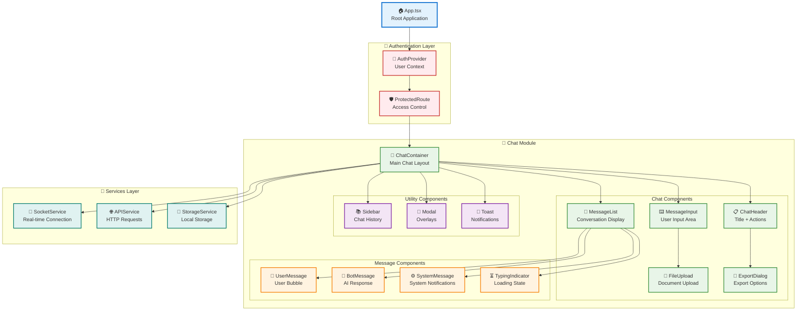
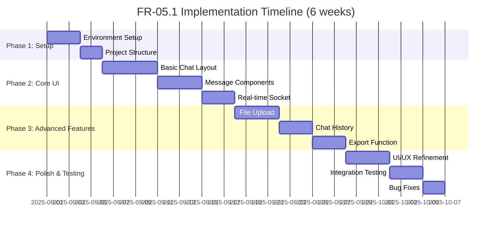
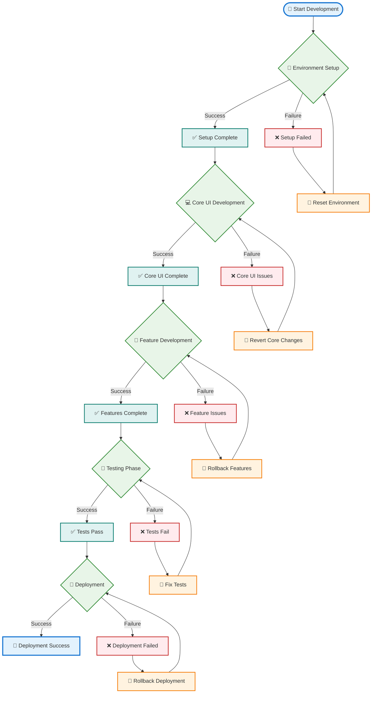
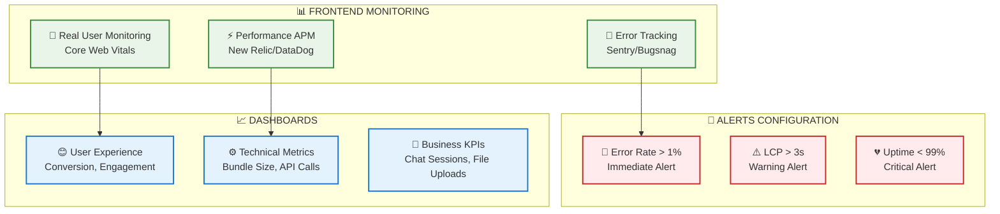
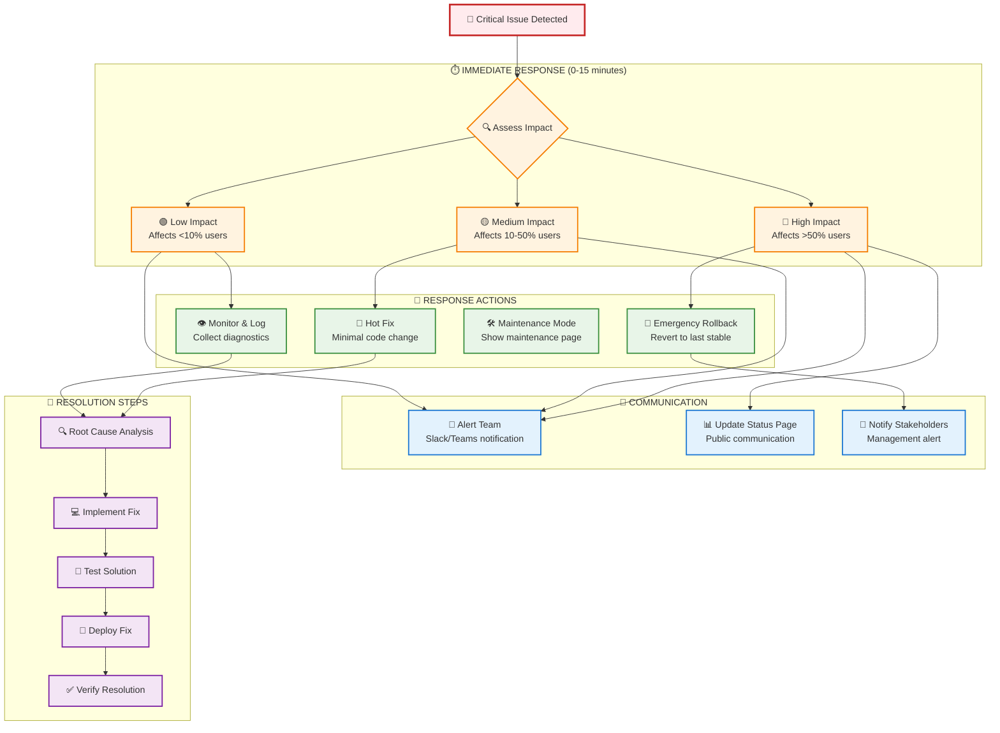
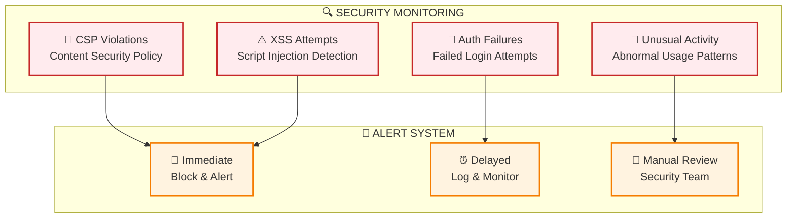
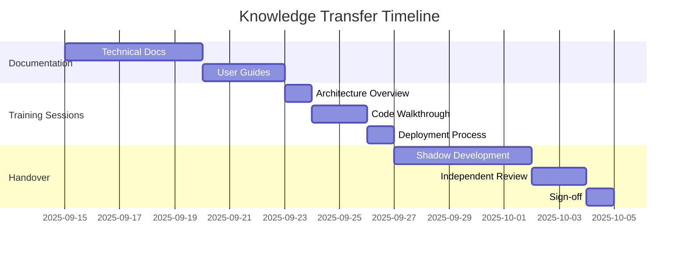
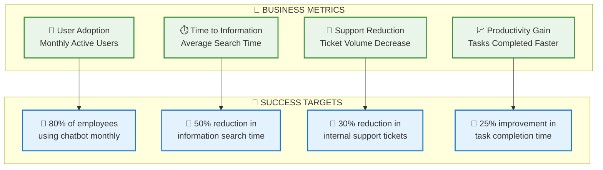

Nếu đã đủ thông tin hãy giúp tôi viết tài liệu thiết kế module dưới đây.
Tài liệu này cung cấp roadmap đầy đủ để implement FR-05.1 mà không cần code cụ thể nhưng 
có các bước làm cụ thể như chuẩn bị môi trường PC thế nào, phần mềm gì?
 để Team kỹ thuật có thể follow step-by-step guide này để thiết kế tối ưu cho hệ thống chatbot
 và có mermaidchart luồng công việc, điểm quay đầu khi bị fail.

### 3.5 Module Giao diện Chatbot (FR-05)

**FR-05.1 - Giao diện Chat**
- Real-time messaging interface
- Hiển thị lịch sử hội thoại
- Upload file để hỏi về tài liệu cụ thể
- Export cuộc hội thoại
---
# TÀI LIỆU THIẾT KẾ MODULE GIAO DIỆN CHATBOT (FR-05.1)
## REAL-TIME MESSAGING INTERFACE IMPLEMENTATION GUIDE

---

**Phiên bản:** 1.0  
**Ngày:** 01/09/2025  
**Module:** FR-05.1 - Giao diện Chat  
**Loại tài liệu:** Technical Design Document  
**Dành cho:** Team Frontend Development  

---

## 1. TỔNG QUAN MODULE

### 1.1 Mục tiêu
Triển khai giao diện chat real-time với đầy đủ tính năng: messaging, lịch sử, upload file, và export conversation. Module này là điểm tiếp xúc chính giữa người dùng và hệ thống RAG.

### 1.2 Yêu cầu chức năng
- ✅ Real-time messaging interface  
- ✅ Hiển thị lịch sử hội thoại
- ✅ Upload file để hỏi về tài liệu cụ thể
- ✅ Export cuộc hội thoại

### 1.3 Yêu cầu kỹ thuật
- **Performance**: Response time < 200ms cho UI interactions
- **Scalability**: Hỗ trợ 100 concurrent users
- **Compatibility**: Modern browsers (Chrome 90+, Firefox 88+, Safari 14+)
- **Responsive**: Desktop, tablet, mobile

---

## 2. CHUẨN BỊ MÔI TRƯỜNG PHÁT TRIỂN

### 2.1 Hardware Requirements

| Component | Minimum | Recommended |
|-----------|---------|-------------|
| **CPU** | Intel i5 hoặc AMD Ryzen 5 | Intel i7 hoặc AMD Ryzen 7 |
| **RAM** | 8GB | 16GB |
| **Storage** | 256GB SSD | 512GB SSD |
| **Network** | Stable internet connection | High-speed broadband |

### 2.2 Software Stack

#### 🖥️ **Development Environment**
```bash
# Essential Software Installation Guide

# 1. Node.js (LTS Version 18.x hoặc 20.x)
curl -fsSL https://deb.nodesource.com/setup_lts.x | sudo -E bash -
sudo apt-get install -y nodejs

# Verify installation
node --version  # Should be v18.x.x or v20.x.x
npm --version   # Should be 9.x.x or higher

# 2. Git
sudo apt-get install git
git --version

# 3. VS Code (Recommended IDE)
wget -qO- https://packages.microsoft.com/keys/microsoft.asc | gpg --dearmor > packages.microsoft.gpg
sudo install -o root -g root -m 644 packages.microsoft.gpg /etc/apt/trusted.gpg.d/
echo "deb [arch=amd64,arm64,armhf signed-by=/etc/apt/trusted.gpg.d/packages.microsoft.gpg] https://packages.microsoft.com/repos/code stable main" | sudo tee /etc/apt/sources.list.d/vscode.list
sudo apt update
sudo apt install code
```

#### 🔧 **Required VS Code Extensions**
```json
{
  "recommendations": [
    "ms-vscode.vscode-typescript-next",
    "bradlc.vscode-tailwindcss",
    "ms-vscode.vscode-json",
    "esbenp.prettier-vscode",
    "dbaeumer.vscode-eslint",
    "ms-vscode.vscode-eslint",
    "formulahendry.auto-rename-tag",
    "christian-kohler.path-intellisense"
  ]
}
```

#### 📦 **Frontend Technology Stack**

| Technology | Version | Purpose |
|------------|---------|---------|
| **React** | 18.2+ | Core UI framework |
| **TypeScript** | 5.0+ | Type safety |
| **Next.js** | 13.4+ | Full-stack framework |
| **Tailwind CSS** | 3.3+ | Styling |
| **Socket.IO Client** | 4.7+ | Real-time communication |
| **Zustand** | 4.3+ | State management |
| **React Query** | 4.29+ | Server state management |
| **React Hook Form** | 7.45+ | Form handling |
| **Framer Motion** | 10.12+ | Animations |

---

## 3. KIẾN TRÚC COMPONENT

### 3.1 Component Hierarchy



### 3.2 State Management Architecture

```mermaid
graph TB
    subgraph "🏪 Global State (Zustand)"
        AuthStore[👤 Auth Store<br/>User, Permissions]
        ChatStore[💬 Chat Store<br/>Messages, Sessions]
        UIStore[🎨 UI Store<br/>Theme, Modals]
        FileStore[📁 File Store<br/>Uploads, Processing]
    end
    
    subgraph "🔄 Server State (React Query)"
        UserQueries[👤 User Queries<br/>Profile, Settings]
        ChatQueries[💬 Chat Queries<br/>History, Search]
        FileQueries[📁 File Queries<br/>Upload Status]
    end
    
    subgraph "📍 Local State (useState/useReducer)"
        FormState[📝 Form State<br/>Input Values]
        ComponentState[⚙️ Component State<br/>Loading, Errors]
    end
    
    subgraph "🔌 Real-time State (Socket.IO)"
        MessageEvents[💬 Message Events<br/>New Messages]
        StatusEvents[📊 Status Events<br/>Online/Offline]
        TypingEvents[⌨️ Typing Events<br/>User Typing]
    end
    
    %% Data Flow
    MessageEvents --> ChatStore
    StatusEvents --> AuthStore
    TypingEvents --> ChatStore
    
    ChatQueries --> ChatStore
    UserQueries --> AuthStore
    FileQueries --> FileStore
    
    FormState --> ChatStore
    ComponentState --> UIStore
    
    %% Styling
    classDef globalState fill:#e8f5e8,stroke:#388e3c,stroke-width:2px
    classDef serverState fill:#fff3e0,stroke:#f57c00,stroke-width:2px
    classDef localState fill:#f3e5f5,stroke:#7b1fa2,stroke-width:2px
    classDef realtimeState fill:#e0f2f1,stroke:#00796b,stroke-width:2px
    
    class AuthStore,ChatStore,UIStore,FileStore globalState
    class UserQueries,ChatQueries,FileQueries serverState
    class FormState,ComponentState localState
    class MessageEvents,StatusEvents,TypingEvents realtimeState
```



---

## 4. IMPLEMENTATION ROADMAP

### 4.1 Development Phases



### 4.2 Step-by-Step Implementation Guide

#### 🚀 **PHASE 1: Environment Setup (3-5 days)**

##### Step 1.1: Project Initialization
```bash
# Create Next.js project with TypeScript
npx create-next-app@latest chatbot-ui --typescript --tailwind --eslint --app

cd chatbot-ui

# Install core dependencies
npm install socket.io-client zustand @tanstack/react-query
npm install react-hook-form framer-motion lucide-react
npm install @headlessui/react @heroicons/react

# Install dev dependencies
npm install -D @types/socket.io-client prettier eslint-config-prettier
```

##### Step 1.2: Project Structure Setup
```
src/
├── app/                    # Next.js App Router
│   ├── globals.css
│   ├── layout.tsx
│   └── page.tsx
├── components/             # React Components
│   ├── chat/              # Chat-specific components
│   ├── ui/                # Reusable UI components
│   └── layout/            # Layout components
├── hooks/                 # Custom React hooks
├── lib/                   # Utility libraries
├── stores/                # Zustand stores
├── services/              # API & Socket services
├── types/                 # TypeScript definitions
└── utils/                 # Helper functions
```

##### Step 1.3: Configuration Files
```typescript
// tailwind.config.js - Optimized for chat UI
module.exports = {
  content: [
    './src/pages/**/*.{js,ts,jsx,tsx,mdx}',
    './src/components/**/*.{js,ts,jsx,tsx,mdx}',
    './src/app/**/*.{js,ts,jsx,tsx,mdx}',
  ],
  theme: {
    extend: {
      colors: {
        primary: {
          50: '#eff6ff',
          500: '#3b82f6',
          600: '#2563eb',
          700: '#1d4ed8',
        },
        chat: {
          user: '#3b82f6',
          bot: '#f3f4f6',
          system: '#fbbf24',
        }
      },
      animation: {
        'typing': 'typing 1.5s ease-in-out infinite',
        'fade-in': 'fadeIn 0.3s ease-in-out',
      }
    },
  },
  plugins: [],
}
```

#### 🎨 **PHASE 2: Core UI Development (8-12 days)**

##### Step 2.1: Base Layout Component
```typescript
// Key implementation points (not full code):
// 1. Responsive layout with sidebar
// 2. Header with user info and actions  
// 3. Main chat area with flex layout
// 4. Message input area at bottom
// 5. Mobile-first responsive design
```

**🔍 Implementation Checklist:**
- [ ] Responsive grid layout (desktop: sidebar + chat, mobile: full-width)
- [ ] Header component with user avatar, settings, export button
- [ ] Scrollable message container with proper overflow handling
- [ ] Sticky input area at bottom
- [ ] Loading states and skeleton components

##### Step 2.2: Message Components
```typescript
// Key components to implement:
// 1. UserMessage: Right-aligned, blue background
// 2. BotMessage: Left-aligned, gray background, with citations
// 3. SystemMessage: Centered, amber background
// 4. TypingIndicator: Animated dots
// 5. MessageTimestamp: Formatted time display
```

**🔍 Implementation Checklist:**
- [ ] Message bubble styling with proper spacing
- [ ] Markdown rendering for bot responses
- [ ] Citation links with hover effects
- [ ] Copy to clipboard functionality
- [ ] Message status indicators (sent, delivered, failed)

##### Step 2.3: Real-time Socket Integration
```typescript
// Socket.IO client setup points:
// 1. Connection management with reconnection logic
// 2. Authentication with JWT tokens
// 3. Event handlers for messages, typing, status
// 4. Error handling and connection status display
// 5. Message queuing for offline scenarios
```

**🔍 Implementation Checklist:**
- [ ] Socket connection with auth token
- [ ] Message event handlers (receive, typing, status)
- [ ] Connection status indicator
- [ ] Automatic reconnection logic
- [ ] Message delivery confirmation

#### 📁 **PHASE 3: Advanced Features (7-10 days)**

##### Step 3.1: File Upload System
```typescript
// File upload implementation:
// 1. Drag & drop interface
// 2. File type validation (PDF, DOC, TXT)
// 3. Upload progress indicator
// 4. Preview for uploaded files
// 5. Integration with chat messages
```

**🔍 Implementation Checklist:**
- [ ] Drag & drop zone with visual feedback
- [ ] File type and size validation (max 10MB)
- [ ] Upload progress bar with percentage
- [ ] File preview component
- [ ] Error handling for upload failures

##### Step 3.2: Chat History & Search
```typescript
// History implementation:
// 1. Sidebar with conversation list
// 2. Search functionality across conversations  
// 3. Infinite scroll for old messages
// 4. Conversation grouping by date
// 5. Delete/archive conversations
```

**🔍 Implementation Checklist:**
- [ ] Sidebar with conversation list
- [ ] Search input with debounced queries
- [ ] Infinite scroll for message loading
- [ ] Conversation metadata (title, date, message count)
- [ ] Delete confirmation modal

##### Step 3.3: Export Functionality
```typescript
// Export implementation:
// 1. Multiple formats (PDF, JSON, TXT)
// 2. Date range selection
// 3. Include/exclude system messages option
// 4. Download progress indicator
// 5. Email export option
```

**🔍 Implementation Checklist:**
- [ ] Export dialog with format selection
- [ ] Date range picker component
- [ ] Export options (include citations, system messages)
- [ ] Download generation with progress
- [ ] Success/failure notifications

#### 🎯 **PHASE 4: Polish & Testing (6-9 days)**

##### Step 4.1: UI/UX Enhancements
**🔍 Polish Checklist:**
- [ ] Smooth animations and transitions
- [ ] Loading skeletons for better UX
- [ ] Empty states with helpful messaging
- [ ] Keyboard shortcuts (Ctrl+Enter to send)
- [ ] Accessibility improvements (ARIA labels, keyboard navigation)
- [ ] Dark/light theme toggle
- [ ] Mobile responsiveness testing

##### Step 4.2: Performance Optimization
**🔍 Performance Checklist:**
- [ ] Message virtualization for large chat histories
- [ ] Image lazy loading
- [ ] Bundle size optimization
- [ ] Memory leak prevention
- [ ] Socket connection optimization

---

## 5. LUỒNG CÔNG VIỆC VÀ ĐIỂM QUAY ĐẦU

### 5.1 Main Development Workflow



### 5.2 Detailed Failure Recovery Procedures

#### 🔧 **Setup Phase Failures & Recovery**

| ❌ Failure Scenario | 🔍 Diagnostic Steps | 🔄 Recovery Actions |
|---------------------|---------------------|---------------------|
| **Node.js installation fails** | Check system compatibility | Use nvm to install alternative version |
| **npm install errors** | Clear npm cache: `npm cache clean --force` | Delete node_modules, reinstall |
| **Port conflicts** | Check running processes: `netstat -tulpn` | Kill conflicting processes or change port |
| **Permission errors** | Check file permissions | Use `sudo` or fix ownership: `chown -R $USER` |

**🚨 Critical Rollback Point**: If setup continues failing after 4 hours, escalate to senior developer.

#### 💻 **Core UI Development Failures & Recovery**

| ❌ Failure Scenario | 🔍 Diagnostic Steps | 🔄 Recovery Actions |
|---------------------|---------------------|---------------------|
| **Component rendering issues** | Check React DevTools, console errors | Isolate component, test in Storybook |
| **CSS layout breaks** | Inspect element, check Tailwind classes | Reset to last working commit |
| **TypeScript compilation errors** | Review type definitions | Fix types incrementally |
| **Socket connection failures** | Test socket endpoint separately | Implement fallback polling mechanism |

**🚨 Critical Rollback Point**: If core UI is unstable after 2 days, revert to basic HTML/CSS approach.

#### 🎯 **Feature Development Failures & Recovery**

| ❌ Failure Scenario | 🔍 Diagnostic Steps | 🔄 Recovery Actions |
|---------------------|---------------------|---------------------|
| **File upload not working** | Test upload endpoint directly | Implement chunked upload |
| **Chat history performance issues** | Profile with React DevTools | Implement virtualization |
| **Export functionality fails** | Test export libraries separately | Use alternative export method |
| **Real-time sync issues** | Monitor WebSocket traffic | Add retry logic and queuing |

**🚨 Critical Rollback Point**: If features are blocking core functionality, disable and release core version.

#### 🧪 **Testing Phase Failures & Recovery**

| ❌ Failure Scenario | 🔍 Diagnostic Steps | 🔄 Recovery Actions |
|---------------------|---------------------|---------------------|
| **Unit tests failing** | Review test logs, update snapshots | Fix tests or update implementation |
| **Integration tests timeout** | Check API response times | Increase timeout or mock slow endpoints |
| **Cross-browser compatibility** | Test in multiple browsers | Add polyfills or progressive enhancement |
| **Mobile responsive issues** | Test on real devices | Adjust breakpoints and layouts |

---

## 6. QUALITY ASSURANCE & TESTING

### 6.1 Testing Strategy

```mermaid
graph TB
    subgraph "🧪 TESTING PYRAMID"
        subgraph "Unit Tests (70%)"
            ComponentTests[⚛️ Component Tests<br/>React Testing Library]
            HookTests[🪝 Hook Tests<br/>Custom Hooks]
            UtilTests[🔧 Utility Tests<br/>Pure Functions]
        end
        
        subgraph "Integration Tests (20%)"
            APITests[🌐 API Integration<br/>Mock Service Worker]
            SocketTests[🔌 Socket Integration<br/>Socket.IO Testing]
            StoreTests[🏪 State Management<br/>Zustand Testing]
        end
        
        subgraph "E2E Tests (10%)"
            UserFlows[👤 User Flows<br/>Cypress/Playwright]
            CrossBrowser[🌐 Cross-Browser<br/>BrowserStack]
            Performance[⚡ Performance<br/>Lighthouse]
        end
    end
    
    subgraph "📊 TESTING TOOLS"
        Jest[🃏 Jest<br/>Test Runner]
        RTL[🧪 React Testing Library<br/>Component Testing]
        MSW[🎭 Mock Service Worker<br/>API Mocking]
        Cypress[🌲 Cypress<br/>E2E Testing]
    end
    
    ComponentTests --> Jest
    HookTests --> RTL
    UtilTests --> Jest
    APITests --> MSW
    SocketTests --> Jest
    UserFlows --> Cypress
    
    %% Styling
    classDef unit fill:#e8f5e8,stroke:#388e3c,stroke-width:2px
    classDef integration fill:#fff3e0,stroke:#f57c00,stroke-width:2px
    classDef e2e fill:#f3e5f5,stroke:#7b1fa2,stroke-width:2px
    classDef tools fill:#e0f2f1,stroke:#00796b,stroke-width:2px
    
    class ComponentTests,HookTests,UtilTests unit
    class APITests,SocketTests,StoreTests integration
    class UserFlows,CrossBrowser,Performance e2e
    class Jest,RTL,MSW,Cypress tools
```



### 6.2 Performance Benchmarks

| Metric | Target | Measurement Method |
|--------|--------|--------------------|
| **First Contentful Paint** | < 1.5s | Lighthouse |
| **Largest Contentful Paint** | < 2.5s | Web Vitals |
| **Cumulative Layout Shift** | < 0.1 | Web Vitals |
| **Time to Interactive** | < 3s | Lighthouse |
| **Bundle Size** | < 500KB gzipped | webpack-bundle-analyzer |

---

## 7. DEPLOYMENT & MONITORING

### 7.1 Production Deployment Checklist

#### 🚀 **Pre-deployment**
- [ ] All tests passing (unit, integration, e2e)
- [ ] Code review approved by 2+ developers
- [ ] Performance benchmarks met
- [ ] Security scan passed
- [ ] Environment variables configured
- [ ] Database migrations ready (if needed)

#### 🔄 **Deployment Process**
- [ ] Build production bundle: `npm run build`
- [ ] Test production build locally
- [ ] Deploy to staging environment
- [ ] Run smoke tests on staging
- [ ] Deploy to production with blue-green strategy
- [ ] Monitor application health

#### 📊 **Post-deployment**
- [ ] Verify all critical user flows
- [ ] Check error rates and performance metrics
- [ ] Monitor real-time WebSocket connections
- [ ] Validate file upload functionality
- [ ] Test export features

### 7.2 Monitoring & Alerting



---

## 8. MAINTENANCE & FUTURE ENHANCEMENTS

### 8.1 Regular Maintenance Tasks

| 🕒 Frequency | 📋 Task | 🎯 Purpose |
|-------------|---------|------------|
| **Daily** | Monitor error rates and performance | Early issue detection |
| **Weekly** | Update dependencies (patch versions) | Security and bug fixes |
| **Monthly** | Review and update tests | Maintain test quality |
| **Quarterly** | Major dependency updates | Stay current with ecosystem |

### 8.2 Planned Future Enhancements

#### 🎯 **Phase 2 Features (Next Quarter)**
- Voice message support with speech-to-text
- Multi-language support (Vietnamese, English)
- Advanced file preview (PDF viewer, image gallery)
- Collaborative chat rooms
- Custom emoji reactions

#### 🚀 **Phase 3 Features (Long-term)**
- Offline mode with sync when online
- Advanced search with filters
- Chat templates and quick responses
- Integration with external tools (Slack, Teams)
- Analytics dashboard for usage insights

---

## 9. TROUBLESHOOTING GUIDE

### 9.1 Common Issues & Solutions

#### 🔌 **WebSocket Connection Issues**
```typescript
// Diagnostic commands
console.log('Socket status:', socket.connected);
console.log('Socket transport:', socket.io.engine.transport.name);

// Common solutions:
1. Check network connectivity
2. Verify server WebSocket endpoint
3. Check firewall/proxy settings
4. Implement fallback to long-polling
```

#### 📁 **File Upload Problems**
```typescript
// Diagnostic steps:
1. Check file size limits (client & server)
2. Verify file type validation
3. Test upload endpoint with Postman
4. Check network timeout settings
5. Implement chunked upload for large files
```

#### 🎨 **UI Rendering Issues**
```typescript
// Debug steps:
1. Check React DevTools for component state
2. Validate Tailwind CSS classes
3. Test in different browsers
4. Check console for JavaScript errors
5. Verify responsive breakpoints
```

### 9.2 Emergency Procedures

#### 🚨 **Critical Issue Response Protocol**



#### 🔄 **Emergency Rollback Procedures**

| 🚨 Scenario | ⚡ Immediate Action | 🕒 Time Limit | 🔧 Rollback Method |
|-------------|-------------------|---------------|-------------------|
| **App crashes on load** | Rollback to last stable version | 5 minutes | Git revert + redeploy |
| **WebSocket connection failure** | Switch to polling mode | 2 minutes | Feature flag toggle |
| **File upload broken** | Disable upload feature | 3 minutes | Component-level flag |
| **Performance degradation** | Enable performance mode | 1 minute | Reduce features temporarily |

#### 📞 **Emergency Contact List**

| 👤 Role | 📱 Primary Contact | 📧 Email | ⏰ Availability |
|---------|-------------------|----------|----------------|
| **Frontend Lead** | +84-xxx-xxx-xxx | frontend.lead@company.com | 24/7 |
| **Backend Lead** | +84-xxx-xxx-xxx | backend.lead@company.com | 24/7 |
| **DevOps Engineer** | +84-xxx-xxx-xxx | devops@company.com | 24/7 |
| **Product Manager** | +84-xxx-xxx-xxx | pm@company.com | Business hours |

---

## 10. CODE QUALITY & STANDARDS

### 10.1 Development Standards

#### 📝 **Code Style Guidelines**
```typescript
// ESLint + Prettier configuration
// .eslintrc.js
module.exports = {
  extends: [
    'next/core-web-vitals',
    '@typescript-eslint/recommended',
    'prettier'
  ],
  rules: {
    'react/prop-types': 'off',
    '@typescript-eslint/no-unused-vars': 'error',
    'prefer-const': 'error',
    'no-console': 'warn', // Allow console in development
  }
}

// prettier.config.js
module.exports = {
  semi: true,
  trailingComma: 'es5',
  singleQuote: true,
  printWidth: 80,
  tabWidth: 2,
}
```

#### 🏗️ **Component Structure Standard**
```typescript
// Component Template (không phải code thực tế)
/*
1. Imports (external libraries first, then internal)
2. Type definitions
3. Interface/Props definitions  
4. Main component function
5. Default export
6. Supporting functions below (if any)
*/

// File naming: PascalCase for components, camelCase for utilities
// - UserMessage.tsx (component)
// - messageUtils.ts (utility)
// - types.ts (type definitions)
```

#### 🧪 **Testing Standards**
```typescript
// Test file naming: ComponentName.test.tsx
// Test structure:
// - Describe block for component
// - Test cases for each major functionality
// - Mock external dependencies
// - Test both success and error cases
```

### 10.2 Git Workflow

```mermaid
gitgraph
    commit id: "Initial setup"
    branch develop
    checkout develop
    commit id: "Setup project structure"
    
    branch feature/chat-layout
    checkout feature/chat-layout
    commit id: "Add basic layout"
    commit id: "Add responsive design"
    checkout develop
    merge feature/chat-layout
    
    branch feature/real-time-messaging
    checkout feature/real-time-messaging
    commit id: "Implement WebSocket"
    commit id: "Add message handling"
    checkout develop
    merge feature/real-time-messaging
    
    branch feature/file-upload
    checkout feature/file-upload
    commit id: "Add upload component"
    commit id: "Integrate with API"
    checkout develop
    merge feature/file-upload
    
    checkout main
    merge develop
    commit id: "Release v1.0.0"
```

#### 🔀 **Branch Strategy**
- **main**: Production-ready code only
- **develop**: Integration branch for features
- **feature/***: Individual feature development
- **hotfix/***: Critical production fixes
- **release/***: Release preparation

#### 📝 **Commit Message Format**
```
type(scope): description

feat(chat): add real-time messaging
fix(upload): resolve file size validation
docs(readme): update installation guide
style(ui): improve message bubble styling
refactor(hooks): optimize useSocket hook
test(chat): add message component tests
chore(deps): update React to v18.2.0
```

---

## 11. SECURITY CONSIDERATIONS

### 11.1 Frontend Security Checklist

#### 🛡️ **Input Validation & Sanitization**
- [ ] Validate all user inputs (message content, file uploads)
- [ ] Sanitize HTML content to prevent XSS attacks
- [ ] Implement file type and size restrictions
- [ ] Use Content Security Policy (CSP) headers
- [ ] Validate file uploads on both client and server

#### 🔐 **Authentication & Authorization**
```typescript
// Security implementation points:
// 1. Store JWT tokens securely (httpOnly cookies preferred)
// 2. Implement token refresh mechanism
// 3. Add request timeout and retry logic
// 4. Validate user permissions before API calls
// 5. Implement proper logout functionality
```

#### 📡 **Network Security**
- [ ] Use HTTPS for all communications
- [ ] Implement WebSocket Secure (WSS) for real-time features
- [ ] Add request rate limiting
- [ ] Validate SSL/TLS certificates
- [ ] Implement CORS properly

### 11.2 Data Protection

#### 📊 **Sensitive Data Handling**
```typescript
// Data protection guidelines:
// 1. Never log sensitive user data
// 2. Implement proper error handling without exposing internal info
// 3. Use environment variables for configuration
// 4. Clear sensitive data from memory when possible
// 5. Implement proper session timeout
```

#### 🔍 **Security Monitoring**


---

## 12. DOCUMENTATION REQUIREMENTS

### 12.1 Technical Documentation

#### 📚 **Required Documentation**
1. **API Documentation**: Complete endpoint documentation with examples
2. **Component Library**: Storybook for all reusable components
3. **Deployment Guide**: Step-by-step deployment instructions
4. **Configuration Guide**: Environment setup and configuration options
5. **Troubleshooting Manual**: Common issues and solutions

#### 📖 **User Documentation**
1. **User Guide**: How to use the chat interface effectively
2. **Feature Documentation**: Detailed explanation of all features
3. **FAQ**: Frequently asked questions and answers
4. **Video Tutorials**: Screen recordings for complex workflows

### 12.2 Knowledge Transfer

#### 🎓 **Team Training Plan**


#### 📋 **Handover Checklist**
- [ ] All code is properly documented with comments
- [ ] README files are complete and up-to-date
- [ ] Architecture decisions are documented (ADRs)
- [ ] Database schema and migrations documented
- [ ] API contracts and examples provided
- [ ] Security considerations documented
- [ ] Performance optimization notes included
- [ ] Known issues and workarounds listed

---

## 13. SUCCESS METRICS & KPIs

### 13.1 Technical Metrics

| 📊 Metric | 🎯 Target | 📏 Measurement | 🕒 Frequency |
|-----------|----------|---------------|-------------|
| **Page Load Time** | < 2 seconds | Lighthouse | Daily |
| **First Contentful Paint** | < 1.5s | Web Vitals | Daily |
| **Error Rate** | < 1% | Sentry | Real-time |
| **WebSocket Connection Success** | > 99% | Custom metrics | Real-time |
| **Message Delivery Success** | > 99.5% | Backend logs | Real-time |
| **File Upload Success Rate** | > 95% | API metrics | Daily |

### 13.2 User Experience Metrics

| 👤 Metric | 🎯 Target | 📏 Measurement | 🕒 Frequency |
|-----------|----------|---------------|-------------|
| **User Satisfaction** | > 4.0/5.0 | User surveys | Monthly |
| **Feature Adoption Rate** | > 70% | Analytics | Weekly |
| **Session Duration** | > 5 minutes | Analytics | Daily |
| **Message Success Rate** | > 98% | Backend logs | Real-time |
| **Search Success Rate** | > 85% | Custom events | Daily |

### 13.3 Business Impact Metrics



---

## 14. CONCLUSION & NEXT STEPS

### 14.1 Implementation Summary

Tài liệu này cung cấp roadmap hoàn chỉnh để implement FR-05.1 (Giao diện Chat) với:

✅ **Complete development environment setup**  
✅ **Detailed component architecture**  
✅ **Step-by-step implementation guide**  
✅ **Comprehensive testing strategy**  
✅ **Security and performance considerations**  
✅ **Monitoring and maintenance procedures**  
✅ **Emergency response protocols**  

### 14.2 Critical Success Factors

🎯 **Technical Excellence**
- Follow established coding standards and best practices
- Maintain high test coverage (>80%)
- Optimize for performance and scalability
- Implement robust error handling and recovery

🛡️ **Security First**
- Validate all inputs and sanitize outputs
- Implement proper authentication and authorization
- Monitor for security violations and attacks
- Regular security audits and updates

👥 **User Experience Focus**
- Prioritize intuitive and responsive design
- Implement accessibility standards
- Gather and act on user feedback
- Continuous UX improvements

### 14.3 Post-Implementation Actions

#### 📅 **Immediate (Week 1-2)**
- [ ] Deploy to staging environment
- [ ] Conduct user acceptance testing
- [ ] Performance and security testing
- [ ] Documentation review and updates

#### 📅 **Short-term (Month 1-2)**
- [ ] Monitor production metrics and user feedback
- [ ] Address any critical bugs or performance issues
- [ ] Conduct team retrospective and lessons learned
- [ ] Plan Phase 2 features and improvements

#### 📅 **Long-term (Month 3-6)**
- [ ] Analyze usage patterns and optimization opportunities
- [ ] Implement advanced features based on user feedback
- [ ] Scale infrastructure based on actual usage
- [ ] Knowledge transfer to maintenance team

---

## 15. APPENDICES

### Appendix A: Environment Variables Template
```bash
# .env.local template
NEXT_PUBLIC_API_URL=http://localhost:3001
NEXT_PUBLIC_SOCKET_URL=ws://localhost:3001
NEXT_PUBLIC_MAX_FILE_SIZE=10485760
NEXT_PUBLIC_ALLOWED_FILE_TYPES=.pdf,.doc,.docx,.txt
NEXT_PUBLIC_ENVIRONMENT=development
```

### Appendix B: Package.json Template
```json
{
  "name": "chatbot-ui",
  "version": "1.0.0",
  "scripts": {
    "dev": "next dev",
    "build": "next build",
    "start": "next start",
    "test": "jest",
    "test:watch": "jest --watch",
    "lint": "next lint",
    "type-check": "tsc --noEmit"
  }
}
```

### Appendix C: Component Template Examples
```typescript
// Template structure for new components
// (không phải code thực tế, chỉ là hướng dẫn cấu trúc)
```

---

**📝 Ghi chú cuối**: Tài liệu này là living document và sẽ được cập nhật theo quá trình phát triển thực tế. Team development nên review và cập nhật tài liệu thường xuyên để đảm bảo tính chính xác và hữu ích.

**🤝 Liên hệ hỗ trợ**: Nếu có thắc mắc về implementation guide này, vui lòng liên hệ Technical Lead hoặc tạo issue trong project repository.

---

**✅ DOCUMENT STATUS: READY FOR IMPLEMENTATION**
