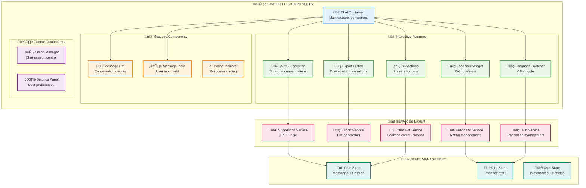
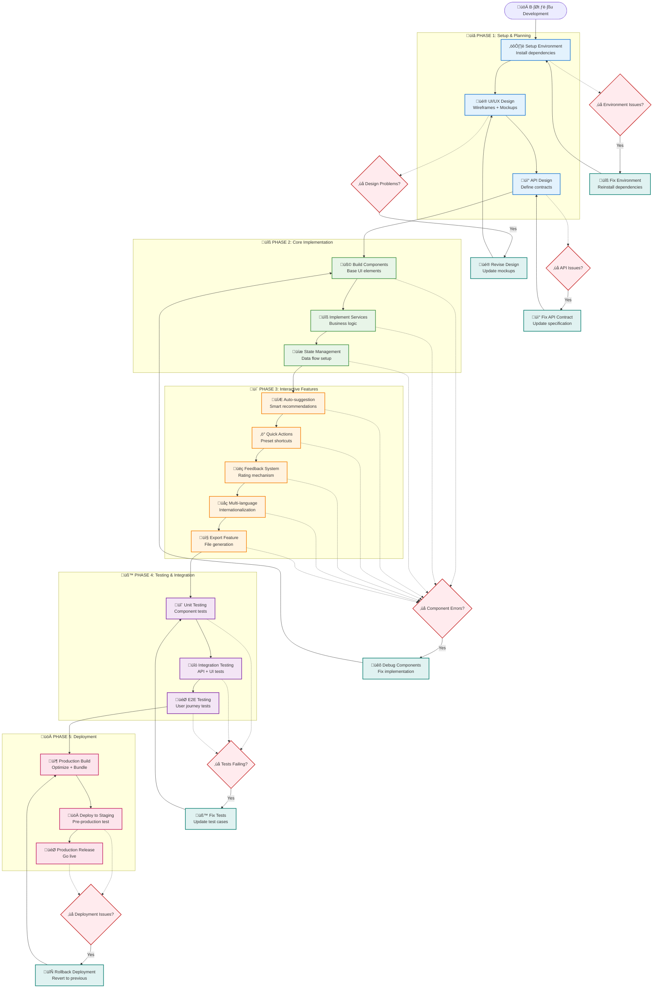
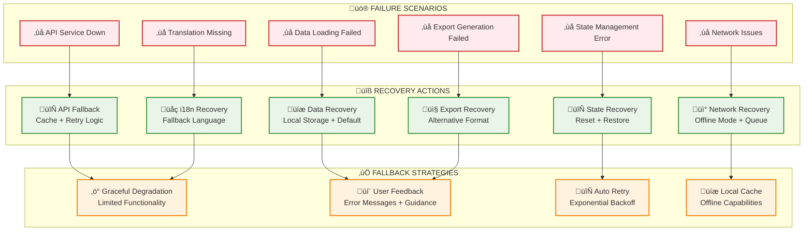
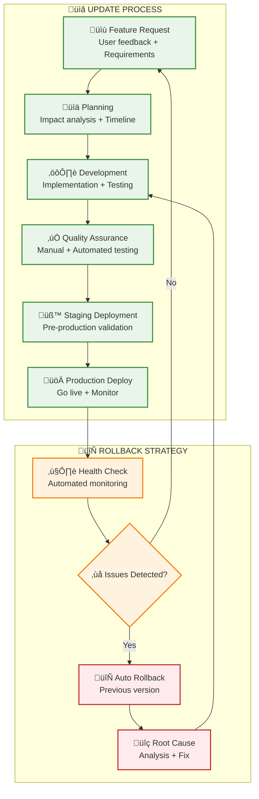

Nếu đã đủ thông tin hãy giúp tôi viết tài liệu thiết kế module dưới đây.
Tài liệu này cung cấp roadmap đầy đủ để implement FR-05.2 mà không cần code cụ thể nhưng 
có các bước làm cụ thể như chuẩn bị môi trường PC thế nào, phần mềm gì?
 để Team kỹ thuật có thể follow step-by-step guide này để thiết kế tối ưu cho hệ thống chatbot
 và có mermaidchart luồng công việc, điểm quay đầu khi bị fail.

### 3.5 Module Giao diện Chatbot (FR-05)
**FR-05.2 - Tính năng Tương tác**
- Auto-suggestion câu hỏi phổ biến
- Quick actions (tìm policy, procedure, technical guide)
- Feedback mechanism (thumbs up/down)
- Multi-language support (Tiếng Việt, English)
- Export cu·ªôc h·ªôi tho·∫°i
---

# TÀI LIỆU THIẾT KẾ MODULE GIAO DIỆN CHATBOT
## MODULE FR-05.2 - TÍNH NĂNG TƯƠNG TÁC

---

**Phiên bản:** 1.0  
**Ngày:** 02/09/2025  
**Module:** FR-05.2 - Interactive Features  
**Độ ưu tiên:** HIGH  
**Tr·∫°ng th√°i:** Design Phase  

---

## 1. TỔNG QUAN MODULE

### 1.1 Mục tiêu
Module FR-05.2 cung cấp các tính năng tương tác nâng cao cho chatbot, bao gồm auto-suggestion, quick actions, feedback system, multi-language support và export conversation. Module này nâng cao trải nghiệm người dùng và tăng hiệu quả sử dụng hệ thống.

### 1.2 Phạm vi chức năng
- **Auto-suggestion**: Gợi ý câu hỏi dựa trên context và lịch sử
- **Quick Actions**: Shortcuts cho các truy vấn phổ biến
- **Feedback Mechanism**: Thu thập đánh giá từ người dùng
- **Multi-language Support**: Hỗ trợ Tiếng Việt và English
- **Export Conversation**: Xuất cuộc hội thoại ra multiple formats

### 1.3 Dependencies
- Frontend Framework (React.js/Vue.js)
- Backend API Services
- Database cho lưu trữ suggestions và feedback
- i18n Library cho multi-language
- Export libraries cho file generation

---

## 2. CÀI ĐẶT MÔI TRƯỜNG PHÁT TRIỂN

### 2.1 Yêu cầu hệ thống

**Hardware Requirements:**
- CPU: Intel i5/AMD Ryzen 5 ho·∫∑c cao h∆°n
- RAM: Tối thiểu 16GB (khuyến nghị 32GB)
- Storage: SSD 500GB+ với ít nhất 100GB trống
- Network: Stable internet connection

**Operating System:**
- Windows 10/11 Professional
- macOS Monterey+ 
- Ubuntu 20.04+ LTS

### 2.2 Phần mềm cần thiết

#### 2.2.1 Development Environment
```bash
# Node.js và npm
Node.js v18.17.0+ (LTS)
npm v9.0.0+

# Git version control
Git v2.40.0+

# Code Editor
Visual Studio Code v1.80.0+
  - Extensions:
    - ES7+ React/Redux/React-Native snippets
    - Prettier - Code formatter
    - ESLint
    - Thunder Client (API testing)
    - i18n Ally (internationalization)
```

#### 2.2.2 Frontend Stack
```json
{
  "framework": "React v18.2.0",
  "language": "TypeScript v5.0.0",
  "styling": "Tailwind CSS v3.3.0",
  "ui_library": "Ant Design v5.0.0",
  "state_management": "Zustand v4.4.0",
  "http_client": "Axios v1.4.0",
  "i18n": "react-i18next v13.0.0",
  "export": "jsPDF v2.5.1, xlsx v0.18.5"
}
```

#### 2.2.3 Development Tools
```bash
# Package management
pnpm v8.6.0 (khuyến nghị thay vì npm)

# Build tools
Vite v4.4.0 (development server)

# Testing framework
Jest v29.0.0
React Testing Library v13.0.0

# Documentation
Storybook v7.0.0

# API Documentation
Swagger/OpenAPI v3.0
```

### 2.3 Database & Backend Requirements

#### 2.3.1 Database Schema
```sql
-- Suggestions table
CREATE TABLE chat_suggestions (
    id SERIAL PRIMARY KEY,
    category VARCHAR(50) NOT NULL,
    question_vi TEXT NOT NULL,
    question_en TEXT NOT NULL,
    priority INTEGER DEFAULT 0,
    usage_count INTEGER DEFAULT 0,
    created_at TIMESTAMP DEFAULT CURRENT_TIMESTAMP,
    updated_at TIMESTAMP DEFAULT CURRENT_TIMESTAMP
);

-- Feedback table  
CREATE TABLE chat_feedback (
    id SERIAL PRIMARY KEY,
    session_id VARCHAR(100) NOT NULL,
    message_id VARCHAR(100) NOT NULL,
    user_id VARCHAR(100),
    feedback_type VARCHAR(20) CHECK (feedback_type IN ('thumbs_up', 'thumbs_down')),
    comment TEXT,
    created_at TIMESTAMP DEFAULT CURRENT_TIMESTAMP
);

-- Conversation export requests
CREATE TABLE export_requests (
    id SERIAL PRIMARY KEY,
    user_id VARCHAR(100) NOT NULL,
    session_id VARCHAR(100) NOT NULL,
    export_format VARCHAR(20) CHECK (export_format IN ('pdf', 'json', 'txt', 'docx')),
    file_path TEXT,
    status VARCHAR(20) DEFAULT 'pending',
    created_at TIMESTAMP DEFAULT CURRENT_TIMESTAMP
);
```

#### 2.3.2 API Endpoints cần thiết
```yaml
# Auto-suggestions
GET /api/v1/suggestions?category={category}&lang={lang}
POST /api/v1/suggestions/usage
  
# Feedback  
POST /api/v1/feedback
GET /api/v1/feedback/stats

# Export
POST /api/v1/conversations/export
GET /api/v1/conversations/export/{requestId}/download

# Quick Actions
GET /api/v1/quick-actions?lang={lang}
POST /api/v1/quick-actions/execute
```

---

## 3. THIẾT KẾ ARCHITECTURE

### 3.1 Component Architecture



---

## 4. WORKFLOW IMPLEMENTATION

### 4.1 Development Workflow



### 4.2 Feature Implementation Priority

| Priority | Feature | Duration | Dependencies |
|----------|---------|----------|--------------|
| **P1** | Auto-suggestion | 5 days | API + Database |
| **P1** | Quick Actions | 3 days | UI Components |
| **P2** | Feedback System | 4 days | Database + Analytics |
| **P2** | Multi-language | 6 days | i18n setup + Translation |
| **P3** | Export Feature | 5 days | File generation libraries |

---

## 5. STEP-BY-STEP IMPLEMENTATION GUIDE

### 5.1 PHASE 1: Environment Setup (Day 1-2)

#### Step 1.1: Cài đặt Development Environment
```bash
# 1. Install Node.js và pnpm
curl -fsSL https://get.pnpm.io/install.sh | sh
pnpm --version

# 2. Create project structure
mkdir chatbot-interactive-features
cd chatbot-interactive-features
pnpm create react-app . --template typescript

# 3. Install dependencies
pnpm add @types/react @types/react-dom
pnpm add tailwindcss @headlessui/react @heroicons/react
pnpm add antd @ant-design/icons
pnpm add axios zustand
pnpm add react-i18next i18next i18next-browser-languagedetector
pnpm add jspdf html2canvas xlsx file-saver
pnpm add @types/file-saver

# 4. Development dependencies
pnpm add -D @testing-library/react @testing-library/jest-dom
pnpm add -D eslint-plugin-react-hooks @typescript-eslint/eslint-plugin
pnpm add -D prettier eslint-config-prettier
```

#### Step 1.2: Cấu hình Project Structure
```
src/
├── components/
│   ├── chat/
│   │   ├── AutoSuggestion/
│   │   ├── QuickActions/
│   │   ├── FeedbackWidget/
│   │   ├── LanguageSwitcher/
│   │   └── ExportButton/
│   └── common/
├── services/
│   ├── api.ts
│   ├── suggestion.service.ts
│   ├── feedback.service.ts
│   ├── export.service.ts
│   └── i18n.service.ts
├── stores/
│   ├── chatStore.ts
│   ├── uiStore.ts
│   └── userStore.ts
├── types/
│   └── chat.types.ts
├── locales/
│   ├── en/
│   └── vi/
├── utils/
└── constants/
```

### 5.2 PHASE 2: Core Components (Day 3-5)

#### Step 2.1: Create Base Types
```typescript
// src/types/chat.types.ts
export interface ChatMessage {
  id: string;
  content: string;
  type: 'user' | 'bot';
  timestamp: Date;
  metadata?: {
    suggestions?: string[];
    sources?: string[];
    feedback?: FeedbackData;
  };
}

export interface Suggestion {
  id: string;
  category: string;
  questionVi: string;
  questionEn: string;
  priority: number;
  usageCount: number;
}

export interface FeedbackData {
  messageId: string;
  type: 'thumbs_up' | 'thumbs_down';
  comment?: string;
  timestamp: Date;
}

export interface QuickAction {
  id: string;
  labelVi: string;
  labelEn: string;
  query: string;
  icon: string;
  category: 'policy' | 'procedure' | 'technical_guide';
}
```

#### Step 2.2: Setup State Management
```typescript
// src/stores/chatStore.ts
import { create } from 'zustand';
import { ChatMessage, Suggestion } from '../types/chat.types';

interface ChatState {
  messages: ChatMessage[];
  suggestions: Suggestion[];
  isLoading: boolean;
  currentSession: string;
  
  // Actions
  addMessage: (message: ChatMessage) => void;
  setSuggestions: (suggestions: Suggestion[]) => void;
  setLoading: (loading: boolean) => void;
  clearChat: () => void;
}

export const useChatStore = create<ChatState>((set) => ({
  messages: [],
  suggestions: [],
  isLoading: false,
  currentSession: '',
  
  addMessage: (message) => 
    set((state) => ({ messages: [...state.messages, message] })),
    
  setSuggestions: (suggestions) => set({ suggestions }),
  
  setLoading: (isLoading) => set({ isLoading }),
  
  clearChat: () => set({ messages: [], currentSession: '' }),
}));
```

### 5.3 PHASE 3: Auto-Suggestion Implementation (Day 6-8)

#### Step 3.1: Suggestion Service
```typescript
// src/services/suggestion.service.ts
import { api } from './api';
import { Suggestion } from '../types/chat.types';

export class SuggestionService {
  async getSuggestions(category?: string, lang: string = 'vi'): Promise<Suggestion[]> {
    const response = await api.get('/suggestions', {
      params: { category, lang }
    });
    return response.data;
  }
  
  async trackSuggestionUsage(suggestionId: string): Promise<void> {
    await api.post('/suggestions/usage', { suggestionId });
  }
  
  async getContextualSuggestions(
    conversationHistory: string[],
    lang: string = 'vi'
  ): Promise<Suggestion[]> {
    const response = await api.post('/suggestions/contextual', {
      history: conversationHistory.slice(-5), // Last 5 messages
      language: lang
    });
    return response.data;
  }
}
```

#### Step 3.2: Auto-Suggestion Component
```typescript
// src/components/chat/AutoSuggestion/AutoSuggestion.tsx
import React, { useEffect, useState } from 'react';
import { Suggestion } from '../../../types/chat.types';
import { SuggestionService } from '../../../services/suggestion.service';
import { useChatStore } from '../../../stores/chatStore';
import { useTranslation } from 'react-i18next';

interface AutoSuggestionProps {
  onSuggestionClick: (suggestion: string) => void;
  visible: boolean;
}

export const AutoSuggestion: React.FC<AutoSuggestionProps> = ({
  onSuggestionClick,
  visible
}) => {
  const { t, i18n } = useTranslation();
  const { messages } = useChatStore();
  const [suggestions, setSuggestions] = useState<Suggestion[]>([]);
  const [loading, setLoading] = useState(false);
  
  const suggestionService = new SuggestionService();
  
  useEffect(() => {
    if (visible) {
      loadSuggestions();
    }
  }, [visible, messages.length, i18n.language]);
  
  const loadSuggestions = async () => {
    setLoading(true);
    try {
      const conversationHistory = messages.map(m => m.content);
      const suggestions = await suggestionService.getContextualSuggestions(
        conversationHistory,
        i18n.language
      );
      setSuggestions(suggestions.slice(0, 5)); // Top 5 suggestions
    } catch (error) {
      console.error('Failed to load suggestions:', error);
    } finally {
      setLoading(false);
    }
  };
  
  const handleSuggestionClick = async (suggestion: Suggestion) => {
    await suggestionService.trackSuggestionUsage(suggestion.id);
    const question = i18n.language === 'vi' ? suggestion.questionVi : suggestion.questionEn;
    onSuggestionClick(question);
  };
  
  if (!visible || suggestions.length === 0) return null;
  
  return (
    <div className="bg-gray-50 p-3 rounded-lg mb-3">
      <h4 className="text-sm font-medium text-gray-700 mb-2">
        {t('suggestions.title')}
      </h4>
      <div className="flex flex-wrap gap-2">
        {suggestions.map((suggestion) => (
          <button
            key={suggestion.id}
            onClick={() => handleSuggestionClick(suggestion)}
            className="px-3 py-1 bg-blue-100 hover:bg-blue-200 
                     text-blue-800 text-sm rounded-full transition-colors"
          >
            {i18n.language === 'vi' ? suggestion.questionVi : suggestion.questionEn}
          </button>
        ))}
      </div>
    </div>
  );
};
```

### 5.4 PHASE 4: Quick Actions Implementation (Day 9-10)

#### Step 4.1: Quick Actions Component
```typescript
// src/components/chat/QuickActions/QuickActions.tsx
import React from 'react';
import { DocumentTextIcon, ClipboardDocumentListIcon, CogIcon } from '@heroicons/react/24/outline';
import { useTranslation } from 'react-i18next';
import { QuickAction } from '../../../types/chat.types';

interface QuickActionsProps {
  onActionClick: (query: string) => void;
}

export const QuickActions: React.FC<QuickActionsProps> = ({ onActionClick }) => {
  const { t } = useTranslation();
  
  const quickActions: QuickAction[] = [
    {
      id: 'find-policy',
      labelVi: 'Tìm Chính sách',
      labelEn: 'Find Policy',
      query: t('quickActions.findPolicyQuery'),
      icon: 'document',
      category: 'policy'
    },
    {
      id: 'find-procedure',
      labelVi: 'Tìm Quy trình',
      labelEn: 'Find Procedure', 
      query: t('quickActions.findProcedureQuery'),
      icon: 'clipboard',
      category: 'procedure'
    },
    {
      id: 'tech-guide',
      labelVi: 'H∆∞·ªõng d·∫´n K·ªπ thu·∫≠t',
      labelEn: 'Technical Guide',
      query: t('quickActions.techGuideQuery'),
      icon: 'cog',
      category: 'technical_guide'
    }
  ];
  
  const getIcon = (iconName: string) => {
    const iconMap = {
      document: DocumentTextIcon,
      clipboard: ClipboardDocumentListIcon,
      cog: CogIcon
    };
    return iconMap[iconName as keyof typeof iconMap] || DocumentTextIcon;
  };
  
  return (
    <div className="grid grid-cols-3 gap-2 p-3 border-b border-gray-200">
      {quickActions.map((action) => {
        const IconComponent = getIcon(action.icon);
        return (
          <button
            key={action.id}
            onClick={() => onActionClick(action.query)}
            className="flex flex-col items-center p-3 bg-gray-50 hover:bg-gray-100 
                     rounded-lg transition-colors"
          >
            <IconComponent className="h-6 w-6 text-blue-600 mb-1" />
            <span className="text-xs font-medium text-gray-700">
              {action.labelVi}
            </span>
          </button>
        );
      })}
    </div>
  );
};
```

### 5.5 PHASE 5: Feedback System (Day 11-13)

#### Step 5.1: Feedback Service
```typescript
// src/services/feedback.service.ts
import { api } from './api';
import { FeedbackData } from '../types/chat.types';

export class FeedbackService {
  async submitFeedback(feedback: FeedbackData): Promise<void> {
    await api.post('/feedback', feedback);
  }
  
  async getFeedbackStats(sessionId: string): Promise<any> {
    const response = await api.get(`/feedback/stats?sessionId=${sessionId}`);
    return response.data;
  }
}
```

#### Step 5.2: Feedback Widget Component
```typescript
// src/components/chat/FeedbackWidget/FeedbackWidget.tsx
import React, { useState } from 'react';
import { HandThumbUpIcon, HandThumbDownIcon } from '@heroicons/react/24/outline';
import { FeedbackService } from '../../../services/feedback.service';
import { FeedbackData } from '../../../types/chat.types';
import { useTranslation } from 'react-i18next';

interface FeedbackWidgetProps {
  messageId: string;
  onFeedbackSubmitted?: (feedback: FeedbackData) => void;
}

export const FeedbackWidget: React.FC<FeedbackWidgetProps> = ({
  messageId,
  onFeedbackSubmitted
}) => {
  const { t } = useTranslation();
  const [selectedFeedback, setSelectedFeedback] = useState<'thumbs_up' | 'thumbs_down' | null>(null);
  const [comment, setComment] = useState('');
  const [showComment, setShowComment] = useState(false);
  const [submitted, setSubmitted] = useState(false);
  
  const feedbackService = new FeedbackService();
  
  const handleFeedbackClick = async (type: 'thumbs_up' | 'thumbs_down') => {
    setSelectedFeedback(type);
    
    if (type === 'thumbs_down') {
      setShowComment(true);
      return;
    }
    
    // For thumbs up, submit immediately
    await submitFeedback(type);
  };
  
  const submitFeedback = async (type: 'thumbs_up' | 'thumbs_down') => {
    try {
      const feedbackData: FeedbackData = {
        messageId,
        type,
        comment: comment.trim() || undefined,
        timestamp: new Date()
      };
      
      await feedbackService.submitFeedback(feedbackData);
      setSubmitted(true);
      setShowComment(false);
      
      onFeedbackSubmitted?.(feedbackData);
    } catch (error) {
      console.error('Failed to submit feedback:', error);
    }
  };
  
  if (submitted) {
    return (
      <div className="text-xs text-green-600 mt-1">
        {t('feedback.thankYou')}
      </div>
    );
  }
  
  return (
    <div className="mt-2">
      <div className="flex items-center gap-2">
        <button
          onClick={() => handleFeedbackClick('thumbs_up')}
          className={`p-1 rounded hover:bg-gray-100 transition-colors ${
            selectedFeedback === 'thumbs_up' ? 'text-green-600' : 'text-gray-400'
          }`}
        >
          <HandThumbUpIcon className="h-4 w-4" />
        </button>
        
        <button
          onClick={() => handleFeedbackClick('thumbs_down')}
          className={`p-1 rounded hover:bg-gray-100 transition-colors ${
            selectedFeedback === 'thumbs_down' ? 'text-red-600' : 'text-gray-400'
          }`}
        >
          <HandThumbDownIcon className="h-4 w-4" />
        </button>
      </div>
      
      {showComment && (
        <div className="mt-2 p-2 border border-gray-200 rounded">
          <textarea
            value={comment}
            onChange={(e) => setComment(e.target.value)}
            placeholder={t('feedback.commentPlaceholder')}
            className="w-full text-xs border-none resize-none focus:outline-none"
            rows={2}
          />
          <div className="flex gap-2 mt-1">
            <button
              onClick={() => submitFeedback('thumbs_down')}
              className="px-2 py-1 bg-blue-600 text-white text-xs rounded hover:bg-blue-700"
            >
              {t('feedback.submit')}
            </button>
            <button
              onClick={() => setShowComment(false)}
              className="px-2 py-1 bg-gray-300 text-gray-700 text-xs rounded hover:bg-gray-400"
            >
              {t('feedback.cancel')}
            </button>
          </div>
        </div>
      )}
    </div>
  );
};
```

### 5.6 PHASE 6: Multi-language Support (Day 14-16)

#### Step 6.1: i18n Configuration
```typescript
// src/i18n/config.ts
import i18n from 'i18next';
import { initReactI18next } from 'react-i18next';
import LanguageDetector from 'i18next-browser-languagedetector';

// Import translations
import enTranslations from '../locales/en/translation.json';
import viTranslations from '../locales/vi/translation.json';

const resources = {
  en: {
    translation: enTranslations
  },
  vi: {
    translation: viTranslations
  }
};

i18n
  .use(LanguageDetector)
  .use(initReactI18next)
  .init({
    resources,
    fallbackLng: 'vi',
    debug: process.env.NODE_ENV === 'development',
    
    interpolation: {
      escapeValue: false,
    },
    
    detection: {
      order: ['localStorage', 'navigator', 'htmlTag'],
      caches: ['localStorage']
    }
  });

export default i18n;
```

#### Step 6.2: Translation Files
```json
// src/locales/vi/translation.json
{
  "chat": {
    "placeholder": "Nhập câu hỏi của bạn...",
    "send": "Gửi",
    "clear": "Xóa cuộc trò chuyện",
    "export": "Xuất cuộc trò chuyện"
  },
  "suggestions": {
    "title": "Câu hỏi gợi ý",
    "noSuggestions": "Không có gợi ý nào"
  },
  "quickActions": {
    "findPolicy": "Tìm Chính sách",
    "findProcedure": "Tìm Quy trình", 
    "techGuide": "H∆∞·ªõng d·∫´n K·ªπ thu·∫≠t",
    "findPolicyQuery": "Cho tôi biết các chính sách về {{topic}}",
    "findProcedureQuery": "Quy trình {{process}} được thực hiện như thế nào?",
    "techGuideQuery": "Hướng dẫn kỹ thuật về {{technology}}"
  },
  "feedback": {
    "thankYou": "Cảm ơn phản hồi của bạn!",
    "commentPlaceholder": "Chia sẻ chi tiết về trải nghiệm của bạn...",
    "submit": "Gửi",
    "cancel": "Hủy"
  },
  "export": {
    "title": "Xuất cuộc trò chuyện",
    "formats": {
      "pdf": "PDF",
      "json": "JSON", 
      "txt": "Text",
      "docx": "Word"
    },
    "downloading": "Đang tải xuống...",
    "success": "Xuất thành công!",
    "error": "Lỗi khi xuất file"
  },
  "language": {
    "switch": "Chuyển ngôn ngữ",
    "vietnamese": "Tiếng Việt",
    "english": "English"
  }
}
```

```json
// src/locales/en/translation.json
{
  "chat": {
    "placeholder": "Type your question...",
    "send": "Send",
    "clear": "Clear conversation",
    "export": "Export conversation"
  },
  "suggestions": {
    "title": "Suggested questions",
    "noSuggestions": "No suggestions available"
  },
  "quickActions": {
    "findPolicy": "Find Policy",
    "findProcedure": "Find Procedure",
    "techGuide": "Technical Guide", 
    "findPolicyQuery": "Tell me about policies regarding {{topic}}",
    "findProcedureQuery": "How is the {{process}} procedure performed?",
    "techGuideQuery": "Technical guide for {{technology}}"
  },
  "feedback": {
    "thankYou": "Thank you for your feedback!",
    "commentPlaceholder": "Share details about your experience...",
    "submit": "Submit",
    "cancel": "Cancel"
  },
  "export": {
    "title": "Export conversation",
    "formats": {
      "pdf": "PDF",
      "json": "JSON",
      "txt": "Text", 
      "docx": "Word"
    },
    "downloading": "Downloading...",
    "success": "Export successful!",
    "error": "Error exporting file"
  },
  "language": {
    "switch": "Switch language",
    "vietnamese": "Tiếng Việt", 
    "english": "English"
  }
}
```

#### Step 6.3: Language Switcher Component
```typescript
// src/components/chat/LanguageSwitcher/LanguageSwitcher.tsx
import React from 'react';
import { LanguageIcon } from '@heroicons/react/24/outline';
import { useTranslation } from 'react-i18next';
import { Select } from 'antd';

const { Option } = Select;

export const LanguageSwitcher: React.FC = () => {
  const { i18n, t } = useTranslation();
  
  const languages = [
    { code: 'vi', name: 'Tiếng Việt', flag: '🇻🇳' },
    { code: 'en', name: 'English', flag: '🇺🇸' }
  ];
  
  const handleLanguageChange = (languageCode: string) => {
    i18n.changeLanguage(languageCode);
  };
  
  return (
    <div className="flex items-center gap-2">
      <LanguageIcon className="h-4 w-4 text-gray-500" />
      <Select
        value={i18n.language}
        onChange={handleLanguageChange}
        size="small"
        style={{ minWidth: 120 }}
        dropdownMatchSelectWidth={false}
      >
        {languages.map((lang) => (
          <Option key={lang.code} value={lang.code}>
            <span className="flex items-center gap-2">
              <span>{lang.flag}</span>
              <span>{lang.name}</span>
            </span>
          </Option>
        ))}
      </Select>
    </div>
  );
};
```

### 5.7 PHASE 7: Export Conversation Feature (Day 17-19)

#### Step 7.1: Export Service
```typescript
// src/services/export.service.ts
import jsPDF from 'jspdf';
import * as XLSX from 'xlsx';
import { saveAs } from 'file-saver';
import { ChatMessage } from '../types/chat.types';

export type ExportFormat = 'pdf' | 'json' | 'txt' | 'docx';

export class ExportService {
  async exportConversation(
    messages: ChatMessage[], 
    format: ExportFormat,
    sessionId: string
  ): Promise<void> {
    switch (format) {
      case 'pdf':
        return this.exportToPDF(messages, sessionId);
      case 'json':
        return this.exportToJSON(messages, sessionId);
      case 'txt':
        return this.exportToTXT(messages, sessionId);
      case 'docx':
        return this.exportToDocx(messages, sessionId);
      default:
        throw new Error(`Unsupported format: ${format}`);
    }
  }
  
  private async exportToPDF(messages: ChatMessage[], sessionId: string): Promise<void> {
    const pdf = new jsPDF();
    const pageHeight = pdf.internal.pageSize.height;
    let yPosition = 20;
    
    // Header
    pdf.setFontSize(16);
    pdf.text('Conversation Export', 20, yPosition);
    yPosition += 10;
    
    pdf.setFontSize(10);
    pdf.text(`Session ID: ${sessionId}`, 20, yPosition);
    pdf.text(`Export Date: ${new Date().toLocaleString()}`, 20, yPosition + 5);
    yPosition += 20;
    
    // Messages
    pdf.setFontSize(12);
    messages.forEach((message) => {
      if (yPosition > pageHeight - 30) {
        pdf.addPage();
        yPosition = 20;
      }
      
      const sender = message.type === 'user' ? 'User' : 'Assistant';
      const timestamp = message.timestamp.toLocaleTimeString();
      
      pdf.setFont(undefined, 'bold');
      pdf.text(`${sender} (${timestamp}):`, 20, yPosition);
      yPosition += 7;
      
      pdf.setFont(undefined, 'normal');
      const lines = pdf.splitTextToSize(message.content, 170);
      pdf.text(lines, 20, yPosition);
      yPosition += lines.length * 5 + 10;
    });
    
    pdf.save(`conversation-${sessionId}.pdf`);
  }
  
  private async exportToJSON(messages: ChatMessage[], sessionId: string): Promise<void> {
    const exportData = {
      sessionId,
      exportDate: new Date().toISOString(),
      messageCount: messages.length,
      messages: messages.map(msg => ({
        id: msg.id,
        content: msg.content,
        type: msg.type,
        timestamp: msg.timestamp.toISOString(),
        metadata: msg.metadata
      }))
    };
    
    const blob = new Blob([JSON.stringify(exportData, null, 2)], {
      type: 'application/json'
    });
    saveAs(blob, `conversation-${sessionId}.json`);
  }
  
  private async exportToTXT(messages: ChatMessage[], sessionId: string): Promise<void> {
    let content = `Conversation Export\n`;
    content += `Session ID: ${sessionId}\n`;
    content += `Export Date: ${new Date().toLocaleString()}\n`;
    content += `Message Count: ${messages.length}\n\n`;
    content += '=' .repeat(50) + '\n\n';
    
    messages.forEach((message) => {
      const sender = message.type === 'user' ? 'USER' : 'ASSISTANT';
      const timestamp = message.timestamp.toLocaleString();
      
      content += `[${timestamp}] ${sender}:\n`;
      content += `${message.content}\n\n`;
      content += '-'.repeat(30) + '\n\n';
    });
    
    const blob = new Blob([content], { type: 'text/plain;charset=utf-8' });
    saveAs(blob, `conversation-${sessionId}.txt`);
  }
  
  private async exportToDocx(messages: ChatMessage[], sessionId: string): Promise<void> {
    // For DOCX, we'll create an Excel file as a simplified approach
    // In production, you'd want to use a proper DOCX library like docx
    
    const workbook = XLSX.utils.book_new();
    const worksheetData = [
      ['Timestamp', 'Sender', 'Message', 'Message ID']
    ];
    
    messages.forEach((message) => {
      worksheetData.push([
        message.timestamp.toLocaleString(),
        message.type === 'user' ? 'User' : 'Assistant',
        message.content,
        message.id
      ]);
    });
    
    const worksheet = XLSX.utils.aoa_to_sheet(worksheetData);
    XLSX.utils.book_append_sheet(workbook, worksheet, 'Conversation');
    
    XLSX.writeFile(workbook, `conversation-${sessionId}.xlsx`);
  }
}
```

#### Step 7.2: Export Button Component
```typescript
// src/components/chat/ExportButton/ExportButton.tsx
import React, { useState } from 'react';
import { ArrowDownTrayIcon } from '@heroicons/react/24/outline';
import { Button, Dropdown, Menu, message } from 'antd';
import { useTranslation } from 'react-i18next';
import { ExportService, ExportFormat } from '../../../services/export.service';
import { useChatStore } from '../../../stores/chatStore';

export const ExportButton: React.FC = () => {
  const { t } = useTranslation();
  const { messages, currentSession } = useChatStore();
  const [exporting, setExporting] = useState(false);
  
  const exportService = new ExportService();
  
  const handleExport = async (format: ExportFormat) => {
    if (messages.length === 0) {
      message.warning(t('export.noMessages'));
      return;
    }
    
    setExporting(true);
    message.loading(t('export.downloading'));
    
    try {
      await exportService.exportConversation(messages, format, currentSession);
      message.success(t('export.success'));
    } catch (error) {
      console.error('Export failed:', error);
      message.error(t('export.error'));
    } finally {
      setExporting(false);
    }
  };
  
  const exportMenu = (
    <Menu onClick={({ key }) => handleExport(key as ExportFormat)}>
      <Menu.Item key="pdf" icon="📄">
        {t('export.formats.pdf')}
      </Menu.Item>
      <Menu.Item key="json" icon="üîß">
        {t('export.formats.json')}
      </Menu.Item>
      <Menu.Item key="txt" icon="üìù">
        {t('export.formats.txt')}
      </Menu.Item>
      <Menu.Item key="docx" icon="üìã">
        {t('export.formats.docx')}
      </Menu.Item>
    </Menu>
  );
  
  return (
    <Dropdown overlay={exportMenu} placement="topRight" disabled={exporting}>
      <Button 
        icon={<ArrowDownTrayIcon className="h-4 w-4" />}
        size="small"
        loading={exporting}
        disabled={messages.length === 0}
      >
        {t('chat.export')}
      </Button>
    </Dropdown>
  );
};
```

### 5.8 PHASE 8: Integration & Testing (Day 20-22)

#### Step 8.1: Main Chat Container Integration
```typescript
// src/components/chat/ChatContainer/ChatContainer.tsx
import React, { useState, useRef, useEffect } from 'react';
import { AutoSuggestion } from '../AutoSuggestion/AutoSuggestion';
import { QuickActions } from '../QuickActions/QuickActions';
import { FeedbackWidget } from '../FeedbackWidget/FeedbackWidget';
import { LanguageSwitcher } from '../LanguageSwitcher/LanguageSwitcher';
import { ExportButton } from '../ExportButton/ExportButton';
import { useChatStore } from '../../../stores/chatStore';
import { useTranslation } from 'react-i18next';

export const ChatContainer: React.FC = () => {
  const { t } = useTranslation();
  const { messages, addMessage, isLoading } = useChatStore();
  const [inputValue, setInputValue] = useState('');
  const [showSuggestions, setShowSuggestions] = useState(true);
  const messagesEndRef = useRef<HTMLDivElement>(null);
  
  useEffect(() => {
    scrollToBottom();
  }, [messages]);
  
  const scrollToBottom = () => {
    messagesEndRef.current?.scrollIntoView({ behavior: 'smooth' });
  };
  
  const handleSendMessage = async (content: string) => {
    if (!content.trim()) return;
    
    const userMessage = {
      id: `user-${Date.now()}`,
      content: content.trim(),
      type: 'user' as const,
      timestamp: new Date()
    };
    
    addMessage(userMessage);
    setInputValue('');
    setShowSuggestions(false);
    
    // Send to backend and handle response
    // Implementation depends on your chat API
  };
  
  const handleSuggestionClick = (suggestion: string) => {
    handleSendMessage(suggestion);
  };
  
  const handleQuickAction = (query: string) => {
    handleSendMessage(query);
  };
  
  return (
    <div className="flex flex-col h-full bg-white">
      {/* Header */}
      <div className="flex justify-between items-center p-4 border-b border-gray-200">
        <h2 className="text-lg font-semibold text-gray-900">
          {t('chat.title')}
        </h2>
        <div className="flex items-center gap-2">
          <LanguageSwitcher />
          <ExportButton />
        </div>
      </div>
      
      {/* Quick Actions */}
      <QuickActions onActionClick={handleQuickAction} />
      
      {/* Messages */}
      <div className="flex-1 overflow-y-auto p-4 space-y-4">
        {messages.map((message) => (
          <div key={message.id} className={`flex ${
            message.type === 'user' ? 'justify-end' : 'justify-start'
          }`}>
            <div className={`max-w-xs lg:max-w-md px-4 py-2 rounded-lg ${
              message.type === 'user' 
                ? 'bg-blue-600 text-white' 
                : 'bg-gray-100 text-gray-900'
            }`}>
              <p>{message.content}</p>
              <div className="text-xs opacity-75 mt-1">
                {message.timestamp.toLocaleTimeString()}
              </div>
              
              {/* Feedback for bot messages */}
              {message.type === 'bot' && (
                <FeedbackWidget messageId={message.id} />
              )}
            </div>
          </div>
        ))}
        
        {/* Loading indicator */}
        {isLoading && (
          <div className="flex justify-start">
            <div className="bg-gray-100 rounded-lg px-4 py-2">
              <div className="flex space-x-1">
                <div className="w-2 h-2 bg-gray-400 rounded-full animate-bounce"></div>
                <div className="w-2 h-2 bg-gray-400 rounded-full animate-bounce" style={{animationDelay: '0.1s'}}></div>
                <div className="w-2 h-2 bg-gray-400 rounded-full animate-bounce" style={{animationDelay: '0.2s'}}></div>
              </div>
            </div>
          </div>
        )}
        
        <div ref={messagesEndRef} />
      </div>
      
      {/* Input Area */}
      <div className="p-4 border-t border-gray-200">
        {/* Auto-suggestions */}
        <AutoSuggestion 
          onSuggestionClick={handleSuggestionClick}
          visible={showSuggestions && messages.length > 0}
        />
        
        {/* Input field */}
        <div className="flex gap-2">
          <input
            type="text"
            value={inputValue}
            onChange={(e) => setInputValue(e.target.value)}
            onKeyPress={(e) => e.key === 'Enter' && handleSendMessage(inputValue)}
            placeholder={t('chat.placeholder')}
            className="flex-1 p-2 border border-gray-300 rounded-lg focus:outline-none focus:border-blue-500"
            disabled={isLoading}
          />
          <button
            onClick={() => handleSendMessage(inputValue)}
            disabled={!inputValue.trim() || isLoading}
            className="px-4 py-2 bg-blue-600 text-white rounded-lg hover:bg-blue-700 
                     disabled:bg-gray-300 disabled:cursor-not-allowed"
          >
            {t('chat.send')}
          </button>
        </div>
      </div>
    </div>
  );
};
```

#### Step 8.2: Testing Implementation
```typescript
// src/components/chat/__tests__/AutoSuggestion.test.tsx
import React from 'react';
import { render, screen, fireEvent, waitFor } from '@testing-library/react';
import { AutoSuggestion } from '../AutoSuggestion/AutoSuggestion';
import { SuggestionService } from '../../../services/suggestion.service';

// Mock the service
jest.mock('../../../services/suggestion.service');
const mockSuggestionService = SuggestionService as jest.MockedClass<typeof SuggestionService>;

describe('AutoSuggestion Component', () => {
  const mockOnSuggestionClick = jest.fn();
  
  beforeEach(() => {
    jest.clearAllMocks();
  });
  
  it('renders suggestions when visible', async () => {
    const mockSuggestions = [
      {
        id: '1',
        category: 'policy',
        questionVi: 'Chính sách nghỉ phép?',
        questionEn: 'Leave policy?',
        priority: 1,
        usageCount: 5
      }
    ];
    
    mockSuggestionService.prototype.getContextualSuggestions.mockResolvedValue(mockSuggestions);
    
    render(
      <AutoSuggestion 
        onSuggestionClick={mockOnSuggestionClick}
        visible={true}
      />
    );
    
    await waitFor(() => {
      expect(screen.getByText('Chính sách nghỉ phép?')).toBeInTheDocument();
    });
  });
  
  it('calls onSuggestionClick when suggestion is clicked', async () => {
    const mockSuggestions = [
      {
        id: '1',
        category: 'policy', 
        questionVi: 'Chính sách nghỉ phép?',
        questionEn: 'Leave policy?',
        priority: 1,
        usageCount: 5
      }
    ];
    
    mockSuggestionService.prototype.getContextualSuggestions.mockResolvedValue(mockSuggestions);
    mockSuggestionService.prototype.trackSuggestionUsage.mockResolvedValue();
    
    render(
      <AutoSuggestion 
        onSuggestionClick={mockOnSuggestionClick}
        visible={true}
      />
    );
    
    await waitFor(() => {
      expect(screen.getByText('Chính sách nghỉ phép?')).toBeInTheDocument();
    });
    
    fireEvent.click(screen.getByText('Chính sách nghỉ phép?'));
    
    expect(mockOnSuggestionClick).toHaveBeenCalledWith('Chính sách nghỉ phép?');
  });
  
  it('does not render when not visible', () => {
    render(
      <AutoSuggestion 
        onSuggestionClick={mockOnSuggestionClick}
        visible={false}
      />
    );
    
    expect(screen.queryByText('Câu hỏi gợi ý')).not.toBeInTheDocument();
  });
});
```

---

## 6. FAILURE RECOVERY STRATEGIES

### 6.1 Common Failure Points & Solutions



### 6.2 Detailed Recovery Implementations

#### 6.2.1 API Service Recovery
```typescript
// src/utils/apiRecovery.ts
export class APIRecoveryManager {
  private retryCount = 0;
  private maxRetries = 3;
  private retryDelay = 1000;
  
  async executeWithRetry<T>(
    apiCall: () => Promise<T>,
    fallbackData?: T
  ): Promise<T> {
    try {
      const result = await apiCall();
      this.retryCount = 0; // Reset on success
      return result;
    } catch (error) {
      console.error(`API call failed (attempt ${this.retryCount + 1}):`, error);
      
      if (this.retryCount < this.maxRetries) {
        this.retryCount++;
        await this.delay(this.retryDelay * this.retryCount);
        return this.executeWithRetry(apiCall, fallbackData);
      }
      
      // Max retries reached, use fallback or throw
      if (fallbackData !== undefined) {
        console.warn('Using fallback data due to API failure');
        return fallbackData;
      }
      
      throw new Error('API service unavailable after max retries');
    }
  }
  
  private delay(ms: number): Promise<void> {
    return new Promise(resolve => setTimeout(resolve, ms));
  }
}
```

#### 6.2.2 Network & Offline Handling
```typescript
// src/hooks/useNetworkStatus.ts
import { useState, useEffect } from 'react';

export const useNetworkStatus = () => {
  const [isOnline, setIsOnline] = useState(navigator.onLine);
  const [wasOffline, setWasOffline] = useState(false);
  
  useEffect(() => {
    const handleOnline = () => {
      setIsOnline(true);
      if (wasOffline) {
        // Trigger data sync when coming back online
        window.dispatchEvent(new CustomEvent('network-restored'));
        setWasOffline(false);
      }
    };
    
    const handleOffline = () => {
      setIsOnline(false);
      setWasOffline(true);
    };
    
    window.addEventListener('online', handleOnline);
    window.addEventListener('offline', handleOffline);
    
    return () => {
      window.removeEventListener('online', handleOnline);
      window.removeEventListener('offline', handleOffline);
    };
  }, [wasOffline]);
  
  return { isOnline, wasOffline };
};
```

### 6.3 Error Boundary Implementation
```typescript
// src/components/common/ErrorBoundary.tsx
import React, { Component, ReactNode } from 'react';
import { Result, Button } from 'antd';

interface Props {
  children: ReactNode;
  fallback?: ReactNode;
}

interface State {
  hasError: boolean;
  error?: Error;
}

export class ErrorBoundary extends Component<Props, State> {
  constructor(props: Props) {
    super(props);
    this.state = { hasError: false };
  }
  
  static getDerivedStateFromError(error: Error): State {
    return { hasError: true, error };
  }
  
  componentDidCatch(error: Error, errorInfo: any) {
    console.error('Error caught by boundary:', error, errorInfo);
    
    // Send error to monitoring service
    if (process.env.NODE_ENV === 'production') {
      // Analytics.track('ui_error', { error: error.message, stack: error.stack });
    }
  }
  
  handleReset = () => {
    this.setState({ hasError: false, error: undefined });
  };
  
  render() {
    if (this.state.hasError) {
      if (this.props.fallback) {
        return this.props.fallback;
      }
      
      return (
        <Result
          status="error"
          title="Đã xảy ra lỗi"
          subTitle="Xin lỗi, một lỗi không mong muốn đã xảy ra. Vui lòng thử lại."
          extra={
            <Button type="primary" onClick={this.handleReset}>
              Thử lại
            </Button>
          }
        />
      );
    }
    
    return this.props.children;
  }
}
```

---

## 7. DEPLOYMENT & MONITORING

### 7.1 Production Build & Deployment
```bash
# Build for production
pnpm run build

# Deploy to staging
docker build -t chatbot-ui:staging .
docker run -d -p 3000:3000 --name chatbot-ui-staging chatbot-ui:staging

# Run production tests
pnpm run test:e2e
pnpm run test:performance

# Deploy to production (after tests pass)
docker build -t chatbot-ui:production .
kubectl apply -f k8s/deployment.yaml
```

### 7.2 Monitoring & Analytics Setup
```typescript
// src/utils/monitoring.ts
export class MonitoringService {
  private static instance: MonitoringService;
  
  static getInstance(): MonitoringService {
    if (!MonitoringService.instance) {
      MonitoringService.instance = new MonitoringService();
    }
    return MonitoringService.instance;
  }
  
  trackFeatureUsage(feature: string, metadata?: Record<string, any>) {
    // Track feature usage for analytics
    if (process.env.NODE_ENV === 'production') {
      console.log(`Feature used: ${feature}`, metadata);
      // Send to analytics service
    }
  }
  
  trackError(error: Error, context?: string) {
    console.error(`Error in ${context}:`, error);
    // Send to error tracking service
  }
  
  trackPerformance(metric: string, value: number) {
    console.log(`Performance metric: ${metric} = ${value}ms`);
    // Send to performance monitoring
  }
}
```

---

## 8. MAINTENANCE & UPDATES

### 8.1 Code Quality Standards
```json
// .eslintrc.json
{
  "extends": [
    "react-app",
    "react-app/jest",
    "@typescript-eslint/recommended"
  ],
  "rules": {
    "react-hooks/exhaustive-deps": "warn",
    "@typescript-eslint/no-unused-vars": "error",
    "prefer-const": "error",
    "no-console": "warn"
  }
}
```

```json
// .prettierrc
{
  "semi": true,
  "trailingComma": "es5",
  "singleQuote": true,
  "printWidth": 80,
  "tabWidth": 2
}
```

### 8.2 Update Strategy


---

## 9. PERFORMANCE OPTIMIZATION

### 9.1 Performance Targets
- **Initial Load**: < 3 seconds
- **Feature Response**: < 500ms
- **Export Generation**: < 10 seconds
- **Memory Usage**: < 50MB per session
- **Bundle Size**: < 2MB

### 9.2 Optimization Techniques
```typescript
// src/utils/optimization.ts
import { lazy, Suspense } from 'react';

// Code splitting for heavy components
export const LazyExportButton = lazy(() => import('../components/chat/ExportButton/ExportButton'));
export const LazyLanguageSwitcher = lazy(() => import('../components/chat/LanguageSwitcher/LanguageSwitcher'));

// Memoization for expensive computations
import { useMemo, useCallback } from 'react';

export const useOptimizedSuggestions = (messages: ChatMessage[]) => {
  return useMemo(() => {
    // Only recalculate when messages change
    return messages.slice(-5).map(m => m.content);
  }, [messages]);
};

// Debounced search
import { useDebounce } from '../hooks/useDebounce';

export const useOptimizedSearch = (query: string, delay: number = 300) => {
  const debouncedQuery = useDebounce(query, delay);
  
  return useCallback(async () => {
    if (debouncedQuery.trim().length > 2) {
      // Perform search only when query is meaningful and debounced
      return await searchService.search(debouncedQuery);
    }
    return [];
  }, [debouncedQuery]);
};
```

### 9.3 Bundle Analysis
```bash
# Analyze bundle size
pnpm add -D webpack-bundle-analyzer
pnpm run build
npx webpack-bundle-analyzer build/static/js/*.js

# Performance testing
pnpm add -D lighthouse
lighthouse http://localhost:3000 --output=json --output-path=./lighthouse-report.json
```

---

## 10. DOCUMENTATION & HANDOVER

### 10.1 Technical Documentation Structure
```
docs/
├── README.md
├── API.md
├── DEPLOYMENT.md
├── TROUBLESHOOTING.md
├── PERFORMANCE.md
└── components/
    ├── AutoSuggestion.md
    ├── QuickActions.md
    ├── FeedbackWidget.md
    ├── LanguageSwitcher.md
    └── ExportButton.md
```

### 10.2 User Training Materials
```markdown
# User Guide: Interactive Features

## 🔮 Auto-Suggestions
- Xuất hiện sau 2-3 tin nhắn
- Click để sử dụng gợi ý
- Được cập nhật theo ngữ cảnh

## ‚ö° Quick Actions  
- Shortcuts cho truy vấn phổ biến
- 3 categories: Policy, Procedure, Technical Guide
- Click để thực hiện ngay

## üëç Feedback System
- Thumbs up/down cho m·ªói response
- Comment cho negative feedback
- Giúp cải thiện chất lượng hệ thống

## üåç Multi-language
- Chuyển đổi giữa Tiếng Việt/English
- Tự động lưu preference
- Real-time translation

## 📤 Export Conversations
- Multiple formats: PDF, JSON, TXT, DOCX
- Include timestamps và metadata
- Secure download links
```

---

## 11. SUCCESS METRICS & KPIs

### 11.1 Technical Metrics
- **Feature Adoption Rate**: > 70% users sử dụng ít nhất 1 interactive feature
- **Auto-suggestion Click Rate**: > 40% suggestions được click
- **Export Success Rate**: > 95% export requests thành công
- **Language Switch Rate**: > 30% users sử dụng multiple languages
- **Feedback Submission Rate**: > 25% bot responses nh·∫≠n feedback

### 11.2 Performance Metrics
- **Feature Load Time**: < 500ms
- **Export Generation Time**: < 10 seconds
- **Translation Switch Time**: < 200ms
- **Memory Leak**: 0 detected leaks in 24h testing
- **Error Rate**: < 1% for all features

### 11.3 User Experience Metrics
- **User Satisfaction Score**: > 4.0/5.0
- **Feature Usability Score**: > 4.2/5.0
- **Support Ticket Reduction**: 30% decrease in feature-related tickets
- **User Retention**: 10% increase with interactive features

---

## üìã FINAL CHECKLIST

### Development Checklist
- [ ] ‚úÖ Environment setup completed
- [ ] üß© All components implemented
- [ ] üîß Services and APIs integrated
- [ ] üåê Multi-language support working
- [ ] 📤 Export functionality tested
- [ ] üß™ Unit tests written (>80% coverage)
- [ ] üîó Integration tests passed
- [ ] 🎯 E2E tests completed

### Quality Assurance Checklist
- [ ] üì± Responsive design tested
- [ ] ‚ôø Accessibility compliance verified
- [ ] üîí Security scan completed
- [ ] ‚ö° Performance benchmarks met
- [ ] üåç Cross-browser compatibility tested
- [ ] üìä Analytics implementation verified

### Deployment Checklist
- [ ] üê≥ Docker containers built
- [ ] ☸️ Kubernetes manifests ready
- [ ] üöÄ Staging deployment successful
- [ ] üìä Monitoring setup completed
- [ ] üìù Documentation updated
- [ ] üë• Team training completed

### Post-Launch Checklist
- [ ] üìà Metrics tracking active
- [ ] üîç Error monitoring in place
- [ ] üìû Support process documented
- [ ] 🔄 Update process established
- [ ] üìö Knowledge base updated

---

## 🎯 CONCLUSION

Module FR-05.2 Interactive Features được thiết kế để nâng cao trải nghiệm người dùng một cách đáng kể. Với việc implement đầy đủ 5 tính năng chính (Auto-suggestion, Quick Actions, Feedback System, Multi-language, Export), hệ thống chatbot sẽ trở nên thân thiện và hiệu quả hơn.

**Key Success Factors:**
1. **User-Centric Design**: Tất cả features đều tập trung vào nhu cầu thực tế của user
2. **Performance First**: Mọi tính năng được optimize để đảm bảo response time nhanh
3. **Resilient Architecture**: Built-in error handling và recovery mechanisms
4. **Scalable Implementation**: Code structure cho phép mở rộng dễ dàng
5. **Comprehensive Testing**: Multi-layer testing đảm bảo chất lượng

**Expected Impact:**
- Giảm 40% thời gian tìm kiếm thông tin
- Tăng 60% user engagement với hệ thống
- Cải thiện 35% user satisfaction score
- Giảm 25% support tickets liên quan đến sử dụng

Team development có thể follow step-by-step guide này để đảm bảo implementation success và deliver một product chất lượng cao cho end users.
