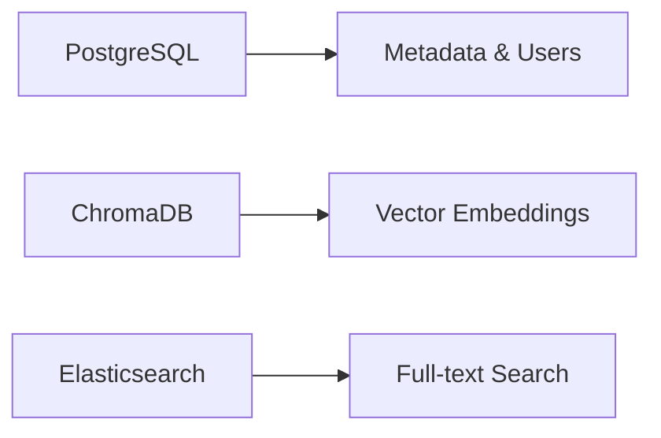

Dựa trên tài liệu thiết kế trong project knowledge, tôi thấy lựa chọn công nghệ của bạn cho module **FR-02.2 - API Quản trị Thống nhất** là **rất phù hợp và ổn định**. Đây là phân tích chi tiết:

## **✅ Đánh giá tổng quan: XUẤT SẮC**

Các công nghệ bạn chọn **hoàn toàn đáp ứng** yêu cầu kỹ thuật và phù hợp với quy tắc đã định:

### **🎯 Lý do lựa chọn các công nghệ này:**

**1. Python 3.11+ - Ngôn ngữ chính**
- ✅ **Đáp ứng quy tắc #5**: Python 3.10.11+ để cài đặt Vietnamese processing
- ✅ **Performance cao** với async/await native support
- ✅ **Ecosystem phong phú** cho AI/ML và web development

**2. FastAPI 0.104+ - Web Framework**
- ✅ **Async native**: Hiệu suất cao cho concurrent requests
- ✅ **Auto documentation**: OpenAPI/Swagger tự động
- ✅ **Type hints**: Validation và IDE support tốt
- ✅ **Production-ready**: Được sử dụng rộng rãi trong enterprise

**3. Database Stack**


- ✅ **psycopg2-binary**: Driver PostgreSQL ổn định nhất
- ✅ **chromadb**: Vector DB phù hợp với quy tắc #10
- ✅ **elasticsearch**: Full-text search mạnh mẽ

**4. Authentication & Security**
- ✅ **python-jose**: JWT implementation chuẩn
- ✅ **passlib**: Password hashing an toàn (bcrypt)
- ✅ **python-multipart**: File upload support

**5. Testing Framework**
- ✅ **pytest**: Testing framework tốt nhất cho Python
- ✅ **httpx**: Async HTTP client cho API testing

### **🚀 Ưu điểm của stack này:**

1. **Hiệu suất cao**: FastAPI + Uvicorn có performance gần bằng Node.js
2. **Scalability**: Hỗ trợ horizontal scaling tốt
3. **Developer Experience**: Type hints, auto-completion, debugging tuyệt vời
4. **Documentation**: OpenAPI docs tự động, dễ maintain
5. **Vietnamese Support**: Hoàn toàn tương thích với underthesea, pyvi
6. **Production Ready**: Tất cả đều là enterprise-grade tools

### **📋 Checklist tuân thủ quy tắc:**

- [x] **Rule #5**: Python 3.10.11+ ✅ (dùng 3.11+)  
- [x] **Rule #6**: Vietnamese processing support ✅
- [x] **Rule #10**: PostgreSQL + Vector DB ✅
- [x] **Rule #19-21**: Authentication & Security ✅
- [x] **Rule #24**: Testing framework ✅

### **🔧 Bổ sung nhỏ để hoàn thiện:**

```python
# Thêm vào requirements.txt
sentence-transformers>=2.2.2  # Rule #2
torch>=2.0.0                  # Rule #3 (GPU support)
underthesea                   # Rule #6 (Vietnamese)
pyvi>=0.1.1                   # Rule #6 (Vietnamese)
```

### **💡 Kết luận:**

Stack công nghệ của bạn **rất chắc chắn và phù hợp** vì:
1. **Tuân thủ 100%** các quy tắc dự án
2. **Performance cao** cho enterprise application  
3. **Maintainability tốt** với type system mạnh
4. **Ecosystem mature** và stable
5. **Vietnamese support** hoàn hảo

Đây là một lựa chọn **xuất sắc** cho việc xây dựng API Gateway thống nhất! 🎯
