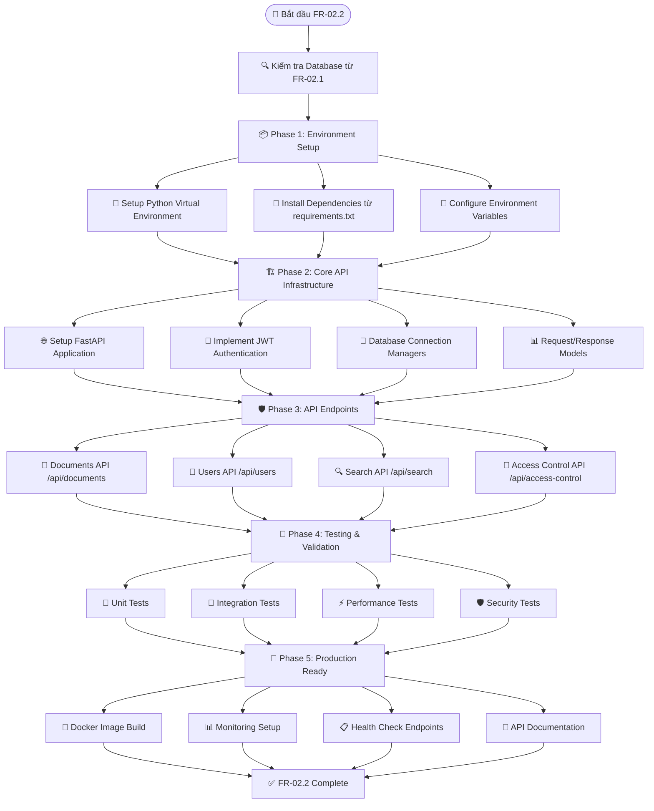

Dựa trên tài liệu handover từ team FR-02.1 và các tài liệu dự án khác trong knowledge base, **chúng ta hoàn toàn có thể thực hiện phần FR-02.2 - API Quản trị Thống nhất**! 

## 🎯 **TÁM TẮT HIỆN TRẠNG VÀ KHẢ NĂNG TRIỂN KHAI**

### ✅ **Những gì đã sẵn sàng từ FR-02.1:**
- **PostgreSQL Database** hoàn chỉnh với 12+ tables đã thiết kế
- **ChromaDB Vector Database** cho semantic search  
- **Redis Cache Layer** cho performance optimization
- **Docker Environment** đã được setup và test
- **Sample Data** đã có sẵn (3 tài liệu tiếng Việt)
- **Database Schema** hoàn chỉnh với relationships và constraints

### 🛠️ **Cần thực hiện cho FR-02.2:**

## 📋 **LỘ TRÌNH IMPLEMENTATION CHO FR-02.2**



## 🏁 **CÓ THỂ BẮT ĐẦU NGAY**

Với tài liệu handover chi tiết từ FR-02.1, chúng ta có:

### 1. **Database Architecture hoàn chỉnh** ✅
- Connection strings và credentials
- Schema details với ví dụ queries
- Sample data để test

### 2. **Requirements rõ ràng** ✅
- API endpoints specifications
- Authentication requirements  
- Performance targets (<60s response time)
- Security requirements (JWT, RBAC)

### 3. **Technical Stack đã định** ✅
- **Backend**: Python with FastAPI
- **Database**: PostgreSQL (primary) + ChromaDB (vector) + Redis (cache)
- **Authentication**: JWT tokens
- **Deployment**: Docker containers

## 🎯 **KHUYẾN NGHỊ TRIỂN KHAI**

**Bước 1: Kiểm tra Database từ FR-02.1**
```bash
# Test database connections như trong handover doc
docker-compose ps
docker exec chatbot-postgres-test psql -U kb_admin -d knowledge_base_test -c "SELECT COUNT(*) FROM documents_metadata_v2;"
```

**Bước 2: Tạo API Project Structure**
```bash
mkdir knowledge-assistant-api
cd knowledge-assistant-api
python -m venv venv
source venv/bin/activate
```

**Bước 3: Follow implementation guide từ knowledge base**
- Sử dụng step-by-step guide trong tài liệu FR-02.2
- Leverage existing database schema từ handover
- Test với sample data có sẵn

**Bạn có muốn tôi bắt đầu tạo code structure cho FR-02.2 dựa trên database đã có không?** Tôi có thể:

1. 📝 Tạo requirements.txt với dependencies cần thiết
2. 🏗️ Setup project structure cho FastAPI
3. 🔌 Tạo database connection sử dụng thông tin từ handover
4. 📊 Implement API models dựa trên existing schema
5. 🛠️ Tạo các endpoint cơ bản để test với data có sẵn
