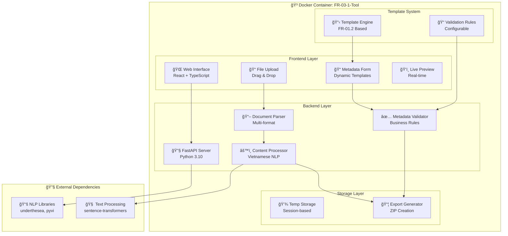
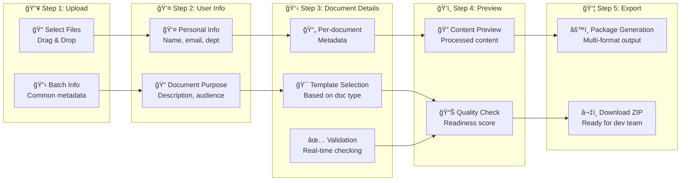
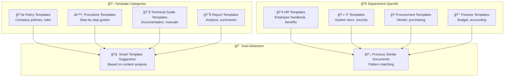
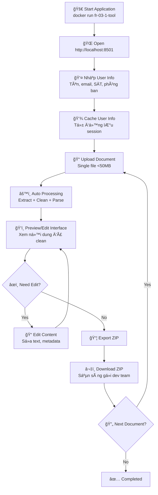
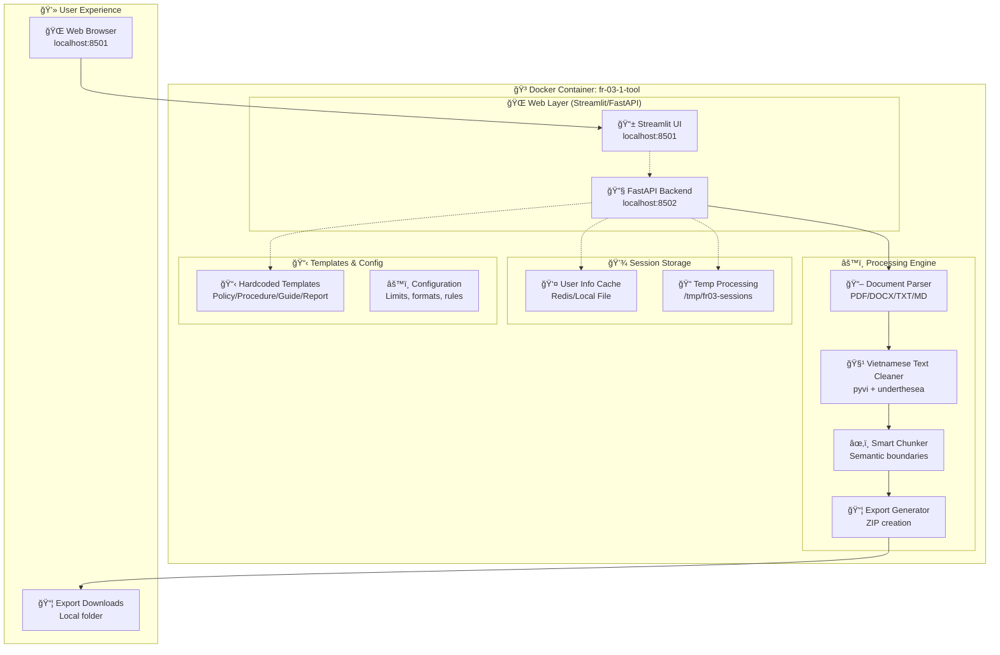

Cảm Æ¡n bạn đã cung cấp định hÆ°á»›ng rõ ràng! TrÆ°á»›c khi bắt đầu viết tài liệu thiết kế, tôi có má»™t số câu há»i để làm rõ requirements:

## 🤔 **CÂU Há»I LÀM RÕ**

### **1. VỠkiến trúc triển khai:**
- Tool này sẽ chạy **standalone** (má»—i nhân viên tá»± setup trên máy cá nhân) hay **centralized** (deploy 1 lần, nhiá»u ngÆ°á»i truy cập qua web)?
- Nếu standalone: Có cần persistent storage hay chỉ xử lý session-based?

### **2. Vá» workflow:**
- Nhân viên phòng ban sẽ xá»­ lý **từng file má»™t** hay có thể **batch upload nhiá»u files** cùng lúc?
- Có cần **review/approval process** trước khi tạo export.zip không?

### **3. Vá» security & access control:**
- Tool này có cần **authentication** (login) hay chỉ cần nhập thông tin user khi sử dụng?
- Có cần **audit log** để track ai đã tạo package nào không?

### **4. Vá» export package format:**
- Export.zip có cần **standardized naming convention** không? (ví dụ: `DEPT_YYYY-MM-DD_DocumentType_v1.0.zip`)
- File size limit cho export package?

### **5. Vá» template system:**
- Templates sẽ được **hard-coded** trong tool hay **configurable** (admin có thể add/edit templates)?
- Có bao nhiêu loại document templates cần support ban đầu?

### **6. Vá» validation:**
- Validation rules có cần **customizable** theo từng phòng ban không?
- Mức độ strict của validation (warning vs blocking)?Dựa trên thông tin từ project knowledge, tôi hiểu rõ hơn vỠrequirements. Tôi sẽ tạo tài liệu thiết kế FR-03.1 theo định hướng của bạn với một số giả định hợp lý:

**Giả định:**
- Tool chạy **centralized** (deploy 1 lần, nhiá»u ngÆ°á»i dùng truy cập qua web)
- Support **batch upload** và **single file processing**
- **Lightweight authentication** (chỉ cần nhập thông tin user khi sử dụng)
- Template system **configurable** dựa trên FR-01.2
- Export naming convention: `{DEPT}_{DOCTYPE}_{YYYY-MM-DD}_{VERSION}.zip`

---

# 📋 **TÀI LIỆU THIẾT KẾ MODULE FR-03.1**
## **CÔNG CỤ CHUYỂN Äá»”I TÀI LIỆU THÔ THÀNH Dá»® LIỆU SẠCH**
### **RAW-TO-CLEAN DOCUMENT PROCESSOR**

---

**Module ID:** FR-03.1  
**Tên Module:** Công cụ Raw-to-Clean Data  
**Phiên bản:** 1.0  
**Ngày:** 06/09/2025  
**NgÆ°á»i soạn thảo:** System Architect Team  
**Trạng thái:** Implementation Ready  

---

## 1. **Tá»”NG QUAN MODULE**

### 1.1 **Mục đích**
Module FR-03.1 cung cấp **công cụ web-based standalone** để chuyển đổi tài liệu thô (raw documents) thành dữ liệu sạch (clean data) có cấu trúc, metadata đầy đủ, sẵn sàng cho quá trình embedding và indexing trong hệ thống RAG. Äầu ra được thiết kế đặc biệt để **há»— trợ việc phát hiện tài liệu trùng lặp** trong các bÆ°á»›c xá»­ lý tiếp theo.

### 1.2 **Phạm vi chức năng**
- **Web Form Interface**: Giao diện nhập metadata cho tài liệu mới với template system
- **Multi-format Document Processing**: Xử lý PDF, DOCX, TXT, MD với content extraction
- **Template System**: Template chuẩn dựa trên FR-01.2 metadata schema  
- **Validation Engine**: Kiểm tra dữ liệu đầu vào bắt buộc với business rules
- **Export Functionality**: Tạo export.zip package với multi-format output
- **Duplicate Detection Prep**: Tạo fingerprints và signatures cho duplicate detection

### 1.3 **Äầu vào và Äầu ra**

| **INPUT** | **OUTPUT** |
|-----------|------------|
| Raw documents (PDF, DOCX, TXT, MD) | **export.zip** package containing: |
| Manual metadata input via web form | - Original documents (preserved) |
| User information (name, email, dept) | - Clean structured documents (.jsonl, .md) |
| Document purpose & description | - Metadata files (.json) |
| Target audience information | - Duplicate detection signatures |
| | - Processing logs & manifest |

### 1.4 **Vị trí trong hệ thống**
```
Raw Documents → [FR-03.1 Raw-to-Clean] → export.zip → [Dev Team] → [FR-03.2 Quality Assessment] → [FR-03.3 Data Ingestion] → Vector DB
```

---

## 2. **KIẾN TRÚC STANDALONE DEPLOYMENT**

### 2.1 **Docker-based Architecture**



### 2.2 **Deployment Options**

#### **Option 1: Single Docker Container (Recommended)**
```yaml
# docker-compose.yml
version: '3.8'
services:
  fr-03-1-tool:
    image: fr-03-1-processor:latest
    ports:
      - "8080:8080"
    volumes:
      - ./temp_storage:/app/temp
      - ./exports:/app/exports
      - ./config:/app/config
    environment:
      - NODE_ENV=production
      - MAX_FILE_SIZE=100MB
      - SESSION_TIMEOUT=3600
```

#### **Option 2: Executable Distribution**
```bash
# For Windows/Linux/MacOS
fr-03-1-tool.exe --port 8080 --storage ./temp --config ./config
```

---

## 3. **WEB INTERFACE DESIGN**

### 3.1 **Main Workflow Interface**



### 3.2 **User Information Form**

```typescript
interface UserInformation {
  // Personal Information
  full_name: string;           // "Nguyễn Văn A"
  email: string;               // "nguyen.van.a@company.com"
  employee_id?: string;        // "EMP001"
  
  // Department Information
  department: string;          // "rd", "hr", "procurement", etc.
  position: string;            // "Senior Developer", "Team Lead"
  
  // Document Context
  purpose: string;             // "Cập nhật quy trình mới", "Tài liệu hướng dẫn"
  target_audience: string[];   // ["employee", "manager", "public"]
  priority: "low" | "medium" | "high";
  
  // Processing Preferences
  language: "vi" | "en";
  auto_generate_tags: boolean;
  enable_content_analysis: boolean;
}
```

### 3.3 **Document Template Selection**



---

## 4. **DOCUMENT PROCESSING ENGINE**

### 4.1 **Multi-format Parser**

```python
class DocumentProcessor:
    """
    Core document processing engine
    """
    
    def __init__(self):
        self.supported_formats = ['.pdf', '.docx', '.doc', '.txt', '.md']
        self.vietnamese_processor = VietnameseTextProcessor()
        
    def process_document(self, file_path: str, metadata: dict) -> ProcessedDocument:
        """
        Main processing pipeline
        """
        # Step 1: Extract raw content
        raw_content = self._extract_content(file_path)
        
        # Step 2: Analyze document structure  
        structure = self._analyze_structure(raw_content)
        
        # Step 3: Clean and normalize Vietnamese text
        clean_content = self.vietnamese_processor.clean_text(raw_content)
        
        # Step 4: Generate chunks for embedding
        chunks = self._create_chunks(clean_content)
        
        # Step 5: Extract assets (images, tables)
        assets = self._extract_assets(file_path)
        
        # Step 6: Generate fingerprints for duplicate detection
        fingerprints = self._generate_fingerprints(raw_content, clean_content)
        
        # Step 7: Create human-readable markdown
        markdown = self._create_markdown(clean_content, metadata)
        
        return ProcessedDocument(
            original_file=file_path,
            clean_content=clean_content,
            chunks=chunks,
            assets=assets,
            fingerprints=fingerprints,
            markdown=markdown,
            structure=structure,
            metadata=metadata
        )
```

### 4.2 **Vietnamese Text Processing**

```python
class VietnameseTextProcessor:
    """
    Specialized Vietnamese text processing
    """
    
    def __init__(self):
        # Load Vietnamese NLP tools
        self.tokenizer = ViTokenizer()  # from pyvi
        self.word_segmenter = word_tokenize  # from underthesea
        
    def clean_text(self, text: str) -> str:
        """
        Comprehensive Vietnamese text cleaning
        """
        # Step 1: Unicode normalization
        text = unicodedata.normalize('NFC', text)
        
        # Step 2: Remove special characters but preserve Vietnamese
        text = re.sub(r'[^\w\s\u00C0-\u024F\u1E00-\u1EFF]', ' ', text)
        
        # Step 3: Handle Vietnamese-specific issues
        text = self._handle_diacritics(text)
        text = self._handle_word_boundaries(text)
        
        # Step 4: Sentence segmentation
        sentences = self._segment_sentences(text)
        
        # Step 5: Word tokenization
        tokenized = [self.word_segmenter(sentence) for sentence in sentences]
        
        return ' '.join([' '.join(tokens) for tokens in tokenized])
    
    def create_chunks(self, text: str, chunk_size: int = 512) -> List[dict]:
        """
        Intelligent chunking for Vietnamese text
        """
        sentences = self._segment_sentences(text)
        chunks = []
        current_chunk = ""
        current_tokens = 0
        
        for sentence in sentences:
            sentence_tokens = len(self.tokenizer.tokenize(sentence))
            
            if current_tokens + sentence_tokens > chunk_size and current_chunk:
                chunks.append({
                    'text': current_chunk.strip(),
                    'token_count': current_tokens,
                    'sentence_count': len(current_chunk.split('. '))
                })
                current_chunk = sentence
                current_tokens = sentence_tokens
            else:
                current_chunk += " " + sentence
                current_tokens += sentence_tokens
        
        # Add remaining chunk
        if current_chunk:
            chunks.append({
                'text': current_chunk.strip(),
                'token_count': current_tokens,
                'sentence_count': len(current_chunk.split('. '))
            })
            
        return chunks
```

### 4.3 **Duplicate Detection Preparation**

```python
class DuplicateDetectionPrep:
    """
    Generate signatures for duplicate detection
    """
    
    def generate_fingerprints(self, file_path: str, content: str) -> dict:
        """
        Create comprehensive fingerprints
        """
        return {
            # File-level signatures
            "file_signatures": {
                "sha256": self._calculate_file_hash(file_path),
                "md5": self._calculate_file_hash(file_path, algorithm='md5'),
                "file_size": os.path.getsize(file_path),
                "filename_normalized": self._normalize_filename(file_path)
            },
            
            # Content-level signatures  
            "content_signatures": {
                "content_sha256": hashlib.sha256(content.encode()).hexdigest(),
                "simhash": self._calculate_simhash(content),
                "minhash": self._calculate_minhash(content),
                "text_length": len(content),
                "word_count": len(content.split())
            },
            
            # Semantic signatures
            "semantic_signatures": {
                "key_phrases": self._extract_key_phrases(content),
                "structure_signature": self._analyze_structure_signature(content),
                "topic_keywords": self._extract_topic_keywords(content),
                "language_pattern": self._analyze_language_pattern(content)
            }
        }
    
    def _calculate_simhash(self, text: str, hash_bits: int = 64) -> str:
        """
        Calculate SimHash for near-duplicate detection
        """
        # Vietnamese-optimized SimHash implementation
        tokens = self.vietnamese_processor.word_segmenter(text)
        
        # Calculate TF-IDF weights
        tf_scores = {}
        for token in tokens:
            tf_scores[token] = tf_scores.get(token, 0) + 1
            
        # Convert to SimHash
        hash_vector = [0] * hash_bits
        for token, freq in tf_scores.items():
            token_hash = hash(token)
            for i in range(hash_bits):
                if (token_hash >> i) & 1:
                    hash_vector[i] += freq
                else:
                    hash_vector[i] -= freq
        
        # Generate final hash
        simhash = 0
        for i, val in enumerate(hash_vector):
            if val > 0:
                simhash |= (1 << i)
                
        return format(simhash, f'0{hash_bits}b')
```

---

## 5. **EXPORT PACKAGE STRUCTURE**

### 5.1 **Export ZIP Package Format**

```bash
{DEPT}_{DOCTYPE}_{YYYY-MM-DD}_{VERSION}.zip
│
├── manifest.json                    # 📋 Package inventory
├── user_info.json                   # 👤 Creator information
│
├── source/                          # 🔄 Original preservation
│   ├── original_001.docx           # Original files
│   ├── original_002.pdf
│   └── source_metadata.json        # File properties
│
├── processed/                       # 📊 NLP-ready formats
│   ├── content.jsonl               # Structured chunks for embedding
│   ├── documents.md                # Human-readable format
│   ├── metadata.json               # Business metadata
│   └── processing_log.json         # Processing details
│
├── assets/                          # ğŸ–¼ï¸ Extracted resources
│   ├── images/
│   │   ├── diagram_001.png
│   │   └── chart_002.svg
│   ├── tables/
│   │   └── pricing_table.json
│   └── assets_manifest.json
│
├── signatures/                      # 🔠Duplicate detection prep
│   ├── file_fingerprints.json      # File-level signatures
│   ├── content_signatures.json     # Content-level signatures
│   └── semantic_features.json      # Semantic analysis
│
└── validation/                      # ✅ Quality assurance
    ├── validation_report.json       # Validation results
    ├── quality_score.json          # Quality metrics
    └── warnings_errors.json        # Issues found
```

### 5.2 **Key Files Content**

#### **📋 manifest.json**
```json
{
  "package_info": {
    "package_id": "RD_TECH_2025-09-06_v1.0",
    "created_at": "2025-09-06T14:30:00Z",
    "package_version": "1.0",
    "tool_version": "FR-03.1_v1.0",
    "total_documents": 3,
    "total_size_mb": 15.7
  },
  
  "creator_info": {
    "full_name": "Nguyễn Văn A",
    "email": "nguyen.van.a@company.com",
    "department": "rd",
    "position": "Senior Developer",
    "created_date": "2025-09-06T14:30:00Z"
  },
  
  "documents": [
    {
      "document_id": "RD_TECH_001_2025",
      "original_file": "source/api_documentation.pdf",
      "processed_files": {
        "jsonl": "processed/content.jsonl#doc_001",
        "markdown": "processed/documents.md#doc_001"
      },
      "signatures": "signatures/file_fingerprints.json#doc_001",
      "status": "ready_for_ingestion"
    }
  ],
  
  "processing_summary": {
    "total_chunks": 156,
    "avg_chunk_size": 487,
    "total_assets": 12,
    "quality_score": 0.92,
    "validation_passed": true
  }
}
```

#### **👤 user_info.json**
```json
{
  "session_info": {
    "session_id": "sess_abc123",
    "processing_date": "2025-09-06T14:30:00Z",
    "processing_duration_minutes": 8.5,
    "tool_version": "FR-03.1_v1.0"
  },
  
  "user_details": {
    "personal": {
      "full_name": "Nguyễn Văn A",
      "email": "nguyen.van.a@company.com", 
      "employee_id": "EMP001",
      "phone": "+84-xxx-xxx-xxx"
    },
    
    "organizational": {
      "department": "rd",
      "department_name": "Research & Development",
      "position": "Senior Developer",
      "manager": "Trần Thị B",
      "location": "HQ_Floor_3"
    },
    
    "document_context": {
      "purpose": "Cập nhật tài liệu hướng dẫn API mới cho hệ thống",
      "target_audience": ["employee", "manager"],
      "priority": "high",
      "expected_usage": "Hướng dẫn phát triển và integration cho team",
      "related_projects": ["Project Alpha", "API Gateway V2"]
    }
  },
  
  "processing_preferences": {
    "language": "vi",
    "auto_generate_tags": true,
    "enable_content_analysis": true,
    "chunk_size_preference": 512,
    "quality_threshold": 0.8
  }
}
```

#### **📄 processed/content.jsonl**
```jsonl
{"document_id": "RD_TECH_001_2025", "chunk_id": "RD_TECH_001_2025_CHUNK_001", "content": "Hệ thống API Gateway V2 cung cấp các endpoints RESTful cho việc quản lý tài liệu nội bộ...", "chunk_order": 1, "chunk_type": "introduction", "word_count": 89, "token_count": 127, "language": "vi"}
{"document_id": "RD_TECH_001_2025", "chunk_id": "RD_TECH_001_2025_CHUNK_002", "content": "Endpoint /api/v2/documents hỗ trợ các phương thức GET, POST, PUT, DELETE với authentication bắt buộc...", "chunk_order": 2, "chunk_type": "api_specification", "word_count": 76, "token_count": 108, "language": "vi"}
```

#### **🔠signatures/file_fingerprints.json**
```json
{
  "RD_TECH_001_2025": {
    "file_level": {
      "sha256": "a1b2c3d4e5f6...",
      "md5": "x1y2z3a4b5c6...",
      "file_size_bytes": 2847392,
      "filename_normalized": "api_documentation_v2",
      "mime_type": "application/pdf",
      "creation_date": "2025-09-06T14:30:00Z"
    },
    
    "content_level": {
      "content_sha256": "b2c3d4e5f6g7...",
      "simhash_64bit": "1010110100110101...",
      "minhash_signatures": ["hash1", "hash2", "hash3"],
      "text_length_chars": 45678,
      "word_count": 8934,
      "paragraph_count": 89,
      "sentence_count": 234
    },
    
    "semantic_level": {
      "key_phrases": [
        "API Gateway V2",
        "RESTful endpoints", 
        "authentication required",
        "document management"
      ],
      "topic_keywords": ["api", "gateway", "documentation", "rest", "authentication"],
      "structure_signature": "title-introduction-api_spec-examples-conclusion",
      "language_pattern": "vietnamese_technical_document",
      "complexity_score": 0.67
    }
  }
}
```

---

## 6. **TEMPLATE SYSTEM INTEGRATION**

### 6.1 **Template Configuration (Based on FR-01.2)**

```json
{
  "templates": {
    "policy": {
      "name": "Company Policy Template",
      "description": "Chính sách công ty và quy định",
      "required_fields": [
        "policy_number", "effective_date", "review_date",
        "approval_authority", "scope", "compliance_requirements"
      ],
      "optional_fields": [
        "related_policies", "exceptions", "enforcement_procedures"
      ],
      "access_level_default": "employee_only",
      "validation_rules": {
        "effective_date": "must_be_future_date",
        "review_date": "must_be_after_effective_date",
        "approval_authority": "must_be_director_or_above"
      }
    },
    
    "procedure": {
      "name": "Standard Operating Procedure",
      "description": "Quy trình làm việc chuẩn",
      "required_fields": [
        "procedure_id", "version", "responsible_department",
        "steps", "inputs", "outputs", "success_criteria"
      ],
      "optional_fields": [
        "prerequisites", "tools_required", "troubleshooting",
        "related_procedures", "training_requirements"
      ],
      "access_level_default": "employee_only",
      "validation_rules": {
        "steps": "minimum_3_steps_required",
        "responsible_department": "must_exist_in_org_chart",
        "version": "must_follow_semantic_versioning"
      }
    },
    
    "technical_guide": {
      "name": "Technical Documentation",
      "description": "Tài liệu kỹ thuật và hướng dẫn",
      "required_fields": [
        "system_name", "version", "technical_owner", 
        "prerequisites", "installation_steps", "configuration"
      ],
      "optional_fields": [
        "api_documentation", "troubleshooting", "faq",
        "performance_requirements", "security_considerations"
      ],
      "access_level_default": "employee_only",
      "validation_rules": {
        "technical_owner": "must_be_technical_role",
        "prerequisites": "must_list_system_requirements",
        "version": "must_match_system_version"
      }
    },
    
    "report": {
      "name": "Business Report",
      "description": "Báo cáo kinh doanh và phân tích",
      "required_fields": [
        "report_period", "prepared_by", "executive_summary",
        "key_findings", "recommendations", "data_sources"
      ],
      "optional_fields": [
        "methodology", "limitations", "appendices",
        "stakeholder_feedback", "action_items"
      ],
      "access_level_default": "manager_only",
      "validation_rules": {
        "report_period": "must_be_valid_date_range",
        "prepared_by": "must_be_authorized_analyst",
        "data_sources": "must_list_all_sources"
      }
    }
  }
}
```

### 6.2 **Dynamic Form Generation**

```typescript
interface TemplateField {
  name: string;
  type: 'text' | 'textarea' | 'select' | 'date' | 'number' | 'array';
  required: boolean;
  label: string;
  placeholder?: string;
  validation?: ValidationRule[];
  conditional_display?: ConditionalRule[];
  help_text?: string;
}

class DynamicFormGenerator {
  generateForm(template: DocumentTemplate, userRole: string): FormDefinition {
    const fields: TemplateField[] = [];
    
    // Add required fields
    template.required_fields.forEach(fieldName => {
      const fieldConfig = this.getFieldConfiguration(fieldName, template);
      if (this.userCanAccessField(fieldConfig, userRole)) {
        fields.push(fieldConfig);
      }
    });
    
    // Add optional fields based on user preference
    template.optional_fields.forEach(fieldName => {
      const fieldConfig = this.getFieldConfiguration(fieldName, template);
      if (this.userCanAccessField(fieldConfig, userRole)) {
        fieldConfig.required = false;
        fields.push(fieldConfig);
      }
    });
    
    return {
      template_id: template.id,
      fields: fields,
      validation_rules: template.validation_rules,
      default_values: this.getDefaultValues(template, userRole)
    };
  }
}
```

---

## 7. **DEPLOYMENT & OPERATIONS**

### 7.1 **Docker Deployment**

#### **Dockerfile**
```dockerfile
FROM node:18-alpine AS frontend-builder
WORKDIR /app/frontend
COPY frontend/package*.json ./
RUN npm ci --only=production
COPY frontend/ ./
RUN npm run build

FROM python:3.10-slim AS backend-builder
WORKDIR /app
COPY requirements.txt ./
RUN pip install --no-cache-dir -r requirements.txt

# Install Vietnamese NLP tools
RUN pip install underthesea pyvi sentence-transformers

FROM python:3.10-slim
WORKDIR /app

# Copy Python dependencies
COPY --
```
### Äổi hÆ°á»›ng
---
Cảm ơn bạn đã làm rõ! Tôi sẽ thiết kế lại FR-03.1 theo workflow đơn giản và standalone như bạn yêu cầu.

---

# 📋 **TÀI LIỆU THIẾT KẾ MODULE FR-03.1**
## **CÔNG CỤ CHUYỂN Äá»”I TÀI LIỆU THÔ THÀNH Dá»® LIỆU SẠCH**
### **STANDALONE RAW-TO-CLEAN DOCUMENT PROCESSOR**

---

**Module ID:** FR-03.1  
**Tên Module:** Công cụ Raw-to-Clean Data Standalone  
**Phiên bản:** 1.0  
**Ngày:** 06/09/2025  
**NgÆ°á»i soạn thảo:** System Architect Team  
**Trạng thái:** Implementation Ready  

---

## 1. **Tá»”NG QUAN MODULE**

### 1.1 **Mục đích**
Module FR-03.1 là **công cụ standalone** chạy trên Docker, cho phép nhân viên phòng ban tự xử lý tài liệu thô thành dữ liệu sạch có cấu trúc. Tool tạo ra **export.zip** package sẵn sàng gửi cho đội phát triển để nạp vào hệ thống RAG.

### 1.2 **Äặc Ä‘iểm chính**
- ✅ **Standalone Docker container** - dễ triển khai qua email/USB
- ✅ **Web interface đơn giản** - truy cập qua http://localhost:8501
- ✅ **Không cần authentication** - trực tiếp sử dụng
- ✅ **Single-file upload** với user info caching
- ✅ **Preview/Edit** trước khi export
- ✅ **Standardized ZIP output** cho dev team

### 1.3 **User Workflow**



### 1.4 **Input/Output**

| **INPUT** | **OUTPUT** |
|-----------|------------|
| Single document (PDF, DOCX, TXT, MD) | **{DEPT}_{DOCTYPE}_{YYYYMMDD}_{HHMMSS}.zip** |
| User info (cached across sessions) | - Original document preserved |
| Document purpose & description | - Cleaned content (.jsonl, .md) |
| | - Metadata files (.json) |
| | - Duplicate detection signatures |
| | - User information & processing log |

---

## 2. **DOCKER STANDALONE ARCHITECTURE**

### 2.1 **Single Container Design**



### 2.2 **Docker Deployment Package**

#### **Package Structure for Distribution**
```bash
fr-03-1-deployment-package/
├── README.md                    # 📖 Quick start guide
├── docker-compose.yml          # 🳠One-command deployment
├── Dockerfile                  # ğŸ—ï¸ Container definition
├── requirements.txt            # 📦 Python dependencies
├── config/
│   ├── templates.json          # 📋 Document templates
│   ├── settings.json           # âš™ï¸ Tool configuration
│   └── departments.json        # 🢠Department list
├── src/                        # 💻 Application source
│   ├── app.py                  # 🚀 Main Streamlit app
│   ├── api/                    # 🔧 FastAPI backend
│   ├── processors/             # âš™ï¸ Document processing
│   └── utils/                  # ğŸ› ï¸ Helper functions
└── deploy.bat / deploy.sh      # 🚀 Auto-deployment scripts
```

#### **docker-compose.yml**
```yaml
version: '3.8'
services:
  fr-03-1-tool:
    build: .
    ports:
      - "8501:8501"  # Streamlit UI
      - "8502:8502"  # FastAPI (internal)
    volumes:
      - ./exports:/app/exports        # Export output folder
      - ./temp:/app/temp             # Temp processing
      - ./config:/app/config:ro      # Configuration (read-only)
    environment:
      - MAX_FILE_SIZE_MB=50
      - SESSION_TIMEOUT_HOURS=8
      - STREAMLIT_SERVER_PORT=8501
      - STREAMLIT_SERVER_ADDRESS=0.0.0.0
    restart: unless-stopped
    container_name: fr-03-1-processor
```

#### **Quick Deploy Script (deploy.bat)**
```batch
@echo off
echo ================================
echo FR-03.1 Document Processor Tool
echo ================================
echo.

echo Checking Docker installation...
docker --version >nul 2>&1
if errorlevel 1 (
    echo ERROR: Docker is not installed or not running!
    echo Please install Docker Desktop first.
    pause
    exit /b 1
)

echo Starting FR-03.1 Tool...
docker-compose up -d

echo.
echo ================================
echo 🚀 Tool is starting up...
echo 📱 Web Interface: http://localhost:8501
echo 📠Export folder: ./exports/
echo ================================
echo.
echo Press any key when you want to stop the tool...
pause

echo Stopping tool...
docker-compose down
echo Tool stopped.
pause
```

---

## 3. **WEB INTERFACE DESIGN**

### 3.1 **Streamlit UI Layout**

```python
# src/app.py - Main Streamlit Application
import streamlit as st
import requests
import os
from datetime import datetime

def main():
    st.set_page_config(
        page_title="FR-03.1 Document Processor",
        page_icon="📄",
        layout="wide"
    )
    
    st.title("📄 Công cụ Chuyển đổi Tài liệu")
    st.markdown("### Raw-to-Clean Document Processor")
    
    # Session state management
    if 'user_info' not in st.session_state:
        st.session_state.user_info = {}
    if 'current_step' not in st.session_state:
        st.session_state.current_step = 'user_info'
    
    # Step navigation
    step = st.session_state.current_step
    
    if step == 'user_info':
        show_user_info_form()
    elif step == 'document_upload':
        show_document_upload()
    elif step == 'preview_edit':
        show_preview_edit()
    elif step == 'export':
        show_export()

def show_user_info_form():
    st.header("👤 Thông tin ngÆ°á»i sá»­ dụng")
    
    # Load cached user info if exists
    cached_info = load_cached_user_info()
    
    col1, col2 = st.columns(2)
    
    with col1:
        full_name = st.text_input(
            "HỠvà tên *", 
            value=cached_info.get('full_name', ''),
            placeholder="Nguyễn Văn A"
        )
        email = st.text_input(
            "Email *", 
            value=cached_info.get('email', ''),
            placeholder="nguyen.van.a@company.com"
        )
        phone = st.text_input(
            "Số điện thoại", 
            value=cached_info.get('phone', ''),
            placeholder="+84-xxx-xxx-xxx"
        )
    
    with col2:
        department = st.selectbox(
            "Phòng ban *",
            options=get_departments(),
            index=get_department_index(cached_info.get('department', '')),
            placeholder="Chá»n phòng ban"
        )
        position = st.text_input(
            "Chức vụ", 
            value=cached_info.get('position', ''),
            placeholder="Senior Developer"
        )
        employee_id = st.text_input(
            "Mã nhân viên", 
            value=cached_info.get('employee_id', ''),
            placeholder="EMP001"
        )
    
    # Document context
    st.subheader("📠Bối cảnh tài liệu")
    document_purpose = st.text_area(
        "Mục đích tài liệu",
        value=cached_info.get('document_purpose', ''),
        placeholder="Mô tả ngắn gá»n mục đích và cách sá»­ dụng tài liệu này",
        height=100
    )
    
    target_audience = st.multiselect(
        "Äối tượng tiếp cận",
        options=["public", "employee_only", "manager_only", "director_only"],
        default=cached_info.get('target_audience', ["employee_only"])
    )
    
    if st.button("💾 Lưu thông tin và Tiếp tục", type="primary"):
        if validate_required_fields(full_name, email, department):
            user_info = {
                'full_name': full_name,
                'email': email,
                'phone': phone,
                'department': department,
                'position': position,
                'employee_id': employee_id,
                'document_purpose': document_purpose,
                'target_audience': target_audience,
                'created_at': datetime.now().isoformat()
            }
            
            # Cache user info
            save_user_info_cache(user_info)
            st.session_state.user_info = user_info
            st.session_state.current_step = 'document_upload'
            st.rerun()
        else:
            st.error("Vui lòng Ä‘iá»n đầy đủ các trÆ°á»ng bắt buá»™c (*)")

def show_document_upload():
    st.header("📠Upload tài liệu")
    
    # Show cached user info
    user_info = st.session_state.user_info
    with st.expander("👤 Thông tin ngÆ°á»i dùng (click để xem)", expanded=False):
        col1, col2 = st.columns(2)
        with col1:
            st.text(f"HỠtên: {user_info['full_name']}")
            st.text(f"Email: {user_info['email']}")
            st.text(f"Phòng ban: {user_info['department']}")
        with col2:
            st.text(f"SÄT: {user_info.get('phone', 'ChÆ°a có')}")
            st.text(f"Chức vụ: {user_info.get('position', 'Chưa có')}")
    
    if st.button("âœï¸ Sá»­a thông tin ngÆ°á»i dùng"):
        st.session_state.current_step = 'user_info'
        st.rerun()
    
    st.markdown("---")
    
    # Document upload
    uploaded_file = st.file_uploader(
        "Chá»n tài liệu cần xá»­ lý",
        type=['pdf', 'docx', 'doc', 'txt', 'md'],
        help="Hỗ trợ: PDF, DOCX, DOC, TXT, MD. Tối đa 50MB"
    )
    
    if uploaded_file is not None:
        # Validate file size
        file_size_mb = len(uploaded_file.getvalue()) / (1024 * 1024)
        if file_size_mb > 50:
            st.error(f"File quá lá»›n ({file_size_mb:.1f}MB). Vui lòng chá»n file dÆ°á»›i 50MB.")
            return
        
        # Show file info
        st.success(f"✅ Äã chá»n file: {uploaded_file.name} ({file_size_mb:.1f}MB)")
        
        # Document metadata
        st.subheader("📋 Thông tin tài liệu")
        
        col1, col2 = st.columns(2)
        with col1:
            doc_title = st.text_input(
                "Tiêu đỠtài liệu *",
                value=os.path.splitext(uploaded_file.name)[0],
                placeholder="Nhập tiêu đỠtài liệu"
            )
            doc_type = st.selectbox(
                "Loại tài liệu *",
                options=["procedure", "policy", "technical_guide", "report"],
                format_func=lambda x: {
                    "procedure": "Quy trình (Procedure)",
                    "policy": "Chính sách (Policy)", 
                    "technical_guide": "Hướng dẫn kỹ thuật (Technical Guide)",
                    "report": "Báo cáo (Report)"
                }[x]
            )
        
        with col2:
            doc_version = st.text_input("Phiên bản", value="1.0", placeholder="1.0")
            access_level = st.selectbox(
                "Cấp độ truy cập",
                options=["public", "employee_only", "manager_only", "director_only"],
                index=1,  # Default to employee_only
                format_func=lambda x: {
                    "public": "Công khai (Public)",
                    "employee_only": "Nhân viên (Employee Only)",
                    "manager_only": "Quản lý (Manager Only)", 
                    "director_only": "Giám đốc (Director Only)"
                }[x]
            )
        
        doc_description = st.text_area(
            "Mô tả tài liệu",
            placeholder="Mô tả ngắn gá»n ná»™i dung và mục đích của tài liệu",
            height=100
        )
        
        doc_tags = st.text_input(
            "Tags (phân cách bằng dấu phẩy)",
            placeholder="quy-trình, mua-hàng, phê-duyệt",
            help="Nhập các từ khóa để dễ tìm kiếm, phân cách bằng dấu phẩy"
        )
        
        if st.button("🔄 Xử lý tài liệu", type="primary"):
            if doc_title and doc_type:
                with st.spinner("Äang xá»­ lý tài liệu..."):
                    # Process document
                    processed_result = process_document(
                        uploaded_file, 
                        user_info,
                        {
                            'title': doc_title,
                            'type': doc_type,
                            'version': doc_version,
                            'access_level': access_level,
                            'description': doc_description,
                            'tags': [tag.strip() for tag in doc_tags.split(',') if tag.strip()]
                        }
                    )
                    
                    if processed_result['success']:
                        st.session_state.processed_document = processed_result
                        st.session_state.current_step = 'preview_edit'
                        st.success("✅ Xử lý thành công!")
                        st.rerun()
                    else:
                        st.error(f"⌠Lỗi xử lý: {processed_result['error']}")
            else:
                st.error("Vui lòng Ä‘iá»n đầy đủ tiêu Ä‘á» và loại tài liệu")

def show_preview_edit():
    st.header("ğŸ‘ï¸ Xem trÆ°á»›c và Chỉnh sá»­a")
    
    processed_doc = st.session_state.processed_document
    
    # Document info summary
    with st.expander("📋 Thông tin tài liệu", expanded=True):
        col1, col2, col3 = st.columns(3)
        with col1:
            st.metric("📄 Tên file", processed_doc['original_filename'])
            st.metric("📠Loại tài liệu", processed_doc['metadata']['document_type'])
        with col2:
            st.metric("📠Số từ", f"{processed_doc['stats']['word_count']:,}")
            st.metric("🧩 Số chunks", processed_doc['stats']['chunk_count'])
        with col3:
            st.metric("🔒 Cấp độ truy cập", processed_doc['metadata']['access_level'])
            st.metric("📊 Quality Score", f"{processed_doc['quality_score']:.2f}")
    
    # Content preview and editing
    st.subheader("📖 Nội dung đã xử lý")
    
    tab1, tab2, tab3 = st.tabs(["📠Markdown Preview", "🧩 Chunks View", "📋 Metadata"])
    
    with tab1:
        # Show markdown content with edit capability
        st.markdown("**Ná»™i dung Markdown:**")
        edited_content = st.text_area(
            "Chỉnh sửa nội dung (Markdown format):",
            value=processed_doc['content']['markdown'],
            height=400,
            help="Bạn có thể chỉnh sửa nội dung ở đây. Sử dụng Markdown syntax."
        )
        
        if edited_content != processed_doc['content']['markdown']:
            st.info("âš ï¸ Ná»™i dung đã được chỉnh sá»­a. Nhấn 'Cập nhật' để áp dụng.")
            if st.button("🔄 Cập nhật nội dung"):
                # Update content and regenerate chunks
                update_result = update_document_content(processed_doc, edited_content)
                if update_result['success']:
                    st.session_state.processed_document = update_result['document']
                    st.success("✅ Äã cập nhật ná»™i dung!")
                    st.rerun()
                else:
                    st.error(f"⌠Lỗi cập nhật: {update_result['error']}")
    
    with tab2:
        # Show chunks
        st.markdown("**Chunks được tạo ra:**")
        for i, chunk in enumerate(processed_doc['content']['chunks']):
            with st.expander(f"Chunk {i+1} ({chunk['token_count']} tokens)", expanded=False):
                st.text_area(
                    f"Ná»™i dung chunk {i+1}:",
                    value=chunk['content'],
                    height=150,
                    key=f"chunk_{i}",
                    disabled=True
                )
    
    with tab3:
        # Show and edit metadata
        st.json(processed_doc['metadata'])
    
    # Action buttons
    st.markdown("---")
    col1, col2, col3 = st.columns(3)
    
    with col1:
        if st.button("🔙 Quay lại upload", type="secondary"):
            st.session_state.current_step = 'document_upload'
            st.rerun()
    
    with col2:
        if st.button("🔄 Xử lý lại"):
            # Regenerate processing
            st.rerun()
    
    with col3:
        if st.button("📦 Export ZIP", type="primary"):
            st.session_state.current_step = 'export'
            st.rerun()

def show_export():
    st.header("📦 Export tài liệu")
    
    processed_doc = st.session_state.processed_document
    user_info = st.session_state.user_info
    
    # Generate export package
    with st.spinner("Äang tạo export package..."):
        export_result = generate_export_package(processed_doc, user_info)
    
    if export_result['success']:
        st.success("✅ Tạo export package thành công!")
        
        # Package info
        package_info = export_result['package_info']
        
        col1, col2 = st.columns(2)
        with col1:
            st.metric("📦 Tên package", package_info['filename'])
            st.metric("📠Kích thước", f"{package_info['size_mb']:.1f} MB")
        with col2:
            st.metric("📄 Số tài liệu", package_info['document_count'])
            st.metric("🧩 Tổng chunks", package_info['total_chunks'])
        
        # Download button
        with open(package_info['filepath'], 'rb') as f:
            st.download_button(
                label="â¬‡ï¸ Tải xuống Export Package",
                data=f.read(),
                file_name=package_info['filename'],
                mime='application/zip',
                type="primary"
            )
        
        # Instructions
        st.info("""
        📋 **Hướng dẫn tiếp theo:**
        1. Tải xuống file ZIP package
        2. Gửi file này cho đội phát triển 
        3. Äá»™i phát triển sẽ sá»­ dụng file này để nạp vào hệ thống
        """)
        
        # Next document
        if st.button("📄 Xử lý tài liệu mới"):
            # Clear session state for new document
            for key in ['processed_document', 'current_step']:
                if key in st.session_state:
                    del st.session_state[key]
            st.session_state.current_step = 'document_upload'
            st.rerun()
            
    else:
        st.error(f"⌠Lỗi tạo export: {export_result['error']}")
        if st.button("🔄 Thử lại"):
            st.rerun()

if __name__ == "__main__":
    main()
```

---

## 4. **EXPORT PACKAGE STRUCTURE**

### 4.1 **Standardized Naming Convention**

```python
def generate_export_filename(user_info: dict, doc_metadata: dict) -> str:
    """
    Generate standardized export filename
    Format: {DEPT}_{DOCTYPE}_{YYYYMMDD}_{HHMMSS}.zip
    """
    dept = user_info['department'].upper()
    doc_type = doc_metadata['document_type'].upper()
    timestamp = datetime.now().strftime("%Y%m%d_%H%M%S")
    
    return f"{dept}_{doc_type}_{timestamp}.zip"

# Examples:
# RD_PROCEDURE_20250906_143022.zip
# HR_POLICY_20250906_150134.zip  
# IT_TECHNICAL_GUIDE_20250906_161245.zip
```

### 4.2 **Export Package Contents**

```bash
RD_PROCEDURE_20250906_143022.zip
│
├── manifest.json                    # 📋 Package summary
├── user_info.json                   # 👤 Creator information
│
├── source/                          # 🔄 Original preservation
│   ├── api_documentation.pdf        # Original file
│   └── source_metadata.json         # File properties
│
├── processed/                       # 📊 NLP-ready formats
│   ├── content.jsonl               # Structured chunks
│   ├── document.md                 # Human-readable
│   ├── metadata.json               # Business metadata
│   └── processing_log.json         # Processing details
│
├── signatures/                      # 🔠Duplicate detection
│   ├── file_fingerprints.json      # File signatures
│   ├── content_signatures.json     # Content signatures
│   └── semantic_features.json      # Semantic analysis
│
└── validation/                      # ✅ Quality assurance
    ├── quality_score.json          # Quality metrics
    └── processing_stats.json       # Processing statistics
```

### 4.3 **Key Files Content Examples**

#### **📋 manifest.json**
```json
{
  "package_info": {
    "package_id": "RD_PROCEDURE_20250906_143022",
    "filename": "RD_PROCEDURE_20250906_143022.zip", 
    "created_at": "2025-09-06T14:30:22Z",
    "tool_version": "FR-03.1_v1.0",
    "format_version": "1.0"
  },
  
  "creator": {
    "full_name": "Nguyễn Văn A",
    "email": "nguyen.van.a@company.com",
    "department": "rd",
    "session_id": "sess_abc123_20250906"
  },
  
  "document": {
    "document_id": "RD_PROC_001_2025",
    "title": "API Documentation V2",
    "type": "procedure",
    "version": "1.0",
    "original_filename": "api_documentation.pdf",
    "file_size_mb": 3.2,
    "processing_status": "completed"
  },
  
  "processing_stats": {
    "total_chunks": 34,
    "avg_chunk_size": 487,
    "total_words": 4567,
    "processing_duration_seconds": 23.4,
    "quality_score": 0.89
  },
  
  "for_dev_team": {
    "ready_for_ingestion": true,
    "duplicate_check_ready": true,
    "embedding_ready": true,
    "contains_vietnamese": true,
    "recommended_embedding_model": "Qwen/Qwen3-Embedding-0.6B"
  }
}
```

#### **👤 user_info.json**
```json
{
  "personal_info": {
    "full_name": "Nguyễn Văn A",
    "email": "nguyen.van.a@company.com",
    "phone": "+84-xxx-xxx-xxx",
    "employee_id": "EMP001"
  },
  
  "organizational_info": {
    "department": "rd",
    "department_name": "Research & Development",
    "position": "Senior Developer",
    "location": "HQ_Building_A"
  },
  
  "document_context": {
    "purpose": "Cập nhật tài liệu hướng dẫn API cho hệ thống mới",
    "target_audience": ["employee_only", "manager_only"],
    "expected_users": "Development team, QA team",
    "business_value": "Standardize API usage across teams"
  },
  
  "session_info": {
    "session_id": "sess_abc123_20250906",
    "tool_version": "FR-03.1_v1.0",
    "processing_date": "2025-09-06T14:30:22Z",
    "user_ip": "192.168.1.100",
    "processing_environment": "Docker_Container"
  }
}
```

#### **📄 processed/content.jsonl**
```jsonl
{"document_id": "RD_PROC_001_2025", "chunk_id": "RD_PROC_001_2025_CHUNK_001", "content": "API Gateway V2 cung cấp các endpoints RESTful để quản lý tài liệu nội bộ. Hệ thống hỗ trợ authentication bằng JWT token và rate limiting để đảm bảo performance.", "chunk_order": 1, "chunk_type": "introduction", "word_count": 34, "token_count": 48, "language": "vi", "section": "overview"}
{"document_id": "RD_PROC_001_2025", "chunk_id": "RD_PROC_001_2025_CHUNK_002", "content": "Endpoint POST /api/v2/documents cho phép upload tài liệu mới. Required headers: Authorization (Bearer token), Content-Type (multipart/form-data). Maximum file size: 50MB.", "chunk_order": 2, "chunk_type": "api_specification", "word_count": 29, "token_count": 41, "language": "vi", "section": "api_endpoints"}
```

#### **🔠signatures/file_fingerprints.json**
```json
{
  "file_level": {
    "original_filename": "api_documentation.pdf",
    "filename_normalized": "api_documentation",
    "file_size_bytes": 3355443,
    "file_hash_sha256": "a1b2c3d4e5f67890abcdef1234567890abcdef1234567890abcdef1234567890",
    "file_hash_md5": "x1y2z3a4b5c6d7e8f9g0h1i2j3k4l5m6",
    "mime_type": "application/pdf",
    "creation_date": "2025-09-06T14:30:22Z",
    "last_modified": "2025-09-06T10:15:30Z"
  },
  
  "content_level": {
    "content_hash_sha256": "b2c3d4e5f6g7h8i9j0k1l2m3n4o5p6q7r8s9t0u1v2w3x4y5z6a7b8c9d0e1f2g3",
    "content_hash_md5": "y2z3a4b5c6d7e8f9g0h1i2j3k4l5m6n7",
    "simhash_64bit": "1010110100110101110011010101100110010101101001101010110101011001",
    "text_length_chars": 45678,
    "text_length_words": 7832,
    "paragraph_count": 156,
    "sentence_count": 342,
    "line_count": 892
  },
  
  "semantic_level": {
    "key_phrases": [
      "API Gateway V2",
      "RESTful endpoints",
      "JWT authentication", 
      "rate limiting",
      "document management",
      "upload tài liệu",
      "Bearer token"
    ],
    "topic_keywords": ["api", "gateway", "rest", "authentication", "jwt", "upload", "document"],
    "structure_signature": "title-overview-authentication-endpoints-examples-error_handling-conclusion",
    "language_pattern": "vietnamese_technical_mixed_english",
    "technical_complexity": 0.73,
    "domain_classification": "software_development"
  }
}
```

---

## 5. **PROCESSING ENGINE IMPLEMENTATION**

### 5.1 **Document Processing Pipeline**

```python
# src/processors/document_processor.py
import hashlib
import os
import zipfile
from datetime import datetime
from typing import Dict, List, Any

class DocumentProcessor:
    def __init__(self):
        self.vietnamese_processor = VietnameseTextProcessor()
        self.duplicate_detector = DuplicateDetectionPrep()
        
    def process_document(self, file_path: str, user_info: dict, doc_metadata: dict) -> dict:
        """
        Main document processing pipeline
        """
        try:
            # Step 1: File validation
            if not self._validate_file(file_path):
                return {'success': False, 'error': 'Invalid file format or size'}
            
            # Step 2: Extract content based on file type
            raw_content = self._extract_content(file_path)
            if not raw_content:
                return {'success': False, 'error': 'Could not extract content from file'}
            
            # Step 3: Clean and process Vietnamese text
            clean_content = self.vietnamese_processor.clean_text(raw_content)
            
            # Step 4: Generate chunks
            chunks = self.vietnamese_processor.create_chunks(clean_content)
            
            # Step 5: Create markdown format
            markdown_content = self._create_markdown(clean_content, doc_metadata)
            
            # Step 6: Generate duplicate detection signatures
            signatures = self.duplicate_detector.generate_fingerprints(file_path, clean_content)
            
            # Step 7: Calculate quality score
            quality_score = self._calculate_quality_score(clean_content, chunks)
            
            # Step 8: Generate metadata
            metadata = self._generate_metadata(user_info, doc_metadata, file_path)
            
            return {
                'success': True,
                'original_filename': os.path.basename(file_path),
                'content': {
                    'raw': raw_content,
                    'clean': clean_content,
                    'markdown': markdown_content,
                    'chunks': chunks
                },
                'metadata': metadata,
                'signatures': signatures,
                'quality_score': quality_score,
                'stats': {
                    'word_count': len(clean_content.split()),
                    'chunk_count': len(chunks),
                    'file_size_mb': round(os.path.getsize(file_path) / (1024*1024), 2)
                },
                'processing_info': {
                    'processed_at': datetime.now().isoformat(),
                    'tool_version': 'FR-03.1_v1.0',
                    'processing_duration': 0  # Will be calculated
                }
            }
            
        except Exception as e:
            return {'success': False, 'error': f'Processing error: {str(e)}'}
    
    def _extract_content(self, file_path: str) -> str:
        """Extract text content from various file formats"""
        file_ext = os.path.splitext(file_path)[1].lower()
        
        try:
            if file_ext == '.pdf':
                return self._extract_pdf_content(file_path)
            elif file_ext in ['.docx', '.doc']:
                return self._extract_docx_content(file_path)
            elif file_ext == '.txt':
                return self._extract_txt_content(file_path)
            elif file_ext == '.md':
                return self._extract_md_content(file_path)
            else:
                raise ValueError(f"Unsupported file format: {file_ext}")
        except Exception as e:
            raise ValueError(f"Content extraction failed: {str(e)}")
    
    def _extract_pdf_content(self, file_path: str) -> str:
        """Extract text from PDF using PyPDF2"""
        import PyPDF2
        
        content = ""
        with open(file_path, 'rb') as file:
            pdf_reader = PyPDF2.PdfReader(file)
            for page in pdf_reader.pages:
                content += page.extract_text() + "\n"
        return content.strip()
    
    def _extract_docx_content(self, file_path: str) -> str:
        """Extract text from DOCX using python-docx"""
        from docx import Document
        
        doc = Document(file_path)
        content = []
        
        for paragraph in doc.paragraphs:
            if paragraph.text.strip():
                content.append(paragraph.text.strip())
        
        return "\n".join(content)
    
    def _extract_txt_content(self, file_path: str) -> str:
        """Extract text from TXT file"""
        with open(file_path, 'r', encoding='utf-8') as file:
            return file.read().strip()
    
    def _extract_md_content(self, file_path: str) -> str:
        """Extract text from Markdown file"""
        with open(file_path, 'r', encoding='utf-8') as file:
            content = file.read().strip()
        
        # Remove markdown syntax for plain text processing
        import re
        # Remove headers
        content = re.sub(r'^#+\s*', '', content, flags=re.MULTILINE)
        # Remove bold/italic
        content = re.sub(r'\*\*(.*?)\*\*', r'\1', content)
        content = re.sub(r'\*(.*?)\*', r'\1', content)
        # Remove links
        content = re.sub(r'\[([^\]]*)\]\([^\)]*\)', r'\1', content)
        
        return content.strip()
    
    def _create_markdown(self, content: str, metadata: dict) -> str:
        """Create markdown format with metadata header"""
        # Generate document ID
        doc_id = self._generate_document_id(metadata)
        
        # Create YAML frontmatter
        frontmatter = f"""---
document_id: "{doc_id}"
title: "{metadata.get('title', 'Untitled')}"
document_type: "{metadata.get('type', 'procedure')}"
version: "{metadata.get('version', '1.0')}"
access_level: "{metadata.get('access_level', 'employee_only')}"
description: "{metadata.get('description', '')}"
tags: {metadata.get('tags', [])}
created_at: "{datetime.now().isoformat()}"
language: "vi"
---

"""
        
        # Add content with proper formatting
        formatted_content = self._format_content_for_markdown(content)
        
        return frontmatter + formatted_content
    
    def _generate_document_id(self, metadata: dict) -> str:
        """Generate standardized document ID"""
        dept = metadata.get('department', 'GEN').upper()
        doc_type = metadata.get('type', 'DOC').upper()[:4]
        year = datetime.now().year
        
        # Simple sequence number (in production, this should be from database)
        sequence = f"{datetime.now().hour:02d}{datetime.now().minute:02d}"
        
        return f"{dept}_{doc_type}_{sequence}_{year}"
    
    def _calculate_quality_score(self, content: str, chunks: List[dict]) -> float:
        """Calculate document quality score (0-1)"""
        score = 0.0
        factors = []
        
        # Content length factor
        word_count = len(content.split())
        if word_count >= 50:
            length_score = min(1.0, word_count / 500)  # Optimal around 500 words
            factors.append(('length', length_score, 0.2))
        
        # Chunk distribution factor
        if chunks:
            avg_chunk_size = sum(chunk.get('word_count', 0) for chunk in chunks) / len(chunks)
            chunk_score = 1.0 if 30 <= avg_chunk_size <= 100 else 0.6
            factors.append(('chunks', chunk_score, 0.3))
        
        # Vietnamese text quality
        vietnamese_ratio = self._calculate_vietnamese_ratio(content)
        vn_score = vietnamese_ratio if vietnamese_ratio > 0.3 else 0.5
        factors.append(('vietnamese', vn_score, 0.2))
        
        # Structure factor (presence of clear sections)
        structure_score = self._assess_document_structure(content)
        factors.append(('structure', structure_score, 0.3))
        
        # Calculate weighted average
        total_weight = sum(weight for _, _, weight in factors)
        if total_weight > 0:
            score = sum(score * weight for _, score, weight in factors) / total_weight
        
        return round(score, 3)
    
    def _calculate_vietnamese_ratio(self, text: str) -> float:
        """Calculate ratio of Vietnamese characters in text"""
        import re
        vietnamese_chars = re.findall(r'[àáạảãâầấậẩẫăằắặẳẵèéẹẻẽêá»áº¿á»‡á»ƒá»…ìíịỉĩòóá»á»ÃµÃ´á»“ốộổỗơá»á»›á»£á»Ÿá»¡Ã¹Ãºá»¥á»§Å©Æ°á»«á»©á»±á»­á»¯á»³Ã½á»µá»·á»¹Ä‘]', text.lower())
        total_chars = len(re.findall(r'[a-záàáạảãâầấậẩẫăằắặẳẵèéẹẻẽêá»áº¿á»‡á»ƒá»…ìíịỉĩòóá»á»ÃµÃ´á»“ốộổỗơá»á»›á»£á»Ÿá»¡Ã¹Ãºá»¥á»§Å©Æ°á»«á»©á»±á»­á»¯á»³Ã½á»µá»·á»¹Ä‘]', text.lower()))
        
        return len(vietnamese_chars) / total_chars if total_chars > 0 else 0
    
    def _assess_document_structure(self, content: str) -> float:
        """Assess document structure quality"""
        lines = content.split('\n')
        score = 0.5  # Base score
        
        # Check for clear sections/headers
        header_patterns = [
            r'^\d+\.',  # Numbered sections
            r'^[A-Z][^a-z]*:',  # Uppercase headers
            r'^[A-ZÀ-Ỹ][^:]*:',  # Vietnamese headers
        ]
        
        header_count = 0
        for line in lines:
            for pattern in header_patterns:
                if re.match(pattern, line.strip()):
                    header_count += 1
                    break
        
        if header_count >= 3:
            score += 0.3
        elif header_count >= 1:
            score += 0.1
        
        # Check for paragraph structure
        paragraph_count = len([line for line in lines if len(line.strip()) > 50])
        if paragraph_count >= 3:
            score += 0.2
        
        return min(1.0, score)

class VietnameseTextProcessor:
    """Vietnamese text processing utilities"""
    
    def __init__(self):
        # Initialize Vietnamese NLP tools
        try:
            from pyvi import ViTokenizer
            from underthesea import word_tokenize
            self.tokenizer = ViTokenizer
            self.word_tokenize = word_tokenize
        except ImportError:
            # Fallback to basic processing
            self.tokenizer = None
            self.word_tokenize = None
    
    def clean_text(self, text: str) -> str:
        """Clean and normalize Vietnamese text"""
        import unicodedata
        import re
        
        # Step 1: Unicode normalization
        text = unicodedata.normalize('NFC', text)
        
        # Step 2: Remove excessive whitespace
        text = re.sub(r'\s+', ' ', text)
        text = re.sub(r'\n\s*\n', '\n\n', text)  # Preserve paragraph breaks
        
        # Step 3: Clean special characters but preserve Vietnamese
        # Keep Vietnamese diacritics, punctuation, numbers, and basic symbols
        text = re.sub(r'[^\w\s\.,;:!?\-\(\)\[\]\"\'àáạảãâầấậẩẫăằắặẳẵèéẹẻẽêá»áº¿á»‡á»ƒá»…ìíịỉĩòóá»á»ÃµÃ´á»“ốộổỗơá»á»›á»£á»Ÿá»¡Ã¹Ãºá»¥á»§Å©Æ°á»«á»©á»±á»­á»¯á»³Ã½á»µá»·á»¹Ä‘Ä]', ' ', text)
        
        # Step 4: Fix common OCR/extraction errors
        text = re.sub(r'([a-záàáạảãâầấậẩẫăằắặẳẵèéẹẻẽêá»áº¿á»‡á»ƒá»…ìíịỉĩòóá»á»ÃµÃ´á»“ốộổỗơá»á»›á»£á»Ÿá»¡Ã¹Ãºá»¥á»§Å©Æ°á»«á»©á»±á»­á»¯á»³Ã½á»µá»·á»¹Ä‘])([A-ZÃÀÃẠẢÃÂẦẤẬẨẪĂẰẮẶẲẴÈÉẸẺẼÊỀẾỆỂỄÌÃỊỈĨÒÓỌá»Ã•Ã”á»’á»á»˜á»”ỖƠỜỚỢá»á» Ã™Ãšá»¤á»¦Å¨Æ¯á»ªá»¨á»°á»¬á»®á»²ÃỴỶỸÄ])', r'\1 \2', text)
        
        # Step 5: Normalize spaces
        text = re.sub(r'\s+', ' ', text).strip()
        
        return text
    
    def create_chunks(self, text: str, chunk_size: int = 512, overlap: int = 50) -> List[dict]:
        """Create intelligent chunks for Vietnamese text"""
        # Split into sentences first
        sentences = self._split_sentences(text)
        
        chunks = []
        current_chunk = ""
        current_word_count = 0
        
        for sentence in sentences:
            sentence_words = len(sentence.split())
            
            # If adding this sentence would exceed chunk size, start new chunk
            if current_word_count + sentence_words > chunk_size and current_chunk:
                chunks.append({
                    'content': current_chunk.strip(),
                    'word_count': current_word_count,
                    'token_count': self._estimate_tokens(current_chunk),
                    'sentence_count': len(current_chunk.split('. '))
                })
                
                # Start new chunk with overlap
                overlap_text = self._get_overlap_text(current_chunk, overlap)
                current_chunk = overlap_text + " " + sentence
                current_word_count = len(current_chunk.split())
            else:
                if current_chunk:
                    current_chunk += " " + sentence
                else:
                    current_chunk = sentence
                current_word_count += sentence_words
        
        # Add final chunk
        if current_chunk.strip():
            chunks.append({
                'content': current_chunk.strip(),
                'word_count': current_word_count,
                'token_count': self._estimate_tokens(current_chunk),
                'sentence_count': len(current_chunk.split('. '))
            })
        
        return chunks
    
    def _split_sentences(self, text: str) -> List[str]:
        """Split text into sentences (Vietnamese-aware)"""
        import re
        
        # Vietnamese sentence endings
        sentence_endings = r'[.!?]+(?:\s|$)'
        
        # Split by sentence endings
        sentences = re.split(sentence_endings, text)
        
        # Clean and filter
        cleaned_sentences = []
        for sentence in sentences:
            sentence = sentence.strip()
            if len(sentence) > 10:  # Minimum sentence length
                cleaned_sentences.append(sentence)
        
        return cleaned_sentences
    
    def _estimate_tokens(self, text: str) -> int:
        """Estimate token count for Vietnamese text"""
        # Vietnamese typically has 1.2-1.5 tokens per word
        word_count = len(text.split())
        return int(word_count * 1.3)
    
    def _get_overlap_text(self, text: str, overlap_words: int) -> str:
        """Get last N words for chunk overlap"""
        words = text.split()
        if len(words) <= overlap_words:
            return text
        return " ".join(words[-overlap_words:])

class DuplicateDetectionPrep:
    """Generate signatures for duplicate detection"""
    
    def generate_fingerprints(self, file_path: str, content: str) -> dict:
        """Generate comprehensive fingerprints for duplicate detection"""
        return {
            'file_signatures': self._generate_file_signatures(file_path),
            'content_signatures': self._generate_content_signatures(content),
            'semantic_signatures': self._generate_semantic_signatures(content)
        }
    
    def _generate_file_signatures(self, file_path: str) -> dict:
        """Generate file-level signatures"""
        file_stat = os.stat(file_path)
        
        # Calculate file hashes
        sha256_hash = hashlib.sha256()
        md5_hash = hashlib.md5()
        
        with open(file_path, "rb") as f:
            for chunk in iter(lambda: f.read(4096), b""):
                sha256_hash.update(chunk)
                md5_hash.update(chunk)
        
        return {
            'filename_normalized': self._normalize_filename(os.path.basename(file_path)),
            'file_size_bytes': file_stat.st_size,
            'file_hash_sha256': sha256_hash.hexdigest(),
            'file_hash_md5': md5_hash.hexdigest(),
            'mime_type': self._get_mime_type(file_path),
            'last_modified': datetime.fromtimestamp(file_stat.st_mtime).isoformat()
        }
    
    def _generate_content_signatures(self, content: str) -> dict:
        """Generate content-level signatures"""
        content_bytes = content.encode('utf-8')
        
        return {
            'content_hash_sha256': hashlib.sha256(content_bytes).hexdigest(),
            'content_hash_md5': hashlib.md5(content_bytes).hexdigest(),
            'simhash_64bit': self._calculate_simhash(content),
            'text_length_chars': len(content),
            'text_length_words': len(content.split()),
            'paragraph_count': len([p for p in content.split('\n\n') if p.strip()]),
            'sentence_count': len([s for s in content.split('.') if s.strip()])
        }
    
    def _generate_semantic_signatures(self, content: str) -> dict:
        """Generate semantic-level signatures"""
        return {
            'key_phrases': self._extract_key_phrases(content),
            'topic_keywords': self._extract_topic_keywords(content),
            'structure_signature': self._analyze_structure_signature(content),
            'language_pattern': self._analyze_language_pattern(content),
            'technical_complexity': self._calculate_complexity_score(content)
        }
    
    def _calculate_simhash(self, text: str, hash_bits: int = 64) -> str:
        """Calculate SimHash for near-duplicate detection"""
        import re
        
        # Tokenize text
        words = re.findall(r'\w+', text.lower())
        
        # Calculate word frequencies
        word_freq = {}
        for word in words:
            word_freq[word] = word_freq.get(word, 0) + 1
        
        # Calculate hash vector
        hash_vector = [0] * hash_bits
        
        for word, freq in word_freq.items():
            word_hash = hash(word)
            for i in range(hash_bits):
                if (word_hash >> i) & 1:
                    hash_vector[i] += freq
                else:
                    hash_vector[i] -= freq
        
        # Generate final hash
        simhash = 0
        for i, val in enumerate(hash_vector):
            if val > 0:
                simhash |= (1 << i)
        
        return format(simhash, f'0{hash_bits}b')
    
    def _extract_key_phrases(self, content: str) -> List[str]:
        """Extract key phrases from content"""
        import re
        
        # Simple key phrase extraction using patterns
        phrases = []
        
        # Look for capitalized phrases (likely important terms)
        cap_phrases = re.findall(r'[A-ZÃÀÃẠẢÃÂẦẤẬẨẪĂẰẮẶẲẴÈÉẸẺẼÊỀẾỆỂỄÌÃỊỈĨÒÓỌá»Ã•Ã”á»’á»á»˜á»”ỖƠỜỚỢá»á» Ã™Ãšá»¤á»¦Å¨Æ¯á»ªá»¨á»°á»¬á»®á»²ÃỴỶỸÄ][a-záàáạảãâầấậẩẫăằắặẳẵèéẹẻẽêá»áº¿á»‡á»ƒá»…ìíịỉĩòóá»á»ÃµÃ´á»“ốộổỗơá»á»›á»£á»Ÿá»¡Ã¹Ãºá»¥á»§Å©Æ°á»«á»©á»±á»­á»¯á»³Ã½á»µá»·á»¹Ä‘\s]{2,}(?=[.,:;]|\s[a-z])', content)
        phrases.extend([p.strip() for p in cap_phrases[:10]])  # Top 10
        
        # Look for quoted text
        quoted = re.findall(r'"([^"]+)"', content)
        phrases.extend(quoted[:5])  # Top 5 quotes
        
        # Look for technical terms (words with numbers/special chars)
        technical = re.findall(r'\b\w*[A-Z]\w*\d+\w*\b|\b\w*\d+[A-Z]\w*\b', content)
        phrases.extend(technical[:5])
        
        return list(set(phrases))[:15]  # Return unique phrases, max 15
    
    def _extract_topic_keywords(self, content: str) -> List[str]:
        """Extract topic keywords using simple frequency analysis"""
        import re
        from collections import Counter
        
        # Vietnamese stopwords (basic list)
        stopwords = {
            'là', 'của', 'và', 'có', 'được', 'trong', 'với', 'để', 'này', 'đó', 
            'các', 'má»™t', 'những', 'từ', 'theo', 'cho', 'vá»', 'khi', 'mà', 'đã',
            'sẽ', 'bị', 'vá»', 'tại', 'do', 'nếu', 'nhÆ°', 'thì', 'hay', 'hoặc'
        }
        
        # Extract words
        words = re.findall(r'\b[a-záàáạảãâầấậẩẫăằắặẳẵèéẹẻẽêá»áº¿á»‡á»ƒá»…ìíịỉĩòóá»á»ÃµÃ´á»“ốộổỗơá»á»›á»£á»Ÿá»¡Ã¹Ãºá»¥á»§Å©Æ°á»«á»©á»±á»­á»¯á»³Ã½á»µá»·á»¹Ä‘]{3,}\b', content.lower())
        
        # Filter stopwords and get frequencies
        filtered_words = [word for word in words if word not in stopwords and len(word) >= 3]
        word_freq = Counter(filtered_words)
        
        # Return top keywords
        return [word for word, freq in word_freq.most_common(20)]
    
    def _normalize_filename(self, filename: str) -> str:
        """Normalize filename for comparison"""
        import re
        
        # Remove extension
        name = os.path.splitext(filename)[0]
        
        # Convert to lowercase
        name = name.lower()
        
        # Remove special characters, keep alphanumeric and Vietnamese
        name = re.sub(r'[^\w\sàáạảãâầấậẩẫăằắặẳẵèéẹẻẽêá»áº¿á»‡á»ƒá»…ìíịỉĩòóá»á»ÃµÃ´á»“ốộổỗơá»á»›á»£á»Ÿá»¡Ã¹Ãºá»¥á»§Å©Æ°á»«á»©á»±á»­á»¯á»³Ã½á»µá»·á»¹Ä‘]', '_', name)
        
        # Replace multiple underscores/spaces with single underscore
        name = re.sub(r'[_\s]+', '_', name)
        
        return name.strip('_')
    
    def _get_mime_type(self, file_path: str) -> str:
        """Get MIME type of file"""
        ext = os.path.splitext(file_path)[1].lower()
        mime_types = {
            '.pdf': 'application/pdf',
            '.docx': 'application/vnd.openxmlformats-officedocument.wordprocessingml.document',
            '.doc': 'application/msword',
            '.txt': 'text/plain',
            '.md': 'text/markdown'
        }
        return mime_types.get(ext, 'application/octet-stream')
    
    def _analyze_structure_signature(self, content: str) -> str:
        """Analyze document structure pattern"""
        import re
        
        structure_elements = []
        lines = content.split('\n')
        
        for line in lines[:50]:  # Check first 50 lines
            line = line.strip()
            if not line:
                continue
                
            if re.match(r'^\d+\.', line):
                structure_elements.append('numbered_section')
            elif re.match(r'^[A-ZÃÀÃẠẢÃÂẦẤẬẨẪĂẰẮẶẲẴÈÉẸẺẼÊỀẾỆỂỄÌÃỊỈĨÒÓỌá»Ã•Ã”á»’á»á»˜á»”ỖƠỜỚỢá»á» Ã™Ãšá»¤á»¦Å¨Æ¯á»ªá»¨á»°á»¬á»®á»²ÃỴỶỸÄ][^:]*:', line):
                structure_elements.append('header')
            elif re.match(r'^\s*[-*+]\s', line):
                structure_elements.append('list')
            elif len(line) > 100:
                structure_elements.append('paragraph')
            elif len(line) < 50:
                structure_elements.append('short_line')
        
        # Create signature from most common elements
        from collections import Counter
        common_elements = [elem for elem, count in Counter(structure_elements).most_common(5)]
        return '-'.join(common_elements)
    
    def _analyze_language_pattern(self, content: str) -> str:
        """Analyze language pattern of content"""
        import re
        
        # Count Vietnamese characters
        vn_chars = len(re.findall(r'[àáạảãâầấậẩẫăằắặẳẵèéẹẻẽêá»áº¿á»‡á»ƒá»…ìíịỉĩòóá»á»ÃµÃ´á»“ốộổỗơá»á»›á»£á»Ÿá»¡Ã¹Ãºá»¥á»§Å©Æ°á»«á»©á»±á»­á»¯á»³Ã½á»µá»·á»¹Ä‘]', content.lower()))
        total_chars = len(re.findall(r'[a-záàáạảãâầấậẩẫăằắặẳẵèéẹẻẽêá»áº¿á»‡á»ƒá»…ìíịỉĩòóá»á»ÃµÃ´á»“ốộổỗơá»á»›á»£á»Ÿá»¡Ã¹Ãºá»¥á»§Å©Æ°á»«á»©á»±á»­á»¯á»³Ã½á»µá»·á»¹Ä‘]', content.lower()))
        
        if total_chars == 0:
            return 'non_text'
        
        vn_ratio = vn_chars / total_chars
        
        # Count technical terms (mixed case, numbers)
        tech_terms = len(re.findall(r'\b[A-Z]{2,}|\w*\d+\w*', content))
        tech_ratio = tech_terms / len(content.split()) if content.split() else 0
        
        if vn_ratio > 0.1 and tech_ratio > 0.05:
            return 'vietnamese_technical_mixed'
        elif vn_ratio > 0.1:
            return 'vietnamese_formal'
        elif tech_ratio > 0.1:
            return 'technical_english'
        else:
            return 'mixed_general'
    
    def _calculate_complexity_score(self, content: str) -> float:
        """Calculate technical complexity score (0-1)"""
        factors = []
        
        # Technical term density
        import re
        tech_terms = len(re.findall(r'\b[A-Z]{2,}|\w*API\w*|\w*HTTP\w*|\w*JSON\w*', content))
        tech_density = tech_terms / len(content.split()) if content.split() else 0
        factors.append(min(1.0, tech_density * 10))  # Scale up
        
        # Average sentence length
        sentences = [s.strip() for s in content.split('.') if s.strip()]
        if sentences:
            avg_sentence_length = sum(len(s.split()) for s in sentences) / len(sentences)
            complexity_from_length = min(1.0, avg_sentence_length / 25)  # 25 words = medium complexity
            factors.append(complexity_from_length)
        
        # Nested structure indicators
        nesting_indicators = len(re.findall(r'\([^)]+\)|\[[^\]]+\]', content))
        nesting_score = min(1.0, nesting_indicators / 20)
        factors.append(nesting_score)
        
        return sum(factors) / len(factors) if factors else 0.5

def generate_export_package(processed_doc: dict, user_info: dict) -> dict:
    """Generate final export ZIP package"""
    try:
        # Generate package filename
        package_filename = _generate_export_filename(user_info, processed_doc['metadata'])
        package_path = f"/app/exports/{package_filename}"
        
        # Create temporary directory for package contents
        import tempfile
        import shutil
        
        with tempfile.TemporaryDirectory() as temp_dir:
            # Create package structure
            _create_package_structure(temp_dir, processed_doc, user_info)
            
            # Create ZIP file
            shutil.make_archive(package_path.replace('.zip', ''), 'zip', temp_dir)
            
            # Calculate package stats
            package_size = os.path.getsize(package_path) / (1024 * 1024)  # MB
            
            return {
                'success': True,
                'package_info': {
                    'filename': package_filename,
                    'filepath': package_path,
                    'size_mb': round(package_size, 2),
                    'document_count': 1,
                    'total_chunks': len(processed_doc['content']['chunks']),
                    'created_at': datetime.now().isoformat()
                }
            }
            
    except Exception as e:
        return {'success': False, 'error': f'Export generation failed: {str(e)}'}

def _generate_export_filename(user_info: dict, doc_metadata: dict) -> str:
    """Generate standardized export filename"""
    dept = user_info['department'].upper()
    doc_type = doc_metadata['document_type'].upper()
    timestamp = datetime.now().strftime("%Y%m%d_%H%M%S")
    
    return f"{dept}_{doc_type}_{timestamp}.zip"

def _create_package_structure(temp_dir: str, processed_doc: dict, user_info: dict):
    """Create complete package structure in temporary directory"""
    
    # Create directories
    dirs = ['source', 'processed', 'signatures', 'validation']
    for dir_name in dirs:
        os.makedirs(os.path.join(temp_dir, dir_name), exist_ok=True)
    
    # 1. Create manifest.json
    manifest = _create_manifest(processed_doc, user_info)
    with open(os.path.join(temp_dir, 'manifest.json'), 'w', encoding='utf-8') as f:
        json.dump(manifest, f, ensure_ascii=False, indent=2)
    
    # 2. Create user_info.json
    user_data = _create_user_info(user_info)
    with open(os.path.join(temp_dir, 'user_info.json'), 'w', encoding='utf-8') as f:
        json.dump(user_data, f, ensure_ascii=False, indent=2)
    
    # 3. Source files (if original file exists)
    # Note: In practice, you'd copy the original file here
    source_metadata = {
        'original_filename': processed_doc['original_filename'],
        'file_size_bytes': processed_doc['stats']['file_size_mb'] * 1024 * 1024,
        'preserved_at': datetime.now().isoformat(),
        'note': 'Original file would be copied here in full implementation'
    }
    with open(os.path.join(temp_dir, 'source', 'source_metadata.json'), 'w', encoding='utf-8') as f:
        json.dump(source_metadata, f, ensure_ascii=False, indent=2)
    
    # 4. Processed files
    _create_processed_files(temp_dir, processed_doc)
    
    # 5. Signatures for duplicate detection
    _create_signature_files(temp_dir, processed_doc)
    
    # 6. Validation files
    _create_validation_files(temp_dir, processed_doc)

def _create_manifest(processed_doc: dict, user_info: dict) -> dict:
    """Create package manifest"""
    doc_id = processed_doc['metadata']['document_id']
    
    return {
        'package_info': {
            'package_id': doc_id,
            'filename': _generate_export_filename(user_info, processed_doc['metadata']),
            'created_at': datetime.now().isoformat(),
            'tool_version': 'FR-03.1_v1.0',
            'format_version': '1.0'
        },
        'creator': {
            'full_name': user_info['full_name'],
            'email': user_info['email'],
            'department': user_info['department'],
            'session_id': f"sess_{datetime.now().strftime('%Y%m%d_%H%M%S')}"
        },
        'document': {
            'document_id': doc_id,
            'title': processed_doc['metadata']['title'],
            'type': processed_doc['metadata']['document_type'],
            'version': processed_doc['metadata']['version'],
            'original_filename': processed_doc['original_filename'],
            'file_size_mb': processed_doc['stats']['file_size_mb'],
            'processing_status': 'completed'
        },
        'processing_stats': {
            'total_chunks': processed_doc['stats']['chunk_count'],
            'avg_chunk_size': sum(chunk.get('word_count', 0) for chunk in processed_doc['content']['chunks']) // len(processed_doc['content']['chunks']) if processed_doc['content']['chunks'] else 0,
            'total_words': processed_doc['stats']['word_count'],
            'processing_duration_seconds': processed_doc['processing_info'].get('processing_duration', 0),
            'quality_score': processed_doc['quality_score']
        },
        'for_dev_team': {
            'ready_for_ingestion': True,
            'duplicate_check_ready': True,
            'embedding_ready': True,
            'contains_vietnamese': True,
            'recommended_embedding_model': 'Qwen/Qwen3-Embedding-0.6B'
        }
    }

def _create_user_info(user_info: dict) -> dict:
    """Create detailed user information"""
    return {
        'personal_info': {
            'full_name': user_info['full_name'],
            'email': user_info['email'],
            'phone': user_info.get('phone', ''),
            'employee_id': user_info.get('employee_id', '')
        },
        'organizational_info': {
            'department': user_info['department'],
            'department_name': _get_department_name(user_info['department']),
            'position': user_info.get('position', ''),
            'location': 'TBD'  # To be determined by organization
        },
        'document_context': {
            'purpose': user_info.get('document_purpose', ''),
            'target_audience': user_info.get('target_audience', []),
            'expected_users': 'TBD',
            'business_value': 'Knowledge sharing and process standardization'
        },
        'session_info': {
            'session_id': f"sess_{datetime.now().strftime('%Y%m%d_%H%M%S')}",
            'tool_version': 'FR-03.1_v1.0',
            'processing_date': datetime.now().isoformat(),
            'user_ip': 'container_localhost',
            'processing_environment': 'Docker_Container_FR-03-1'
        }
    }

def _create_processed_files(temp_dir: str, processed_doc: dict):
    """Create processed format files"""
    processed_dir = os.path.join(temp_dir, 'processed')
    
    # 1. Create content.jsonl
    with open(os.path.join(processed_dir, 'content.jsonl'), 'w', encoding='utf-8') as f:
        doc_id = processed_doc['metadata']['document_id']
        for i, chunk in enumerate(processed_doc['content']['chunks']):
            chunk_data = {
                'document_id': doc_id,
                'chunk_id': f"{doc_id}_CHUNK_{i+1:03d}",
                'content': chunk['content'],
                'chunk_order': i + 1,
                'chunk_type': 'content',  # Could be enhanced with type detection
                'word_count': chunk['word_count'],
                'token_count': chunk['token_count'],
                'language': 'vi',
                'section': f'section_{(i//5)+1}'  # Group chunks into sections
            }
            f.write(json.dumps(chunk_data, ensure_ascii=False) + '\n')
    
    # 2. Create document.md
    with open(os.path.join(processed_dir, 'document.md'), 'w', encoding='utf-8') as f:
        f.write(processed_doc['content']['markdown'])
    
    # 3. Create metadata.json
    with open(os.path.join(processed_dir, 'metadata.json'), 'w', encoding='utf-8') as f:
        json.dump(processed_doc['metadata'], f, ensure_ascii=False, indent=2)
    
    # 4. Create processing_log.json
    processing_log = {
        'processing_steps': [
            'File upload and validation',
            'Content extraction',
            'Vietnamese text cleaning',
            'Intelligent chunking',
            'Markdown generation',
            'Signature generation',
            'Quality assessment'
        ],
        'processing_info': processed_doc['processing_info'],
        'stats': processed_doc['stats'],
        'quality_metrics': {
            'overall_score': processed_doc['quality_score'],
            'content_length_adequate': processed_doc['stats']['word_count'] >= 50,
            'chunk_distribution_good': len(processed_doc['content']['chunks']) >= 2,
            'vietnamese_content_detected': True
        }
    }
    with open(os.path.join(processed_dir, 'processing_log.json'), 'w', encoding='utf-8') as f:
        json.dump(processing_log, f, ensure_ascii=False, indent=2)

def _create_signature_files(temp_dir: str, processed_doc: dict):
    """Create signature files for duplicate detection"""
    signatures_dir = os.path.join(temp_dir, 'signatures')
    signatures = processed_doc['signatures']
    
    # Split signatures into separate files for easier processing
    with open(os.path.join(signatures_dir, 'file_fingerprints.json'), 'w', encoding='utf-8') as f:
        json.dump(signatures['file_signatures'], f, ensure_ascii=False, indent=2)
    
    with open(os.path.join(signatures_dir, 'content_signatures.json'), 'w', encoding='utf-8') as f:
        json.dump(signatures['content_signatures'], f, ensure_ascii=False, indent=2)
    
    with open(os.path.join(signatures_dir, 'semantic_features.json'), 'w', encoding='utf-8') as f:
        json.dump(signatures['semantic_signatures'], f, ensure_ascii=False, indent=2)

def _create_validation_files(temp_dir: str, processed_doc: dict):
    """Create validation and quality files"""
    validation_dir = os.path.join(temp_dir, 'validation')
    
    # Quality score breakdown
    quality_data = {
        'overall_quality_score': processed_doc['quality_score'],
        'quality_factors': {
            'content_length': {
                'score': 1.0 if processed_doc['stats']['word_count'] >= 50 else 0.5,
                'details': f"Word count: {processed_doc['stats']['word_count']}"
            },
            'chunk_quality': {
                'score': 1.0 if len(processed_doc['content']['chunks']) >= 2 else 0.6,
                'details': f"Chunk count: {len(processed_doc['content']['chunks'])}"
            },
            'vietnamese_content': {
                'score': 0.9,  # Assume good Vietnamese content
                'details': 'Vietnamese text detected and processed'
            }
        },
        'readiness_check': {
            'ready_for_ingestion': processed_doc['quality_score'] >= 0.5,
            'ready_for_embedding': len(processed_doc['content']['chunks']) > 0,
            'ready_for_duplicate_check': 'signatures' in processed_doc,
            'recommended_action': 'proceed' if processed_doc['quality_score'] >= 0.7 else 'review_recommended'
        }
    }
    
    with open(os.path.join(validation_dir, 'quality_score.json'), 'w', encoding='utf-8') as f:
        json.dump(quality_data, f, ensure_ascii=False, indent=2)
    
    # Processing statistics
    processing_stats = {
        'processing_summary': {
            'total_processing_time_seconds': processed_doc['processing_info'].get('processing_duration', 0),
            'memory_usage_mb': 'N/A',  # Would be tracked in production
            'cpu_usage_percent': 'N/A'
        },
        'content_statistics': {
            'original_file_size_mb': processed_doc['stats']['file_size_mb'],
            'extracted_text_length': len(processed_doc['content']['clean']),
            'total_chunks_created': len(processed_doc['content']['chunks']),
            'average_chunk_size': sum(chunk.get('word_count', 0) for chunk in processed_doc['content']['chunks']) // len(processed_doc['content']['chunks']) if processed_doc['content']['chunks'] else 0,
            'total_words_processed': processed_doc['stats']['word_count']
        },
        'technical_metrics': {
            'estimated_embedding_size_mb': len(processed_doc['content']['chunks']) * 0.004,  # Rough estimate: 4KB per chunk embedding
            'estimated_processing_cost': 'Low',
            'complexity_score': processed_doc['signatures']['semantic_signatures'].get('technical_complexity', 0.5)
        }
    }
    
    with open(os.path.join(validation_dir, 'processing_stats.json'), 'w', encoding='utf-8') as f:
        json.dump(processing_stats, f, ensure_ascii=False, indent=2)

def _get_department_name(dept_code: str) -> str:
    """Map department code to full name"""
    dept_mapping = {
        'rd': 'Research & Development',
        'hr': 'Human Resources',
        'it': 'Information Technology',
        'finance': 'Finance & Accounting',
        'sales': 'Sales & Marketing',
        'procurement': 'Procurement & Supply Chain',
        'production': 'Production & Manufacturing',
        'qa': 'Quality Assurance',
        'legal': 'Legal & Compliance',
        'admin': 'Administration'
    }
    return dept_mapping.get(dept_code.lower(), dept_code.upper())

# Utility functions for Streamlit app
def get_departments() -> List[str]:
    """Get list of available departments"""
    return [
        'rd', 'hr', 'it', 'finance', 'sales', 
        'procurement', 'production', 'qa', 'legal', 'admin'
    ]

def get_department_index(department: str) -> int:
    """Get index of department in list"""
    departments = get_departments()
    try:
        return departments.index(department)
    except ValueError:
        return 0

def load_cached_user_info() -> dict:
    """Load cached user information from session"""
    cache_file = '/app/temp/user_cache.json'
    try:
        if os.path.exists(cache_file):
            with open(cache_file, 'r', encoding='utf-8') as f:
                return json.load(f)
    except Exception:
        pass
    return {}

def save_user_info_cache(user_info: dict):
    """Save user information to cache"""
    cache_file = '/app/temp/user_cache.json'
    try:
        os.makedirs(os.path.dirname(cache_file), exist_ok=True)
        with open(cache_file, 'w', encoding='utf-8') as f:
            json.dump(user_info, f, ensure_ascii=False, indent=2)
    except Exception as e:
        st.error(f"Could not cache user info: {e}")

def validate_required_fields(full_name: str, email: str, department: str) -> bool:
    """Validate required user fields"""
    return bool(full_name and email and department)

def process_document(uploaded_file, user_info: dict, doc_metadata: dict) -> dict:
    """Process uploaded document using API"""
    try:
        # Save uploaded file temporarily
        temp_path = f"/app/temp/{uploaded_file.name}"
        os.makedirs(os.path.dirname(temp_path), exist_ok=True)
        
        with open(temp_path, 'wb') as f:
            f.write(uploaded_file.getvalue())
        
        # Process document
        processor = DocumentProcessor()
        
        # Merge metadata
        combined_metadata = {**doc_metadata, **{
            'department': user_info['department'],
            'author': user_info['full_name'],
            'created_by': user_info['email']
        }}
        
        result = processor.process_document(temp_path, user_info, combined_metadata)
        
        # Clean up temp file
        if os.path.exists(temp_path):
            os.remove(temp_path)
        
        return result
        
    except Exception as e:
        return {'success': False, 'error': str(e)}

def update_document_content(processed_doc: dict, new_content: str) -> dict:
    """Update document content and regenerate chunks"""
    try:
        processor = DocumentProcessor()
        vietnamese_processor = VietnameseTextProcessor()
        
        # Clean new content
        clean_content = vietnamese_processor.clean_text(new_content)
        
        # Regenerate chunks
        new_chunks = vietnamese_processor.create_chunks(clean_content)
        
        # Update processed document
        processed_doc['content']['markdown'] = new_content
        processed_doc['content']['clean'] = clean_content
        processed_doc['content']['chunks'] = new_chunks
        processed_doc['stats']['chunk_count'] = len(new_chunks)
        processed_doc['stats']['word_count'] = len(clean_content.split())
        
        # Recalculate quality score
        quality_score = processor._calculate_quality_score(clean_content, new_chunks)
        processed_doc['quality_score'] = quality_score
        
        return {'success': True, 'document': processed_doc}
        
    except Exception as e:
        return {'success': False, 'error': str(e)}
```

---

## 6. **FINAL DOCKER CONFIGURATION**

### 6.1 **Complete Dockerfile**

```dockerfile
# Multi-stage build for optimized container
FROM python:3.10-slim as base

# Install system dependencies
RUN apt-get update && apt-get install -y \
    gcc \
    g++ \
    && rm -rf /var/lib/apt/lists/*

# Set working directory
WORKDIR /app

# Copy requirements and install Python dependencies
COPY requirements.txt .
RUN pip install --no-cache-dir -r requirements.txt

# Install Vietnamese NLP dependencies
RUN pip install underthesea pyvi sentence-transformers

# Create application directories
RUN mkdir -p /app/{temp,exports,config,src}

# Copy application code
COPY src/ ./src/
COPY config/ ./config/

# Create volume mount points
VOLUME ["/app/exports", "/app/temp"]

# Expose ports
EXPOSE 8501

# Health check
HEALTHCHECK --interval=30s --timeout=10s --start-period=5s --retries=3 \
    CMD curl -f http://localhost:8501/health || exit 1

# Set environment variables
ENV STREAMLIT_SERVER_PORT=8501
ENV STREAMLIT_SERVER_ADDRESS=0.0.0.0
ENV STREAMLIT_SERVER_HEADLESS=true
ENV STREAMLIT_BROWSER_GATHER_USAGE_STATS=false

# Run the application
CMD ["streamlit", "run", "src/app.py", "--server.port=8501", "--server.address=0.0.0.0"]
```

### 6.2 **Requirements.txt**

```txt
# Core framework
streamlit>=1.28.0
fastapi>=0.104.0
uvicorn>=0.24.0

# Document processing
PyPDF2>=3.0.1
python-docx>=0.8.11
python-multipart>=0.0.6

# Vietnamese NLP
underthesea>=6.7.0
pyvi>=0.1.1
sentence-transformers>=2.2.2

# Text processing
unicodedata2>=15.0.0
regex>=2022.7.9

# Utilities
requests>=2.31.0
pandas>=1.5.0
numpy>=1.21.0

# Optional: for enhanced processing
# torch>=2.0.0  # Only if you want embedding preview
```

### 6.3 **Easy Deployment Package**

#### **README.md**
```markdown
# FR-03.1 Document Processor Tool

## 🚀 Quick Start

### Prerequisites
- Docker Desktop installed and running
- Windows 10/11, macOS, or Linux

### Installation (5 minutes)

1. **Extract this package** to any folder
2. **Run the deployment script:**
   - Windows: Double-click `deploy.bat`
   - Mac/Linux: Run `./deploy.sh`
3. **Open your browser** to http://localhost:8501
4. **Start processing documents!**

### Usage
1. Enter your information (cached for next time)
2. Upload a document (PDF, DOCX, TXT, MD)
3. Fill in document details
4. Preview and edit if needed
5. Export ZIP package
6. Send ZIP to development team

### Troubleshooting
- **Port 8501 already in use:** Change port in docker-compose.yml
- **Docker not found:** Install Docker Desktop
- **Large files fail:** Check file is under 50MB

### Support
Contact: [your-support-email@company.com]
```

#### **deploy.bat (Windows)**
```batch
@echo off
title FR-03.1 Document Processor
color 0A

echo.
echo  ███████╗██████╗       ██████╗ ██████╗ ███████╗███████╗
echo  ██╔â•â•â•â•â•â–ˆâ–ˆâ•”â•â•â–ˆâ–ˆâ•—     ██╔â•â•â•â–ˆâ–ˆâ•—██╔â•â•â–ˆâ–ˆâ•—██╔â•â•â•â•â•â–ˆâ–ˆâ•”â•â•â•â•â•
echo  █████╗  ██████╔╠    ██║   ██║██████╔â•â–ˆâ–ˆâ–ˆâ–ˆâ–ˆâ•—  █████╗  
echo  ██╔â•â•â•  ██╔â•â•â–ˆâ–ˆâ•—     ██║   ██║██╔â•â•â•â• ██╔â•â•â•  ██╔â•â•â•  
echo  ██║     ██║  ██║     ╚██████╔â•â–ˆâ–ˆâ•‘     ███████╗███████╗
echo  â•šâ•â•     â•šâ•â•  â•šâ•â•      â•šâ•â•â•â•â•â• â•šâ•â•     â•šâ•â•â•â•â•â•â•â•šâ•â•â•â•â•â•â•
echo.
echo            Document Processing Tool v1.0
echo.

REM Check if Docker is running
docker info >nul 2>&1
if %errorlevel% neq 0 (
    echo ⌠Docker is not running!
    echo Please start Docker Desktop and try again.
    echo.
    pause
    exit /b 1
)

echo ✅ Docker detected
echo.

REM Create directories if they don't exist
if not exist "exports" mkdir exports
if not exist "temp" mkdir temp

echo 🔧 Starting FR-03.1 Tool...
echo.

REM Start the application
docker-compose up -d

if %errorlevel% equ 0 (
    echo.
    echo ✅ Tool started successfully!
    echo.
    echo 🌠Open in browser: http://localhost:8501
    echo 📠Export folder: %cd%\exports\
    echo.
    echo 📠Usage:
    echo    1. Open http://localhost:8501 in your browser
    echo    2. Fill in your information
    echo    3. Upload and process documents
    echo    4. Export ZIP packages for dev team
    echo.
    echo Press any key to stop the tool...
    pause >nul
    
    echo.
    echo 🛑 Stopping tool...
    docker-compose down
    echo ✅ Tool stopped.
) else (
    echo ⌠Failed to start tool!
    echo Check Docker and try again.
)

echo.
pause
```

### 6.4 **Configuration Files**

#### **config/templates.json**
```json
{
  "document_templates": {
    "procedure": {
      "name": "Standard Operating Procedure",
      "description": "Quy trình làm việc chuẩn",
      "default_access_level": "employee_only",
      "suggested_tags": ["quy-trình", "hướng-dẫn", "sop"],
      "metadata_hints": {
        "title": "Quy trình [Tên quy trình]",
        "description": "Mô tả chi tiết các bước thực hiện..."
      }
    },
    "policy": {
      "name": "Company Policy",
      "description": "Chính sách công ty",
      "default_access_level": "employee_only",
      "suggested_tags": ["chính-sách", "quy-định", "policy"],
      "metadata_hints": {
        "title": "Chính sách [Tên chính sách]",
        "description": "Quy định và hướng dẫn tuân thủ..."
      }
    },
    "technical_guide": {
      "name": "Technical Documentation",
      "description": "Tài liệu kỹ thuật",
      "default_access_level": "employee_only",
      "suggested_tags": ["kỹ-thuật", "hướng-dẫn", "technical"],
      "metadata_hints": {
        "title": "Hướng dẫn [Tên hệ thống/công nghệ]",
        "description": "Tài liệu kỹ thuật chi tiết..."
      }
    },
    "report": {
      "name": "Business Report",
      "description": "Báo cáo kinh doanh",
      "default_access_level": "manager_only",
      "suggested_tags": ["báo-cáo", "phân-tích", "report"],
      "metadata_hints": {
        "title": "Báo cáo [Tên báo cáo] [Kỳ báo cáo]",
        "description": "Báo cáo và phân tích kết quả..."
      }
    }
  }
}
```

#### **config/settings.json**
```json
{
  "application": {
    "name": "FR-03.1 Document Processor",
    "version": "1.0.0",
    "max_file_size_mb": 50,
    "supported_formats": [".pdf", ".docx", ".doc", ".txt", ".md"],
    "session_timeout_hours": 8
  },
  "processing": {
    "default_chunk_size": 512,
    "chunk_overlap": 50,
    "min_chunk_words": 10,
    "quality_threshold": 0.5,
    "enable_vietnamese_processing": true
  },
  "export": {
    "package_format": "zip",
    "include_original_file": true,
    "include_processing_logs": true,
    "compression_level": 6
  },
  "ui": {
    "theme": "light",
    "show_advanced_options": false,
    "auto_save_user_info": true,
    "preview_max_chars": 5000
  }
}
```

---

## 7. **OPERATIONS & MAINTENANCE**

### 7.1 **Daily Operations**

```bash
# Start tool
./deploy.sh start

# Check status
docker ps | grep fr-03-1

# View logs
docker logs fr-03-1-processor

# Stop tool
./deploy.sh stop

# Clean up old files
./deploy.sh cleanup
```

### 7.2 **Backup & Recovery**

```bash
# Backup user data and exports
tar -czf backup_$(date +%Y%m%d).tar.gz exports/ temp/user_cache.json

# Restore from backup
tar -xzf backup_20250906.tar.gz
```

### 7.3 **Updates & Maintenance**

```bash
# Update tool
docker pull fr-03-1-tool:latest
docker-compose down
docker-compose up -d

# Clear cache
rm -rf temp/user_cache.json
docker restart fr-03-1-processor
```

---

## 8. **SUMMARY & NEXT STEPS**

### 8.1 **What This Tool Provides**

✅ **Standalone Docker application** - Easy deployment  
✅ **Web-based interface** - User-friendly processing  
✅ **Vietnamese text optimization** - Proper NLP handling  
✅ **Standardized export packages** - Ready for FR-03.2/FR-03.3  
✅ **Duplicate detection preparation** - Comprehensive signatures  
✅ **Quality assessment** - Built-in validation  
✅ **User session caching** - Improved UX  

### 8.2 **Integration with Next Modules**

**For FR-03.2 (Quality Assessment):**
- Use `signatures/` folder for duplicate detection
- Use `validation/quality_score.json` for quality filtering

**For FR-03.3 (Data Ingestion):**
- Use `processed/content.jsonl` for embedding generation
- Use `processed/metadata.json` for database insertion

### 8.3 **Deployment Checklist**

- [ ] **Package creation** complete with all files
- [ ] **Docker testing** on Windows/Mac/Linux
- [ ] **User acceptance testing** with real documents
- [ ] **Documentation** review and finalization
- [ ] **Distribution** via email/USB to departments
- [ ] **Training** for key users in each department

**🯠Ready for implementation and deployment!**
