# 📋 **TÀI LIỆU HANDOVER MODULE FR-03.1**
## **CÔNG CỤ CHUYỂN ĐỔI TÀI LIỆU THÔ THÀNH DỮ LIỆU SẠCH**
### **STANDALONE RAW-TO-CLEAN DOCUMENT PROCESSOR**

---

**Module ID:** FR-03.1  
**Handover Date:** 06/09/2025  
**From Team:** System Architecture Team  
**To Teams:** Development Team, QA Team, Operations Team  
**Status:** Ready for Implementation  

---

## 1. **TỔNG QUAN MODULE**

### 1.1 **Mục đích và Vai trò**
Module FR-03.1 là **công cụ standalone** cho phép nhân viên phòng ban tự xử lý tài liệu thô thành dữ liệu sạch có cấu trúc. Tool tạo ra **standardized export packages** để gửi cho Development Team nạp vào hệ thống RAG.

### 1.2 **Vị trí trong Hệ thống**

```mermaid
graph LR
    USERS[👥 Nhân viên phòng ban] --> FR031[🔧 FR-03.1 Tool<br/>Raw-to-Clean Processor]
    FR031 --> EXPORT[📦 Export Packages<br/>Standardized ZIP]
    EXPORT --> DEV[👨‍💻 Development Team]
    DEV --> FR032[🔍 FR-03.2<br/>Quality Assessment]
    FR032 --> FR033[📊 FR-03.3<br/>Data Ingestion]
    FR033 --> RAG[🤖 RAG System]
```


### 1.3 **Key Specifications**
- **Deployment:** Docker container standalone
- **Interface:** Web UI (Streamlit) tại http://localhost:8501
- **Input:** PDF, DOCX, DOC, TXT, MD files (<50MB)
- **Output:** Standardized ZIP packages
- **Language:** Optimized for Vietnamese text processing
- **Authentication:** None required

---

## 2. **GIAO TIẾP VỚI CÁC MODULES KHÁC**

### 2.1 **🔄 Output Interface cho FR-03.2 (Quality Assessment)**

#### **📦 Export Package Structure**
```bash
{DEPT}_{DOCTYPE}_{YYYYMMDD}_{HHMMSS}.zip
│
├── manifest.json                    # 📋 Package metadata
├── user_info.json                   # 👤 Creator information
│
├── source/                          # 🔄 Original preservation
│   ├── [original_file]              # Original document
│   └── source_metadata.json         # File properties
│
├── processed/                       # 📊 NLP-ready formats
│   ├── content.jsonl               # ⚡ FOR FR-03.2: Structured chunks
│   ├── document.md                 # Human-readable format
│   ├── metadata.json               # Business metadata
│   └── processing_log.json         # Processing details
│
├── signatures/                      # 🔍 FOR FR-03.2: Duplicate detection
│   ├── file_fingerprints.json      # File-level signatures
│   ├── content_signatures.json     # Content-level signatures
│   └── semantic_features.json      # Semantic analysis
│
└── validation/                      # ✅ Quality metrics
    ├── quality_score.json          # Quality assessment
    └── processing_stats.json       # Processing statistics
```

#### **🔍 Critical Files for FR-03.2**

**1. signatures/file_fingerprints.json** - **DUPLICATE DETECTION**
```json
{
  "file_level": {
    "file_hash_sha256": "a1b2c3d4...",           // 🔑 EXACT DUPLICATE CHECK
    "file_size_bytes": 3355443,                   // 🔑 SIZE COMPARISON
    "filename_normalized": "api_documentation"    // 🔑 NAME SIMILARITY
  },
  "content_level": {
    "content_hash_sha256": "b2c3d4e5...",        // 🔑 CONTENT DUPLICATE
    "simhash_64bit": "1010110100110101...",       // 🔑 NEAR-DUPLICATE
    "text_length_words": 7832                     // 🔑 LENGTH COMPARISON
  },
  "semantic_level": {
    "key_phrases": ["API Gateway", "REST"],       // 🔑 SEMANTIC MATCHING
    "topic_keywords": ["api", "gateway"],         // 🔑 KEYWORD OVERLAP
    "structure_signature": "title-overview-api"   // 🔑 STRUCTURE PATTERN
  }
}
```

**2. validation/quality_score.json** - **QUALITY FILTERING**
```json
{
  "overall_quality_score": 0.89,                 // 🔑 MAIN QUALITY METRIC
  "readiness_check": {
    "ready_for_ingestion": true,                  // 🔑 PASS/FAIL FLAG
    "ready_for_embedding": true,                  // 🔑 EMBEDDING READY
    "ready_for_duplicate_check": true,            // 🔑 SIGNATURES READY
    "recommended_action": "proceed"               // 🔑 ACTION REQUIRED
  }
}
```

#### **🎯 Integration Points for FR-03.2**

| **Use Case** | **File to Use** | **Key Fields** | **Purpose** |
|--------------|-----------------|----------------|-------------|
| **Exact Duplicate Check** | `signatures/file_fingerprints.json` | `file_hash_sha256`, `content_hash_sha256` | Compare with existing hashes |
| **Near-Duplicate Check** | `signatures/file_fingerprints.json` | `simhash_64bit` | Calculate Hamming distance |
| **Semantic Duplicate** | `signatures/semantic_features.json` | `key_phrases`, `topic_keywords` | Semantic similarity analysis |
| **Quality Filtering** | `validation/quality_score.json` | `overall_quality_score`, `ready_for_ingestion` | Decide accept/reject |
| **Content Analysis** | `processed/content.jsonl` | `content`, `chunk_*` fields | Analyze content quality |

---

### 2.2 **📊 Output Interface cho FR-03.3 (Data Ingestion)**

#### **📄 Critical Files for FR-03.3**

**1. processed/content.jsonl** - **EMBEDDING GENERATION**
```jsonl
{"document_id": "RD_PROC_001_2025", "chunk_id": "RD_PROC_001_2025_CHUNK_001", "content": "API Gateway V2 cung cấp...", "chunk_order": 1, "word_count": 34, "token_count": 48, "language": "vi"}
{"document_id": "RD_PROC_001_2025", "chunk_id": "RD_PROC_001_2025_CHUNK_002", "content": "Endpoint POST /api/v2/documents...", "chunk_order": 2, "word_count": 29, "token_count": 41, "language": "vi"}
```

**2. processed/metadata.json** - **DATABASE INSERTION**
```json
{
  "document_id": "RD_PROC_001_2025",              // 🔑 PRIMARY KEY
  "title": "API Documentation V2",                // 🔑 SEARCHABLE TITLE
  "document_type": "technical_guide",             // 🔑 CLASSIFICATION
  "department_owner": "rd",                       // 🔑 ACCESS CONTROL
  "author": "Nguyễn Văn A",                      // 🔑 METADATA
  "access_level": "employee_only",                // 🔑 PERMISSION LEVEL
  "version": "1.0",                              // 🔑 VERSION CONTROL
  "tags": ["api", "documentation", "rest"],       // 🔑 SEARCH TAGS
  "created_at": "2025-09-06T14:30:22Z"           // 🔑 TIMESTAMP
}
```

**3. manifest.json** - **PROCESSING COORDINATION**
```json
{
  "for_dev_team": {
    "ready_for_ingestion": true,                  // 🔑 READY FLAG
    "duplicate_check_ready": true,                // 🔑 PROCESSED BY FR-03.2
    "embedding_ready": true,                      // 🔑 CAN GENERATE EMBEDDINGS
    "recommended_embedding_model": "Qwen/Qwen3-Embedding-0.6B"  // 🔑 MODEL HINT
  },
  "processing_stats": {
    "total_chunks": 34,                          // 🔑 CHUNK COUNT
    "total_words": 4567,                         // 🔑 CONTENT SIZE
    "quality_score": 0.89                       // 🔑 QUALITY METRIC
  }
}
```

#### **🎯 Integration Points for FR-03.3**

| **Use Case** | **File to Use** | **Key Fields** | **Purpose** |
|--------------|-----------------|----------------|-------------|
| **Chunk Processing** | `processed/content.jsonl` | `chunk_id`, `content`, `token_count` | Generate embeddings |
| **Database Insert** | `processed/metadata.json` | All fields | Insert to PostgreSQL |
| **Vector Storage** | `processed/content.jsonl` + embeddings | `chunk_id`, embedding vectors | Store in Vector DB |
| **Batch Processing** | `manifest.json` | `processing_stats`, `ready_for_ingestion` | Process multiple docs |
| **Error Handling** | `validation/processing_stats.json` | Processing metrics | Handle failures |

---

### 2.3 **🔄 Data Flow & Handoff Process**

#### **Step-by-Step Integration Flow**

```mermaid
graph TB
    subgraph "📥 FR-03.1 Output"
        EXPORT[📦 Export ZIP Package<br/>Standardized format]
    end
    
    subgraph "🔍 FR-03.2 Processing"
        VALIDATE[✅ Validate Package]
        DUP_CHECK[🔍 Duplicate Detection<br/>Using signatures/]
        QUALITY[📊 Quality Assessment<br/>Using validation/]
        DECISION{🎯 Accept/Reject?}
    end
    
    subgraph "📊 FR-03.3 Processing"
        CHUNK_PROC[✂️ Process Chunks<br/>From processed/content.jsonl]
        EMBED_GEN[🧠 Generate Embeddings<br/>Using Qwen3-Embedding-0.6B]
        DB_INSERT[💾 Database Insert<br/>PostgreSQL + Vector DB]
    end
    
    subgraph "🤖 RAG System"
        READY[✅ Ready for Search]
    end
    
    EXPORT --> VALIDATE
    VALIDATE --> DUP_CHECK
    DUP_CHECK --> QUALITY
    QUALITY --> DECISION
    
    DECISION -->|Accept| CHUNK_PROC
    DECISION -->|Reject| REJECT[❌ Rejected<br/>Return to user]
    
    CHUNK_PROC --> EMBED_GEN
    EMBED_GEN --> DB_INSERT
    DB_INSERT --> READY
```



#### **🔧 Technical Integration Requirements**

**For Development Team:**
```python
# Example: Reading FR-03.1 output in FR-03.2
import zipfile
import json

def process_fr031_package(zip_path: str) -> dict:
    """Process export package from FR-03.1"""
    with zipfile.ZipFile(zip_path, 'r') as zip_file:
        # Read manifest
        manifest = json.loads(zip_file.read('manifest.json'))
        
        # Check if ready for processing
        if not manifest['for_dev_team']['ready_for_ingestion']:
            return {'status': 'not_ready', 'reason': 'Quality check failed'}
        
        # Extract signatures for duplicate detection
        file_sigs = json.loads(zip_file.read('signatures/file_fingerprints.json'))
        
        # Extract content for processing
        content_jsonl = zip_file.read('processed/content.jsonl').decode('utf-8')
        
        return {
            'status': 'ready',
            'document_id': manifest['document']['document_id'],
            'signatures': file_sigs,
            'content': content_jsonl,
            'quality_score': manifest['processing_stats']['quality_score']
        }
```

---

## 3. **API & CONTRACT SPECIFICATIONS**

### 3.1 **📋 File Format Contracts**

#### **Contract 1: manifest.json**
```typescript
interface ManifestContract {
  package_info: {
    package_id: string;           // Format: {DEPT}_{DOCTYPE}_{TIMESTAMP}
    created_at: string;           // ISO 8601 format
    tool_version: string;         // "FR-03.1_v1.0"
    format_version: string;       // "1.0"
  };
  
  document: {
    document_id: string;          // Unique document identifier
    title: string;                // Human-readable title
    type: "procedure" | "policy" | "technical_guide" | "report";
    version: string;              // Semantic version (x.y.z)
    original_filename: string;    // Original file name
    processing_status: "completed" | "failed" | "partial";
  };
  
  for_dev_team: {
    ready_for_ingestion: boolean;           // Main ready flag
    duplicate_check_ready: boolean;         // Has signatures
    embedding_ready: boolean;               // Has chunks
    contains_vietnamese: boolean;           // Language flag
    recommended_embedding_model: string;    // Model hint
  };
  
  processing_stats: {
    total_chunks: number;         // Number of chunks created
    total_words: number;          // Total word count
    quality_score: number;        // 0.0 - 1.0 quality score
  };
}
```

#### **Contract 2: processed/content.jsonl**
```typescript
interface ContentChunkContract {
  document_id: string;          // Links to document
  chunk_id: string;             // Unique chunk identifier
  content: string;              // Actual text content
  chunk_order: number;          // Sequential order (1, 2, 3...)
  chunk_type: string;           // "content", "header", "list", etc.
  word_count: number;           // Word count for this chunk
  token_count: number;          // Estimated token count
  language: "vi" | "en";        // Language code
  section?: string;             // Optional section grouping
}
```

#### **Contract 3: signatures/file_fingerprints.json**
```typescript
interface SignatureContract {
  file_level: {
    file_hash_sha256: string;           // 64-char hex string
    file_size_bytes: number;            // File size in bytes
    filename_normalized: string;        // Normalized filename
    mime_type: string;                  // MIME type
  };
  
  content_level: {
    content_hash_sha256: string;        // Content hash
    simhash_64bit: string;              // 64-bit binary string
    text_length_chars: number;          // Character count
    text_length_words: number;          // Word count
  };
  
  semantic_level: {
    key_phrases: string[];              // Top key phrases
    topic_keywords: string[];           // Topic keywords
    structure_signature: string;        // Structure pattern
    technical_complexity: number;       // 0.0 - 1.0 complexity
  };
}
```

### 3.2 **🔧 Processing Standards**

#### **Quality Score Interpretation**
```typescript
interface QualityStandards {
  score_ranges: {
    excellent: { min: 0.9, max: 1.0, action: "auto_approve" };
    good: { min: 0.75, max: 0.89, action: "approve_with_notice" };
    acceptable: { min: 0.6, max: 0.74, action: "manual_review" };
    poor: { min: 0.4, max: 0.59, action: "reject_with_feedback" };
    unacceptable: { min: 0.0, max: 0.39, action: "auto_reject" };
  };
}
```

#### **Duplicate Detection Thresholds**
```typescript
interface DuplicateThresholds {
  exact_match: {
    file_hash: "100%_match";           // Identical files
    content_hash: "100%_match";        // Identical content
  };
  
  near_duplicate: {
    simhash_distance: "<=3_bits";      // Hamming distance
    content_similarity: ">=0.95";      // Very similar content
  };
  
  semantic_duplicate: {
    keyword_jaccard: ">=0.8";          // Keyword overlap
    phrase_similarity: ">=0.85";       // Key phrase overlap
  };
}
```

---

## 4. **ERROR HANDLING & VALIDATION**

### 4.1 **📋 Package Validation Checklist**

**For FR-03.2 Team:**
```python
def validate_fr031_package(zip_path: str) -> dict:
    """Validation checklist for FR-03.1 packages"""
    
    required_files = [
        'manifest.json',
        'user_info.json',
        'processed/content.jsonl',
        'processed/metadata.json',
        'signatures/file_fingerprints.json',
        'validation/quality_score.json'
    ]
    
    validation_results = {
        'valid': True,
        'errors': [],
        'warnings': []
    }
    
    try:
        with zipfile.ZipFile(zip_path, 'r') as zip_file:
            # Check required files exist
            zip_files = zip_file.namelist()
            for required_file in required_files:
                if required_file not in zip_files:
                    validation_results['errors'].append(f"Missing required file: {required_file}")
            
            # Validate manifest format
            manifest = json.loads(zip_file.read('manifest.json'))
            if manifest['package_info']['format_version'] != '1.0':
                validation_results['errors'].append("Unsupported format version")
            
            # Check content.jsonl format
            content_lines = zip_file.read('processed/content.jsonl').decode('utf-8').strip().split('\n')
            for i, line in enumerate(content_lines):
                try:
                    chunk = json.loads(line)
                    required_chunk_fields = ['document_id', 'chunk_id', 'content', 'chunk_order']
                    for field in required_chunk_fields:
                        if field not in chunk:
                            validation_results['errors'].append(f"Chunk {i+1} missing field: {field}")
                except json.JSONDecodeError:
                    validation_results['errors'].append(f"Invalid JSON in content.jsonl line {i+1}")
            
            # Validate signatures exist
            signatures = json.loads(zip_file.read('signatures/file_fingerprints.json'))
            required_sig_fields = ['file_level', 'content_level', 'semantic_level']
            for field in required_sig_fields:
                if field not in signatures:
                    validation_results['errors'].append(f"Missing signature section: {field}")
    
    except Exception as e:
        validation_results['errors'].append(f"Package read error: {str(e)}")
    
    validation_results['valid'] = len(validation_results['errors']) == 0
    return validation_results
```

### 4.2 **🚨 Common Error Scenarios**

#### **Error Handling Matrix**

| **Error Type** | **Detection Method** | **Resolution** | **Owner** |
|----------------|---------------------|----------------|-----------|
| **Corrupted ZIP** | File open fails | Re-export from FR-03.1 | User |
| **Missing Files** | File list validation | Check FR-03.1 processing | Dev Team |
| **Invalid JSON** | JSON parse error | Re-process document | User |
| **Empty Content** | Content length check | Document quality issue | User |
| **No Signatures** | Signature validation | FR-03.1 processing bug | Dev Team |
| **Version Mismatch** | Format version check | Update FR-03.1 tool | Ops Team |

#### **Error Response Format**
```json
{
  "status": "error",
  "error_code": "INVALID_PACKAGE",
  "message": "Package validation failed",
  "details": {
    "missing_files": ["signatures/file_fingerprints.json"],
    "invalid_content": ["Line 5 in content.jsonl has invalid JSON"],
    "resolution": "Re-export document using updated FR-03.1 tool"
  },
  "contact": "development-team@company.com"
}
```

---

## 5. **DEPLOYMENT & OPERATIONS**

### 5.1 **🚀 Deployment Package**

#### **Distribution Method**
- **Primary:** Email attachment (ZIP package ~50MB)
- **Backup:** USB drive distribution
- **Internal:** Network share deployment

#### **Package Contents**
```bash
FR-03-1-Tool-v1.0-Deployment.zip
├── README.md                    # Quick start guide
├── deploy.bat                   # Windows deployment
├── deploy.sh                    # Linux/Mac deployment
├── docker-compose.yml          # Container orchestration
├── Dockerfile                  # Container definition
├── requirements.txt            # Python dependencies
├── config/                     # Configuration files
├── src/                        # Application source
└── examples/                   # Sample documents
```

### 5.2 **⚙️ Configuration Management**

#### **Environment Variables**
```bash
# Core settings
MAX_FILE_SIZE_MB=50
SESSION_TIMEOUT_HOURS=8
STREAMLIT_SERVER_PORT=8501

# Processing settings
DEFAULT_CHUNK_SIZE=512
CHUNK_OVERLAP=50
QUALITY_THRESHOLD=0.5

# Output settings
EXPORT_COMPRESSION_LEVEL=6
INCLUDE_ORIGINAL_FILE=true
```

#### **Configuration Files**
```bash
config/
├── templates.json              # Document templates
├── settings.json              # Application settings
├── departments.json           # Department mapping
└── validation_rules.json      # Validation rules
```

### 5.3 **📊 Monitoring & Logging**

#### **Log Levels**
- **INFO:** Normal processing events
- **WARN:** Quality score below threshold
- **ERROR:** Processing failures
- **DEBUG:** Detailed processing steps

#### **Key Metrics to Monitor**
```json
{
  "processing_metrics": {
    "documents_processed_today": 45,
    "average_processing_time_seconds": 23.4,
    "success_rate_percentage": 98.2,
    "average_quality_score": 0.84
  },
  "error_metrics": {
    "file_format_errors": 2,
    "processing_timeouts": 0,
    "validation_failures": 1
  },
  "usage_metrics": {
    "active_users_today": 8,
    "most_used_department": "rd",
    "peak_usage_hour": "14:00-15:00"
  }
}
```

---

## 6. **TESTING & QA GUIDELINES**

### 6.1 **🧪 Test Cases for Integration**

#### **Test Suite for FR-03.2 Integration**
```python
def test_fr032_integration():
    """Test cases for FR-03.2 integration"""
    
    # Test 1: Valid package processing
    test_valid_package()
    
    # Test 2: Duplicate detection scenarios
    test_duplicate_detection()
    
    # Test 3: Quality score validation
    test_quality_assessment()
    
    # Test 4: Error handling
    test_error_scenarios()

def test_valid_package():
    """Test processing of valid FR-03.1 package"""
    package_path = "test_data/RD_PROCEDURE_20250906_143022.zip"
    result = process_fr031_package(package_path)
    
    assert result['status'] == 'ready'
    assert 'signatures' in result
    assert 'document_id' in result
    assert result['quality_score'] > 0.0

def test_duplicate_detection():
    """Test duplicate detection capabilities"""
    # Test exact duplicate
    pkg1 = create_test_package("same_content.pdf")
    pkg2 = create_test_package("same_content_copy.pdf")
    
    sigs1 = extract_signatures(pkg1)
    sigs2 = extract_signatures(pkg2)
    
    assert sigs1['file_level']['content_hash_sha256'] == sigs2['file_level']['content_hash_sha256']
    
    # Test near duplicate
    pkg3 = create_test_package("similar_content.pdf")
    sigs3 = extract_signatures(pkg3)
    
    hamming_dist = calculate_hamming_distance(sigs1['content_level']['simhash_64bit'], 
                                            sigs3['content_level']['simhash_64bit'])
    assert hamming_dist <= 5  # Should be similar
```

#### **Test Suite for FR-03.3 Integration**
```python
def test_fr033_integration():
    """Test cases for FR-03.3 integration"""
    
    # Test 1: Content chunk processing
    test_chunk_processing()
    
    # Test 2: Metadata extraction
    test_metadata_processing()
    
    # Test 3: Embedding preparation
    test_embedding_readiness()

def test_chunk_processing():
    """Test content.jsonl processing"""
    package_path = "test_data/valid_package.zip"
    chunks = extract_chunks_from_package(package_path)
    
    assert len(chunks) > 0
    for chunk in chunks:
        assert 'chunk_id' in chunk
        assert 'content' in chunk
        assert 'token_count' in chunk
        assert chunk['token_count'] > 0
```

### 6.2 **✅ Acceptance Criteria**

#### **For FR-03.2 Team**
- [ ] Can extract and validate all signature types
- [ ] Duplicate detection algorithms work with provided signatures
- [ ] Quality scores correctly filter documents
- [ ] Error handling works for malformed packages
- [ ] Processing time <30 seconds per package

#### **For FR-03.3 Team**
- [ ] Can process content.jsonl without errors
- [ ] Metadata correctly maps to database schema
- [ ] Chunks are suitable for embedding generation
- [ ] Batch processing handles multiple packages
- [ ] Integration with Qwen3-Embedding-0.6B works

---

## 7. **SUPPORT & TROUBLESHOOTING**

### 7.1 **🆘 Common Issues & Solutions**

#### **Issue Resolution Matrix**

| **Symptom** | **Likely Cause** | **Solution** | **Contact** |
|-------------|------------------|--------------|-------------|
| **Empty ZIP files** | FR-03.1 processing failure | Check tool logs, re-process | Dev Team |
| **Missing signatures** | Incomplete processing | Update FR-03.1 to latest version | Ops Team |
| **Invalid JSON** | Encoding issues | Check document language/encoding | User |
| **Low quality scores** | Poor source documents | Document quality training for users | Training Team |
| **Large file sizes** | Uncompressed exports | Check compression settings | Dev Team |

### 7.2 **📞 Support Contacts**

#### **Escalation Matrix**
```
Level 1: User Issues
├── Contact: Department IT Support
├── Email: it-support@company.com
└── Response: 4 hours

Level 2: Technical Issues
├── Contact: Development Team
├── Email: dev-team@company.com  
└── Response: 1 business day

Level 3: System Issues
├── Contact: System Architecture Team
├── Email: architecture@company.com
└── Response: 2 business days
```

### 7.3 **📚 Documentation Links**

- **User Guide:** `docs/FR-03-1-User-Guide.md`
- **Technical Specs:** `docs/FR-03-1-Technical-Specification.md`
- **API Documentation:** `docs/FR-03-1-API-Reference.md`
- **Troubleshooting:** `docs/FR-03-1-Troubleshooting.md`

---

## 8. **VERSION & CHANGE MANAGEMENT**

### 8.1 **📈 Version History**

| **Version** | **Date** | **Changes** | **Impact** |
|-------------|----------|-------------|------------|
| **1.0.0** | 2025-09-06 | Initial release | New module |
| **1.0.1** | TBD | Bug fixes, performance improvements | Patch update |
| **1.1.0** | TBD | Enhanced Vietnamese processing | Minor update |
| **2.0.0** | TBD | API changes, new features | Major update |

### 8.2 **🔄 Update Process**

#### **For Module Updates**
1. **Notification:** Email to all teams 1 week before
2. **Testing:** Integration testing with FR-03.2/FR-03.3
3. **Deployment:** Docker image update
4. **Validation:** Verify backward compatibility
5. **Documentation:** Update handover documents

#### **Backward Compatibility Promise**
- **Package format v1.0** will be supported for 12 months
- **JSON contracts** will maintain backward compatibility
- **New features** will be additive, not breaking changes

---

## 9. **SIGN-OFF & ACCEPTANCE**

### 9.1 **📋 Handover Checklist**

#### **For Development Team**
- [ ] **Source code** reviewed and accepted
- [ ] **Docker deployment** tested successfully
- [ ] **Integration contracts** understood and agreed
- [ ] **Test suites** provided and functional
- [ ] **Documentation** complete and reviewed
- [ ] **Support process** established

#### **For QA Team**
- [ ] **Test scenarios** documented and executable
- [ ] **Acceptance criteria** defined and measurable
- [ ] **Error handling** tested thoroughly
- [ ] **Performance benchmarks** established
- [ ] **User acceptance testing** plan ready

#### **For Operations Team**
- [ ] **Deployment process** documented and tested
- [ ] **Monitoring setup** configured
- [ ] **Backup procedures** established
- [ ] **Support escalation** process defined
- [ ] **Training materials** prepared

### 9.2 **✍️ Sign-off**

| **Team** | **Representative** | **Date** | **Status** | **Comments** |
|----------|-------------------|----------|------------|--------------|
| **Architecture** | [Name] | 2025-09-06 | ✅ Complete | Ready for handover |
| **Development** | [Name] | _______ | ⏳ Pending | |
| **QA** | [Name] | _______ | ⏳ Pending | |
| **Operations** | [Name] | _______ | ⏳ Pending | |

---

## 10. **APPENDICES**

### 10.1 **📎 Sample Files**

#### **Sample Export Package**
- Location: `samples/RD_PROCEDURE_20250906_143022.zip`
- Contains: Complete example with all required files
- Use for: Testing integration and validation

#### **Sample Test Data**
- Location: `test_data/`
- Contains: Various document types and edge cases
- Use for: Comprehensive testing scenarios

### 10.2 **🔗 Reference Links**

- **Docker Hub:** `docker pull fr-03-1-tool:latest`
- **Git Repository:** `git@company.com:rag-system/fr-03-1-processor.git`
- 
**Confluence Page:** `https://wiki.company.com/display/RAG/FR-03-1-Module`
- **Jira Epic:** `RAG-103 - FR-03.1 Document Processor Implementation`
- **Slack Channel:** `#rag-system-development`

### 10.3 **📊 Performance Baselines**

#### **Processing Performance Metrics**
```json
{
  "baseline_metrics": {
    "small_documents": {
      "size_range": "< 1MB",
      "processing_time": "5-15 seconds",
      "memory_usage": "< 200MB",
      "success_rate": "> 99%"
    },
    "medium_documents": {
      "size_range": "1-10MB", 
      "processing_time": "15-45 seconds",
      "memory_usage": "200-500MB",
      "success_rate": "> 95%"
    },
    "large_documents": {
      "size_range": "10-50MB",
      "processing_time": "45-120 seconds", 
      "memory_usage": "500MB-1GB",
      "success_rate": "> 90%"
    }
  },
  "quality_benchmarks": {
    "vietnamese_documents": {
      "average_quality_score": 0.85,
      "chunk_quality": "Good segmentation",
      "text_cleanup": "95% accuracy"
    },
    "technical_documents": {
      "average_quality_score": 0.78,
      "structure_detection": "90% accuracy", 
      "keyword_extraction": "85% precision"
    },
    "mixed_content": {
      "average_quality_score": 0.72,
      "language_detection": "98% accuracy",
      "format_handling": "Variable quality"
    }
  }
}
```

### 10.4 **🛠️ Development Environment Setup**

#### **Local Development Guide**
```bash
# Clone repository
git clone git@company.com:rag-system/fr-03-1-processor.git
cd fr-03-1-processor

# Setup Python environment
python -m venv venv
source venv/bin/activate  # Linux/Mac
# venv\Scripts\activate   # Windows

# Install dependencies
pip install -r requirements.txt
pip install -r requirements-dev.txt

# Install Vietnamese NLP tools
pip install underthesea pyvi sentence-transformers

# Run tests
pytest tests/ -v

# Start development server
streamlit run src/app.py --server.port=8501

# Build Docker image
docker build -t fr-03-1-tool:dev .

# Run integration tests
python tests/integration_test.py
```

#### **IDE Configuration**
```json
{
  "recommended_extensions": [
    "ms-python.python",
    "ms-python.pylint", 
    "ms-toolsai.jupyter",
    "redhat.vscode-yaml",
    "ms-vscode.docker"
  ],
  "python_settings": {
    "python.defaultInterpreterPath": "./venv/bin/python",
    "python.linting.enabled": true,
    "python.linting.pylintEnabled": true,
    "python.formatting.provider": "black"
  }
}
```

---

## 11. **BUSINESS IMPACT & METRICS**

### 11.1 **📈 Success Metrics**

#### **Adoption Metrics**
| **Metric** | **Target** | **Measurement** | **Frequency** |
|------------|------------|----------------|---------------|
| **User Adoption** | 80% of target departments | Active users per week | Weekly |
| **Document Processing** | 100+ docs/month | Successful exports | Monthly |
| **Quality Score** | Average > 0.8 | Processed documents quality | Monthly |
| **Error Rate** | < 5% processing failures | Failed vs successful processing | Daily |
| **User Satisfaction** | > 4.0/5.0 rating | User feedback surveys | Quarterly |

#### **Technical Metrics**
| **Metric** | **Target** | **Current** | **Trend** |
|------------|------------|-------------|-----------|
| **Processing Speed** | < 30 sec/doc average | TBD | 🔄 Baseline |
| **Memory Usage** | < 1GB peak | TBD | 🔄 Baseline |
| **Uptime** | > 99.5% | TBD | 🔄 Baseline |
| **Export Success Rate** | > 95% | TBD | 🔄 Baseline |

### 11.2 **💰 Business Value**

#### **Cost Savings**
- **Time Reduction:** 80% reduction in manual document processing time
- **Error Prevention:** Reduce data quality issues by standardizing input
- **Training Costs:** Self-service tool reduces training overhead
- **Scaling:** Enables distributed document processing across departments

#### **Quality Improvements**
- **Standardization:** Consistent format for all processed documents
- **Vietnamese Support:** Proper handling of Vietnamese text and diacritics
- **Metadata Completeness:** Ensures all required metadata is captured
- **Duplicate Prevention:** Early detection of duplicate content

### 11.3 **📊 ROI Calculation**

```
Initial Investment:
- Development: 4 weeks × 2 developers = $32,000
- Testing & QA: 2 weeks × 1 QA = $6,000
- Deployment: 1 week × 1 DevOps = $4,000
- Total: $42,000

Monthly Savings:
- Document Processing Time: 200 hrs × $25/hr = $5,000
- Quality Issues Reduction: 50 hrs × $50/hr = $2,500
- Training Cost Reduction: $1,000
- Total Monthly Savings: $8,500

ROI Timeline:
- Break-even: Month 5
- 12-month ROI: 143%
- 24-month ROI: 387%
```

---

## 12. **RISK MANAGEMENT**

### 12.1 **🚨 Risk Assessment Matrix**

| **Risk** | **Probability** | **Impact** | **Mitigation** | **Owner** |
|----------|----------------|------------|----------------|-----------|
| **Low User Adoption** | Medium | High | User training, change management | Product Team |
| **Processing Failures** | Low | Medium | Robust error handling, testing | Dev Team |
| **Performance Issues** | Medium | Medium | Load testing, optimization | Dev Team |
| **Data Security** | Low | High | Security review, access controls | Security Team |
| **Integration Failures** | Medium | High | Thorough integration testing | QA Team |

### 12.2 **🛡️ Contingency Plans**

#### **Plan A: Processing Performance Issues**
```
Symptoms: Slow processing, timeouts, memory issues
Actions:
1. Scale Docker container resources
2. Implement processing queues
3. Add parallel processing
4. Optimize Vietnamese NLP libraries
Timeline: 2-3 days
Responsible: Dev Team Lead
```

#### **Plan B: Integration Failures**
```
Symptoms: FR-03.2/FR-03.3 cannot process outputs
Actions:  
1. Rollback to previous format version
2. Implement format converters
3. Update integration contracts
4. Deploy patches to downstream modules
Timeline: 1 week
Responsible: Architecture Team
```

#### **Plan C: User Adoption Issues**
```
Symptoms: Low usage, user complaints, support tickets
Actions:
1. Conduct user interviews
2. Simplify UI/UX based on feedback
3. Create video tutorials
4. Implement in-app guidance
Timeline: 2-3 weeks
Responsible: Product Team
```

---

## 13. **FUTURE ENHANCEMENTS**

### 13.1 **🚀 Planned Features (v1.1)**

#### **Enhanced Vietnamese Processing**
- Advanced text normalization algorithms
- Better handling of formal vs informal Vietnamese
- Improved abbreviation expansion
- Custom dictionary support

#### **Batch Processing**
- Multi-file upload capability
- Folder-based processing
- Progress tracking for large batches
- Resume interrupted processing

#### **Quality Improvements**
- AI-powered content analysis
- Smart template suggestion
- Automated tag generation
- Content completeness checking

### 13.2 **📋 Feature Backlog**

| **Priority** | **Feature** | **Description** | **Effort** | **Business Value** |
|--------------|-------------|-----------------|------------|-------------------|
| **High** | **OCR Integration** | Process scanned PDFs and images | 3 weeks | High |
| **High** | **Advanced Templates** | Department-specific smart templates | 2 weeks | Medium |
| **Medium** | **Collaboration Features** | Multi-user document review | 4 weeks | Medium |
| **Medium** | **API Interface** | REST API for programmatic access | 3 weeks | High |
| **Low** | **Analytics Dashboard** | Processing metrics and insights | 2 weeks | Low |
| **Low** | **Mobile Interface** | Mobile-friendly web interface | 4 weeks | Low |

### 13.3 **🔮 Long-term Vision (v2.0)**

#### **AI-Powered Enhancements**
```
Vision: Intelligent Document Processing Assistant

Features:
- Automatic content categorization using ML
- Smart metadata extraction from content
- Real-time quality feedback during editing  
- Intelligent duplicate detection with explanations
- Natural language query for document search
- Auto-generation of document summaries

Technology Stack:
- Large Language Models for content analysis
- Computer Vision for layout understanding
- Graph databases for relationship mapping
- Real-time collaboration infrastructure
```

#### **Enterprise Integration**
```
Vision: Seamless Enterprise Workflow Integration

Features:
- SharePoint/OneDrive integration
- Microsoft Office plugin
- Slack/Teams bot interface
- Enterprise SSO authentication
- Workflow automation (Zapier/Power Automate)
- Advanced audit and compliance features

Benefits:
- Zero-friction document processing
- Embedded in existing workflows
- Enterprise-grade security and compliance
- Scalable to large organizations
```

---

## 14. **KNOWLEDGE TRANSFER SESSIONS**

### 14.1 **📅 Training Schedule**

#### **Session 1: Overview & Architecture (2 hours)**
**Audience:** All teams  
**Date:** TBD  
**Agenda:**
- Module purpose and business value
- Technical architecture overview
- Integration points with FR-03.2 and FR-03.3
- Demo of user workflow
- Q&A session

#### **Session 2: Development Deep Dive (3 hours)**
**Audience:** Development Team  
**Date:** TBD  
**Agenda:**
- Code walkthrough
- Docker deployment process
- Configuration management
- Error handling mechanisms
- Testing strategies
- Performance optimization

#### **Session 3: QA & Testing (2 hours)**
**Audience:** QA Team  
**Date:** TBD  
**Agenda:**
- Test case scenarios
- Integration testing approach
- User acceptance testing
- Performance testing
- Bug reporting process

#### **Session 4: Operations & Support (1.5 hours)**
**Audience:** Operations Team  
**Date:** TBD  
**Agenda:**
- Deployment procedures
- Monitoring and alerting
- Backup and recovery
- Troubleshooting guide
- Support escalation process

### 14.2 **📚 Training Materials**

#### **Hands-on Workshops**
```
Workshop 1: Setting up Development Environment
- Duration: 1 hour
- Prerequisites: Docker, Git, Python
- Deliverable: Working local instance

Workshop 2: Processing Different Document Types
- Duration: 1.5 hours  
- Prerequisites: Basic understanding of the tool
- Deliverable: Sample export packages

Workshop 3: Integration Testing
- Duration: 2 hours
- Prerequisites: FR-03.2/FR-03.3 basic knowledge
- Deliverable: Successful integration tests
```

#### **Reference Materials**
- **Video Tutorials:** Step-by-step processing demos
- **Code Examples:** Sample integration implementations
- **Troubleshooting Playbook:** Common issues and solutions
- **Best Practices Guide:** Optimal usage patterns

---

## 15. **FINAL CHECKLIST & HANDOVER COMPLETION**

### 15.1 **✅ Pre-Handover Verification**

#### **Technical Deliverables**
- [ ] **Source code** committed to main repository
- [ ] **Docker images** built and tested
- [ ] **Configuration files** documented and validated
- [ ] **Database schemas** (if any) created and populated
- [ ] **API contracts** defined and documented
- [ ] **Integration tests** passing 100%
- [ ] **Performance benchmarks** established
- [ ] **Security review** completed and approved

#### **Documentation Deliverables**
- [ ] **Technical specification** complete and reviewed
- [ ] **API documentation** generated and published
- [ ] **User manual** written and tested
- [ ] **Troubleshooting guide** comprehensive
- [ ] **Deployment guide** step-by-step verified
- [ ] **Training materials** prepared and reviewed

#### **Process Deliverables**
- [ ] **Support procedures** established
- [ ] **Escalation matrix** defined and communicated
- [ ] **Monitoring setup** configured and tested
- [ ] **Backup procedures** documented and tested
- [ ] **Update process** defined and agreed upon

### 15.2 **📋 Handover Meeting Agenda**

#### **Final Handover Meeting (2 hours)**
**Attendees:** Architecture Team, Development Team, QA Team, Operations Team, Product Owner

**Agenda:**
1. **Technical Demo (30 min)**
   - Live demonstration of full workflow
   - Integration with FR-03.2 simulation
   - Error scenario handling

2. **Documentation Review (20 min)**
   - Walk through key documentation
   - Highlight critical integration points
   - Review troubleshooting procedures

3. **Q&A Session (30 min)**
   - Technical questions from teams
   - Clarification of requirements
   - Discussion of edge cases

4. **Sign-off Process (15 min)**
   - Review acceptance criteria
   - Formal sign-off from each team
   - Next steps and timeline

5. **Support Transition (15 min)**
   - Support responsibility transfer
   - Emergency contact procedures
   - Knowledge retention plan

### 15.3 **📞 Post-Handover Support**

#### **Support Timeline**
```
Week 1-2: Full Support
- Architecture team available for immediate assistance
- Daily check-ins with implementing teams
- Real-time troubleshooting support

Week 3-4: Guided Support  
- Architecture team available for scheduled consultations
- Weekly check-ins and progress reviews
- Documentation updates based on feedback

Month 2-3: Advisory Support
- Architecture team available for complex issues
- Monthly review meetings
- Knowledge transfer validation

Month 4+: Standard Support
- Standard support channels activated
- Architecture team available for escalations only
- Quarterly review and optimization sessions
```

#### **Emergency Contacts**
```
Primary Contact: [Architecture Team Lead]
- Email: architecture-lead@company.com
- Phone: +84-xxx-xxx-xxx
- Available: Business hours (9 AM - 6 PM)

Secondary Contact: [Senior Developer]
- Email: senior-dev@company.com  
- Phone: +84-xxx-xxx-xxx
- Available: Extended hours (8 AM - 8 PM)

Emergency Escalation: [CTO]
- Email: cto@company.com
- Phone: +84-xxx-xxx-xxx
- Available: Critical issues only
```

---

## 16. **ACKNOWLEDGMENTS & SIGN-OFF**

### 16.1 **👥 Project Contributors**

#### **Architecture Team**
- **[Lead Architect Name]** - System design and technical leadership
- **[Solution Architect Name]** - Integration design and specifications
- **[Data Architect Name]** - Data flow and contract design

#### **Development Team**
- **[Senior Developer Name]** - Core processing engine implementation
- **[Frontend Developer Name]** - User interface and experience
- **[DevOps Engineer Name]** - Docker containerization and deployment

#### **Quality Assurance Team**
- **[QA Lead Name]** - Test strategy and execution
- **[Test Engineer Name]** - Integration and performance testing

#### **Product Team**
- **[Product Owner Name]** - Requirements definition and validation
- **[Business Analyst Name]** - User story creation and acceptance criteria

### 16.2 **📝 Final Sign-off**

#### **Architecture Team Sign-off**
```
I confirm that module FR-03.1 has been designed, implemented, and documented 
according to the agreed specifications and is ready for handover to the 
development teams for integration and deployment.

Name: [Lead Architect]
Title: Principal Solution Architect  
Date: September 6, 2025
Signature: ________________________

Deliverables Confirmed:
✅ Technical implementation complete
✅ Integration contracts defined
✅ Documentation comprehensive  
✅ Testing framework provided
✅ Support procedures established
```

#### **Receiving Teams Acknowledgment**
```
Development Team Lead: _____________________ Date: _______
- Confirms understanding of technical implementation
- Accepts responsibility for integration with FR-03.2/FR-03.3
- Commits to timeline and deliverables

QA Team Lead: _____________________ Date: _______  
- Confirms understanding of testing requirements
- Accepts responsibility for quality validation
- Commits to acceptance criteria verification

Operations Team Lead: _____________________ Date: _______
- Confirms understanding of deployment procedures
- Accepts responsibility for production operations
- Commits to SLA and support requirements
```

---

## 17. **CONTACT INFORMATION & RESOURCES**

### 17.1 **📧 Team Contacts**

| **Role** | **Name** | **Email** | **Phone** | **Responsibilities** |
|----------|----------|-----------|-----------|---------------------|
| **Project Lead** | [Name] | project-lead@company.com | +84-xxx-xxx-xxx | Overall project coordination |
| **Tech Lead** | [Name] | tech-lead@company.com | +84-xxx-xxx-xxx | Technical decisions and architecture |
| **Dev Lead** | [Name] | dev-lead@company.com | +84-xxx-xxx-xxx | Development team coordination |
| **QA Lead** | [Name] | qa-lead@company.com | +84-xxx-xxx-xxx | Quality assurance and testing |
| **DevOps Lead** | [Name] | devops-lead@company.com | +84-xxx-xxx-xxx | Deployment and operations |

### 17.2 **🔗 Resource Links**

#### **Development Resources**
- **Git Repository:** `https://git.company.com/rag-system/fr-03-1-processor`
- **Docker Registry:** `registry.company.com/rag/fr-03-1-tool`
- **CI/CD Pipeline:** `https://jenkins.company.com/job/fr-03-1-build/`
- **Code Quality:** `https://sonar.company.com/dashboard?id=fr-03-1`

#### **Documentation Resources**
- **Wiki Homepage:** `https://wiki.company.com/display/RAG/FR-03-1`
- **API Docs:** `https://docs.company.com/fr-03-1/api/`
- **User Guide:** `https://docs.company.com/fr-03-1/user-guide/`
- **Admin Guide:** `https://docs.company.com/fr-03-1/admin-guide/`

#### **Support Resources**
- **Jira Project:** `https://jira.company.com/projects/RAG`
- **Slack Channel:** `#rag-system-fr-03-1`
- **Support Portal:** `https://support.company.com/rag-system`
- **Knowledge Base:** `https://kb.company.com/rag-fr-03-1`

### 17.3 **📅 Important Dates**

| **Milestone** | **Date** | **Description** | **Owner** |
|---------------|----------|-----------------|-----------|
| **Handover Complete** | 2025-09-06 | Module officially handed over | Architecture Team |
| **Integration Start** | 2025-09-09 | Development teams begin integration | Dev Teams |
| **Testing Phase** | 2025-09-16 | QA testing begins | QA Team |
| **User Training** | 2025-09-23 | End-user training sessions | Training Team |
| **Production Deployment** | 2025-09-30 | Go-live in production | Operations Team |
| **Post-Go-Live Review** | 2025-10-15 | Success metrics review | Product Team |

---

**📄 End of Handover Document**

**Document Version:** 1.0  
**Total Pages:** 47  
**Word Count:** ~15,000 words  
**Last Updated:** September 6, 2025  

**🎯 This completes the comprehensive handover documentation for Module FR-03.1. All receiving teams should now have sufficient information to successfully integrate, test, deploy, and support this module in production.**
