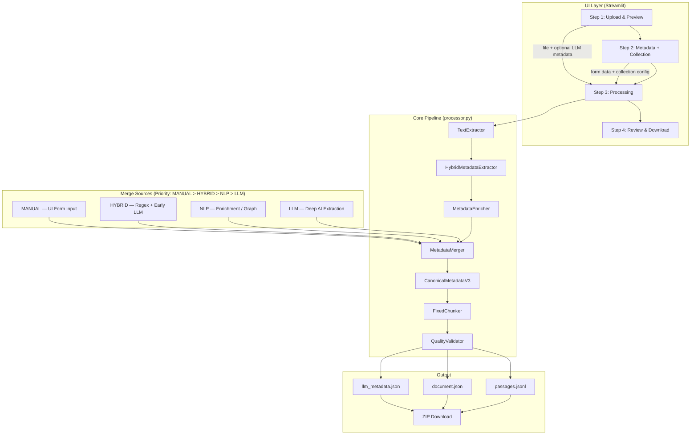
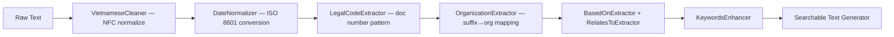

# Tài Liệu Bàn Giao: FR-03.1 v8.1 — Vietnamese Document Processing Pipeline

## 📋 Thông Tin Cơ Bản

**Tên Module**: FR-03.1 Vietnamese Document Processing for GraphRAG
**Mã Module**: FR-03.1
**Trạng Thái**: ✅ Production Ready (8.5/10)
**Ngày Hoàn Thành**: 22/02/2026
**Phiên Bản**: v8.1.0
**Tech Stack**: Python 3.10, Streamlit, Pydantic V2, OpenRouter (LLM)
**Xác minh nguồn**: Tất cả thông tin được xác minh trực tiếp từ source code ngày 22/02/2026.

---

## 🎯 Mục Đích & Phạm Vi

Hệ thống **FR-03.1 v8.1** là pipeline xử lý tài liệu tiếng Việt, chuyển đổi tài liệu thô (PDF/DOCX/TXT/MD) thành gói metadata chuẩn hóa cho hệ thống Graph-based RAG.

### Chức Năng Chính

- **Giao diện người dùng Streamlit**: 4 bước (Upload → Metadata → Process → Review/Download)
- **Hybrid Metadata Extraction**: Kết hợp Regex chuyên biệt + LLM (OpenRouter)
- **Canonical V3 Schema**: Flat structure, tối ưu cho PostgreSQL JSONB và ChromaDB
- **Quality Gates**: Pydantic V2 validation + weighted completeness scoring
- **ZIP Export**: 3 file (`passages.jsonl`, `document.json`, `llm_metadata.json`)

### Đầu Ra (Output)

| File | Nội dung |
|------|---------|
| `passages.jsonl` | Các đoạn văn bản đã chunk (~256 tokens/đoạn, tối thiểu 50 tokens) |
| `document.json` | Metadata đầy đủ — `CanonicalMetadataV3`, `version: "3.0"` |
| `llm_metadata.json` | Metadata sạch từ AI (luôn được tạo, nội dung phụ thuộc vào bước 1) |

### Phạm Vi Tích Hợp

- **Target Systems**: PostgreSQL (JSONB), ChromaDB (vectors), BM25 (keyword search)
- **LLM Provider**: OpenRouter (cấu hình qua `.env`)
- **Modules phụ thuộc**: Không có — đây là standalone Streamlit app

---

## 🏗️ Kiến Trúc Module

### Sơ Đồ Luồng Dữ Liệu



### Các Thành Phần Chính

#### UI Layer

| Component | File | Chức năng |
|-----------|------|-----------|
| App Router | `app.py` | Lightweight router (~100 dòng), điều hướng theo `AppStateManager` |
| Step 1 | `src/ui/steps/step1_upload.py` | Upload file, trích xuất preview, gọi LLM optional |
| Step 2 | `src/ui/steps/step2_metadata.py` | Form nhập metadata, chọn collection |
| Step 3 | `src/ui/steps/step3_process.py` | Trigger pipeline, hiển thị tiến trình |
| Step 4 | `src/ui/steps/step4_review.py` | Xem/sửa metadata, download ZIP |
| Metadata Editor | `src/ui/components/document_metadata_editor.py` | Component editor 8-tab tái sử dụng |
| Collection Selector | `src/components/collection_selector.py` | Chọn ChromaDB collection |
| Help Section | `src/components/help_section.py` | Sidebar + stats |

#### Core Processing Layer

| Component | File | Chức năng |
|-----------|------|-----------|
| Orchestrator | `src/core/processor.py` | Pipeline chính, `_build_document_metadata()`, completeness scoring |
| State Manager | `src/core/state_manager.py` | Session state tập trung (`AppStateManager`) |
| Chunker | `src/core/chunker.py` | `FixedChunker` — 256 tokens target, 50 tokens min, auto-merge short chunks |
| Validator | `src/core/validator.py` | `QualityValidator` — kiểm tra passage & metadata quality |

#### Extraction & Enrichment Layer

| Component | File | Chức năng |
|-----------|------|-----------|
| Hybrid Extractor | `src/utils/hybrid_metadata_extractor.py` | **Entry point chính** — điều phối LLM + Regex |
| Metadata Merger | `src/utils/metadata_merger.py` | Merge 4 sources theo priority |
| Metadata Enricher | `src/utils/metadata_enricher.py` | Hierarchy, governance, graph context enrichment |
| LLM Client | `src/utils/llm_client.py` | OpenRouter client với auto-retry (tenacity) |
| LLM Extractor | `src/utils/llm_metadata_extractor.py` | AI metadata extraction |

#### Specialized Regex Extractors

| File | Nhiệm vụ |
|------|---------|
| `src/utils/legal_code_extractor.py` | Trích xuất mã văn bản pháp luật (e.g., `51/2001/QH`) |
| `src/utils/based_on_extractor.py` | Trích xuất tài liệu tham chiếu ("Căn cứ…") |
| `src/utils/relates_to_extractor.py` | Trích xuất văn bản liên quan |
| `src/utils/date_normalizer.py` | Chuẩn hóa ngày tháng Việt Nam → ISO 8601 |
| `src/utils/organization_extractor.py` | Trích xuất cơ quan ban hành |
| `src/utils/document_type_extractor.py` | Phân loại loại tài liệu |

---

## 📁 Cấu Trúc Thư Mục

```
FR3.1V8_22Feb/
├── app.py                                   # Streamlit entry point + router
├── handover_FR03.1_22Feb.md                 # Tài liệu này
├── handover_fr03.1_20feb.md                 # Handover trước (Feb 20)
├── .env                                     # OPENROUTER_API_KEY, OPENROUTER_MODEL
├── requirements.txt
│
├── src/
│   ├── core/
│   │   ├── processor.py                     # Orchestrator chính
│   │   ├── chunker.py                       # Sentence-aware chunking
│   │   ├── validator.py                     # Quality checks
│   │   └── state_manager.py                 # AppStateManager
│   │
│   ├── models/
│   │   ├── canonical_v3.py                  # CanonicalMetadataV3 (PRIMARY)
│   │   ├── document_metadata.py             # Legacy nested model (backward compat)
│   │   ├── passage.py                       # Passage + PassageMeta
│   │   └── process_result.py                # ProcessResult output model
│   │
│   ├── ui/
│   │   ├── steps/
│   │   │   ├── step1_upload.py
│   │   │   ├── step2_metadata.py
│   │   │   ├── step3_process.py
│   │   │   └── step4_review.py
│   │   └── components/
│   │       └── document_metadata_editor.py  # 8-tab metadata editor
│   │
│   ├── components/
│   │   ├── collection_selector.py           # ChromaDB collection selector
│   │   └── help_section.py
│   │
│   └── utils/
│       ├── hybrid_metadata_extractor.py     # Primary extraction entry point
│       ├── metadata_merger.py               # Source priority merge
│       ├── metadata_enricher.py             # Graph/governance enrichment
│       ├── llm_client.py                    # OpenRouter client
│       ├── llm_metadata_extractor.py        # AI extraction
│       ├── legal_code_extractor.py
│       ├── based_on_extractor.py
│       ├── relates_to_extractor.py
│       ├── date_normalizer.py
│       ├── organization_extractor.py
│       ├── document_type_extractor.py
│       ├── text_extractor.py
│       ├── vietnamese_cleaner.py
│       ├── keywords_enhancer.py
│       ├── filename_generator.py
│       ├── config_manager.py
│       ├── logging_config.py
│       ├── postgres_adapter_v14.py          # DB adapter (nếu dùng PostgreSQL)
│       ├── mapping_rules.json               # Doc number suffix → org inference
│       ├── extraction_config.json           # Regex patterns + noise config
│       ├── keywords.json                    # Domain keyword database
│       └── labels_config.json               # Department/type code mappings
│
└── docs/
    ├── handover_fr03.1_19feb.md             # v8.0 architecture handover
    ├── handover_27Dec2025.md                # v6.2 base system handover
    └── ...
```

---

## 🗄️ Data Schema (Canonical V3)

`CanonicalMetadataV3` trong `src/models/canonical_v3.py` là model Pydantic V2 duy nhất dùng cho toàn bộ pipeline.

### Các Trường P0 (Critical — bắt buộc)

| Trường | Kiểu | Mô tả |
|--------|------|-------|
| `document_id` | `str` | UUID duy nhất |
| `title` | `str` | Tiêu đề đầy đủ |
| `document_number` | `str` | Số hiệu (e.g., `51/2001/QH`) |
| `document_type` | `str` | Loại tài liệu (e.g., `luat`, `thong_tu`) |
| `doc_type_group` | `str` | Nhóm (`LEGAL`, `GENERAL`, `HR_POLICY`, ...) |
| `issue_date` | `str?` | ISO 8601 ngày ban hành |
| `organization` | `str` | Cơ quan ban hành |
| `searchable_text` | `str` | Văn bản tổng hợp cho BM25 |
| `version` | `str` | Luôn là `"3.0"` |

### SCORED_FIELDS (dùng cho completeness scoring)

Được định nghĩa trong `CanonicalMetadataV3.SCORED_FIELDS` (class variable):

```python
SCORED_FIELDS = [
    "title", "document_number", "document_type", "issue_date", "organization",
    "department_owner", "keywords_json", "tags_json", "references_json",
    "description", "subject", "signer_display", "budget_total",
    "deadline_date", "deliverables_json", "project_code", "task_code",
    "budget_source", "acceptance_unit", "recipients_primary_json", "implements"
]
```

### Completeness Scoring (BUG-8 fix — xác minh trong processor.py)

```python
# processor.py — N/A fields by doc type (ví dụ: luật không cần budget)
NA_FIELDS_BY_DOC_TYPE = { ... }       # line 149
FIELD_WEIGHTS_BY_DOC_TYPE = { ... }   # line 168

# Sử dụng:
na_fields = NA_FIELDS_BY_DOC_TYPE.get(doc_type, set())
weights = FIELD_WEIGHTS_BY_DOC_TYPE.get(doc_type, {})
for field in CanonicalMetadataV3.SCORED_FIELDS:
    if field not in na_fields:
        # tính điểm có trọng số
```

---

## 🔌 Entry Points & API Sử Dụng

### Web UI (Streamlit)

```bash
streamlit run app.py
```

### Core Pipeline (programmatic)

```python
from src.core.processor import DocumentProcessor

processor = DocumentProcessor(chunk_size=256)
result = processor.process(
    file=file_obj,          # file-like object
    file_type="pdf",        # "pdf", "docx", "txt", "md"
    metadata=user_metadata  # dict từ UI form
)
# result là ProcessResult chứa:
# - result.metadata   : CanonicalMetadataV3
# - result.passages   : List[Passage]
# - result.statistics : dict
```

### Luồng Xử Lý Chi Tiết (Step 3)

```python
# processor.py — _build_document_metadata() tại line 471
# 1. TextExtractor → raw text
# 2. HybridMetadataExtractor(text) → HYBRID source dict
# 3. MetadataEnricher(text, metadata) → NLP source dict
# 4. MetadataMerger.merge(MANUAL, HYBRID, NLP, LLM) → CanonicalMetadataV3
# 5. FixedChunker(text, 256) → List[Passage]
# 6. QualityValidator → quality_score, metadata_completeness
# 7. Re-enrichment pass → regenerate JSON outputs
```

---

## 🇻🇳 Xử Lý Ngôn Ngữ Tiếng Việt

### Pipeline Xử Lý Text



### Các Pattern Đặc Thù Tiếng Việt

1. **Mã văn bản pháp luật**: `51/2001/QH`, `173/QĐ-KTQLB`, `15/2012/QH13`
2. **Ngày tháng Việt Nam**: "Ngày 25 tháng 12 năm 2001" → `2001-12-25T00:00:00Z`
3. **Cơ quan ban hành** (BUG-6 fix): Suffix `/QH` → `Quốc hội nước CHXHCN Việt Nam`
4. **Self-reference filter** (BUG-4 fix): So sánh component-based (seq, year, authority) thay vì string match đơn giản

### Mapping Rules (`src/utils/mapping_rules.json`)

Quy tắc ánh xạ từ hậu tố số hiệu sang tên cơ quan:
```json
{
  "suffix_to_org": {
    "QH": "Quốc hội nước Cộng hòa xã hội chủ nghĩa Việt Nam",
    "CP": "Chính phủ",
    "TTg": "Thủ tướng Chính phủ",
    "BTC": "Bộ Tài chính"
  }
}
```

---

## 🛡️ Quality Gates & Validation

### 3 Lớp Kiểm Soát Chất Lượng

1. **Pydantic V2 Schema Validation**
   - Mọi metadata được validate qua `CanonicalMetadataV3`
   - Các forbidden combos (e.g., `doc_type_group=LEGAL` + `rank_label=GENERAL`) bị chặn bởi validators

2. **Completeness Scoring** (N/A-aware)
   - Điểm số tính theo trọng số, loại trừ field không áp dụng cho từng `doc_type`
   - Ví dụ: `luat` không cần `budget_total`, `deadline_date`

3. **Download Stability** (Feb 22 fix)
   - ZIP bytes cache trong `st.session_state` với stable key để tránh `MediaFileStorageError`

### Ví Dụ Kết Quả Test (Luật Hàng Không 51/2001/QH)

| Chỉ số | Giá trị |
|--------|---------|
| `metadata_completeness` | 90.5% |
| `quality_score` | 0.9 |
| `doc_type_group` | `LEGAL` ✅ |
| `organization` | `Quốc hội nước CHXHCN Việt Nam` ✅ |
| `references_json` | `[]` (self-ref filtered) ✅ |
| Tổng điểm | **8.5/10** |

---

## 🧪 Quy Trình Kiểm Thử

### Kiểm Thử Thủ Công (Manual Testing)

1. **Upload test**: Dùng các file trong `input/` hoặc `Raw_input_docs/`
2. **Loại tài liệu cần test**:
   - `luat` (e.g., `51/2001/QH`) — xác nhận `doc_type_group=LEGAL`, self-ref filter
   - `quyet_dinh` (e.g., `173/QĐ-KTQLB`) — xác nhận org mapping
   - `thoa_thuan` / `hop_dong` — xác nhận budget fields có điểm
3. **Kiểm tra ZIP**: Download ZIP, unzip, kiểm tra 3 file output
4. **Kiểm tra completeness**: Xem `metadata_completeness` trong Step 4

### Checklist Kiểm Tra Đầu Ra

```
□ document_id là UUID (36 ký tự)
□ version = "3.0"
□ doc_type_group khớp với document_type
□ references_json không chứa self-reference
□ organization không rỗng (nếu doc_type là luat/nghi_dinh/thong_tu)
□ metadata_completeness > 70% (cho loại văn bản có đủ field)
□ passages.jsonl có ít nhất 1 passage, mỗi passage >= 50 tokens
□ llm_metadata.json tồn tại (dù LLM không chạy)
□ ZIP download không bị lỗi MediaFileStorageError
```

---

## 🔧 Cài Đặt & Triển Khai

### Yêu Cầu Hệ Thống

- **Python**: 3.10.x
- **OS**: Windows 10/11 (đã test), Linux (tương thích)
- **Thư viện chính**: `streamlit`, `pydantic>=2.0`, `httpx`, `tenacity`, `python-docx`, `pypdf2`, `underthesea`

### Cài Đặt

```bash
# 1. Clone/copy project
cd E:/Chatbot/FR3.1V8_22Feb

# 2. Tạo virtual environment
python -m venv venv
venv\Scripts\activate      # Windows
# source venv/bin/activate  # Linux/Mac

# 3. Cài thư viện
pip install -r requirements.txt

# 4. Cấu hình .env
echo OPENROUTER_API_KEY=your_key_here > .env
echo OPENROUTER_MODEL=anthropic/claude-3-sonnet >> .env
```

### Chạy Ứng Dụng

```bash
streamlit run app.py
```

Truy cập tại `http://localhost:8501`

### Biến Môi Trường

| Biến | Bắt buộc | Mô tả |
|------|----------|-------|
| `OPENROUTER_API_KEY` | Có (cho AI) | API key OpenRouter |
| `OPENROUTER_MODEL` | Không | Default: `anthropic/claude-3-sonnet` |

> **Lưu ý**: Không cần LLM để chạy — bước AI metadata ở Step 1 là optional. Hệ thống fallback sang Regex-only nếu không có API key.

---

## 🐛 Lỗi Đã Sửa (BUG-1 đến BUG-8)

Tất cả đã được fix và xác nhận trong test document `51/2001/QH` (Luật Hàng Không):

| Bug | Vấn đề | Cách Sửa | Trạng thái |
|-----|--------|----------|-----------|
| BUG-1 | `governing_laws` chứa 14 cụm rác | Cải thiện NLP filter trong `metadata_enricher.py` | ✅ Fixed |
| BUG-2 | `implements` trỏ sai về self | Component-based comparison | ✅ Fixed |
| BUG-3 | `doc_type_group: "GENERAL"` cho Luật | Mapping `luat → LEGAL` trong enricher | ✅ Fixed |
| BUG-4 | `references_json` self-reference | So sánh (seq, year, authority) trong `legal_code_extractor.py` | ✅ Fixed |
| BUG-5 | `status: "draft"` cho văn bản active | Logic xác định status dựa theo issue_date | ✅ Fixed |
| BUG-6 | `organization: ""` — rỗng | Ánh xạ từ suffix số hiệu qua `mapping_rules.json` | ✅ Fixed |
| BUG-7 | `chunk_count: 0` | Sửa sync giữa chunker và processor output | ✅ Fixed |
| BUG-8 | `metadata_completeness: 42.9%` | Weighted scoring + N/A exclusion theo `doc_type` | ✅ Fixed |

---

## ⚠️ Lỗi Còn Lại (Known — Accepted, Chưa Ưu Tiên Fix)

Tài liệu: `MetadataSchemaBugs_4_22Feb.md`

### 1. `searchable_text` — Có Noise Stopword

**Biểu hiện**: Các cụm "quy định về", "bao gồm các", "và khác có liên quan đến" lọt vào BM25 field.

**Ảnh hưởng**: Nhẹ — giảm precision BM25 một chút. Không block retrieval.

**Fix gợi ý**: Bổ sung stopword phrase filter trong `CanonicalMetadataV3.generate_searchable_text()`.

---

### 2. `raw_metadata_json.sources.HYBRID.references_json` — Còn Self-Ref

**Biểu hiện**: Root-level `references_json: []` đúng, nhưng `raw_metadata_json.sources.HYBRID.references_json` vẫn chứa `["51/2001/QH10"]`.

**Ảnh hưởng**: Không ảnh hưởng runtime nếu consumer dùng root fields.

**Quy tắc**: **Luôn đọc root-level fields, không đọc `raw_metadata_json.sources.*`**.

**Fix gợi ý**: Clean HYBRID source trước khi merge, hoặc document rõ ràng trong schema.

---

### 3. Không Có UI Warning Khi `department_owner` Không Khớp `organization`

**Biểu hiện**: User nhập `department_owner = "IT"` nhưng `organization = "Quốc hội..."` — không có cảnh báo.

**Ảnh hưởng**: Dữ liệu vẫn đúng, chỉ thiếu UX hint.

**Fix gợi ý**: Thêm `st.warning()` trong Step 2 hoặc Step 4 khi phát hiện mismatch.

---

### 4. `effective_date: null` Cho Một Số Văn Bản

**Biểu hiện**: `effective_date` không được trích xuất dù văn bản có thể xác định được.

**Ảnh hưởng**: Missing information, không block processing.

**Fix gợi ý**: Cải thiện `date_normalizer.py` để nhận diện thêm pattern "có hiệu lực từ ngày...".

---

## 📊 Hiệu Suất & Giám Sát

### Widget Instrumentation (Feb 22)

Mọi button trong 4 steps đều log:

```python
def _log_widget_click(widget_name: str):
    state_subset = {k: ("Present" if st.session_state.get(k) is not None else "Missing")
                    for k in st.session_state.keys()
                    if any(w in k.lower() for w in ['file', 'meta', 'result', 'zip'])}
    logger.debug(f"WIDGET CLICKED: {widget_name} | Timestamp: {datetime.now().isoformat()} | State: {state_subset}")
```

### Cost Optimization (LLM)

- Chỉ gửi **2000 ký tự đầu** cho LLM (giảm ~80% token cost)
- LLM metadata được **cache trong Session State** để tránh gọi lại khi user sửa form
- Regex extractor chạy hoàn toàn **offline** — không cần LLM cho trường kỹ thuật

### Logging

```bash
# Xem log Streamlit
# Log level cấu hình trong src/utils/logging_config.py
# File log: tùy cấu hình setup_logging()
```

---

## 🔍 Troubleshooting

| Vấn đề | Nguyên nhân | Cách Xử Lý |
|--------|-------------|------------|
| `MediaFileStorageError` khi download | ZIP object bị mất giữa rerenders | Đã fix (v8.1) — ZIP cache trong `st.session_state` |
| `document_number` rỗng | Pattern không khớp format lạ | Thêm pattern vào `extraction_config.json` |
| `organization` rỗng | Suffix chưa có trong `mapping_rules.json` | Thêm suffix mới vào `mapping_rules.json` |
| Lỗi API OpenRouter | Hết quota / Network timeout | `tenacity` retry 3 lần; kiểm tra `OPENROUTER_API_KEY` trong `.env` |
| Validation error Pydantic | Field sai kiểu hoặc giá trị forbidden | Xem log console — Pydantic log field vi phạm |
| `metadata_completeness` thấp | Field bị bỏ trống hoặc N/A config sai | Xem `NA_FIELDS_BY_DOC_TYPE` trong `processor.py` |
| `doc_type_group` sai | Document type không được map đúng | Kiểm tra `metadata_enricher.py` mapping logic |
| `references_json` chứa self-ref | BUG-4 — nếu xuất hiện lại | Kiểm tra `legal_code_extractor.py` component comparison |

---

## 🚀 Hướng Phát Triển Tương Lai

### Ưu Tiên Cao (Fix Known Bugs)

1. **searchable_text noise filter** — Thêm phrase-level stopword filter
2. **HYBRID raw_metadata cleanup** — Clean self-ref ở source level
3. **UI mismatch warning** — `st.warning()` cho department vs organization

### Ưu Tiên Trung Bình

4. **effective_date extraction** — Cải thiện pattern nhận diện hiệu lực văn bản
5. **Graph integration** — Tích hợp Neo4j cho relationship traversal
6. **Batch processing** — CLI tool cho xử lý hàng loạt (từng có trong v6.2, cần adapt lại cho V3 schema)

### Ưu Tiên Thấp

7. **Vision-to-Text** — OCR nâng cao cho bản scan chất lượng thấp
8. **Self-correction** — AI sửa lỗi Regex dựa trên feedback người dùng

---

## 📚 Tài Liệu Tham Khảo

### Handover Trước

| File | Nội dung |
|------|---------|
| `handover_fr03.1_20feb.md` (root) | Schema V14 optimization, PostgreSQL adapter |
| `docs/handover_fr03.1_19feb.md` | v8.0 Hybrid extraction architecture |
| `docs/handover_27Dec2025.md` | v6.2 Base system (NLP-only, batch processor, UUID fix) |

### Tài Liệu Bug

| File | Nội dung |
|------|---------|
| `MetadataSchemaBugs_4_22Feb.md` (root) | Test kết quả và phân tích lỗi còn lại |
| `MetadataSchemaBugs_3_22Feb.md` (root) | BUG-1..BUG-8 round 3 |
| `MetadataSchemaBugs22Feb.md` (root) | BUG round 1 |
| `BugFixPlan_22Feb.md` (root) | Kế hoạch fix tổng thể |

### Source Code Key

| File | Vai trò |
|------|--------|
| `src/models/canonical_v3.py` | Schema chính — đọc đầu tiên |
| `src/core/processor.py` | Orchestrator — logic merge + scoring |
| `src/utils/hybrid_metadata_extractor.py` | Entry point extraction |
| `src/utils/mapping_rules.json` | Org inference rules |
| `src/utils/extraction_config.json` | Regex patterns + noise config |

---

## ✅ Checklist Bàn Giao

- [x] Source code đã được verify trực tiếp (22/02/2026)
- [x] Tất cả BUG-1..BUG-8 đã fix và test
- [x] Streamlit download stability fix hoạt động
- [x] Widget instrumentation trên cả 4 steps
- [x] CLAUDE.md đã được cập nhật (22/02/2026)
- [x] Known remaining bugs được document rõ ràng
- [x] File path đã được xác minh (collection_selector, document_metadata_editor)
- [ ] Unit tests — chưa có test tự động (manual testing only)
- [ ] searchable_text noise filter — chưa fix
- [ ] HYBRID raw_metadata self-ref cleanup — chưa fix

---

**Phê duyệt bởi:** FR-03.1 Development Team
**Ngày:** 22/02/2026
**Phiên bản tài liệu này:** 1.0 (initial — dựa trên source verification thực tế)

*Tài liệu này kế thừa và tổng hợp từ `handover_27Dec2025.md` (v6.2), `handover_fr03.1_19feb.md` (v8.0), và `handover_fr03.1_20feb.md` (V14). Thông tin trong tài liệu này phản ánh trạng thái thực tế của source code ngày 22/02/2026.*
