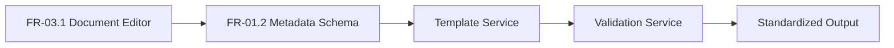

Tôi sẽ tìm hiểu tài liệu về TÁI THIẾT KẾ FR-03.1: DOCUMENT EDITOR & TEMPLATE PROCESSOR để đánh giá khả năng thực hiện của chúng ta.Dựa vào tài liệu tôi vừa đọc, tôi có thể thấy rằng **FR-03.1: DOCUMENT EDITOR & TEMPLATE PROCESSOR** đã được tái thiết kế một cách rất chi tiết và có thể **thực hiện được**. Dưới đây là đánh giá của tôi:

## 📊 **ĐÁNH GIÁ KHẢ NĂNG THỰC HIỆN**

### ✅ **CÓ THỂ THỰC HIỆN NGAY**

**1. Tính khả thi về kỹ thuật:**
- Có đủ thông tin chi tiết về kiến trúc và công nghệ
- Stack công nghệ đã được định nghĩa rõ ràng (Next.js 18.x, Python 3.10.11)
- Dependencies đã được liệt kê cụ thể trong requirements.txt
- Tích hợp chặt chẽ với FR-01 metadata schema

**2. Roadmap phát triển rõ ràng:**
- Chia thành 5 giai đoạn có logic: Setup → Parsing → Editor → Template → Output
- Mỗi giai đoạn có checklist cụ thể và code samples
- Định nghĩa rõ input/output giữa các modules

**3. Tuân thủ đầy đủ rules đã đặt ra:**
- ✅ Sử dụng tiếng Việt trong tài liệu
- ✅ Python 3.10.11 cho `underthesea`, `pyvi`
- ✅ Next.js 18.x cho frontend
- ✅ Hỗ trợ xử lý tiếng Việt ưu tiên
- ✅ PostgreSQL + Vector DB architecture
- ✅ Docker deployment ready

### 🎯 **ĐIỂM MẠNH CỦA THIẾT KẾ**

**1. Integration với FR-01:**

**2. User Experience tối ưu:**
- Web editor thân thiện với live preview
- Template-driven workflow đảm bảo consistency
- Multi-format parsing support (DOC, PDF, MD, TXT)
- Real-time validation với business rules

**3. Output chuẩn cho pipeline:**
- Markdown + YAML frontmatter
- JSON metadata riêng biệt
- Processing info cho FR-03.3
- Assets management có sẵn

### 🛠️ **TECH STACK ĐÁNH GIÁ**

| Component | Technology | Status |
|-----------|------------|--------|
| **Frontend** | Next.js 18.x + Monaco Editor | ✅ Ready |
| **Backend** | FastAPI + Python 3.10.11 | ✅ Ready |
| **Parser** | python-docx, PyPDF2, markdown | ✅ Ready |
| **Vietnamese** | underthesea, pyvi | ✅ Ready |
| **Database** | PostgreSQL + Vector DB | ✅ Ready |
| **Container** | Docker deployment | ✅ Ready |

### 📋 **KẾ HOẠCH THỰC HIỆN**

**Giai đoạn 1 (1-2 tuần):** Setup môi trường + Integration FR-01
**Giai đoạn 2 (2-3 tuần):** Document parsing + display
**Giai đoạn 3 (3-4 tuần):** Web editor implementation  
**Giai đoạn 4 (2-3 tuần):** Template integration
**Giai đoạn 5 (1-2 tuần):** Standardized output + testing

**Tổng thời gian ước tính: 9-14 tuần**

### 🚨 **LƯU Ý VÀ KHUYẾN NGHỊ**

**1. Dependencies cần check:**
- Đảm bảo FR-01.2 metadata schema đã sẵn sàng
- API endpoints từ FR-01 cần stable
- Database schema FR-01 cần finalized

**2. Rủi ro cần lưu ý:**
- Performance của document parsing với files lớn
- Memory usage khi xử lý nhiều documents đồng thời
- Real-time collaboration (nếu cần) sẽ phức tạp hơn

**3. Thứ tự triển khai:**
- Nên bắt đầu với Giai đoạn 1 ngay sau khi FR-01.2 hoàn thành
- Parallel development có thể với FR-03.2, FR-03.3
- Integration testing cần sớm để phát hiện issues

## 🎯 **KẾT LUẬN**

**FR-03.1 hoàn toàn có thể thực hiện được** với thiết kế hiện tại. Tài liệu đã rất chi tiết, technical stack phù hợp với requirements, và có roadmap rõ ràng. 

Bạn có muốn tôi:
1. **Bắt đầu implement** theo roadmap đã định?
2. **Deep dive** vào một giai đoạn cụ thể nào đó?
3. **Review lại integration** với FR-01 trước khi bắt đầu?
