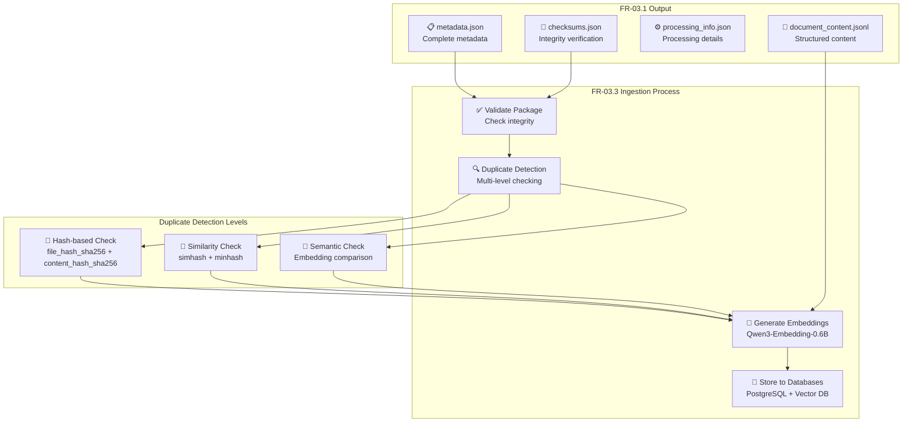

- **FR-03.1** nên tạo ra output có định dạng chuẩn với các trường thông tin quan trọng để **FR-03.3** có thể sử dụng để phát hiện trùng lặp hiệu quả. Hãy thiết kế một **schema output chuẩn** cho module này:

## 🎯 **SCHEMA OUTPUT CỦA FR-03.1**

### **Đề xuất format: JSONL (JSON Lines) + Metadata JSON**

**Tại sao JSONL?**
- ✅ Dễ đọc tuần tự (streaming)
- ✅ Xử lý được file lớn
- ✅ Dễ import vào database
- ✅ Structured nhưng vẫn human-readable

### **1. Cấu trúc Output Package**

```bash
output_package/
├── document_content.jsonl      # Nội dung chính
├── metadata.json              # Metadata tổng thể
├── processing_info.json       # Thông tin xử lý
├── assets/                    # Files đính kèm
│   ├── image_001.png
│   └── diagram_001.svg
└── checksums.json            # Hash values cho verification
```

### **2. Schema chi tiết**

#### **📄 document_content.jsonl**
```jsonl
{"chunk_id": "DOC_001_CHUNK_001", "content": "Quy trình mua hàng của công ty bao gồm 5 bước chính...", "chunk_order": 1, "chunk_type": "content", "word_count": 245}
{"chunk_id": "DOC_001_CHUNK_002", "content": "Bước 1: Tạo yêu cầu mua hàng (Purchase Request)...", "chunk_order": 2, "chunk_type": "procedure_step", "word_count": 189}
{"chunk_id": "DOC_001_CHUNK_003", "content": "Bước 2: Phê duyệt từ trưởng phòng...", "chunk_order": 3, "chunk_type": "procedure_step", "word_count": 156}
```

#### **📋 metadata.json**
```json
{
  "document_info": {
    "document_id": "PROCUREMENT_GUIDE_2025_V1",
    "title": "Hướng dẫn Quy trình Mua hàng 2025",
    "description": "Tài liệu hướng dẫn chi tiết quy trình mua hàng trong công ty",
    "version": "1.0",
    "language": "vi",
    "document_type": "procedure",
    "category": "procurement",
    "subcategory": "purchasing_process"
  },
  
  "source_info": {
    "original_filename": "Quy_trinh_mua_hang_2025.docx",
    "source_file_path": "/uploads/2025/procurement/Quy_trinh_mua_hang_2025.docx",
    "file_size_bytes": 2847392,
    "file_extension": ".docx",
    "mime_type": "application/vnd.openxmlformats-officedocument.wordprocessingml.document",
    "upload_timestamp": "2025-09-06T14:30:00Z"
  },
  
  "content_fingerprints": {
    "file_hash_sha256": "a665a45920422f9d417e4867efdc4fb8a04a1f3fff1fa07e998e86f7f7a27ae3",
    "content_hash_sha256": "b94d27b9934d3e08a52e52d7da7dabfac484efe37a5380ee9088f7ace2efcde9",
    "content_hash_md5": "5d41402abc4b2a76b9719d911017c592",
    "simhash_64bit": "18446744073709551615",
    "text_length_chars": 12500,
    "text_length_words": 2450,
    "estimated_tokens": 3200
  },
  
  "ownership_access": {
    "department_owner": "procurement",
    "author": "Nguyễn Văn A",
    "reviewer": "Trần Thị B", 
    "approver": "Lê Văn C",
    "access_level": "employee_only",
    "created_by": "user_12345",
    "created_at": "2025-09-06T14:30:00Z",
    "last_updated": "2025-09-06T14:30:00Z"
  },
  
  "classification": {
    "tags": ["mua-hàng", "quy-trình", "phê-duyệt", "procurement", "workflow"],
    "keywords_extracted": ["quy trình", "mua hàng", "phê duyệt", "yêu cầu", "giám đốc"],
    "content_type": "structured_procedure",
    "sensitivity_level": "internal",
    "retention_period_months": 60
  },
  
  "processing_metadata": {
    "processed_by": "FR-03.1",
    "processing_version": "1.0",
    "processing_timestamp": "2025-09-06T14:35:00Z",
    "processing_duration_seconds": 45.7,
    "quality_score": 0.92,
    "warnings": [],
    "errors": []
  }
}
```

#### **⚙️ processing_info.json**
```json
{
  "processing_status": "completed",
  "ready_for_ingestion": true,
  "ingestion_priority": "normal",
  
  "content_analysis": {
    "total_chunks": 25,
    "chunk_size_avg": 487,
    "chunk_size_std": 82,
    "content_structure": {
      "headers": 8,
      "paragraphs": 45,
      "lists": 12,
      "tables": 3,
      "images": 2
    }
  },
  
  "duplicate_detection_prep": {
    "file_signatures": {
      "sha256": "a665a45920422f9d417e4867efdc4fb8a04a1f3fff1fa07e998e86f7f7a27ae3",
      "md5": "5d41402abc4b2a76b9719d911017c592",
      "crc32": "414fa339"
    },
    "content_signatures": {
      "normalized_text_hash": "b94d27b9934d3e08a52e52d7da7dabfac484efe37a5380ee9088f7ace2efcde9",
      "simhash": "18446744073709551615",
      "minhash": ["hash1", "hash2", "hash3", "..."],
      "keyword_fingerprint": "procurement,workflow,approval,director"
    },
    "similarity_features": {
      "filename_normalized": "quy_trinh_mua_hang_2025",
      "title_normalized": "huong_dan_quy_trinh_mua_hang_2025", 
      "key_phrases": ["quy trình mua hàng", "phê duyệt giám đốc", "yêu cầu mua hàng"],
      "document_structure_signature": "header-list-procedure-table-conclusion"
    }
  },
  
  "embedding_prep": {
    "model_recommended": "Qwen/Qwen3-Embedding-0.6B",
    "chunking_strategy": "semantic_sentence_boundary",
    "overlap_percentage": 10,
    "estimated_embedding_time_seconds": 12.5,
    "estimated_storage_mb": 2.8
  },
  
  "next_steps": {
    "target_module": "FR-03.3",
    "expected_processing_time_minutes": 5,
    "dependencies": ["vector_db_ready", "postgres_connection"],
    "validation_required": false
  }
}
```

#### **🔐 checksums.json**
```json
{
  "package_integrity": {
    "package_created": "2025-09-06T14:35:00Z",
    "total_files": 4,
    "total_size_bytes": 2891847
  },
  "file_checksums": {
    "document_content.jsonl": {
      "sha256": "c1234567890abcdef...",
      "md5": "d1234567890abcdef...",
      "size_bytes": 125000
    },
    "metadata.json": {
      "sha256": "e1234567890abcdef...",
      "md5": "f1234567890abcdef...",
      "size_bytes": 8500
    },
    "processing_info.json": {
      "sha256": "g1234567890abcdef...",
      "md5": "h1234567890abcdef...",
      "size_bytes": 3200
    }
  }
}
```

## 🔄 **Workflow Integration với FR-03.3**



## 🎯 **Key Benefits của Schema này**

### **1. Duplicate Detection Optimization**
- **File-level**: `file_hash_sha256` + `file_size_bytes` + `original_filename`
- **Content-level**: `content_hash_sha256` + `simhash_64bit` + `text_length_chars`
- **Semantic-level**: `keyword_fingerprint` + structured content analysis

### **2. Fast Lookup & Comparison**
- Pre-computed hash values
- Normalized filename và title cho string similarity
- Key phrases extracted để so sánh ngữ nghĩa nhanh

### **3. Business Intelligence**
- Complete metadata theo schema FR-01.2
- Processing quality metrics
- Content analysis cho optimization

### **4. System Integration**
- Chuẩn bị sẵn thông tin cho embedding generation
- Compatible với multiple database systems
- Audit trail đầy đủ

Bạn thấy schema này có phù hợp với mục tiêu của FR-03.1 và FR-03.3 không? 
