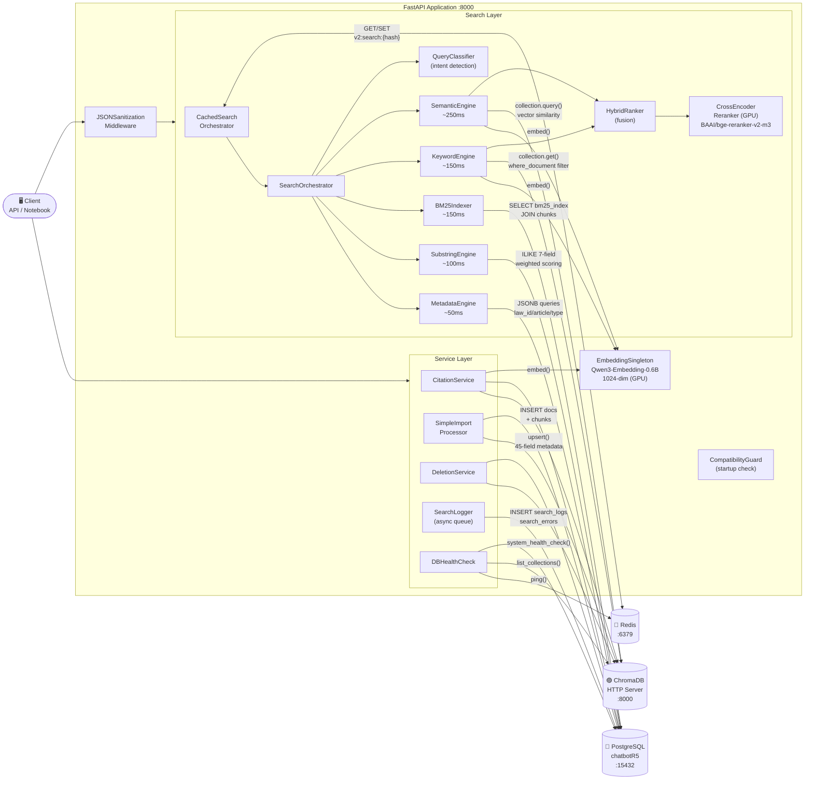
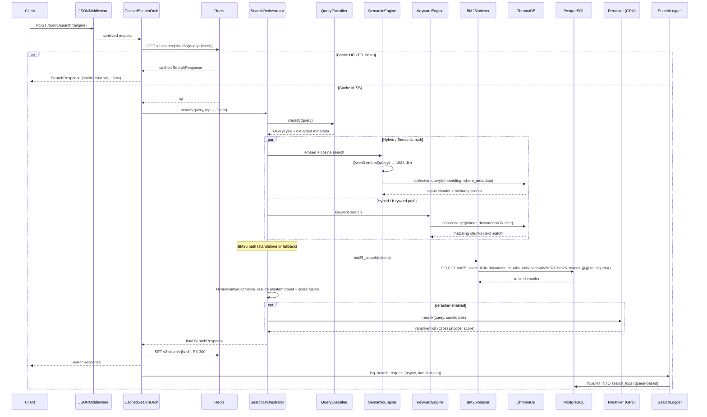
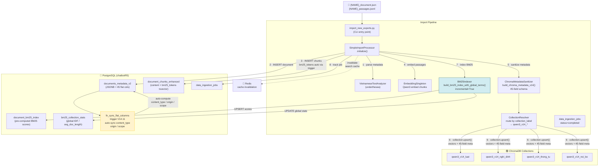
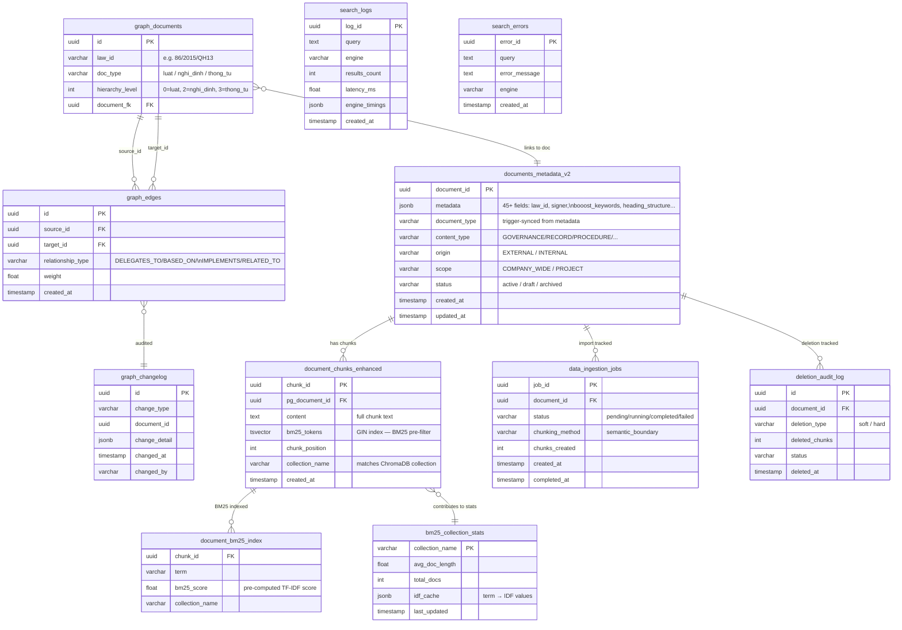
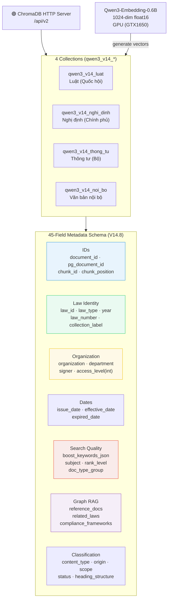
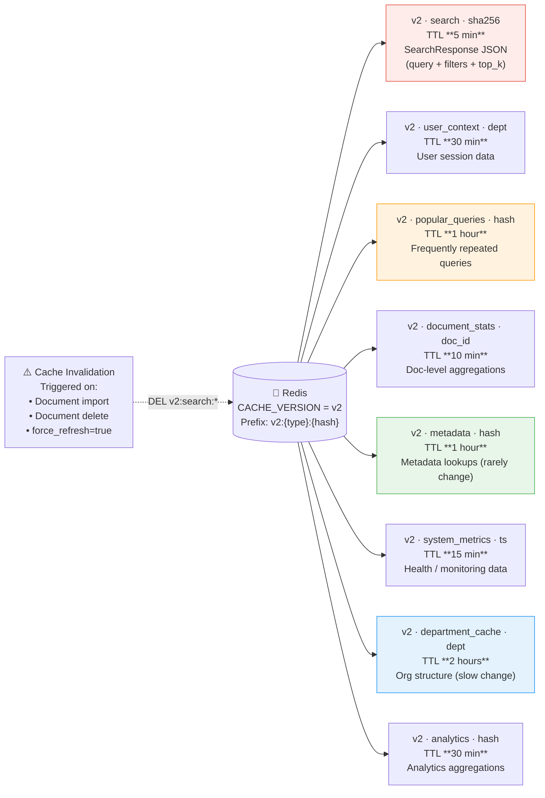

# FR03.3 — Kiến trúc Database & Luồng Dữ liệu

**Ngày:** 2026-06-03 | **Session:** 047 / DA381271  
**Stack:** Python 3.10 · FastAPI · PostgreSQL 15 · ChromaDB 1.5 · Redis 7

---

## 1. Kiến trúc Tổng quan

Toàn bộ các thành phần trong ứng dụng và kết nối đến 3 databases.

---

## 2. Luồng Search Request (Query Time)

Path đầy đủ từ client đến kết quả, bao gồm Redis cache và async logging.

---

## 3. Luồng Import Pipeline (Document Ingestion)

Từ file JSON/JSONL đến PostgreSQL + ChromaDB, kèm BM25 indexing.

---

## 4. Schema PostgreSQL — Quan hệ các bảng chính

---

## 5. ChromaDB — Collections & Metadata Schema

---

## 6. Redis — Cache Key Patterns & TTL

---

## Tóm tắt — Mỗi Engine dùng Database nào

| Engine | PostgreSQL | ChromaDB | Redis |
|--------|-----------|----------|-------|
| **Semantic** | ✗ | ✅ cosine similarity (vectors) | ✅ cache output |
| **Keyword** | ✗ | ✅ where_document text filter | ✅ cache output |
| **BM25** | ✅ document_bm25_index + chunks | ✗ | ✅ cache output |
| **Substring** | ✅ ILIKE 7-field weighted | ✗ | ✅ cache output |
| **Metadata** | ✅ JSONB queries (law_id/type/year) | ✗ | ✅ cache output |
| **Hybrid** | ✅ BM25 fallback | ✅ semantic + keyword | ✅ cache output |
| **Citation** | ✅ chunk lookup + scoring | ✅ chunk content | ✗ |
| **Import** | ✅ docs + chunks + BM25 index | ✅ upsert vectors | ✅ invalidate |
| **Delete** | ✅ soft/hard delete + audit | ✅ delete vectors | ✅ invalidate |
| **Analytics** | ✅ search_logs + errors | ✗ | ✗ |
| **Graph RAG** | ✅ graph_documents + edges | ✗ | ✗ |

---

*Generated: Session 047 / DA381271 — 2026-06-03*  
*Source: FR03.3R6/src/ live read (main.py, search_orchestrator, redis_cache_manager, bm25_indexer, semantic_engine, keyword_engine, simple_import_processor, citation_service)*
