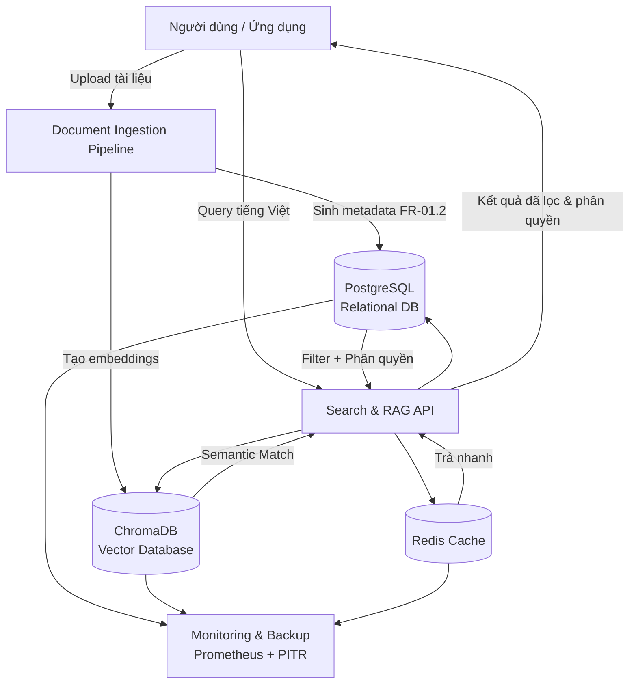

Được, tôi giải thích kỹ cho bạn như một nguyên tắc **thiết kế – tích hợp hệ thống** trong kỹ nghệ phần mềm và phần cứng:

---

### 1. Nguyên tắc **Follow Dependency Chain**

* Trong một hệ thống có nhiều module, luôn có **chuỗi phụ thuộc (dependency chain)**:

  * **Upstream module**: là module nằm “nguồn”, tạo dữ liệu hoặc dịch vụ cho module khác.
  * **Downstream module**: là module sử dụng dữ liệu/dịch vụ từ upstream để hoạt động.

👉 Ví dụ:

* Module **Database** (upstream) → cung cấp dữ liệu cho **API service** (downstream).
* API service (upstream) → cung cấp dữ liệu cho **Frontend UI** (downstream).

---

### 2. “Upstream phải stable trước khi integrate downstream”

* Nghĩa là: bạn **không nên** bắt đầu tích hợp hay kiểm thử module downstream khi module upstream chưa đạt độ ổn định (tested, verified).
* Nếu upstream chưa ổn định:

  * Bug từ upstream sẽ “lan xuống” downstream.
  * Downstream sẽ có lỗi giả, khó phân biệt lỗi thuộc upstream hay downstream.
  * Lãng phí thời gian debug chồng chéo.

👉 Ví dụ:
Nếu database schema chưa chốt, bạn chưa nên để API team build xong và integrate, vì mỗi lần schema đổi sẽ phải refactor rất nhiều.

---

### 3. “Mỗi integration point phải validate kỹ trước khi tiếp tục”

* **Integration point** = chỗ giao tiếp giữa hai module (API endpoint, data format, message queue, hardware connector, protocol…).
* Nguyên tắc là **trước khi ghép thêm một tầng downstream mới**, phải:

  * Kiểm thử interface (API contract, message format, timing, error handling).
  * Xác nhận dữ liệu trao đổi đúng expectation (schema, unit test, mock test).
  * Validate cả trong trường hợp **normal case** và **exception case** (lỗi kết nối, timeout, input không hợp lệ).

👉 Điều này giúp:

* Đảm bảo downstream khi nhận dữ liệu thì nó chắc chắn đúng.
* Khi có bug sau này, dễ khoanh vùng (vì upstream đã được validate trước khi connect).

---

### 4. Chu trình chuẩn (Industry Best Practice)

1. **Build & unit test** module upstream.
2. **Stabilize** (ổn định) → đạt đủ tiêu chí chất lượng.
3. **Mock test** integration point (dùng stub/mocks để giả lập downstream).
4. **Integrate** downstream module vào.
5. **Validate** lại integration point với cả upstream và downstream.
6. Chỉ khi **passed** thì mới đi tiếp đến tầng sau.

---

👉 Tóm gọn:

* **Nguyên tắc chuỗi phụ thuộc** = upstream ổn định trước → rồi mới integrate downstream.
* **Nguyên tắc integration point** = kiểm tra kỹ điểm nối trước khi đi tiếp.
* Đây là cách để tránh “snowball bug” và làm hệ thống ổn định khi phát triển theo tầng.

---

Bạn muốn tôi minh họa nguyên tắc này bằng **một sơ đồ (ví dụ dùng mermaid chart)** để dễ hình dung hơn không?

---
Anh hỏi rất đúng trọng tâm 👍. Em tóm gọn như sau:

---

## 1. **Metadata là gì?**

* **Định nghĩa**: Metadata là "dữ liệu về dữ liệu". Nó không phải nội dung chính, mà là lớp mô tả giúp ta biết **ai tạo**, **tạo khi nào**, **thuộc loại gì**, **quyền truy cập ra sao**, **đang dùng version nào**…
* **Ví dụ**:

  * Một file Word `report.docx` → nội dung chính là báo cáo, còn metadata gồm: tác giả = “Nguyễn Văn A”, ngày tạo = “2025-09-12”, phân quyền = “Manager”.
  * Trong hệ thống RAG, metadata chính là "đầu mối" để truy xuất tài liệu đúng cách, thay vì phải đọc toàn bộ nội dung.

---

## 2. **Tại sao phải thiết kế metadata?**

* **Quản lý quy mô lớn**: Khi có hàng ngàn tài liệu, không thể chỉ dựa vào tên file. Metadata giúp phân loại và tìm kiếm hiệu quả.
* **Bảo mật & phân quyền**: Mỗi tài liệu có level Public/Employee/Manager/Director. Nếu không có metadata rõ ràng thì khó enforce rule này.
* **Bảo trì & đồng bộ**: Version history và audit trail chỉ có thể tracking chuẩn khi metadata được thiết kế bài bản.
* **Tích hợp hệ thống**: Metadata chuẩn hóa (schema, index, API) giúp các module downstream (RAG engine, search, analytics) dùng lại dễ dàng.

---

## 3. **Tại sao gọi là “metadata thông minh”?**

Metadata “thông minh” khác với metadata thủ công (manual tagging). Nó bao gồm:

1. **Chuẩn hóa + mở rộng linh hoạt**

   * Dùng enum, JSONB, tagging system để đảm bảo metadata vừa có khung chuẩn, vừa mở rộng linh hoạt khi cần.

2. **Tự động hóa**

   * Auto-tagging dựa trên **Vietnamese NLP**: hệ thống có thể tự nhận diện loại tài liệu, trích xuất từ khóa, gán tag mà không cần người dùng làm thủ công.

3. **Tối ưu tìm kiếm & phân tích**

   * Indexing cho tiếng Việt (xử lý dấu, từ ghép, từ đồng nghĩa).
   * Metadata được thiết kế để query nhanh < 100ms với 10k+ lookup.

4. **Tích hợp bảo mật & truy xuất phân tầng**

   * Metadata không chỉ là “mô tả”, mà còn là **cơ chế điều phối**: ai được đọc, ai được sửa, log đầy đủ mọi thao tác (audit trail).

---

👉 Nói ngắn gọn:

* **Metadata** = Dữ liệu về dữ liệu.
* **Thiết kế metadata** = Tạo bộ khung chuẩn, có quy tắc để quản lý tài liệu.
* **Thông minh** = Metadata có khả năng tự động sinh, tối ưu tìm kiếm, đảm bảo phân quyền và dễ tích hợp.

---

Anh có muốn em minh họa thêm **sơ đồ luồng metadata thông minh trong hệ thống RAG** (kiểu từ document upload → metadata enrich → index → search & retrieval) không?

Câu hỏi rất chuẩn 👌. Em giải thích rõ để anh phân biệt:

---

### 1. **FR-01.2: Thiết kế cấu trúc Metadata thông minh**

* Đây **không phải** là thiết kế database theo nghĩa “thiết kế toàn bộ hệ quản trị dữ liệu”, mà là **thiết kế schema/bộ khung metadata** để quản lý tài liệu.
* Nó tập trung vào:

  * Các trường metadata (id, version, access\_level, tags, …).
  * Ràng buộc logic (enum cho phân quyền, JSONB cho tag).
  * Index & tối ưu tìm kiếm tiếng Việt.
  * API và validation rules.

👉 Về bản chất, đây là một **phần trong database schema** (chỉ quản lý metadata), chứ không phải toàn bộ database system.

---

### 2. **FR-02.1: Hệ thống quản trị cơ sở dữ liệu kép**

Cái này mới là **thiết kế database tổng thể**, gồm **2 lớp DB**:

1. **Vector Database (ChromaDB)**

   * Nơi lưu **embeddings** (vector hóa nội dung tài liệu).
   * Dùng cho **semantic search** (tìm kiếm ngữ nghĩa).
   * Cần tối ưu cho tiếng Việt (cosine similarity, threshold, incremental index).

2. **Relational Database (PostgreSQL)**

   * Nơi lưu **metadata, user management, phân quyền, audit log**.
   * Có hỗ trợ **Vietnamese full-text search**.
   * Quản lý **roles, permissions, audit logging**.

Ngoài ra còn có **Redis caching** và **monitoring** → để tối ưu performance và reliability.

👉 Đây là thiết kế **data architecture** tổng thể: **Vector DB + Relational DB + Redis**.

---

### 3. **Mối liên hệ giữa 2 phần**

* **FR-01.2 (Metadata design)** là **một module con** → định nghĩa cách quản lý metadata.
* **FR-02.1 (Database system design)** là **kiến trúc dữ liệu tổng thể** → nơi metadata sẽ được triển khai (chạy trong PostgreSQL), đồng thời liên kết với Vector DB để tạo ra hybrid search.

Ví dụ luồng:

1. Người dùng upload document → sinh ra metadata (FR-01.2).
2. Metadata lưu vào **PostgreSQL**.
3. Nội dung document chunk → nhúng (embedding) → lưu vào **ChromaDB**.
4. Khi search: query chạy qua **Vector DB** (semantic) + **Relational DB** (filter theo metadata, phân quyền) → hợp kết quả → trả cho user.

---

👉 Tóm gọn:

* **FR-01.2** = Thiết kế **metadata schema** (một phần trong DB).
* **FR-02.1** = Thiết kế **toàn bộ database system** (Vector DB + Relational DB + Redis + monitoring).

---

Anh có muốn em vẽ sơ đồ **kiến trúc dữ liệu kép (metadata + vector DB)** để thấy sự gắn kết rõ hơn không?

Rõ rồi 👍. Em vẽ sơ đồ **kiến trúc dữ liệu kép** (Relational DB + Vector DB + Redis), có metadata ở trung tâm, để anh dễ hình dung.

---

### Giải thích sơ đồ:

* **Document Ingestion**: Khi có tài liệu mới → tạo metadata (FR-01.2) → lưu PostgreSQL, đồng thời tạo embeddings → lưu ChromaDB.
* **PostgreSQL (Relational DB)**: Lưu metadata, roles, audit logs, phân quyền.
* **ChromaDB (Vector DB)**: Lưu embeddings, phục vụ semantic search.
* **Redis**: Cache cho các truy vấn lặp lại nhiều.
* **Search & RAG API**: Khi user query → gọi cả VectorDB (semantic) + MetaDB (metadata filter + phân quyền) + Cache. Sau đó hợp kết quả, đảm bảo đúng quyền truy cập.
* **Monitoring & Backup**: Giám sát performance, backup point-in-time recovery.

---

Anh có muốn em làm thêm **sequence diagram** (thứ tự các bước: upload → lưu metadata → lưu vector → query → filter → trả kết quả) để thấy rõ luồng thời gian không?

