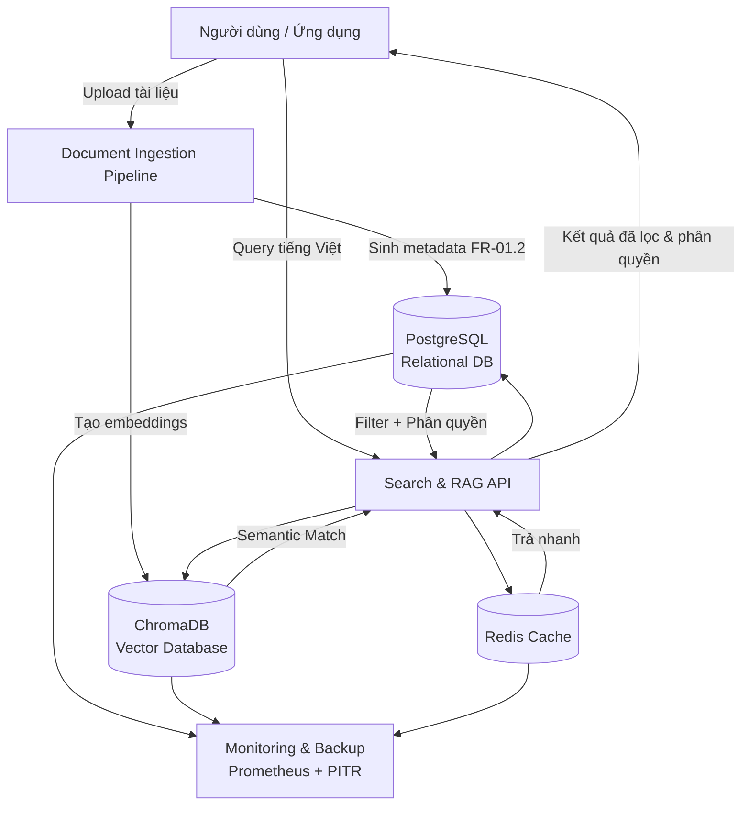
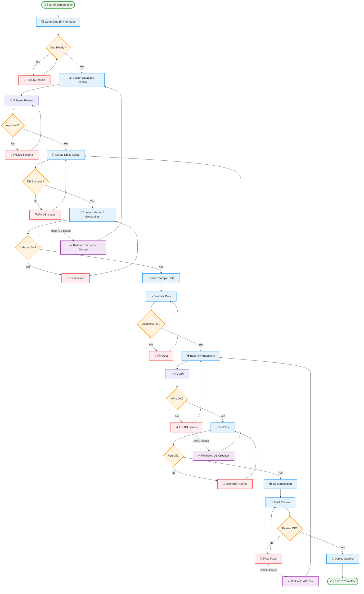

Được, tôi giải thích kỹ cho bạn như một nguyên tắc **thiết kế – tích hợp hệ thống** trong kỹ nghệ phần mềm và phần cứng:

---

### 1. Nguyên tắc **Follow Dependency Chain**

* Trong một hệ thống có nhiều module, luôn có **chuỗi phụ thuộc (dependency chain)**:

  * **Upstream module**: là module nằm “nguồn”, tạo dữ liệu hoặc dịch vụ cho module khác.
  * **Downstream module**: là module sử dụng dữ liệu/dịch vụ từ upstream để hoạt động.

👉 Ví dụ:

* Module **Database** (upstream) → cung cấp dữ liệu cho **API service** (downstream).
* API service (upstream) → cung cấp dữ liệu cho **Frontend UI** (downstream).

---

### 2. “Upstream phải stable trước khi integrate downstream”

* Nghĩa là: bạn **không nên** bắt đầu tích hợp hay kiểm thử module downstream khi module upstream chưa đạt độ ổn định (tested, verified).
* Nếu upstream chưa ổn định:

  * Bug từ upstream sẽ “lan xuống” downstream.
  * Downstream sẽ có lỗi giả, khó phân biệt lỗi thuộc upstream hay downstream.
  * Lãng phí thời gian debug chồng chéo.

👉 Ví dụ:
Nếu database schema chưa chốt, bạn chưa nên để API team build xong và integrate, vì mỗi lần schema đổi sẽ phải refactor rất nhiều.

---

### 3. “Mỗi integration point phải validate kỹ trước khi tiếp tục”

* **Integration point** = chỗ giao tiếp giữa hai module (API endpoint, data format, message queue, hardware connector, protocol…).
* Nguyên tắc là **trước khi ghép thêm một tầng downstream mới**, phải:

  * Kiểm thử interface (API contract, message format, timing, error handling).
  * Xác nhận dữ liệu trao đổi đúng expectation (schema, unit test, mock test).
  * Validate cả trong trường hợp **normal case** và **exception case** (lỗi kết nối, timeout, input không hợp lệ).

👉 Điều này giúp:

* Đảm bảo downstream khi nhận dữ liệu thì nó chắc chắn đúng.
* Khi có bug sau này, dễ khoanh vùng (vì upstream đã được validate trước khi connect).

---

### 4. Chu trình chuẩn (Industry Best Practice)

1. **Build & unit test** module upstream.
2. **Stabilize** (ổn định) → đạt đủ tiêu chí chất lượng.
3. **Mock test** integration point (dùng stub/mocks để giả lập downstream).
4. **Integrate** downstream module vào.
5. **Validate** lại integration point với cả upstream và downstream.
6. Chỉ khi **passed** thì mới đi tiếp đến tầng sau.

---

👉 Tóm gọn:

* **Nguyên tắc chuỗi phụ thuộc** = upstream ổn định trước → rồi mới integrate downstream.
* **Nguyên tắc integration point** = kiểm tra kỹ điểm nối trước khi đi tiếp.
* Đây là cách để tránh “snowball bug” và làm hệ thống ổn định khi phát triển theo tầng.

---

Bạn muốn tôi minh họa nguyên tắc này bằng **một sơ đồ (ví dụ dùng mermaid chart)** để dễ hình dung hơn không?

---
Anh hỏi rất đúng trọng tâm 👍. Em tóm gọn như sau:

---

## 1. **Metadata là gì?**

* **Định nghĩa**: Metadata là "dữ liệu về dữ liệu". Nó không phải nội dung chính, mà là lớp mô tả giúp ta biết **ai tạo**, **tạo khi nào**, **thuộc loại gì**, **quyền truy cập ra sao**, **đang dùng version nào**…
* **Ví dụ**:

  * Một file Word `report.docx` → nội dung chính là báo cáo, còn metadata gồm: tác giả = “Nguyễn Văn A”, ngày tạo = “2025-09-12”, phân quyền = “Manager”.
  * Trong hệ thống RAG, metadata chính là "đầu mối" để truy xuất tài liệu đúng cách, thay vì phải đọc toàn bộ nội dung.

---

## 2. **Tại sao phải thiết kế metadata?**

* **Quản lý quy mô lớn**: Khi có hàng ngàn tài liệu, không thể chỉ dựa vào tên file. Metadata giúp phân loại và tìm kiếm hiệu quả.
* **Bảo mật & phân quyền**: Mỗi tài liệu có level Public/Employee/Manager/Director. Nếu không có metadata rõ ràng thì khó enforce rule này.
* **Bảo trì & đồng bộ**: Version history và audit trail chỉ có thể tracking chuẩn khi metadata được thiết kế bài bản.
* **Tích hợp hệ thống**: Metadata chuẩn hóa (schema, index, API) giúp các module downstream (RAG engine, search, analytics) dùng lại dễ dàng.

---

## 3. **Tại sao gọi là “metadata thông minh”?**

Metadata “thông minh” khác với metadata thủ công (manual tagging). Nó bao gồm:

1. **Chuẩn hóa + mở rộng linh hoạt**

   * Dùng enum, JSONB, tagging system để đảm bảo metadata vừa có khung chuẩn, vừa mở rộng linh hoạt khi cần.

2. **Tự động hóa**

   * Auto-tagging dựa trên **Vietnamese NLP**: hệ thống có thể tự nhận diện loại tài liệu, trích xuất từ khóa, gán tag mà không cần người dùng làm thủ công.

3. **Tối ưu tìm kiếm & phân tích**

   * Indexing cho tiếng Việt (xử lý dấu, từ ghép, từ đồng nghĩa).
   * Metadata được thiết kế để query nhanh < 100ms với 10k+ lookup.

4. **Tích hợp bảo mật & truy xuất phân tầng**

   * Metadata không chỉ là “mô tả”, mà còn là **cơ chế điều phối**: ai được đọc, ai được sửa, log đầy đủ mọi thao tác (audit trail).

---

👉 Nói ngắn gọn:

* **Metadata** = Dữ liệu về dữ liệu.
* **Thiết kế metadata** = Tạo bộ khung chuẩn, có quy tắc để quản lý tài liệu.
* **Thông minh** = Metadata có khả năng tự động sinh, tối ưu tìm kiếm, đảm bảo phân quyền và dễ tích hợp.

---

Anh có muốn em minh họa thêm **sơ đồ luồng metadata thông minh trong hệ thống RAG** (kiểu từ document upload → metadata enrich → index → search & retrieval) không?

Câu hỏi rất chuẩn 👌. Em giải thích rõ để anh phân biệt:

---

### 1. **FR-01.2: Thiết kế cấu trúc Metadata thông minh**

* Đây **không phải** là thiết kế database theo nghĩa “thiết kế toàn bộ hệ quản trị dữ liệu”, mà là **thiết kế schema/bộ khung metadata** để quản lý tài liệu.
* Nó tập trung vào:

  * Các trường metadata (id, version, access\_level, tags, …).
  * Ràng buộc logic (enum cho phân quyền, JSONB cho tag).
  * Index & tối ưu tìm kiếm tiếng Việt.
  * API và validation rules.

👉 Về bản chất, đây là một **phần trong database schema** (chỉ quản lý metadata), chứ không phải toàn bộ database system.

---

### 2. **FR-02.1: Hệ thống quản trị cơ sở dữ liệu kép**

Cái này mới là **thiết kế database tổng thể**, gồm **2 lớp DB**:

1. **Vector Database (ChromaDB)**

   * Nơi lưu **embeddings** (vector hóa nội dung tài liệu).
   * Dùng cho **semantic search** (tìm kiếm ngữ nghĩa).
   * Cần tối ưu cho tiếng Việt (cosine similarity, threshold, incremental index).

2. **Relational Database (PostgreSQL)**

   * Nơi lưu **metadata, user management, phân quyền, audit log**.
   * Có hỗ trợ **Vietnamese full-text search**.
   * Quản lý **roles, permissions, audit logging**.

Ngoài ra còn có **Redis caching** và **monitoring** → để tối ưu performance và reliability.

👉 Đây là thiết kế **data architecture** tổng thể: **Vector DB + Relational DB + Redis**.

---

### 3. **Mối liên hệ giữa 2 phần**

* **FR-01.2 (Metadata design)** là **một module con** → định nghĩa cách quản lý metadata.
* **FR-02.1 (Database system design)** là **kiến trúc dữ liệu tổng thể** → nơi metadata sẽ được triển khai (chạy trong PostgreSQL), đồng thời liên kết với Vector DB để tạo ra hybrid search.

Ví dụ luồng:

1. Người dùng upload document → sinh ra metadata (FR-01.2).
2. Metadata lưu vào **PostgreSQL**.
3. Nội dung document chunk → nhúng (embedding) → lưu vào **ChromaDB**.
4. Khi search: query chạy qua **Vector DB** (semantic) + **Relational DB** (filter theo metadata, phân quyền) → hợp kết quả → trả cho user.

---

👉 Tóm gọn:

* **FR-01.2** = Thiết kế **metadata schema** (một phần trong DB).
* **FR-02.1** = Thiết kế **toàn bộ database system** (Vector DB + Relational DB + Redis + monitoring).

---

Anh có muốn em vẽ sơ đồ **kiến trúc dữ liệu kép (metadata + vector DB)** để thấy sự gắn kết rõ hơn không?

Rõ rồi 👍. Em vẽ sơ đồ **kiến trúc dữ liệu kép** (Relational DB + Vector DB + Redis), có metadata ở trung tâm, để anh dễ hình dung.



---

### Giải thích sơ đồ:

* **Document Ingestion**: Khi có tài liệu mới → tạo metadata (FR-01.2) → lưu PostgreSQL, đồng thời tạo embeddings → lưu ChromaDB.
* **PostgreSQL (Relational DB)**: Lưu metadata, roles, audit logs, phân quyền.
* **ChromaDB (Vector DB)**: Lưu embeddings, phục vụ semantic search.
* **Redis**: Cache cho các truy vấn lặp lại nhiều.
* **Search & RAG API**: Khi user query → gọi cả VectorDB (semantic) + MetaDB (metadata filter + phân quyền) + Cache. Sau đó hợp kết quả, đảm bảo đúng quyền truy cập.
* **Monitoring & Backup**: Giám sát performance, backup point-in-time recovery.

---

Anh có muốn em làm thêm **sequence diagram** (thứ tự các bước: upload → lưu metadata → lưu vector → query → filter → trả kết quả) để thấy rõ luồng thời gian không?

Ok 👍 em sẽ phân tích schema này thật đơn giản để anh hình dung. Ta coi bảng `documents_metadata` như **"hồ sơ lý lịch" của mỗi tài liệu** trong hệ thống.

---

## 1. **Định danh chính**

```sql
document_id UUID PRIMARY KEY DEFAULT gen_random_uuid()
```

* Mỗi tài liệu có một mã định danh (UUID) duy nhất, tự sinh ra → giống như số CMND/CCCD của con người.

---

## 2. **Thông tin file**

```sql
source_file VARCHAR(500) NOT NULL,
original_filename VARCHAR(255) NOT NULL,
file_size_bytes BIGINT,
file_hash SHA256
```

* `source_file`: Đường dẫn hoặc tên file trong hệ thống.
* `original_filename`: Tên gốc khi người dùng upload.
* `file_size_bytes`: Dung lượng file.
* `file_hash`: Dùng SHA256 để phát hiện file trùng lặp (giống như dấu vân tay).

---

## 3. **Quản lý phiên bản (Version control)**

```sql
version VARCHAR(20) NOT NULL DEFAULT '1.0',
version_sequence INTEGER DEFAULT 1,
parent_document_id UUID REFERENCES documents_metadata(document_id)
```

* `version`: Số phiên bản (ví dụ: 1.0, 1.1, 2.0).
* `version_sequence`: Thứ tự phiên bản.
* `parent_document_id`: Nếu file này là bản cập nhật, nó trỏ tới document gốc → giống như “cha – con” trong lịch sử phiên bản.

---

## 4. **Quyền sở hữu & Tổ chức**

```sql
department_owner VARCHAR(100) NOT NULL,
author VARCHAR(255) NOT NULL,
author_email VARCHAR(255),
created_by UUID REFERENCES users(user_id)
```

* `department_owner`: Phòng ban quản lý tài liệu.
* `author`: Tác giả.
* `author_email`: Email tác giả.
* `created_by`: Ai upload/khởi tạo tài liệu trong hệ thống (tham chiếu bảng `users`).

---

## 5. **Mốc thời gian**

```sql
created_at TIMESTAMP WITH TIME ZONE DEFAULT NOW(),
last_updated TIMESTAMP WITH TIME ZONE DEFAULT NOW(),
published_at TIMESTAMP WITH TIME ZONE,
archived_at TIMESTAMP WITH TIME ZONE
```

* `created_at`: Khi tạo.
* `last_updated`: Khi chỉnh sửa lần cuối.
* `published_at`: Khi công bố.
* `archived_at`: Khi bị lưu trữ/ngưng sử dụng.

---

## 6. **Kiểm soát truy cập**

```sql
access_level access_level_enum NOT NULL DEFAULT 'employee_only',
document_type document_type_enum NOT NULL
```

* `access_level`: Phân quyền (public, employee, manager, director).
* `document_type`: Loại tài liệu (Policy, Procedure, Technical Guide, Report).

---

## 7. **Thông tin nội dung**

```sql
title VARCHAR(500) NOT NULL,
description TEXT,
language VARCHAR(10) DEFAULT 'vi',
page_count INTEGER,
word_count INTEGER
```

* `title`: Tiêu đề tài liệu.
* `description`: Mô tả ngắn.
* `language`: Ngôn ngữ (vi = tiếng Việt).
* `page_count`: Số trang.
* `word_count`: Số từ.

---

## 8. **Hỗ trợ tìm kiếm & khám phá**

```sql
tags TEXT[],
keywords TEXT[],
summary TEXT
```

* `tags`: Nhãn gắn thủ công (ví dụ: “HR”, “Finance”).
* `keywords`: Từ khóa hệ thống trích ra tự động.
* `summary`: Tóm tắt nội dung.

---

## 9. **Trạng thái & Quy trình duyệt**

```sql
status document_status_enum DEFAULT 'draft',
review_required BOOLEAN DEFAULT false,
reviewed_by UUID REFERENCES users(user_id),
reviewed_at TIMESTAMP WITH TIME ZONE
```

* `status`: Trạng thái (draft, in\_review, published, archived).
* `review_required`: Có cần duyệt không.
* `reviewed_by`: Ai duyệt.
* `reviewed_at`: Khi nào duyệt.

---

## 10. **Thông tin kỹ thuật**

```sql
embedding_model VARCHAR(100),
embedding_generated_at TIMESTAMP WITH TIME ZONE,
chunk_count INTEGER DEFAULT 0
```

* `embedding_model`: Model AI nào dùng để tạo vector embedding.
* `embedding_generated_at`: Thời điểm sinh embedding.
* `chunk_count`: Số đoạn (chunk) văn bản đã chia nhỏ để search semantic.

---

## 11. **Audit (theo dõi thay đổi)**

```sql
created_at TIMESTAMP WITH TIME ZONE DEFAULT NOW(),
updated_at TIMESTAMP WITH TIME ZONE DEFAULT NOW(),
updated_by UUID REFERENCES users(user_id)
```

* `updated_at`: Lần cuối cập nhật.
* `updated_by`: Ai cập nhật.

---

## 📌 Kết luận:

* Bảng này là **bộ hồ sơ siêu chi tiết cho mỗi tài liệu**.
* Nó quản lý từ: **file gốc → phiên bản → phân quyền → thông tin nội dung → workflow duyệt → hỗ trợ AI & search → log audit**.
* Đây là “xương sống” để hệ thống quản trị tài liệu **an toàn, dễ tìm kiếm, dễ bảo trì**.

---

Anh có muốn em vẽ một **sơ đồ trực quan** (kiểu hộp metadata như “File → Version → Access → Content → Search → Audit”) để nhìn tổng quan mà không bị ngợp bởi code SQL không?

Rồi 👍, em giải thích tiếp phần này cho dễ hiểu. Đây là các **kiểu ENUM** trong PostgreSQL, tức là **tập giá trị có sẵn, cố định** để đảm bảo dữ liệu chuẩn và tránh nhập lung tung.

---

## 1. **Access level (mức độ truy cập)**

```sql
CREATE TYPE access_level_enum AS ENUM (
    'public',           
    'employee_only',    
    'manager_only',     
    'director_only',    
    'system_admin'      
);
```

* **Ý nghĩa**: Xác định **ai được phép đọc tài liệu**.
* **Chi tiết từng giá trị**:

  * `public`: Ai cũng xem được, kể cả khách ngoài công ty.
  * `employee_only`: Chỉ nhân viên đã đăng nhập mới xem.
  * `manager_only`: Phải có quyền quản lý trở lên.
  * `director_only`: Phải là giám đốc trở lên.
  * `system_admin`: Chỉ admin hệ thống, thường để debug hoặc xử lý nhạy cảm.

👉 Đây chính là **tầng bảo mật/phân quyền** cho tài liệu.

---

## 2. **Document type (loại tài liệu)**

```sql
CREATE TYPE document_type_enum AS ENUM (
    'policy',
    'procedure',
    'technical_guide',
    'report',
    'manual',
    'specification',
    'template',
    'form',
    'presentation',
    'other'
);
```

* **Ý nghĩa**: Phân loại tài liệu để dễ quản lý & tìm kiếm.
* **Chi tiết**:

  * `policy`: Chính sách công ty (ví dụ: nghỉ phép, bảo mật).
  * `procedure`: Quy trình công việc (step-by-step).
  * `technical_guide`: Tài liệu kỹ thuật, hướng dẫn cho IT/engineer.
  * `report`: Báo cáo (tài chính, phân tích).
  * `manual`: Sổ tay hướng dẫn vận hành.
  * `specification`: Tài liệu đặc tả kỹ thuật (chi tiết thiết kế, yêu cầu).
  * `template`: Mẫu sẵn (ví dụ: template báo cáo).
  * `form`: Biểu mẫu (ví dụ: đơn xin nghỉ).
  * `presentation`: Slide thuyết trình.
  * `other`: Những tài liệu khác chưa phân loại.

👉 Giúp người dùng nhanh chóng lọc theo **loại tài liệu**.

---

## 3. **Document status (trạng thái tài liệu)**

```sql
CREATE TYPE document_status_enum AS ENUM (
    'draft',
    'review',
    'approved',
    'archived',
    'deprecated'
);
```

* **Ý nghĩa**: Cho biết **vòng đời (workflow)** của tài liệu.
* **Chi tiết**:

  * `draft`: Bản nháp, đang viết.
  * `review`: Đang chờ duyệt.
  * `approved`: Đã được duyệt và sử dụng chính thức.
  * `archived`: Đã lưu trữ, không còn hiệu lực nhưng vẫn tìm kiếm được.
  * `deprecated`: Lỗi thời, bị ẩn khỏi kết quả tìm kiếm.

👉 Điều này rất quan trọng cho quy trình quản lý chất lượng (QA) và compliance.

---

## 📌 Tóm gọn

* **Access level** = Ai được xem.
* **Document type** = Tài liệu thuộc loại gì.
* **Document status** = Tài liệu đang ở giai đoạn nào trong vòng đời.

Ba ENUM này kết hợp lại sẽ giúp hệ thống:

* **Bảo mật hơn** (phân quyền rõ).
* **Tìm kiếm dễ hơn** (lọc theo loại).
* **Quản lý vòng đời chặt chẽ hơn** (draft → review → approved → archived/deprecated).

---

Anh có muốn em vẽ **sơ đồ vòng đời tài liệu** (workflow từ `draft` → `review` → `approved` → `archived`/`deprecated`) để thấy trực quan không?

Tốt rồi 👍. Bạn đã có sơ đồ khá chi tiết về **luồng công việc sau khi thiết kế schema**.
Tôi sẽ tinh gọn và thêm một số yếu tố quản lý (mốc kiểm soát, review, rollback) để sơ đồ vừa **dễ theo dõi** cho kỹ thuật, vừa **dễ báo cáo** cho quản lý.

Dưới đây là phiên bản cải tiến:



✅ Điểm khác biệt trong bản này:

* Gom nhóm thành **3 phase chính**: Schema → DB → API.
* Đặt **review checkpoint** rõ ràng (Schema Review, Final Review).
* Các **rollback** chỉ về giai đoạn trước, tránh vòng lặp vô hạn.
* Giữ logic dễ hiểu cho cả dev và manager.

👉 Bạn có muốn tôi thêm **song song các task phụ** (ví dụ như *security check*, *CI/CD setup*, *backup strategy*) để flow gần với chuẩn enterprise hơn không?

Đúng rồi 👍.

Khi bạn đã **thiết kế schema** xong (như các bảng `documents_metadata`, `departments`, `document_tags`… và các enum), bước tiếp theo là:

### Quy trình triển khai database thực tế

1. **Chọn môi trường DB**

   * PostgreSQL (hợp lý vì bạn đang dùng `ENUM`, `UUID`, `INET`…)
   * Chạy local bằng Docker để dev/test trước khi lên server thật.
     Ví dụ:

   ```bash
   docker run --name company_docs_db -e POSTGRES_USER=admin -e POSTGRES_PASSWORD=secret -e POSTGRES_DB=company_docs -p 5432:5432 -d postgres:16
   ```

2. **Tạo schema trên DB**

   * Tạo file migration SQL chứa tất cả các `CREATE TYPE`, `CREATE TABLE` mà bạn đã định nghĩa.
   * Ví dụ `001_init_schema.sql`:

     ```sql
     CREATE EXTENSION IF NOT EXISTS "uuid-ossp";

     -- enums
     CREATE TYPE access_level_enum AS ENUM ('public', 'employee_only', 'manager_only', 'director_only', 'system_admin');
     CREATE TYPE document_type_enum AS ENUM ('policy', 'procedure', 'technical_guide', 'report', 'manual', 'specification', 'template', 'form', 'presentation', 'other');
     CREATE TYPE document_status_enum AS ENUM ('draft', 'review', 'approved', 'archived', 'deprecated');

     -- tables
     CREATE TABLE departments (...);
     CREATE TABLE document_tags (...);
     CREATE TABLE document_tag_relations (...);
     CREATE TABLE document_access_log (...);
     ```
   * Import vào database:

     ```bash
     psql -h localhost -U admin -d company_docs -f 001_init_schema.sql
     ```

3. **Kiểm tra schema**

   * Dùng lệnh `\dt` và `\d+ table_name` trong `psql` để xem bảng đã tạo đúng chưa.
   * Chạy thử vài lệnh insert để test quan hệ (ví dụ thêm `department`, `document_tag`, `document`).

4. **Quản lý schema sau này**

   * Nên dùng tool migration (Flyway, Liquibase, hoặc Alembic nếu bạn code Python).
   * Mỗi khi update schema → tạo file migration mới → chạy apply.
   * Lưu version vào bảng `schema_migrations` như bạn đã định nghĩa trước đó.

---

👉 Vậy, câu trả lời ngắn gọn: **Bạn phải triển khai schema này thành database thực tế trước, sau đó mới tới API / app layer.**

Bạn muốn tôi chuẩn bị luôn **một file SQL migration hoàn chỉnh** gộp tất cả enum + tables mà bạn đã đưa để bạn chạy ngay không?

Rất chuẩn 👌. Khi bạn đã **tạo xong tất cả bảng và enum trên PostgreSQL**, thì bước tiếp theo không phải là “ngồi chờ” đâu, mà là đi theo luồng triển khai chuẩn giống cái flowchart lúc nãy. Mình chia nhỏ cho bạn dễ hình dung:

---

### ✅ Sau khi tạo xong bảng (Schema ready):

1. **Tạo Indexes & Constraints**

   * Bổ sung index cho các cột thường truy vấn (`document_id`, `dept_code`, `tags`, `created_at`…).
   * Tạo unique constraints nếu cần (vd: `dept_code`, `tag_name`).
   * Nếu dùng full-text search tiếng Việt → cấu hình `GIN/GIST` index.

   Ví dụ:

   ```sql
   CREATE INDEX idx_documents_title ON documents_metadata USING gin(to_tsvector('simple', title));
   CREATE INDEX idx_documents_tags ON documents_metadata USING gin(tags);
   ```

---

2. **Nhập dữ liệu mẫu (Seed / Sample Data)**

   * Thêm vài department, vài documents, vài tags để test.
   * Cái này giúp bạn kiểm chứng quan hệ giữa bảng.
   * Ví dụ:

     ```sql
     INSERT INTO departments (dept_code, dept_name) VALUES ('HR', 'Human Resources');
     INSERT INTO document_tags (tag_name, tag_category) VALUES ('ISO9001', 'standard');
     ```

---

3. **Kiểm tra dữ liệu & ràng buộc**

   * Chạy thử `INSERT` với dữ liệu lỗi (ví dụ tag trùng, document không có department) → xem DB có reject không.
   * Chạy vài `SELECT JOIN` để chắc chắn dữ liệu liên kết đúng.

---

4. **Kết nối DB với ứng dụng**

   * Tạo kết nối từ ứng dụng backend (Python Flask/FastAPI, Node.js, Java Spring…).
   * Viết **repository/DAO layer** để CRUD dữ liệu.
   * Ở đây thường sẽ cần **API endpoints** cho frontend:

     * `/documents` → lấy danh sách document
     * `/documents/:id` → lấy chi tiết
     * `/documents/search?q=...` → tìm kiếm

---

5. **Tích hợp Vector Database song song**

   * Khi bạn đã có `documents_metadata`, thì tiếp theo là lưu embeddings vào **ChromaDB** hoặc **Postgres+pgvector**.
   * Mỗi document (hoặc chunk) có vector embedding → lưu vào `vector_store`.
   * Kết hợp với PostgreSQL metadata để làm **Hybrid Search** (tìm kiếm cả semantic + filter).

---

6. **Test APIs**

   * Viết test case để check: insert → query → update → delete.
   * Test performance với dữ liệu lớn hơn (ví dụ 100k document chunks).

---

7. **Monitoring & Backup**

   * Bật logging & monitoring (Prometheus + Grafana).
   * Cấu hình backup tự động (pg\_dump hoặc point-in-time recovery).

---

👉 Tóm gọn:
Sau khi tạo xong bảng, bạn sẽ đi theo thứ tự:

**Tạo Index → Seed Data → Kiểm tra ràng buộc → Kết nối API/backend → Tích hợp Vector DB → Test hiệu năng → Monitoring/Backup.**

---

Bạn muốn tôi viết cho bạn **một checklist chi tiết theo kiểu “người mới chỉ cần làm theo từng bước”** không?

À 👍, câu hỏi của anh rất hay.

Thật ra sau khi **PostgreSQL schema** đã ổn định thì có **2 nhánh việc phải làm song song**:

1. **Nhánh metadata & quyền truy cập** → PostgreSQL (anh vừa xong).
2. **Nhánh semantic search** → Vector DB (ChromaDB hoặc pgvector) + Redis.

---

### Vì sao thường đi tiếp sang API trước?

* Với PostgreSQL: anh đã có dữ liệu cấu trúc (metadata, quyền, log).
* API là cầu nối giữa frontend ↔ DB, nên nhiều team chọn làm API ngay để test query luồng nghiệp vụ trước.

Nhưng nếu mục tiêu của anh là **hệ thống RAG hoàn chỉnh**, thì song song phải:

---

### 🔹 Thiết kế **ChromaDB**

* **Collection schema**: định nghĩa collection chứa vector embeddings.
  Ví dụ:

  ```python
  client.create_collection(
      name="documents_embeddings",
      metadata={"language": "vi", "domain": "internal_docs"}
  )
  ```

* Mỗi **document chunk** cần:

  * `id` (mapping với `document_id` trong PostgreSQL).
  * `embedding` (vector số).
  * `metadata` (tags, dept, access\_level để filter khi search).

* Tính năng cần cover:

  * Batch insert embeddings.
  * Incremental update khi document thay đổi.
  * Cosine similarity search + threshold tuning.

---

### 🔹 Thiết kế **Redis**

* Redis ở đây không phải lưu metadata hay embedding, mà làm **caching layer** cho các query hay lặp lại.
* Một số pattern dùng:

  * Cache kết quả semantic search (embedding → document\_ids).
  * Cache kết quả truy vấn phổ biến (ví dụ: “top 10 tài liệu Policy”).
  * TTL (time-to-live) để dữ liệu tự xoá sau X phút.

Ví dụ key-value:

```
Key: "search:ISO9001"
Value: [doc123, doc456, doc789]
TTL: 300s
```

---

### 🔹 Tại sao phải thiết kế Vector DB & Redis sau PostgreSQL?

* **PostgreSQL** quản lý metadata gốc, nó là "trục xương sống".
* **Vector DB** chỉ lưu embeddings (phần “AI search”), nó phải liên kết sang metadata của Postgres.
* **Redis** chỉ là tầng tăng tốc, nó cache lại kết quả từ 2 DB kia.

Nên quy trình logic chuẩn sẽ là:

👉 PostgreSQL (metadata) → ChromaDB (embeddings) → Redis (cache kết quả).

---

Vậy nếu theo flow chuẩn thì:

* Sau khi xong schema PostgreSQL → **bước tiếp theo là thiết kế ChromaDB** (collection schema, embedding pipeline).
* Redis chỉ cần thiết kế đơn giản hơn (cache key-value) sau khi đã có luồng query ổn định.

---

Anh có muốn em vẽ thêm **sơ đồ data flow chi tiết**: từ lúc upload tài liệu → lưu metadata → tạo embedding → lưu vào ChromaDB → query → cache Redis không?

Anh hỏi đúng đúng trọng tâm rồi 👍.
Cái “liên kết” giữa **Vector DB (ChromaDB)** và **PostgreSQL (metadata)** chính là **cách để đảm bảo khi AI tìm thấy một vector gần giống (semantic search)** thì ta vẫn có đủ **ngữ cảnh, quyền truy cập, version, department…** để trả về kết quả chuẩn xác.

---

## 🔹 Cách liên kết

1. **ChromaDB lưu embeddings + `document_id` (hoặc chunk\_id)**

   * Khi anh tạo embedding cho một tài liệu, ngoài vector ra thì mình luôn lưu **ID tham chiếu** về PostgreSQL.
   * Ví dụ:

   ```python
   collection.add(
       ids=["chunk_12345"],
       embeddings=[vector],
       metadatas=[{"document_id": "doc_67890", "page": 3}]
   )
   ```

   👉 Ở đây `document_id = doc_67890` chính là foreign key tham chiếu sang bảng `documents_metadata` trong PostgreSQL.

---

2. **Truy vấn semantic (Vector DB)** → trả về list document\_ids

   * Ví dụ user search: `"ISO 9001 procedure"`.
   * ChromaDB trả về 5 chunks gần nhất: `[chunk_12345, chunk_12346, chunk_78901]`.
   * Mỗi chunk có `document_id` tương ứng.

---

3. **Join sang PostgreSQL để lấy metadata**

   * Sau khi có `document_id`, backend query sang Postgres để lấy:

     * `access_level` (quyền ai được xem)
     * `department_owner`
     * `status` (draft, approved…)
     * `title`, `summary`, `tags`

   Ví dụ query:

   ```sql
   SELECT title, access_level, department_owner, status
   FROM documents_metadata
   WHERE document_id = 'doc_67890';
   ```

---

4. **Filter theo quyền & business rules**

   * Nếu user chỉ là **employee**, nhưng document có `access_level = director_only` → loại bỏ khỏi kết quả.
   * Nếu document `status = draft` → chỉ reviewer được thấy.

---

5. **Trả về kết quả cuối**

   * Chỉ những document **pass filter** mới hiển thị ra frontend.
   * Như vậy: **Vector DB chọn ứng viên** → **Postgres xác minh thông tin** → **API hợp kết quả**.

---

## 🔹 Tóm gọn

* **Vector DB** = tìm theo ý nghĩa (semantic).
* **Postgres** = giữ quy tắc, quyền hạn, metadata gốc.
* **Liên kết** = `document_id`/`chunk_id` lưu trong Vector DB, để quay về Postgres lấy thông tin chi tiết.

👉 Không có liên kết này thì AI sẽ trả về “đúng nghĩa” nhưng sai quyền, gây rò rỉ thông tin.

---

Anh có muốn em vẽ **sequence diagram** minh hoạ toàn bộ quá trình search (User → Vector DB → Postgres → Filter → Response) để thấy rõ dòng chảy dữ liệu không?

Đúng rồi anh 👌. Anh đã hiểu rất chuẩn.

---

## 🔹 Nguyên tắc quan trọng

* **Postgres = “nguồn sự thật” (source of truth)**: lưu metadata gốc của tài liệu.
* **ChromaDB = “bản đồ ý nghĩa” (semantic map)**: chỉ lưu embeddings + id tham chiếu.

👉 Nếu anh nạp document vào Postgres mà **chưa tạo embedding và lưu vào ChromaDB**, thì:

* Vector DB sẽ **không biết** document này tồn tại → không thể semantic search.
* Sau này anh mới thêm embedding thủ công thì dễ bị lệch (thiếu id, mismatch version).
* Có nguy cơ “loạn liên kết” (document\_id trong Postgres không khớp với id trong ChromaDB).

---

## 🔹 Best practice (chuẩn công nghiệp)

Khi **ingest tài liệu mới**, anh nên chạy pipeline theo **chuỗi đồng bộ**:

1. **Lưu metadata vào PostgreSQL**

   ```sql
   INSERT INTO documents_metadata 
       (source_file, original_filename, department_owner, author, title, document_type, access_level) 
   VALUES 
       ('/uploads/iso9001.pdf', 'iso9001.pdf', 'QA', 'Nguyen Van A', 'ISO 9001 Procedure', 'procedure', 'employee_only')
   RETURNING document_id;
   ```

2. **Sinh embedding từ nội dung**

   * Tách tài liệu thành **chunks** (vd: mỗi 500 từ).
   * Sinh embedding cho từng chunk bằng model (vd: OpenAI ada-002, BGE-M3).

3. **Lưu embeddings + document\_id vào ChromaDB**

   ```python
   collection.add(
       ids=["chunk_12345", "chunk_12346"],
       embeddings=[vec1, vec2],
       metadatas=[
           {"document_id": "doc_67890", "chunk_index": 1},
           {"document_id": "doc_67890", "chunk_index": 2}
       ]
   )
   ```

4. **Commit log (audit)** → ghi nhận ingestion thành công.

---

## 🔹 Lợi ích khi làm đồng bộ

* **Không loạn liên kết**: mọi chunk trong ChromaDB đều có `document_id` tham chiếu đúng về Postgres.
* **Dễ rollback**: nếu có lỗi → chỉ cần xoá bằng `document_id` trong cả hai DB.
* **Quản lý version**: khi update document version mới → tạo embedding mới, set `parent_document_id` trong Postgres để nối dòng lịch sử.

---

👉 Tóm lại:
**Đúng, khi nạp dữ liệu vào Postgres thì phải đồng thời tạo embedding và lưu vào ChromaDB ngay**. Nếu không, hệ thống sẽ “khập khiễng”: metadata thì có, nhưng semantic search thì không tìm thấy.

---

Anh có muốn em viết cho anh một **pipeline ingest tài liệu chuẩn (pseudo-code)** từ bước upload → PostgreSQL → Embedding → ChromaDB, để anh áp dụng trực tiếp không?

Rõ rồi 👌 mình sẽ viết cho bạn một **pipeline ingest chuẩn** dưới dạng **pseudo-code** (không phụ thuộc framework cụ thể), thể hiện các bước từ upload tài liệu → lưu metadata trong Postgres → sinh embedding → lưu embedding vào ChromaDB.

---

## 📄 Pseudo-code: Document Ingest Pipeline

```pseudo
function ingest_document(file, uploader_user_id):

    # 1. Upload tài liệu
    raw_text = extract_text(file)                  # OCR hoặc parser tùy loại file
    file_hash = compute_hash(raw_text)             # để tránh nạp trùng
    file_id = generate_uuid()

    # 2. Lưu metadata và nội dung gốc vào PostgreSQL
    INSERT INTO documents_metadata (
        document_id, file_name, file_type, uploader_id,
        upload_date, hash_value, storage_path
    ) VALUES (
        file_id, file.name, file.type, uploader_user_id,
        NOW(), file_hash, "/storage/" + file_id
    )

    # 3. Lưu nội dung gốc (full text)
    INSERT INTO documents_content (
        document_id, content, content_length
    ) VALUES (
        file_id, raw_text, length(raw_text)
    )

    # 4. Chia nhỏ nội dung thành chunks (nếu dài)
    chunks = split_text_into_chunks(raw_text, max_tokens=500)

    # 5. Sinh embedding cho từng chunk
    embeddings = []
    for chunk in chunks:
        emb = embedding_model.encode(chunk)
        embeddings.append((file_id, chunk, emb))

    # 6. Lưu vào ChromaDB
    chroma_collection = chroma_client.get_or_create_collection("documents")
    for (doc_id, chunk, emb) in embeddings:
        chroma_collection.add(
            ids = generate_uuid(),
            documents = chunk,
            embeddings = emb,
            metadatas = { "document_id": doc_id }
        )

    # 7. (Tùy chọn) Gắn tag / department nếu có
    if detect_tags(raw_text):
        for tag in extract_tags(raw_text):
            INSERT INTO document_tag_relations(document_id, tag_id) VALUES (file_id, tag.id)

    return file_id
```

---

## 🔑 Giải thích pipeline

1. **Upload**: nhận file từ user, trích xuất text, tính hash để kiểm tra trùng lặp.
2. **Postgres**:

   * `documents_metadata` giữ metadata (file name, uploader, hash, path).
   * `documents_content` giữ full text (nếu muốn).
3. **Chunking**: cắt text dài thành đoạn vừa phải (phù hợp embedding model).
4. **Embedding**: dùng model sinh vector cho từng chunk.
5. **ChromaDB**: lưu vector embedding + metadata (`document_id`) để đảm bảo liên kết ngược về Postgres.
6. **Tags / Department**: nếu có module NLP hoặc gắn nhãn thì insert thêm vào bảng tags.

---

⚡ Quy tắc quan trọng:

* **document\_id (UUID)** chính là cầu nối giữa Postgres (metadata) và ChromaDB (embedding).
* Nếu sau này bạn query semantic search từ ChromaDB, bạn sẽ lấy được `document_id` → join ngược vào Postgres để lấy metadata đầy đủ.

---

Bạn có muốn mình viết thêm **pipeline query** (search flow từ user query → Redis → ChromaDB → Postgres → trả kết quả) cho khớp với ingest này không?
