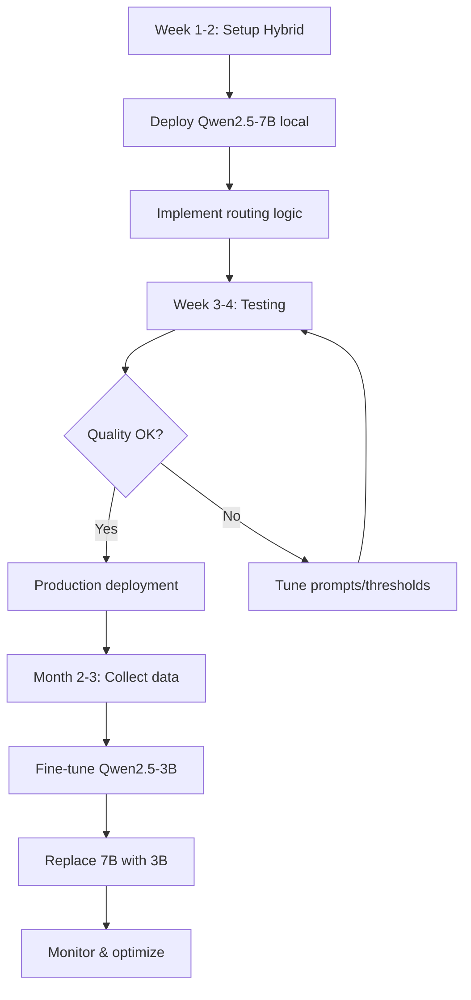

Bạn đúng rồi! Các model bạn liệt kê đều **rất nặng** để chạy offline. Hãy phân tích và tìm giải pháp tối ưu:

## **Phân tích các model bạn đang dùng**

| Model | Kích thước | VRAM cần | Có thể chạy offline? |
|-------|-----------|----------|---------------------|
| **qwen3-vl-8b** | ~8B params | 16-24GB | ⚠️ Khó (cần GPU cao cấp) |
| **gemini-2.5-flash** | Unknown (Google proprietary) | N/A | ❌ Không (API only) |
| **grok-4-fast** | ~314B params | 600GB+ | ❌ Không thể |
| **gpt-oss-120b** | ~120B params | 240GB+ | ❌ Không thể |

**Kết luận**: Tất cả đều **KHÔNG phù hợp** để chạy offline trên hardware thông thường của doanh nghiệp.

---

## **Giải pháp tối ưu cho deployment nội bộ**

### **Chiến lược 1: Sử dụng Small Language Models (SLMs) tối ưu cho tiếng Việt**

#### **Option 1A: Qwen 2.5 3B/7B (Recommended ⭐)**
```python
# Model: Qwen2.5-7B-Instruct
# VRAM: 8-12GB (có thể chạy trên RTX 3060/4060)
# Performance: Rất tốt cho tiếng Việt, hỗ trợ 128K context

from transformers import AutoModelForCausalLM, AutoTokenizer

model_name = "Qwen/Qwen2.5-7B-Instruct"
model = AutoModelForCausalLM.from_pretrained(
    model_name,
    torch_dtype="auto",
    device_map="auto"
)
tokenizer = AutoTokenizer.from_pretrained(model_name)

# Quantization để giảm VRAM
from transformers import BitsAndBytesConfig

bnb_config = BitsAndBytesConfig(
    load_in_4bit=True,
    bnb_4bit_quant_type="nf4",
    bnb_4bit_compute_dtype=torch.bfloat16
)

model = AutoModelForCausalLM.from_pretrained(
    model_name,
    quantization_config=bnb_config,
    device_map="auto"
)
# VRAM giảm xuống còn 4-6GB!
```

**Ưu điểm**:
- ✅ Tiếng Việt tốt (được train trên multilingual data)
- ✅ Context window lớn (128K tokens)
- ✅ Chạy được trên GPU consumer-grade
- ✅ Có thể quantize xuống 4-bit

**Nhược điểm**:
- ⚠️ Không bằng GPT-4/Claude về reasoning phức tạp
- ⚠️ Cần fine-tune thêm cho domain cụ thể

#### **Option 1B: Vistral-7B (Vietnamese-first model)**
```python
# Model được pre-train và fine-tune đặc biệt cho tiếng Việt
model_name = "Viet-Mistral/Vistral-7B-Chat"

# Tương tự setup như Qwen
```

**Ưu điểm**:
- ✅ **Được tối ưu đặc biệt cho tiếng Việt**
- ✅ Hiểu ngữ cảnh văn hóa Việt Nam tốt
- ✅ VRAM requirements tương tự Qwen (4-8GB với quantization)

---

### **Chiến lược 2: Hybrid Architecture (Best of Both Worlds ⭐⭐⭐)**

```python
"""
Kết hợp: Small model (offline) + Large model (API fallback)
"""

class HybridLLM:
    def __init__(self):
        # Small model chạy local
        self.local_model = Qwen25_7B()  # 4-8GB VRAM
        
        # Large model qua API (backup)
        self.api_model = OpenRouterAPI()  # gpt-4o-mini, gemini-flash
        
        # Classifier để quyết định dùng model nào
        self.complexity_classifier = ComplexityClassifier()
    
    def generate(self, query, context):
        # Phân loại độ phức tạp câu hỏi
        complexity = self.complexity_classifier.predict(query)
        
        if complexity == "simple":
            # Câu hỏi đơn giản → dùng local model
            return self.local_model.generate(query, context)
        
        elif complexity == "medium":
            # Thử local trước, nếu kém → fallback API
            local_response = self.local_model.generate(query, context)
            
            if self.is_good_response(local_response):
                return local_response
            else:
                return self.api_model.generate(query, context)
        
        else:  # complex
            # Câu hỏi phức tạp → dùng API luôn
            return self.api_model.generate(query, context)
```

**Ưu điểm**:
- ✅ 80-90% queries chạy offline (tiết kiệm chi phí)
- ✅ 10-20% queries phức tạp dùng API (quality cao)
- ✅ Kiểm soát được cost
- ✅ Fallback khi local model fail

**Implementation chi tiết**:

```python
class ComplexityClassifier:
    """Phân loại độ phức tạp của câu hỏi"""
    
    SIMPLE_PATTERNS = [
        r"(có bao nhiêu|có những|liệt kê|danh sách)",
        r"(là gì|nghĩa là|định nghĩa)",
        r"(khi nào|ở đâu|ai là)"
    ]
    
    COMPLEX_PATTERNS = [
        r"(so sánh|đánh giá|phân tích)",
        r"(tại sao|vì sao|nguyên nhân)",
        r"(đề xuất|khuyến nghị|giải pháp)",
        r"(dự đoán|xu hướng|tương lai)"
    ]
    
    def predict(self, query):
        query_lower = query.lower()
        
        # Check simple patterns
        for pattern in self.SIMPLE_PATTERNS:
            if re.search(pattern, query_lower):
                return "simple"
        
        # Check complex patterns
        for pattern in self.COMPLEX_PATTERNS:
            if re.search(pattern, query_lower):
                return "complex"
        
        # Check query length
        if len(query.split()) < 10:
            return "simple"
        elif len(query.split()) > 30:
            return "complex"
        
        return "medium"
```

---

### **Chiến lược 3: Distillation + Fine-tuning (Long-term ⭐⭐)**

```python
"""
Train một model nhỏ để bắt chước model lớn trên domain cụ thể
"""

# Step 1: Collect high-quality responses từ large model
def collect_training_data():
    large_model = OpenRouterAPI("gpt-4o")
    small_model = Qwen25_3B()
    
    training_data = []
    for query, context in your_dataset:
        # Lấy response từ model lớn
        teacher_response = large_model.generate(query, context)
        
        # Lấy response từ model nhỏ
        student_response = small_model.generate(query, context)
        
        training_data.append({
            "query": query,
            "context": context,
            "teacher": teacher_response,
            "student": student_response
        })
    
    return training_data

# Step 2: Fine-tune small model để học từ large model
from transformers import Trainer, TrainingArguments

training_args = TrainingArguments(
    output_dir="./qwen-2.5-3b-attech-finetuned",
    num_train_epochs=3,
    per_device_train_batch_size=4,
    gradient_accumulation_steps=4,
    learning_rate=2e-5,
    fp16=True,  # Mixed precision training
    logging_steps=10,
)

trainer = Trainer(
    model=small_model,
    args=training_args,
    train_dataset=train_dataset,
    eval_dataset=eval_dataset,
)

trainer.train()
```

**Ưu điểm**:
- ✅ Model nhỏ "học" được cách trả lời của model lớn
- ✅ Tối ưu cho domain cụ thể (ATTECH)
- ✅ 100% offline sau khi train xong

**Nhược điểm**:
- ⚠️ Cần tập training data chất lượng cao (500-1000 samples)
- ⚠️ Mất thời gian train (vài giờ đến vài ngày)

---

## **So sánh các chiến lược**

| Tiêu chí | SLM Only | Hybrid | Distillation |
|----------|----------|--------|--------------|
| **Cost** | 💰 Thấp nhất | 💰💰 Trung bình | 💰 Thấp (sau khi train) |
| **Quality** | ⭐⭐⭐ | ⭐⭐⭐⭐⭐ | ⭐⭐⭐⭐ |
| **Speed** | ⚡⚡⚡ | ⚡⚡ | ⚡⚡⚡ |
| **Setup Time** | 1-2 ngày | 3-5 ngày | 1-2 tuần |
| **Maintenance** | Thấp | Trung bình | Cao (cần retrain định kỳ) |

---

## **Recommendation cụ thể cho ATTECH**

### **Phase 1 (Ngay lập tức): Hybrid Architecture**

```python
# docker-compose.yml
services:
  local-llm:
    image: vllm/vllm-openai:latest
    command: >
      --model Qwen/Qwen2.5-7B-Instruct
      --quantization awq
      --gpu-memory-utilization 0.9
    deploy:
      resources:
        reservations:
          devices:
            - driver: nvidia
              count: 1
              capabilities: [gpu]
    ports:
      - "8000:8000"
  
  rag-api:
    build: ./backend
    environment:
      - LOCAL_LLM_URL=http://local-llm:8000/v1
      - OPENROUTER_API_KEY=${OPENROUTER_API_KEY}
      - LLM_STRATEGY=hybrid  # simple→local, complex→API
    depends_on:
      - local-llm
      - chroma
```

**Cấu hình Hybrid Logic**:
```python
# config/llm_config.py
LLM_CONFIG = {
    "local": {
        "model": "Qwen/Qwen2.5-7B-Instruct",
        "endpoint": "http://localhost:8000/v1",
        "max_tokens": 2048,
        "temperature": 0.2,
    },
    "api": {
        "model": "openai/gpt-4o-mini",  # Rẻ nhất, đủ tốt
        "endpoint": "https://openrouter.ai/api/v1",
        "max_tokens": 4096,
        "temperature": 0.3,
    },
    "routing": {
        "simple_threshold": 0.7,  # >= 70% confidence → local
        "api_fallback": True,     # Nếu local fail → API
        "max_api_calls_per_hour": 100,  # Rate limit
    }
}
```

### **Phase 2 (Sau 1 tháng): Fine-tune cho domain**

```python
# Collect real user queries và responses tốt
# Fine-tune Qwen2.5-3B trên data này
# → Model nhỏ hơn (3B), nhanh hơn, nhưng quality tốt hơn
```

### **Phase 3 (Sau 3 tháng): Evaluate & Optimize**

```python
# A/B testing:
# - 50% users dùng local model
# - 50% users dùng hybrid
# So sánh: quality, latency, cost
```

---

## **Hardware Requirements**

### **Minimum (cho Hybrid setup)**
```yaml
GPU: RTX 3060 12GB hoặc tương đương
RAM: 32GB
Storage: 500GB SSD
CPU: 8 cores

Estimated cost: ~$1,000-1,500
```

### **Recommended (cho production)**
```yaml
GPU: RTX 4070 Ti 16GB hoặc A4000
RAM: 64GB
Storage: 1TB NVMe SSD
CPU: 16 cores

Estimated cost: ~$2,500-3,500
```

### **Optimal (cho scale lớn)**
```yaml
GPU: A100 40GB hoặc 2x RTX 4090
RAM: 128GB
Storage: 2TB NVMe SSD
CPU: 32 cores

Estimated cost: ~$10,000-15,000
```

---

## **Cost Comparison (Monthly)**

| Setup | Hardware | API Cost | Total |
|-------|----------|----------|-------|
| **100% API** (như hiện tại) | $0 | $500-1000 | $500-1000 |
| **Hybrid** (80% local) | $2,500 one-time | $100-200 | $300-400/month |
| **100% Local** | $2,500 one-time | $0 | $100/month (electricity) |

**Break-even point**: Sau 3-6 tháng, Hybrid/Local sẽ rẻ hơn 100% API

---

## **Implementation Roadmap**



---

## **Quick Start Code**

```python
# install.sh
#!/bin/bash

# Install vLLM (serving framework)
pip install vllm

# Download model
python -c "
from transformers import AutoModelForCausalLM, AutoTokenizer
model = AutoModelForCausalLM.from_pretrained('Qwen/Qwen2.5-7B-Instruct')
tokenizer = AutoTokenizer.from_pretrained('Qwen/Qwen2.5-7B-Instruct')
"

# Start vLLM server
vllm serve Qwen/Qwen2.5-7B-Instruct \
    --host 0.0.0.0 \
    --port 8000 \
    --gpu-memory-utilization 0.9
```

```python
# test_hybrid.py
import openai

# Local model
local_client = openai.OpenAI(
    base_url="http://localhost:8000/v1",
    api_key="dummy"
)

# API model
api_client = openai.OpenAI(
    base_url="https://openrouter.ai/api/v1",
    api_key="your_key"
)

def generate_hybrid(query, context):
    complexity = classify_complexity(query)
    
    if complexity == "simple":
        response = local_client.chat.completions.create(
            model="Qwen/Qwen2.5-7B-Instruct",
            messages=[
                {"role": "system", "content": SYSTEM_PROMPT},
                {"role": "user", "content": f"{context}\n\n{query}"}
            ],
            temperature=0.2
        )
    else:
        response = api_client.chat.completions.create(
            model="openai/gpt-4o-mini",
            messages=[...],
            temperature=0.3
        )
    
    return response.choices[0].message.content
```

---

## **Kết luận**

**TL;DR**: 
1. ✅ **Ngay lập tức**: Deploy **Hybrid (Qwen2.5-7B local + GPT-4o-mini API)**
2. ✅ Sau 1 tháng: Fine-tune model nhỏ hơn (Qwen2.5-3B) trên real data
3. ✅ Sau 3 tháng: Chuyển 90-95% sang local, chỉ 5-10% dùng API

Bạn muốn tôi giúp implement phần nào trước?
- [ ] Setup vLLM server với Qwen2.5-7B
- [ ] Implement routing logic (complexity classifier)
- [ ] Fine-tuning script
- [ ] Cost tracking dashboard
