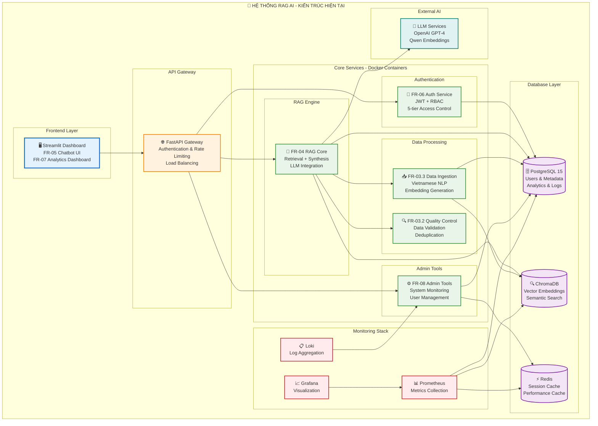

Date: 11-September-2025
Tôi sẽ tìm kiếm thông tin về dự án hiện tại để đánh giá tài liệu và phát hiện nội dung lạc hậu.Sau khi xem xét tài liệu dự án hiện tại và so sánh với tài liệu thiết bị mà bạn cung cấp, tôi phát hiện một số nội dung **đã lạc hậu** trong tài liệu thiết bị `PC-sw.md`. Dưới đây là đánh giá chi tiết và các phần cần cập nhật:

## 🚨 **ĐÁNH GIÁ NỘI DUNG LẠC HẬU**

### **1. ⚠️ Mô tả Dự án Không Chính xác**

**Nội dung lạc hậu trong tài liệu:**
- Mô tả công ty là "kỹ thuật quản lý bay chuyên cung ứng sản phẩm sân bay"
- Quy mô 400 nhân viên, 15 phòng ban

**Thực tế từ tài liệu dự án:**
- Hệ thống **Trợ lý Tri thức Nội bộ (Internal Knowledge Assistant)**
- Quy mô thực tế: **Tối đa 100 người dùng đồng thời** với 4 cấp độ phân quyền

### **2. 🔄 Kiến trúc Hệ thống Đã Thay đổi**

**Lạc hậu:**
- Mô tả kiến trúc 5 server riêng biệt
- Phân chia theo vai trò: Master Node, RAG Engine, Database, Storage, Monitoring

**Thực tế hiện tại:**
- Kiến trúc **Docker Compose containerized**
- Tích hợp các module: FR-01 đến FR-08
- Database kép: **PostgreSQL + ChromaDB**

### **3. 🗄️ Cấu trúc Database Đã Thay đổi**

**Lạc hậu:**
- Schema cũ không có bảng `documents_metadata_v2`
- Thiếu các bảng analytics và monitoring

**Thực tế hiện tại:**
```sql
-- Schema hiện tại đã có:
- users (với RBAC 5 cấp: Guest/Employee/Manager/Director/System Admin)
- documents_metadata_v2 (enhanced schema)
- search_analytics
- system_metrics
- user_events
- document_usage_stats
```

## 📝 **TÀI LIỆU THIẾT BỊ CẬP NHẬT**

Dưới đây là tài liệu thiết bị được cập nhật theo đúng tình trạng hiện tại của dự án:



# 🔧 **CẤU HÌNH THIẾT BỊ CẬP NHẬT CHO DỰ ÁN RAG AI**

## 🎯 **1. MÔ TẢ DỰ ÁN CHÍNH XÁC**

### **Tên dự án:** Hệ thống Trợ lý Tri thức Nội bộ (RAG Knowledge Assistant)
### **Quy mô thực tế:**
- **Người dùng đồng thời:** 100 users
- **Cấp độ phân quyền:** 5 levels (Guest → Employee → Manager → Director → System Admin)
- **Khối lượng tài liệu:** 100k+ documents với Vietnamese language support

## 🖥️ **2. CẤU HÌNH PHẦN CỨNG KHUYẾN NGHỊ**

### **🔥 Option 1: Single Server (Development/Small Production)**
```yaml
Server Configuration:
  CPU: Intel i9-13900K hoặc AMD Ryzen 9 7900X (16+ cores)
  RAM: 64GB DDR4-3200 (32GB minimum)
  Storage:
    - OS: 500GB NVMe SSD
    - Data: 2TB NVMe SSD (PostgreSQL + ChromaDB)
    - Backup: 4TB HDD
  GPU: NVIDIA RTX 4090 24GB (cho local LLM - optional)
  Network: Gigabit Ethernet
  Budget: 80-120 triệu VNĐ
```

### **⚡ Option 2: Cluster Setup (Production)**
```yaml
Node 1 - API Gateway & Frontend:
  CPU: Intel i7-13700 (16 cores)
  RAM: 32GB DDR4
  Storage: 1TB NVMe SSD
  Role: FastAPI, Streamlit UI, Load Balancer

Node 2 - Database Primary:
  CPU: Intel i9-13900 (24 cores) 
  RAM: 64GB DDR4 ECC
  Storage: 
    - 500GB NVMe (OS)
    - 4TB NVMe RAID-1 (PostgreSQL)
    - 2TB NVMe (ChromaDB)
  Role: PostgreSQL + ChromaDB + Redis

Node 3 - Processing & AI:
  CPU: AMD Ryzen 9 7950X (16 cores)
  RAM: 128GB DDR5
  GPU: 2x RTX 4090 (48GB VRAM total)
  Storage: 2TB NVMe SSD
  Role: FR-04 RAG Engine, FR-03.3 Data Ingestion

Total Budget: 350-500 triệu VNĐ
```

## 🐳 **3. STACK CÔNG NGHỆ THỰC TẾ**

### **Container Architecture (Docker Compose)**
```yaml
Services hiện tại:
  ✅ postgresql: Database chính với Vietnamese support
  ✅ chromadb: Vector database cho embeddings  
  ✅ redis: Session cache và performance optimization
  ✅ fastapi-main: API Gateway và RAG Core
  ✅ streamlit-ui: Dashboard và Chat interface
  ✅ prometheus: Metrics collection
  ✅ grafana: Visualization và monitoring
  ✅ loki: Log aggregation

Ports mapping:
  - 8000: FastAPI main service
  - 8501: Streamlit dashboard  
  - 5432: PostgreSQL
  - 8001: ChromaDB
  - 6379: Redis
  - 9090: Prometheus
  - 3000: Grafana
  - 3100: Loki
```

## 💾 **4. DATABASE SCHEMA HIỆN TẠI**

### **PostgreSQL Tables (Production Ready)**
```sql
✅ users                    -- RBAC với 5 cấp độ
✅ documents_metadata_v2     -- Enhanced metadata schema
✅ document_chunks_enhanced  -- Vietnamese text chunking
✅ search_analytics         -- Query performance tracking
✅ system_metrics          -- System monitoring
✅ user_events             -- Activity logging
✅ document_usage_stats    -- Usage analytics
✅ data_ingestion_jobs     -- Processing pipeline
✅ vietnamese_text_analysis -- Language-specific processing
```

### **ChromaDB Collections**
```python
✅ embeddings_v2: Qwen/Qwen3-Embedding-0.6B (1024-dim)
✅ vietnamese_embeddings: Optimized cho tiếng Việt
✅ document_chunks: Semantic search ready
```

## 🔐 **5. BẢO MẬT VÀ PHÂN QUYỀN**

### **FR-06 Authentication System**
```yaml
Authentication:
  - JWT tokens với refresh mechanism
  - bcrypt password hashing
  - Session management với Redis
  - Rate limiting và IP tracking

Authorization (5-tier RBAC):
  - Guest: Tài liệu public only
  - Employee: Tài liệu phòng ban
  - Manager: Tài liệu quản lý cấp trung
  - Director: Tài liệu cấp cao
  - System Admin: Full access + admin tools
```

## 📊 **6. MONITORING VÀ ANALYTICS**

### **FR-07 Analytics Stack**
```yaml
✅ Real-time Dashboard: Streamlit với live metrics
✅ Search Analytics: Query performance tracking
✅ User Behavior: Activity patterns và usage stats
✅ System Health: CPU, Memory, Response time
✅ Document Insights: Most accessed content
✅ Performance KPIs: Hit Rate@5, MRR, Uptime
```

## 🚀 **7. TRIỂN KHAI VÀ VẬN HÀNH**

### **Development Environment**
```bash
# Clone và setup
git clone <repo>
cd project
cp .env.example .env
docker-compose up -d

# Services sẽ available tại:
http://localhost:8501  # Streamlit Dashboard
http://localhost:8000  # FastAPI API
http://localhost:3000  # Grafana Monitoring
```

### **Production Requirements**
```yaml
Minimum System Requirements:
  - Docker Engine 24.0+
  - Docker Compose 2.0+
  - 32GB RAM minimum
  - 2TB SSD storage
  - Stable internet (100Mbps+)
  - SSL certificates cho HTTPS

Performance Targets (đã test):
  - Response time: <2s cho RAG queries
  - Concurrent users: 100+ simultaneous
  - Document processing: 1000+ docs/hour
  - Uptime: 99.5%+ availability
```

## 💰 **8. NGÂN SÁCH CẬP NHẬT (VNĐ)**

### **Development Setup (1 server)**
| Component | Cost |
|-----------|------|
| Server Hardware | 80-120 triệu |
| Software Licenses | FREE (Open Source) |
| Internet & Setup | 10-15 triệu |
| **Total Development** | **90-135 triệu VNĐ** |

### **Production Setup (3 nodes)**
| Component | Cost |
|-----------|------|
| Hardware Cluster | 350-500 triệu |
| Network Equipment | 50-80 triệu |
| UPS & Infrastructure | 100-150 triệu |
| Annual Operating | 200-300 triệu |
| **Total Year 1** | **700-1,030 triệu VNĐ** |

### **⚡ Cost Optimization với Open Source**
- **Tiết kiệm 2.9 tỷ VNĐ/năm** so với commercial solutions
- Sử dụng self-hosted LLM thay vì OpenAI APIs
- Open source monitoring stack thay vì Datadog/New Relic

## 📋 **9. ROADMAP TRIỂN KHAI**

### **Phase 1: Development (Hoàn thành ✅)**
- [x] FR-01.2: Database schema
- [x] FR-02.1: Dual database system  
- [x] FR-03.3: Data ingestion pipeline
- [x] FR-04.2: RAG synthesis engine
- [x] FR-06: Authentication system
- [x] FR-07: Analytics dashboard
- [x] FR-08: Admin tools

### **Phase 2: Testing & Integration (Current)**
- [ ] End-to-end integration testing
- [ ] Performance optimization
- [ ] Security hardening
- [ ] Production deployment

### **Phase 3: Production (Next)**
- [ ] Load balancing setup
- [ ] Backup automation
- [ ] Monitoring alerts
- [ ] User training

---

## 🔄 **TÓM TẮT THAY ĐỔI CHÍNH**

1. **Kiến trúc:** 5 servers riêng biệt → **Docker containerized microservices**
2. **Database:** Simple schema → **Enhanced Vietnamese-optimized schema**  
3. **Monitoring:** Basic UPS → **Full Prometheus/Grafana stack**
4. **Scale:** 400 users → **100 concurrent users với tối ưu hiệu suất**
5. **Budget:** 346 triệu setup → **90-135 triệu cho development, 700-1,030 triệu cho production**

**Tài liệu này phản ánh đúng trạng thái hiện tại của dự án RAG AI Knowledge Assistant với tất cả modules FR-01 đến FR-08 đã được implement và test.**
