# KẾ HOẠCH TIẾP THEO SAU KHI HOÀN THÀNH FR-01.1 ĐẾN FR-06.2

Sau khi bạn hoàn thành tất cả các module từ **FR-01.1 đến FR-06.2**, đây là roadmap tiếp theo:

## 📋 **TRẠNG THÁI HIỆN TẠI**

### ✅ **Đã Hoàn Thành:**
- **FR-01**: Embedding Models & Database Design ✅
- **FR-02**: Database Management System ✅ 
- **FR-03**: Data Processing Pipeline ✅
- **FR-04**: RAG Core Engine ✅
- **FR-05**: Chatbot UI ✅
- **FR-06**: Security & Access Control ✅

---

## 🎯 **PHASE TIẾP THEO: SYSTEM INTEGRATION & PRODUCTION**

### **Phase 8: System Integration & Testing (2-3 tuần)**

```mermaid
flowchart TD
    Start([🚀 All Modules Complete])
    
    subgraph "Phase 8A: Integration (Tuần 1)"
        A1[🔗 Module Integration]
        A2[🧪 End-to-End Testing]
        A3[🔧 Bug Fixes & Optimization]
    end
    
    subgraph "Phase 8B: Production Prep (Tuần 2)" 
        B1[🚀 Production Deployment]
        B2[📊 Monitoring Setup]
        B3[📚 Documentation Complete]
    end
    
    subgraph "Phase 8C: Go-Live (Tuần 3)"
        C1[🎓 User Training]
        C2[🌐 Production Launch]
        C3[📈 Performance Monitoring]
    end
    
    Finish([🎉 System Live])
    
    Start --> A1
    A1 --> A2
    A2 --> A3
    A3 --> B1
    B1 --> B2
    B2 --> B3
    B3 --> C1
    C1 --> C2
    C2 --> C3
    C3 --> Finish
```



---

## 🔗 **PHASE 8A: MODULE INTEGRATION (Tuần 1)**

### **Bước 8A.1: Complete System Architecture Integration**

```python
# main_application.py - Tích hợp tất cả modules
from fastapi import FastAPI
from contextlib import asynccontextmanager

# Import all modules
from modules.embedding_module import embedding_router, EmbeddingManager
from modules.database_module import database_router, DatabaseManager  
from modules.data_processing import processing_router, DataPipeline
from modules.rag_engine import rag_router, RAGEngine
from modules.chatbot_ui import ui_router, ChatbotUI
from modules.auth_module import auth_router, AuthSystem

@asynccontextmanager
async def lifespan(app: FastAPI):
    # Initialize all systems in correct order
    print("🚀 Initializing Complete Knowledge Assistant System...")
    
    # 1. Database & Cache
    app.state.db_manager = DatabaseManager()
    await app.state.db_manager.initialize()
    
    # 2. Authentication & Security
    app.state.auth_system = AuthSystem(app.state.db_manager)
    await app.state.auth_system.initialize()
    
    # 3. Embedding & AI Models
    app.state.embedding_manager = EmbeddingManager()
    await app.state.embedding_manager.load_best_models()
    
    # 4. Data Processing Pipeline
    app.state.data_pipeline = DataPipeline(
        db_manager=app.state.db_manager,
        embedding_manager=app.state.embedding_manager
    )
    
    # 5. RAG Core Engine
    app.state.rag_engine = RAGEngine(
        db_manager=app.state.db_manager,
        embedding_manager=app.state.embedding_manager,
        auth_system=app.state.auth_system
    )
    
    # 6. Chatbot UI System
    app.state.chatbot_ui = ChatbotUI(
        rag_engine=app.state.rag_engine,
        auth_system=app.state.auth_system
    )
    
    print("✅ All systems initialized successfully!")
    yield
    
    # Cleanup on shutdown
    print("🔄 Shutting down systems...")
    await app.state.db_manager.close()
    print("✅ System shutdown complete")

# Create main application
app = FastAPI(
    title="Knowledge Assistant - Complete System",
    description="Internal Knowledge Management System với AI Chatbot",
    version="1.0.0",
    lifespan=lifespan
)

# Include all routers với proper prefixes
app.include_router(auth_router, prefix="/api/v1/auth")
app.include_router(database_router, prefix="/api/v1/database") 
app.include_router(embedding_router, prefix="/api/v1/embeddings")
app.include_router(processing_router, prefix="/api/v1/data")
app.include_router(rag_router, prefix="/api/v1/rag")
app.include_router(ui_router, prefix="/api/v1/chat")

# Main chatbot endpoint tích hợp tất cả
@app.post("/api/v1/ask")
async def ask_question(
    request: QuestionRequest,
    current_user = Depends(get_current_user)
):
    """Main chatbot endpoint integrating all modules."""
    
    # 1. Authentication & Authorization check
    auth_result = await app.state.auth_system.check_permission(
        user=current_user,
        resource_type=request.document_category or "employee_only",
        permission_type="read"
    )
    
    if not auth_result.allowed:
        raise HTTPException(403, detail="Access denied")
    
    # 2. Process query through RAG engine
    response = await app.state.rag_engine.process_query(
        query=request.query,
        user_context={
            "user_id": current_user.id,
            "role": current_user.role,
            "department": current_user.department,
            "accessible_resources": auth_result.accessible_resources
        },
        conversation_id=request.conversation_id
    )
    
    # 3. Log interaction for audit
    await app.state.auth_system.log_interaction(
        user_id=current_user.id,
        action="chatbot_query",
        resource="knowledge_base",
        query=request.query,
        response_summary=response.summary
    )
    
    return response
```

### **Bước 8A.2: End-to-End Testing Suite**

```python
# tests/test_complete_system.py
import pytest
import asyncio
from httpx import AsyncClient

class TestCompleteKnowledgeAssistant:
    """Complete system integration testing."""
    
    async def test_complete_workflow(self, client: AsyncClient):
        """Test complete workflow from login to chatbot response."""
        
        # Step 1: User Authentication
        login_response = await client.post("/api/v1/auth/login", json={
            "username": "test_employee",
            "password": "test123"
        })
        assert login_response.status_code == 200
        token = login_response.json()["access_token"]
        headers = {"Authorization": f"Bearer {token}"}
        
        # Step 2: Upload Document (if user has permission)
        document_upload = await client.post(
            "/api/v1/data/upload",
            headers=headers,
            files={"file": ("test_doc.pdf", b"test content", "application/pdf")},
            data={"category": "employee_only", "department": "engineering"}
        )
        
        # Step 3: Wait for processing
        if document_upload.status_code == 200:
            doc_id = document_upload.json()["document_id"]
            
            # Check processing status
            for _ in range(10):  # Wait up to 10 seconds
                status_response = await client.get(
                    f"/api/v1/data/processing-status/{doc_id}",
                    headers=headers
                )
                if status_response.json()["status"] == "completed":
                    break
                await asyncio.sleep(1)
        
        # Step 4: Ask Question via Chatbot
        question_response = await client.post("/api/v1/ask", 
            headers=headers,
            json={
                "query": "What is the company's vacation policy?",
                "conversation_id": "test-conversation-123"
            }
        )
        
        assert question_response.status_code == 200
        answer_data = question_response.json()
        
        # Verify response structure
        assert "answer" in answer_data
        assert "references" in answer_data
        assert "confidence" in answer_data
        assert len(answer_data["references"]) > 0
        
        # Step 5: Check Conversation History
        history_response = await client.get(
            "/api/v1/chat/conversations/test-conversation-123",
            headers=headers
        )
        
        assert history_response.status_code == 200
        history_data = history_response.json()
        assert len(history_data["messages"]) >= 2  # Question + Answer
        
        # Step 6: Verify Audit Logs
        audit_response = await client.get(
            "/api/v1/auth/audit/my-activity",
            headers=headers
        )
        
        assert audit_response.status_code == 200
        audit_data = audit_response.json()
        
        # Should have login, query, and other activities
        actions = [log["action"] for log in audit_data["logs"]]
        assert "login_success" in actions
        assert "chatbot_query" in actions
    
    async def test_permission_system_integration(self, client: AsyncClient):
        """Test that permission system correctly filters responses."""
        
        # Login as different user levels and test access
        test_users = [
            ("guest_user", "guest123", []),
            ("employee_user", "emp123", ["public", "employee_only"]),
            ("manager_user", "mgr123", ["public", "employee_only", "manager_only"]),
            ("director_user", "dir123", ["public", "employee_only", "manager_only", "director_only"])
        ]
        
        for username, password, expected_resources in test_users:
            # Login
            login_resp = await client.post("/api/v1/auth/login", json={
                "username": username, "password": password
            })
            
            if login_resp.status_code != 200:
                continue  # Skip if user doesn't exist
                
            token = login_resp.json()["access_token"]
            headers = {"Authorization": f"Bearer {token}"}
            
            # Check accessible resources
            resources_resp = await client.get(
                "/api/v1/auth/acl/accessible-resources",
                headers=headers
            )
            
            accessible = resources_resp.json()
            assert set(accessible) == set(expected_resources)
            
            # Test chatbot query - should only return documents user can access
            question_resp = await client.post("/api/v1/ask",
                headers=headers,
                json={"query": "Show me all company policies"}
            )
            
            if question_resp.status_code == 200:
                references = question_resp.json().get("references", [])
                for ref in references:
                    assert ref["access_level"] in expected_resources
```

### **Bước 8A.3: Performance & Load Testing**

```python
# tests/test_performance.py
import asyncio
import aiohttp
import time
from concurrent.futures import ThreadPoolExecutor

class PerformanceTestSuite:
    """Performance testing cho complete system."""
    
    async def test_concurrent_users(self, num_users=50):
        """Test system với multiple concurrent users."""
        
        async def simulate_user_session():
            async with aiohttp.ClientSession() as session:
                # Login
                login_start = time.time()
                async with session.post("http://localhost:8000/api/v1/auth/login", 
                                       json={"username": "test_user", "password": "test123"}) as resp:
                    if resp.status == 200:
                        data = await resp.json()
                        token = data["access_token"]
                login_time = time.time() - login_start
                
                # Ask questions
                headers = {"Authorization": f"Bearer {token}"}
                query_times = []
                
                for i in range(5):  # 5 questions per user
                    query_start = time.time()
                    async with session.post("http://localhost:8000/api/v1/ask",
                                           headers=headers,
                                           json={"query": f"Test question {i}"}) as resp:
                        await resp.json()
                    query_time = time.time() - query_start
                    query_times.append(query_time)
                
                return {
                    "login_time": login_time,
                    "avg_query_time": sum(query_times) / len(query_times),
                    "total_time": sum(query_times) + login_time
                }
        
        # Run concurrent user sessions
        start_time = time.time()
        tasks = [simulate_user_session() for _ in range(num_users)]
        results = await asyncio.gather(*tasks, return_exceptions=True)
        total_time = time.time() - start_time
        
        # Analyze results
        successful_results = [r for r in results if isinstance(r, dict)]
        
        print(f"📊 Performance Test Results ({num_users} concurrent users):")
        print(f"   Total Time: {total_time:.2f}s")
        print(f"   Successful Sessions: {len(successful_results)}/{num_users}")
        print(f"   Average Login Time: {sum(r['login_time'] for r in successful_results)/len(successful_results):.2f}s")
        print(f"   Average Query Time: {sum(r['avg_query_time'] for r in successful_results)/len(successful_results):.2f}s")
        
        # Assert performance requirements
        assert len(successful_results) >= num_users * 0.95  # 95% success rate
        avg_query_time = sum(r['avg_query_time'] for r in successful_results)/len(successful_results)
        assert avg_query_time < 60  # Under 60 seconds per FR requirement
```

---

## 🚀 **PHASE 8B: PRODUCTION PREPARATION (Tuần 2)**

### **Bước 8B.1: Production Deployment Setup**

```yaml
# docker-compose.production.yml - Complete production setup
version: '3.8'

services:
  # Main Application
  knowledge-assistant:
    build:
      context: .
      dockerfile: Dockerfile.production
    ports:
      - "443:8000"  # HTTPS
    environment:
      - ENVIRONMENT=production
      - DATABASE_URL=${DATABASE_URL}
      - REDIS_URL=${REDIS_URL}
      - SECRET_KEY=${SECRET_KEY}
      - LLM_API_KEY=${LLM_API_KEY}
    volumes:
      - ./logs:/app/logs
      - ./uploads:/app/uploads
    depends_on:
      - postgres
      - redis
      - vector-db
    restart: unless-stopped
    healthcheck:
      test: ["CMD", "curl", "-f", "https://localhost:8000/health"]
      interval: 30s
      timeout: 10s
      retries: 3

  # Database Services
  postgres:
    image: postgres:13
    environment:
      POSTGRES_DB: knowledge_assistant
      POSTGRES_USER: ${DB_USER}
      POSTGRES_PASSWORD: ${DB_PASSWORD}
    volumes:
      - postgres_data:/var/lib/postgresql/data
    restart: unless-stopped

  redis:
    image: redis:6-alpine
    command: redis-server --requirepass ${REDIS_PASSWORD}
    volumes:
      - redis_data:/data
    restart: unless-stopped

  vector-db:
    image: chromadb/chroma:latest
    environment:
      - CHROMA_SERVER_AUTH_CREDENTIALS=${CHROMA_AUTH}
    volumes:
      - chroma_data:/chroma/chroma
    ports:
      - "8001:8000"
    restart: unless-stopped

  # Monitoring Stack
  prometheus:
    image: prom/prometheus:latest
    ports:
      - "9090:9090"
    volumes:
      - ./monitoring/prometheus.yml:/etc/prometheus/prometheus.yml
      - prometheus_data:/prometheus
    restart: unless-stopped

  grafana:
    image: grafana/grafana:latest
    ports:
      - "3000:3000"
    environment:
      - GF_SECURITY_ADMIN_PASSWORD=${GRAFANA_PASSWORD}
    volumes:
      - grafana_data:/var/lib/grafana
      - ./monitoring/dashboards:/etc/grafana/provisioning/dashboards
    restart: unless-stopped

  # Reverse Proxy & SSL
  nginx:
    image: nginx:alpine
    ports:
      - "80:80"
      - "443:443"
    volumes:
      - ./nginx/nginx.conf:/etc/nginx/nginx.conf
      - ./ssl:/etc/nginx/ssl
    depends_on:
      - knowledge-assistant
    restart: unless-stopped

volumes:
  postgres_data:
  redis_data:
  chroma_data:
  prometheus_data:
  grafana_data:
```

### **Bước 8B.2: Monitoring & Alerting Setup**

```python
# monitoring/system_monitoring.py
from prometheus_client import Counter, Histogram, Gauge, start_http_server
import structlog
import smtplib
from email.mime.text import MIMEText

# Metrics
chatbot_queries_total = Counter('chatbot_queries_total', 'Total chatbot queries', ['user_role', 'status'])
query_response_time = Histogram('query_response_time_seconds', 'Query response time')
active_users = Gauge('active_users_total', 'Number of active users')
system_errors = Counter('system_errors_total', 'Total system errors', ['component'])

class SystemMonitor:
    """Comprehensive system monitoring."""
    
    def __init__(self):
        self.logger = structlog.get_logger()
        self.alerts_enabled = True
    
    async def record_query(self, user_role: str, response_time: float, status: str):
        """Record chatbot query metrics."""
        chatbot_queries_total.labels(user_role=user_role, status=status).inc()
        query_response_time.observe(response_time)
        
        # Alert if response time is too high
        if response_time > 30:  # 30 second threshold
            await self.send_alert(
                "High Response Time Alert",
                f"Query took {response_time:.2f} seconds (threshold: 30s)"
            )
    
    async def record_error(self, component: str, error: str):
        """Record system error."""
        system_errors.labels(component=component).inc()
        
        self.logger.error(
            "system_error",
            component=component,
            error=error
        )
        
        await self.send_alert(
            f"System Error in {component}",
            f"Error: {error}"
        )
    
    async def update_active_users(self, count: int):
        """Update active users count."""
        active_users.set(count)
    
    async def send_alert(self, subject: str, message: str):
        """Send alert email to administrators."""
        if not self.alerts_enabled:
            return
            
        try:
            msg = MIMEText(message)
            msg['Subject'] = f"[Knowledge Assistant] {subject}"
            msg['From'] = "system@company.com"
            msg['To'] = "admin@company.com"
            
            # Send email (configure SMTP settings)
            # smtp_server.send_message(msg)
            
            self.logger.info("alert_sent", subject=subject)
            
        except Exception as e:
            self.logger.error("failed_to_send_alert", error=str(e))

# Health check endpoint
@app.get("/health/detailed")
async def detailed_health_check():
    """Comprehensive health check for monitoring."""
    
    health_status = {
        "status": "healthy",
        "timestamp": datetime.utcnow().isoformat(),
        "services": {},
        "metrics": {}
    }
    
    try:
        # Check database
        async with app.state.db_manager.get_connection() as conn:
            await conn.fetchval("SELECT 1")
        health_status["services"]["database"] = "healthy"
        
        # Check Redis
        await app.state.redis_client.ping()
        health_status["services"]["redis"] = "healthy"
        
        # Check Vector DB
        # Add vector DB health check
        health_status["services"]["vector_db"] = "healthy"
        
        # Check LLM API
        # Add LLM API health check
        health_status["services"]["llm_api"] = "healthy"
        
        # Add metrics
        health_status["metrics"] = {
            "active_users": active_users._value.get(),
            "total_queries_today": chatbot_queries_total._value.sum(),
            "avg_response_time": query_response_time._sum.get() / max(query_response_time._count.get(), 1)
        }
        
    except Exception as e:
        health_status["status"] = "unhealthy"
        health_status["error"] = str(e)
        
    return health_status
```

---

## 📚 **PHASE 8C: GO-LIVE PREPARATION (Tuần 3)**

### **Bước 8C.1: User Training Materials**

```markdown
# 📚 KNOWLEDGE ASSISTANT USER GUIDE

## 🎯 Dành cho Nhân viên

### Đăng nhập và Bắt đầu
1. Truy cập: https://knowledge.company.com
2. Đăng nhập bằng tài khoản công ty
3. Bạn sẽ thấy giao diện chat

### Cách đặt câu hỏi hiệu quả
✅ **TỐT:**
- "Quy trình xin nghỉ phép như thế nào?"
- "Công ty có chính sách work from home không?"
- "Cách sử dụng sản phẩm X trong dự án Y?"

❌ **TRÁNH:**
- "Này" hoặc "Help"
- Câu hỏi quá chung chung
- Thông tin nhạy cảm cá nhân

### Hiểu kết quả trả lời
- **Confidence Score**: Độ tin cậy của câu trả lời (70-100% là tốt)
- **References**: Tài liệu gốc được tham khảo
- **Access Level**: Loại tài liệu bạn được truy cập

## 🔧 Dành cho Quản lý

### Quản lý tài liệu
1. Upload tài liệu mới qua `/upload`
2. Phân loại access level phù hợp
3. Kiểm tra chất lượng sau khi xử lý

### Theo dõi sử dụng
- Dashboard: `/admin/analytics`
- Xem top câu hỏi thường gặp
- Monitor response quality

## ⚙️ Dành cho IT Admin

### System Administration
1. **User Management**: `/admin/users`
2. **Document Management**: `/admin/documents`
3. **System Health**: `/health/detailed`
4. **Audit Logs**: `/admin/audit`

### Troubleshooting
- Restart services: `docker-compose restart`
- Check logs: `docker-compose logs -f`
- Database backup: Run backup script daily

### Security Checklist
- [ ] SSL certificates updated
- [ ] Regular security scans
- [ ] Access logs reviewed
- [ ] Backup systems tested
```

### **Bước 8C.2: Final System Validation**

```bash
#!/bin/bash
# scripts/final_validation.sh

echo "🎯 FINAL SYSTEM VALIDATION - KNOWLEDGE ASSISTANT"
echo "================================================"

# Test all major functionalities
echo "🔐 Testing Authentication System..."
./tests/test_auth_system.sh

echo "📊 Testing Database Operations..."
./tests/test_database_operations.sh  

echo "🤖 Testing RAG Engine..."
./tests/test_rag_engine.sh

echo "💬 Testing Chatbot Interface..."
./tests/test_chatbot_ui.sh

echo "🛡️ Testing Security & Permissions..."  
./tests/test_security_system.sh

echo "📈 Testing Performance..."
python -m pytest tests/test_performance.py -v

echo "🔄 Testing System Integration..."
python -m pytest tests/test_complete_system.py -v

echo "📊 Generating Final Report..."
python scripts/generate_system_report.py

echo ""
echo "🎉 SYSTEM VALIDATION COMPLETE!"
echo "📋 Ready for Production Launch"
echo ""
echo "📊 System Stats:"
echo "  - All modules: ✅ Operational"
echo "  - Security: ✅ Validated"
echo "  - Performance: ✅ Meeting requirements"
echo "  - Integration: ✅ All systems connected"
echo ""
echo "🚀 READY TO GO LIVE!"
```

---

## 🎉 **FINAL DELIVERABLES**

### **📦 Production-Ready Package**

```
knowledge-assistant-v1.0/
├── 🏗️ Infrastructure/
│   ├── docker-compose.production.yml
│   ├── kubernetes/
│   ├── nginx/
│   └── ssl/
├── 💼 Application/
│   ├── src/
│   ├── tests/
│   ├── monitoring/
│   └── scripts/
├── 📚 Documentation/
│   ├── user_guide.md
│   ├── admin_guide.md
│   ├── api_documentation.html
│   └── troubleshooting.md
├── 🔧 Configuration/
│   ├── .env.production
│   ├── database_schema.sql
│   └── initial_data.sql
└── 📊 Reports/
    ├── system_architecture.pdf
    ├── security_audit.pdf
    └── performance_benchmarks.pdf
```

### **🎯 Go-Live Checklist**

- [ ] **Infrastructure**: Production servers ready
- [ ] **Security**: SSL certificates, security scan passed
- [ ] **Data**: Initial knowledge base loaded
- [ ] **Users**: User accounts created and tested
- [ ] **Training**: Staff training completed
- [ ] **Monitoring**: Dashboards and alerts configured
- [ ] **Backup**: Backup systems tested
- [ ] **Documentation**: All guides finalized
- [ ] **Support**: Help desk procedures established
- [ ] **Performance**: Load testing passed

---

## 🚀 **POST-LAUNCH ACTIVITIES**

### **Tuần 1-2 sau Go-Live:**
- 👀 Monitor system closely
- 🐛 Quick bug fixes
- 📞 User support
- 📊 Collect feedback

### **Tháng 1-3 sau Go-Live:**
- 📈 Analyze usage patterns
- 🔧 System optimization
- 📚 Expand knowledge base
- ⭐ Feature enhancements

### **Dài hạn:**
- 🤖 AI model improvements
- 🔄 Integration với các hệ thống khác
- 📱 Mobile app development
- 🌐 Multi-language support

---

## 📋 **TÓM TẮT ROADMAP**

1. ✅ **Modules FR-01 to FR-06**: COMPLETED
2. 🔄 **Phase 8A**: System Integration (Tuần 1)
3. 🚀 **Phase 8B**: Production Preparation (Tuần 2)  
4. 🎯 **Phase 8C**: Go-Live (Tuần 3)
5. 📈 **Post-Launch**: Monitoring & Enhancement

**Total Timeline**: ~3 tuần từ khi hoàn thành tất cả modules đến khi hệ thống chạy production.

**Bạn đã sẵn sàng bắt đầu Phase 8A - System Integration chưa?** 🚀
