# KẾ HOẠCH TIẾP THEO SAU KHI HOÀN THÀNH FR-01.1 ĐẾN FR-06.2

Sau khi bạn hoàn thành tất cả các module từ **FR-01.1 đến FR-06.2**, đây là roadmap tiếp theo:

## 📋 **TRẠNG THÁI HIỆN TẠI**

### ✅ **Đã Hoàn Thành:**
- **FR-01**: Embedding Models & Database Design ✅
- **FR-02**: Database Management System ✅ 
- **FR-03**: Data Processing Pipeline ✅
- **FR-04**: RAG Core Engine ✅
- **FR-05**: Chatbot UI ✅
- **FR-06**: Security & Access Control ✅

---

## 🎯 **PHASE TIẾP THEO: SYSTEM INTEGRATION & PRODUCTION**

### **Phase 8: System Integration & Testing (2-3 tuần)**

```mermaid
flowchart TD
    Start([🚀 All Modules Complete])
    
    subgraph "Phase 8A: Integration (Tuần 1)"
        A1[🔗 Module Integration]
        A2[🧪 End-to-End Testing]
        A3[🔧 Bug Fixes & Optimization]
    end
    
    subgraph "Phase 8B: Production Prep (Tuần 2)" 
        B1[🚀 Production Deployment]
        B2[📊 Monitoring Setup]
        B3[📚 Documentation Complete]
    end
    
    subgraph "Phase 8C: Go-Live (Tuần 3)"
        C1[🎓 User Training]
        C2[🌐 Production Launch]
        C3[📈 Performance Monitoring]
    end
    
    Finish([🎉 System Live])
    
    Start --> A1
    A1 --> A2
    A2 --> A3
    A3 --> B1
    B1 --> B2
    B2 --> B3
    B3 --> C1
    C1 --> C2
    C2 --> C3
    C3 --> Finish
```



---

## 🔗 **PHASE 8A: MODULE INTEGRATION (Tuần 1)**

### **Bước 8A.1: Complete System Architecture Integration**

```python
# main_application.py - Tích hợp tất cả modules
from fastapi import FastAPI
from contextlib import asynccontextmanager

# Import all modules
from modules.embedding_module import embedding_router, EmbeddingManager
from modules.database_module import database_router, DatabaseManager  
from modules.data_processing import processing_router, DataPipeline
from modules.rag_engine import rag_router, RAGEngine
from modules.chatbot_ui import ui_router, ChatbotUI
from modules.auth_module import auth_router, AuthSystem

@asynccontextmanager
async def lifespan(app: FastAPI):
    # Initialize all systems in correct order
    print("🚀 Initializing Complete Knowledge Assistant System...")
    
    # 1. Database & Cache
    app.state.db_manager = DatabaseManager()
    await app.state.db_manager.initialize()
    
    # 2. Authentication & Security
    app.state.auth_system = AuthSystem(app.state.db_manager)
    await app.state.auth_system.initialize()
    
    # 3. Embedding & AI Models
    app.state.embedding_manager = EmbeddingManager()
    await app.state.embedding_manager.load_best_models()
    
    # 4. Data Processing Pipeline
    app.state.data_pipeline = DataPipeline(
        db_manager=app.state.db_manager,
        embedding_manager=app.state.embedding_manager
    )
    
    # 5. RAG Core Engine
    app.state.rag_engine = RAGEngine(
        db_manager=app.state.db_manager,
        embedding_manager=app.state.embedding_manager,
        auth_system=app.state.auth_system
    )
    
    # 6. Chatbot UI System
    app.state.chatbot_ui = ChatbotUI(
        rag_engine=app.state.rag_engine,
        auth_system=app.state.auth_system
    )
    
    print("✅ All systems initialized successfully!")
    yield
    
    # Cleanup on shutdown
    print("🔄 Shutting down systems...")
    await app.state.db_manager.close()
    print("✅ System shutdown complete")

# Create main application
app = FastAPI(
    title="Knowledge Assistant - Complete System",
    description="Internal Knowledge Management System với AI Chatbot",
    version="1.0.0",
    lifespan=lifespan
)

# Include all routers với proper prefixes
app.include_router(auth_router, prefix="/api/v1/auth")
app.include_router(database_router, prefix="/api/v1/database") 
app.include_router(embedding_router, prefix="/api/v1/embeddings")
app.include_router(processing_router, prefix="/api/v1/data")
app.include_router(rag_router, prefix="/api/v1/rag")
app.include_router(ui_router, prefix="/api/v1/chat")

# Main chatbot endpoint tích hợp tất cả
@app.post("/api/v1/ask")
async def ask_question(
    request: QuestionRequest,
    current_user = Depends(get_current_user)
):
    """Main chatbot endpoint integrating all modules."""
    
    # 1. Authentication & Authorization check
    auth_result = await app.state.auth_system.check_permission(
        user=current_user,
        resource_type=request.document_category or "employee_only",
        permission_type="read"
    )
    
    if not auth_result.allowed:
        raise HTTPException(403, detail="Access denied")
    
    # 2. Process query through RAG engine
    response = await app.state.rag_engine.process_query(
        query=request.query,
        user_context={
            "user_id": current_user.id,
            "role": current_user.role,
            "department": current_user.department,
            "accessible_resources": auth_result.accessible_resources
        },
        conversation_id=request.conversation_id
    )
    
    # 3. Log interaction for audit
    await app.state.auth_system.log_interaction(
        user_id=current_user.id,
        action="chatbot_query",
        resource="knowledge_base",
        query=request.query,
        response_summary=response.summary
    )
    
    return response
```

### **Bước 8A.2: End-to-End Testing Suite**

```python
# tests/test_complete_system.py
import pytest
import asyncio
from httpx import AsyncClient

class TestCompleteKnowledgeAssistant:
    """Complete system integration testing."""
    
    async def test_complete_workflow(self, client: AsyncClient):
        """Test complete workflow from login to chatbot response."""
        
        # Step 1: User Authentication
        login_response = await client.post("/api/v1/auth/login", json={
            "username": "test_employee",
            "password": "test123"
        })
        assert login_response.status_code == 200
        token = login_response.json()["access_token"]
        headers = {"Authorization": f"Bearer {token}"}
        
        # Step 2: Upload Document (if user has permission)
        document_upload = await client.post(
            "/api/v1/data/upload",
            headers=headers,
            files={"file": ("test_doc.pdf", b"test content", "application/pdf")},
            data={"category": "employee_only", "department": "engineering"}
        )
        
        # Step 3: Wait for processing
        if document_upload.status_code == 200:
            doc_id = document_upload.json()["document_id"]
            
            # Check processing status
            for _ in range(10):  # Wait up to 10 seconds
                status_response = await client.get(
                    f"/api/v1/data/processing-status/{doc_id}",
                    headers=headers
                )
                if status_response.json()["status"] == "completed":
                    break
                await asyncio.sleep(1)
        
        # Step 4: Ask Question via Chatbot
        question_response = await client.post("/api/v1/ask", 
            headers=headers,
            json={
                "query": "What is the company's vacation policy?",
                "conversation_id": "test-conversation-123"
            }
        )
        
        assert question_response.status_code == 200
        answer_data = question_response.json()
        
        # Verify response structure
        assert "answer" in answer_data
        assert "references" in answer_data
        assert "confidence" in answer_data
        assert len(answer_data["references"]) > 0
        
        # Step 5: Check Conversation History
        history_response = await client.get(
            "/api/v1/chat/conversations/test-conversation-123",
            headers=headers
        )
        
        assert history_response.status_code == 200
        history_data = history_response.json()
        assert len(history_data["messages"]) >= 2  # Question + Answer
        
        # Step 6: Verify Audit Logs
        audit_response = await client.get(
            "/api/v1/auth/audit/my-activity",
            headers=headers
        )
        
        assert audit_response.status_code == 200
        audit_data = audit_response.json()
        
        # Should have login, query, and other activities
        actions = [log["action"] for log in audit_data["logs"]]
        assert "login_success" in actions
        assert "chatbot_query" in actions
    
    async def test_permission_system_integration(self, client: AsyncClient):
        """Test that permission system correctly filters responses."""
        
        # Login as different user levels and test access
        test_users = [
            ("guest_user", "guest123", []),
            ("employee_user", "emp123", ["public", "employee_only"]),
            ("manager_user", "mgr123", ["public", "employee_only", "manager_only"]),
            ("director_user", "dir123", ["public", "employee_only", "manager_only", "director_only"])
        ]
        
        for username, password, expected_resources in test_users:
            # Login
            login_resp = await client.post("/api/v1/auth/login", json={
                "username": username, "password": password
            })
            
            if login_resp.status_code != 200:
                continue  # Skip if user doesn't exist
                
            token = login_resp.json()["access_token"]
            headers = {"Authorization": f"Bearer {token}"}
            
            # Check accessible resources
            resources_resp = await client.get(
                "/api/v1/auth/acl/accessible-resources",
                headers=headers
            )
            
            accessible = resources_resp.json()
            assert set(accessible) == set(expected_resources)
            
            # Test chatbot query - should only return documents user can access
            question_resp = await client.post("/api/v1/ask",
                headers=headers,
                json={"query": "Show me all company policies"}
            )
            
            if question_resp.status_code == 200:
                references = question_resp.json().get("references", [])
                for ref in references:
                    assert ref["access_level"] in expected_resources
```

### **Bước 8A.3: Performance & Load Testing**

```python
# tests/test_performance.py
import asyncio
import aiohttp
import time
from concurrent.futures import ThreadPoolExecutor

class PerformanceTestSuite:
    """Performance testing cho complete system."""
    
    async def test_concurrent_users(self, num_users=50):
        """Test system với multiple concurrent users."""
        
        async def simulate_user_session():
            async with aiohttp.ClientSession() as session:
                # Login
                login_start = time.time()
                async with session.post("http://localhost:8000/api/v1/auth/login", 
                                       json={"username": "test_user", "password": "test123"}) as resp:
                    if resp.status == 200:
                        data = await resp.json()
                        token = data["access_token"]
                login_time = time.time() - login_start
                
                # Ask questions
                headers = {"Authorization": f"Bearer {token}"}
                query_times = []
                
                for i in range(5):  # 5 questions per user
                    query_start = time.time()
                    async with session.post("http://localhost:8000/api/v1/ask",
                                           headers=headers,
                                           json={"query": f"Test question {i}"}) as resp:
                        await resp.json()
                    query_time = time.time() - query_start
                    query_times.append(query_time)
                
                return {
                    "login_time": login_time,
                    "avg_query_time": sum(query_times) / len(query_times),
                    "total_time": sum(query_times) + login_time
                }
        
        # Run concurrent user sessions
        start_time = time.time()
        tasks = [simulate_user_session() for _ in range(num_users)]
        results = await asyncio.gather(*tasks, return_exceptions=True)
        total_time = time.time() - start_time
        
        # Analyze results
        successful_results = [r for r in results if isinstance(r, dict)]
        
        print(f"📊 Performance Test Results ({num_users} concurrent users):")
        print(f"   Total Time: {total_time:.2f}s")
        print(f"   Successful Sessions: {len(successful_results)}/{num_users}")
        print(f"   Average Login Time: {sum(r['login_time'] for r in successful_results)/len(successful_results):.2f}s")
        print(f"   Average Query Time: {sum(r['avg_query_time'] for r in successful_results)/len(successful_results):.2f}s")
        
        # Assert performance requirements
        assert len(successful_results) >= num_users * 0.95  # 95% success rate
        avg_query_time = sum(r['avg_query_time'] for r in successful_results)/len(successful_results)
        assert avg_query_time < 60  # Under 60 seconds per FR requirement
```

---

## 🚀 **PHASE 8B: PRODUCTION PREPARATION (Tuần 2)**

### **Bước 8B.1: Production Deployment Setup**

```yaml
# docker-compose.production.yml - Complete production setup
version: '3.8'

services:
  # Main Application
  knowledge-assistant:
    build:
      context: .
      dockerfile: Dockerfile.production
    ports:
      - "443:8000"  # HTTPS
    environment:
      - ENVIRONMENT=production
      - DATABASE_URL=${DATABASE_URL}
      - REDIS_URL=${REDIS_URL}
      - SECRET_KEY=${SECRET_KEY}
      - LLM_API_KEY=${LLM_API_KEY}
    volumes:
      - ./logs:/app/logs
      - ./uploads:/app/uploads
    depends_on:
      - postgres
      - redis
      - vector-db
    restart: unless-stopped
    healthcheck:
      test: ["CMD", "curl", "-f", "https://localhost:8000/health"]
      interval: 30s
      timeout: 10s
      retries: 3

  # Database Services
  postgres:
    image: postgres:13
    environment:
      POSTGRES_DB: knowledge_assistant
      POSTGRES_USER: ${DB_USER}
      POSTGRES_PASSWORD: ${DB_PASSWORD}
    volumes:
      - postgres_data:/var/lib/postgresql/data
    restart: unless-stopped

  redis:
    image: redis:6-alpine
    command: redis-server --requirepass ${REDIS_PASSWORD}
    volumes:
      - redis_data:/data
    restart: unless-stopped

  vector-db:
    image: chromadb/chroma:latest
    environment:
      - CHROMA_SERVER_AUTH_CREDENTIALS=${CHROMA_AUTH}
    volumes:
      - chroma_data:/chroma/chroma
    ports:
      - "8001:8000"
    restart: unless-stopped

  # Monitoring Stack
  prometheus:
    image: prom/prometheus:latest
    ports:
      - "9090:9090"
    volumes:
      - ./monitoring/prometheus.yml:/etc/prometheus/prometheus.yml
      - prometheus_data:/prometheus
    restart: unless-stopped

  grafana:
    image: grafana/grafana:latest
    ports:
      - "3000:3000"
    environment:
      - GF_SECURITY_ADMIN_PASSWORD=${GRAFANA_PASSWORD}
    volumes:
      - grafana_data:/var/lib/grafana
      - ./monitoring/dashboards:/etc/grafana/provisioning/dashboards
    restart: unless-stopped

  # Reverse Proxy & SSL
  nginx:
    image: nginx:alpine
    ports:
      - "80:80"
      - "443:443"
    volumes:
      - ./nginx/nginx.conf:/etc/nginx/nginx.conf
      - ./ssl:/etc/nginx/ssl
    depends_on:
      - knowledge-assistant
    restart: unless-stopped

volumes:
  postgres_data:
  redis_data:
  chroma_data:
  prometheus_data:
  grafana_data:
```

### **Bước 8B.2: Monitoring & Alerting Setup**

```python
# monitoring/system_monitoring.py
from prometheus_client import Counter, Histogram, Gauge, start_http_server
import structlog
import smtplib
from email.mime.text import MIMEText

# Metrics
chatbot_queries_total = Counter('chatbot_queries_total', 'Total chatbot queries', ['user_role', 'status'])
query_response_time = Histogram('query_response_time_seconds', 'Query response time')
active_users = Gauge('active_users_total', 'Number of active users')
system_errors = Counter('system_errors_total', 'Total system errors', ['component'])

class SystemMonitor:
    """Comprehensive system monitoring."""
    
    def __init__(self):
        self.logger = structlog.get_logger()
        self.alerts_enabled = True
    
    async def record_query(self, user_role: str, response_time: float, status: str):
        """Record chatbot query metrics."""
        chatbot_queries_total.labels(user_role=user_role, status=status).inc()
        query_response_time.observe(response_time)
        
        # Alert if response time is too high
        if response_time > 30:  # 30 second threshold
            await self.send_alert(
                "High Response Time Alert",
                f"Query took {response_time:.2f} seconds (threshold: 30s)"
            )
    
    async def record_error(self, component: str, error: str):
        """Record system error."""
        system_errors.labels(component=component).inc()
        
        self.logger.error(
            "system_error",
            component=component,
            error=error
        )
        
        await self.send_alert(
            f"System Error in {component}",
            f"Error: {error}"
        )
    
    async def update_active_users(self, count: int):
        """Update active users count."""
        active_users.set(count)
    
    async def send_alert(self, subject: str, message: str):
        """Send alert email to administrators."""
        if not self.alerts_enabled:
            return
            
        try:
            msg = MIMEText(message)
            msg['Subject'] = f"[Knowledge Assistant] {subject}"
            msg['From'] = "system@company.com"
            msg['To'] = "admin@company.com"
            
            # Send email (configure SMTP settings)
            # smtp_server.send_message(msg)
            
            self.logger.info("alert_sent", subject=subject)
            
        except Exception as e:
            self.logger.error("failed_to_send_alert", error=str(e))

# Health check endpoint
@app.get("/health/detailed")
async def detailed_health_check():
    """Comprehensive health check for monitoring."""
    
    health_status = {
        "status": "healthy",
        "timestamp": datetime.utcnow().isoformat(),
        "services": {},
        "metrics": {}
    }
    
    try:
        # Check database
        async with app.state.db_manager.get_connection() as conn:
            await conn.fetchval("SELECT 1")
        health_status["services"]["database"] = "healthy"
        
        # Check Redis
        await app.state.redis_client.ping()
        health_status["services"]["redis"] = "healthy"
        
        # Check Vector DB
        # Add vector DB health check
        health_status["services"]["vector_db"] = "healthy"
        
        # Check LLM API
        # Add LLM API health check
        health_status["services"]["llm_api"] = "healthy"
        
        # Add metrics
        health_status["metrics"] = {
            "active_users": active_users._value.get(),
            "total_queries_today": chatbot_queries_total._value.sum(),
            "avg_response_time": query_response_time._sum.get() / max(query_response_time._count.get(), 1)
        }
        
    except Exception as e:
        health_status["status"] = "unhealthy"
        health_status["error"] = str(e)
        
    return health_status
```

---

## 📚 **PHASE 8C: GO-LIVE PREPARATION (Tuần 3)**

### **Bước 8C.1: User Training Materials**

```markdown
# 📚 KNOWLEDGE ASSISTANT USER GUIDE

## 🎯 Dành cho Nhân viên

### Đăng nhập và Bắt đầu
1. Truy cập: https://knowledge.company.com
2. Đăng nhập bằng tài khoản công ty
3. Bạn sẽ thấy giao diện chat

### Cách đặt câu hỏi hiệu quả
✅ **TỐT:**
- "Quy trình xin nghỉ phép như thế nào?"
- "Công ty có chính sách work from home không?"
- "Cách sử dụng sản phẩm X trong dự án Y?"

❌ **TRÁNH:**
- "Này" hoặc "Help"
- Câu hỏi quá chung chung
- Thông tin nhạy cảm cá nhân

### Hiểu kết quả trả lời
- **Confidence Score**: Độ tin cậy của câu trả lời (70-100% là tốt)
- **References**: Tài liệu gốc được tham khảo
- **Access Level**: Loại tài liệu bạn được truy cập

## 🔧 Dành cho Quản lý

### Quản lý tài liệu
1. Upload tài liệu mới qua `/upload`
2. Phân loại access level phù hợp
3. Kiểm tra chất lượng sau khi xử lý

### Theo dõi sử dụng
- Dashboard: `/admin/analytics`
- Xem top câu hỏi thường gặp
- Monitor response quality

## ⚙️ Dành cho IT Admin

### System Administration
1. **User Management**: `/admin/users`
2. **Document Management**: `/admin/documents`
3. **System Health**: `/health/detailed`
4. **Audit Logs**: `/admin/audit`

### Troubleshooting
- Restart services: `docker-compose restart`
- Check logs: `docker-compose logs -f`
- Database backup: Run backup script daily

### Security Checklist
- [ ] SSL certificates updated
- [ ] Regular security scans
- [ ] Access logs reviewed
- [ ] Backup systems tested
```

### **Bước 8C.2: Final System Validation**

```bash
#!/bin/bash
# scripts/final_validation.sh

echo "🎯 FINAL SYSTEM VALIDATION - KNOWLEDGE ASSISTANT"
echo "================================================"

# Test all major functionalities
echo "🔐 Testing Authentication System..."
./tests/test_auth_system.sh

echo "📊 Testing Database Operations..."
./tests/test_database_operations.sh  

echo "🤖 Testing RAG Engine..."
./tests/test_rag_engine.sh

echo "💬 Testing Chatbot Interface..."
./tests/test_chatbot_ui.sh

echo "🛡️ Testing Security & Permissions..."  
./tests/test_security_system.sh

echo "📈 Testing Performance..."
python -m pytest tests/test_performance.py -v

echo "🔄 Testing System Integration..."
python -m pytest tests/test_complete_system.py -v

echo "📊 Generating Final Report..."
python scripts/generate_system_report.py

echo ""
echo "🎉 SYSTEM VALIDATION COMPLETE!"
echo "📋 Ready for Production Launch"
echo ""
echo "📊 System Stats:"
echo "  - All modules: ✅ Operational"
echo "  - Security: ✅ Validated"
echo "  - Performance: ✅ Meeting requirements"
echo "  - Integration: ✅ All systems connected"
echo ""
echo "🚀 READY TO GO LIVE!"
```

---

## 🎉 **FINAL DELIVERABLES**

### **📦 Production-Ready Package**

```
knowledge-assistant-v1.0/
├── 🏗️ Infrastructure/
│   ├── docker-compose.production.yml
│   ├── kubernetes/
│   ├── nginx/
│   └── ssl/
├── 💼 Application/
│   ├── src/
│   ├── tests/
│   ├── monitoring/
│   └── scripts/
├── 📚 Documentation/
│   ├── user_guide.md
│   ├── admin_guide.md
│   ├── api_documentation.html
│   └── troubleshooting.md
├── 🔧 Configuration/
│   ├── .env.production
│   ├── database_schema.sql
│   └── initial_data.sql
└── 📊 Reports/
    ├── system_architecture.pdf
    ├── security_audit.pdf
    └── performance_benchmarks.pdf
```

### **🎯 Go-Live Checklist**

- [ ] **Infrastructure**: Production servers ready
- [ ] **Security**: SSL certificates, security scan passed
- [ ] **Data**: Initial knowledge base loaded
- [ ] **Users**: User accounts created and tested
- [ ] **Training**: Staff training completed
- [ ] **Monitoring**: Dashboards and alerts configured
- [ ] **Backup**: Backup systems tested
- [ ] **Documentation**: All guides finalized
- [ ] **Support**: Help desk procedures established
- [ ] **Performance**: Load testing passed

---

## 🚀 **POST-LAUNCH ACTIVITIES**

### **Tuần 1-2 sau Go-Live:**
- 👀 Monitor system closely
- 🐛 Quick bug fixes
- 📞 User support
- 📊 Collect feedback

### **Tháng 1-3 sau Go-Live:**
- 📈 Analyze usage patterns
- 🔧 System optimization
- 📚 Expand knowledge base
- ⭐ Feature enhancements

### **Dài hạn:**
- 🤖 AI model improvements
- 🔄 Integration với các hệ thống khác
- 📱 Mobile app development
- 🌐 Multi-language support

---

## 📋 **TÓM TẮT ROADMAP**

1. ✅ **Modules FR-01 to FR-06**: COMPLETED
2. 🔄 **Phase 8A**: System Integration (Tuần 1)
3. 🚀 **Phase 8B**: Production Preparation (Tuần 2)  
4. 🎯 **Phase 8C**: Go-Live (Tuần 3)
5. 📈 **Post-Launch**: Monitoring & Enhancement

**Total Timeline**: ~3 tuần từ khi hoàn thành tất cả modules đến khi hệ thống chạy production.

**Bạn đã sẵn sàng bắt đầu Phase 8A - System Integration chưa?** 🚀
# PHASE 8A - SYSTEM INTEGRATION (Tuần 1)
## Module Integration & Complete System Assembly

---

**Timeline:** 7-10 ngày  
**Mục tiêu:** Tích hợp tất cả modules thành một hệ thống hoàn chỉnh và functional  

---

## 📋 **TỔNG QUAN PHASE 8A**

### **Workflow Integration:**

```mermaid
flowchart TD
    Day1[📋 Day 1-2: Architecture Integration]
    Day2[🔗 Day 3-4: Module Connections]
    Day3[🧪 Day 5-6: Testing & Debugging]
    Day4[⚡ Day 7: Optimization]
    
    subgraph "Day 1-2: Architecture Setup"
        A1[🏗️ Main Application Structure]
        A2[🔧 Dependency Injection]
        A3[⚙️ Configuration Management]
    end
    
    subgraph "Day 3-4: Module Integration"
        B1[🔗 Auth ↔ RAG Integration]
        B2[📊 Database ↔ All Modules]
        B3[🤖 RAG ↔ Chatbot UI]
        B4[📁 Data Pipeline ↔ Vector DB]
    end
    
    subgraph "Day 5-6: Testing"
        C1[🧪 Integration Tests]
        C2[🔍 E2E Workflows]
        C3[🐛 Bug Fixes]
    end
    
    subgraph "Day 7: Final Polish"
        D1[⚡ Performance Tuning]
        D2[📊 Monitoring Integration]
        D3[✅ Final Validation]
    end
    
    Day1 --> A1 --> A2 --> A3
    Day2 --> B1 --> B2 --> B3 --> B4
    Day3 --> C1 --> C2 --> C3
    Day4 --> D1 --> D2 --> D3
```



---

## 🏗️ **DAY 1-2: ARCHITECTURE INTEGRATION**

### **Step 1.1: Main Application Structure**

```python
# main.py - Complete System Integration
from fastapi import FastAPI, Request, HTTPException, Depends
from fastapi.middleware.cors import CORSMiddleware
from fastapi.middleware.trustedhost import TrustedHostMiddleware
from contextlib import asynccontextmanager
import asyncio
import structlog
from datetime import datetime

# Import all modules
from modules.embedding_module.main import EmbeddingModule
from modules.database_module.main import DatabaseModule
from modules.data_processing.main import DataProcessingModule
from modules.rag_engine.main import RAGEngineModule
from modules.chatbot_ui.main import ChatbotUIModule
from modules.auth_module.main import AuthModule

# Core configuration
from core.config import get_settings, Settings
from core.logging import setup_logging
from core.exceptions import setup_exception_handlers

# Global system state
class SystemState:
    """Global system state management."""
    
    def __init__(self):
        self.settings: Settings = None
        self.logger = None
        
        # Module instances
        self.auth_module: AuthModule = None
        self.database_module: DatabaseModule = None
        self.embedding_module: EmbeddingModule = None
        self.data_processing: DataProcessingModule = None
        self.rag_engine: RAGEngineModule = None
        self.chatbot_ui: ChatbotUIModule = None
        
        # System status
        self.is_initialized = False
        self.startup_time = None
        self.health_status = {}

@asynccontextmanager
async def lifespan(app: FastAPI):
    """Complete system lifecycle management."""
    
    system_state = SystemState()
    app.state.system = system_state
    
    try:
        system_state.logger = structlog.get_logger()
        system_state.logger.info("🚀 Starting Knowledge Assistant System Integration...")
        
        # Load configuration
        system_state.settings = get_settings()
        system_state.logger.info("⚙️ Configuration loaded", 
                                environment=system_state.settings.environment)
        
        # Phase 1: Initialize Core Systems
        system_state.logger.info("📊 Phase 1: Initializing Core Systems...")
        
        # 1.1 Database Module (Must be first - other modules depend on it)
        system_state.database_module = DatabaseModule(system_state.settings)
        await system_state.database_module.initialize()
        system_state.logger.info("✅ Database module initialized")
        
        # 1.2 Authentication Module (Security layer)
        system_state.auth_module = AuthModule(
            settings=system_state.settings,
            db_pool=system_state.database_module.get_pool()
        )
        await system_state.auth_module.initialize()
        system_state.logger.info("✅ Authentication module initialized")
        
        # Phase 2: Initialize AI/ML Systems  
        system_state.logger.info("🤖 Phase 2: Initializing AI/ML Systems...")
        
        # 2.1 Embedding Module
        system_state.embedding_module = EmbeddingModule(system_state.settings)
        await system_state.embedding_module.initialize()
        await system_state.embedding_module.load_best_models()
        system_state.logger.info("✅ Embedding module initialized")
        
        # Phase 3: Initialize Data Processing
        system_state.logger.info("📁 Phase 3: Initializing Data Processing...")
        
        # 3.1 Data Processing Pipeline
        system_state.data_processing = DataProcessingModule(
            settings=system_state.settings,
            db_module=system_state.database_module,
            embedding_module=system_state.embedding_module,
            auth_module=system_state.auth_module
        )
        await system_state.data_processing.initialize()
        system_state.logger.info("✅ Data processing module initialized")
        
        # Phase 4: Initialize RAG Engine (Core Intelligence)
        system_state.logger.info("🧠 Phase 4: Initializing RAG Engine...")
        
        # 4.1 RAG Engine
        system_state.rag_engine = RAGEngineModule(
            settings=system_state.settings,
            db_module=system_state.database_module,
            embedding_module=system_state.embedding_module,
            auth_module=system_state.auth_module
        )
        await system_state.rag_engine.initialize()
        system_state.logger.info("✅ RAG engine initialized")
        
        # Phase 5: Initialize User Interface
        system_state.logger.info("💬 Phase 5: Initializing Chatbot UI...")
        
        # 5.1 Chatbot UI
        system_state.chatbot_ui = ChatbotUIModule(
            settings=system_state.settings,
            rag_engine=system_state.rag_engine,
            auth_module=system_state.auth_module,
            data_processing=system_state.data_processing
        )
        await system_state.chatbot_ui.initialize()
        system_state.logger.info("✅ Chatbot UI initialized")
        
        # Final System Integration Check
        system_state.logger.info("🔗 Phase 6: System Integration Validation...")
        await validate_system_integration(system_state)
        
        # Mark system as ready
        system_state.is_initialized = True
        system_state.startup_time = datetime.utcnow()
        
        system_state.logger.info(
            "🎉 Knowledge Assistant System fully initialized!",
            startup_time=system_state.startup_time.isoformat(),
            modules_count=6
        )
        
        yield  # Application runs here
        
    except Exception as e:
        system_state.logger.error("💥 System initialization failed", error=str(e))
        raise
        
    finally:
        # Graceful shutdown
        system_state.logger.info("🔄 Shutting down Knowledge Assistant System...")
        
        shutdown_tasks = []
        
        if system_state.chatbot_ui:
            shutdown_tasks.append(system_state.chatbot_ui.shutdown())
        if system_state.rag_engine:
            shutdown_tasks.append(system_state.rag_engine.shutdown())
        if system_state.data_processing:
            shutdown_tasks.append(system_state.data_processing.shutdown())
        if system_state.embedding_module:
            shutdown_tasks.append(system_state.embedding_module.shutdown())
        if system_state.auth_module:
            shutdown_tasks.append(system_state.auth_module.shutdown())
        if system_state.database_module:
            shutdown_tasks.append(system_state.database_module.shutdown())
        
        # Execute shutdowns in parallel
        if shutdown_tasks:
            await asyncio.gather(*shutdown_tasks, return_exceptions=True)
        
        system_state.logger.info("✅ System shutdown complete")

# Create FastAPI application
app = FastAPI(
    title="Knowledge Assistant - Complete System",
    description="Comprehensive Internal Knowledge Management System with AI Chatbot",
    version="1.0.0",
    lifespan=lifespan,
    docs_url="/docs",
    redoc_url="/redoc"
)

# Setup logging
setup_logging()

# Setup exception handlers
setup_exception_handlers(app)

# Add middleware
app.add_middleware(
    CORSMiddleware,
    allow_origins=["*"],  # Configure appropriately for production
    allow_credentials=True,
    allow_methods=["GET", "POST", "PUT", "DELETE", "PATCH"],
    allow_headers=["*"],
)

app.add_middleware(
    TrustedHostMiddleware,
    allowed_hosts=["localhost", "127.0.0.1", "*"]  # Configure for production
)

# Request logging middleware
@app.middleware("http")
async def log_requests(request: Request, call_next):
    """Log all requests with timing."""
    start_time = datetime.utcnow()
    
    response = await call_next(request)
    
    process_time = (datetime.utcnow() - start_time).total_seconds()
    
    # Log request
    logger = structlog.get_logger()
    logger.info(
        "http_request",
        method=request.method,
        url=str(request.url),
        status_code=response.status_code,
        process_time=process_time,
        client_ip=request.client.host,
        user_agent=request.headers.get("user-agent", "")
    )
    
    # Add timing header
    response.headers["X-Process-Time"] = str(process_time)
    
    return response

async def validate_system_integration(system_state: SystemState):
    """Validate that all modules are properly integrated."""
    
    logger = system_state.logger
    
    try:
        # Test database connectivity
        await system_state.database_module.health_check()
        logger.info("✅ Database integration validated")
        
        # Test authentication
        test_result = await system_state.auth_module.validate_integration()
        assert test_result.get("status") == "ok"
        logger.info("✅ Authentication integration validated")
        
        # Test embeddings
        test_embedding = await system_state.embedding_module.create_embedding("test text")
        assert len(test_embedding) > 0
        logger.info("✅ Embedding integration validated")
        
        # Test RAG engine
        rag_health = await system_state.rag_engine.health_check()
        assert rag_health.get("status") == "healthy"
        logger.info("✅ RAG engine integration validated")
        
        # Test data processing
        processing_health = await system_state.data_processing.health_check()
        assert processing_health.get("status") == "ready"
        logger.info("✅ Data processing integration validated")
        
        # Test chatbot UI
        ui_health = await system_state.chatbot_ui.health_check()
        assert ui_health.get("status") == "ready"
        logger.info("✅ Chatbot UI integration validated")
        
        logger.info("🎯 All system integrations validated successfully!")
        
    except Exception as e:
        logger.error("❌ System integration validation failed", error=str(e))
        raise

# Include all module routers with proper prefixes
def include_module_routers(app: FastAPI):
    """Include all module routers."""
    
    # Health check (available immediately)
    @app.get("/health")
    async def basic_health():
        return {"status": "ok", "timestamp": datetime.utcnow().isoformat()}
    
    # Detailed health check
    @app.get("/health/detailed")
    async def detailed_health(request: Request):
        if not hasattr(request.app.state, 'system') or not request.app.state.system.is_initialized:
            raise HTTPException(503, detail="System not initialized")
        
        system_state = request.app.state.system
        
        health_data = {
            "status": "healthy",
            "timestamp": datetime.utcnow().isoformat(),
            "startup_time": system_state.startup_time.isoformat() if system_state.startup_time else None,
            "modules": {}
        }
        
        # Check each module
        try:
            if system_state.database_module:
                health_data["modules"]["database"] = await system_state.database_module.health_check()
            
            if system_state.auth_module:
                health_data["modules"]["auth"] = await system_state.auth_module.health_check()
                
            if system_state.embedding_module:
                health_data["modules"]["embeddings"] = await system_state.embedding_module.health_check()
                
            if system_state.data_processing:
                health_data["modules"]["data_processing"] = await system_state.data_processing.health_check()
                
            if system_state.rag_engine:
                health_data["modules"]["rag_engine"] = await system_state.rag_engine.health_check()
                
            if system_state.chatbot_ui:
                health_data["modules"]["chatbot_ui"] = await system_state.chatbot_ui.health_check()
                
        except Exception as e:
            health_data["status"] = "unhealthy"
            health_data["error"] = str(e)
            
        return health_data
    
    # Dynamic router inclusion (will be added after system initialization)
    @app.on_event("startup")
    async def include_routers():
        # Wait a bit for system to initialize
        await asyncio.sleep(2)
        
        if hasattr(app.state, 'system') and app.state.system.is_initialized:
            system_state = app.state.system
            
            # Include module routers
            if system_state.auth_module:
                app.include_router(
                    system_state.auth_module.get_router(),
                    prefix="/api/v1/auth",
                    tags=["Authentication & Authorization"]
                )
            
            if system_state.database_module:
                app.include_router(
                    system_state.database_module.get_router(),
                    prefix="/api/v1/database",
                    tags=["Database Management"]
                )
                
            if system_state.embedding_module:
                app.include_router(
                    system_state.embedding_module.get_router(),
                    prefix="/api/v1/embeddings",
                    tags=["Embedding Models"]
                )
                
            if system_state.data_processing:
                app.include_router(
                    system_state.data_processing.get_router(),
                    prefix="/api/v1/data",
                    tags=["Data Processing"]
                )
                
            if system_state.rag_engine:
                app.include_router(
                    system_state.rag_engine.get_router(),
                    prefix="/api/v1/rag",
                    tags=["RAG Engine"]
                )
                
            if system_state.chatbot_ui:
                app.include_router(
                    system_state.chatbot_ui.get_router(),
                    prefix="/api/v1/chat",
                    tags=["Chatbot Interface"]
                )
            
            logger = structlog.get_logger()
            logger.info("📡 All module routers included successfully")

# Call router inclusion
include_module_routers(app)
```

### **Step 1.2: Configuration Management**

```python
# core/config.py - Unified Configuration
from pydantic_settings import BaseSettings
from typing import List, Dict, Any, Optional
import secrets
from pathlib import Path

class DatabaseConfig(BaseSettings):
    """Database configuration."""
    host: str = "localhost"
    port: int = 5432
    user: str = "knowledge_user"
    password: str = "dev_password"
    name: str = "knowledge_assistant"
    
    # Connection pool settings
    min_connections: int = 5
    max_connections: int = 20
    pool_timeout: float = 30.0
    
    @property
    def url(self) -> str:
        return f"postgresql://{self.user}:{self.password}@{self.host}:{self.port}/{self.name}"

class RedisConfig(BaseSettings):
    """Redis configuration."""
    host: str = "localhost"
    port: int = 6379
    db: int = 0
    password: Optional[str] = None
    
    @property
    def url(self) -> str:
        auth = f":{self.password}@" if self.password else ""
        return f"redis://{auth}{self.host}:{self.port}/{self.db}"

class AuthConfig(BaseSettings):
    """Authentication configuration."""
    secret_key: str = secrets.token_urlsafe(32)
    algorithm: str = "HS256"
    access_token_expire_minutes: int = 30
    session_timeout: int = 1800  # 30 minutes
    max_failed_attempts: int = 5
    lockout_duration: int = 900  # 15 minutes

class EmbeddingConfig(BaseSettings):
    """Embedding models configuration."""
    default_model: str = "sentence-transformers/all-mpnet-base-v2"
    models_cache_dir: str = "./models_cache"
    batch_size: int = 32
    max_sequence_length: int = 512
    
    # External API configuration
    openai_api_key: Optional[str] = None
    huggingface_api_key: Optional[str] = None

class RAGConfig(BaseSettings):
    """RAG engine configuration."""
    chunk_size: int = 500
    chunk_overlap: int = 50
    top_k_documents: int = 5
    confidence_threshold: float = 0.7
    
    # LLM configuration
    llm_provider: str = "openai"  # openai, anthropic, local
    llm_model: str = "gpt-3.5-turbo"
    llm_api_key: Optional[str] = None
    llm_temperature: float = 0.3
    llm_max_tokens: int = 1000

class DataProcessingConfig(BaseSettings):
    """Data processing configuration."""
    upload_dir: str = "./uploads"
    processed_dir: str = "./processed"
    max_file_size: int = 50 * 1024 * 1024  # 50MB
    allowed_file_types: List[str] = [".pdf", ".docx", ".txt", ".md"]
    batch_processing_size: int = 10
    
    # Quality control
    min_content_length: int = 100
    duplicate_threshold: float = 0.9

class MonitoringConfig(BaseSettings):
    """Monitoring and logging configuration."""
    log_level: str = "INFO"
    log_format: str = "json"  # json or text
    metrics_enabled: bool = True
    tracing_enabled: bool = True
    
    # External monitoring
    prometheus_enabled: bool = True
    jaeger_endpoint: Optional[str] = None

class Settings(BaseSettings):
    """Main application settings."""
    
    # Application
    app_name: str = "Knowledge Assistant"
    version: str = "1.0.0"
    environment: str = "development"  # development, staging, production
    debug: bool = True
    
    # API configuration
    api_v1_prefix: str = "/api/v1"
    docs_url: str = "/docs"
    redoc_url: str = "/redoc"
    
    # CORS
    allowed_origins: List[str] = ["http://localhost:3000", "http://localhost:8080"]
    allowed_hosts: List[str] = ["localhost", "127.0.0.1"]
    
    # Module configurations
    database: DatabaseConfig = DatabaseConfig()
    redis: RedisConfig = RedisConfig()
    auth: AuthConfig = AuthConfig()
    embeddings: EmbeddingConfig = EmbeddingConfig()
    rag: RAGConfig = RAGConfig()
    data_processing: DataProcessingConfig = DataProcessingConfig()
    monitoring: MonitoringConfig = MonitoringConfig()
    
    # Feature flags
    features: Dict[str, bool] = {
        "auto_document_classification": True,
        "real_time_processing": True,
        "advanced_analytics": True,
        "multi_language_support": False,
        "voice_interface": False
    }
    
    class Config:
        env_file = ".env"
        env_nested_delimiter = "__"  # Allows DATABASE__HOST=localhost
        case_sensitive = False

# Global settings instance
_settings: Optional[Settings] = None

def get_settings() -> Settings:
    """Get global settings instance."""
    global _settings
    if _settings is None:
        _settings = Settings()
    return _settings

def reload_settings() -> Settings:
    """Reload settings (useful for testing)."""
    global _settings
    _settings = Settings()
    return _settings

# Environment-specific configuration loading
def load_environment_config(environment: str) -> Settings:
    """Load configuration for specific environment."""
    
    config_files = {
        "development": ".env.development",
        "staging": ".env.staging", 
        "production": ".env.production"
    }
    
    config_file = config_files.get(environment, ".env")
    
    if Path(config_file).exists():
        return Settings(_env_file=config_file)
    else:
        # Fall back to default configuration
        settings = Settings()
        settings.environment = environment
        return settings
```

### **Step 1.3: Dependency Injection System**

```python
# core/dependencies.py - Unified Dependency Injection
from fastapi import Depends, HTTPException, status, Request
from typing import Generator, Optional
import structlog

from .config import get_settings, Settings

# Global logger
def get_logger():
    """Get structured logger."""
    return structlog.get_logger()

# Settings dependency
def get_current_settings() -> Settings:
    """Get current application settings."""
    return get_settings()

# System state dependencies
def get_system_state(request: Request):
    """Get system state from request."""
    if not hasattr(request.app.state, 'system'):
        raise HTTPException(
            status_code=status.HTTP_503_SERVICE_UNAVAILABLE,
            detail="System not initialized"
        )
    return request.app.state.system

def get_database_module(system_state=Depends(get_system_state)):
    """Get database module."""
    if not system_state.database_module:
        raise HTTPException(
            status_code=status.HTTP_503_SERVICE_UNAVAILABLE,
            detail="Database module not available"
        )
    return system_state.database_module

def get_auth_module(system_state=Depends(get_system_state)):
    """Get authentication module."""
    if not system_state.auth_module:
        raise HTTPException(
            status_code=status.HTTP_503_SERVICE_UNAVAILABLE,
            detail="Authentication module not available"
        )
    return system_state.auth_module

def get_embedding_module(system_state=Depends(get_system_state)):
    """Get embedding module."""
    if not system_state.embedding_module:
        raise HTTPException(
            status_code=status.HTTP_503_SERVICE_UNAVAILABLE,
            detail="Embedding module not available"
        )
    return system_state.embedding_module

def get_data_processing_module(system_state=Depends(get_system_state)):
    """Get data processing module."""
    if not system_state.data_processing:
        raise HTTPException(
            status_code=status.HTTP_503_SERVICE_UNAVAILABLE,
            detail="Data processing module not available"
        )
    return system_state.data_processing

def get_rag_engine_module(system_state=Depends(get_system_state)):
    """Get RAG engine module."""
    if not system_state.rag_engine:
        raise HTTPException(
            status_code=status.HTTP_503_SERVICE_UNAVAILABLE,
            detail="RAG engine module not available"
        )
    return system_state.rag_engine

def get_chatbot_ui_module(system_state=Depends(get_system_state)):
    """Get chatbot UI module."""
    if not system_state.chatbot_ui:
        raise HTTPException(
            status_code=status.HTTP_503_SERVICE_UNAVAILABLE,
            detail="Chatbot UI module not available"
        )
    return system_state.chatbot_ui

# Authentication dependencies
async def get_current_user(
    request: Request,
    auth_module=Depends(get_auth_module)
):
    """Get current authenticated user."""
    return await auth_module.get_current_user(request)

async def get_current_active_user(
    current_user=Depends(get_current_user)
):
    """Get current active user."""
    if not current_user.get("is_active", True):
        raise HTTPException(
            status_code=status.HTTP_400_BAD_REQUEST,
            detail="Inactive user"
        )
    return current_user

def require_role(required_role: str):
    """Require specific user role."""
    async def role_dependency(current_user=Depends(get_current_active_user)):
        user_role = current_user.get("role")
        
        # Role hierarchy check
        role_hierarchy = {
            "guest": 0,
            "employee": 1,
            "manager": 2,
            "director": 3,
            "system_admin": 4
        }
        
        user_level = role_hierarchy.get(user_role, 0)
        required_level = role_hierarchy.get(required_role, 999)
        
        if user_level < required_level:
            raise HTTPException(
                status_code=status.HTTP_403_FORBIDDEN,
                detail=f"Insufficient permissions. Required: {required_role}"
            )
        
        return current_user
    
    return role_dependency

# Database connection dependency
async def get_db_connection(db_module=Depends(get_database_module)):
    """Get database connection."""
    async with db_module.get_connection() as conn:
        yield conn

# Pagination dependency
class PaginationParams:
    def __init__(self, page: int = 1, size: int = 20, max_size: int = 100):
        self.page = max(1, page)
        self.size = min(max_size, max(1, size))
        self.offset = (self.page - 1) * self.size
        self.limit = self.size

def get_pagination_params(
    page: int = 1,
    size: int = 20
) -> PaginationParams:
    """Get pagination parameters."""
    return PaginationParams(page=page, size=size)

# Request context dependency
class RequestContext:
    def __init__(self, request: Request):
        self.request = request
        self.client_ip = request.client.host
        self.user_agent = request.headers.get("user-agent", "")
        self.request_id = request.headers.get("x-request-id", "")
        self.correlation_id = request.headers.get("x-correlation-id", "")

def get_request_context(request: Request) -> RequestContext:
    """Get request context."""
    return RequestContext(request)
```

---

## 🔗 **DAY 3-4: MODULE CONNECTIONS**

### **Step 2.1: Auth ↔ RAG Integration**

```python
# integrations/auth_rag_integration.py
from typing import List, Dict, Any, Optional
import structlog

from modules.auth_module.main import AuthModule
from modules.rag_engine.main import RAGEngineModule

class AuthRAGIntegration:
    """Integration between Authentication and RAG Engine modules."""
    
    def __init__(self, auth_module: AuthModule, rag_engine: RAGEngineModule):
        self.auth_module = auth_module
        self.rag_engine = rag_engine
        self.logger = structlog.get_logger()
    
    async def get_filtered_documents(
        self,
        user: Dict[str, Any],
        query: str,
        top_k: int = 5
    ) -> List[Dict[str, Any]]:
        """
        Get documents filtered by user permissions.
        
        This is the core integration between Auth and RAG:
        1. Get user's accessible resource types
        2. Filter documents by access level
        3. Return only documents user can access
        """
        
        try:
            # Step 1: Get user's accessible resource types
            accessible_resources = await self.auth_module.acl_matrix.get_accessible_resources(
                user_role=user["role"],
                permission_type="read"
            )
            
            self.logger.info(
                "user_access_check",
                user_id=user["id"],
                user_role=user["role"], 
                accessible_resources=accessible_resources
            )
            
            # Step 2: Enhanced context for department-based filtering
            user_context = {
                "user_id": user["id"],
                "user_role": user["role"],
                "department": user.get("department"),
                "accessible_resources": accessible_resources
            }
            
            # Step 3: Get documents with permission filtering
            documents = await self.rag_engine.retrieve_documents_with_permissions(
                query=query,
                user_context=user_context,
                top_k=top_k
            )
            
            # Step 4: Double-check permissions (defense in depth)
            filtered_documents = []
            for doc in documents:
                doc_access_level = doc.get("access_level", "public")
                
                # Check if user can access this document
                has_permission = await self.auth_module.authorization_engine.check_permission(
                    user_role=user["role"],
                    resource_type=doc_access_level,
                    permission_level="read",
                    context={
                        "document_department": doc.get("department"),
                        "user_department": user.get("department")
                    }
                )
                
                if has_permission["allowed"]:
                    filtered_documents.append(doc)
                else:
                    self.logger.warning(
                        "document_access_denied",
                        user_id=user["id"],
                        document_id=doc.get("id"),
                        doc_access_level=doc_access_level,
                        reason=has_permission["reason"]
                    )
            
            self.logger.info(
                "document_filtering_complete",
                user_id=user["id"],
                total_found=len(documents),
                accessible_count=len(filtered_documents)
            )
            
            return filtered_documents
            
        except Exception as e:
            self.logger.error(
                "auth_rag_integration_error",
                user_id=user.get("id"),
                error=str(e)
---
