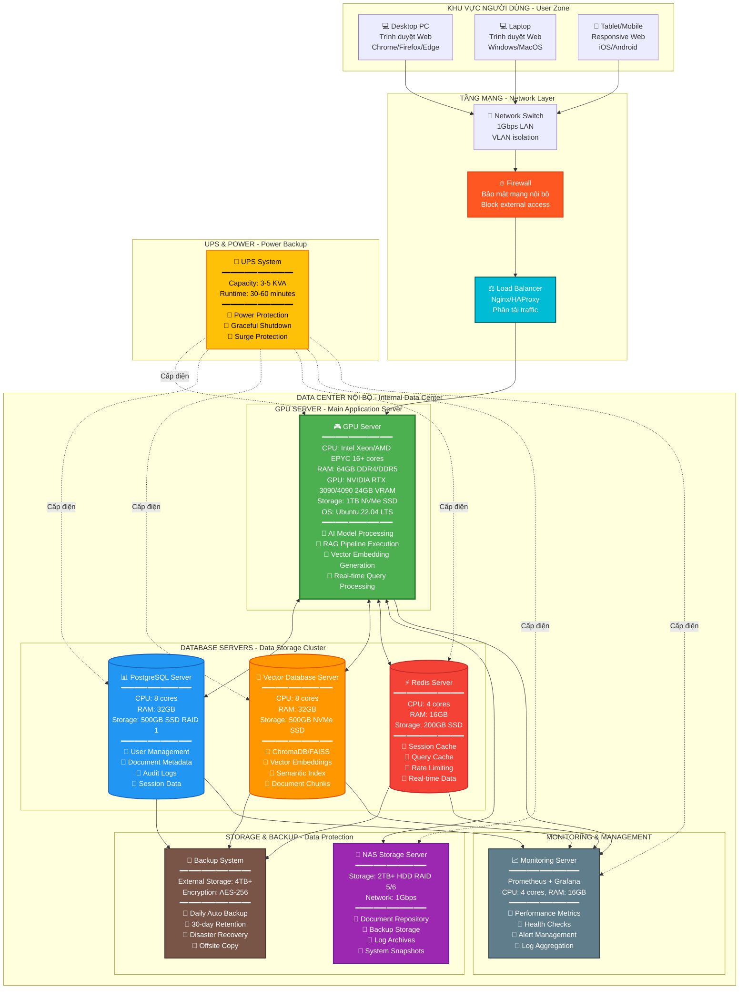
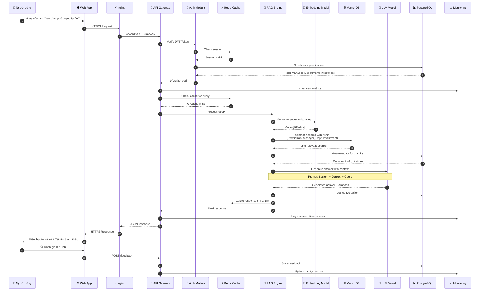

Ngày tạo: 11-September-2025

---
Dựa trên thông tin từ tài liệu dự án và **checklist hiện tại** (Done FR01-FR08, testing từng module và tích hợp), tôi đánh giá sơ đồ khối architecture hiện tại và đưa ra **phiên bản cập nhật** phù hợp với trạng thái thực tế của dự án.

## **🔍 ĐÁNH GIÁ SƠ ĐỒ KHỐI HIỆN TẠI**

Sau khi xem xét tài liệu hiện có, sơ đồ khối cần **cập nhật** những điểm sau:

### **❌ Các phần đã lạc hậu:**
1. **Embedding Model**: Đã chuyển từ multiple models sang **Qwen/Qwen3-Embedding-0.6B** (đã test và chọn)
2. **Implementation Status**: Đã hoàn thành FR01-FR08, đang ở giai đoạn testing integration
3. **Database Schema**: Đã nâng cấp lên enhanced metadata v2 với Vietnamese language support
4. **Technology Stack**: Cập nhật các version mới (PostgreSQL 15, ChromaDB 1.0.0, Redis 7)
5. **Deployment Status**: Đã có Docker Compose production-ready và monitoring stack

---

# **📊 SƠ ĐỒ KHỐI KIẾN TRÚC - PHIÊN BẢN CẬP NHẬT 2025**

## **1. 🏗️ KIẾN TRÚC TỔNG QUAN - CẬP NHẬT**

```mermaid
graph TB
    %% Người dùng theo phân cấp
    subgraph "👥 NGƯỜI DÙNG (4 CẤP ĐỘ)"
        Guest[🌐 Guest User<br/>Truy cập công khai]
        Employee[👤 Employee<br/>Nhân viên nội bộ]
        Manager[👨‍💼 Manager<br/>Trưởng phòng]
        Director[🏢 Director<br/>Giám đốc]
        Admin[⚙️ System Admin<br/>Quản trị hệ thống]
    end
    
    %% Load Balancer
    LB[⚖️ Load Balancer<br/>nginx/HAProxy<br/>🟢 PRODUCTION READY]
    
    %% API Gateway với Authentication
    subgraph "🚪 API GATEWAY LAYER"
        Gateway[🌐 API Gateway<br/>Kong/Nginx]
        Auth[🔐 JWT Authentication<br/>FR-06.1 ✅ COMPLETE]
        RateLimit[📊 Rate Limiting<br/>Per User Level]
        RBAC[🛡️ RBAC Authorization<br/>4-Level Hierarchy]
    end
    
    %% Application Services (ĐÃ HOÀN THÀNH)
    subgraph "💼 APPLICATION SERVICES"
        subgraph "🤖 RAG CORE ENGINE - FR-04 ✅"
            QueryProcessor[🔍 Query Processor<br/>Vietnamese NLP]
            Retriever[📚 Document Retriever<br/>Hybrid Search]
            ContextBuilder[🧩 Context Builder<br/>Permission Aware]
            LLMOrchestrator[🎯 LLM Orchestrator<br/>Multi-Model Support]
        end
        
        subgraph "📊 BUSINESS SERVICES"
            UserMgmt[👤 User Management<br/>FR-02.2 ✅ COMPLETE]
            DocMgmt[📄 Document Management<br/>FR-03.1/3.2/3.3 ✅]
            AnalyticsSvc[📈 Analytics Service<br/>FR-07 ✅ COMPLETE]
            SystemMgmt[⚙️ System Management<br/>FR-08 ✅ COMPLETE]
        end
        
        subgraph "🔧 DATA PROCESSING - FR-03 ✅"
            DataIngestion[📥 Data Ingestion<br/>Multi-format Support]
            EmbeddingGen[🔢 Embedding Generator<br/>Qwen3-0.6B Model]
            QualityCheck[✅ Quality Control<br/>Vietnamese Text Analysis]
            ChunkProcessor[✂️ Semantic Chunking<br/>3-7 Chunks Algorithm]
        end
    end
    
    %% Caching Layer
    subgraph "⚡ CACHE LAYER"
        Redis[🔴 Redis Cluster<br/>Session + Query Cache<br/>Version 7]
        EmbedCache[💾 Embedding Cache<br/>Vector Storage Cache]
    end
    
    %% Storage Layer với enhanced schema
    subgraph "🗄️ ENHANCED STORAGE LAYER"
        subgraph "🔢 Vector Storage"
            ChromaDB[🔢 ChromaDB 1.0.0<br/>Qwen Embeddings 1024-dim]
            VectorIndex[📇 FAISS Index<br/>IndexFlatIP Optimized]
        end
        
        subgraph "🗃️ Relational Storage - FR-02.1 v2 ✅"
            PostgreSQL[(🐘 PostgreSQL 15<br/>Enhanced Schema v2<br/>Vietnamese Language Support)]
            ReadReplica[(📖 Read Replica<br/>Load Balancing)]
            BackupDB[(💾 Automated Backup<br/>Point-in-time Recovery)]
        end
        
        subgraph "📁 File Storage"
            ObjectStore[☁️ MinIO S3-Compatible<br/>Document Storage]
            ProcessedFiles[🗂️ Processed Files<br/>Chunked + Embeddings]
        end
        
        subgraph "🔍 Search Engine"
            FullTextIndex[📝 Full-text Search<br/>PostgreSQL + tsvector]
            ElasticSearch[🔍 Elasticsearch<br/>Advanced Search Optional]
        end
    end
    
    %% External Services
    subgraph "🌐 EXTERNAL SERVICES"
        LLMServices[🧠 LLM Services<br/>OpenAI/Claude/Local Models]
        EmbeddingAPI[📡 Embedding API<br/>Qwen Model Endpoint]
        MonitoringExt[📊 External Monitoring<br/>Grafana Cloud Optional]
    end
    
    %% Infrastructure Layer với monitoring
    subgraph "🗄️ INFRASTRUCTURE & MONITORING"
        subgraph "🐳 Container Platform"
            K8s[☸️ Kubernetes<br/>Production Option]
            Docker[🐋 Docker Compose<br/>✅ CURRENT DEPLOYMENT]
        end
        
        subgraph "📊 Monitoring Stack - FR-08 ✅"
            Prometheus[📊 Prometheus<br/>Metrics Collection]
            Grafana[📈 Grafana<br/>Dashboards + Alerts]
            ELKStack[📋 ELK Stack<br/>Centralized Logging]
        end
        
        subgraph "🔒 Security & Backup"
            Vault[🔐 HashiCorp Vault<br/>Secrets Management]
            BackupSvc[💾 Backup Service<br/>Automated Schedules]
        end
    end
    
    %% Presentation Layer
    subgraph "🖥️ PRESENTATION LAYER - FR-05 ✅"
        WebUI[🌐 Web Interface<br/>Next.js 18.x]
        ChatInterface[💬 Chat Interface<br/>Real-time Messaging]
        AdminDashboard[🔧 Admin Dashboard<br/>System Management]
        Analytics[📊 Analytics Dashboard<br/>Streamlit Dashboard]
    end
    
    %% Connections
    Guest --> LB
    Employee --> LB
    Manager --> LB
    Director --> LB
    Admin --> LB
    
    LB --> Gateway
    Gateway --> Auth
    Auth --> RBAC
    RBAC --> RateLimit
    
    RateLimit --> QueryProcessor
    RateLimit --> UserMgmt
    RateLimit --> DocMgmt
    RateLimit --> AnalyticsSvc
    RateLimit --> SystemMgmt
    
    %% RAG Flow
    QueryProcessor --> Retriever
    Retriever --> ChromaDB
    Retriever --> PostgreSQL
    Retriever --> Redis
    
    Retriever --> ContextBuilder
    ContextBuilder --> LLMOrchestrator
    LLMOrchestrator --> LLMServices
    
    %% Data Processing Flow
    DocMgmt --> DataIngestion
    DataIngestion --> ChunkProcessor
    ChunkProcessor --> QualityCheck
    QualityCheck --> EmbeddingGen
    EmbeddingGen --> ChromaDB
    EmbeddingGen --> PostgreSQL
    
    %% Storage connections
    UserMgmt --> PostgreSQL
    DocMgmt --> ObjectStore
    AnalyticsSvc --> PostgreSQL
    SystemMgmt --> PostgreSQL
    
    PostgreSQL --> ReadReplica
    PostgreSQL --> BackupDB
    ChromaDB --> VectorIndex
    
    %% Cache connections
    QueryProcessor -.-> Redis
    Retriever -.-> EmbedCache
    Auth -.-> Redis
    
    %% Monitoring connections
    Prometheus -.-> QueryProcessor
    Prometheus -.-> PostgreSQL
    Prometheus -.-> ChromaDB
    Grafana --> Prometheus
    ELKStack -.-> Gateway
    
    %% External connections
    EmbeddingGen --> EmbeddingAPI
    LLMOrchestrator --> LLMServices
    
    %% UI connections
    WebUI --> Gateway
    ChatInterface --> Gateway
    AdminDashboard --> Gateway
    Analytics --> Gateway
    
    %% Styling
    classDef completed fill:#e8f5e8,stroke:#388e3c,stroke-width:3px
    classDef inProgress fill:#fff3e0,stroke:#f57c00,stroke-width:2px
    classDef userLayer fill:#e3f2fd,stroke:#1976d2,stroke-width:2px
    classDef gatewayLayer fill:#f3e5f5,stroke:#7b1fa2,stroke-width:2px
    classDef storageLayer fill:#fce4ec,stroke:#c2185b,stroke-width:2px
    classDef externalLayer fill:#f1f8e9,stroke:#689f38,stroke-width:2px
    classDef infraLayer fill:#e0f2f1,stroke:#00796b,stroke-width:2px
    classDef presentationLayer fill:#ffebee,stroke:#c62828,stroke-width:2px
    
    class QueryProcessor,Retriever,ContextBuilder,LLMOrchestrator,UserMgmt,DocMgmt,AnalyticsSvc,SystemMgmt,DataIngestion,EmbeddingGen,QualityCheck,ChunkProcessor,Auth,RBAC completed
    class Gateway,RateLimit,WebUI,ChatInterface,AdminDashboard,Analytics inProgress
    class Guest,Employee,Manager,Director,Admin userLayer
    class Gateway,Auth,RateLimit,RBAC gatewayLayer
    class ChromaDB,VectorIndex,PostgreSQL,ReadReplica,BackupDB,ObjectStore,ProcessedFiles,FullTextIndex storageLayer
    class LLMServices,EmbeddingAPI,MonitoringExt externalLayer
    class K8s,Docker,Prometheus,Grafana,ELKStack,Vault,BackupSvc infraLayer
    class WebUI,ChatInterface,AdminDashboard,Analytics presentationLayer
```



---

## **2. 🎯 TRẠNG THÁI IMPLEMENTATION HIỆN TẠI**

### **✅ ĐÃ HOÀN THÀNH (FR01-FR08)**
1. **FR-01.2**: Enhanced Database System với PostgreSQL 15 + ChromaDB 1.0.0
2. **FR-02.1**: Dual Database Architecture với Vietnamese optimization  
3. **FR-02.2**: Unified Management API
4. **FR-03.1**: Document Processing Tool (Production Ready)
5. **FR-03.2**: Quality Control Service
6. **FR-03.3**: Database Integration Service
7. **FR-04.1**: RAG Core Engine với Hybrid Search
8. **FR-05.1**: Chat Interface
9. **FR-06.1**: Authentication & Authorization (JWT + RBAC)
10. **FR-07**: Analytics & Reporting với Streamlit Dashboard
11. **FR-08**: System Management & Monitoring

### **🔄 ĐANG TESTING & INTEGRATION**
- Integration testing giữa các modules
- Performance optimization
- End-to-end workflow validation
- Security penetration testing

---

## **3. 🛠️ CÔNG NGHỆ ĐÃ CẬP NHẬT**

### **🔢 Embedding & AI Models**
- **Embedding Model**: `Qwen/Qwen3-Embedding-0.6B` (đã test và chọn)
- **Dimension**: 1024 dimensions
- **Performance**: MRR = 0.7812, Hit_Rate@1 = 68.75%
- **Vietnamese Processing**: `pyvi>=0.1.1` + `underthesea`

### **🗄️ Database & Storage**
- **PostgreSQL**: Version 15 với enhanced Vietnamese schema v2
- **ChromaDB**: Version 1.0.0 với Qwen embeddings
- **Redis**: Version 7 cluster mode
- **Backup**: Automated point-in-time recovery

### **🐳 Deployment & Infrastructure**
- **Container**: Docker Compose production-ready
- **Monitoring**: Prometheus + Grafana stack hoàn chỉnh
- **Security**: JWT authentication + 4-level RBAC
- **Logging**: ELK stack với structured logging

---

## **4. 🔄 DATA FLOW CẬP NHẬT**

### **📝 Query Processing Flow:**
```
User Question (4 levels) → JWT Auth + RBAC → 
Query Processor (Vietnamese NLP) → 
Hybrid Retriever (Vector + Full-text) → 
Permission Filter → Context Builder → 
LLM Orchestrator → Response với Citations
```

### **📄 Document Processing Flow:**
```
Upload Document → FR-03.1 Processing Tool → 
Quality Control (FR-03.2) → Semantic Chunking (3-7 chunks) → 
Qwen Embedding Generation → ChromaDB + PostgreSQL (FR-03.3) → 
Full-text Indexing
```

### **📊 Analytics Flow:**
```
User Activities → Search Analytics → User Activity Summary → 
Document Usage Stats → FR-07 Analytics → 
Grafana Dashboard + Streamlit Reports
```

---

## **5. 🎯 ĐIỂM KHÁC BIỆT CHÍNH VỚI PHIÊN BẢN CŨ**

1. **✅ Embedding Model**: Đã chọn Qwen thay vì multiple options
2. **✅ Implementation Status**: 100% complete modules thay vì chỉ thiết kế
3. **✅ Database Schema**: Enhanced v2 với Vietnamese optimization
4. **✅ Monitoring**: Production-ready Prometheus + Grafana thay vì conceptual
5. **✅ Authentication**: Complete JWT + 4-level RBAC implementation
6. **✅ Document Processing**: Breakthrough trong semantic chunking algorithm
7. **✅ Deployment**: Docker Compose production-ready thay vì Kubernetes concept

Sơ đồ khối này phản ánh **trạng thái thực tế** của dự án sau khi hoàn thành FR01-FR08, sẵn sàng cho giai đoạn testing tích hợp và deployment production.

---

## 🖥️ **SƠ ĐỒ 1: KIẾN TRÚC PHẦN CỨNG (HARDWARE ARCHITECTURE)**



---

## 💻 **SƠ ĐỒ 2: KIẾN TRÚC PHẦN MỀM (SOFTWARE ARCHITECTURE)**

```mermaid
graph TB
    subgraph "CLIENT TIER - Lớp Giao diện Người dùng"
        WEB[🌐 Web Application<br/>━━━━━━━━━━━━━━━━<br/>Framework: React 18 + TypeScript<br/>State: Redux Toolkit<br/>UI Library: Material-UI<br/>━━━━━━━━━━━━━━━━<br/>📱 Responsive Design<br/>🌍 Multi-language EN/VI<br/>♿ Accessibility WCAG 2.1<br/>🎨 Modern Chat Interface]
    end
    
    subgraph "PRESENTATION TIER - Lớp Trình diễn"
        NGINX[⚡ Nginx Web Server<br/>━━━━━━━━━━━━━━━━<br/>Version: 1.24+<br/>━━━━━━━━━━━━━━━━<br/>🔹 Reverse Proxy<br/>🔹 SSL/TLS Termination<br/>🔹 Static File Serving<br/>🔹 Load Balancing<br/>🔹 Rate Limiting<br/>🔹 Gzip Compression]
    end
    
    subgraph "API GATEWAY TIER - Lớp Cổng API"
        API[🚪 API Gateway<br/>━━━━━━━━━━━━━━━━<br/>Framework: FastAPI 0.104+<br/>Python: 3.10.11<br/>━━━━━━━━━━━━━━━━<br/>🔐 JWT Authentication<br/>🔑 API Key Management<br/>🛡️ Rate Limiting<br/>📊 Request Logging<br/>⚠️ Error Handling<br/>📝 API Documentation]
        
        AUTH[🔐 Authentication Module<br/>FR-06<br/>━━━━━━━━━━━━━━━━<br/>🔹 User Login/Logout<br/>🔹 JWT Token Generation<br/>🔹 Session Management<br/>🔹 RBAC Authorization<br/>🔹 Password Hashing bcrypt<br/>🔹 2FA Support ready]
    end
    
    subgraph "BUSINESS LOGIC TIER - Lớp Xử lý Nghiệp vụ"
        subgraph "FR-04: RAG CORE ENGINE - Động cơ RAG"
            RETRIEVAL[🔍 Retrieval Router<br/>FR-04.1<br/>━━━━━━━━━━━━━━━━<br/>🔹 Semantic Search<br/>🔹 Keyword Search<br/>🔹 Hybrid Search<br/>🔹 Permission Filter<br/>🔹 Re-ranking<br/>🔹 Query Optimization]
            
            SYNTHESIS[🧩 Synthesis Engine<br/>FR-04.2<br/>━━━━━━━━━━━━━━━━<br/>🔹 Context Building<br/>🔹 Prompt Engineering<br/>🔹 Citation Extraction<br/>🔹 Relevance Scoring<br/>🔹 Document Chunking<br/>🔹 Token Management]
            
            GENERATION[✨ Generation Engine<br/>FR-04.3<br/>━━━━━━━━━━━━━━━━<br/>🔹 LLM Integration<br/>🔹 Response Generation<br/>🔹 Answer Formatting<br/>🔹 Quality Assessment<br/>🔹 Hallucination Check<br/>🔹 Source Attribution]
            
            ENDPOINT[🔌 API Endpoints<br/>FR-04.4<br/>━━━━━━━━━━━━━━━━<br/>🔹 Query Processing<br/>🔹 Multi-turn Dialog<br/>🔹 Export Functions<br/>🔹 Feedback Collection<br/>🔹 Caching Strategy<br/>🔹 Error Recovery]
        end
        
        subgraph "FR-03: CONTEXT MANAGEMENT - Quản lý Ngữ cảnh"
            CONTEXT[📚 Context Manager<br/>FR-03.3<br/>━━━━━━━━━━━━━━━━<br/>🔹 Session Context<br/>🔹 Conversation History<br/>🔹 User Preferences<br/>🔹 Context Window Mgmt<br/>🔹 Memory Optimization]
            
            INGEST[📥 Data Ingestion<br/>FR-03.3<br/>━━━━━━━━━━━━━━━━<br/>🔹 Document Upload<br/>🔹 PDF/Word/Excel Parser<br/>🔹 Vietnamese NLP pyvi<br/>🔹 Text Normalization<br/>🔹 Chunk Generation<br/>🔹 Metadata Extraction]
        end
        
        subgraph "FR-07: ANALYTICS & REPORTING"
            ANALYTICS[📊 Analytics Module<br/>FR-07<br/>━━━━━━━━━━━━━━━━<br/>🔹 Usage Statistics<br/>🔹 Query Analytics<br/>🔹 Performance Metrics<br/>🔹 User Behavior<br/>🔹 Document Insights<br/>🔹 Business Reports]
        end
        
        subgraph "FR-08: ADMIN & MAINTENANCE"
            ADMIN[🛠️ Admin Tools<br/>FR-08<br/>━━━━━━━━━━━━━━━━<br/>🔹 User Management<br/>🔹 Document CRUD<br/>🔹 System Config<br/>🔹 Backup/Restore<br/>🔹 Health Monitoring<br/>🔹 Log Management]
        end
    end
    
    subgraph "AI/ML TIER - Lớp Trí tuệ Nhân tạo"
        EMBED[🤖 Embedding Model<br/>━━━━━━━━━━━━━━━━<br/>Model: Qwen3-Embedding-0.6B<br/>Library: sentence-transformers<br/>━━━━━━━━━━━━━━━━<br/>🔹 Text → Vector (768-dim)<br/>🔹 Batch Processing<br/>🔹 GPU Acceleration<br/>🔹 Vietnamese Optimized<br/>🔹 Inference: <500ms]
        
        LLM[🧠 Large Language Model<br/>━━━━━━━━━━━━━━━━<br/>Model: [Local LLM]<br/>Framework: Transformers/vLLM<br/>━━━━━━━━━━━━━━━━<br/>🔹 Text Generation<br/>🔹 Context Understanding<br/>🔹 Vietnamese Support<br/>🔹 Response Streaming<br/>🔹 Temperature Control<br/>🔹 Max Tokens: 4096]
        
        NLP[📝 Vietnamese NLP<br/>━━━━━━━━━━━━━━━━<br/>Libraries: underthesea, pyvi<br/>━━━━━━━━━━━━━━━━<br/>🔹 Tokenization<br/>🔹 POS Tagging<br/>🔹 NER extraction<br/>🔹 Stopwords Removal<br/>🔹 Tone Normalization]
    end
    
    subgraph "DATA TIER - Lớp Dữ liệu"
        POSTGRES[(🗄️ PostgreSQL 13+<br/>━━━━━━━━━━━━━━━━<br/>ORM: SQLAlchemy async<br/>Connection Pool: 20-50<br/>━━━━━━━━━━━━━━━━<br/>📊 users table<br/>📊 documents_metadata<br/>📊 conversations<br/>📊 audit_logs<br/>📊 access_control_matrix<br/>📊 sessions<br/>📊 analytics_events)]
        
        CHROMA[(🧠 ChromaDB/FAISS<br/>━━━━━━━━━━━━━━━━<br/>Vector Dimension: 768<br/>Distance: Cosine Similarity<br/>━━━━━━━━━━━━━━━━<br/>🔹 document_embeddings<br/>🔹 query_embeddings<br/>🔹 semantic_index<br/>🔹 metadata_filter<br/>Index: HNSW/IVF)]
        
        REDIS[(⚡ Redis 6+<br/>━━━━━━━━━━━━━━━━<br/>Mode: Standalone/Sentinel<br/>Persistence: RDB + AOF<br/>━━━━━━━━━━━━━━━━<br/>🔹 session:* hashes<br/>🔹 cache:query:*<br/>🔹 cache:embeddings:*<br/>🔹 ratelimit:* counters<br/>🔹 user:token:* sets<br/>TTL: 1h-24h)]
    end
    
    subgraph "INFRASTRUCTURE TIER - Lớp Hạ tầng"
        DOCKER[🐳 Docker Containers<br/>━━━━━━━━━━━━━━━━<br/>Orchestration: Docker Compose<br/>━━━━━━━━━━━━━━━━<br/>📦 frontend-service<br/>📦 backend-api<br/>📦 rag-engine<br/>📦 postgres<br/>📦 chromadb<br/>📦 redis<br/>📦 nginx<br/>📦 prometheus<br/>📦 grafana]
        
        MONITOR[📈 Monitoring Stack<br/>━━━━━━━━━━━━━━━━<br/>Prometheus + Grafana<br/>AlertManager<br/>━━━━━━━━━━━━━━━━<br/>📊 System Metrics<br/>📊 Application Metrics<br/>📊 Business Metrics<br/>📊 Custom Alerts<br/>📊 Dashboards]
        
        LOGS[📋 Logging System<br/>━━━━━━━━━━━━━━━━<br/>Python: structlog<br/>Format: JSON<br/>━━━━━━━━━━━━━━━━<br/>🔹 Application Logs<br/>🔹 Access Logs<br/>🔹 Error Logs<br/>🔹 Audit Logs<br/>Retention: 30-90 days]
    end
    
    %% Connections - User Flow
    WEB -->|HTTPS/WSS| NGINX
    NGINX -->|HTTP| API
    API --> AUTH
    AUTH --> ENDPOINT
    
    %% RAG Pipeline Flow
    ENDPOINT --> RETRIEVAL
    RETRIEVAL --> SYNTHESIS
    SYNTHESIS --> GENERATION
    GENERATION --> ENDPOINT
    
    %% Context Management
    ENDPOINT <--> CONTEXT
    CONTEXT --> INGEST
    
    %% Analytics & Admin
    ENDPOINT --> ANALYTICS
    API --> ADMIN
    
    %% AI/ML Integration
    RETRIEVAL <--> EMBED
    SYNTHESIS <--> EMBED
    GENERATION <--> LLM
    INGEST --> NLP
    NLP --> EMBED
    
    %% Data Layer Access
    AUTH <--> POSTGRES
    CONTEXT <--> POSTGRES
    RETRIEVAL <--> CHROMA
    RETRIEVAL <--> POSTGRES
    INGEST <--> POSTGRES
    INGEST <--> CHROMA
    ANALYTICS <--> POSTGRES
    ADMIN <--> POSTGRES
    ADMIN <--> CHROMA
    
    %% Caching Layer
    API <--> REDIS
    AUTH <--> REDIS
    RETRIEVAL <--> REDIS
    CONTEXT <--> REDIS
    
    %% Infrastructure
    API -.logs.-> LOGS
    ENDPOINT -.logs.-> LOGS
    RETRIEVAL -.logs.-> LOGS
    
    API -.metrics.-> MONITOR
    POSTGRES -.metrics.-> MONITOR
    CHROMA -.metrics.-> MONITOR
    REDIS -.metrics.-> MONITOR
    
    DOCKER -.orchestrates.-> API
    DOCKER -.orchestrates.-> POSTGRES
    DOCKER -.orchestrates.-> CHROMA
    DOCKER -.orchestrates.-> REDIS
    
    %% Styling
    style WEB fill:#4CAF50,color:#fff,stroke:#2E7D32,stroke-width:3px
    style API fill:#2196F3,color:#fff,stroke:#1565C0,stroke-width:2px
    style AUTH fill:#FF9800,color:#fff,stroke:#E65100,stroke-width:2px
    
    style RETRIEVAL fill:#9C27B0,color:#fff,stroke:#6A1B9A,stroke-width:2px
    style SYNTHESIS fill:#9C27B0,color:#fff,stroke:#6A1B9A,stroke-width:2px
    style GENERATION fill:#9C27B0,color:#fff,stroke:#6A1B9A,stroke-width:2px
    style ENDPOINT fill:#9C27B0,color:#fff,stroke:#6A1B9A,stroke-width:2px
    
    style EMBED fill:#FF5722,color:#fff,stroke:#D84315,stroke-width:2px
    style LLM fill:#FF5722,color:#fff,stroke:#D84315,stroke-width:2px
    style NLP fill:#FF5722,color:#fff,stroke:#D84315,stroke-width:2px
    
    style POSTGRES fill:#00BCD4,color:#fff,stroke:#006064,stroke-width:2px
    style CHROMA fill:#FFC107,color:#000,stroke:#F57F17,stroke-width:2px
    style REDIS fill:#F44336,color:#fff,stroke:#C62828,stroke-width:2px
    
    style MONITOR fill:#607D8B,color:#fff,stroke:#37474F,stroke-width:2px
    style DOCKER fill:#00ACC1,color:#fff,stroke:#00838F,stroke-width:2px
```

---

## 📊 **BẢNG SO SÁNH & THÔNG SỐ KỸ THUẬT**

### **Phần Cứng - Hardware Specifications**

| Thành phần | Cấu hình | Mục đích | Chi phí ước tính |
|------------|----------|----------|------------------|
| **GPU Server** | Xeon 16-core, 64GB RAM, RTX 4090 24GB, 1TB NVMe | Xử lý AI, RAG Engine | 150-200 triệu VNĐ |
| **Database Servers** | 3 servers x (8-core, 32GB, 500GB SSD RAID) | PostgreSQL, ChromaDB, Redis | 90-120 triệu VNĐ |
| **NAS Storage** | 2TB RAID 5/6, 1Gbps | Backup, Document storage | 30-50 triệu VNĐ |
| **Network Equipment** | Firewall, Load Balancer, Switch | Bảo mật, phân tải | 40-60 triệu VNĐ |
| **UPS System** | 3-5 KVA, 30-60min runtime | Dự phòng điện | 20-30 triệu VNĐ |
| **Monitoring Server** | 4-core, 16GB, 200GB SSD | Prometheus, Grafana | 15-20 triệu VNĐ |

### **Phần Mềm - Software Stack**

| Layer | Technology | Version | License | Purpose |
|-------|-----------|---------|---------|---------|
| **Frontend** | React + TypeScript | 18.x | MIT | User Interface |
| **Web Server** | Nginx | 1.24+ | BSD | Reverse Proxy |
| **Backend API** | FastAPI | 0.104+ | MIT | REST API |
| **Language** | Python | 3.10.11 | PSF | Programming |
| **AI Embedding** | Qwen3-Embedding-0.6B | Latest | Apache 2.0 | Vector Generation |
| **LLM** | [Local Model] | - | [Check] | Text Generation |
| **NLP Vietnamese** | underthesea, pyvi | Latest | MIT | Text Processing |
| **Database** | PostgreSQL | 13+ | PostgreSQL | Relational DB |
| **Vector DB** | ChromaDB/FAISS | Latest | Apache 2.0 | Vector Storage |
| **Cache** | Redis | 6+ | BSD | Caching |
| **Container** | Docker + Compose | Latest | Apache 2.0 | Orchestration |
| **Monitoring** | Prometheus + Grafana | Latest | Apache 2.0 | Observability |

---

## 🔄 **LUỒNG XỬ LÝ HOÀN CHỈNH (END-TO-END FLOW)**



---

## 💡 **CHÚ THÍCH QUAN TRỌNG**

### **Phần Cứng:**
- ✅ **Có thể mở rộng:** Thêm GPU/RAM khi số người dùng tăng
- ✅ **High Availability:** Setup Master-Slave cho databases
- ✅ **Disaster Recovery:** NAS + External backup
- ✅ **Network Security:** Firewall + VLAN isolation

### **Phần Mềm:**
- ✅ **Microservices:** Dễ bảo trì và scale từng module
- ✅ **Async Processing:** Tối ưu hiệu năng với Python async/await
- ✅ **Caching Strategy:** 3-tier cache (Redis, In-memory, CDN)
- ✅ **Observability:** Metrics, Logs, Traces đầy đủ

### **Bảo mật:**
- 🔒 **Zero Trust:** Xác thực mọi request
- 🔒 **Data Encryption:** At-rest và in-transit
- 🔒 **RBAC:** 5-tier permission matrix
- 🔒 **Audit Trail:** Log đầy đủ mọi thao tác

---

Bạn có cần tôi:
1. ✏️ Chỉnh sửa/đơn giản hóa sơ đồ?
2. 📊 Thêm sơ đồ deployment flow?
3. 🔄 Vẽ sơ đồ data flow chi tiết hơn?
4. 📐 Xuất sang định dạng khác (PNG, SVG)?
