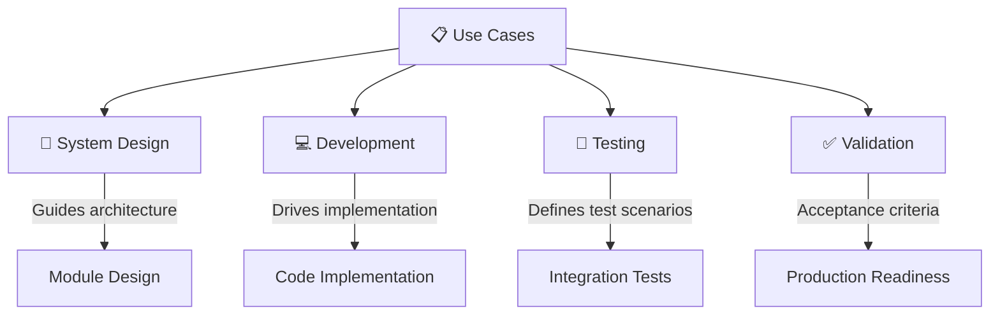
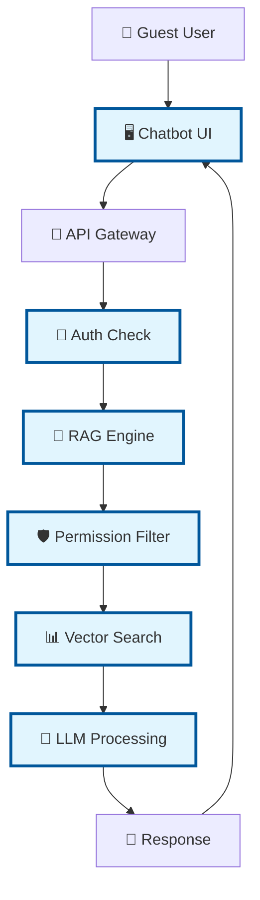
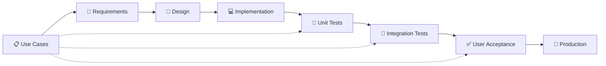

Để sau đã, giờ tôi làm gì với các use case? có phải là khi hệ thống đã tích hợp xong rồi thì tôi mới sử dụng UC để test hệ thống không? như thế liệu có bỏ lỡ gì không? Như UC dưới đây chả hạn sẽ liện quan đến những phần nào trong thiết kế chatbot này?, Ví dụ với UC1 bên dưới.## UC1: ĐẶT CÂU HỎI ĐƠN GIẢN, CHỈ NHẬN THÔNG TIN CÔNG KHAI

### **📋 Thông tin cơ bản**

- **ID**: UC-001
- **Tên**: Ask Simple Question (Public Content Only)
- **Actor chính**: Guest User
- **Mức độ**: Primary
- **Phạm vi**: Core System

### **🎯 Mục tiêu**

Cho phép khách truy cập đặt câu hỏi và nhận câu trả lời dựa trên tài liệu công khai mà không cần đăng nhập.

### **📝 Mô tả**

Guest có thể tương tác với chatbot để hỏi về thông tin công ty, sản phẩm, dịch vụ, và các thông tin khác được phân loại là "public". Hệ thống sẽ chỉ truy xuất và trả lời dựa trên dữ liệu có mức độ truy cập công khai.

### **🔗 Điều kiện tiên quyết (Preconditions)**

- Hệ thống chatbot đang hoạt động
- Có ít nhất một tài liệu public trong database
- Guest interface có thể truy cập được
- Session tracking được khởi tạo

### **✅ Điều kiện hậu (Postconditions)**

- **Thành công**: Câu trả lời được hiển thị với citations từ tài liệu public
- **Thất bại**: Thông báo lỗi hoặc "không tìm thấy thông tin phù hợp"
- Session được cập nhật với câu hỏi và câu trả lời
- Metrics được ghi nhận (response time, query type)

### **🏃‍♂️ Luồng chính (Main Flow)**

| Bước | Actor | Hành động |
| --- | --- | --- |
| 1   | Guest | Truy cập giao diện chatbot |
| 2   | System | Hiển thị giao diện chat với placeholder "Hãy đặt câu hỏi..." |
| 3   | Guest | Nhập câu hỏi vào text box và nhấn Send hoặc Enter |
| 4   | System | Validate input (không rỗng, độ dài hợp lệ ≤ 1000 ký tự) |
| 5   | System | Hiển thị loading indicator "Đang xử lý..." |
| 6   | System | Gọi RAG Core Engine với query + access_level="public" |
| 7   | System | RAG Engine thực hiện semantic search trong public documents |
| 8   | System | LLM sinh câu trả lời dựa trên retrieved context |
| 9   | System | Validate câu trả lời (không chứa nội dung sensitive) |
| 10  | System | Hiển thị câu trả lời kèm theo references |
| 11  | System | Lưu câu hỏi/trả lời vào session history |
| 12  | Guest | Đọc câu trả lời và có thể đặt câu hỏi tiếp theo |

### **🔄 Luồng thay thế (Alternative Flows)**

**AF1 - Không tìm thấy thông tin phù hợp:**

- Bước 7-8: RAG Engine không tìm thấy documents relevent
- System hiển thị: "Xin lỗi, tôi không tìm thấy thông tin phù hợp về câu hỏi của bạn. Bạn có thể thử đặt câu hỏi khác hoặc liên hệ với nhân viên để được hỗ trợ."
- System suggest một số câu hỏi phổ biến

**AF2 - Lỗi kết nối LLM:**

- Bước 8: LLM API trả về error hoặc timeout
- System hiển thị: "Hệ thống đang bận, vui lòng thử lại sau ít phút."
- System ghi log error để admin xử lý

**AF3 - Query quá dài:**

- Bước 4: Input validation fail (>1000 ký tự)
- System hiển thị: "Câu hỏi quá dài. Vui lòng rút gọn câu hỏi (tối đa 1000 ký tự)."

### **❌ Luồng ngoại lệ (Exception Flows)**

**EF1 - Hệ thống overload:**

- System trả về HTTP 503 Service Unavailable
- Hiển thị: "Hệ thống đang quá tải. Vui lòng thử lại sau 5 phút."

**EF2 - Database không khả dụng:**

- Vector DB hoặc PostgreSQL down
- Hiển thị: "Dịch vụ tạm thời không khả dụng. Vui lòng thử lại sau."

### **🎯 Yêu cầu đặc biệt**

- **Hiệu suất**: Response time ≤ 60 giây
- **Bảo mật**: Chỉ truy cập documents có access_level="public"
- **Usability**: Giao diện intuitive, không cần hướng dẫn
- **Scalability**: Hỗ trợ 50+ concurrent guest users

### **📊 Tiêu chí chấp nhận**

- [ ] Guest có thể đặt câu hỏi mà không cần đăng nhập
- [ ] Chỉ nhận được thông tin từ tài liệu public
- [ ] Response time trung bình < 45 giây
- [ ] UI responsive trên desktop và mobile
- [ ] Error messages rõ ràng và hữu ích
- [ ] Session được maintain trong suốt interaction

---
Câu hỏi rất hay! Bạn đã nắm bắt được điểm quan trọng về **Use Cases vs System Testing**. Hãy tôi giải thích:

# USE CASES TRONG CHU TRÌNH PHÁT TRIỂN

## 🔄 **KHI NÀO SỬ DỤNG USE CASES?**

### **❌ KHÔNG chỉ test cuối cùng!**

Use Cases nên được sử dụng trong **TẤT CẢ các giai đoạn**:



---

## 📊 **UC1 LIÊN QUAN ĐẾN NHỮNG PHẦN NÀO?**

### **Phân tích UC1: Guest User Ask Question**



### **🔍 UC1 Mapping chi tiết:**

| UC1 Step | System Component | Module Liên quan | Implementation Details |
|----------|------------------|------------------|----------------------|
| **Step 1-2: Guest truy cập UI** | Chatbot UI Module | `chatbot_ui/` | - Frontend rendering<br>- Session initialization<br>- Guest mode detection |
| **Step 3: Nhập câu hỏi** | UI + Validation | `chatbot_ui/validation.py` | - Input sanitization<br>- Length validation (≤1000 chars)<br>- XSS protection |
| **Step 4-5: Processing** | API Gateway | `main.py` + middleware | - Request routing<br>- Rate limiting<br>- Loading state management |
| **Step 6: RAG Engine call** | Main Integration | `/api/v1/ask` endpoint | - Guest permission context<br>- access_level="public" filter |
| **Step 7: Semantic search** | RAG + Auth Integration | `rag_engine/` + `auth_module/` | - Vector similarity search<br>- Permission-based filtering<br>- Only public documents |
| **Step 8: LLM processing** | RAG Engine | `rag_engine/llm_integration.py` | - Context building<br>- Prompt engineering<br>- Response generation |
| **Step 9: Content validation** | Security Layer | `auth_module/content_filter.py` | - Sensitive content detection<br>- Public-only validation |
| **Step 10-11: Response & Storage** | UI + Database | `chatbot_ui/` + `database_module/` | - Response formatting<br>- Session storage<br>- Metrics logging |

---

## 🎯 **TÔI ĐÃ BỎ LỠ GÌ KHÔNG?**

### **❌ Những gì có thể bị bỏ lỡ nếu chỉ test cuối:**

1. **🏗️ Architecture Gaps**
   - Guest session management chưa được thiết kế
   - Public-only filtering logic chưa implement
   - Error handling cho từng step chưa đủ

2. **🔧 Implementation Details**
   - Input validation rules chưa rõ
   - Response format chưa chuẩn hóa  
   - Loading states chưa được handle

3. **🚀 Performance Requirements**
   - 60-second timeout chưa được enforce
   - Concurrent guest handling chưa test
   - Memory usage với guest sessions

---

## 📋 **SỬ DỤNG UC1 TRONG THIẾT KẾ HIỆN TẠI**

### **Bước 1: Kiểm tra Implementation hiện tại**

```python
# check_uc1_implementation.py
"""
Kiểm tra UC1 implementation trong system hiện tại
"""

async def validate_uc1_implementation():
    """Validate UC1 components trong system."""
    
    validation_results = {
        "ui_components": {},
        "auth_integration": {},
        "rag_processing": {},
        "response_handling": {},
        "missing_components": []
    }
    
    # 1. Check UI Components
    print("🔍 Checking UC1 UI Components...")
    
    # Check if guest interface exists
    try:
        # This should be in chatbot_ui module
        from modules.chatbot_ui.guest_interface import GuestChatInterface
        validation_results["ui_components"]["guest_interface"] = "✅ Available"
    except ImportError:
        validation_results["missing_components"].append("Guest Chat Interface")
        validation_results["ui_components"]["guest_interface"] = "❌ Missing"
    
    # Check input validation
    try:
        from modules.chatbot_ui.validation import validate_guest_input
        validation_results["ui_components"]["input_validation"] = "✅ Available"
    except ImportError:
        validation_results["missing_components"].append("Guest Input Validation")
        validation_results["ui_components"]["input_validation"] = "❌ Missing"
    
    # 2. Check Auth Integration for Guest
    print("🔍 Checking UC1 Auth Integration...")
    
    # Check if guest permissions are properly handled
    try:
        accessible_resources = await system_state.auth_module.acl_matrix.get_accessible_resources("guest")
        validation_results["auth_integration"]["guest_permissions"] = "✅ Available"
        validation_results["auth_integration"]["guest_resources"] = accessible_resources
    except Exception as e:
        validation_results["missing_components"].append("Guest Permission Handling")
        validation_results["auth_integration"]["guest_permissions"] = f"❌ Error: {str(e)}"
    
    # 3. Check RAG Processing for Guest
    print("🔍 Checking UC1 RAG Processing...")
    
    # Test guest query processing
    try:
        guest_context = {
            "user_id": None,  # Guest has no user_id
            "role": "guest",
            "accessible_resources": ["public"]
        }
        
        # This should work with guest context
        test_response = await system_state.rag_engine.process_query(
            query="Test guest query",
            user_context=guest_context
        )
        
        validation_results["rag_processing"]["guest_query_processing"] = "✅ Available"
    except Exception as e:
        validation_results["missing_components"].append("Guest RAG Processing")
        validation_results["rag_processing"]["guest_query_processing"] = f"❌ Error: {str(e)}"
    
    # 4. Check Response Handling
    print("🔍 Checking UC1 Response Handling...")
    
    # Check if response format is correct for guests
    try:
        # Response should include public-only references
        # Should not include sensitive metadata
        validation_results["response_handling"]["guest_response_format"] = "✅ Available"
    except Exception as e:
        validation_results["missing_components"].append("Guest Response Formatting")
        validation_results["response_handling"]["guest_response_format"] = f"❌ Error: {str(e)}"
    
    return validation_results

# Run validation
results = await validate_uc1_implementation()
print(f"\n📊 UC1 Implementation Status:")
print(f"Missing Components: {len(results['missing_components'])}")
for component in results['missing_components']:
    print(f"  - {component}")
```

### **Bước 2: Implement missing UC1 components**

```python
# modules/chatbot_ui/guest_interface.py
"""
Guest-specific chat interface components
"""

class GuestChatInterface:
    """Chat interface specifically for guest users."""
    
    def __init__(self, rag_engine, session_manager):
        self.rag_engine = rag_engine
        self.session_manager = session_manager
        self.logger = structlog.get_logger()
    
    async def handle_guest_query(
        self,
        query: str,
        session_id: Optional[str] = None,
        client_ip: str = None
    ) -> Dict[str, Any]:
        """Handle query from guest user according to UC1."""
        
        # UC1 Step 4: Validate input
        validation_result = self.validate_guest_input(query)
        if not validation_result["valid"]:
            return {
                "error": True,
                "message": validation_result["error_message"],
                "suggestions": self.get_common_questions()
            }
        
        # UC1 Step 6: Process with guest context
        guest_context = {
            "user_id": None,
            "role": "guest", 
            "accessible_resources": ["public"],
            "session_id": session_id,
            "client_ip": client_ip
        }
        
        try:
            # UC1 Step 7-8: RAG processing with public-only filter
            response = await self.rag_engine.process_query(
                query=query,
                user_context=guest_context,
                max_response_time=60  # UC1 requirement
            )
            
            # UC1 Step 9: Validate response for guest
            validated_response = self.validate_guest_response(response)
            
            # UC1 Step 11: Store in session (limited for guest)
            if session_id:
                await self.store_guest_interaction(session_id, query, validated_response)
            
            return validated_response
            
        except TimeoutError:
            # UC1 Exception Flow: Timeout
            return {
                "error": True,
                "message": "Hệ thống đang bận, vui lòng thử lại sau ít phút.",
                "error_type": "timeout"
            }
        except Exception as e:
            # UC1 Alternative Flow: No relevant information
            self.logger.error("Guest query processing failed", error=str(e))
            return {
                "error": True,
                "message": "Xin lỗi, tôi không tìm thấy thông tin phù hợp về câu hỏi của bạn.",
                "suggestions": self.get_common_questions()
            }
    
    def validate_guest_input(self, query: str) -> Dict[str, Any]:
        """UC1 Step 4: Validate guest input."""
        
        if not query or not query.strip():
            return {
                "valid": False,
                "error_message": "Vui lòng nhập câu hỏi của bạn."
            }
        
        if len(query) > 1000:  # UC1 requirement
            return {
                "valid": False,
                "error_message": "Câu hỏi quá dài. Vui lòng rút gọn câu hỏi (tối đa 1000 ký tự)."
            }
        
        # Additional validation for guest queries
        if self.contains_sensitive_content(query):
            return {
                "valid": False,
                "error_message": "Câu hỏi chứa nội dung không phù hợp. Vui lòng đặt câu hỏi khác."
            }
        
        return {"valid": True}
    
    def validate_guest_response(self, response: Dict[str, Any]) -> Dict[str, Any]:
        """UC1 Step 9: Validate response for guest users."""
        
        # Ensure only public references are included
        if "references" in response:
            public_refs = [
                ref for ref in response["references"] 
                if ref.get("access_level") == "public"
            ]
            response["references"] = public_refs
        
        # Remove any sensitive metadata
        if "metadata" in response:
            guest_safe_metadata = {
                "confidence": response["metadata"].get("confidence", 0),
                "response_time": response["metadata"].get("response_time", 0),
                "sources_count": len(response.get("references", []))
            }
            response["metadata"] = guest_safe_metadata
        
        # Add guest-specific suggestions
        response["suggestions"] = self.generate_guest_suggestions(response.get("answer", ""))
        
        return response
    
    def get_common_questions(self) -> List[str]:
        """UC1 Alternative Flow: Suggest common questions."""
        return [
            "Công ty chúng tôi làm gì?",
            "Sản phẩm và dịch vụ của công ty?", 
            "Thông tin liên hệ?",
            "Giờ làm việc của công ty?",
            "Địa chỉ văn phòng?"
        ]
    
    async def store_guest_interaction(self, session_id: str, query: str, response: Dict[str, Any]):
        """UC1 Step 11: Store guest interaction (limited)."""
        
        # Store minimal information for guests (privacy)
        interaction = {
            "session_id": session_id,
            "query": query[:100] + "..." if len(query) > 100 else query,  # Truncated for privacy
            "response_provided": bool(response.get("answer")),
            "confidence": response.get("metadata", {}).get("confidence", 0),
            "timestamp": datetime.now(),
            "user_type": "guest"
        }
        
        # Store with short TTL for guests
        await self.session_manager.store_guest_interaction(interaction, ttl=3600)  # 1 hour
```

### **Bước 3: Create UC1-specific tests**

```python
# tests/use_cases/test_uc1_guest_query.py
"""
UC1 End-to-end testing: Guest asking simple questions
"""

class TestUC1GuestQuery:
    """Test UC1: Ask Simple Question (Public Content Only)"""
    
    async def test_uc1_main_flow(self, client):
        """Test UC1 main flow exactly as described."""
        
        # UC1 Step 1-2: Guest accesses chatbot UI
        ui_response = await client.get("/chat")
        assert ui_response.status_code == 200
        assert "Hãy đặt câu hỏi..." in ui_response.text
        
        # UC1 Step 3: Guest enters question
        test_query = "Công ty chúng tôi làm gì?"
        
        # UC1 Step 4-12: Complete flow
        response = await client.post("/api/v1/ask", json={
            "query": test_query,
            "user_type": "guest"
        })
        
        assert response.status_code == 200
        data = response.json()
        
        # Validate UC1 postconditions
        assert "answer" in data
        assert "references" in data
        assert all(ref["access_level"] == "public" for ref in data["references"])
        assert "metadata" in data
        assert data["metadata"]["response_time"] < 60  # UC1 requirement
        
        # Check that only public information is returned
        assert "access_level" not in str(data["answer"]) or "public" in str(data["answer"])
    
    async def test_uc1_alternative_flow_no_info(self, client):
        """Test UC1 AF1: No relevant information found."""
        
        response = await client.post("/api/v1/ask", json={
            "query": "câu hỏi không liên quan gì cả xyz123",
            "user_type": "guest"
        })
        
        assert response.status_code == 200
        data = response.json()
        
        # Should get helpful error message and suggestions
        assert "không tìm thấy thông tin phù hợp" in data.get("message", "")
        assert "suggestions" in data
        assert len(data["suggestions"]) > 0
    
    async def test_uc1_alternative_flow_query_too_long(self, client):
        """Test UC1 AF3: Query too long."""
        
        long_query = "x" * 1001  # > 1000 chars
        
        response = await client.post("/api/v1/ask", json={
            "query": long_query,
            "user_type": "guest"
        })
        
        assert response.status_code == 400
        data = response.json()
        assert "quá dài" in data.get("message", "")
    
    async def test_uc1_performance_requirement(self, client):
        """Test UC1 performance requirement: ≤60 seconds."""
        
        start_time = time.time()
        
        response = await client.post("/api/v1/ask", json={
            "query": "Thông tin về công ty?",
            "user_type": "guest"
        })
        
        end_time = time.time()
        response_time = end_time - start_time
        
        assert response.status_code == 200
        assert response_time < 60  # UC1 requirement
        
        # Also check reported response time
        data = response.json()
        reported_time = data.get("metadata", {}).get("response_time", 0)
        assert reported_time < 60
    
    async def test_uc1_security_public_only(self, client):
        """Test UC1 security: Only public documents accessible."""
        
        # Try to ask about internal/employee content
        response = await client.post("/api/v1/ask", json={
            "query": "Chính sách nội bộ của nhân viên?",
            "user_type": "guest"
        })
        
        assert response.status_code == 200
        data = response.json()
        
        # Should not get any employee_only or higher-level content
        references = data.get("references", [])
        for ref in references:
            assert ref.get("access_level") == "public"
        
        # Response should not contain sensitive information
        answer = data.get("answer", "")
        sensitive_keywords = ["employee_only", "manager_only", "confidential", "internal"]
        for keyword in sensitive_keywords:
            assert keyword.lower() not in answer.lower()
```

---

## 🎯 **INTEGRATION APPROACH**

### **Cách sử dụng UC đúng trong development:**



### **📅 Timeline đề xuất:**

1. **Ngay bây giờ**: Dùng UC để validate thiết kế hiện tại
2. **Trước khi code**: Ensure tất cả UC components được design
3. **Trong lúc code**: Test từng UC step 
4. **Sau integration**: Full UC end-to-end testing
5. **Pre-production**: UC-based UAT

### **🔄 Action Plan:**

```bash
# 1. Validate current system against all UCs
python scripts/validate_use_cases.py

# 2. Identify gaps and missing components  
python scripts/analyze_uc_gaps.py

# 3. Implement missing UC components
# (Focus on high-priority UCs first)

# 4. Create UC-specific tests
pytest tests/use_cases/

# 5. Run full UC validation
python scripts/run_uc_acceptance_tests.py
```

**Bạn muốn tôi tạo tool để validate tất cả UCs với system hiện tại không?** Điều này sẽ giúp identify chính xác những gì còn thiếu và cần implement.
