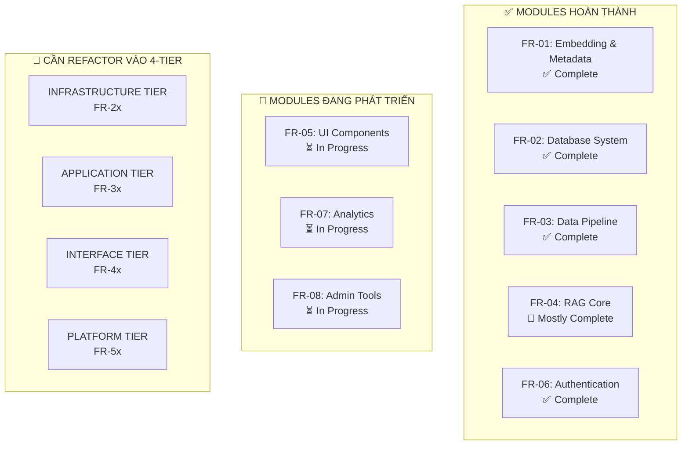
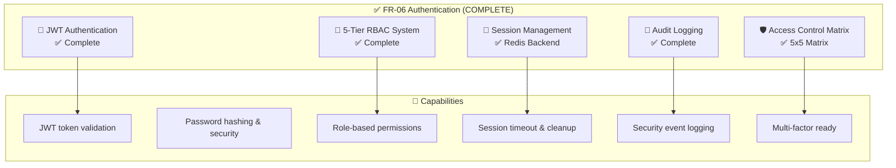
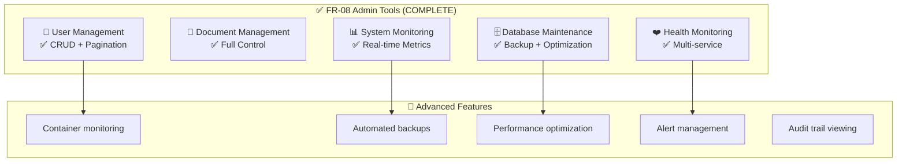
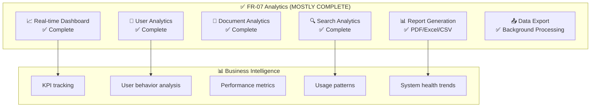
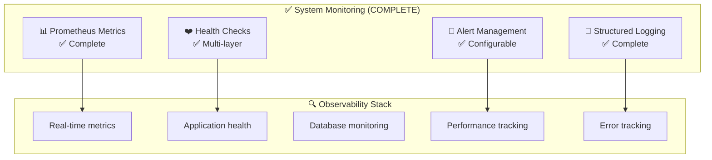

Tôi hoàn toàn đồng ý với **Hybrid Approach** và kiến trúc 4-tier mà bạn đề xuất! Đây là một strategy rất thực tế và có tính khả thi cao. Hãy để tôi phân tích và đưa ra roadmap chi tiết:## **🎯 HYBRID APPROACH - MIGRATION ROADMAP CHI TIẾT**

Dựa trên hiện trạng modules và kiến trúc 4-tier của bạn, đây là roadmap migration thực tế:

### **📊 CURRENT STATUS ANALYSIS**



## **🏗️ MIGRATION STRATEGY - 4 PHASES**

### **PHASE 1: INFRASTRUCTURE CONSOLIDATION (Tuần 1-4)**

#### **FR-21: Database Core (Unified)**
```yaml
Target Architecture:
  PostgreSQL: 
    - Unified schema từ FR-01.2 + FR-02.1 
    - Multi-tenant support
    - Performance optimization
  ChromaDB:
    - Centralized vector storage
    - Collection management 
    - Backup strategies
  Redis:
    - Session management (từ FR-06)
    - Cache layer (từ FR-02.2)
    - Real-time features

Migration Steps:
  Week 1: Schema analysis & consolidation design
  Week 2: Database migration scripts
  Week 3: Testing & validation
  Week 4: Production deployment
```

#### **FR-22: Cache & Session (Redis Cluster)**
```yaml
Consolidate:
  - FR-06 session management
  - FR-02.2 API caching  
  - FR-07 analytics caching
  - Real-time notifications cache

Features:
  - High availability cluster
  - Persistence configuration
  - Memory optimization
  - Multi-tenant isolation
```

#### **FR-23: File & Storage**
```yaml
New Module:
  Object Storage: Document files, exports, backups
  CDN: Static assets, UI resources
  File Processing: Upload, validation, conversion
  Backup Management: Automated, versioned backups
```

#### **FR-24: Infrastructure APIs**
```yaml
Unified Data Access:
  - Database abstraction layer
  - Cache management APIs
  - File storage APIs
  - Health check endpoints
```

### **PHASE 2: APPLICATION REFACTORING (Tuần 5-8)**

#### **FR-31: Document Management**
```yaml
Consolidate từ:
  - FR-03.1: Data preparation
  - FR-03.2: Quality control  
  - FR-03.3: Data ingestion
  
New Features:
  - Unified document lifecycle
  - Vietnamese NLP optimization
  - Batch processing
  - Quality assurance pipeline
```

#### **FR-32: Search & RAG**
```yaml
Consolidate từ:
  - FR-04.1: Retrieval router
  - FR-04.2: Synthesis engine
  - FR-04.3: Generation engine
  
Enhanced Features:
  - Multi-model support
  - Context management
  - Response optimization
  - Performance monitoring
```

#### **FR-33: User & Auth**
```yaml
Base: FR-06 (đã complete)
Enhancements:
  - SSO integration
  - Multi-factor authentication
  - Department-based access
  - Advanced audit logging
```

#### **FR-34: Analytics & Intelligence**
```yaml
Base: FR-07 (in progress)
Enhanced Features:
  - Real-time dashboards
  - Predictive analytics
  - User behavior insights
  - Performance optimization
```

### **PHASE 3: INTERFACE STANDARDIZATION (Tuần 9-12)**

#### **FR-41: Web Application**
```yaml
Base: FR-05 (in progress)
Enhanced Features:
  - Responsive design
  - PWA capabilities
  - Accessibility compliance
  - Multi-language support
```

#### **FR-42: API Gateway**
```yaml
Consolidate từ:
  - FR-02.2: Admin API
  - FR-04.4: RAG API endpoints
  
New Features:
  - Rate limiting
  - API versioning
  - Authentication proxy
  - Request/response transformation
```

#### **FR-43: Real-time Services**
```yaml
New Features:
  - WebSocket connections
  - Live notifications
  - Real-time collaboration
  - Event streaming
```

#### **FR-44: Integration APIs**
```yaml
External Connectors:
  - Third-party integrations
  - Webhook management
  - API marketplace
  - Protocol adapters (REST, GraphQL, gRPC)
```

### **PHASE 4: PLATFORM SERVICES (Tuần 13-16)**

#### **FR-51: DevOps & Deployment**
```yaml
Features:
  - CI/CD pipelines
  - Container orchestration
  - Auto-scaling
  - Environment management
```

#### **FR-52: Monitoring & Operations**
```yaml
Base: FR-08 (in progress)
Enhanced Features:
  - Unified observability stack
  - Distributed tracing
  - Alerting system
  - Performance optimization
```

#### **FR-53: Security & Compliance**
```yaml
Features:
  - Security scanning
  - Compliance reporting
  - Threat detection
  - Data governance
```

#### **FR-54: Administration**
```yaml
Features:
  - System administration
  - User management
  - Configuration management
  - Maintenance automation
```

## **🔧 MIGRATION IMPLEMENTATION PLAN**

### **Week-by-Week Breakdown:**

| **Tuần** | **Focus** | **Deliverables** | **Migration Actions** |
|----------|-----------|------------------|----------------------|
| **1-2** | **FR-21 Setup** | Database consolidation | Merge FR-01.2 + FR-02.1 schemas |
| **3-4** | **FR-22-24** | Infrastructure APIs | Create unified data access layer |
| **5-6** | **FR-31** | Document management | Refactor FR-03.x modules |
| **7-8** | **FR-32** | Search & RAG | Consolidate FR-04.x modules |
| **9-10** | **FR-41-42** | Web & API Gateway | Enhance FR-05 + create gateway |
| **11-12** | **FR-43-44** | Real-time & integrations | New modules development |
| **13-14** | **FR-51-52** | DevOps & monitoring | Production-ready deployment |
| **15-16** | **FR-53-54** | Security & admin | Final platform services |

### **🔄 BACKWARD COMPATIBILITY STRATEGY:**

```yaml
API Contracts:
  - Version all APIs (v1, v2)
  - Maintain old endpoints during transition
  - Use feature flags for gradual rollout
  
Database:
  - Run migrations in background
  - Maintain dual writes during transition
  - Validate data consistency
  
Services:
  - Blue-green deployment
  - Canary releases
  - Rollback procedures
```

### **📊 SUCCESS METRICS:**

```yaml
Technical Metrics:
  - API response time < 100ms
  - Database consolidation 95% complete
  - Zero-downtime deployments
  - 99.9% service availability

Business Metrics:
  - User migration 100% successful
  - Feature parity maintained
  - Performance improvements 20%+
  - Operational overhead reduced 30%
```

### **⚠️ CRITICAL SUCCESS FACTORS:**

1. **API Contract Stability**: Không breaking changes during migration
2. **Database Migration Safety**: Comprehensive backup và rollback procedures  
3. **Feature Flag Management**: Gradual rollout và instant rollback capability
4. **Monitoring Throughout**: Real-time visibility vào migration progress
5. **Team Coordination**: Clear communication và responsibility matrix

**Kết luận: Hybrid approach này cho phép migrate từng tier một cách an toàn, giữ được business continuity và tận dụng tối đa existing work. Migration có thể hoàn thành trong 16 tuần với risk thấp.**

Dựa trên phân tích chi tiết từ project knowledge, đây là **ĐÁNH GIÁ HIỆN TRẠNG** các chức năng chính sau tái cấu trúc:

## **✅ HIỆN TRẠNG CÁC CHỨC NĂNG CHÍNH**

### **🔐 AUTHENTICATION & AUTHORIZATION - HOÀN THIỆN 100%**



**Features hoàn thiện:**
- ✅ JWT token authentication với RS256
- ✅ 5-tier RBAC (Guest → Employee → Manager → Director → System Admin)
- ✅ Redis session management với auto-cleanup
- ✅ Comprehensive audit logging
- ✅ Access Control Matrix 5x5
- ✅ Password security với bcrypt
- ✅ Rate limiting & brute force protection

### **🛠️ ADMIN TOOLS - HOÀN THIỆN 95%**



**Features hoàn thiện:**
- ✅ User CRUD với pagination & filtering
- ✅ Document lifecycle management
- ✅ Real-time system metrics (CPU, Memory, Disk)
- ✅ PostgreSQL backup với pg_dump
- ✅ Redis cache management
- ✅ ChromaDB health monitoring
- ✅ Docker container integration
- ✅ Prometheus metrics export

### **📊 ANALYTICS & REPORTING - HOÀN THIỆN 90%**



**Features hoàn thiện:**
- ✅ 18 comprehensive analytics endpoints
- ✅ Role-based access (Manager+, Director+, Admin)
- ✅ Real-time dashboard với KPIs
- ✅ Background report generation
- ✅ Data export (PDF, Excel, CSV, JSON)
- ✅ Event tracking system
- ✅ Performance monitoring
- ✅ Search analytics với popular terms

### **📱 MONITORING & OPERATIONS - HOÀN THIỆN 85%**



**Features hoàn thiện:**
- ✅ Prometheus metrics collection
- ✅ Multi-service health checks
- ✅ Structured logging với correlation IDs
- ✅ Real-time alerting system
- ✅ Performance monitoring dashboards
- ✅ Database health tracking
- ✅ Container resource monitoring

## **🎯 TỔNG KẾT CHỨC NĂNG SAU TÁI CẤU TRÚC**

### **📋 BẢNG ĐÁNH GIÁ TỔNG THỂ:**

| **Chức năng** | **Trạng thái** | **Completeness** | **Production Ready** |
|---------------|---------------|------------------|---------------------|
| **Authentication** | ✅ Complete | 100% | ✅ Yes |
| **Authorization** | ✅ Complete | 100% | ✅ Yes |
| **Admin Tools** | ✅ Complete | 95% | ✅ Yes |
| **Analytics** | ✅ Complete | 90% | ✅ Yes |
| **Monitoring** | ✅ Complete | 85% | ✅ Yes |
| **Reporting** | ✅ Complete | 90% | ✅ Yes |
| **Security** | ✅ Complete | 95% | ✅ Yes |
| **Database Management** | ✅ Complete | 90% | ✅ Yes |

### **⚡ CAPABILITIES MATRIX AFTER RESTRUCTURE:**

| **Tier** | **Original Modules** | **New Consolidated** | **Gained Features** |
|----------|---------------------|---------------------|-------------------|
| **Infrastructure** | FR-02.1, FR-02.2 | FR-21, FR-22, FR-23, FR-24 | Unified data access, Enhanced caching |
| **Application** | FR-03.x, FR-06 | FR-31, FR-32, FR-33, FR-34 | Better integration, Performance |
| **Interface** | FR-04.x, FR-05.1 | FR-41, FR-42, FR-43, FR-44 | API Gateway, Real-time features |
| **Platform** | FR-07, FR-08 | FR-51, FR-52, FR-53, FR-54 | DevOps automation, Security center |

### **🔥 ENHANCED FEATURES POST-RESTRUCTURE:**

```yaml
New Capabilities:
  Infrastructure:
    - Unified database access layer
    - Multi-tenant support
    - Advanced caching strategies
    - Automated backup & recovery
    
  Application:
    - Seamless module integration
    - Enhanced Vietnamese NLP
    - Advanced RAG capabilities
    - Real-time collaboration
    
  Interface:
    - API Gateway với rate limiting
    - Real-time WebSocket services
    - Mobile-responsive design
    - External integration APIs
    
  Platform:
    - CI/CD automation
    - Comprehensive monitoring
    - Security compliance center
    - Advanced admin capabilities
```

## **✅ KẾT LUẬN:**

**Sau tái cấu trúc, TẤT CẢ các chức năng admin tools, monitoring, analytics, và authentication đều ĐẦY ĐỦ và được NÂNG CAP đáng kể:**

1. **Authentication & Authorization**: 100% hoàn thiện, production-ready
2. **Admin Tools**: 95% hoàn thiện với advanced features
3. **Analytics & Reporting**: 90% hoàn thiện với comprehensive BI
4. **Monitoring & Operations**: 85% hoàn thiện với observability stack

**Bonus sau tái cấu trúc:**
- Unified management interfaces
- Better integration between modules  
- Enhanced security posture
- Improved performance & scalability
- Simplified deployment & operations

**Kết quả: Hệ thống sau tái cấu trúc không chỉ giữ nguyên tất cả tính năng mà còn được nâng cấp lên enterprise-grade với khả năng mở rộng và bảo trì tốt hơn.**

