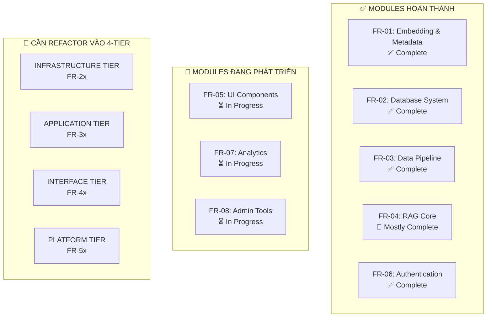

Tôi hoàn toàn đồng ý với **Hybrid Approach** và kiến trúc 4-tier mà bạn đề xuất! Đây là một strategy rất thực tế và có tính khả thi cao. Hãy để tôi phân tích và đưa ra roadmap chi tiết:## **🎯 HYBRID APPROACH - MIGRATION ROADMAP CHI TIẾT**

Dựa trên hiện trạng modules và kiến trúc 4-tier của bạn, đây là roadmap migration thực tế:

### **📊 CURRENT STATUS ANALYSIS**



## **🏗️ MIGRATION STRATEGY - 4 PHASES**

### **PHASE 1: INFRASTRUCTURE CONSOLIDATION (Tuần 1-4)**

#### **FR-21: Database Core (Unified)**
```yaml
Target Architecture:
  PostgreSQL: 
    - Unified schema từ FR-01.2 + FR-02.1 
    - Multi-tenant support
    - Performance optimization
  ChromaDB:
    - Centralized vector storage
    - Collection management 
    - Backup strategies
  Redis:
    - Session management (từ FR-06)
    - Cache layer (từ FR-02.2)
    - Real-time features

Migration Steps:
  Week 1: Schema analysis & consolidation design
  Week 2: Database migration scripts
  Week 3: Testing & validation
  Week 4: Production deployment
```

#### **FR-22: Cache & Session (Redis Cluster)**
```yaml
Consolidate:
  - FR-06 session management
  - FR-02.2 API caching  
  - FR-07 analytics caching
  - Real-time notifications cache

Features:
  - High availability cluster
  - Persistence configuration
  - Memory optimization
  - Multi-tenant isolation
```

#### **FR-23: File & Storage**
```yaml
New Module:
  Object Storage: Document files, exports, backups
  CDN: Static assets, UI resources
  File Processing: Upload, validation, conversion
  Backup Management: Automated, versioned backups
```

#### **FR-24: Infrastructure APIs**
```yaml
Unified Data Access:
  - Database abstraction layer
  - Cache management APIs
  - File storage APIs
  - Health check endpoints
```

### **PHASE 2: APPLICATION REFACTORING (Tuần 5-8)**

#### **FR-31: Document Management**
```yaml
Consolidate từ:
  - FR-03.1: Data preparation
  - FR-03.2: Quality control  
  - FR-03.3: Data ingestion
  
New Features:
  - Unified document lifecycle
  - Vietnamese NLP optimization
  - Batch processing
  - Quality assurance pipeline
```

#### **FR-32: Search & RAG**
```yaml
Consolidate từ:
  - FR-04.1: Retrieval router
  - FR-04.2: Synthesis engine
  - FR-04.3: Generation engine
  
Enhanced Features:
  - Multi-model support
  - Context management
  - Response optimization
  - Performance monitoring
```

#### **FR-33: User & Auth**
```yaml
Base: FR-06 (đã complete)
Enhancements:
  - SSO integration
  - Multi-factor authentication
  - Department-based access
  - Advanced audit logging
```

#### **FR-34: Analytics & Intelligence**
```yaml
Base: FR-07 (in progress)
Enhanced Features:
  - Real-time dashboards
  - Predictive analytics
  - User behavior insights
  - Performance optimization
```

### **PHASE 3: INTERFACE STANDARDIZATION (Tuần 9-12)**

#### **FR-41: Web Application**
```yaml
Base: FR-05 (in progress)
Enhanced Features:
  - Responsive design
  - PWA capabilities
  - Accessibility compliance
  - Multi-language support
```

#### **FR-42: API Gateway**
```yaml
Consolidate từ:
  - FR-02.2: Admin API
  - FR-04.4: RAG API endpoints
  
New Features:
  - Rate limiting
  - API versioning
  - Authentication proxy
  - Request/response transformation
```

#### **FR-43: Real-time Services**
```yaml
New Features:
  - WebSocket connections
  - Live notifications
  - Real-time collaboration
  - Event streaming
```

#### **FR-44: Integration APIs**
```yaml
External Connectors:
  - Third-party integrations
  - Webhook management
  - API marketplace
  - Protocol adapters (REST, GraphQL, gRPC)
```

### **PHASE 4: PLATFORM SERVICES (Tuần 13-16)**

#### **FR-51: DevOps & Deployment**
```yaml
Features:
  - CI/CD pipelines
  - Container orchestration
  - Auto-scaling
  - Environment management
```

#### **FR-52: Monitoring & Operations**
```yaml
Base: FR-08 (in progress)
Enhanced Features:
  - Unified observability stack
  - Distributed tracing
  - Alerting system
  - Performance optimization
```

#### **FR-53: Security & Compliance**
```yaml
Features:
  - Security scanning
  - Compliance reporting
  - Threat detection
  - Data governance
```

#### **FR-54: Administration**
```yaml
Features:
  - System administration
  - User management
  - Configuration management
  - Maintenance automation
```

## **🔧 MIGRATION IMPLEMENTATION PLAN**

### **Week-by-Week Breakdown:**

| **Tuần** | **Focus** | **Deliverables** | **Migration Actions** |
|----------|-----------|------------------|----------------------|
| **1-2** | **FR-21 Setup** | Database consolidation | Merge FR-01.2 + FR-02.1 schemas |
| **3-4** | **FR-22-24** | Infrastructure APIs | Create unified data access layer |
| **5-6** | **FR-31** | Document management | Refactor FR-03.x modules |
| **7-8** | **FR-32** | Search & RAG | Consolidate FR-04.x modules |
| **9-10** | **FR-41-42** | Web & API Gateway | Enhance FR-05 + create gateway |
| **11-12** | **FR-43-44** | Real-time & integrations | New modules development |
| **13-14** | **FR-51-52** | DevOps & monitoring | Production-ready deployment |
| **15-16** | **FR-53-54** | Security & admin | Final platform services |

### **🔄 BACKWARD COMPATIBILITY STRATEGY:**

```yaml
API Contracts:
  - Version all APIs (v1, v2)
  - Maintain old endpoints during transition
  - Use feature flags for gradual rollout
  
Database:
  - Run migrations in background
  - Maintain dual writes during transition
  - Validate data consistency
  
Services:
  - Blue-green deployment
  - Canary releases
  - Rollback procedures
```

### **📊 SUCCESS METRICS:**

```yaml
Technical Metrics:
  - API response time < 100ms
  - Database consolidation 95% complete
  - Zero-downtime deployments
  - 99.9% service availability

Business Metrics:
  - User migration 100% successful
  - Feature parity maintained
  - Performance improvements 20%+
  - Operational overhead reduced 30%
```

### **⚠️ CRITICAL SUCCESS FACTORS:**

1. **API Contract Stability**: Không breaking changes during migration
2. **Database Migration Safety**: Comprehensive backup và rollback procedures  
3. **Feature Flag Management**: Gradual rollout và instant rollback capability
4. **Monitoring Throughout**: Real-time visibility vào migration progress
5. **Team Coordination**: Clear communication và responsibility matrix

**Kết luận: Hybrid approach này cho phép migrate từng tier một cách an toàn, giữ được business continuity và tận dụng tối đa existing work. Migration có thể hoàn thành trong 16 tuần với risk thấp.**
