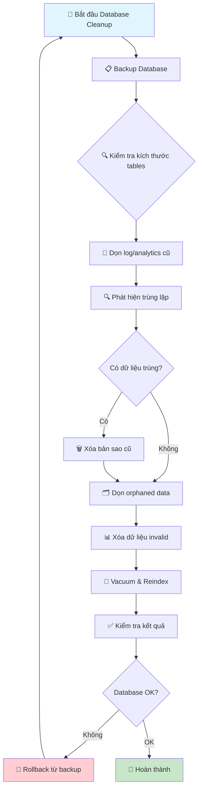

Tôi sẽ kiểm tra thông tin về database schema và dự án để đưa ra hướng dẫn làm sạch SQL phù hợp.Dựa trên cấu trúc database schema của dự án, tôi sẽ đưa ra **hướng dẫn làm sạch SQL database** theo thứ tự từ an toàn đến phức tạp:

## 🗃️ **CHIẾN LƯỢC LÀM SẠCH DATABASE THEO THỨ TỰ ƯU TIÊN**

### **📋 Bước 1: Kiểm tra và Backup trước khi làm sạch**

```sql
-- 1. Kiểm tra kích thước các bảng chính
SELECT 
    schemaname,
    tablename,
    pg_size_pretty(pg_total_relation_size(tablename::text)) as size,
    pg_total_relation_size(tablename::text) as size_bytes
FROM pg_tables 
WHERE schemaname = 'public' 
ORDER BY size_bytes DESC;

-- 2. Backup database hoặc các bảng quan trọng
pg_dump -h localhost -U kb_admin -d knowledge_base_v2 > backup_before_cleanup_$(date +%Y%m%d).sql
```

### **🧹 Bước 2: Làm sạch dữ liệu Log và Analytics (AN TOÀN)**

```sql
-- Dọn dẹp search_analytics cũ (giữ lại 30 ngày gần nhất)
DELETE FROM search_analytics 
WHERE timestamp < NOW() - INTERVAL '30 days';

-- Dọn dẹp document_access_log cũ (giữ lại 60 ngày)
DELETE FROM document_access_log 
WHERE accessed_at < NOW() - INTERVAL '60 days';

-- Dọn dẹp report_generation cũ (giữ lại 90 ngày)
DELETE FROM report_generation 
WHERE generated_at < NOW() - INTERVAL '90 days';
```

### **🔍 Bước 3: Phát hiện và xóa dữ liệu trùng lặp**

```sql
-- 3.1 Tìm documents trùng lặp theo file_hash
WITH duplicate_docs AS (
    SELECT file_hash, COUNT(*) as count
    FROM documents_metadata_v2 
    WHERE file_hash IS NOT NULL
    GROUP BY file_hash 
    HAVING COUNT(*) > 1
)
SELECT d.document_id, d.title, d.file_hash, d.created_at
FROM documents_metadata_v2 d
INNER JOIN duplicate_docs dd ON d.file_hash = dd.file_hash
ORDER BY d.file_hash, d.created_at DESC;

-- 3.2 Xóa bản sao cũ hơn (giữ lại bản mới nhất)
WITH duplicate_docs AS (
    SELECT document_id,
           ROW_NUMBER() OVER (PARTITION BY file_hash ORDER BY created_at DESC) as rn
    FROM documents_metadata_v2 
    WHERE file_hash IS NOT NULL
)
DELETE FROM documents_metadata_v2 
WHERE document_id IN (
    SELECT document_id FROM duplicate_docs WHERE rn > 1
);
```

### **🗂️ Bước 4: Dọn dẹp orphaned data (dữ liệu mồ côi)**

```sql
-- 4.1 Xóa chunks không có document tương ứng
DELETE FROM document_chunks_v2 
WHERE document_id NOT IN (
    SELECT document_id FROM documents_metadata_v2
);

-- 4.2 Xóa embeddings không có chunks tương ứng  
DELETE FROM document_embeddings_v2 
WHERE chunk_id NOT IN (
    SELECT chunk_id FROM document_chunks_v2
);

-- 4.3 Xóa tag relations không có document
DELETE FROM document_tag_relations 
WHERE document_id NOT IN (
    SELECT document_id FROM documents_metadata_v2
);

-- 4.4 Xóa user sessions của users không tồn tại
DELETE FROM user_sessions 
WHERE user_id NOT IN (
    SELECT user_id FROM users
);
```

### **📊 Bước 5: Làm sạch dữ liệu không hợp lệ**

```sql
-- 5.1 Xóa documents có title rỗng hoặc invalid
DELETE FROM documents_metadata_v2 
WHERE title IS NULL 
   OR TRIM(title) = '' 
   OR LENGTH(title) < 3;

-- 5.2 Xóa users không active trong 365 ngày và không có dữ liệu quan trọng
DELETE FROM users 
WHERE status = 'INACTIVE' 
  AND updated_at < NOW() - INTERVAL '365 days'
  AND user_id NOT IN (
      SELECT DISTINCT created_by FROM documents_metadata_v2 WHERE created_by IS NOT NULL
  );

-- 5.3 Reset các counter không chính xác
UPDATE documents_metadata_v2 
SET chunk_count = (
    SELECT COUNT(*) 
    FROM document_chunks_v2 
    WHERE document_chunks_v2.document_id = documents_metadata_v2.document_id
);
```

### **🔧 Bước 6: Tối ưu hóa và reindex**

```sql
-- 6.1 Vacuum và analyze để thu hồi không gian
VACUUM ANALYZE documents_metadata_v2;
VACUUM ANALYZE document_chunks_v2;
VACUUM ANALYZE document_embeddings_v2;
VACUUM ANALYZE search_analytics;
VACUUM ANALYZE document_access_log;

-- 6.2 Reindex các index quan trọng
REINDEX INDEX idx_documents_title_gin;
REINDEX INDEX idx_chunks_document_id;
REINDEX INDEX idx_embeddings_chunk_id;
```

## 📈 **SƠ ĐỒ QUY TRÌNH LÀM SẠCH DATABASE**



## 🎯 **SCRIPT PYTHON ĐỂ TỰ ĐỘNG HÓA**

```python
# cleanup_database.py
import psycopg2
import logging
from datetime import datetime
import argparse

def cleanup_database(connection_params, dry_run=True):
    """
    Làm sạch database theo quy trình đã định
    """
    conn = psycopg2.connect(**connection_params)
    cursor = conn.cursor()
    
    cleanup_queries = [
        {
            'name': 'Dọn search_analytics cũ',
            'query': "DELETE FROM search_analytics WHERE timestamp < NOW() - INTERVAL '30 days'"
        },
        {
            'name': 'Dọn document_access_log cũ', 
            'query': "DELETE FROM document_access_log WHERE accessed_at < NOW() - INTERVAL '60 days'"
        },
        {
            'name': 'Xóa orphaned chunks',
            'query': """DELETE FROM document_chunks_v2 
                        WHERE document_id NOT IN (SELECT document_id FROM documents_metadata_v2)"""
        },
        {
            'name': 'Xóa orphaned embeddings',
            'query': """DELETE FROM document_embeddings_v2 
                        WHERE chunk_id NOT IN (SELECT chunk_id FROM document_chunks_v2)"""
        }
    ]
    
    for cleanup in cleanup_queries:
        try:
            if dry_run:
                # Chỉ đếm số rows sẽ bị xóa
                count_query = cleanup['query'].replace('DELETE', 'SELECT COUNT(*)')
                cursor.execute(count_query)
                count = cursor.fetchone()[0]
                print(f"✓ {cleanup['name']}: {count} rows sẽ bị xóa")
            else:
                cursor.execute(cleanup['query'])
                affected_rows = cursor.rowcount
                print(f"✓ {cleanup['name']}: Đã xóa {affected_rows} rows")
                
        except Exception as e:
            print(f"❌ Lỗi khi {cleanup['name']}: {e}")
    
    if not dry_run:
        conn.commit()
        print("🔧 Đang vacuum database...")
        cursor.execute("VACUUM ANALYZE;")
        
    cursor.close()
    conn.close()

if __name__ == "__main__":
    connection_params = {
        'host': 'localhost',
        'port': 5432,
        'database': 'knowledge_base_v2',
        'user': 'kb_admin', 
        'password': '1234567890'
    }
    
    # Chạy dry-run trước
    print("🔍 Dry run - kiểm tra dữ liệu sẽ bị xóa:")
    cleanup_database(connection_params, dry_run=True)
    
    # Xác nhận trước khi thực thi
    confirm = input("\n⚠️  Bạn có muốn thực hiện cleanup? (yes/no): ")
    if confirm.lower() == 'yes':
        cleanup_database(connection_params, dry_run=False)
        print("✅ Database cleanup hoàn thành!")
```

## ⚠️ **LƯU Ý QUAN TRỌNG**

1. **Luôn backup trước khi cleanup**
2. **Chạy dry-run để kiểm tra trước** 
3. **Làm sạch theo thứ tự từ an toàn đến rủi ro cao**
4. **Kiểm tra foreign key constraints trước khi xóa**
5. **Monitor hiệu suất database sau khi cleanup**

Bạn nên bắt đầu với **Bước 1-2** (backup và dọn logs) trước, sau đó mới tiến hành các bước phức tạp hơn. Có cần tôi hướng dẫn chi tiết cho bước nào cụ thể không?
