# USE CASE DIAGRAM - HỆ THỐNG TRỢ LÝ TRI THỨC NỘI BỘ

```mermaid
graph TB
    %% Actors
    Guest[👤 Guest User]
    Employee[👤 Employee]
    Manager[👤 Manager]
    Director[👤 Director]
    Admin[👤 System Admin]
    
    %% System boundary
    subgraph "Hệ thống Trợ lý Tri thức Nội bộ"
        %% Core Use Cases
        UC1[Ask Question<br/>Đặt câu hỏi]
        UC2[View Public Documents<br/>Xem tài liệu công khai]
        UC3[Search Documents<br/>Tìm kiếm tài liệu]
        UC4[View Chat History<br/>Xem lịch sử chat]
        UC5[Export Conversation<br/>Xuất cuộc hội thoại]
        UC6[Upload Document Query<br/>Tải tài liệu để hỏi]
        UC7[Provide Feedback<br/>Đánh giá phản hồi]
        
        %% Employee+ Use Cases
        UC8[Access Employee Documents<br/>Truy cập tài liệu nhân viên]
        UC9[View Department Info<br/>Xem thông tin phòng ban]
        UC10[Request Document Access<br/>Yêu cầu quyền truy cập]
        
        %% Manager+ Use Cases
        UC11[Access Manager Documents<br/>Truy cập tài liệu quản lý]
        UC12[View Team Reports<br/>Xem báo cáo đội nhóm]
        UC13[Approve Access Requests<br/>Phê duyệt yêu cầu truy cập]
        
        %% Director+ Use Cases
        UC14[Access All Documents<br/>Truy cập mọi tài liệu]
        UC15[View Organization Reports<br/>Xem báo cáo tổ chức]
        UC16[Configure Access Policies<br/>Cấu hình chính sách truy cập]
        
        %% Admin Use Cases
        UC17[Manage Users<br/>Quản lý người dùng]
        UC18[Manage Documents<br/>Quản lý tài liệu]
        UC19[Configure System<br/>Cấu hình hệ thống]
        UC20[Monitor Performance<br/>Giám sát hiệu suất]
        UC21[Manage Embeddings<br/>Quản lý embedding models]
        UC22[Data Quality Control<br/>Kiểm soát chất lượng dữ liệu]
        UC23[Security Audit<br/>Kiểm tra bảo mật]
        UC24[Backup & Restore<br/>Sao lưu & khôi phục]
    end
    
    %% External Systems
    ExtDB[(Database<br/>System)]
    ExtLLM[(LLM<br/>Service)]
    ExtAuth[(Authentication<br/>Service)]
    
    %% Guest connections (public access only)
    Guest -.-> UC1
    Guest -.-> UC2
    Guest -.-> UC3
    Guest -.-> UC4
    Guest -.-> UC7
    
    %% Employee connections (inherits Guest + Employee level)
    Employee -.-> UC1
    Employee -.-> UC2
    Employee -.-> UC3
    Employee -.-> UC4
    Employee -.-> UC5
    Employee -.-> UC6
    Employee -.-> UC7
    Employee -.-> UC8
    Employee -.-> UC9
    Employee -.-> UC10
    
    %% Manager connections (inherits Employee + Manager level)
    Manager -.-> UC1
    Manager -.-> UC2
    Manager -.-> UC3
    Manager -.-> UC4
    Manager -.-> UC5
    Manager -.-> UC6
    Manager -.-> UC7
    Manager -.-> UC8
    Manager -.-> UC9
    Manager -.-> UC10
    Manager -.-> UC11
    Manager -.-> UC12
    Manager -.-> UC13
    
    %% Director connections (inherits Manager + Director level)
    Director -.-> UC1
    Director -.-> UC2
    Director -.-> UC3
    Director -.-> UC4
    Director -.-> UC5
    Director -.-> UC6
    Director -.-> UC7
    Director -.-> UC8
    Director -.-> UC9
    Director -.-> UC11
    Director -.-> UC12
    Director -.-> UC13
    Director -.-> UC14
    Director -.-> UC15
    Director -.-> UC16
    
    %% Admin connections (system management)
    Admin -.-> UC17
    Admin -.-> UC18
    Admin -.-> UC19
    Admin -.-> UC20
    Admin -.-> UC21
    Admin -.-> UC22
    Admin -.-> UC23
    Admin -.-> UC24
    
    %% System dependencies
    UC1 --> ExtLLM
    UC2 --> ExtDB
    UC3 --> ExtDB
    UC8 --> ExtAuth
    UC11 --> ExtAuth
    UC14 --> ExtAuth
    UC17 --> ExtAuth
    
    %% Styling
    classDef actor fill:#e1f5fe,stroke:#01579b,stroke-width:2px
    classDef usecase fill:#f3e5f5,stroke:#4a148c,stroke-width:1px
    classDef external fill:#fff3e0,stroke:#e65100,stroke-width:2px
    
    class Guest,Employee,Manager,Director,Admin actor
    class UC1,UC2,UC3,UC4,UC5,UC6,UC7,UC8,UC9,UC10,UC11,UC12,UC13,UC14,UC15,UC16,UC17,UC18,UC19,UC20,UC21,UC22,UC23,UC24 usecase
    class ExtDB,ExtLLM,ExtAuth external
```

## MÔ TẢ CHI TIẾT CÁC USE CASE

### 🌐 **Use Cases cho Guest (Khách)**
- **UC1**: Đặt câu hỏi đơn giản, chỉ nhận thông tin công khai
- **UC2**: Xem các tài liệu được đánh dấu "public"
- **UC3**: Tìm kiếm trong phạm vi tài liệu công khai
- **UC4**: Xem lại lịch sử câu hỏi trong session
- **UC7**: Đánh giá chất lượng câu trả lời

### 👤 **Use Cases cho Employee (Nhân viên)**
- Kế thừa tất cả quyền của Guest +
- **UC5**: Xuất cuộc trò chuyện ra file
- **UC6**: Upload tài liệu để hỏi về nội dung cụ thể  
- **UC8**: Truy cập tài liệu cấp nhân viên
- **UC9**: Xem thông tin quy trình phòng ban
- **UC10**: Yêu cầu quyền truy cập tài liệu cấp cao hơn

### 👨‍💼 **Use Cases cho Manager (Trưởng phòng)**
- Kế thừa tất cả quyền của Employee +
- **UC11**: Truy cập tài liệu cấp quản lý
- **UC12**: Xem báo cáo của đội nhóm
- **UC13**: Phê duyệt yêu cầu truy cập của nhân viên

### 🏢 **Use Cases cho Director (Giám đốc)**
- Kế thừa tất cả quyền của Manager +
- **UC14**: Truy cập mọi tài liệu (trừ system admin)
- **UC15**: Xem báo cáo tổng quan toàn tổ chức
- **UC16**: Cấu hình chính sách phân quyền

### ⚙️ **Use Cases cho System Admin**
- **UC17**: Quản lý tài khoản và phân quyền người dùng
- **UC18**: Quản lý tài liệu (thêm, sửa, xóa, phân loại)
- **UC19**: Cấu hình hệ thống (parameters, settings)
- **UC20**: Giám sát hiệu suất và usage metrics
- **UC21**: Quản lý embedding models và AI components
- **UC22**: Kiểm soát chất lượng dữ liệu
- **UC23**: Thực hiện audit bảo mật
- **UC24**: Sao lưu và khôi phục dữ liệu

## 🔗 **Mối quan hệ với External Systems**
- **Database System**: Lưu trữ tài liệu và metadata
- **LLM Service**: Xử lý câu hỏi và tạo câu trả lời
- **Authentication Service**: Xác thực và phân quyền người dùng

Diagram này thể hiện rõ ràng **hierachy của quyền truy cập** (Guest < Employee < Manager < Director) và **separation of concerns** giữa business users và system administration.

---
Câu hỏi rất hay! Use Cases không chỉ là "wishlist" mà là **công cụ quản lý dự án thực tế**. Tôi sẽ giải thích chi tiết vai trò và cách áp dụng của chúng:

# USE CASES - TỪ LÝ THUYẾT ĐẾN THỰC TẾ

## 🎯 **USE CASES DÙNG ĐỂ LÀM GÌ?**

### 1. **📋 Làm căn cứ để viết User Stories và Sprint Planning**
### 2. **🔧 Thiết kế API endpoints và database schema** 
### 3. **🧪 Tạo test cases và acceptance criteria**
### 4. **📊 Ước lượng effort và timeline**
### 5. **🎭 Phân vai trò team development**

---

## 👥 **AI QUẢN LÝ - AI THEO DÕI - AI THỰC HIỆN?**

### **RACI Matrix cho Use Cases**

| UC ID | Use Case | **R**esponsible | **A**ccountable | **C**onsulted | **I**nformed |
|-------|----------|-----------------|-----------------|----------------|---------------|
| UC17 | User Management | **Backend Dev** | **Tech Lead** | Security Expert | PM, PO |
| UC18 | Document Management | **Full-stack Dev** | **Tech Lead** | Content Manager | All Users |
| UC19 | System Configuration | **DevOps Engineer** | **System Architect** | Tech Lead | Operations |
| UC20 | Performance Monitoring | **DevOps + Backend** | **Tech Lead** | SRE | Management |
| UC21 | AI Model Management | **ML Engineer** | **AI Architect** | Data Scientist | Tech Lead |
| UC22 | Data Quality Control | **Data Engineer** | **Data Lead** | Business Analyst | Content Teams |
| UC23 | Security Audit | **Security Engineer** | **CISO** | Compliance Officer | Legal |
| UC24 | Backup & Recovery | **DevOps Engineer** | **Infrastructure Lead** | DBA | Operations |

---

## 📝 **VÍ DỤ CHI TIẾT: UC18 - DOCUMENT MANAGEMENT**

### **🔍 Phân tích Use Case thành các thành phần thực tế:**

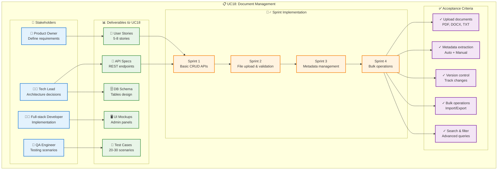

---

## 🛠️ **THỰC HIỆN THỰC TẾ - VÍ DỤ UC18**

### **📝 Từ UC18 → User Stories:**

```
Epic: Document Management System

User Story 1: Upload Documents
As a System Admin
I want to upload documents (PDF, Word, TXT)
So that they can be processed by the AI system

Acceptance Criteria:
- Support file types: PDF, DOCX, TXT (max 50MB)
- Validate file format and content
- Show upload progress bar
- Return success/error messages

Estimate: 5 story points
Sprint: 1
Developer: Full-stack Dev
```

### **🔧 API Design từ User Story:**

```javascript
// API endpoints được thiết kế từ UC18
POST /api/v1/documents/upload
GET /api/v1/documents
PUT /api/v1/documents/{id}
DELETE /api/v1/documents/{id}
POST /api/v1/documents/bulk-import
GET /api/v1/documents/{id}/versions
POST /api/v1/documents/{id}/metadata
```

### **🗄️ Database Schema từ UC18:**

```sql
-- Tables được thiết kế từ UC18
CREATE TABLE documents (
    id SERIAL PRIMARY KEY,
    filename VARCHAR(255) NOT NULL,
    file_size BIGINT,
    file_type VARCHAR(50),
    upload_date TIMESTAMP DEFAULT NOW(),
    uploaded_by INTEGER REFERENCES users(id),
    status VARCHAR(20) DEFAULT 'processing',
    version INTEGER DEFAULT 1
);

CREATE TABLE document_metadata (
    id SERIAL PRIMARY KEY,
    document_id INTEGER REFERENCES documents(id),
    key VARCHAR(100),
    value TEXT,
    created_at TIMESTAMP DEFAULT NOW()
);
```

### **🧪 Test Cases từ UC18:**

```gherkin
Feature: Document Upload
  As a System Admin
  I want to upload documents
  So that users can query them

Scenario: Upload valid PDF file
  Given I am logged in as System Admin
  When I upload a PDF file "manual.pdf" (5MB)
  Then the system should accept the file
  And return status "processing"
  And create database record
  And start background processing

Scenario: Upload invalid file type
  Given I am logged in as System Admin  
  When I upload an EXE file "virus.exe"
  Then the system should reject the file
  And return error "File type not supported"
  And not create database record
```

---

## 📊 **TRACKING & MONITORING TRONG THỰC TẾ**

### **🎯 Product Owner theo dõi:**
- Business value delivery
- User adoption metrics  
- Feature completion %

### **👨‍💼 Tech Lead theo dõi:**
- Technical debt
- Code quality metrics
- Architecture compliance

### **🏃‍♂️ Scrum Master theo dõi:**
- Sprint velocity
- Impediments
- Team productivity

### **🧪 QA Engineer theo dõi:**
- Test coverage %
- Bug density
- Performance benchmarks

---

## 📈 **KPIs CHO TỪNG USE CASE**

### **UC18 - Document Management:**
| Metric | Target | Tracking Tool |
|--------|--------|---------------|
| Upload Success Rate | >95% | Application logs |
| Processing Time | <30s average | Prometheus metrics |
| Storage Efficiency | >80% compression | Database monitoring |
| User Satisfaction | >4.0/5.0 | User feedback surveys |

### **UC20 - Performance Monitoring:**
| Metric | Target | Tracking Tool |
|--------|--------|---------------|
| System Uptime | >99.5% | Grafana dashboards |
| Response Time | <60s (95th percentile) | APM tools |
| Error Rate | <1% | ELK stack |
| Resource Utilization | <80% CPU/Memory | Kubernetes metrics |

---

## 🏗️ **IMPLEMENTATION ROADMAP**

### **Phase 1: Core Admin Features (Tuần 1-4)**
```
✅ UC17: User Management (CRUD users, roles)
✅ UC18: Document Management (Upload, basic metadata)
✅ UC19: System Configuration (Basic settings)
```

### **Phase 2: Advanced Features (Tuần 5-8)**
```
🔄 UC20: Performance Monitoring (Metrics dashboard)
🔄 UC21: AI Model Management (Model selection UI)
🔄 UC22: Data Quality Control (Validation pipelines)
```

### **Phase 3: Operations & Security (Tuần 9-12)**
```
⏳ UC23: Security Audit (Compliance reports)
⏳ UC24: Backup & Recovery (Automated backups)
```

---

## 💡 **TẠI SAO CẦN USE CASES?**

### **✅ Lợi ích thực tế:**
1. **Clarity**: Mọi người hiểu rõ phải làm gì
2. **Traceability**: Trace từ requirement → code → test
3. **Estimation**: Ước lượng effort chính xác hơn
4. **Testing**: Đảm bảo không miss requirement nào
5. **Communication**: Common language giữa business và tech

### **❌ Không có Use Cases sẽ:**
- Team không biết ưu tiên gì trước
- Code không match với business needs
- Test cases thiếu hoặc sai focus
- Khó estimate timeline và cost
- Khách hàng không hài lòng với deliverable

**Use Cases là cầu nối giữa "What we want" và "What we build"!**
---
# MÔ TẢ CHI TIẾT CÁC USE CASE

## 🌐 USE CASES CHO GUEST (KHÁCH)

---

## UC1: ĐẶT CÂU HỎI ĐƠN GIẢN, CHỈ NHẬN THÔNG TIN CÔNG KHAI

### **📋 Thông tin cơ bản**

- **ID**: UC-001
- **Tên**: Ask Simple Question (Public Content Only)
- **Actor chính**: Guest User
- **Mức độ**: Primary
- **Phạm vi**: Core System

### **🎯 Mục tiêu**

Cho phép khách truy cập đặt câu hỏi và nhận câu trả lời dựa trên tài liệu công khai mà không cần đăng nhập.

### **📝 Mô tả**

Guest có thể tương tác với chatbot để hỏi về thông tin công ty, sản phẩm, dịch vụ, và các thông tin khác được phân loại là "public". Hệ thống sẽ chỉ truy xuất và trả lời dựa trên dữ liệu có mức độ truy cập công khai.

### **🔗 Điều kiện tiên quyết (Preconditions)**

- Hệ thống chatbot đang hoạt động
- Có ít nhất một tài liệu public trong database
- Guest interface có thể truy cập được
- Session tracking được khởi tạo

### **✅ Điều kiện hậu (Postconditions)**

- **Thành công**: Câu trả lời được hiển thị với citations từ tài liệu public
- **Thất bại**: Thông báo lỗi hoặc "không tìm thấy thông tin phù hợp"
- Session được cập nhật với câu hỏi và câu trả lời
- Metrics được ghi nhận (response time, query type)

### **🏃‍♂️ Luồng chính (Main Flow)**

| Bước | Actor | Hành động |
| --- | --- | --- |
| 1   | Guest | Truy cập giao diện chatbot |
| 2   | System | Hiển thị giao diện chat với placeholder "Hãy đặt câu hỏi..." |
| 3   | Guest | Nhập câu hỏi vào text box và nhấn Send hoặc Enter |
| 4   | System | Validate input (không rỗng, độ dài hợp lệ ≤ 1000 ký tự) |
| 5   | System | Hiển thị loading indicator "Đang xử lý..." |
| 6   | System | Gọi RAG Core Engine với query + access_level="public" |
| 7   | System | RAG Engine thực hiện semantic search trong public documents |
| 8   | System | LLM sinh câu trả lời dựa trên retrieved context |
| 9   | System | Validate câu trả lời (không chứa nội dung sensitive) |
| 10  | System | Hiển thị câu trả lời kèm theo references |
| 11  | System | Lưu câu hỏi/trả lời vào session history |
| 12  | Guest | Đọc câu trả lời và có thể đặt câu hỏi tiếp theo |

### **🔄 Luồng thay thế (Alternative Flows)**

**AF1 - Không tìm thấy thông tin phù hợp:**

- Bước 7-8: RAG Engine không tìm thấy documents relevent
- System hiển thị: "Xin lỗi, tôi không tìm thấy thông tin phù hợp về câu hỏi của bạn. Bạn có thể thử đặt câu hỏi khác hoặc liên hệ với nhân viên để được hỗ trợ."
- System suggest một số câu hỏi phổ biến

**AF2 - Lỗi kết nối LLM:**

- Bước 8: LLM API trả về error hoặc timeout
- System hiển thị: "Hệ thống đang bận, vui lòng thử lại sau ít phút."
- System ghi log error để admin xử lý

**AF3 - Query quá dài:**

- Bước 4: Input validation fail (>1000 ký tự)
- System hiển thị: "Câu hỏi quá dài. Vui lòng rút gọn câu hỏi (tối đa 1000 ký tự)."

### **❌ Luồng ngoại lệ (Exception Flows)**

**EF1 - Hệ thống overload:**

- System trả về HTTP 503 Service Unavailable
- Hiển thị: "Hệ thống đang quá tải. Vui lòng thử lại sau 5 phút."

**EF2 - Database không khả dụng:**

- Vector DB hoặc PostgreSQL down
- Hiển thị: "Dịch vụ tạm thời không khả dụng. Vui lòng thử lại sau."

### **🎯 Yêu cầu đặc biệt**

- **Hiệu suất**: Response time ≤ 60 giây
- **Bảo mật**: Chỉ truy cập documents có access_level="public"
- **Usability**: Giao diện intuitive, không cần hướng dẫn
- **Scalability**: Hỗ trợ 50+ concurrent guest users

### **📊 Tiêu chí chấp nhận**

- [ ] Guest có thể đặt câu hỏi mà không cần đăng nhập
- [ ] Chỉ nhận được thông tin từ tài liệu public
- [ ] Response time trung bình < 45 giây
- [ ] UI responsive trên desktop và mobile
- [ ] Error messages rõ ràng và hữu ích
- [ ] Session được maintain trong suốt interaction

---

## UC2: XEM CÁC TÀI LIỆU ĐƯỢC ĐÁNH DẤU "PUBLIC"

### **📋 Thông tin cơ bản**

- **ID**: UC-002
- **Tên**: View Public Documents
- **Actor chính**: Guest User
- **Mức độ**: Primary
- **Phạm vi**: Document Management System

### **🎯 Mục tiêu**

Cho phép guest browse và xem trực tiếp các tài liệu được phân loại là public mà không cần thông qua chatbot.

### **📝 Mô tả**

Guest có thể duyệt danh sách tài liệu công khai, xem chi tiết metadata, và đọc nội dung tài liệu. Tính năng này bổ sung cho UC1, giúp guest tự khám phá thông tin.

### **🔗 Điều kiện tiên quyết**

- Hệ thống document viewer hoạt động
- Có ít nhất 1 tài liệu public trong hệ thống
- Guest có thể truy cập document browser interface

### **✅ Điều kiện hậu**

- **Thành công**: Tài liệu được hiển thị hoàn chỉnh với metadata
- **Thất bại**: Thông báo lỗi truy cập hoặc tài liệu không tồn tại
- View count được cập nhật cho analytics

### **🏃‍♂️ Luồng chính**

| Bước | Actor | Hành động |
| --- | --- | --- |
| 1   | Guest | Click vào tab "Tài liệu công khai" hoặc "Browse Documents" |
| 2   | System | Query database với filter access_level="public" |
| 3   | System | Hiển thị danh sách tài liệu với thông tin cơ bản:<br/>- Tiêu đề<br/>- Loại tài liệu<br/>- Ngày cập nhật<br/>- Mô tả ngắn |
| 4   | Guest | Browse danh sách và click vào tài liệu muốn xem |
| 5   | System | Validate quyền truy cập (public access) |
| 6   | System | Load document content từ file storage |
| 7   | System | Render document trong viewer (PDF, HTML, etc.) |
| 8   | System | Hiển thị document metadata sidebar:<br/>- Tác giả<br/>- Phiên bản<br/>- Tags<br/>- Ngày tạo/cập nhật |
| 9   | Guest | Đọc tài liệu, có thể scroll, zoom, search trong tài liệu |
| 10  | System | Track reading analytics (không lưu personal info) |

### **🔄 Luồng thay thế**

**AF1 - Không có tài liệu public:**

- Bước 2-3: Query trả về empty result
- System hiển thị: "Hiện tại chưa có tài liệu công khai nào. Vui lòng quay lại sau."

**AF2 - Tài liệu bị corrupted:**

- Bước 6: File storage trả về corrupted file
- System hiển thị: "Tài liệu không thể mở. Vui lòng liên hệ admin."

**AF3 - Large document loading:**

- Bước 7: Document > 10MB
- System hiển thị progress bar "Đang tải tài liệu... X%"
- Có option "Cancel" để hủy tải

### **🎯 Yêu cầu đặc biệt**

- **Performance**: Document list load < 3 giây
- **UX**: Preview thumbnail cho documents khi có thể
- **Security**: Không cache documents trên client browser
- **Accessibility**: Support screen readers và keyboard navigation

---

## UC3: TÌM KIẾM TRONG PHẠM VI TÀI LIỆU CÔNG KHAI

### **📋 Thông tin cơ bản**

- **ID**: UC-003
- **Tên**: Search Public Documents
- **Actor chính**: Guest User
- **Mức độ**: Primary
- **Phạm vi**: Search Engine

### **🎯 Mục tiêu**

Cung cấp tính năng tìm kiếm nâng cao cho guest để tìm tài liệu public theo keywords, tags, hoặc content.

### **📝 Mô tả**

Guest sử dụng search function để tìm tài liệu public theo nhiều criteria khác nhau. Hỗ trợ cả full-text search và metadata search.

### **🏃‍♂️ Luồng chính**

| Bước | Actor | Hành động |
| --- | --- | --- |
| 1   | Guest | Click vào search box hoặc icon tìm kiếm |
| 2   | System | Hiển thị search interface với options:<br/>- Keywords<br/>- Document type filter<br/>- Date range<br/>- Sort options |
| 3   | Guest | Nhập search terms và chọn filters (optional) |
| 4   | System | Validate search input (không rỗng, không chứa special chars) |
| 5   | System | Execute hybrid search (semantic + keyword) trong public documents |
| 6   | System | Rank results theo relevance score |
| 7   | System | Hiển thị search results với:<br/>- Document title<br/>- Relevance snippet<br/>- Match highlights<br/>- Metadata preview |
| 8   | Guest | Browse kết quả và click vào document để xem chi tiết |
| 9   | System | Navigate đến UC2 (View Document) cho selected document |

### **🔄 Luồng thay thế**

**AF1 - No results found:**

- Bước 5-6: Search engine trả về 0 results
- System hiển thị: "Không tìm thấy tài liệu nào phù hợp. Thử với từ khóa khác:"
- Suggest search terms dựa trên popular queries

**AF2 - Advanced search:**

- Guest click "Advanced Search"
- System hiển thị form với more filters:
  - Exact phrase
  - Exclude terms
  - File type
  - Author
  - Tags

### **🎯 Yêu cầu đặc biệt**

- **Performance**: Search results < 5 giây
- **Relevance**: Accurate ranking với semantic understanding
- **UX**: Auto-complete suggestions, typo tolerance
- **Analytics**: Track popular search terms (anonymously)

---

## UC4: XEM LẠI LỊCH SỬ CÂU HỎI TRONG SESSION

### **📋 Thông tin cơ bản**

- **ID**: UC-004
- **Tên**: View Session Chat History
- **Actor chính**: Guest User
- **Mức độ**: Secondary
- **Phạm vi**: Session Management

### **🎯 Mục tiêu**

Guest có thể xem lại các câu hỏi và câu trả lời trong session hiện tại để tiếp tục conversation context.

### **📝 Mô tả**

Lưu trữ tạm thời lịch sử chat trong session (không persistent), cho phép guest scroll up để xem lại previous questions và answers.

### **🏃‍♂️ Luồng chính**

| Bước | Actor | Hành động |
| --- | --- | --- |
| 1   | Guest | Scroll lên trong chat interface hoặc click "Lịch sử" |
| 2   | System | Load chat history từ session storage |
| 3   | System | Hiển thị chronological list của:<br/>- Timestamp<br/>- Question text<br/>- Answer text<br/>- References (nếu có) |
| 4   | Guest | Browse through previous conversations |
| 5   | Guest | (Optional) Click vào previous question để ask follow-up |
| 6   | System | Pre-populate search box với selected question context |

### **🔄 Luồng thay thế**

**AF1 - Empty session:**

- Bước 2: Session storage empty
- System hiển thị: "Chưa có lịch sử câu hỏi trong session này."

**AF2 - Session expired:**

- Session timeout (sau 2 giờ không activity)
- System hiển thị: "Session đã hết hạn. Lịch sử câu hỏi đã được xóa."

### **🎯 Yêu cầu đặc biệt**

- **Privacy**: Session data không được lưu permanent
- **Performance**: Instant loading cho recent history
- **Storage**: Limit 50 recent Q&A pairs per session
- **UX**: Clear visual separation giữa các conversation turns

---

## UC7: ĐÁNH GIÁ CHẤT LƯỢNG CÂU TRẢ LỜI

### **📋 Thông tin cơ bản**

- **ID**: UC-007
- **Tên**: Rate Answer Quality
- **Actor chính**: Guest User
- **Mức độ**: Secondary
- **Phạm vi**: Feedback System

### **🎯 Mục tiêu**

Thu thập feedback từ guest về chất lượng câu trả lời để cải thiện hệ thống AI và training data.

### **📝 Mô tả**

Sau mỗi câu trả lời, guest có thể rate quality và provide optional feedback để giúp hệ thống học hỏi và cải thiện.

### **🏃‍♂️ Luồng chính**

| Bước | Actor | Hành động |
| --- | --- | --- |
| 1   | System | Hiển thị câu trả lời với feedback options:<br/>👍 Hữu ích<br/>👎 Không hữu ích<br/>💬 Góp ý |
| 2   | Guest | Click vào một trong các feedback options |
| 3   | System | Nếu click 👍: Record positive feedback và thank message |
| 4   | System | Nếu click 👎: Hiển thị follow-up form:<br/>- "Tại sao câu trả lời không hữu ích?"<br/>- Checkbox options: Không chính xác, Không liên quan, Thiếu thông tin, Khác |
| 5   | Guest | (Optional) Select reasons và nhập additional comments |
| 6   | System | Save feedback với metadata:<br/>- Question ID<br/>- Rating<br/>- Reason categories<br/>- Free text feedback<br/>- Timestamp<br/>- Session ID (anonymous) |
| 7   | System | Hiển thị: "Cảm ơn phản hồi của bạn! Chúng tôi sẽ cải thiện hệ thống." |
| 8   | System | Update analytics dashboard cho admin |

### **🔄 Luồng thay thế**

**AF1 - Detailed feedback:**

- Guest click 💬 Góp ý
- System hiển thị text area: "Hãy cho chúng tôi biết cách cải thiện câu trả lời:"
- Guest nhập detailed feedback
- System save và thank guest

**AF2 - Quick rating:**

- Guest chỉ click 👍 hoặc 👎 mà không elaborate
- System record basic rating và move on
- Không force guest phải explain

### **🎯 Yêu cầu đặc biệt**

- **Privacy**: Không collect personal information from guest feedback
- **Analytics**: Aggregate feedback data cho system improvement
- **UX**: Non-intrusive, optional feedback mechanism
- **Performance**: Feedback submission < 1 giây

### **📊 Business Rules**

- Guest không bắt buộc phải rate answers
- Feedback chỉ được count một lần per question-answer pair
- Negative feedback trigger review process cho content quality
- Anonymous feedback data có thể dùng để retrain AI models

---

## 📈 **METRICS VÀ KPIs CHO GUEST USE CASES**

### **📊 Success Metrics:**

- **UC1**: Average response time ≤ 45s, User satisfaction ≥ 70%
- **UC2**: Document view completion rate ≥ 60%
- **UC3**: Search success rate ≥ 80% (user clicks on results)
- **UC4**: Session length ≥ 3 minutes (indicates engagement)
- **UC7**: Feedback participation rate ≥ 30%

### **🎯 Business Value:**

- Tăng accessibility của company information
- Giảm load cho customer service team
- Cải thiện company transparency và trust
- Thu thập insights về common public inquiries
- Build foundation cho advanced features

Các use case này tạo nền tảng cho guest experience tốt và khuyến khích họ trở thành employees hoặc partners trong tương lai!

# MÔ TẢ CHI TIẾT CÁC USE CASE - EMPLOYEE (NHÂN VIÊN)

---

## 📋 **UC5: Xuất cuộc trò chuyện ra file (Export Conversation)**

### **Thông tin cơ bản**

- **ID**: UC5
- **Tên**: Export Conversation to File
- **Actor chính**: Employee (Nhân viên)
- **Mục tiêu**: Lưu trữ cuộc trò chuyện dưới dạng file để tham khảo sau này hoặc chia sẻ với đồng nghiệp
- **Độ ưu tiên**: Medium
- **Độ phức tạp**: Low

### **Preconditions (Điều kiện tiên quyết)**

- Nhân viên đã đăng nhập thành công
- Có ít nhất 1 cuộc trò chuyện trong session hiện tại
- Trình duyệt hỗ trợ download files

### **Main Success Scenario (Luồng chính thành công)**

1. **Nhân viên** truy cập vào giao diện chat hiện tại
2. **Nhân viên** nhấn nút "Export Conversation" (📥) trên thanh công cụ
3. **Hệ thống** hiển thị dialog lựa chọn format xuất file:
  - PDF (định dạng đẹp, có timestamp)
  - Word (.docx) - có thể chỉnh sửa
  - Plain Text (.txt) - đơn giản
  - JSON (.json) - cho technical users
4. **Nhân viên** chọn format mong muốn
5. **Nhân viên** nhập tên file (optional, mặc định: "Chat_YYYY-MM-DD_HH-mm")
6. **Nhân viên** nhấn "Download"
7. **Hệ thống** tạo file với nội dung:
  - Timestamp của cuộc trò chuyện
  - Thông tin người dùng (tên, phòng ban)
  - Toàn bộ Q&A pairs
  - References/Citations nếu có
  - Metadata (session ID, export time)
8. **Hệ thống** trigger download file về máy tính
9. **Hệ thống** ghi log hoạt động export (audit trail)

### **Alternative Flows (Luồng thay thế)**

**A1: Session rỗng**

- 3a. Nếu không có cuộc trò chuyện nào
- 3b. **Hệ thống** hiển thị thông báo "Không có nội dung để xuất"
- 3c. **Hệ thống** disable nút Export

**A2: Lỗi tạo file**

- 7a. Nếu có lỗi trong quá trình tạo file
- 7b. **Hệ thống** hiển thị thông báo lỗi "Không thể tạo file. Vui lòng thử lại"
- 7c. **Hệ thống** ghi log error

### **Exception Flows (Luồng ngoại lệ)**

**E1: Network error**

- **Hệ thống** hiển thị thông báo "Lỗi kết nối. Vui lòng kiểm tra internet"

**E2: File size quá lớn**

- **Hệ thống** hiển thị "Cuộc trò chuyện quá dài. Vui lòng xuất từng phần"

### **Business Rules**

- Chỉ export được conversation của session hiện tại
- File tối đa 50MB (khoảng 10,000 tin nhắn)
- Không export được nội dung nhạy cảm đã bị filter
- Thời gian lưu trữ log export: 90 ngày

### **Non-functional Requirements**

- Thời gian tạo file: < 30 giây cho conversation bình thường
- Support multiple browsers (Chrome, Firefox, Edge, Safari)
- File format phải readable trên các thiết bị phổ biến

---

## 📤 **UC6: Upload tài liệu để hỏi về nội dung cụ thể (Upload Document for Query)**

### **Thông tin cơ bản**

- **ID**: UC6
- **Tên**: Upload Document for Specific Content Query
- **Actor chính**: Employee (Nhân viên)
- **Mục tiêu**: Upload tài liệu cá nhân/tạm thời để hỏi chatbot về nội dung cụ thể trong tài liệu đó
- **Độ ưu tiên**: High
- **Độ phức tạp**: Medium

### **Preconditions (Điều kiện tiên quyết)**

- Nhân viên đã đăng nhập thành công
- Có file tài liệu hợp lệ để upload
- File size không vượt quá giới hạn cho phép

### **Main Success Scenario (Luồng chính thành công)**

1. **Nhân viên** nhấn nút "Upload Document" (📎) trong giao diện chat
2. **Hệ thống** hiển thị dialog upload file với thông tin:
  - Supported formats: PDF, Word, TXT, PowerPoint
  - Max file size: 10MB
  - Lưu ý về tính bảo mật
3. **Nhân viên** chọn file từ máy tính (drag & drop hoặc browse)
4. **Hệ thống** validate file:
  - Kiểm tra format
  - Kiểm tra size
  - Scan virus/malware cơ bản
5. **Hệ thống** hiển thị preview thông tin file:
  - Tên file, size, số trang (nếu có)
  - Checkbox "Tôi xác nhận không có thông tin nhạy cảm"
6. **Nhân viên** xác nhận checkbox và nhấn "Upload & Process"
7. **Hệ thống** xử lý file:
  - Extract text content
  - Tạo embeddings cho nội dung
  - Lưu tạm thời (session-based storage)
8. **Hệ thống** hiển thị thông báo "File đã sẵn sàng! Bạn có thể hỏi về nội dung tài liệu này"
9. **Hệ thống** enable "Document Context Mode":
  - Icon file hiển thị trong chat
  - Queries sẽ prioritize nội dung từ file này
10. **Nhân viên** có thể đặt câu hỏi về tài liệu đã upload
11. **Hệ thống** trả lời dựa trên nội dung file + knowledge base

### **Alternative Flows (Luồng thay thế)**

**A1: File không hợp lệ**

- 4a. Nếu file format không được hỗ trợ
- 4b. **Hệ thống** hiển thị "File format không được hỗ trợ. Vui lòng chọn PDF, Word, TXT hoặc PowerPoint"
- 4c. Return to step 3

**A2: File quá lớn**

- 4a. Nếu file > 10MB
- 4b. **Hệ thống** hiển thị "File quá lớn. Vui lòng chọn file < 10MB"
- 4c. Return to step 3

**A3: Nội dung không extract được**

- 7a. Nếu không thể đọc text từ file
- 7b. **Hệ thống** hiển thị "Không thể đọc nội dung file. Vui lòng kiểm tra file và thử lại"
- 7c. **Nhân viên** có option thử file khác

### **Exception Flows (Luồng ngoại lệ)**

**E1: Virus detected**

- **Hệ thống** reject file và hiển thị "File không an toàn. Upload bị từ chối"

**E2: Server storage full**

- **Hệ thống** hiển thị "Hệ thống tạm thời quá tải. Vui lòng thử lại sau"

### **Business Rules**

- File chỉ lưu trữ trong thời gian session (tự động xóa sau 4 giờ không hoạt động)
- Một session chỉ được upload tối đa 3 files đồng thời
- Không lưu trữ permanent - chỉ là temporary processing
- Content scanning để đảm bảo không có thông tin nhạy cảm
- Audit log mọi hoạt động upload (không log nội dung file)

### **Non-functional Requirements**

- Upload speed: Hỗ trợ file 10MB trong < 2 phút
- Processing time: < 1 phút cho file PDF 50 trang
- Concurrent uploads: Hỗ trợ 20 users upload đồng thời
- Auto-cleanup: Xóa files sau session timeout

---

## 🗂️ **UC8: Truy cập tài liệu cấp nhân viên (Access Employee-Level Documents)**

### **Thông tin cơ bản**

- **ID**: UC8
- **Tên**: Access Employee-Level Documents
- **Actor chính**: Employee (Nhân viên)
- **Mục tiêu**: Truy cập và tìm kiếm thông tin trong tài liệu được phân quyền cho cấp nhân viên
- **Độ ưu tiên**: High
- **Độ phức tạp**: Medium

### **Preconditions (Điều kiện tiên quyết)**

- Nhân viên đã đăng nhập với tài khoản được xác thực
- Tài khoản có role "Employee" hoặc cao hơn
- Hệ thống permission service hoạt động bình thường

### **Main Success Scenario (Luồng chính thành công)**

1. **Nhân viên** đặt câu hỏi trong chatbot interface
2. **Hệ thống** nhận query và xác định user permission level
3. **Hệ thống** thực hiện search với filter:
  - Document access_level: "public" + "employee_only"
  - Exclude: "manager_only", "director_only"
4. **Hệ thống** retrieve relevant documents từ vector database
5. **Hệ thống** apply additional permission check:
  - Cross-check user department với document department_owner (nếu có restriction)
  - Verify document status (active/archived)
6. **Hệ thống** rank và select top relevant documents
7. **Hệ thống** generate response dựa trên permitted documents
8. **Hệ thống** trả về answer kèm citations:
  - Document title và source
  - Access level indicator
  - Last updated date
  - Department owner (nếu relevant)

### **Alternative Flows (Luồng thay thế)**

**A1: Không tìm thấy tài liệu phù hợp**

- 6a. Nếu không có document nào match query trong phạm vi quyền hạn
- 6b. **Hệ thống** trả về: "Tôi không tìm thấy thông tin phù hợp trong phạm vi tài liệu bạn có quyền truy cập. Bạn có thể:"
  - Thử câu hỏi khác
  - Yêu cầu quyền truy cập cao hơn
  - Liên hệ IT support

**A2: Tìm thấy document có restricted access**

- 5a. Nếu relevant document có access_level cao hơn
- 5b. **Hệ thống** exclude document đó khỏi context
- 5c. **Hệ thống** có thể hint: "Có tài liệu liên quan nhưng cần quyền truy cập cao hơn"

### **Exception Flows (Luồng ngoại lệ)**

**E1: Permission service down**

- **Hệ thống** fallback về "public" documents only
- Hiển thị warning: "Một số tính năng tạm thời bị hạn chế"

**E2: Database connection error**

- **Hệ thống** trả về generic error message
- Log technical error cho admin

### **Business Rules**

- Employee có quyền truy cập:
  - Tất cả tài liệu "public"
  - Tài liệu "employee_only" của công ty
  - Tài liệu "employee_only" của department riêng (nếu có cấu hình)
- Không được truy cập:
  - Tài liệu "manager_only"
  - Tài liệu "director_only"
  - Tài liệu của department khác (nếu có restriction)
- Permission check phải real-time (không cache quá 5 phút)
- Audit log mọi truy cập document

### **Non-functional Requirements**

- Permission check time: < 200ms
- Document retrieval: < 3 giây cho query phức tạp
- Concurrent user support: 100 employees đồng thời
- Accuracy: 99.9% permission enforcement

---

## 🏢 **UC9: Xem thông tin quy trình phòng ban (View Department Process Information)**

### **Thông tin cơ bản**

- **ID**: UC9
- **Tên**: View Department Process Information
- **Actor chính**: Employee (Nhân viên)
- **Mục tiêu**: Tra cứu thông tin về quy trình, chính sách, hướng dẫn làm việc của phòng ban mình và phòng ban liên quan
- **Độ ưu tiên**: High
- **Độ phức tạp**: Low-Medium

### **Preconditions (Điều kiện tiên quyết)**

- Nhân viên đã đăng nhập và được xác định department
- Có tài liệu quy trình được categorize theo department trong hệ thống
- User profile có thông tin department mapping

### **Main Success Scenario (Luồng chính thành công)**

1. **Nhân viên** hỏi về quy trình phòng ban (VD: "Quy trình nghỉ phép ở phòng HR như thế nào?")
2. **Hệ thống** analyze query để xác định:
  - Department được mention (HR trong VD)
  - Process type (nghỉ phép trong VD)
  - User's own department từ profile
3. **Hệ thống** search với priority order:
  - Tài liệu của department được hỏi (nếu user có quyền)
  - Tài liệu general/cross-department
  - Tài liệu của department user thuộc về
4. **Hệ thống** apply access control:
  - Public department info: accessible by all
  - Internal department process: chỉ member của department đó
  - Cross-department process: accessible by all employees
5. **Hệ thống** retrieve và rank documents:
  - Document type = "procedure" hoặc "process"
  - Department_owner matches query
  - Relevance score cao
6. **Hệ thống** generate comprehensive response:
  - Step-by-step process nếu có
  - Contact person/department
  - Required documents/forms
  - Timeline expectations
  - Related processes
7. **Hệ thống** provide citations với department context

### **Alternative Flows (Luồng thay thế)**

**A1: Hỏi về department không có quyền truy cập**

- 4a. Nếu query về internal process của department khác
- 4b. **Hệ thống** trả về general information only
- 4c. **Hệ thống** suggest: "Để biết chi tiết hơn, vui lòng liên hệ trực tiếp phòng [Department Name]"

**A2: Department không được nhận diện**

- 2a. Nếu query không specify rõ department
- 2b. **Hệ thống** hỏi clarification: "Bạn muốn hỏi về quy trình của phòng ban nào?"
- 2c. **Hệ thống** list available departments
- 2d. **Nhân viên** chọn department
- 2e. Continue with step 3

**A3: Multiple processes match**

- 5a. Nếu có nhiều processes liên quan
- 5b. **Hệ thống** trả về summary của tất cả
- 5c. **Hệ thống** offer: "Bạn muốn biết chi tiết về quy trình nào?"

### **Exception Flows (Luồng ngoại lệ)**

**E1: User department không được set**

- **Hệ thống** chỉ trả về public information
- Suggest user liên hệ IT để cập nhật profile

**E2: No process documents found**

- **Hệ thống** trả về: "Hiện tại chưa có thông tin quy trình cho [department]. Vui lòng liên hệ trực tiếp hoặc IT support"

### **Business Rules**

- Employee có thể xem:
  - Quy trình public của tất cả departments
  - Quy trình internal của department mình
  - Cross-department processes
- Department mapping dựa trên user profile
- Process information phải được tag với department_owner
- Prioritize most recent version của processes
- Contact information phải được included trong response

### **Non-functional Requirements**

- Response time: < 5 giây cho complex departmental queries
- Department mapping accuracy: 100%
- Process information freshness: Cập nhật trong vòng 24h khi có thay đổi

---

## 🔐 **UC10: Yêu cầu quyền truy cập tài liệu cấp cao hơn (Request Higher-Level Document Access)**

### **Thông tin cơ bản**

- **ID**: UC10
- **Tên**: Request Higher-Level Document Access
- **Actor chính**: Employee (Nhân viên)
- **Mục tiêu**: Yêu cầu quyền truy cập vào tài liệu có access level cao hơn quyền hạn hiện tại
- **Độ ưu tiên**: Medium
- **Độ phức tạp**: Medium-High

### **Preconditions (Điều kiện tiên quyết)**

- Nhân viên đã đăng nhập với tài khoản hợp lệ
- Có tài liệu với access level cao hơn trong hệ thống
- Hệ thống approval workflow đã được cấu hình
- Manager/Approver có tài khoản active

### **Main Success Scenario (Luồng chính thành công)**

1. **Nhân viên** đặt câu hỏi và nhận response từ hệ thống
2. **Hệ thống** detect có relevant documents với higher access level
3. **Hệ thống** hiển thị message: "Có tài liệu liên quan nhưng cần quyền truy cập cao hơn. Bạn có muốn yêu cầu quyền truy cập không?"
4. **Nhân viên** nhấn "Request Access"
5. **Hệ thống** hiển thị form yêu cầu:
  - Document/Category cần truy cập
  - Business justification (text area)
  - Urgent level (Normal/High/Critical)
  - Temporary/Permanent access
  - Expected usage period
6. **Nhân viên** điền form và submit
7. **Hệ thống** identify approver:
  - Direct manager nếu request "manager_only" docs
  - Department director nếu request "director_only" docs
  - IT Admin nếu request cross-department access
8. **Hệ thống** tạo access request record:
  - Unique request ID
  - Timestamp
  - User info
  - Document info
  - Justification
  - Approver assignment
9. **Hệ thống** gửi notification đến approver:
  - Email notification
  - In-app notification (nếu có)
  - Include request details và approval link
10. **Hệ thống** confirm với nhân viên: "Yêu cầu đã được gửi đến [Approver Name]. Request ID: #12345"
11. **Hệ thống** track request status và notify user về updates

### **Alternative Flows (Luồng thay thế)**

**A1: No approver available**

- 7a. Nếu không xác định được approver
- 7b. **Hệ thống** escalate to IT Admin
- 7c. **Hệ thống** notify user về escalation

**A2: Duplicate request exists**

- 8a. Nếu user đã có pending request cho same document
- 8b. **Hệ thống** hiển thị: "Bạn đã có yêu cầu pending cho tài liệu này (Request #XXXX)"
- 8c. **Hệ thống** offer option để view status hoặc withdraw previous request

**A3: Automatic approval**

- 8a. Nếu document thuộc category được pre-approved cho user's role
- 8b. **Hệ thống** tự động approve
- 8c. **Hệ thống** notify user: "Quyền truy cập đã được cấp tự động"

### **Approval Workflow (Sub-flow)**

1. **Approver** nhận notification
2. **Approver** access approval interface
3. **Approver** review request details:
  - User profile và history
  - Business justification
  - Document sensitivity
  - Company policies
4. **Approver** make decision:
  - Approve (với optional conditions/time limit)
  - Reject (với reason)
  - Request more information
5. **Hệ thống** implement decision:
  - Update user permissions nếu approved
  - Send notification to requester
  - Log decision với audit trail

### **Exception Flows (Luồng ngoại lệ)**

**E1: Approver không response sau 72h**

- **Hệ thống** auto-escalate to higher level
- **Hệ thống** notify requester về escalation

**E2: System maintenance during approval**

- **Hệ thống** queue pending approvals
- **Hệ thống** resume workflow after maintenance

### **Business Rules**

- Request timeout: 7 ngày (auto-reject nếu no action)
- Maximum pending requests per user: 5
- Automatic approval categories:
  - Public training materials
  - General company policies
  - Safety procedures
- Approval authority matrix:
  - Direct manager: employee_only → manager_only
  - Department head: manager_only → director_only
  - IT Admin: cross-department access
- Audit log retention: 2 năm
- Approved temporary access: Auto-revoke sau expiry date

### **Non-functional Requirements**

- Request submission time: < 10 giây
- Notification delivery: < 5 phút
- Approval interface load time: < 3 giây
- Concurrent requests support: 50 requests/hour
- Email delivery success rate: 99%
- Audit trail completeness: 100%

### **Post-conditions**

- Request record được lưu trong database
- Notification được gửi đến approver
- User có thể track request status
- Audit log được tạo cho compliance
- System ready cho next request từ user

---

## 📊 **TỔNG QUAN BUSINESS VALUE**

### **🎯 Lợi ích chính cho Employee:**

1. **Tăng hiệu quả**: Nhanh chóng tìm thông tin mà không cần hỏi đồng nghiệp
2. **Tự chủ cao hơn**: Có thể tự tra cứu và giải quyết vấn đề
3. **Giảm thiểu gián đoạn**: Không làm phiền manager/đồng nghiệp với câu hỏi đơn giản
4. **Lưu trữ kiến thức**: Export conversations để tham khảo sau này
5. **Linh hoạt**: Upload document cá nhân để hỏi specific questions

### **🔄 Integration với Existing Workflows:**

- Seamless với daily work routine
- Không require training phức tạp
- Compatible với existing document management systems
- Support cho compliance và audit requirements

### **📈 Success Metrics:**

- **User Adoption**: >80% employees sử dụng ít nhất 1 lần/tuần
- **Query Success Rate**: >85% queries được resolve mà không cần escalate
- **Time Savings**: Giảm 60% thời gian tìm kiếm thông tin
- **User Satisfaction**: >4.2/5.0 rating từ employee feedback

Các use cases này được thiết kế để maximize business value cho employees trong khi maintain security và compliance requirements của tổ chức.

# MÔ TẢ CHI TIẾT CÁC USE CASE - MANAGER (TRƯỞNG PHÒNG)

## 🏷️ **THÔNG TIN CHUNG**

- **Actor chính**: Manager (Trưởng phòng)
- **Quyền kế thừa**: Tất cả Use Cases của Employee
- **Cấp độ ưu tiên**: High (Người quản lý trực tiếp)
- **Tần suất sử dụng**: Daily (Hàng ngày)

---

## 📊 **UC11: TRUY CẬP TÀI LIỆU CẤP QUẢN LÝ**

### **📋 Thông tin cơ bản**

- **Use Case ID**: UC11
- **Tên**: Access Manager Documents (Truy cập tài liệu cấp quản lý)
- **Actor chính**: Manager
- **Actors phụ**: System, Document Database
- **Loại**: Primary Use Case
- **Mức độ phức tạp**: Medium

### **🎯 Mô tả**

Trưởng phòng có thể truy cập và tra cứu các tài liệu được phân loại ở cấp độ quản lý, bao gồm báo cáo nội bộ, chiến lược phòng ban, quy trình quản lý nhân sự, và các thông tin không được chia sẻ với nhân viên thường.

### **🚀 Điều kiện tiên quyết (Preconditions)**

- Manager đã đăng nhập vào hệ thống với vai trò "Manager"
- Manager có quyền truy cập hợp lệ (access_level = manager_only hoặc thấp hơn)
- Hệ thống cơ sở dữ liệu và RAG engine đang hoạt động bình thường
- Manager thuộc phòng ban có quyền truy cập tài liệu (department-specific access)

### **📈 Kịch bản chính (Main Success Scenario)**

| Bước | Actor | Hành động |
| --- | --- | --- |
| 1   | Manager | Đăng nhập và truy cập giao diện chatbot |
| 2   | Manager | Nhập câu hỏi liên quan đến tài liệu cấp quản lý<br/>*VD: "Chiến lược phát triển sản phẩm Q4 như thế nào?"* |
| 3   | System | Xác thực quyền truy cập của Manager |
| 4   | System | Thực hiện tìm kiếm trong tài liệu với filter access_level ≤ "manager_only" |
| 5   | System | Áp dụng bộ lọc phòng ban (nếu có quy định) |
| 6   | System | Truy xuất các tài liệu phù hợp từ Vector Database và Metadata Store |
| 7   | System | Xây dựng context từ các tài liệu đã lọc |
| 8   | System | Gọi LLM để sinh câu trả lời với context đã chuẩn bị |
| 9   | System | Trả về câu trả lời kèm theo citation từ các tài liệu cấp quản lý |
| 10  | Manager | Nhận câu trả lời và có thể đặt câu hỏi follow-up |

### **🔄 Kịch bản thay thế (Alternative Scenarios)**

**A1: Không tìm thấy tài liệu phù hợp**

- 4a. System không tìm thấy tài liệu nào matching với query
- 4b. System thông báo: "Xin lỗi, tôi không tìm thấy thông tin liên quan đến câu hỏi của bạn trong các tài liệu cấp quản lý."
- 4c. System đề xuất: "Bạn có muốn mở rộng tìm kiếm hoặc liên hệ IT để bổ sung tài liệu không?"

**A2: Tài liệu có access level cao hơn quyền của Manager**

- 6a. System phát hiện một số tài liệu liên quan nhưng có access_level = "director_only"
- 6b. System loại bỏ những tài liệu này khỏi context
- 6c. System trả về kết quả với ghi chú: "Một số thông tin liên quan có thể yêu cầu quyền cấp cao hơn."

**A3: Manager truy cập cross-department document**

- 5a. Manager hỏi về tài liệu của phòng ban khác
- 5b. System check cross-department access policy
- 5c1. Nếu được phép: Tiếp tục bình thường
- 5c2. Nếu bị cấm: Thông báo "Thông tin này thuộc về [Department Name]. Bạn cần yêu cầu quyền truy cập từ trưởng phòng tương ứng."

### **⚠️ Kịch bản ngoại lệ (Exception Scenarios)**

**E1: Lỗi xác thực quyền truy cập**

- 3a. System không thể xác thực quyền của Manager (token expired, role changed)
- 3b. System yêu cầu đăng nhập lại
- 3c. Use case kết thúc

**E2: Vector Database không khả dụng**

- 6a. Vector Database gặp lỗi hoặc không phản hồi
- 6b. System fallback sang keyword search trong Metadata Store
- 6c. System thông báo: "Chức năng tìm kiếm ngữ nghĩa tạm thời gián đoạn. Kết quả có thể ít chính xác hơn."

**E3: LLM Service không khả dụng**

- 8a. External LLM API gặp lỗi hoặc vượt quota
- 8b. System trả về danh sách các document chunks liên quan
- 8c. System thông báo: "Dịch vụ tạo câu trả lời tạm thời gián đoạn. Dưới đây là các tài liệu liên quan:"

### **✅ Điều kiện thành công (Postconditions)**

- Manager nhận được thông tin chính xác từ tài liệu cấp quản lý
- Tất cả truy cập được ghi log để audit
- Context của cuộc hội thoại được lưu trữ cho các câu hỏi tiếp theo
- Usage metrics được cập nhật

### **📊 Yêu cầu phi chức năng**

- **Performance**: Thời gian phản hồi < 60 giây
- **Security**: Strict access control, không data leakage
- **Availability**: 99.5% uptime trong giờ làm việc
- **Auditability**: Full logging của document access

---

## 📈 **UC12: XEM BÁO CÁO CỦA ĐỘI NHÓM**

### **📋 Thông tin cơ bản**

- **Use Case ID**: UC12
- **Tên**: View Team Reports (Xem báo cáo đội nhóm)
- **Actor chính**: Manager
- **Actors phụ**: Analytics Service, Report Generator
- **Loại**: Primary Use Case
- **Mức độ phức tạp**: Medium

### **🎯 Mô tả**

Trưởng phòng có thể truy cập các báo cáo về hiệu suất làm việc, usage statistics, và insights về đội nhóm dưới quyền thông qua chatbot. Bao gồm các báo cáo về tần suất sử dụng hệ thống, loại câu hỏi phổ biến, và productivity metrics.

### **🚀 Điều kiện tiên quyết (Preconditions)**

- Manager đã đăng nhập và được xác thực
- Manager có team members trong database
- Analytics Service đã thu thập đủ dữ liệu (tối thiểu 1 tuần)
- Manager có quyền xem báo cáo team (manager role)

### **📈 Kịch bản chính (Main Success Scenario)**

| Bước | Actor | Hành động |
| --- | --- | --- |
| 1   | Manager | Yêu cầu xem báo cáo đội nhóm<br/>*VD: "Cho tôi xem báo cáo sử dụng hệ thống của team trong tuần qua"* |
| 2   | System | Parse request và xác định loại báo cáo cần thiết |
| 3   | System | Xác thực quyền của Manager đối với team members |
| 4   | System | Truy vấn Analytics Service để lấy team metrics |
| 5   | Analytics Service | Thu thập data từ usage logs, document access, query patterns |
| 6   | Analytics Service | Tính toán các metrics: frequency, popular topics, performance |
| 7   | System | Tạo visualized report với charts và insights |
| 8   | System | Cung cấp natural language summary của báo cáo |
| 9   | Manager | Nhận báo cáo và có thể yêu cầu drill-down vào chi tiết |

### **📊 Các loại báo cáo khả dụng**

**Usage Statistics:**

- Số lượng queries per user per day/week/month
- Peak usage hours
- Device/platform distribution
- Response time trends

**Content Analytics:**

- Most queried document categories
- Popular topics by team
- Knowledge gaps (queries without satisfactory answers)
- Document utilization rates

**Performance Metrics:**

- Query success rate
- User satisfaction scores (thumbs up/down)
- Average session duration
- Feature adoption rates

**Team Insights:**

- Top active users
- Learning patterns
- Department-specific trends
- Training needs identification

### **🔄 Kịch bản thay thế (Alternative Scenarios)**

**A1: Yêu cầu báo cáo custom**

- 2a. Manager yêu cầu báo cáo với tham số cụ thể (time range, specific users, metrics)
- 2b. System parse parameters và validate constraints
- 2c. System generate custom report theo yêu cầu

**A2: So sánh với period trước**

- 4a. Manager muốn so sánh performance với kỳ trước
- 4b. System fetch data cho both periods
- 4c. System generate comparative analysis với trend indicators

**A3: Export báo cáo**

- 9a. Manager yêu cầu export báo cáo ra file
- 9b. System generate PDF/Excel với charts và data
- 9c. System provide download link hoặc email attachment

### **⚠️ Kịch bản ngoại lệ (Exception Scenarios)**

**E1: Insufficient data**

- 5a. Analytics Service không có đủ data cho báo cáo
- 5b. System thông báo: "Chưa có đủ dữ liệu để tạo báo cáo ý nghĩa. Vui lòng thử lại sau [timeframe]."
- 5c. System suggest alternative timeframe hoặc metrics

**E2: Team member privacy constraints**

- 3a. Một số team members có privacy settings không cho phép reporting
- 3b. System exclude those users và thông báo về anonymized reporting
- 3c. Continue với available data

### **✅ Điều kiện thành công (Postconditions)**

- Manager nhận được báo cáo comprehensive về team performance
- Report được cached để truy cập nhanh sau này
- Manager insights được ghi nhận để improve system
- Usage của reporting feature được track

---

## 👥 **UC13: PHÊ DUYỆT YÊU CẦU TRUY CẬP CỦA NHÂN VIÊN**

### **📋 Thông tin cơ bản**

- **Use Case ID**: UC13
- **Tên**: Approve Employee Access Requests (Phê duyệt yêu cầu truy cập)
- **Actor chính**: Manager
- **Actors phụ**: Employee (requester), Permission Service, Notification Service
- **Loại**: Primary Use Case
- **Mức độ phức tạp**: High

### **🎯 Mô tả**

Trưởng phòng có thể xem danh sách các yêu cầu truy cập tài liệu từ nhân viên dưới quyền và thực hiện phê duyệt hoặc từ chối thông qua giao diện chatbot. Hệ thống sẽ tự động cập nhật quyền truy cập và thông báo cho nhân viên.

### **🚀 Điều kiện tiên quyết (Preconditions)**

- Manager đã đăng nhập với role hợp lệ
- Có ít nhất một access request pending từ team members
- Permission Service đang hoạt động bình thường
- Manager có authority để approve requests trong department

### **📈 Kịch bản chính (Main Success Scenario)**

| Bước | Actor | Hành động |
| --- | --- | --- |
| 1   | Manager | Yêu cầu xem pending access requests<br/>*VD: "Có yêu cầu truy cập tài liệu nào cần phê duyệt không?"* |
| 2   | System | Query Permission Service cho pending requests thuộc team |
| 3   | System | Format và hiển thị danh sách requests với chi tiết |
| 4   | Manager | Review request details và quyết định approve/deny |
| 5   | Manager | Phản hồi quyết định<br/>*VD: "Phê duyệt request #123, từ chối request #124"* |
| 6   | System | Parse decision và validate authority của Manager |
| 7   | System | Cập nhật permissions trong database |
| 8   | System | Send notifications cho affected employees |
| 9   | System | Log approval actions cho audit trail |
| 10  | System | Confirm completion và show updated status |

### **📋 Request Information Display Format**

```
🔍 PENDING ACCESS REQUESTS:

📄 Request #123
👤 Employee: Nguyễn Văn A (R&D Department)  
📁 Document: "Quy trình Phát triển Sản phẩm v2.1"
📊 Current Level: employee_only → Requested: manager_only
📅 Request Date: 28/08/2025 - 14:30
💬 Reason: "Cần tham khảo để thực hiện dự án XYZ được giao"
⚖️ Status: Pending Manager Approval

📄 Request #124  
👤 Employee: Trần Thị B (Marketing Department)
📁 Document: "Chiến lược Giá cả 2025"
📊 Current Level: employee_only → Requested: manager_only  
📅 Request Date: 27/08/2025 - 09:15
💬 Reason: "Chuẩn bị presentation cho khách hàng lớn"
⚖️ Status: Cross-department request (Needs additional approval)
```

### **🔄 Kịch bản thay thế (Alternative Scenarios)**

**A1: Batch approval**

- 5a. Manager muốn approve multiple requests cùng lúc
- 5b. Manager: "Phê duyệt tất cả requests từ team R&D"
- 5c. System batch process all matching requests
- 5d. System provide summary of batch actions

**A2: Conditional approval**

- 5a. Manager approve với điều kiện hoặc time limit
- 5b. Manager: "Phê duyệt request #123 trong 30 ngày"
- 5c. System set temporary permission với auto-expiry
- 5d. System schedule reminder trước khi expire

**A3: Request more information**

- 4a. Manager cần thêm thông tin từ employee
- 4b. Manager: "Yêu cầu Nguyễn Văn A giải thích rõ hơn về mục đích sử dụng"
- 4c. System send message đến employee yêu cầu clarification
- 4d. Request status chuyển sang "Pending Additional Info"

**A4: Escalate to Director**

- 6a. Request cần approval từ cấp cao hơn (cross-department, sensitive doc)
- 6b. Manager: "Tôi không có quyền phê duyệt request này, escalate lên Giám đốc"
- 6c. System forward request với Manager's recommendation
- 6d. System notify both employee và Director

### **⚠️ Kịch bản ngoại lệ (Exception Scenarios)**

**E1: Invalid authority**

- 6a. System phát hiện Manager không có quyền approve specific request
- 6b. System thông báo: "Bạn không có quyền phê duyệt tài liệu này. Yêu cầu cần được escalate."
- 6c. System suggest escalation options

**E2: Employee no longer exists**

- 7a. Employee đã rời công ty hoặc chuyển phòng ban
- 7b. System auto-reject request với reason "Employee status changed"
- 7c. System notify Manager về status change

**E3: Document no longer available**

- 7a. Tài liệu đã bị xóa hoặc thay đổi access level
- 7b. System auto-close request với appropriate notification
- 7c. System suggest alternative documents nếu có

### **🔔 Notification Templates**

**Approval Notification:**

```
✅ YÊU CẦU TRUY CẬP ĐƯỢC PHÊ DUYỆT

Chào [Employee Name],

Yêu cầu truy cập của bạn đã được phê duyệt:
📁 Tài liệu: [Document Name]
👤 Được phê duyệt bởi: [Manager Name]
⏰ Có hiệu lực từ: [Date Time]
📅 Thời hạn: [Expiry if applicable]

Bạn có thể truy cập tài liệu này ngay bây giờ.
```

**Denial Notification:**

```
❌ YÊU CẦU TRUY CẬP BỊ TỪ CHỐI

Chào [Employee Name],

Yêu cầu truy cập của bạn không được phê duyệt:
📁 Tài liệu: [Document Name]  
👤 Quyết định bởi: [Manager Name]
💬 Lý do: [Denial Reason]

Vui lòng liên hệ trực tiếp với quản lý để biết thêm chi tiết.
```

### **✅ Điều kiện thành công (Postconditions)**

- Access requests được process thành công
- Employee permissions được cập nhật correctly
- Notifications được gửi đến all affected parties
- Audit trail hoàn chỉnh cho compliance
- Manager có dashboard để track approval history

### **📊 Yêu cầu phi chức năng**

- **Response Time**: Decision processing < 5 giây
- **Notification Delivery**: < 30 giây sau approval
- **Audit Compliance**: 100% actions được log
- **Security**: Strong authorization checks
- **Usability**: Intuitive approval workflow

---

## 🎯 **TỔNG KẾT VÀ INSIGHTS**

### **🔗 Mối quan hệ giữa các Use Cases**

- **UC11 ↔ UC12**: Manager truy cập tài liệu quản lý để tạo insights cho team reports
- **UC12 → UC13**: Team reports giúp identify ai cần access gì để improve productivity
- **UC13 → UC11**: Approval decisions ảnh hưởng đến available documents cho manager

### **💼 Business Value**

1. **Improved Decision Making**: Managers có access đến thông tin cần thiết
2. **Team Productivity**: Streamlined approval process giảm waiting time
3. **Governance**: Proper access control với audit trail
4. **Insights-Driven**: Data-driven decisions dựa trên team analytics

### **🛡️ Security Considerations**

- **Principle of Least Privilege**: Chỉ grant minimum necessary access
- **Temporal Access**: Support cho time-limited permissions
- **Audit Trail**: Complete logging cho compliance requirements
- **Cross-Department Controls**: Prevent unauthorized cross-team access

### **📈 Success Metrics**

- **UC11**: Document retrieval accuracy > 90%, response time < 60s
- **UC12**: Report generation < 30s, data freshness < 24h
- **UC13**: Average approval time < 4 hours, 95% notification delivery rate

Những Use Cases này tạo thành một ecosystem quản lý tri thức hiệu quả, empowering managers để lead teams effectively while maintaining security và compliance! 🚀

# MÔ TẢ CHI TIẾT CÁC USE CASE - DIRECTOR LEVEL

## 🏢 **UC14: TRUY CẬP MỌI TÀI LIỆU (EXECUTIVE ACCESS)**

### 📋 **Thông tin cơ bản**
- **ID**: UC14
- **Tên**: Executive Document Access
- **Actor chính**: Director (Giám đốc)
- **Mục tiêu**: Cho phép giám đốc truy cập toàn bộ tài liệu tổ chức (trừ system configuration)
- **Độ ưu tiên**: HIGH
- **Độ phức tạp**: MEDIUM

### 🎯 **Preconditions (Điều kiện tiên quyết)**
- User đã được authenticate và có role = "Director"
- Hệ thống đã load được access control matrix
- Database connection ổn định

### 📝 **Main Flow (Luồng chính)**
```
1. Director đặt câu hỏi hoặc yêu cầu tài liệu
2. System xác thực role của user = "Director"
3. System bypass tất cả document-level access restrictions
4. System search trong toàn bộ document corpus (except system_admin docs)
5. System apply semantic search + keyword matching
6. System rank results by relevance (không filter by department/access_level)
7. System generate response với full context available
8. System log access cho audit purpose
9. System return comprehensive answer với citations từ mọi nguồn
```

### 🔄 **Alternative Flows (Luồng thay thế)**

**A1: Truy cập tài liệu nhạy cảm**
```
3a. Document được mark là "confidential" hoặc "top_secret"
3b. System hiển thị warning về độ nhạy cảm
3c. Director xác nhận muốn tiếp tục
3d. System proceed với full access
3e. System log detailed audit trail
```

**A2: Cross-department information request**
```
4a. Query span multiple departments
4b. System aggregate information từ tất cả departments
4c. System provide department-wise breakdown in response
4d. System highlight potential conflicts/inconsistencies
```

### ❌ **Exception Flows (Luồng ngoại lệ)**

**E1: System Admin documents**
```
4a. Query touch system configuration documents
4b. System detect "system_admin" access level required
4c. System return "Access Denied - System Administrator privileges required"
4d. System suggest contacting IT Admin
4e. System log attempted access
```

**E2: Document không tồn tại**
```
5a. Search không tìm thấy relevant documents
5b. System return "No documents found matching your query"
5c. System suggest alternative search terms
5d. System offer to search in archived documents
```

### ✅ **Postconditions (Điều kiện hậu)**
- User nhận được comprehensive response
- Audit log được ghi lại với timestamp, query, và accessed documents
- System performance metrics được update

### 📊 **Acceptance Criteria**
- [ ] Director có thể access 100% non-system documents
- [ ] Response time < 60 seconds for complex queries
- [ ] Audit log capture 100% của director-level access
- [ ] System không leak system admin documents
- [ ] Cross-department search hoạt động seamlessly

---

## 📈 **UC15: XEM BÁO CÁO TỔNG QUAN TOÀN TỔ CHỨC**

### 📋 **Thông tin cơ bản**
- **ID**: UC15
- **Tên**: Organization-wide Analytics & Reporting
- **Actor chính**: Director (Giám đốc)
- **Mục tiêu**: Cung cấp insights và analytics về toàn bộ hoạt động tri thức tổ chức
- **Độ ưu tiên**: HIGH
- **Độ phức tạp**: HIGH

### 🎯 **Preconditions (Điều kiện tiên quyết)**
- User có role = "Director"
- Analytics service đã collect đủ data (tối thiểu 7 ngày)
- Reporting module đã được initialize

### 📝 **Main Flow (Luồng chính)**
```
1. Director truy cập Analytics Dashboard hoặc yêu cầu báo cáo
2. System verify director-level permissions
3. System aggregate data từ tất cả departments và users
4. System generate comprehensive organizational report bao gồm:
   - Usage statistics by department
   - Most queried topics/documents
   - Knowledge gaps analysis
   - User engagement metrics
   - Document utilization rates
   - Response accuracy trends
5. System present data qua interactive dashboard
6. Director có thể drill-down vào specific metrics
7. System allow export reports (PDF, Excel, CSV)
8. System log report access cho audit
```

### 📊 **Report Categories Available**

**📈 Usage Analytics**
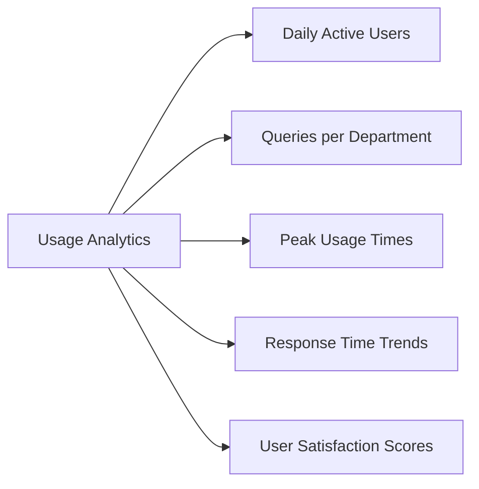

**📚 Knowledge Management**
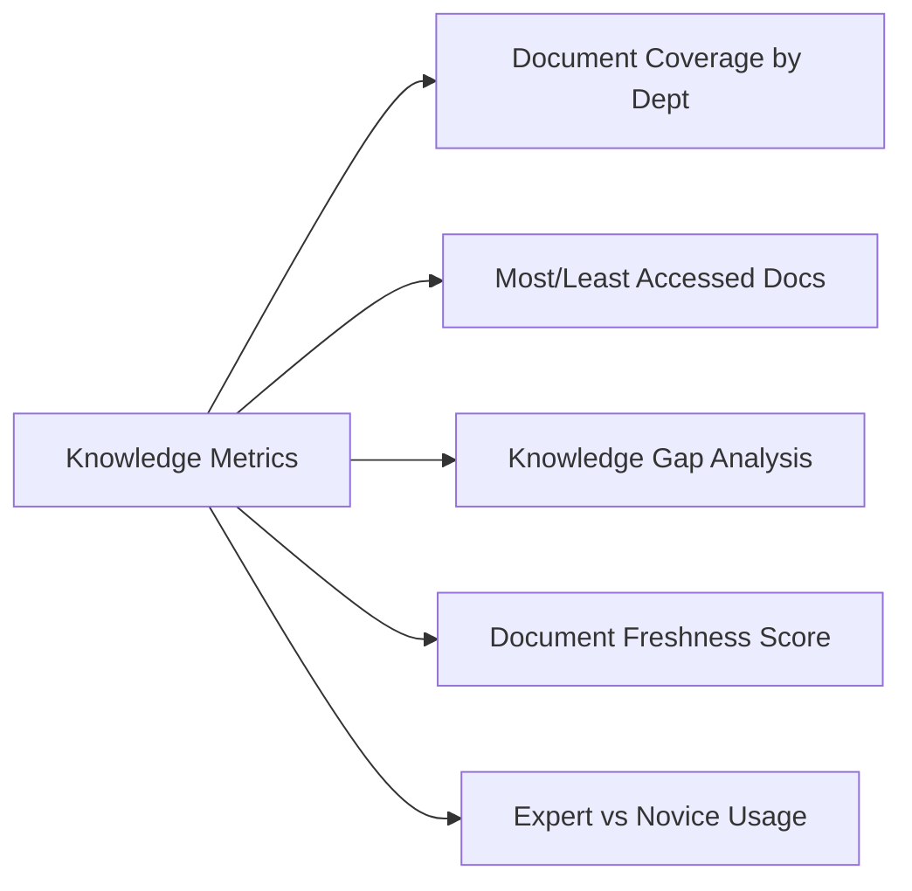

**🎯 Performance Metrics**
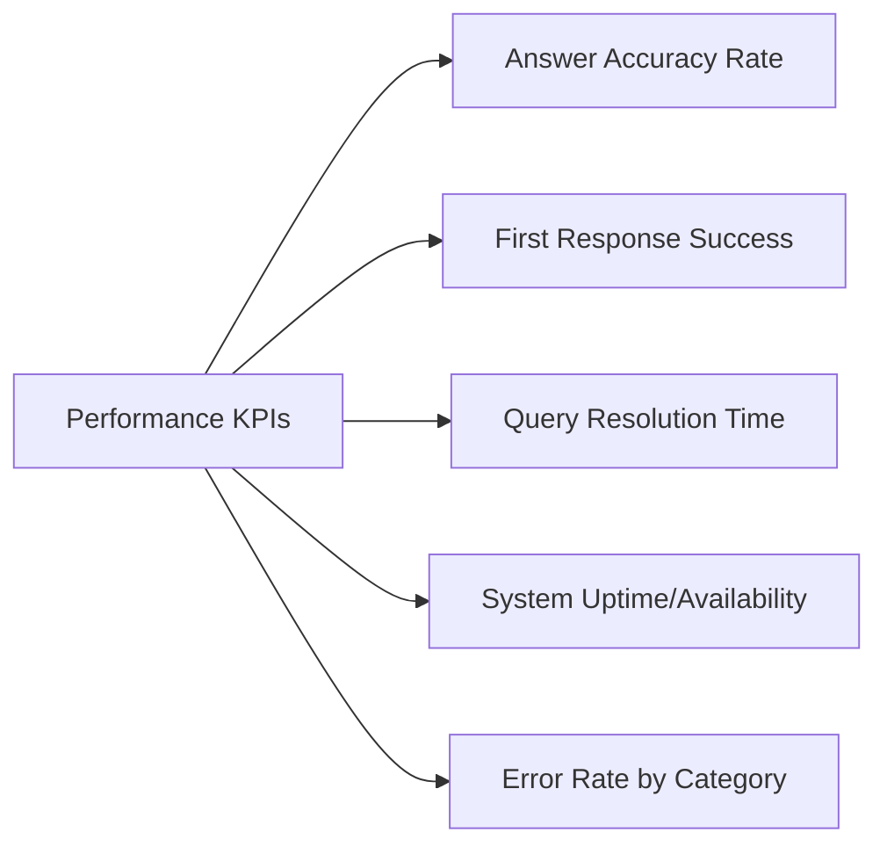

### 🔄 **Alternative Flows (Luồng thay thế)**

**A1: Custom Report Generation**
```
4a. Director yêu cầu custom report với specific parameters
4b. System show report builder interface
4c. Director select metrics, time range, departments, filters
4d. System validate parameters và estimate processing time
4e. System generate custom report và notify when ready
```

**A2: Real-time Dashboard View**
```
5a. Director chọn real-time dashboard mode
5b. System enable live data streaming
5c. System refresh metrics every 30 seconds
5d. System highlight significant changes/alerts
5e. Director có thể pause/resume real-time updates
```

**A3: Comparative Analysis**
```
6a. Director request comparison between time periods
6b. System present side-by-side metrics
6c. System highlight trends, improvements, declines
6d. System provide statistical significance indicators
```

### ❌ **Exception Flows (Luồng ngoại lệ)**

**E1: Insufficient Data**
```
3a. System detect không đủ data để generate meaningful report
3b. System inform Director về data limitations
3c. System suggest minimum time period needed
3d. System offer partial report với available data
```

**E2: Report Generation Failure**
```
4a. Report generation process fails due to system error
4b. System log error details
4c. System notify Director về temporary unavailability
4d. System estimate recovery time
4e. System offer cached version of last successful report
```

### 📊 **Sample Report Sections**

**🏢 Executive Summary Dashboard**
```
┌─────────────────────────────────────────┐
│ ORGANIZATIONAL KNOWLEDGE HEALTH         │
├─────────────────────────────────────────┤
│ Total Active Users: 89/100              │
│ Knowledge Utilization: 76%              │
│ Average Response Accuracy: 84%          │
│ Critical Knowledge Gaps: 3              │
│                                         │
│ TOP PERFORMING DEPARTMENTS:             │
│ 1. R&D Department - 94% satisfaction    │
│ 2. Sales - 91% utilization             │
│ 3. Production - 88% accuracy           │
│                                         │
│ AREAS NEEDING ATTENTION:                │
│ • Finance dept low engagement (34%)     │
│ • Procurement procedures outdated       │
│ • Technical documentation gaps          │
└─────────────────────────────────────────┘
```

### ✅ **Postconditions (Điều kiện hậu)**
- Director có comprehensive view về organizational knowledge health
- Strategic insights được identified for decision making
- Report data được cached để improve performance
- Access được logged for governance

### 📊 **Acceptance Criteria**
- [ ] Report generation hoàn thành trong < 2 minutes
- [ ] Dashboard responsive trên mọi screen sizes
- [ ] Export functionality hoạt động cho all report formats
- [ ] Data accuracy 99%+ (cross-verified với source systems)
- [ ] Real-time updates không impact system performance
- [ ] Custom reports có thể save và schedule

---

## 🛡️ **UC16: CẤU HÌNH CHÍNH SÁCH PHÂN QUYỀN**

### 📋 **Thông tin cơ bản**
- **ID**: UC16
- **Tên**: Access Policy Configuration Management
- **Actor chính**: Director (Giám đốc)
- **Mục tiêu**: Cho phép giám đốc cấu hình và quản lý policies phân quyền toàn tổ chức
- **Độ ưu tiên**: CRITICAL
- **Độ phức tạp**: HIGH

### 🎯 **Preconditions (Điều kiện tiên quyết)**
- User có role = "Director"
- Access Policy Management module đã được activated
- Current policy configuration đã được backup
- No other director đang modify policies simultaneously

### 📝 **Main Flow (Luồng chính)**
```
1. Director access Policy Management Dashboard
2. System load current access control matrix
3. System present current policies theo department/role structure
4. Director select policy category to modify:
   - Document Access Levels
   - Department-wise Permissions
   - Role-based Access Control (RBAC)
   - Time-based Access Restrictions
   - IP/Location-based Access Control
5. System show current configuration với visual policy editor
6. Director make changes sử dụng intuitive interface
7. System validate policy changes for conflicts/security issues
8. System preview impact của changes trên existing users
9. Director review và approve changes
10. System implement changes với zero-downtime deployment
11. System notify affected users về policy changes
12. System log all changes với detailed audit trail
```

### 🔧 **Policy Configuration Categories**

#### 📄 **Document Access Level Management**
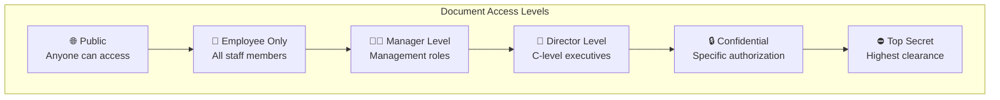

#### 🏢 **Department-wise Permission Matrix**
```
┌──────────────┬─────────┬─────────┬─────────┬─────────┬─────────┐
│ Department   │ Public  │ Own     │ Related │ Manager │ All     │
├──────────────┼─────────┼─────────┼─────────┼─────────┼─────────┤
│ R&D          │    ✓    │    ✓    │    ✓    │    ✓    │    ✗    │
│ Sales        │    ✓    │    ✓    │    ✓    │    ✓    │    ✗    │
│ Production   │    ✓    │    ✓    │    ✗    │    ✓    │    ✗    │
│ Finance      │    ✓    │    ✓    │    ✗    │    ✓    │    ✗    │
│ HR           │    ✓    │    ✓    │    ✗    │    ✓    │    ✗    │
│ IT           │    ✓    │    ✓    │    ✓    │    ✓    │    ✓    │
└──────────────┴─────────┴─────────┴─────────┴─────────┴─────────┘
```

### 🔄 **Alternative Flows (Luồng thay thế)**

**A1: Bulk Policy Import**
```
4a. Director chọn import policies từ template hoặc file
4b. System validate import format và structure
4c. System show preview của imported policies
4d. System highlight conflicts với existing policies
4e. Director resolve conflicts và approve import
4f. System apply imported policies theo staging process
```

**A2: Emergency Access Grant**
```
6a. Director cần grant temporary access trong emergency
6b. System present Emergency Access interface
6c. Director specify user, resources, time limit, reason
6d. System require additional authentication (2FA)
6e. System grant temporary access với auto-expiry
6f. System send immediate notifications tới relevant stakeholders
```

**A3: Policy Template Management**
```
5a. Director create reusable policy templates
5b. System validate template structure
5c. Director save template với descriptive name
5d. System make template available for future use
5e. Director có thể share templates với other directors
```

### 📊 **Policy Editor Interface Design**

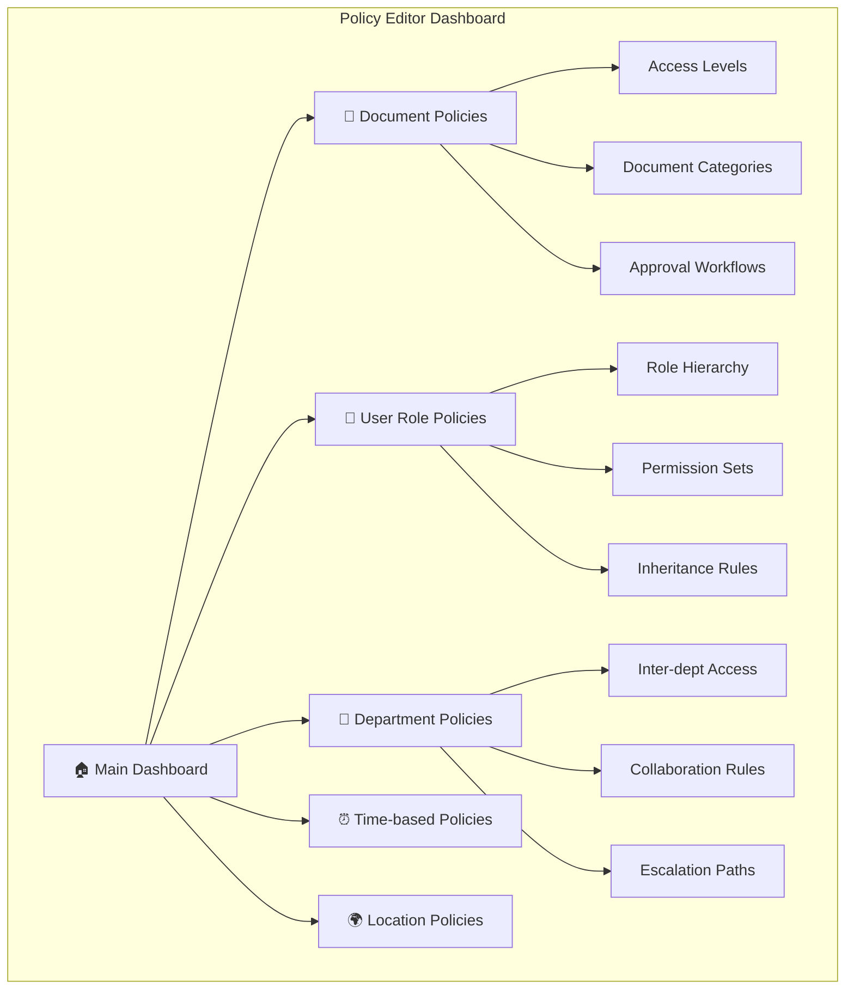

### ❌ **Exception Flows (Luồng ngoại lệ)**

**E1: Policy Conflict Detection**
```
7a. System detect conflicting policies during validation
7b. System highlight specific conflicts với detailed explanation
7c. System suggest resolution options
7d. Director must resolve all conflicts before proceeding
7e. System re-validate after each conflict resolution
```

**E2: Impact Assessment Shows Risk**
```
8a. Impact preview shows potential security risks
8b. System present detailed risk assessment
8c. System require Director acknowledgment của risks
8d. System may require additional approvals for high-risk changes
8e. Director có thể modify policies để mitigate risks
```

**E3: Policy Deployment Failure**
```
10a. Policy deployment fails due to system error
10b. System immediately rollback to previous configuration  
10c. System notify Director về failure với error details
10d. System log incident for investigation
10e. System suggest alternative deployment strategies
```

### 🔒 **Security Safeguards**

**Multi-level Approval Process:**
```
High Impact Changes → Require 2FA → Impact Assessment → 
Peer Review (Optional) → Staged Rollout → Monitoring → Full Deployment
```

**Automatic Rollback Triggers:**
```
- System performance degradation > 20%
- Authentication failure rate > 5%
- Policy conflict detection post-deployment
- User accessibility issues > 10% of workforce
```

### 📋 **Common Policy Templates**

**🏢 New Department Onboarding**
```yaml
template_name: "new_department_setup"
default_permissions:
  public_docs: read
  own_dept_docs: read_write
  related_dept_docs: read_with_approval
  confidential_docs: none
escalation_path: "dept_manager → director → system_admin"
collaboration_rules:
  can_share_with: ["related_departments"]
  requires_approval_for: ["external_sharing"]
```

**👤 Executive Access Package**
```yaml
template_name: "executive_access"
access_levels:
  - public: full_access
  - employee_only: full_access
  - manager_only: full_access
  - director_level: full_access
  - confidential: read_only
restrictions:
  - cannot_modify_system_config
  - audit_trail_mandatory
  - session_timeout: 60_minutes
```

### ✅ **Postconditions (Điều kiện hậu)**
- Policy changes được applied successfully across hệ thống
- All affected users được notified về changes
- Complete audit trail được tạo
- System security posture được maintained or improved
- Backup của previous configuration available for rollback

### 📊 **Acceptance Criteria**
- [ ] Policy changes take effect trong < 5 minutes
- [ ] Zero security vulnerabilities introduced by changes
- [ ] 100% của affected users receive notifications
- [ ] Policy editor có comprehensive validation
- [ ] Rollback capability available for 30 days
- [ ] Audit logs capture every policy modification
- [ ] Performance impact < 2% during policy updates
- [ ] User accessibility maintained during transitions

---

## 🔗 **TÍCH HỢP GIỮA CÁC USE CASE**

### 🔄 **UC14 ↔ UC16 Integration**
Khi Director modify access policies (UC16), changes immediately ảnh hưởng đến document access scope trong UC14:

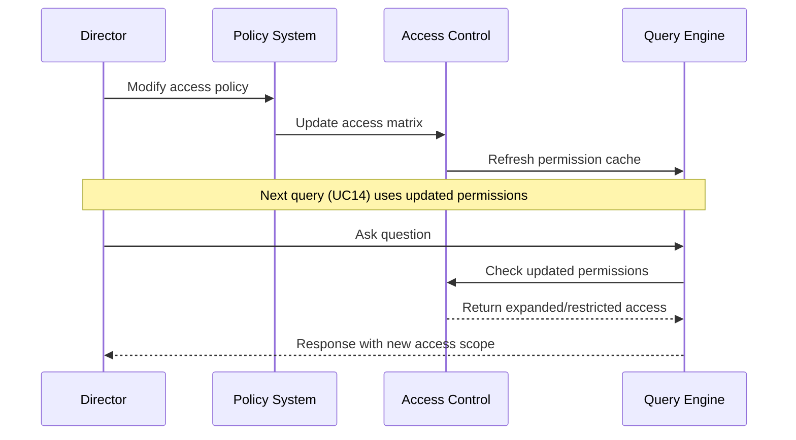

### 📊 **UC15 ↔ UC16 Integration**
Policy changes (UC16) immediately reflect trong organizational reports (UC15):

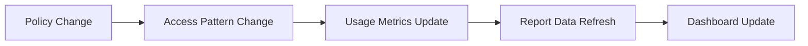

### 🎯 **Business Value của Director Use Cases**

**🔍 Strategic Oversight (UC14)**
- Complete organizational knowledge visibility
- Cross-functional decision making capability
- Strategic planning với full information access

**📈 Performance Management (UC15)**  
- Data-driven organizational improvements
- Knowledge management ROI measurement
- Strategic resource allocation decisions

**🛡️ Governance & Compliance (UC16)**
- Regulatory compliance management
- Risk mitigation through proper access control
- Organizational security policy enforcement

**💼 Executive Decision Support**
Tất cả 3 use cases work together để provide Directors với:
- **Comprehensive information access** (UC14)
- **Performance insights** (UC15)  
- **Control mechanisms** (UC16)

Tạo thành một **complete executive knowledge management platform**!
# CHI TIẾT USE CASES CHO SYSTEM ADMIN

## UC17: 👤 **QUẢN LÝ TÀI KHOẢN VÀ PHÂN QUYỀN NGƯỜI DÙNG**

### 📋 **Mô tả tổng quan**
System Admin quản lý toàn bộ lifecycle của người dùng và thiết lập phân quyền truy cập tài liệu theo cấp độ bảo mật.

### 🎯 **Mục tiêu**
- Quản lý tài khoản người dùng (CRUD operations)
- Phân quyền truy cập theo role-based access control (RBAC)
- Theo dõi hoạt động của người dùng
- Đảm bảo compliance và audit trail

### 📝 **Đặc tả chi tiết**

#### **UC17.1 - Quản lý Tài khoản Người dùng**

**Pre-conditions:**
- Admin đã đăng nhập với quyền system_admin
- Database connection available

**Main Flow:**
1. Admin truy cập User Management Dashboard
2. Hệ thống hiển thị danh sách người dùng với filters:
   - Theo department (15 phòng ban)
   - Theo role (Guest, Employee, Manager, Director)
   - Theo trạng thái (Active, Inactive, Suspended)
   - Theo ngày tạo/cập nhật cuối

3. **Tạo người dùng mới:**
   ```json
   {
     "username": "nguyen.van.a",
     "email": "nguyen.van.a@company.com",
     "full_name": "Nguyễn Văn A",
     "department": "rd_department",
     "role": "employee",
     "access_level": "employee_only",
     "phone": "+84123456789",
     "employee_id": "EMP001",
     "manager_id": "MGR001",
     "start_date": "2025-09-01",
     "status": "active"
   }
   ```

4. **Cập nhật thông tin người dùng:**
   - Thay đổi department (khi chuyển bộ phận)
   - Nâng cấp/hạ cấp role
   - Cập nhật access_level
   - Thay đổi trạng thái tài khoản

5. **Deactivate/Suspend tài khoản:**
   - Soft delete (giữ lại data cho audit)
   - Revoke tất cả active sessions
   - Archive user history

**Alternative Flows:**
- **A1**: Import bulk users từ CSV/Excel file
- **A2**: Sync từ AD/LDAP system (future integration)

**Post-conditions:**
- User record được tạo/cập nhật trong database
- Audit log ghi lại tất cả thay đổi
- Email notification gửi cho user (nếu applicable)

---

#### **UC17.2 - Phân Quyền Truy Cập (RBAC)**

**Access Control Matrix:**

| Resource Type | Guest | Employee | Manager | Director | System Admin |
|---------------|--------|----------|---------|-----------|--------------|
| **Public Documents** | Read | Read | Read | Read | Full Control |
| **Employee Documents** | ❌ | Read | Read | Read | Full Control |
| **Manager Documents** | ❌ | ❌ | Read | Read | Full Control |
| **Director Documents** | ❌ | ❌ | ❌ | Read | Full Control |
| **System Settings** | ❌ | ❌ | ❌ | ❌ | Full Control |

**Detailed Permission Management:**

```json
{
  "role_permissions": {
    "guest": {
      "documents": ["public"],
      "actions": ["read", "search"],
      "api_endpoints": ["/api/search", "/api/documents/public"],
      "rate_limit": "100/hour"
    },
    "employee": {
      "documents": ["public", "employee_only"],
      "actions": ["read", "search", "export"],
      "api_endpoints": ["/api/search", "/api/documents/employee", "/api/export"],
      "rate_limit": "500/hour",
      "department_filter": true
    },
    "manager": {
      "documents": ["public", "employee_only", "manager_only"],
      "actions": ["read", "search", "export", "approve_requests"],
      "api_endpoints": ["/api/search", "/api/documents/manager", "/api/approvals"],
      "rate_limit": "1000/hour",
      "team_access": true
    },
    "director": {
      "documents": ["all_except_system"],
      "actions": ["read", "search", "export", "configure_policies"],
      "api_endpoints": ["/api/search", "/api/documents/all", "/api/policies"],
      "rate_limit": "unlimited"
    }
  }
}
```

---

## UC18: 📄 **QUẢN LÝ TÀI LIỆU**

### 📋 **Mô tả tổng quan**
Quản lý toàn bộ lifecycle của tài liệu từ upload, phân loại, versioning đến archive/delete.

### 🎯 **Mục tiêu**
- Centralized document management
- Ensure data quality và consistency
- Version control và audit trail
- Efficient search và categorization

### 📝 **Đặc tả chi tiết**

#### **UC18.1 - Document Upload & Processing**

**Bulk Upload Interface:**
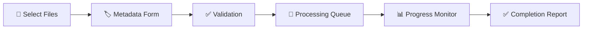

**Metadata Schema:**
```json
{
  "document_metadata": {
    "basic_info": {
      "title": "Quy trình Mua hàng v2.1",
      "description": "Quy trình mua hàng được cập nhật",
      "document_type": "procedure",
      "language": "vi-VN",
      "file_format": "pdf",
      "file_size": 2048000
    },
    "classification": {
      "access_level": "employee_only",
      "department_owner": "procurement",
      "security_classification": "internal",
      "retention_period": "5_years",
      "compliance_tags": ["ISO_9001", "company_policy"]
    },
    "authorship": {
      "author": "Nguyễn Văn B",
      "author_id": "EMP002",
      "created_date": "2025-08-30",
      "last_modified": "2025-08-30",
      "version": "2.1",
      "approved_by": "manager_001"
    },
    "technical": {
      "chunk_strategy": "semantic_sections",
      "embedding_model": "multilingual-e5-large",
      "index_status": "pending",
      "quality_score": null
    }
  }
}
```

#### **UC18.2 - Document Categories & Tagging**

**Document Type Taxonomy:**
```
📋 Company Documents
├── 📜 Policies & Procedures
│   ├── HR Policies
│   ├── Financial Procedures  
│   ├── IT Policies
│   └── Safety Procedures
├── 🔧 Technical Documentation
│   ├── Product Specifications
│   ├── Installation Guides
│   ├── Maintenance Manuals
│   └── Troubleshooting Guides
├── 📊 Reports & Analytics
│   ├── Monthly Reports
│   ├── Project Reports
│   └── Performance Analytics
└── 📚 Training Materials
    ├── Onboarding Materials
    ├── Skill Development
    └── Compliance Training
```

**Auto-tagging System:**
- **Content Analysis**: AI-powered categorization
- **Keyword Extraction**: Automatic tag suggestions
- **Department Detection**: Based on content và metadata
- **Version Detection**: Automatic version identification

#### **UC18.3 - Version Control**

**Version Management:**
```json
{
  "version_control": {
    "document_id": "doc_001",
    "versions": [
      {
        "version": "1.0",
        "created": "2025-01-15",
        "author": "admin",
        "status": "archived",
        "changes": "Initial version"
      },
      {
        "version": "2.0",
        "created": "2025-06-01",
        "author": "emp_001",
        "status": "archived", 
        "changes": "Major update - added new procedures"
      },
      {
        "version": "2.1",
        "created": "2025-08-30",
        "author": "emp_002",
        "status": "current",
        "changes": "Minor corrections in section 3.2"
      }
    ],
    "approval_workflow": {
      "required": true,
      "approver_role": "manager",
      "status": "approved"
    }
  }
}
```

---

## UC19: ⚙️ **CẤU HÌNH HỆ THỐNG**

### 📋 **Mô tả tổng quan**
Quản lý tất cả system parameters, AI models configuration, và business rules.

### 🎯 **Configuration Categories**

#### **UC19.1 - AI & ML Configuration**

**Embedding Models Settings:**
```json
{
  "embedding_config": {
    "primary_model": {
      "name": "multilingual-e5-large",
      "provider": "huggingface",
      "dimensions": 1024,
      "max_tokens": 512,
      "batch_size": 32,
      "cache_ttl": "24h"
    },
    "fallback_models": [
      {
        "name": "all-mpnet-base-v2",
        "provider": "sentence-transformers"
      }
    ],
    "model_comparison": {
      "test_dataset": "internal_qa_100.json",
      "metrics": ["hit_rate", "mrr", "response_time"],
      "benchmark_schedule": "weekly"
    }
  }
}
```

**LLM Configuration:**
```json
{
  "llm_config": {
    "primary_llm": {
      "provider": "openai",
      "model": "gpt-4-turbo",
      "max_tokens": 4096,
      "temperature": 0.3,
      "timeout": "45s"
    },
    "fallback_llm": {
      "provider": "anthropic", 
      "model": "claude-3-sonnet"
    },
    "cost_control": {
      "daily_budget": "$100",
      "per_user_limit": "50_requests/day",
      "cache_strategy": "aggressive"
    }
  }
}
```

#### **UC19.2 - Search & Retrieval Settings**

```json
{
  "search_config": {
    "retrieval": {
      "top_k_documents": 5,
      "similarity_threshold": 0.75,
      "hybrid_search_weights": {
        "semantic": 0.7,
        "keyword": 0.3
      },
      "reranking": {
        "enabled": true,
        "model": "cross-encoder/ms-marco"
      }
    },
    "chunking": {
      "strategy": "recursive_character",
      "chunk_size": 800,
      "chunk_overlap": 200,
      "separators": ["\n\n", "\n", ". ", " "]
    },
    "caching": {
      "query_cache_ttl": "1h",
      "embedding_cache_ttl": "24h",
      "max_cache_size": "10GB"
    }
  }
}
```

#### **UC19.3 - Security & Compliance Settings**

```json
{
  "security_config": {
    "authentication": {
      "session_timeout": "8h",
      "max_concurrent_sessions": 3,
      "password_policy": {
        "min_length": 8,
        "require_special_chars": true,
        "expiry_days": 90
      }
    },
    "data_protection": {
      "encryption_at_rest": "AES-256",
      "encryption_in_transit": "TLS-1.3",
      "key_rotation_days": 30,
      "pii_detection": true
    },
    "audit": {
      "log_retention_days": 365,
      "log_level": "INFO",
      "audit_failed_attempts": true,
      "notify_security_events": true
    }
  }
}
```

---

## UC20: 📊 **GIÁM SÁT HIỆU SUẤT VÀ USAGE METRICS**

### 📋 **Monitoring Dashboard**

#### **UC20.1 - System Performance Metrics**

**Real-time Metrics:**
```json
{
  "performance_metrics": {
    "response_times": {
      "avg_query_time": "2.3s",
      "p95_query_time": "5.1s", 
      "p99_query_time": "8.7s",
      "target_sla": "<60s"
    },
    "throughput": {
      "queries_per_second": 15,
      "concurrent_users": 45,
      "peak_concurrent": 89
    },
    "system_resources": {
      "cpu_usage": "65%",
      "memory_usage": "78%",
      "disk_usage": "45%",
      "gpu_usage": "23%"
    },
    "error_rates": {
      "4xx_errors": "2.1%",
      "5xx_errors": "0.3%",
      "timeout_errors": "0.1%"
    }
  }
}
```

#### **UC20.2 - Usage Analytics**

**User Behavior Analytics:**
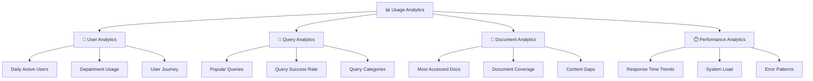

**Detailed Usage Reports:**
```json
{
  "usage_report": {
    "time_period": "last_30_days",
    "user_metrics": {
      "total_users": 89,
      "active_users": 67,
      "new_users": 8,
      "user_retention": "75%",
      "avg_sessions_per_user": 4.2
    },
    "query_metrics": {
      "total_queries": 2847,
      "unique_queries": 1923,
      "avg_queries_per_user": 42,
      "success_rate": "94.2%",
      "most_common_topics": [
        "procurement_procedures",
        "hr_policies", 
        "technical_specifications"
      ]
    },
    "document_metrics": {
      "total_documents": 3421,
      "documents_accessed": 1876,
      "coverage_rate": "54.8%",
      "top_documents": [
        "employee_handbook.pdf",
        "procurement_process_v2.1.pdf"
      ]
    }
  }
}
```

#### **UC20.3 - Alerting & Notifications**

**Alert Configuration:**
```json
{
  "alerts": {
    "performance_alerts": [
      {
        "metric": "avg_response_time",
        "threshold": "30s",
        "severity": "warning",
        "notification": "email_slack"
      },
      {
        "metric": "error_rate",
        "threshold": "5%",
        "severity": "critical",
        "notification": "sms_email_slack"
      }
    ],
    "usage_alerts": [
      {
        "metric": "concurrent_users", 
        "threshold": "90",
        "severity": "info",
        "notification": "slack"
      }
    ],
    "system_alerts": [
      {
        "metric": "disk_usage",
        "threshold": "85%",
        "severity": "warning",
        "notification": "email"
      }
    ]
  }
}
```

---

## UC21: 🤖 **QUẢN LÝ EMBEDDING MODELS VÀ AI COMPONENTS**

### 📋 **Mô tả tổng quan**
Quản lý và tối ưu hóa AI models, thực hiện A/B testing, và monitor model performance.

#### **UC21.1 - Model Lifecycle Management**

**Model Registry:**
```json
{
  "model_registry": {
    "embedding_models": [
      {
        "id": "emb_001",
        "name": "multilingual-e5-large",
        "version": "1.0",
        "status": "production",
        "deployment_date": "2025-08-15",
        "performance_score": 0.87,
        "resource_usage": "2GB RAM",
        "test_results": {
          "hit_rate": 0.92,
          "mrr": 0.78,
          "avg_response_time": "150ms"
        }
      },
      {
        "id": "emb_002", 
        "name": "all-mpnet-base-v2",
        "version": "1.0",
        "status": "testing",
        "test_results": {
          "hit_rate": 0.89,
          "mrr": 0.74,
          "avg_response_time": "120ms"
        }
      }
    ]
  }
}
```

#### **UC21.2 - Model A/B Testing Framework**

**Testing Configuration:**
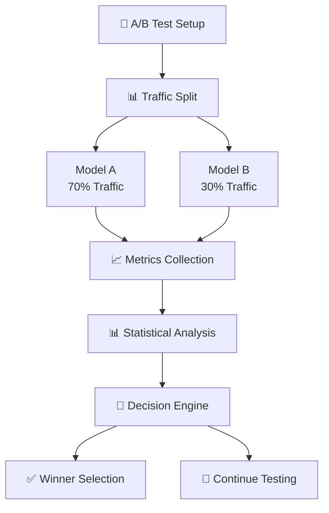

**Testing Metrics:**
```json
{
  "ab_test": {
    "test_id": "emb_test_001",
    "models": {
      "control": "multilingual-e5-large",
      "variant": "all-mpnet-base-v2"
    },
    "traffic_split": "70/30",
    "duration": "14_days",
    "metrics": {
      "control": {
        "hit_rate": 0.92,
        "mrr": 0.78,
        "user_satisfaction": 4.2,
        "avg_response_time": "150ms"
      },
      "variant": {
        "hit_rate": 0.89,
        "mrr": 0.74,
        "user_satisfaction": 4.1,
        "avg_response_time": "120ms"
      }
    },
    "statistical_significance": 0.95,
    "recommendation": "continue_with_control"
  }
}
```

#### **UC21.3 - Model Performance Optimization**

**Performance Tuning:**
- **Hyperparameter Optimization**: Grid search cho optimal parameters
- **Model Quantization**: Giảm model size mà không ảnh hưởng accuracy
- **Caching Strategies**: Intelligent caching cho frequently used embeddings
- **Batch Processing**: Optimize batch sizes cho throughput

---

## UC22: ✅ **KIỂM SOÁT CHẤT LƯỢNG DỮ LIỆU**

### 📋 **Data Quality Framework**

#### **UC22.1 - Automated Quality Checks**

**Quality Dimensions:**
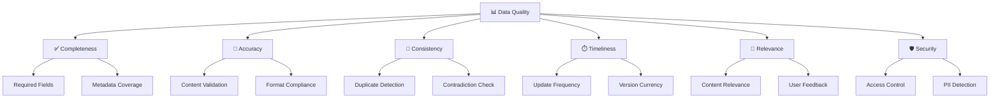

**Quality Scoring Algorithm:**
```json
{
  "quality_scoring": {
    "document_id": "doc_001",
    "overall_score": 8.7,
    "detailed_scores": {
      "completeness": {
        "score": 9.2,
        "checks": {
          "metadata_complete": true,
          "content_not_empty": true,
          "required_fields": true
        }
      },
      "accuracy": {
        "score": 8.5,
        "checks": {
          "format_valid": true,
          "encoding_correct": true,
          "content_readable": true
        }
      },
      "consistency": {
        "score": 8.1,
        "checks": {
          "no_duplicates": true,
          "version_consistent": true,
          "metadata_aligned": false
        }
      },
      "timeliness": {
        "score": 9.0,
        "checks": {
          "recently_updated": true,
          "version_current": true
        }
      }
    },
    "issues_found": [
      {
        "type": "metadata_mismatch",
        "severity": "medium",
        "description": "Document type in content differs from metadata"
      }
    ],
    "recommendations": [
      "Update metadata to match document content",
      "Review and validate technical specifications section"
    ]
  }
}
```

#### **UC22.2 - Duplicate Detection Engine**

**Multi-level Duplicate Detection:**
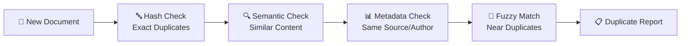

**Detection Results:**
```json
{
  "duplicate_detection": {
    "document_id": "doc_new_001",
    "scan_timestamp": "2025-08-30T10:30:00Z",
    "duplicates_found": [
      {
        "existing_doc_id": "doc_existing_045",
        "similarity_score": 0.94,
        "duplicate_type": "semantic",
        "confidence": "high",
        "differences": [
          "Version number in header",
          "Minor text corrections in section 3"
        ]
      }
    ],
    "recommendation": "merge_as_new_version",
    "action_required": true
  }
}
```

#### **UC22.3 - Content Validation Rules**

**Business Rules Engine:**
```json
{
  "validation_rules": {
    "document_structure": [
      {
        "rule": "must_have_title",
        "severity": "critical",
        "description": "Every document must have a clear title"
      },
      {
        "rule": "section_headers_required",
        "severity": "warning", 
        "description": "Documents >1000 words should have section headers"
      }
    ],
    "content_quality": [
      {
        "rule": "no_placeholder_text",
        "severity": "critical",
        "pattern": "\\[TODO\\]|\\[PLACEHOLDER\\]|\\[TBD\\]"
      },
      {
        "rule": "minimum_word_count",
        "severity": "warning",
        "threshold": 50
      }
    ],
    "compliance": [
      {
        "rule": "no_personal_info",
        "severity": "critical",
        "description": "Check for PII in public documents"
      },
      {
        "rule": "proper_classification",
        "severity": "medium",
        "description": "Access level must match content sensitivity"
      }
    ]
  }
}
```

---

## UC23: 🛡️ **THỰC HIỆN AUDIT BẢO MẬT**

### 📋 **Security Audit Framework**

#### **UC23.1 - Access Audit**

**Audit Dashboard:**
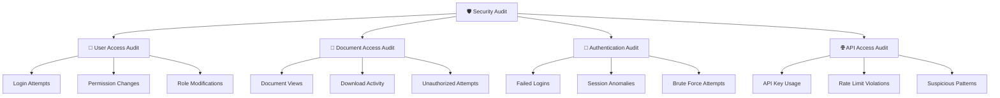

**Audit Log Entry:**
```json
{
  "audit_log": {
    "timestamp": "2025-08-30T14:22:15Z",
    "event_id": "audit_001",
    "event_type": "document_access",
    "severity": "info",
    "user": {
      "user_id": "emp_001",
      "username": "nguyen.van.a",
      "role": "employee",
      "department": "rd_department",
      "ip_address": "192.168.1.100"
    },
    "resource": {
      "document_id": "doc_456",
      "document_title": "Technical Specification v2.0",
      "access_level": "manager_only"
    },
    "action": "view_attempt",
    "result": "denied",
    "reason": "insufficient_permissions",
    "risk_score": 3
  }
}
```

#### **UC23.2 - Security Vulnerability Scan**

**Vulnerability Categories:**
```json
{
  "security_scan": {
    "scan_id": "sec_scan_001",
    "scan_date": "2025-08-30",
    "scan_type": "comprehensive",
    "findings": {
      "critical": [
        {
          "vulnerability": "exposed_api_endpoint",
          "location": "/api/internal/debug",
          "description": "Debug endpoint accessible without authentication",
          "cvss_score": 9.1,
          "recommendation": "Remove or secure debug endpoint"
        }
      ],
      "high": [
        {
          "vulnerability": "weak_password_policy",
          "location": "user_management_module",
          "description": "Password complexity requirements too lenient",
          "cvss_score": 7.2,
          "recommendation": "Implement stronger password policy"
        }
      ],
      "medium": [
        {
          "vulnerability": "missing_rate_limiting",
          "location": "/api/search",
          "description": "No rate limiting on search endpoint",
          "cvss_score": 5.5,
          "recommendation": "Implement API rate limiting"
        }
      ]
    },
    "remediation_plan": {
      "critical_fixes": "within_24_hours",
      "high_fixes": "within_7_days",
      "medium_fixes": "within_30_days"
    }
  }
}
```

#### **UC23.3 - Compliance Reporting**

**Compliance Standards:**
- **ISO 27001**: Information Security Management
- **GDPR**: Data Protection và Privacy
- **SOC 2**: Security, Availability, Processing Integrity
- **Company Policy**: Internal compliance requirements

---

## UC24: 💾 **SAO LƯU VÀ KHÔI PHỤC DỮ LIỆU**

### 📋 **Backup & Recovery Strategy**

#### **UC24.1 - Automated Backup System**

**Backup Architecture:**
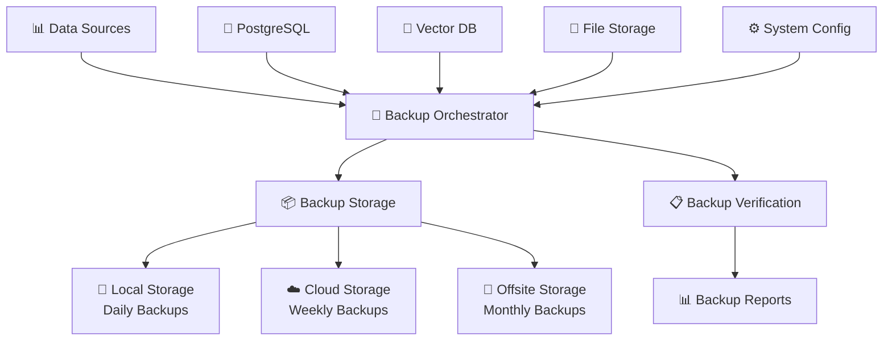

**Backup Schedule:**
```json
{
  "backup_schedule": {
    "database_backups": {
      "frequency": "every_6_hours",
      "retention": {
        "hourly": "7_days",
        "daily": "30_days", 
        "weekly": "12_weeks",
        "monthly": "12_months"
      },
      "backup_method": "pg_dump_with_compression"
    },
    "vector_db_backups": {
      "frequency": "daily",
      "retention": "30_days",
      "backup_method": "full_snapshot"
    },
    "file_storage_backups": {
      "frequency": "daily",
      "retention": "90_days",
      "backup_method": "incremental_rsync"
    },
    "system_configuration": {
      "frequency": "before_each_deployment",
      "retention": "indefinite",
      "backup_method": "git_repository"
    }
  }
}
```

#### **UC24.2 - Disaster Recovery Plan**

**Recovery Time Objectives (RTO) & Recovery Point Objectives (RPO):**
```json
{
  "recovery_objectives": {
    "critical_systems": {
      "rto": "4_hours",
      "rpo": "1_hour",
      "components": ["user_authentication", "core_search", "database"]
    },
    "important_systems": {
      "rto": "24_hours", 
      "rpo": "6_hours",
      "components": ["document_upload", "analytics", "reporting"]
    },
    "non_critical_systems": {
      "rto": "72_hours",
      "rpo": "24_hours", 
      "components": ["audit_logs", "usage_statistics", "admin_tools"]
    }
  }
}
```

**Recovery Procedures:**
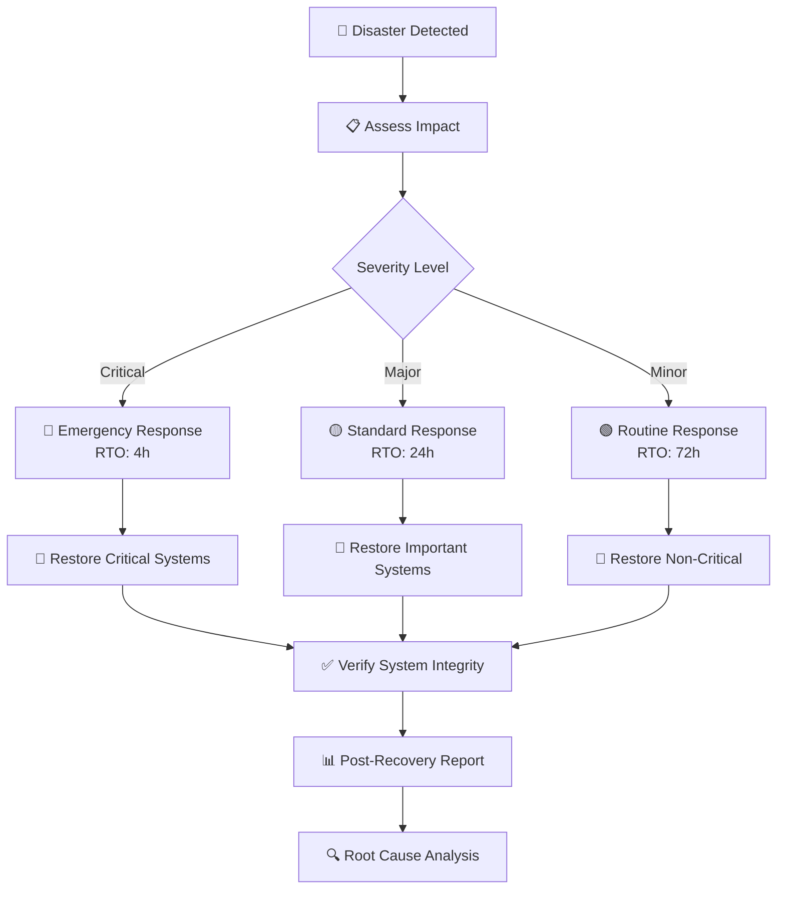

#### **UC24.3 - Backup Monitoring & Verification**

**Backup Health Dashboard:**
```json
{
  "backup_status": {
    "last_24_hours": {
      "postgresql": {
        "status": "success",
        "timestamp": "2025-08-30T02:00:00Z",
        "size": "2.3GB",
        "duration": "12_minutes",
        "verification": "passed"
      },
      "vector_db": {
        "status": "success", 
        "timestamp": "2025-08-30T02:30:00Z",
        "size": "8.7GB",
        "duration": "45_minutes",
        "verification": "passed"
      },
      "file_storage": {
        "status": "partial_failure",
        "timestamp": "2025-08-30T03:00:00Z", 
        "size": "156GB",
        "duration": "2_hours_15_minutes",
        "verification": "failed",
        "error": "3 files could not be accessed due to permission issues"
      }
    },
    "alerts": [
      {
        "severity": "warning",
        "message": "File storage backup partially failed",
        "timestamp": "2025-08-30T03:15:00Z",
        "action_required": "Check file permissions on storage server"
      }
    ]
  }
}
```

**Automated Backup Testing:**
```json
{
  "backup_testing": {
    "test_schedule": "weekly",
    "test_types": [
      {
        "type": "restore_test",
        "description": "Restore random subset of data to test environment",
        "frequency": "weekly",
        "success_rate": "98.5%"
      },
      {
        "type": "integrity_check",
        "description": "Verify backup file integrity and checksums",
        "frequency": "daily",
        "success_rate": "99.9%"
      },
      {
        "type": "recovery_drill",
        "description": "Full disaster recovery simulation", 
        "frequency": "monthly",
        "last_test": "2025-08-15",
        "result": "success",
        "recovery_time": "3_hours_42_minutes"
      }
    ]
  }
}
```

---

## 🔄 **SYSTEM ADMIN WORKFLOW INTEGRATION**

### **Daily Admin Tasks Dashboard:**
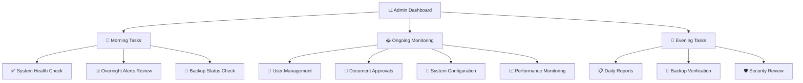

### **Admin Notification System:**
```json
{
  "notification_config": {
    "critical_alerts": {
      "channels": ["sms", "email", "slack"],
      "response_time": "immediate",
      "escalation": "after_15_minutes"
    },
    "warning_alerts": {
      "channels": ["email", "slack"],
      "response_time": "within_1_hour",
      "escalation": "after_4_hours"
    },
    "info_alerts": {
      "channels": ["slack"],
      "response_time": "next_business_day",
      "escalation": "none"
    },
    "scheduled_reports": {
      "daily_summary": "8:00_AM",
      "weekly_analytics": "monday_9:00_AM", 
      "monthly_compliance": "first_tuesday_10:00_AM"
    }
  }
}
```

### **Admin Access Control:**
```json
{
  "admin_permissions": {
    "super_admin": {
      "can_delete_users": true,
      "can_modify_system_config": true,
      "can_access_audit_logs": true,
      "can_perform_backup_restore": true,
      "can_modify_security_settings": true
    },
    "system_admin": {
      "can_delete_users": false,
      "can_modify_system_config": true,
      "can_access_audit_logs": true, 
      "can_perform_backup_restore": true,
      "can_modify_security_settings": false
    },
    "data_admin": {
      "can_delete_users": false,
      "can_modify_system_config": false,
      "can_access_audit_logs": false,
      "can_perform_backup_restore": true,
      "can_modify_security_settings": false
    }
  }
}
```

---

## 📋 **ACCEPTANCE CRITERIA CHO SYSTEM ADMIN USE CASES**

### **UC17 - User Management:**
- ✅ Tạo/sửa/xóa user accounts trong <5 giây
- ✅ Bulk import 100+ users từ CSV file
- ✅ Role assignment với immediate effect
- ✅ Complete audit trail cho mọi user changes

### **UC18 - Document Management:**
- ✅ Upload và process 1000+ documents trong 1 batch
- ✅ Auto-categorization accuracy ≥85%
- ✅ Version control với complete history
- ✅ Search và filter documents by metadata

### **UC19 - System Configuration:**
- ✅ Real-time config updates không cần restart
- ✅ Config validation before applying
- ✅ Rollback capability cho critical settings
- ✅ A/B testing framework cho AI models

### **UC20 - Performance Monitoring:**
- ✅ Real-time metrics với <30s latency
- ✅ Alerting với configurable thresholds
- ✅ Historical data retention ≥12 months
- ✅ Custom dashboard creation

### **UC21 - AI Model Management:**
- ✅ Model comparison với statistical significance
- ✅ Zero-downtime model switching
- ✅ Performance regression detection
- ✅ Cost tracking và budget alerts

### **UC22 - Data Quality Control:**
- ✅ Automated quality scoring ≥90% accuracy
- ✅ Duplicate detection ≥95% precision
- ✅ Content validation rules engine
- ✅ Quality improvement recommendations

### **UC23 - Security Audit:**
- ✅ Complete access logging với tamper protection
- ✅ Automated vulnerability scanning
- ✅ Compliance reporting cho multiple standards
- ✅ Real-time security alerts

### **UC24 - Backup & Recovery:**
- ✅ RTO ≤4 hours cho critical systems
- ✅ RPO ≤1 hour cho critical data
- ✅ 99.9% backup success rate
- ✅ Automated recovery testing

---

## 🎯 **KẾT LUẬN**

System Admin Use Cases được thiết kế để:

1. **Comprehensive Management**: Bao phủ tất cả aspects của system lifecycle
2. **Automation-First**: Giảm manual work, tăng reliability
3. **Security-Focused**: Multi-layer security với comprehensive auditing
4. **Performance-Oriented**: Real-time monitoring và proactive optimization
5. **Disaster-Ready**: Robust backup và recovery procedures

Các Use Cases này đảm bảo hệ thống hoạt động ổn định, bảo mật, và có khả năng mở rộng theo yêu cầu của tổ chức 400 nhân viên trong 15 phòng ban.


