```mermaid
graph TD
    subgraph "Export Package Structure"
        A[manifest.json] 
        B[user_info.json]
        C[original/ folder]
        D[processed/ folder]
        E[signatures/ folder]
        F[validation/ folder]
        G[FOR_DATABASE/ folder]
        H[FOR_VECTOR_DB/ folder]
        I[FOR_SEARCH/ folder]
    end
    
    subgraph "Database Tables V6"
        J[(export_package_metadata)]
        K[(documents_metadata_v2)]
        L[(document_signatures)]
        M[(vietnamese_text_analysis)]
        N[(document_chunks_enhanced)]
        O[(vector_database_config)]
        P[(search_engine_config)]
        Q[(data_ingestion_jobs)]
    end
    
    A --> J
    B --> J
    C --> K
    D --> K
    E --> L
    F --> M
    G --> N
    H --> O
    I --> P
    
    subgraph "FR-03.3 Processing"
        Q --> K
        Q --> N
        Q --> O
        Q --> P
    end
    
    classDef package fill:#e3f2fd,stroke:#1976d2,stroke-width:2px
    classDef database fill:#e8f5e8,stroke:#388e3c,stroke-width:2px
    classDef processing fill:#fff3e0,stroke:#f57c00,stroke-width:2px
    
    class A,B,C,D,E,F,G,H,I package
    class J,K,L,M,N,O,P database
    class Q processing
```

Tôi hiểu vấn đề bạn đang gặp. Hãy để tôi phân tích schema database và export package structure để tạo mapping cụ thể cho FR-03.3.Tôi hiểu bạn đang rối với việc tracking giữa export package và database. Hãy để tôi phân tích schema V6 và tạo mapping cụ thể cho FR-03.3 import process.

## **🔍 PHÂN TÍCH EXPORT PACKAGE VS DATABASE SCHEMA**

### **1. MAPPING EXPORT PACKAGE → DATABASE TABLES**



### **2. DETAILED FILE → TABLE MAPPING**

#### **✅ Files được import (theo schema V6)**

| Export Package File | Database Table | JSONB Field | Status |
|-------------------|----------------|-------------|---------|
| `manifest.json` | `export_package_metadata` | `manifest_data` | ✅ Có table |
| `user_info.json` | `export_package_metadata` | `user_info` | ✅ Có table |
| `signatures/file_fingerprints.json` | `document_signatures` | `file_fingerprints` | ✅ Có table |
| `signatures/content_signatures.json` | `document_signatures` | `content_signatures` | ✅ Có table |
| `signatures/semantic_features.json` | `document_signatures` | `semantic_features` | ✅ Có table |
| `FOR_VECTOR_DB/embeddings_preparation.json` | `vector_database_config` | `embeddings_preparation` | ✅ Có table |
| `FOR_VECTOR_DB/similarity_features.json` | `vector_database_config` | `similarity_features` | ✅ Có table |
| `FOR_SEARCH/search_config.json` | `search_engine_config` | `search_config` | ✅ Có table |
| `FOR_SEARCH/search_document.json` | `search_engine_config` | `search_document` | ✅ Có table |
| `FOR_SEARCH/bm25_tokens.json` | `search_engine_config` | `bm25_config` | ✅ Có table |

#### **❌ Files chưa được import (thiếu mapping)**

| Export Package File | Đề xuất Table | Đề xuất Field | Vấn đề |
|-------------------|---------------|---------------|---------|
| `processed/content.jsonl` | `document_chunks_enhanced` | `chunk_content` | ❌ Cần parse JSONL |
| `processed/document.md` | `documents_metadata_v2` | `content` | ❌ Chưa có logic import |
| `processed/metadata.json` | `documents_metadata_v2` | Business fields | ❌ Chưa map fields |
| `validation/quality_score.json` | `vietnamese_text_analysis` | Quality fields | ❌ Chưa có logic |
| `validation/processing_stats.json` | `data_ingestion_jobs` | `processing_metadata` | ❌ Chưa import |
| `FOR_DATABASE/document_metadata.json` | `documents_metadata_v2` | Core fields | ❌ **QUAN TRỌNG** |
| `FOR_DATABASE/chunks_enhanced.jsonl` | `document_chunks_enhanced` | All fields | ❌ **QUAN TRỌNG** |
| `FOR_DATABASE/vietnamese_analysis.json` | `vietnamese_text_analysis` | All fields | ❌ **QUAN TRỌNG** |
| `FOR_DATABASE/ingestion_job_metadata.json` | `data_ingestion_jobs` | Job metadata | ❌ **QUAN TRỌNG** |

## **🚨 VẤN ĐỀ CHÍNH CẦN SỬA**

### **1. Thiếu source_document_id trong data_ingestion_jobs**

```sql
-- CẦN THÊM FIELD NÀY VÀO SCHEMA
ALTER TABLE data_ingestion_jobs 
ADD COLUMN IF NOT EXISTS source_document_id VARCHAR(255);

-- Index cho business ID lookup
CREATE INDEX IF NOT EXISTS idx_data_ingestion_jobs_source_document_id 
ON data_ingestion_jobs(source_document_id);
```

### **2. FOR_DATABASE/ folder chưa được import**

Đây là folder QUAN TRỌNG NHẤT vì chứa dữ liệu sẵn sàng cho database nhưng chưa có logic import.

## **📋 GIẢI PHÁP CHO FR-03.3 IMPORT PROCESS**

### **Bước 1: Sửa schema database**

```sql
-- Thêm source_document_id cho dual ID tracking
ALTER TABLE data_ingestion_jobs 
ADD COLUMN IF NOT EXISTS source_document_id VARCHAR(255);

-- Thêm index
CREATE INDEX IF NOT EXISTS idx_data_ingestion_jobs_source_document_id 
ON data_ingestion_jobs(source_document_id);

-- Thêm constraint duy nhất cho source_document_id
ALTER TABLE documents_metadata_v2 
ADD COLUMN IF NOT EXISTS source_document_id VARCHAR(255) UNIQUE;

CREATE INDEX IF NOT EXISTS idx_documents_source_document_id 
ON documents_metadata_v2(source_document_id);
```

### **Bước 2: FR-03.3 Import Logic cần implement**

```python
# Pseudo-code cho complete import process
async def import_export_package(package_path: str):
    """Complete import của export package vào database"""
    
    # Step 1: Extract và validate package
    package_data = extract_package(package_path)
    
    # Step 2: Đọc source_document_id từ FOR_DATABASE/document_metadata.json
    doc_metadata = package_data["FOR_DATABASE"]["document_metadata.json"]
    source_document_id = doc_metadata["source_document_id"]  # Business ID
    
    # Step 3: Check duplicate
    existing_doc = await check_duplicate_by_source_id(source_document_id)
    
    # Step 4: Tạo database UUIDs
    if existing_doc:
        database_document_id = existing_doc.document_id
        is_duplicate = True
    else:
        database_document_id = uuid4()
        is_duplicate = False
    
    job_id = uuid4()
    
    # Step 5: Tạo ingestion job với dual ID
    job_data = {
        "job_id": job_id,
        "database_document_id": database_document_id,
        "source_document_id": source_document_id,  # Business ID
        "source_package": package_path,
        "status": "PROCESSING"
    }
    await insert_ingestion_job(job_data)
    
    # Step 6: Import TỪNG FILE theo mapping
    try:
        # 6.1 Import manifest & user_info
        await import_package_metadata(package_data, database_document_id)
        
        # 6.2 Import signatures
        await import_signatures(package_data["signatures"], database_document_id)
        
        # 6.3 Import FOR_DATABASE/ - QUAN TRỌNG NHẤT
        await import_database_ready_data(package_data["FOR_DATABASE"], database_document_id)
        
        # 6.4 Import FOR_VECTOR_DB/
        await import_vector_config(package_data["FOR_VECTOR_DB"], database_document_id)
        
        # 6.5 Import FOR_SEARCH/
        await import_search_config(package_data["FOR_SEARCH"], database_document_id)
        
        # 6.6 Import validation/
        await import_quality_data(package_data["validation"], database_document_id)
        
        # Step 7: Update job status
        await update_job_status(job_id, "COMPLETED")
        
    except Exception as e:
        await update_job_status(job_id, "FAILED", str(e))
        raise

# Chi tiết import FOR_DATABASE/
async def import_database_ready_data(for_database_data, document_id):
    """Import dữ liệu từ FOR_DATABASE/ folder"""
    
    # Import document metadata
    doc_metadata = for_database_data["document_metadata.json"]
    await insert_document_metadata(doc_metadata, document_id)
    
    # Import chunks từ JSONL
    chunks_data = for_database_data["chunks_enhanced.jsonl"]
    await insert_document_chunks(chunks_data, document_id)
    
    # Import Vietnamese analysis
    vietnamese_analysis = for_database_data["vietnamese_analysis.json"]
    await insert_vietnamese_analysis(vietnamese_analysis, document_id)
    
    # Import search vectors
    search_vectors = for_database_data["search_vectors.json"]
    await update_document_search_tokens(search_vectors, document_id)
```

### **Bước 3: Tracking & Monitoring**

```sql
-- Query để check import progress
SELECT 
    dij.source_document_id,
    dij.database_document_id,
    dij.status,
    dij.current_stage,
    d.title,
    COUNT(dc.chunk_id) as chunks_imported,
    CASE WHEN ds.signature_id IS NOT NULL THEN 'YES' ELSE 'NO' END as signatures_imported,
    CASE WHEN vdc.config_id IS NOT NULL THEN 'YES' ELSE 'NO' END as vector_config_imported,
    CASE WHEN sec.search_config_id IS NOT NULL THEN 'YES' ELSE 'NO' END as search_config_imported
FROM data_ingestion_jobs dij
LEFT JOIN documents_metadata_v2 d ON dij.database_document_id = d.document_id
LEFT JOIN document_chunks_enhanced dc ON d.document_id = dc.document_id
LEFT JOIN document_signatures ds ON d.document_id = ds.document_id
LEFT JOIN vector_database_config vdc ON d.document_id = vdc.document_id
LEFT JOIN search_engine_config sec ON d.document_id = sec.document_id
WHERE dij.source_document_id = 'POLICY_-_CHÍNH_SÁCH_xinNghi_20250919_170525'
GROUP BY dij.source_document_id, dij.database_document_id, dij.status, dij.current_stage, 
         d.title, ds.signature_id, vdc.config_id, sec.search_config_id;
```

## **🎯 ACTION PLAN CHO BẠN**

### **Immediate (Làm ngay)**
1. **Sửa schema**: Thêm `source_document_id` vào tables
2. **Check current FR-03.3**: Xem code hiện tại import những gì
3. **Identify gaps**: File nào chưa được import

### **Next Steps**
1. **Implement missing import logic**: Đặc biệt FOR_DATABASE/ folder
2. **Add error handling**: Rollback khi import fail
3. **Add monitoring**: Dashboard để track progress

Bạn có thể share code FR-03.3 hiện tại để tôi xem chính xác đang import những gì không?
