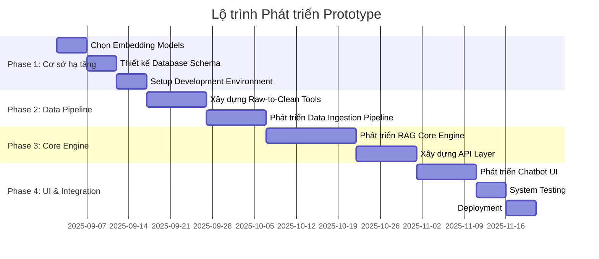

Dựa trên tài liệu thiết kế chi tiết trong project knowledge, tôi sẽ tạo cho bạn một todo list ngắn gọn để phát triển prototype:

## 📋 CHECKLIST PHÁT TRIỂN PROTOTYPE (12 tuần)

### ✅ **PHASE 1: CƠ SỞ HẠ TẦNG (Tuần 1-3)**

#### **Việc 1: Lựa chọn Embedding Models**
- [x] **Đánh giá `Qwen/Qwen3-Embedding-0.6B`**: kết quả đánh giá tốt, sử dụng model này
- [x] **Đánh giá `AITeamVN/Vietnamese_Embedding`** (backup)
- [x] **Benchmark performance trên dataset tiếng Việt**: đã làm xong công cụ để kiểm tra embedding, đang hoàn thiện tool.
- [x] **Test khả năng xử lý tài liệu chuyên môn**: kết quả khá ổn
- [x] **Quyết định embedding model cuối cùng**:`Qwen/Qwen3-Embedding-0.6B`

#### **Việc 2: Thiết kế Database Schema**  
- [ ] **Thiết kế bảng `documents_metadata`** với các trường bắt buộc
- [ ] **Tạo bảng `departments`, `document_tags`, `access_permissions`**
- [ ] **Thiết kế indexes cho performance**
- [ ] **Tạo migration scripts**
- [ ] **Setup PostgreSQL database**

#### **Việc 3: Setup Development Environment**
- [ ] **Cài đặt Docker containers (PostgreSQL, Redis)**
- [ ] **Setup Python virtual environment + FastAPI**
- [ ] **Configure database connections**
- [ ] **Setup Git repository và project structure**
- [ ] **Tạo configuration files**

---

### ✅ **PHASE 2: DATA PIPELINE (Tuần 4-6)**

#### **Việc 4: Xây dựng Raw-to-Clean Data Tools**
- [ ] **Phát triển PDF text extraction**
- [ ] **Phát triển Word document processing** 
- [ ] **Phát triển Excel data cleaning**
- [ ] **Tạo data quality validation tools**
- [ ] **Xây dựng metadata extraction pipeline**

#### **Việc 5: Phát triển Data Ingestion Pipeline**
- [ ] **Tạo document chunking system**
- [ ] **Implement embedding generation pipeline**
- [ ] **Setup vector database (Chroma/FAISS)**
- [ ] **Tạo batch processing capabilities**
- [ ] **Implement error handling và retry mechanisms**

---

### ✅ **PHASE 3: CORE ENGINE (Tuần 7-9)**

#### **Việc 6: Phát triển RAG Core Engine**
- [ ] **Implement semantic search với vector database**
- [ ] **Tạo query processing và ranking**
- [ ] **Integrate LLM cho answer generation**
- [ ] **Implement context retrieval và filtering**
- [ ] **Tạo response validation và safety checks**

#### **Việc 7: Xây dựng API Layer**
- [ ] **Tạo REST API endpoints cho search**
- [ ] **Implement authentication và authorization**
- [ ] **Tạo chat session management**
- [ ] **Add logging và monitoring**
- [ ] **Viết API documentation**

---

### ✅ **PHASE 4: UI & INTEGRATION (Tuần 10-12)**

#### **Việc 8: Phát triển Chatbot UI**
- [ ] **Setup React.js/Next.js frontend**
- [ ] **Tạo chat interface với responsive design**
- [ ] **Implement file upload capabilities**
- [ ] **Tạo document preview và citation display**
- [ ] **Add user authentication UI**

#### **Việc 9: System Integration & Testing**
- [ ] **Integration testing toàn bộ hệ thống**
- [ ] **Performance testing với sample data**
- [ ] **Security testing và vulnerability scan**
- [ ] **User acceptance testing**
- [ ] **Load testing và scalability validation**

#### **Việc 10: Deployment & Go-Live**
- [ ] **Setup production environment**
- [ ] **Deploy containers với Docker/Kubernetes**
- [ ] **Configure monitoring và alerting**
- [ ] **Backup và disaster recovery setup**
- [ ] **Go-live và handover documentation**

---

## 🎯 **CRITICAL PATH & DEPENDENCIES**

**Không thể song song (phải tuần tự):**
1. Embedding Models → Data Pipeline → RAG Engine  
2. Database Schema → Metadata Pipeline → Search Engine
3. Core Engine → API Layer → Frontend UI

**Có thể thực hiện song song:**
- Database setup + Model research
- Data tools + API development  
- Frontend UI + Core engine (sau khi có API specs)

---

## ⚡ **QUICK WIN PRIORITIES**

1. **Tuần 1**: Chọn embedding model và setup database
2. **Tuần 4**: Có working data ingestion pipeline  
3. **Tuần 7**: Có basic RAG search functionality
4. **Tuần 10**: Có working chatbot prototype
5. **Tuần 12**: Production-ready deployment

Checklist này được thiết kế để đạt được một prototype hoàn chỉnh trong 12 tuần với khả năng scale và maintain tốt. Bạn có muốn tôi detail hóa thêm bất kỳ phần nào không?
