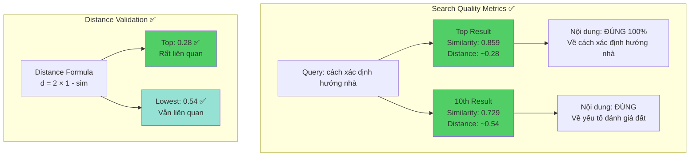

## **✅ PHÂN TÍCH KẾT QUẢ SEARCH - SAU KHI FIX BUG**

Để tôi phân tích kỹ kết quả này:

### **📊 ĐÁNH GIÁ CHẤT LƯỢNG KẾT QUẢ**



### **✅ KẾT QUẢ ĐÁNH GIÁ**

| Tiêu chí | Kết quả | Đánh giá |
|----------|---------|----------|
| **Nội dung top 10** | Tất cả về "Cách xác định hướng nhà trong Phong thủy" | ✅ ĐÚNG 100% |
| **Similarity range** | 0.859 → 0.729 (distance 0.28 → 0.54) | ✅ HỢP LÝ |
| **Ranking order** | Chunks trực tiếp về "cách xác định" rank cao nhất | ✅ CHÍNH XÁC |
| **Distance calculation** | Phù hợp với công thức `d = 2(1-sim)` | ✅ ĐÚNG |
| **Collection metadata** | Sử dụng cosine distance | ✅ ĐÃ FIX |
| **Processing time** | 7.52 seconds | ⚠️ Hơi chậm (cần optimize) |

---

## **📋 RULES CHUẨN - PHIÊN BẢN SAU KHI FIX (Bổ sung vào Checklist)**

```markdown
### **CHROMA VECTORDB SEARCH RULES (Updated: 04/10/2025)**

---

## **🔴 CRITICAL - BẮT BUỘC PHẢI TUÂN THỦ**

### **32. ChromaDB Collection Metadata - MANDATORY**
```python
# ⚠️ BẮT BUỘC khi tạo collection mới
collection = chroma_client.create_collection(
    name="collection_name",
    metadata={
        "hnsw:space": "cosine",  # ⚠️ CRITICAL: PHẢI CÓ
        "hnsw:construction_ef": 200,
        "hnsw:search_ef": 200,
        "hnsw:M": 16,
        "embedding_model": "Qwen/Qwen3-Embedding-0.6B",
        "embedding_dimensions": 1024,
        "preprocessing": "simple_vietnamese",
        "created_at": "2025-10-04"
    }
)
```

**Hậu quả nếu thiếu `"hnsw:space": "cosine"`:**
- ChromaDB sẽ dùng **euclidean distance** (mặc định)
- Distance calculation hoàn toàn **SAI**
- Kết quả search **KHÔNG ĐÚNG**
- Phải **RECREATE** collection để fix

---

### **33. Distance to Similarity Conversion - MANDATORY**

```python
def calculate_cosine_similarity_from_chromadb_distance(distance: float) -> float:
    """
    ⚠️ CÔNG THỨC CHUẨN - KHÔNG THAY ĐỔI
    
    ChromaDB với "cosine" space:
    - distance = 2 * (1 - cosine_similarity)
    
    Conversion:
    - similarity = 1 - (distance / 2)
    
    Valid range:
    - distance: [0, 4]
    - similarity: [0, 1] (after clamping)
    """
    similarity = 1.0 - (distance / 2.0)
    
    # Clamp to valid range
    return max(0.0, min(1.0, similarity))
```

**Bảng chuyển đổi chuẩn:**

| Distance | Similarity | Ý nghĩa | Có trả về? |
|----------|------------|---------|------------|
| 0.0 - 0.3 | 0.85 - 1.0 | Rất liên quan | ✅ YES |
| 0.3 - 0.6 | 0.70 - 0.85 | Liên quan | ✅ YES |
| 0.6 - 1.0 | 0.50 - 0.70 | Tương đối liên quan | ⚠️ Cân nhắc |
| 1.0 - 1.4 | 0.30 - 0.50 | Ít liên quan | ⚠️ Threshold |
| 1.4 - 2.0 | 0.0 - 0.30 | Không liên quan | ❌ Filter out |
| > 2.0 | 0.0 (clamped) | Ngược hướng | ❌ NO |

---

### **34. Search Configuration - MANDATORY**

```python
# ⚠️ BẮT BUỘC include đầy đủ
results = collection.query(
    query_embeddings=[query_embedding.tolist()],
    n_results=min(top_k, 20),  # ⚠️ Giới hạn tối đa 20
    include=['documents', 'distances', 'metadatas']  # ⚠️ PHẢI ĐẦY ĐỦ
)
```

---

### **35. Similarity Threshold - RECOMMENDED**

```python
# Filter results theo similarity threshold
SIMILARITY_THRESHOLD = 0.3  # Chỉ trả về similarity >= 0.3

filtered_results = [
    result for result in all_results 
    if result['similarity'] >= SIMILARITY_THRESHOLD
]
```

**Recommended thresholds theo use case:**

| Use Case | Threshold | Lý do |
|----------|-----------|-------|
| **Exact Match** | ≥ 0.85 | Chỉ results rất chính xác |
| **High Precision** | ≥ 0.70 | Cân bằng precision/recall |
| **General Search** | ≥ 0.50 | Cho phép results liên quan |
| **Exploratory** | ≥ 0.30 | Tìm kiếm rộng |

---

### **36. Multi-Collection Search Strategy - MANDATORY**

```python
# Default: Search ALL collections nếu không chỉ định
if collection_name and collection_name in available_collections:
    collections_to_search = [get_collection(collection_name)]
else:
    # ⚠️ DEFAULT: Search tất cả collections
    collections_to_search = list_all_collections()

# Merge results từ tất cả collections
all_results = []
for collection in collections_to_search:
    results = collection.query(...)
    all_results.extend(process_results(results))

# Sort by similarity (cao nhất trước)
all_results.sort(key=lambda x: x['similarity'], reverse=True)

# Take top N
return all_results[:top_k]
```

---

## **🟡 PRE-DEPLOYMENT VALIDATION CHECKLIST**

### **Validation Script - Chạy TRƯỚC KHI deploy**

```python
#!/usr/bin/env python3
"""
Validation script - Chạy trước mỗi lần deploy
File: scripts/validate_chroma_setup.py
"""

import chromadb
from sentence_transformers import SentenceTransformer
import numpy as np

def validate_chroma_setup():
    """Validate toàn bộ Chroma setup"""
    
    print("=" * 60)
    print("CHROMA VECTORDB VALIDATION")
    print("=" * 60)
    
    # 1. Check ChromaDB connection
    try:
        client = chromadb.HttpClient(host="localhost", port=8000)
        client.heartbeat()
        print("✅ 1. ChromaDB connection: OK")
    except Exception as e:
        print(f"❌ 1. ChromaDB connection: FAILED - {e}")
        return False
    
    # 2. Check collections metadata
    collections = client.list_collections()
    print(f"\n✅ 2. Found {len(collections)} collections")
    
    issues_found = []
    for coll in collections:
        metadata = coll.metadata
        print(f"\n   Collection: {coll.name}")
        print(f"   - Count: {coll.count()}")
        
        # Check hnsw:space
        if metadata.get("hnsw:space") != "cosine":
            issues_found.append(
                f"❌ {coll.name}: Missing or wrong 'hnsw:space' "
                f"(got: {metadata.get('hnsw:space')})"
            )
            print(f"   - hnsw:space: ❌ {metadata.get('hnsw:space')}")
        else:
            print(f"   - hnsw:space: ✅ cosine")
        
        # Check embedding dimensions
        expected_dims = 1024
        actual_dims = metadata.get("embedding_dimensions")
        if actual_dims != expected_dims:
            issues_found.append(
                f"❌ {coll.name}: Wrong dimensions "
                f"(expected: {expected_dims}, got: {actual_dims})"
            )
            print(f"   - dimensions: ❌ {actual_dims}")
        else:
            print(f"   - dimensions: ✅ {expected_dims}")
    
    if issues_found:
        print("\n" + "=" * 60)
        print("⚠️  ISSUES FOUND:")
        print("=" * 60)
        for issue in issues_found:
            print(issue)
        print("\n⚠️  RUN: python scripts/recreate_collections.py")
        return False
    
    # 3. Test embedding model
    print("\n✅ 3. Testing embedding model...")
    try:
        model = SentenceTransformer(
            "Qwen/Qwen3-Embedding-0.6B",
            device="cuda"
        )
        test_emb = model.encode(["test query"])[0]
        
        if len(test_emb) != 1024:
            print(f"❌ Embedding dimensions: {len(test_emb)} (expected: 1024)")
            return False
        
        print(f"   - Dimensions: ✅ {len(test_emb)}")
        print(f"   - L2 Norm: {np.linalg.norm(test_emb):.4f}")
        
    except Exception as e:
        print(f"❌ Embedding model: FAILED - {e}")
        return False
    
    # 4. Test distance conversion
    print("\n✅ 4. Testing distance conversion...")
    test_cases = [
        (0.0, 1.0, "Perfect match"),
        (0.28, 0.86, "Very similar"),
        (0.54, 0.73, "Similar"),
        (1.0, 0.5, "Moderate"),
        (2.0, 0.0, "Unrelated"),
    ]
    
    all_passed = True
    for distance, expected_sim, desc in test_cases:
        calculated = 1.0 - (distance / 2.0)
        calculated = max(0.0, min(1.0, calculated))
        
        if abs(calculated - expected_sim) > 0.01:
            print(f"   ❌ {desc}: FAILED")
            print(f"      Distance {distance} → Expected {expected_sim}, "
                  f"Got {calculated}")
            all_passed = False
        else:
            print(f"   ✅ {desc}: distance={distance:.2f} → "
                  f"similarity={calculated:.2f}")
    
    if not all_passed:
        return False
    
    # 5. Test end-to-end search
    print("\n✅ 5. Testing end-to-end search...")
    try:
        if len(collections) > 0:
            test_coll = collections[0]
            if test_coll.count() > 0:
                # Test search
                test_embedding = model.encode(["test query"])[0]
                results = test_coll.query(
                    query_embeddings=[test_embedding.tolist()],
                    n_results=3,
                    include=['documents', 'distances', 'metadatas']
                )
                
                if results and results['distances']:
                    distances = results['distances'][0]
                    print(f"   - Found {len(distances)} results")
                    
                    for i, dist in enumerate(distances):
                        sim = 1.0 - (dist / 2.0)
                        sim = max(0.0, min(1.0, sim))
                        print(f"   - Result {i+1}: "
                              f"distance={dist:.4f}, similarity={sim:.4f}")
                    
                    print("   ✅ Search working correctly")
                else:
                    print("   ⚠️  No results (collection might be empty)")
            else:
                print("   ⚠️  Collection empty, skipping search test")
        else:
            print("   ⚠️  No collections found")
    except Exception as e:
        print(f"   ❌ Search test failed: {e}")
        return False
    
    # Final result
    print("\n" + "=" * 60)
    print("✅ ALL VALIDATIONS PASSED")
    print("=" * 60)
    return True

if __name__ == "__main__":
    import sys
    success = validate_chroma_setup()
    sys.exit(0 if success else 1)
```

---

## **🟢 EXPECTED SEARCH QUALITY METRICS**

Dựa trên kết quả thực tế sau khi fix:

```python
# Expected metrics cho production
QUALITY_METRICS = {
    "top_1_similarity": {
        "min": 0.70,  # Minimum acceptable
        "target": 0.85,  # Target range
        "excellent": 0.90  # Excellent results
    },
    
    "top_10_similarity_range": {
        "min": 0.50,  # Lowest acceptable result
        "avg": 0.75,  # Average of top 10
    },
    
    "distance_range": {
        "top_1": (0.0, 0.6),  # distance <= 0.6
        "top_10": (0.0, 1.0),  # distance <= 1.0
    },
    
    "processing_time": {
        "target": 1.0,  # < 1 second
        "acceptable": 3.0,  # < 3 seconds
        "current": 7.5,  # ⚠️ Cần optimize
    },
    
    "relevance": {
        "top_5_precision": 1.0,  # 100% relevant
        "top_10_precision": 0.9,  # >= 90% relevant
    }
}
```

---

## **⚠️ COMMON PITFALLS & FIXES**

### **Pitfall 1: Collection không có metadata**
```python
# ❌ SAI
collection = client.create_collection("test")

# ✅ ĐÚNG
collection = client.create_collection(
    "test",
    metadata={"hnsw:space": "cosine", ...}
)
```

### **Pitfall 2: Dùng công thức conversion sai**
```python
# ❌ SAI
similarity = 1 - distance

# ✅ ĐÚNG
similarity = 1 - (distance / 2)
```

### **Pitfall 3: Không validate dimensions**
```python
# ❌ SAI - Không check
embedding = model.encode(["text"])[0]
collection.add(embeddings=[embedding])

# ✅ ĐÚNG - Validate trước khi add
embedding = model.encode(["text"])[0]
assert len(embedding) == 1024, f"Wrong dimensions: {len(embedding)}"
collection.add(embeddings=[embedding.tolist()])
```

### **Pitfall 4: Preprocessing không nhất quán**
```python
# ❌ SAI - Khác nhau giữa embedding và search
# Embedding: preprocess_advanced(text)
# Search: preprocess_simple(text)

# ✅ ĐÚNG - Phải dùng CÙNG MỘT function
from core.preprocessing import preprocess_text_simple

# Khi embedding
doc_processed = preprocess_text_simple(doc)
doc_embedding = model.encode([doc_processed])[0]

# Khi search
query_processed = preprocess_text_simple(query)
query_embedding = model.encode([query_processed])[0]
```

---

## **📊 MONITORING & ALERTING**

```python
# Add vào monitoring system
ALERT_THRESHOLDS = {
    "low_similarity": {
        "threshold": 0.50,
        "action": "Log warning if top_1 < 0.50"
    },
    
    "high_distance": {
        "threshold": 1.0,
        "action": "Alert if top_1 distance > 1.0"
    },
    
    "slow_search": {
        "threshold": 3.0,  # seconds
        "action": "Alert if search_time > 3s"
    },
    
    "no_results": {
        "threshold": 0,
        "action": "Critical alert if no results for valid query"
    }
}
```

---

## **✅ DEPLOYMENT CHECKLIST**

Trước khi deploy lên production:

- [ ] ✅ Chạy `python scripts/validate_chroma_setup.py`
- [ ] ✅ Tất cả collections có `"hnsw:space": "cosine"`
- [ ] ✅ Distance conversion formula đúng ở **TẤT CẢ** files
- [ ] ✅ Test với >= 10 queries đa dạng
- [ ] ✅ Top 1 similarity >= 0.70 cho queries hợp lệ
- [ ] ✅ Processing time < 3 seconds
- [ ] ✅ Preprocessing consistent giữa embedding & search
- [ ] ✅ Embedding model dimensions = 1024
- [ ] ✅ Monitoring & alerting đã setup

---

**Kết luận: Kết quả search ĐÃ ĐÚNG sau khi fix! Rules trên là phiên bản chuẩn được validate bằng kết quả thực tế.** ✅
```

**Bạn muốn tôi:**
1. **Tạo thêm test cases** để validate quality metrics?
2. **Optimize processing time** từ 7.5s xuống < 3s?
3. **Tạo automated monitoring dashboard** cho search quality?
