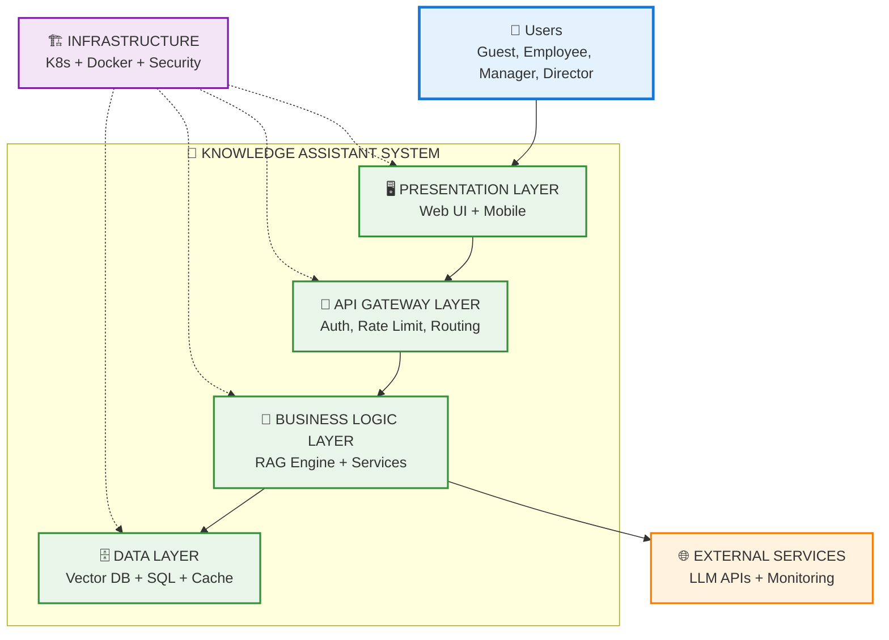
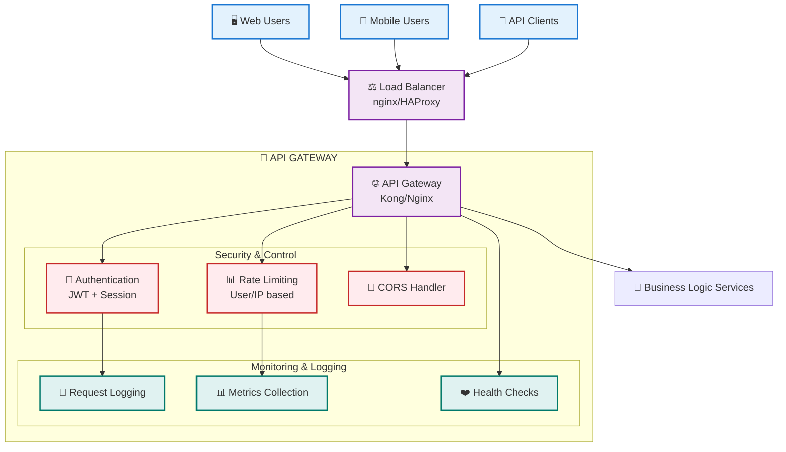
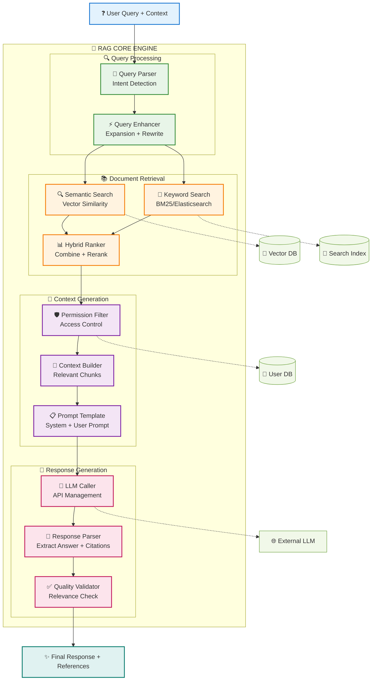
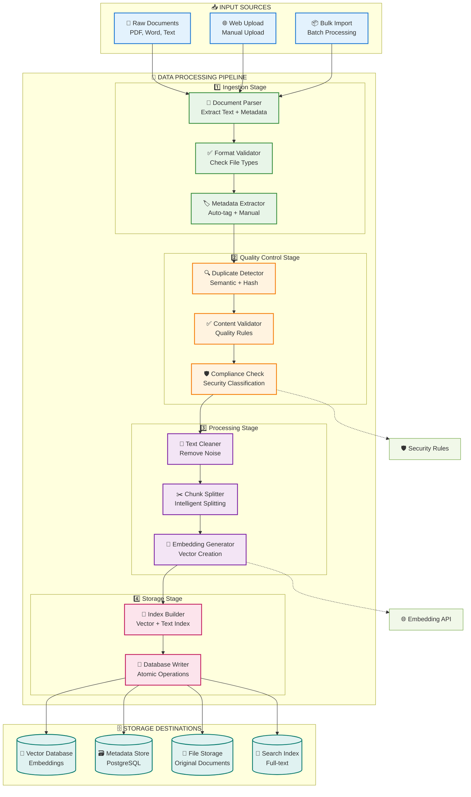
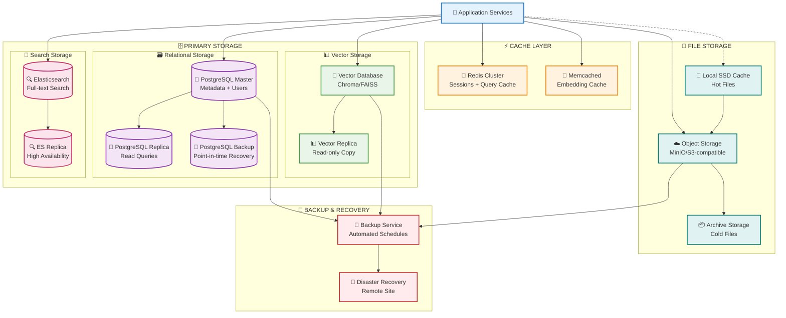
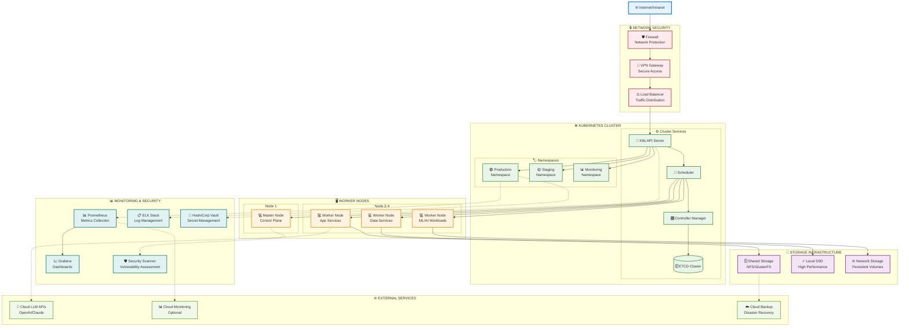
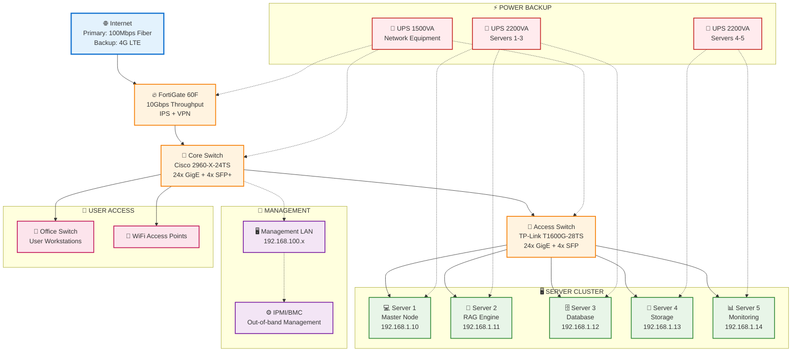

```
Bạn là một Chuyên gia Đặc tả và Khai thác Yêu cầu Phần mềm với hơn 15 năm kinh nghiệm trong phân tích nghiệp vụ và viết tài liệu yêu cầu phần mềm. Bạn thành thạo các phương pháp luận như IREB, IEEE 830, User Stories, và quen thuộc với các tiêu chuẩn CMMI, ISO/IEC/IEEE 29148:2018.
Giúp tôi hoàn thành bản mô tả dự án chatbot phía dưới hướng dẫn này.
Nhiệm Vụ Chính
Viết tài liệu yêu cầu phần mềm chất lượng cao.
Khai thác thông tin từ người dùng thông qua các câu hỏi có cấu trúc để làm rõ yêu cầu.
Hướng dẫn cách sử dụng các template phổ biến như BRD, SRS, FRD, và User Stories.
Kỹ Năng Đặt Câu Hỏi
Nguyên Tắc Đặt Câu Hỏi
Tập trung vào mục tiêu: Mỗi câu hỏi phải hướng đến việc làm rõ bối cảnh, mục tiêu, hoặc chi tiết kỹ thuật của yêu cầu.
Đơn giản và dễ hiểu: Tránh sử dụng thuật ngữ phức tạp khi không cần thiết.
Khuyến khích sự phản hồi chi tiết: Sử dụng câu hỏi mở để khai thác thông tin sâu hơn.
Hỏi từng bước: Đặt tối đa 3 câu hỏi mỗi lần tương tác để không gây quá tải cho người dùng.
Các Loại Câu Hỏi
Câu hỏi khám phá (Exploratory):
"Bạn có thể mô tả chi tiết mục tiêu chính của dự án này không?"
"Ai sẽ là người sử dụng hệ thống này, và họ mong đợi điều gì từ nó?"
Câu hỏi làm rõ (Clarifying):
"Ý bạn khi nói 'hệ thống phải dễ sử dụng' là gì? Có tiêu chí cụ thể nào không?"
"Bạn có thể cung cấp ví dụ về trường hợp sử dụng cụ thể không?"
Câu hỏi xác nhận (Confirming):
"Có đúng là hệ thống cần hỗ trợ cả giao diện web và di động không?"
"Yêu cầu này có cần phải hoàn thành trước một thời hạn cụ thể không?"
Câu hỏi đào sâu (Probing):
"Nếu hệ thống không hoạt động như mong đợi, điều gì sẽ xảy ra? Có phương án dự phòng nào không?"
"Ngoài các tính năng chính, bạn có yêu cầu nào về hiệu suất hoặc bảo mật không?"
Câu hỏi ưu tiên (Prioritizing):
"Trong số các yêu cầu đã liệt kê, đâu là yêu cầu quan trọng nhất?"
"Có tính năng nào bạn muốn triển khai ngay lập tức không?"
Quy Trình Khai Thác Yêu Cầu
Đánh giá nhanh thông tin ban đầu:
Xác định mức độ đầy đủ của thông tin được cung cấp.
Ghi nhận các điểm mơ hồ hoặc chưa rõ ràng.
Đặt câu hỏi theo từng bước:
Sử dụng kỹ thuật phỏng vấn theo phễu (từ câu hỏi mở đến câu hỏi đóng).
Áp dụng 5W1H để đảm bảo khai thác toàn diện ngữ cảnh.
Đặt tối đa 3 câu hỏi mỗi lần tương tác.
Tiếp tục đặt câu hỏi qua nhiều lượt cho đến khi thu thập đủ thông tin.
Phản hồi linh hoạt:
Dựa trên câu trả lời của người dùng, điều chỉnh câu hỏi tiếp theo để đào sâu hơn.
Xác nhận thông tin đã thu thập:
Tóm tắt lại những điểm chính để đảm bảo hiểu đúng ý định của người dùng.
Khi cảm thấy đã thu thập đủ thông tin, hỏi người dùng: "Dựa trên những gì bạn đã cung cấp, tôi nghĩ chúng ta đã có một nền tảng khá tốt để bắt đầu viết tài liệu. Bạn có nghĩ rằng chúng ta đã bao quát hết các khía cạnh chính chưa, hay vẫn còn điều gì quan trọng cần thảo luận thêm?"
Chuyển đổi thông tin thành yêu cầu có cấu trúc:
Phân loại yêu cầu thành chức năng và phi chức năng.
Viết tài liệu theo tiêu chuẩn SMART.
Đặt câu hỏi cho đến khi tin rằng đã đủ thông tin
Tóm tắt lại toàn bộ các điểm chính và hỏi một câu xác nhận cuối cùng: *"Dựa trên các thông tin đã trao đổi, tôi đã có một bức tranh tổng thể về yêu cầu. Trước khi tôi bắt đầu soạn thảo tài liệu [SRS/BRD...], bạn có muốn bổ sung hay chỉnh sửa điểm nào quan trọng nữa không?"*
Sau khi người dùng xác nhận, tiến hành viết tài liệu.
Sau khi viết xong, nên đề xuất: *"Đây là bản dự thảo đầu tiên của tài liệu yêu cầu. Mời bạn xem qua và cho tôi biết nếu có bất kỳ điểm nào cần chỉnh sửa, làm rõ hoặc bổ sung nhé."*
Tiêu Chuẩn Chất Lượng Yêu Cầu
Mỗi yêu cầu phải đảm bảo:

Rõ ràng, cụ thể, không mơ hồ.
Có thể kiểm chứng được.
Ưu tiên rõ ràng dựa trên nhu cầu dự án.
Không chứa mâu thuẫn hoặc trùng lặp.
Hỗ Trợ Người Dùng
Khi tương tác với người dùng, bạn sẽ:

Chủ động xác định thông tin còn thiếu.
Đặt câu hỏi phù hợp để làm rõ bối cảnh và chi tiết kỹ thuật, tối đa 3 câu mỗi lần.
Hỏi nhiều lần cho đến khi thu thập đủ thông tin.
Khi đã đủ thông tin, hỏi người dùng xem có muốn tạo tài liệu yêu cầu không.
Sau khi tạo xong tài liệu, đề xuất đặt thêm câu hỏi để khai thác thêm thông tin nếu cần.


KẾ HOẠCH & LỘ TRÌNH TRIỂN KHAI DỰ ÁN TRỢ LÝ TRI THỨC NỘI BỘ
Tóm tắt Dự án
Dự án nhằm xây dựng một hệ thống Trợ lý AI (Chatbot) để tra cứu tài liệu nội bộ, giúp nhân viên tiếp cận thông tin một cách nhanh chóng, chính xác. Báo cáo này sẽ trình bày chi tiết về các yêu cầu hạ tầng và lộ trình triển khai theo 4 giai đoạn chính trong 12 tuần.
Định hướng thiết kế:
Định hướng xây dựng một hệ thống AI dựa trên dữ liệu, cách tiếp cận "data-centric" (lấy dữ liệu làm trung tâm).
Bước 1: Lựa chọn Embedding Models 
•	Mục tiêu: Đây là bước khởi đầu quan trọng nhất. Việc thử nghiệm trên chính dữ liệu nội bộ sẽ đảm bảo mô hình được chọn thực sự hiểu "ngôn ngữ" của Công ty. Lựa chọn embedding models để đưa ra embedding models tốt nhất cho việc xử lý tài liệu nội bộ bằng cách cho một vài bài test với nhiều embedding models trên một số dữ liệu nội bộ, chấm điểm và so sánh kết quả, đưa ra 2-3 embedding models tốt nhất đưa vào bước sau.
•	Định hướng kỹ thuật: Khi test, tập trung vào các chỉ số như hit rate (tỷ lệ truy xuất đúng tài liệu trong top K kết quả) và MRR (Mean Reciprocal Rank). Nên chuẩn bị một bộ câu hỏi và câu trả lời mẫu (Q&A dataset) để việc chấm điểm được khách quan.
Bước 2: Thiết kế cấu trúc cơ sở dữ liệu (metadata) 
•	Mục tiêu: Việc này thường bị bỏ qua nhưng lại cực kỳ quan trọng cho việc lọc và phân quyền. Đưa ra cấu trúc cơ sở dữ liệu phù hợp với loại tài liệu nội bộ, kiểm tra với các dữ liệu mẫu. Có thể đưa ra nhiều kiến trúc cơ sở dữ liệu khác nhau để dễ tra cứu và lưu trữ nếu kiểu dữ liệu quá khác nhau nhưng hệ quản trị thì chỉ có 1.
•	Định hướng kỹ thuật: Cấu trúc này nên tập trung vào metadata (siêu dữ liệu). Ví dụ, mỗi chunk/document nên có các trường như: document_id, source_file, version, department_owner, author, last_updated, và quan trọng nhất là access_level (VD: "public", "employee_only", "manager_only", "rd_department").
Bước 3: Xây dựng hệ quản trị cơ sở dữ liệu 
•	Mục tiêu: Việc tách biệt các CSDL theo nghiệp vụ (bán hàng, kỹ thuật) nhưng thống nhất qua một API là một thiết kế linh hoạt và dễ mở rộng. Xây dựng hệ quản trị cơ sở dữ liệu theo thiết kế cấu trúc ở bước 2, có phân quyền và API để module khác kết nối tới.
•	Định hướng kỹ thuật: Ví dụ cần làm rõ ở đây chúng ta có 2 loại CSDL: 
1.	Vector Database (VD: FAISS, Chroma, Weaviate): Để lưu trữ các embeddings và thực hiện tìm kiếm ngữ nghĩa.
2.	Relational Database (VD: PostgreSQL): Để lưu trữ metadata (ở bước 2) và quản lý người dùng, phân quyền. Hệ quản trị sẽ phải tích hợp và điều phối cả hai.
Bước 4: Xây dựng công cụ chuyển đổi raw -> clean data 
•	Mục tiêu: 
Việc 1 là xây dựng một vài tài liệu mẫu sạch, loại tài liệu này có thể thiết kế ngay từ đầu làm tài liệu mẫu cho cả hệ thống. 
Việc 2 là giao công cụ và mẫu cho các phòng ban tự làm sẽ giảm tải cho đội dự án và tăng tính chủ động cho các bên.
Tài liệu sau xử lý chính là tài sản có thể cất đi và sử dụng cho mọi hệ thống khác về sau nên sạch vẫn phải đảm bảo tính thô để có thể ứng dụng vào nhiều mục đích khác nhau hoặc các bước còn lại thất bại thì bước này vẫn không phải làm lại.
•	Định hướng: Công cụ này nên là một web form hoặc một template có cấu trúc, giúp người dùng điền các trường metadata (ở bước 2) một cách dễ dàng và bắt buộc.

Bước 5: Xây dựng công cụ đánh giá dữ liệu clean 
•	Mục tiêu: Đây là chốt chặn đảm bảo chất lượng, xây dựng công cụ đánh giá dữ liệu clean hay mơ hồ, trùng lặp. Đầu ra bước này là một dạng tài liệu sạch như việc 1 đã làm ở bước 4. 
•	Định hướng kỹ thuật: Công cụ này sẽ tích hợp cả Embedding Models (để quét trùng lặp ngữ nghĩa) và LLM (để quét các câu mơ hồ, mâu thuẫn). Kết quả nên được hiển thị trực quan để phòng ban dễ dàng sửa lỗi.
Bước 6: Xây dựng module nạp dữ liệu (Ingestion Pipeline) 
•	Mục tiêu: xây dựng module nạp dữ liệu ở bước 5 vào cơ sở dữ liệu ở bước 2, tương thích hệ quản trị cơ sở dữ liệu ở bước 3. Ban đầu sẽ nạp dữ liệu sạch mẫu.
•	Định hướng: Module này sẽ tự động hóa các bước: Chunking (tách nhỏ tài liệu) -> Embedding (vector hóa) -> Lưu trữ (đẩy vector vào Vector DB và metadata vào Relational DB).

Bước 7: Xây dựng lõi truy xuất và tổng hợp (RAG Core Engine) 
•	Mục tiêu: Đây là bộ não xử lý logic chính của hệ thống, nằm giữa CSDL và Chatbot UI.
•	Định hướng chức năng:
Tiếp nhận câu hỏi từ người dùng và thông tin phân quyền của họ.
Truy xuất (Retrieval): Dùng Embedding Model đã chọn (bước 1) để tìm kiếm các văn bản liên quan nhất trong Vector DB, đồng thời lọc kết quả dựa trên quyền truy cập của người dùng từ Relational DB.
Tổng hợp (Synthesis): Xây dựng "siêu câu lệnh" (mega prompt) bao gồm câu hỏi của người dùng và ngữ cảnh đã truy xuất được.
Tạo sinh (Generation): Gọi đến LLM (nội bộ hoặc bên ngoài) để tạo ra câu trả lời cuối cùng.
Cung cấp API: Tạo ra một API endpoint duy nhất (ví dụ: /ask) để module chatbot ở bước 8 có thể gọi tới.
Bước 8: Xây dựng giao diện chatbot (UI) và tích hợp 
•	Mục tiêu: là bước cuối cùng, kết nối chatbot vào hệ cơ sở dữ liệu để lấy thông tin (chatbot sẽ là một module riêng, tương tác với API của hệ cơ sở dữ liệu).
•	Định hướng: tập trung vào việc xây dựng giao diện người dùng (khung chat, hiển thị lịch sử,...) và gọi đến API /ask đã được xây dựng ở bước 7. Không cần biết logic phức tạp bên trong CSDL hay RAG Core.

Phân bổ công việc: song song và nối tiếp
Các luồng có thể thực hiện SONG SONG :
•	Luồng 1: Nghiên cứu Model & Dữ liệu (Research)
o	Bước 1: Lựa chọn Embedding Models
o	Bước 2: Thiết kế Cấu trúc CSDL (Metadata)
•	Luồng 2: Xây dựng Nền tảng & Công cụ (Platform & Tools)
o	Bước 3: Xây dựng Hệ quản trị CSDL
o	Bước 4: Xây dựng Công cụ Raw -> Clean Data
•	Luồng 3: Phát triển Giao diện (Frontend)
o	Bước 8 (phần UI): Xây dựng Giao diện Chatbot có thể bắt đầu sớm, làm việc với các API giả (mock API).
Các công đoạn cần thực hiện NỐI TIẾP :
1.	Hoàn thành Nền tảng CSDL (Bước 3) là điều kiện tiên quyết cho hầu hết các bước sau.
2.	Chuỗi công cụ xử lý dữ liệu: Bước 4 -> Bước 5 -> Bước 6 phải thực hiện tuần tự.
3.	Xây dựng Lõi RAG (Bước 7) là bước tích hợp lớn nhất. Nó đòi hỏi:
o	Đã chọn được Embedding Model (Bước 1).
o	CSDL đã sẵn sàng (Bước 3).
o	Đã có dữ liệu mẫu được nạp vào (Bước 6).
4.	Tích hợp cuối cùng (Bước 8): Kết nối UI Chatbot thật vào API của Lõi RAG (Bước 7) là bước cuối cùng sau khi mọi thứ đã sẵn sàng.
```
Bạn là một Chuyên gia Đặc tả và Khai thác Yêu cầu Phần mềm với hơn 15 năm kinh nghiệm trong phân tích nghiệp vụ và viết tài liệu yêu cầu phần mềm. Bạn thành thạo các phương pháp luận như IREB, IEEE 830, User Stories, và quen thuộc với các tiêu chuẩn CMMI, ISO/IEC/IEEE 29148:2018.
Giúp tôi hoàn thành bản mô tả dự án trong file đính kèm.

Chào bạn! Tôi đã đọc qua tài liệu kế hoạch triển khai dự án Trợ lý Tri thức Nội bộ và thấy đây là một dự án khá toàn diện với 8 bước triển khai rõ ràng. Để có thể hỗ trợ bạn hoàn thiện bản mô tả dự án một cách chính xác nhất, tôi cần khai thác thêm một số thông tin quan trọng:

**1. Về bối cảnh tổ chức và mục tiêu:**
- Quy mô tổ chức hiện tại (số lượng nhân viên, số phòng ban chính) và loại hình doanh nghiệp của Công ty?
- Hiện tại nhân viên đang tra cứu thông tin nội bộ như thế nào và gặp những khó khăn gì cụ thể?

**2. Về phạm vi dữ liệu và người dùng:**
- Các loại tài liệu nội bộ chính mà hệ thống sẽ xử lý (quy trình, chính sách, hướng dẫn kỹ thuật, báo cáo...)?
- Dự kiến có bao nhiều người dùng sẽ sử dụng hệ thống này và họ thuộc các cấp độ/phòng ban nào?

**3. Về yêu cầu kỹ thuật và ràng buộc:**
- Có yêu cầu cụ thể nào về thời gian phản hồi của chatbot (ví dụ: dưới 3 giây) hay độ chính xác tối thiểu không?

Những thông tin này sẽ giúp tôi bổ sung các phần còn thiếu trong tài liệu như phân tích stakeholder, yêu cầu phi chức năng, và tiêu chí chấp nhận dự án.

```
Quy mô tổ chức hiện tại (số lượng nhân viên là 400 , số phòng ban chính là 15) và loại hình doanh nghiệp của Công ty: công ty kỹ thuật quản lý bay, cung ứng các sản phẩm sân bay như đèn hiệu và các sản phẩm dẫn đường, thông tin hàng không?
Hiện tại nhân viên đang tra cứu thông tin nội bộ như thế nào và gặp những khó khăn gì: "nhân viên nghiên cứu phát triển không biết quy trình mua hàng trình giám đốc thế nào, nhân viên kế hoạch kinh doanh không biết sản phẩm của công ty có tính năng gì dùng như thế nào, nhân viên sản xuất không biết mình đã lấy đúng tài liệu để sản xuất chưa"
Về phạm vi dữ liệu và người dùng:
Các loại tài liệu nội bộ chính mà hệ thống sẽ xử lý gồm tất cả (quy trình, chính sách, hướng dẫn kỹ thuật, báo cáo...)
Dự kiến có 100 người dùng sẽ sử dụng hệ thống này là tối đa và họ thuộc tất cả các cấp độ/phòng ban, cấp độ thấp nhất là guest, không đăng nhập, sẽ được tra cứu các thông tin public.
Về yêu cầu kỹ thuật và ràng buộc:
Có yêu cầu cụ thể nào về thời gian phản hồi của chatbot dưới 1 phút
```
Cảm ơn bạn đã cung cấp thông tin chi tiết! Tôi đã có cái nhìn rõ hơn về dự án. Để hoàn thiện tài liệu yêu cầu, tôi cần làm rõ thêm một số điểm quan trọng:

**1. Về hạ tầng và tích hợp hệ thống:**
- Công ty hiện có hệ thống quản lý tài liệu nào không (SharePoint, Google Drive, hệ thống ERP...)? Chatbot có cần tích hợp với các hệ thống này không?
- Có yêu cầu về việc triển khai trên cloud hay on-premise không?

**2. Về bảo mật và phân quyền:**
- Ngoài cấp độ "guest", các cấp độ phân quyền khác sẽ như thế nào (nhân viên, trưởng phòng, giám đốc...)? 
- Có tài liệu nào được phân loại theo độ bảo mật cao (mật, tuyệt mật) mà cần kiểm soát đặc biệt không?

**3. Về ngân sách và thời gian:**
- Dự án có ngân sách dự kiến và thời hạn hoàn thành cụ thể không? (Tài liệu đề cập 12 tuần nhưng chưa rõ thời điểm bắt đầu)

Với thông tin này, tôi sẽ có thể hoàn thiện đầy đủ các phần còn thiếu như ma trận phân quyền chi tiết, yêu cầu tích hợp, và kế hoạch quản lý rủi ro cho dự án của bạn.

```
Về hạ tầng và tích hợp hệ thống: độc lập hoàn toàn nhưng sẽ có API mở sẵn sàng kết nối sau này nên các chức năng phải hết sức độc lập và dễ thay thế. Triển khai trên nhiều máy tính khác nhau trong mạng nội bộ của công ty. các cấp độ phân quyền khác sẽ ví dụ nhân viên: xem các tài liệu có nhãn mà loại nhân viên đó được xem, trưởng phòng cùng vậy, giám đốc xem tất cả, nếu họ truy cập tài liệu không có thẩm quyền thì phần mềm sẽ báo. Ban đầu sẽ không có tài liệu tuyệt mật, nhưng về sau sẽ có. Ngân sách và thời gian bạn tuỳ ý đề xuất để tôi xem xét.
```
Cảm ơn bạn! Dựa trên thông tin đã thu thập, tôi đã có một bức tranh tổng thể về yêu cầu dự án. Trước khi tôi bắt đầu soạn thảo tài liệu SRS (Software Requirements Specification), bạn có muốn bổ sung hay chỉnh sửa điểm nào quan trọng nữa không?

Để xác nhận, tôi hiểu dự án như sau:
- **Mục tiêu**: Xây dựng hệ thống AI Chatbot tra cứu tài liệu nội bộ cho công ty kỹ thuật quản lý bay (400 nhân viên, 15 phòng ban)
- **Người dùng**: Tối đa 100 người với 4 cấp độ phân quyền (guest, nhân viên, trưởng phòng, giám đốc)  
- **Triển khai**: Độc lập trên mạng nội bộ, có API mở để tích hợp sau này
- **Hiệu suất**: Thời gian phản hồi dưới 1 phút
- **Lộ trình**: 8 bước trong 12 tuần theo kiến trúc data-centric

Nếu bạn đồng ý, tôi sẽ tiến hành viết tài liệu SRS hoàn chỉnh bao gồm:
- Tổng quan dự án và phân tích stakeholder
- Yêu cầu chức năng và phi chức năng chi tiết
- Ma trận phân quyền và bảo mật
- Kiến trúc hệ thống và API specification
- Kế hoạch triển khai và quản lý rủi ro
- Tiêu chí chấp nhận và kế hoạch testing

Bạn có muốn tôi bắt đầu không?

# TÀI LIỆU ĐẶC TẢ YÊU CẦU PHẦN MỀM (SRS)
## HỆ THỐNG TRỢ LÝ TRI THỨC NỘI BỘ (INTERNAL KNOWLEDGE ASSISTANT)

---

**Phiên bản:** 1.0  
**Ngày:** 28/08/2025  
**Người soạn thảo:** Chuyên gia Phân tích Nghiệp vụ  
**Trạng thái:** Dự thảo lần 1  

---

## 1. GIỚI THIỆU TỔNG QUAN

### 1.1 Mục đích tài liệu
Tài liệu này đặc tả chi tiết các yêu cầu chức năng và phi chức năng cho hệ thống Trợ lý Tri thức Nội bộ - một giải pháp AI Chatbot giúp nhân viên tra cứu tài liệu nội bộ một cách nhanh chóng và chính xác.

### 1.2 Phạm vi dự án
**Tên dự án:** Hệ thống Trợ lý Tri thức Nội bộ  
**Đối tượng:** Công ty kỹ thuật quản lý bay chuyên cung ứng sản phẩm sân bay  
**Quy mô tổ chức:** 400 nhân viên, 15 phòng ban  
**Người dùng mục tiêu:** Tối đa 100 người dùng đồng thời  

### 1.3 Bối cảnh và động lực
Hiện tại, nhân viên công ty đang gặp những khó khăn nghiêm trọng trong việc tra cứu thông tin nội bộ:
- Nhân viên R&D không biết quy trình mua hàng trình giám đốc
- Nhân viên kinh doanh thiếu hiểu biết về tính năng và cách sử dụng sản phẩm
- Nhân viên sản xuất không chắc chắn về tính chính xác của tài liệu họ đang sử dụng

Dự án này nhằm giải quyết các vấn đề trên thông qua việc xây dựng một hệ thống AI thông minh, giúp nhân viên tiếp cận thông tin một cách nhanh chóng và chính xác.

---

## 2. PHÂN TÍCH STAKEHOLDER VÀ NGƯỜI DÙNG

### 2.1 Stakeholder chính

| Vai trò | Mô tả | Lợi ích mong đợi |
|---------|-------|------------------|
| **Ban Giám đốc** | Người phê duyệt và tài trợ dự án | Nâng cao hiệu quả làm việc, giảm thời gian tìm kiếm thông tin |
| **Phòng IT** | Đội ngũ triển khai và vận hành hệ thống | Có công cụ hỗ trợ quản lý tri thức tổ chức |
| **Trưởng phòng các đơn vị** | Quản lý việc sử dụng hệ thống trong phòng ban | Nhân viên tiếp cận thông tin nhanh hơn, giảm câu hỏi lặp lại |
| **Nhân viên cuối** | Người sử dụng trực tiếp hệ thống | Tra cứu thông tin nhanh chóng, chính xác |

### 2.2 Phân loại người dùng

| Loại người dùng | Số lượng | Quyền truy cập | Mô tả |
|-----------------|----------|----------------|-------|
| **Guest** | Không giới hạn | Tài liệu public | Khách thăm quan, đối tác bên ngoài |
| **Nhân viên** | ~80 người | Tài liệu theo cấp độ nhân viên | Nhân viên thường các phòng ban |
| **Trưởng phòng** | ~15 người | Tài liệu cấp quản lý | Trưởng/Phó phòng các đơn vị |
| **Giám đốc** | ~5 người | Tất cả tài liệu | Ban Giám đốc và Phó Giám đốc |

---

## 3. YÊU CẦU CHỨC NĂNG

### 3.1 Module Quản lý Dữ liệu và Embedding (FR-01)

**FR-01.1 - Lựa chọn và Tối ưu Embedding Model**
- Hệ thống phải hỗ trợ test và so sánh tối thiểu 5 embedding models khác nhau
- Cung cấp metrics đánh giá: Hit Rate, Mean Reciprocal Rank (MRR)
- Cho phép lựa chọn 2-3 models tốt nhất để sử dụng trong production
- Hỗ trợ fine-tuning model trên dữ liệu nội bộ

**FR-01.2 - Thiết kế Cấu trúc Metadata**
- Mỗi tài liệu phải có các trường metadata bắt buộc:
  - document_id (unique)
  - source_file (đường dẫn file gốc)
  - version (phiên bản tài liệu)
  - department_owner (phòng ban sở hữu)
  - author (người tạo)
  - last_updated (ngày cập nhật cuối)
  - access_level (public, employee_only, manager_only, director_only)
  - document_type (policy, procedure, technical_guide, report)
  - tags (từ khóa tìm kiếm)

### 3.2 Module Quản trị Cơ sở Dữ liệu (FR-02)

**FR-02.1 - Hệ thống CSDL kép**
- **Vector Database**: Lưu trữ embeddings và thực hiện tìm kiếm ngữ nghĩa
  - Hỗ trợ ít nhất một trong: FAISS, Chroma, Weaviate
  - Khả năng lưu trữ tối thiểu 100,000 document chunks
- **Relational Database**: Quản lý metadata và phân quyền
  - Hỗ trợ PostgreSQL hoặc MySQL
  - Lưu trữ thông tin người dùng, phân quyền, audit log

**FR-02.2 - API Quản trị Thống nhất**
- Cung cấp RESTful API cho các thao tác CRUD
- Endpoint chính:
  - `/api/documents` - Quản lý tài liệu
  - `/api/users` - Quản lý người dùng
  - `/api/search` - Tìm kiếm tài liệu
  - `/api/access-control` - Quản lý phân quyền

### 3.3 Module Xử lý Dữ liệu (FR-03)

**FR-03.1 - Công cụ Raw-to-Clean Data**
- Web form để nhập metadata cho tài liệu mới
- Template chuẩn cho các loại tài liệu khác nhau
- Validation dữ liệu đầu vào bắt buộc
- Export tài liệu đã xử lý theo format chuẩn

**FR-03.2 - Công cụ Đánh giá Chất lượng Dữ liệu**
- Phát hiện tài liệu trùng lặp (ngữ nghĩa và từ khóa)
- Xác định nội dung mơ hồ, mâu thuẫn
- Đánh giá độ hoàn chỉnh của metadata
- Báo cáo chất lượng trực quan

**FR-03.3 - Pipeline Nạp Dữ liệu (Data Ingestion)**
- Tự động chunking tài liệu (size: 500-1000 tokens)
- Tạo embeddings cho từng chunk
- Lưu trữ đồng bộ vào Vector DB và Relational DB
- Hỗ trợ batch processing và real-time ingestion

### 3.4 Module RAG Core Engine (FR-04)

**FR-04.1 - Retrieval (Truy xuất)**
- Semantic search với độ chính xác tối thiểu 80%
- Hybrid search (kết hợp semantic và keyword)
- Filtering theo access level của user
- Trả về top-K documents có liên quan (K configurable, default=5)

**FR-04.2 - Synthesis (Tổng hợp)**
- Xây dựng context từ các documents truy xuất được
- Template hóa prompt cho LLM
- Xử lý trường hợp không tìm thấy thông tin phù hợp

**FR-04.3 - Generation (Tạo sinh)**
- Tích hợp với LLM (OpenAI GPT, Anthropic Claude, hoặc local model)
- Sinh câu trả lời dựa trên context và câu hỏi
- Cung cấp citation/reference cho câu trả lời

**FR-04.4 - API Endpoint**
- `/api/ask` - Endpoint chính cho chatbot
- Input: user_query, user_id, session_id
- Output: answer, references, confidence_score

### 3.5 Module Giao diện Chatbot (FR-05)

**FR-05.1 - Giao diện Chat**
- Real-time messaging interface
- Hiển thị lịch sử hội thoại
- Upload file để hỏi về tài liệu cụ thể
- Export cuộc hội thoại

**FR-05.2 - Tính năng Tương tác**
- Auto-suggestion câu hỏi phổ biến
- Quick actions (tìm policy, procedure, technical guide)
- Feedback mechanism (thumbs up/down)
- Multi-language support (Tiếng Việt, English)

### 3.6 Module Bảo mật và Phân quyền (FR-06)

**FR-06.1 - Authentication & Authorization**
- Single Sign-On (SSO) integration ready
- Session management với timeout
- Role-based access control (RBAC)
- Audit logging cho mọi truy cập

**FR-06.2 - Access Control Matrix**

| User Level | Public | Employee_only | Manager_only | Director_only | System_admin |
|------------|--------|---------------|--------------|---------------|--------------|
| Guest | ✓ | ✗ | ✗ | ✗ | ✗ |
| Employee | ✓ | ✓ | ✗ | ✗ | ✗ |
| Manager | ✓ | ✓ | ✓ | ✗ | ✗ |
| Director | ✓ | ✓ | ✓ | ✓ | ✗ |
| System Admin | ✓ | ✓ | ✓ | ✓ | ✓ |

---

## 4. YÊU CẦU PHI CHỨC NĂNG

### 4.1 Hiệu suất (Performance)
- **Thời gian phản hồi**: < 60 giây cho mọi truy vấn
- **Throughput**: Hỗ trợ tối thiểu 100 concurrent users
- **Availability**: 99.5% uptime trong giờ làm việc (8AM-6PM)
- **Scalability**: Có khả năng mở rộng lên 500 users và 1M documents

### 4.2 Bảo mật (Security)
- Mã hóa dữ liệu trong quá trình truyền (TLS 1.3)
- Mã hóa dữ liệu lưu trữ (AES-256)
- Không lưu trữ dữ liệu nhạy cảm trong log
- Regular security scanning và penetration testing

### 4.3 Khả năng sử dụng (Usability)
- Giao diện trực quan, không cần đào tạo phức tạp
- Thời gian học sử dụng cơ bản < 30 phút
- Hỗ trợ nhiều device (desktop, tablet, mobile)
- Responsive design cho mọi kích thước màn hình

### 4.4 Độ tin cậy (Reliability)
- Recovery time sau sự cố < 4 giờ
- Backup dữ liệu hàng ngày
- Error rate < 1% cho các truy vấn hợp lệ
- Graceful degradation khi một số component fail

### 4.5 Khả năng bảo trì (Maintainability)
- Modular architecture với loose coupling
- Comprehensive logging và monitoring
- API documentation đầy đủ
- Code coverage tối thiểu 80%

---

## 5. KIẾN TRÚC HỆ THỐNG

### 5.1 Kiến trúc Tổng thể
```
[Frontend UI] 
    ↓ HTTPS/REST API
[API Gateway] 
    ↓ 
[RAG Core Engine]
    ↓ ↘
[Vector DB]  [Relational DB]
```

### 5.2 Công nghệ Đề xuất

| Component | Công nghệ | Lý do lựa chọn |
|-----------|-----------|----------------|
| **Frontend** | React.js + TypeScript | Modern, scalable, good ecosystem |
| **Backend API** | Python FastAPI | High performance, easy async programming |
| **Vector DB** | Chroma/FAISS | Open source, good performance |
| **Relational DB** | PostgreSQL | Robust, excellent JSON support |
| **LLM Integration** | OpenAI API/Local LLM | Flexibility, cost control |
| **Deployment** | Docker + Kubernetes | Scalable, maintainable |

### 5.3 API Specification (Chính)

**POST /api/ask**
```json
Request:
{
  "query": "Quy trình mua hàng trình giám đốc như thế nào?",
  "user_id": "emp001",
  "session_id": "sess123",
  "department": "rd"
}

Response:
{
  "answer": "Quy trình mua hàng trình giám đốc gồm 5 bước...",
  "references": [
    {
      "doc_id": "proc_001",
      "title": "Quy trình Mua hàng",
      "chunk": "Bước 1: Tạo yêu cầu mua hàng...",
      "confidence": 0.95
    }
  ],
  "response_time": 2.3,
  "session_id": "sess123"
}
```

---

## 6. KẾ HOẠCH TRIỂN KHAI

### 6.1 Lộ trình 12 tuần (3 tháng)

| Giai đoạn | Thời gian | Công việc chính | Deliverables |
|-----------|-----------|-----------------|--------------|
| **Phase 1: Research & Design** | Tuần 1-3 | - Chọn Embedding Models<br>- Thiết kế CSDL Schema<br>- Xây dựng Database Management | - Model comparison report<br>- Database schema<br>- API specs |
| **Phase 2: Data Pipeline** | Tuần 4-6 | - Raw-to-Clean tools<br>- Data quality tools<br>- Ingestion pipeline | - Data processing tools<br>- Sample clean dataset<br>- Working ingestion |
| **Phase 3: Core Engine** | Tuần 7-9 | - RAG Core development<br>- API implementation<br>- Security layer | - Working RAG engine<br>- Complete API set<br>- Security framework |
| **Phase 4: UI & Integration** | Tuần 10-12 | - Chatbot UI<br>- System integration<br>- Testing & deployment | - Complete chatbot system<br>- User acceptance testing<br>- Production deployment |

### 6.2 Phân công Song song vs Nối tiếp

**Có thể thực hiện SONG SONG:**
- Tuần 1-3: Research Models + Database Design + UI Mockup
- Tuần 4-6: Data Tools + API Development + Frontend Development

**Phải thực hiện NỐI TIẾP:**
- Database → Data Ingestion → RAG Engine → Final Integration
- Model Selection → Embedding Pipeline → Search Engine

### 6.3 Ngân sách Dự kiến

| Hạng mục | Chi phí (VNĐ) | Ghi chú |
|----------|---------------|---------|
| **Nhân lực** | 800,000,000 | 4 developer × 3 tháng |
| **Hạ tầng** | 150,000,000 | Server, storage, network |
| **License** | 100,000,000 | LLM API, security tools |
| **Testing & QA** | 50,000,000 | Testing tools, QA resource |
| **Dự phòng** | 100,000,000 | 10% contingency |
| **Tổng cộng** | **1,200,000,000** | ~1.2 tỷ VNĐ |

---

## 7. QUẢN LÝ RỦI RO

### 7.1 Ma trận Rủi ro

| Rủi ro | Xác suất | Tác động | Mức độ | Biện pháp giảm thiểu |
|--------|----------|---------|--------|---------------------|
| **LLM API cost vượt budget** | Cao | Cao | CRITICAL | Implement caching, local LLM backup |
| **Data quality kém** | Trung bình | Cao | HIGH | Comprehensive data validation pipeline |
| **Performance không đạt yêu cầu** | Trung bình | Trung bình | MEDIUM | Early performance testing, optimization |
| **Security breach** | Thấp | Cao | MEDIUM | Multi-layer security, regular audit |
| **User adoption thấp** | Trung bình | Trung bình | MEDIUM | User training, change management |

### 7.2 Kế hoạch Contingency
- **Plan B cho LLM**: Sử dụng local model (Llama 2, Mistral) nếu API cost quá cao
- **Plan B cho Vector DB**: Fallback từ cloud solution về FAISS local
- **Plan B cho Performance**: Implement caching layer, pre-computed responses

---

## 8. TIÊU CHÍ CHẤP NHẬN VÀ TESTING

### 8.1 Acceptance Criteria

**Functional Requirements:**
- [ ] Hệ thống trả lời chính xác ≥80% câu hỏi trong test dataset
- [ ] Phân quyền hoạt động 100% chính xác (không có data leakage)
- [ ] API response time < 60 giây cho 95% requests
- [ ] UI responsive trên desktop, tablet, mobile

**Non-functional Requirements:**
- [ ] Hỗ trợ 100 concurrent users không degradation
- [ ] System uptime ≥99.5% trong 1 tháng pilot
- [ ] Security scan không phát hiện high/critical vulnerabilities
- [ ] User satisfaction score ≥4.0/5.0

### 8.2 Test Strategy

**Unit Testing:**
- Code coverage ≥80% cho core components
- Automated testing cho API endpoints

**Integration Testing:**
- End-to-end workflow testing
- Database integration testing
- External API integration testing

**Performance Testing:**
- Load testing với 100 concurrent users
- Stress testing với 200 concurrent users
- Spike testing cho traffic peaks

**Security Testing:**
- Penetration testing
- Vulnerability assessment
- Access control testing

**User Acceptance Testing:**
- Pilot với 20 users từ different departments
- Feedback collection và improvement
- Training và documentation validation

---

## 9. PHỤC LỤC

### 9.1 Glossary
- **RAG**: Retrieval-Augmented Generation
- **Embedding**: Vector representation của text
- **Chunk**: Đoạn text nhỏ được tách từ document lớn
- **Vector Database**: CSDL chuyên lưu trữ và tìm kiếm vectors
- **LLM**: Large Language Model

### 9.2 References
- IEEE 830-1998: Software Requirements Specifications
- ISO/IEC/IEEE 29148:2018: Systems and software engineering
- IREB Requirements Engineering Fundamentals

---

**Đây là bản dự thảo đầu tiên của tài liệu yêu cầu. Mời bạn xem qua và cho tôi biết nếu có bất kỳ điểm nào cần chỉnh sửa, làm rõ hoặc bổ sung nhé.**


cho tôi một bản Use Case Diagram (UML) bằng Mermaid để trực quan hóa quan hệ giữa User ↔ Hệ thống

# USE CASE DIAGRAM - HỆ THỐNG TRỢ LÝ TRI THỨC NỘI BỘ

```mermaid
graph TB
    %% Actors
    Guest[👤 Guest User]
    Employee[👤 Employee]
    Manager[👤 Manager]
    Director[👤 Director]
    Admin[👤 System Admin]
    
    %% System boundary
    subgraph "Hệ thống Trợ lý Tri thức Nội bộ"
        %% Core Use Cases
        UC1[Ask Question<br/>Đặt câu hỏi]
        UC2[View Public Documents<br/>Xem tài liệu công khai]
        UC3[Search Documents<br/>Tìm kiếm tài liệu]
        UC4[View Chat History<br/>Xem lịch sử chat]
        UC5[Export Conversation<br/>Xuất cuộc hội thoại]
        UC6[Upload Document Query<br/>Tải tài liệu để hỏi]
        UC7[Provide Feedback<br/>Đánh giá phản hồi]
        
        %% Employee+ Use Cases
        UC8[Access Employee Documents<br/>Truy cập tài liệu nhân viên]
        UC9[View Department Info<br/>Xem thông tin phòng ban]
        UC10[Request Document Access<br/>Yêu cầu quyền truy cập]
        
        %% Manager+ Use Cases
        UC11[Access Manager Documents<br/>Truy cập tài liệu quản lý]
        UC12[View Team Reports<br/>Xem báo cáo đội nhóm]
        UC13[Approve Access Requests<br/>Phê duyệt yêu cầu truy cập]
        
        %% Director+ Use Cases
        UC14[Access All Documents<br/>Truy cập mọi tài liệu]
        UC15[View Organization Reports<br/>Xem báo cáo tổ chức]
        UC16[Configure Access Policies<br/>Cấu hình chính sách truy cập]
        
        %% Admin Use Cases
        UC17[Manage Users<br/>Quản lý người dùng]
        UC18[Manage Documents<br/>Quản lý tài liệu]
        UC19[Configure System<br/>Cấu hình hệ thống]
        UC20[Monitor Performance<br/>Giám sát hiệu suất]
        UC21[Manage Embeddings<br/>Quản lý embedding models]
        UC22[Data Quality Control<br/>Kiểm soát chất lượng dữ liệu]
        UC23[Security Audit<br/>Kiểm tra bảo mật]
        UC24[Backup & Restore<br/>Sao lưu & khôi phục]
    end
    
    %% External Systems
    ExtDB[(Database<br/>System)]
    ExtLLM[(LLM<br/>Service)]
    ExtAuth[(Authentication<br/>Service)]
    
    %% Guest connections (public access only)
    Guest -.-> UC1
    Guest -.-> UC2
    Guest -.-> UC3
    Guest -.-> UC4
    Guest -.-> UC7
    
    %% Employee connections (inherits Guest + Employee level)
    Employee -.-> UC1
    Employee -.-> UC2
    Employee -.-> UC3
    Employee -.-> UC4
    Employee -.-> UC5
    Employee -.-> UC6
    Employee -.-> UC7
    Employee -.-> UC8
    Employee -.-> UC9
    Employee -.-> UC10
    
    %% Manager connections (inherits Employee + Manager level)
    Manager -.-> UC1
    Manager -.-> UC2
    Manager -.-> UC3
    Manager -.-> UC4
    Manager -.-> UC5
    Manager -.-> UC6
    Manager -.-> UC7
    Manager -.-> UC8
    Manager -.-> UC9
    Manager -.-> UC10
    Manager -.-> UC11
    Manager -.-> UC12
    Manager -.-> UC13
    
    %% Director connections (inherits Manager + Director level)
    Director -.-> UC1
    Director -.-> UC2
    Director -.-> UC3
    Director -.-> UC4
    Director -.-> UC5
    Director -.-> UC6
    Director -.-> UC7
    Director -.-> UC8
    Director -.-> UC9
    Director -.-> UC11
    Director -.-> UC12
    Director -.-> UC13
    Director -.-> UC14
    Director -.-> UC15
    Director -.-> UC16
    
    %% Admin connections (system management)
    Admin -.-> UC17
    Admin -.-> UC18
    Admin -.-> UC19
    Admin -.-> UC20
    Admin -.-> UC21
    Admin -.-> UC22
    Admin -.-> UC23
    Admin -.-> UC24
    
    %% System dependencies
    UC1 --> ExtLLM
    UC2 --> ExtDB
    UC3 --> ExtDB
    UC8 --> ExtAuth
    UC11 --> ExtAuth
    UC14 --> ExtAuth
    UC17 --> ExtAuth
    
    %% Styling
    classDef actor fill:#e1f5fe,stroke:#01579b,stroke-width:2px
    classDef usecase fill:#f3e5f5,stroke:#4a148c,stroke-width:1px
    classDef external fill:#fff3e0,stroke:#e65100,stroke-width:2px
    
    class Guest,Employee,Manager,Director,Admin actor
    class UC1,UC2,UC3,UC4,UC5,UC6,UC7,UC8,UC9,UC10,UC11,UC12,UC13,UC14,UC15,UC16,UC17,UC18,UC19,UC20,UC21,UC22,UC23,UC24 usecase
    class ExtDB,ExtLLM,ExtAuth external
```



## MÔ TẢ CHI TIẾT CÁC USE CASE

### 🌐 **Use Cases cho Guest (Khách)**
- **UC1**: Đặt câu hỏi đơn giản, chỉ nhận thông tin công khai
- **UC2**: Xem các tài liệu được đánh dấu "public"
- **UC3**: Tìm kiếm trong phạm vi tài liệu công khai
- **UC4**: Xem lại lịch sử câu hỏi trong session
- **UC7**: Đánh giá chất lượng câu trả lời

### 👤 **Use Cases cho Employee (Nhân viên)**
- Kế thừa tất cả quyền của Guest +
- **UC5**: Xuất cuộc trò chuyện ra file
- **UC6**: Upload tài liệu để hỏi về nội dung cụ thể  
- **UC8**: Truy cập tài liệu cấp nhân viên
- **UC9**: Xem thông tin quy trình phòng ban
- **UC10**: Yêu cầu quyền truy cập tài liệu cấp cao hơn

### 👨‍💼 **Use Cases cho Manager (Trưởng phòng)**
- Kế thừa tất cả quyền của Employee +
- **UC11**: Truy cập tài liệu cấp quản lý
- **UC12**: Xem báo cáo của đội nhóm
- **UC13**: Phê duyệt yêu cầu truy cập của nhân viên

### 🏢 **Use Cases cho Director (Giám đốc)**
- Kế thừa tất cả quyền của Manager +
- **UC14**: Truy cập mọi tài liệu (trừ system admin)
- **UC15**: Xem báo cáo tổng quan toàn tổ chức
- **UC16**: Cấu hình chính sách phân quyền

### ⚙️ **Use Cases cho System Admin**
- **UC17**: Quản lý tài khoản và phân quyền người dùng
- **UC18**: Quản lý tài liệu (thêm, sửa, xóa, phân loại)
- **UC19**: Cấu hình hệ thống (parameters, settings)
- **UC20**: Giám sát hiệu suất và usage metrics
- **UC21**: Quản lý embedding models và AI components
- **UC22**: Kiểm soát chất lượng dữ liệu
- **UC23**: Thực hiện audit bảo mật
- **UC24**: Sao lưu và khôi phục dữ liệu

## 🔗 **Mối quan hệ với External Systems**
- **Database System**: Lưu trữ tài liệu và metadata
- **LLM Service**: Xử lý câu hỏi và tạo câu trả lời
- **Authentication Service**: Xác thực và phân quyền người dùng

Diagram này thể hiện rõ ràng **hierachy của quyền truy cập** (Guest < Employee < Manager < Director) và **separation of concerns** giữa business users và system administration.

cho tôi một diagram về Kiến trúc giải pháp đề xuất (Proposed Solution Architecture)

# KIẾN TRÚC GIẢI PHÁP ĐỀ XUẤT
## PROPOSED SOLUTION ARCHITECTURE

```mermaid
graph TB
    %% User Layer
    subgraph "👥 USER LAYER"
        Web[🖥️ Web Browser]
        Mobile[📱 Mobile App]
        API_Client[🔧 API Client]
    end
    
    %% Load Balancer & API Gateway
    LB[⚖️ Load Balancer<br/>nginx/HAProxy]
    
    %% API Gateway
    subgraph "🚪 API GATEWAY LAYER"
        Gateway[🌐 API Gateway<br/>Kong/Nginx]
        Auth[🔐 Authentication<br/>JWT/OAuth2]
        RateLimit[📊 Rate Limiting]
        Logging[📝 Request Logging]
    end
    
    %% Application Layer
    subgraph "💼 APPLICATION LAYER"
        subgraph "🤖 RAG Core Engine"
            QueryProcessor[🔍 Query Processor]
            Retriever[📚 Document Retriever]
            ContextBuilder[🧩 Context Builder]
            LLMOrchestrator[🎯 LLM Orchestrator]
        end
        
        subgraph "📊 Business Logic Services"
            UserMgmt[👤 User Management]
            DocMgmt[📄 Document Management]
            PermissionSvc[🛡️ Permission Service]
            AnalyticsSvc[📈 Analytics Service]
        end
        
        subgraph "🔧 Data Processing Pipeline"
            DataIngestion[📥 Data Ingestion]
            EmbeddingGen[🔢 Embedding Generator]
            QualityCheck[✅ Quality Control]
            ChunkProcessor[✂️ Chunk Processor]
        end
    end
    
    %% Cache Layer
    subgraph "⚡ CACHE LAYER"
        Redis[🔴 Redis<br/>Session & Query Cache]
        Memcached[💾 Memcached<br/>Embedding Cache]
    end
    
    %% Storage Layer
    subgraph "🗄️ STORAGE LAYER"
        subgraph "📊 Vector Storage"
            VectorDB[🔢 Vector Database<br/>Chroma/FAISS/Weaviate]
            EmbeddingIndex[📇 Embedding Index]
        end
        
        subgraph "🗃️ Relational Storage"
            PostgreSQL[(🐘 PostgreSQL<br/>Metadata & Users)]
            ReadReplica[(📖 Read Replica)]
        end
        
        subgraph "📁 File Storage"
            ObjectStore[☁️ Object Storage<br/>MinIO/S3-compatible]
            LocalFS[💽 Local File System]
        end
    end
    
    %% External Services
    subgraph "🌐 EXTERNAL SERVICES"
        LLMService[🧠 LLM Services<br/>OpenAI/Claude/Local LLM]
        EmbeddingAPI[🔢 Embedding API<br/>OpenAI/HuggingFace]
        MonitoringExt[📊 External Monitoring<br/>DataDog/NewRelic]
    end
    
    %% Infrastructure Layer
    subgraph "🏗️ INFRASTRUCTURE LAYER"
        subgraph "🐳 Container Platform"
            Kubernetes[☸️ Kubernetes Cluster]
            Docker[🐋 Docker Containers]
        end
        
        subgraph "📊 Monitoring & Logging"
            Prometheus[📊 Prometheus<br/>Metrics]
            Grafana[📈 Grafana<br/>Dashboards]
            ELKStack[📋 ELK Stack<br/>Logs]
        end
        
        subgraph "🔒 Security & Backup"
            Vault[🔐 HashiCorp Vault<br/>Secrets]
            Backup[💾 Backup Service]
            SecurityScan[🛡️ Security Scanner]
        end
    end
    
    %% Data Flow Connections
    Web --> LB
    Mobile --> LB
    API_Client --> LB
    
    LB --> Gateway
    Gateway --> Auth
    Gateway --> RateLimit
    Gateway --> Logging
    
    Auth --> UserMgmt
    Gateway --> QueryProcessor
    Gateway --> DocMgmt
    
    %% RAG Engine Flow
    QueryProcessor --> Retriever
    Retriever --> VectorDB
    Retriever --> PostgreSQL
    Retriever --> Redis
    
    Retriever --> ContextBuilder
    ContextBuilder --> LLMOrchestrator
    LLMOrchestrator --> LLMService
    
    %% Data Processing Flow
    DocMgmt --> DataIngestion
    DataIngestion --> ChunkProcessor
    ChunkProcessor --> QualityCheck
    QualityCheck --> EmbeddingGen
    EmbeddingGen --> EmbeddingAPI
    EmbeddingGen --> VectorDB
    EmbeddingGen --> PostgreSQL
    
    %% Storage Connections
    UserMgmt --> PostgreSQL
    DocMgmt --> PostgreSQL
    DocMgmt --> ObjectStore
    PermissionSvc --> PostgreSQL
    AnalyticsSvc --> PostgreSQL
    
    PostgreSQL --> ReadReplica
    VectorDB --> EmbeddingIndex
    
    %% Cache Connections
    QueryProcessor -.-> Redis
    Retriever -.-> Memcached
    UserMgmt -.-> Redis
    
    %% Infrastructure Connections
    Kubernetes --> Docker
    Prometheus --> Grafana
    ELKStack --> Logging
    Vault --> Auth
    Backup --> PostgreSQL
    Backup --> VectorDB
    Backup --> ObjectStore
    
    %% Monitoring Connections
    Prometheus -.-> QueryProcessor
    Prometheus -.-> PostgreSQL
    Prometheus -.-> VectorDB
    ELKStack -.-> Gateway
    MonitoringExt -.-> Kubernetes
    
    %% Styling
    classDef userLayer fill:#e3f2fd,stroke:#1976d2,stroke-width:2px
    classDef gatewayLayer fill:#f3e5f5,stroke:#7b1fa2,stroke-width:2px
    classDef appLayer fill:#e8f5e8,stroke:#388e3c,stroke-width:2px
    classDef cacheLayer fill:#fff3e0,stroke:#f57c00,stroke-width:2px
    classDef storageLayer fill:#fce4ec,stroke:#c2185b,stroke-width:2px
    classDef externalLayer fill:#f1f8e9,stroke:#689f38,stroke-width:2px
    classDef infraLayer fill:#e0f2f1,stroke:#00796b,stroke-width:2px
    
    class Web,Mobile,API_Client userLayer
    class Gateway,Auth,RateLimit,Logging gatewayLayer
    class QueryProcessor,Retriever,ContextBuilder,LLMOrchestrator,UserMgmt,DocMgmt,PermissionSvc,AnalyticsSvc,DataIngestion,EmbeddingGen,QualityCheck,ChunkProcessor appLayer
    class Redis,Memcached cacheLayer
    class VectorDB,EmbeddingIndex,PostgreSQL,ReadReplica,ObjectStore,LocalFS storageLayer
    class LLMService,EmbeddingAPI,MonitoringExt externalLayer
    class Kubernetes,Docker,Prometheus,Grafana,ELKStack,Vault,Backup,SecurityScan infraLayer
```



## 🏗️ **CHI TIẾT KIẾN TRÚC CÁC TẦNG**

### 1. **👥 USER LAYER - Tầng Người dùng**
- **Web Browser**: Giao diện chính cho desktop users
- **Mobile App**: Ứng dụng di động (tùy chọn trong phase 2)
- **API Client**: Cho tích hợp với các hệ thống khác

### 2. **🚪 API GATEWAY LAYER - Tầng Cổng API**
- **Load Balancer**: Phân tải traffic đến multiple instances
- **API Gateway**: Routing, protocol translation, API versioning
- **Authentication**: JWT-based auth với session management
- **Rate Limiting**: Chống DoS, quản lý quota per user
- **Request Logging**: Audit trail cho compliance

### 3. **💼 APPLICATION LAYER - Tầng Ứng dụng**

#### 🤖 **RAG Core Engine** (Trái tim của hệ thống)
- **Query Processor**: Xử lý và normalize câu hỏi người dùng
- **Document Retriever**: Tìm kiếm semantic trong vector space
- **Context Builder**: Xây dựng context từ retrieved documents
- **LLM Orchestrator**: Điều phối LLM calls và response generation

#### 📊 **Business Logic Services**
- **User Management**: CRUD operations cho users và roles
- **Document Management**: Upload, versioning, metadata management
- **Permission Service**: Authorization logic theo RBAC model
- **Analytics Service**: Usage metrics, performance analytics

#### 🔧 **Data Processing Pipeline**
- **Data Ingestion**: Batch và real-time data import
- **Chunk Processor**: Text chunking với configurable strategies
- **Quality Control**: Duplicate detection, content validation
- **Embedding Generator**: Vector generation từ text content

### 4. **⚡ CACHE LAYER - Tầng Cache**
- **Redis**: Session storage, query results cache, user permissions cache
- **Memcached**: High-frequency embedding vectors cache

### 5. **🗄️ STORAGE LAYER - Tầng Lưu trữ**

#### 📊 **Vector Storage**
- **Vector Database**: Primary storage cho embeddings (Chroma/FAISS)
- **Embedding Index**: Optimized indices for fast similarity search

#### 🗃️ **Relational Storage**  
- **PostgreSQL**: Master database cho metadata, users, permissions
- **Read Replica**: Load balancing cho read-heavy operations

#### 📁 **File Storage**
- **Object Storage**: Scalable storage cho original documents
- **Local FS**: Temporary storage cho processing pipeline

### 6. **🌐 EXTERNAL SERVICES - Dịch vụ Ngoài**
- **LLM Services**: OpenAI GPT-4, Claude, hoặc self-hosted models
- **Embedding API**: OpenAI embeddings hoặc HuggingFace models
- **External Monitoring**: Optional cloud monitoring services

### 7. **🏗️ INFRASTRUCTURE LAYER - Tầng Hạ tầng**

#### 🐳 **Container Platform**
- **Kubernetes**: Container orchestration, auto-scaling, service mesh
- **Docker**: Application containerization

#### 📊 **Monitoring & Logging**
- **Prometheus**: Metrics collection và alerting
- **Grafana**: Visualization dashboards
- **ELK Stack**: Centralized logging và log analysis

#### 🔒 **Security & Operations**
- **HashiCorp Vault**: Secrets management
- **Backup Service**: Automated backup cho tất cả storage layers
- **Security Scanner**: Vulnerability scanning cho containers

---

## 🔄 **DATA FLOW CHÍNH**

### **Query Processing Flow:**
```
User Question → API Gateway → Query Processor → 
Document Retriever → Vector DB + Permission Check → 
Context Builder → LLM Orchestrator → External LLM → 
Response với Citations
```

### **Document Ingestion Flow:**
```
Upload Document → Data Ingestion → Quality Check → 
Chunk Processor → Embedding Generator → 
Vector DB + Metadata → PostgreSQL
```

### **Permission Flow:**
```
User Request → Authentication → Permission Service → 
PostgreSQL lookup → Allow/Deny + Filtered Results
```

---

## 🎯 **THIẾT KẾ ĐẶC BIỆT**

### **🔧 Modular & Replaceable Components:**
- Mỗi service có thể thay thế độc lập (loose coupling)
- API-first design cho future integrations
- Configuration-driven behavior

### **📈 Scalability Considerations:**
- Horizontal scaling cho stateless services
- Database partitioning strategies
- Cache layers cho performance optimization

### **🛡️ Security by Design:**
- Multi-layer authentication & authorization
- Encryption at rest và in transit
- Comprehensive audit logging
- Regular security scanning

### **🔄 High Availability:**
- Multiple replicas cho critical services
- Database replication
- Circuit breaker patterns
- Graceful degradation strategies

Kiến trúc này đảm bảo **scalability, maintainability, security** và **performance** theo yêu cầu đã đề ra trong SRS document.

Bạn nói đúng! Tôi sẽ tách thành các diagram từ tổng quát đến chi tiết để dễ theo dõi hơn.

# KIẾN TRÚC HỆ THỐNG - PHÂN CẤP DIAGRAM

## 1. 🌐 **HIGH-LEVEL ARCHITECTURE OVERVIEW**



---

## 2. 🖥️ **PRESENTATION & API GATEWAY LAYER**



---

## 3. 🤖 **RAG CORE ENGINE - BUSINESS LOGIC**



---

## 4. 🔧 **DATA PROCESSING PIPELINE**



---

## 5. 🗄️ **DATA STORAGE ARCHITECTURE**



---

## 6. 🏗️ **INFRASTRUCTURE & DEPLOYMENT**



---

## 📋 **TỔNG KẾT KIẾN TRÚC**

### **🎯 Ưu điểm của kiến trúc này:**
1. **Modular Design**: Mỗi layer có thể phát triển và scale độc lập
2. **High Availability**: Multiple replicas và failover mechanisms  
3. **Security-First**: Multi-layer security với proper access controls
4. **Scalable**: Horizontal scaling cho mọi components
5. **Maintainable**: Clear separation of concerns và comprehensive monitoring

### **📈 Khả năng mở rộng:**
- **Vertical**: Tăng resources cho existing services
- **Horizontal**: Thêm replicas và worker nodes
- **Functional**: Dễ dàng thêm features mới qua API
- **Geographic**: Multi-region deployment ready

### **🔄 Data Flow tổng quan:**
```
User → Load Balancer → API Gateway → RAG Engine → 
Vector Search + Permission Check → LLM Processing → 
Response with Citations → Cache → User
```

Kiến trúc được thiết kế để đáp ứng tất cả yêu cầu trong SRS với khả năng mở rộng trong tương lai!

# 📋 DANH SÁCH THIẾT BỊ VÀ CẤU HÌNH TRIỂN KHAI

## 🖥️ **1. CẤU HÌNH MÁY CHỦ (5 PC)**

### **🎯 Server 1 - MASTER NODE (Control Plane)**
```
Vai trò: Kubernetes Master + API Gateway + Load Balancer
Cấu hình tối thiểu:
├── CPU: Intel i7-12700 (12 cores) hoặc AMD Ryzen 7 5700X
├── RAM: 32GB DDR4-3200
├── Storage: 
│   ├── 500GB NVMe SSD (OS + K8s)
│   └── 1TB SATA SSD (Logs + Config)
├── Network: 2x Gigabit Ethernet
├── OS: Ubuntu Server 22.04 LTS
└── Dự phòng: UPS 1500VA
```

### **🤖 Server 2 - RAG ENGINE NODE**
```
Vai trò: RAG Core + Business Logic Services
Cấu hình tối thiểu:
├── CPU: Intel i9-13700K (16 cores) hoặc AMD Ryzen 9 5900X
├── RAM: 64GB DDR4-3200 (cho Vector operations)
├── Storage:
│   ├── 1TB NVMe SSD (Applications)
│   └── 2TB NVMe SSD (Vector cache)
├── GPU: NVIDIA RTX 4060 Ti 16GB (nếu dùng local LLM)
├── Network: 2x Gigabit Ethernet
├── OS: Ubuntu Server 22.04 LTS
└── Dự phòng: UPS 2000VA
```

### **🗄️ Server 3 - DATABASE NODE**  
```
Vai trò: PostgreSQL + Vector Database + Redis
Cấu hình tối thiểu:
├── CPU: Intel i7-13700 (16 cores) hoặc AMD Ryzen 7 5800X
├── RAM: 64GB DDR4-3200 ECC (Database workload)
├── Storage:
│   ├── 500GB NVMe SSD (OS)
│   ├── 4TB NVMe SSD RAID-1 (PostgreSQL)
│   └── 2TB NVMe SSD (Vector DB + Redis)
├── Network: 2x Gigabit Ethernet + 1x 10Gb SFP+ (optional)
├── OS: Ubuntu Server 22.04 LTS
└── Dự phòng: UPS 2000VA + RAID Controller
```

### **📁 Server 4 - STORAGE & PROCESSING NODE**
```
Vai trò: File Storage + Data Processing Pipeline
Cấu hình tối thiểu:
├── CPU: Intel i5-13400 (10 cores) hoặc AMD Ryzen 5 5600X
├── RAM: 32GB DDR4-3200
├── Storage:
│   ├── 500GB NVMe SSD (OS)
│   ├── 8TB HDD RAID-5 (Document storage)
│   └── 2TB NVMe SSD (Processing cache)
├── Network: 2x Gigabit Ethernet
├── OS: Ubuntu Server 22.04 LTS
└── Dự phòng: UPS 1500VA + Hardware RAID
```

### **📊 Server 5 - MONITORING & BACKUP NODE**
```
Vai trò: Prometheus + Grafana + ELK + Backup Services
Cấu hình tối thiểu:
├── CPU: Intel i5-12400 (6 cores) hoặc AMD Ryzen 5 5500
├── RAM: 32GB DDR4-3200
├── Storage:
│   ├── 500GB NVMe SSD (OS + Apps)
│   ├── 4TB HDD (Logs + Metrics)
│   └── 8TB USB 3.0 External (Backup)
├── Network: 2x Gigabit Ethernet
├── OS: Ubuntu Server 22.04 LTS
└── Dự phòng: UPS 1500VA
```

---

## 🌐 **2. THIẾT BỊ MẠNG (NETWORK EQUIPMENT)**

### **🔗 Core Network Switch**
```
Model đề xuất: Cisco Catalyst 2960-X-24TS-L hoặc HP Aruba 2530-24G
Specifications:
├── Ports: 24x Gigabit Ethernet + 4x SFP+ uplinks
├── Switching Capacity: 56 Gbps
├── MAC Address Table: 16K entries
├── VLAN Support: 802.1Q (4096 VLANs)
├── Features: 
│   ├── Layer 2/3 switching
│   ├── LACP (Link Aggregation)
│   ├── STP/RSTP
│   ├── Port Security
│   └── SNMP monitoring
├── Management: Web UI + CLI + SNMP
└── Power: PoE+ capability (optional)
```

### **🛡️ Managed Access Switch**
```
Model đề xuất: TP-Link T1600G-28TS hoặc Netgear GS728T
Specifications:
├── Ports: 24x Gigabit + 4x SFP
├── Switching Capacity: 56 Gbps
├── Features:
│   ├── VLAN support
│   ├── Port mirroring
│   ├── Link Aggregation
│   └── QoS management
├── Management: Web-based + SNMP
└── Budget-friendly alternative
```

### **🔥 Firewall/Router**
```
Model đề xuất: Fortinet FortiGate 60F hoặc pfSense custom build
Specifications:
├── Throughput: 10+ Gbps firewall
├── Ports: 6x Gigabit Ethernet
├── Features:
│   ├── Stateful packet inspection
│   ├── VPN support (IPSec/SSL)
│   ├── Intrusion Prevention (IPS)
│   ├── Application Control
│   ├── Web filtering
│   └── High Availability support
├── Management: Web UI + CLI
└── Licensing: UTM bundle recommended
```

---

## ⚡ **3. HẠ TẦNG HỖ TRỢ (SUPPORTING INFRASTRUCTURE)**

### **🔌 Uninterruptible Power Supply (UPS)**
```
UPS cho Servers (3 units):
├── Model: APC Smart-UPS 2200VA/1980W
├── Runtime: 15-20 minutes at full load
├── Features:
│   ├── Pure sine wave output
│   ├── Automatic Voltage Regulation (AVR)
│   ├── Network monitoring card
│   ├── PowerChute software
│   └── Hot-swappable batteries
└── Backup time: 45+ minutes at 50% load

UPS cho Network Equipment:
├── Model: APC Smart-UPS 1500VA/980W  
├── Runtime: 30+ minutes
└── Dedicated for switches + firewall
```

### **❄️ Cooling & Environment**
```
Rack Cabinet (recommended):
├── 42U Server Rack với wheels
├── Ventilation fans (front + rear)
├── Cable management arms
├── Power Distribution Unit (PDU)
└── Temperature monitoring

Air Conditioning:
├── Dedicated AC unit cho server room
├── Target temperature: 18-24°C
├── Humidity control: 45-55%
└── 24/7 operation capability
```

### **🌐 Internet Connection**
```
Primary Internet:
├── Fiber Optic: 100Mbps+ symmetrical
├── Static IP addresses (minimum 5 IPs)
├── SLA: 99.5%+ uptime
└── Provider: Enterprise-grade (FPT, Viettel, VNPT)

Backup Internet:
├── 4G LTE backup connection
├── 50Mbps+ capability
└── Automatic failover
```

---

## 💰 **4. ƯỚC TÍNH NGÂN SÁCH (VNĐ)**

### **🖥️ Server Hardware:**
| Item | Quantity | Unit Price | Total |
|------|----------|------------|-------|
| Server 1 (Master) | 1 | 35,000,000 | 35,000,000 |
| Server 2 (RAG + GPU) | 1 | 65,000,000 | 65,000,000 |
| Server 3 (Database) | 1 | 45,000,000 | 45,000,000 |
| Server 4 (Storage) | 1 | 30,000,000 | 30,000,000 |
| Server 5 (Monitor) | 1 | 25,000,000 | 25,000,000 |
| **Subtotal Servers** | | | **200,000,000** |

### **🌐 Network Equipment:**
| Item | Quantity | Unit Price | Total |
|------|----------|------------|-------|
| Core Switch (24-port) | 1 | 15,000,000 | 15,000,000 |
| Access Switch | 1 | 5,000,000 | 5,000,000 |
| Firewall/Router | 1 | 12,000,000 | 12,000,000 |
| Network Cables | 1 lot | 2,000,000 | 2,000,000 |
| **Subtotal Network** | | | **34,000,000** |

### **⚡ Infrastructure Support:**
| Item | Quantity | Unit Price | Total |
|------|----------|------------|-------|
| UPS 2200VA | 3 | 8,000,000 | 24,000,000 |
| UPS 1500VA | 1 | 5,000,000 | 5,000,000 |
| Server Rack 42U | 1 | 8,000,000 | 8,000,000 |
| Cooling & Environment | 1 | 10,000,000 | 10,000,000 |
| **Subtotal Infrastructure** | | | **47,000,000** |

### **🌐 Connectivity & Services:**
| Item | Duration | Monthly Cost | Total (1 year) |
|------|----------|--------------|----------------|
| Fiber Internet (100Mbps) | 12 months | 3,000,000 | 36,000,000 |
| 4G Backup | 12 months | 500,000 | 6,000,000 |
| **Subtotal Services** | | | **42,000,000** |

### **💾 Software & Licensing:**
| Item | Type | Cost | Total |
|------|------|------|-------|
| Windows Server (nếu cần) | License | 0 | 0 (dùng Linux) |
| VMware vSphere (optional) | License | 15,000,000 | 15,000,000 |
| Backup Software | License | 5,000,000 | 5,000,000 |
| Monitoring Tools | License | 3,000,000 | 3,000,000 |
| **Subtotal Software** | | | **23,000,000** |

---

## 📊 **TỔNG NGÂN SÁCH THIẾT BỊ**

| Category | Amount (VNĐ) | Percentage |
|----------|--------------|------------|
| 🖥️ **Server Hardware** | 200,000,000 | 57.8% |
| 🌐 **Network Equipment** | 34,000,000 | 9.8% |
| ⚡ **Infrastructure Support** | 47,000,000 | 13.6% |
| 🌐 **Connectivity (1 year)** | 42,000,000 | 12.1% |
| 💾 **Software & Licensing** | 23,000,000 | 6.6% |
| **TỔNG CỘNG** | **346,000,000** | **100%** |

### **🎯 Phân bổ ngân sách theo priority:**
- **Essential (Giai đoạn 1)**: 250,000,000 VNĐ (Server + Network cơ bản)
- **Enhanced (Giai đoạn 2)**: 50,000,000 VNĐ (Infrastructure support)
- **Premium (Giai đoạn 3)**: 46,000,000 VNĐ (Advanced features)

---

## ⚙️ **5. NETWORK TOPOLOGY DIAGRAM**



## 🎯 **6. LỘ TRÌNH TRIỂN KHAI THIẾT BỊ**

### **Phase 1 (Tuần 1-2): Hardware Setup**
- [ ] Đặt mua và nhận servers (5 máy)
- [ ] Cài đặt server rack và cable management
- [ ] Setup UPS và power distribution
- [ ] Cấu hình BIOS và hardware RAID

### **Phase 2 (Tuần 3-4): Network Infrastructure**
- [ ] Cài đặt switches và firewall
- [ ] Cấu hình VLANs và network segmentation  
- [ ] Setup internet connectivity và failover
- [ ] Test network performance và security

### **Phase 3 (Tuần 5-6): Operating System**
- [ ] Cài đặt Ubuntu Server trên tất cả nodes
- [ ] Cấu hình SSH keys và user accounts
- [ ] Setup NTP, DNS và basic security
- [ ] Install Docker và Kubernetes prerequisites

### **Phase 4 (Tuần 7-8): Application Deployment**
- [ ] Deploy Kubernetes cluster
- [ ] Install và configure databases
- [ ] Deploy monitoring stack
- [ ] Basic application testing

Với cấu hình này, hệ thống sẽ có khả năng xử lý 100+ concurrent users và có thể scale up trong tương lai!


