Hiểu đơn giản thế này nhé Tuấn:

🔹 **Docker** và **Kubernetes** thường được nhắc cùng nhau trong bối cảnh triển khai (**deployment**) ứng dụng hiện đại, nhất là trong IoT, AI, dịch vụ web.

---

### 1. Docker là gì?

* Docker là một nền tảng **containerization**: đóng gói ứng dụng + thư viện + môi trường chạy thành một “container”.
* Giống như một “hộp kín” chứa mọi thứ app cần, nên khi đem sang máy khác (Linux, Windows, cloud) vẫn chạy giống nhau.
* Ưu điểm: nhẹ hơn VM, dễ nhân bản, dễ build & test.

👉 Ví dụ: Tuấn viết một ứng dụng AI bằng Python, đóng gói trong Docker image → học viên hay khách hàng chỉ cần chạy `docker run` là chạy được, không phải cài Python, thư viện, CUDA…

---

### 2. Kubernetes là gì?

* Kubernetes (K8s) là một hệ thống **orchestration** cho Docker container.
* Nó giúp quản lý **nhiều container** trên **nhiều server**:

  * Tự động scale (khi nhiều người dùng → tăng số container).
  * Tự phục hồi (nếu container chết → tự tạo mới).
  * Cân bằng tải (load balancing).
  * Quản lý cập nhật phiên bản (rolling update, rollback).

👉 Nghĩ nó như “hệ điều hành cho trung tâm dữ liệu”: Kubernetes đứng ra điều phối cách hàng trăm Docker container chạy phối hợp.

---

### 3. “Docker + Kubernetes cho deployment” nghĩa là gì?

* **Docker**: đóng gói và phân phối ứng dụng thành container.
* **Kubernetes**: triển khai, quản lý, mở rộng và duy trì những container đó trên hạ tầng (cloud hoặc on-premise).

Ví dụ thực tế:

* Tuấn có hệ thống **Face AI Canh Giác Gia Đình**.
* Dùng Docker để đóng gói:

  * Service nhận diện khuôn mặt (Python + OpenCV).
  * Web UI Flask.
  * Database PostgreSQL.
* Dùng Kubernetes để triển khai:

  * Chạy 3 bản Flask UI để chịu tải cao.
  * 2 bản AI nhận diện song song.
  * Kubernetes đảm bảo nếu một container bị lỗi → khởi động lại ngay.

---

👉 Nói ngắn gọn:

* **Docker** = đóng gói app thành container.
* **Kubernetes** = triển khai & quản lý nhiều container đó một cách tự động, ổn định, có khả năng mở rộng.

---

Tuấn muốn tôi vẽ cho một **Mermaid chart** minh họa pipeline “Developer → Docker → Kubernetes → Người dùng cuối” để dễ hình dung không?

---
Câu hỏi hay 👍

Về **chi phí khi triển khai thương mại với Docker + Kubernetes**, chia làm 2 phần:

---

## 1. Docker

* **Docker Engine / Docker CLI** (cái để build và chạy container):
  ✅ Miễn phí, open-source (Apache License).
* **Docker Desktop** (chạy trên Windows/Mac):

  * Miễn phí cho cá nhân, startup nhỏ (dưới 250 nhân viên hoặc < \$10M doanh thu).
  * Nếu công ty lớn hơn mức đó → cần mua license (Docker Business).
* **Docker Hub** (nơi lưu trữ container image):

  * Có **gói miễn phí** nhưng giới hạn pull (tải về image) mỗi tháng.
  * Muốn private repository nhiều, hoặc tải không giới hạn → phải trả tiền.

---

## 2. Kubernetes

* **Kubernetes bản gốc (OSS)**:
  ✅ Miễn phí hoàn toàn, có thể tự triển khai trên server hoặc cloud riêng.
* **Chi phí thực tế** phát sinh khi chạy Kubernetes ở môi trường thật:

  * **Hạ tầng** (cloud server, VM, bare metal) → phải trả tiền cho máy chủ hoặc cloud.
  * **Dịch vụ quản lý Kubernetes (Managed Kubernetes)**:

    * GKE (Google Kubernetes Engine),
    * EKS (Amazon Elastic Kubernetes Service),
    * AKS (Azure Kubernetes Service).
      → Phần **dịch vụ quản lý** có thể tính phí (nhưng thường thấp, \~0.1 USD/giờ cho cluster).
      → Phần **máy chủ chạy container** vẫn phải trả riêng.

---

## 3. Kết luận thực tế

* Nếu **deploy thương mại tự quản lý trên server riêng** → Docker + Kubernetes bản gốc **miễn phí** → chỉ tốn tiền mua server/vps.
* Nếu **dùng cloud provider để dễ quản lý, scale nhanh** → phải trả thêm phí cho cloud (VM + dịch vụ K8s).
* Docker Hub private repo nhiều → mất phí.
* Docker Desktop cho công ty lớn → mất phí license.

---

👉 Nói ngắn gọn:

* **Docker/K8s core = miễn phí.**
* **Mất tiền** ở: hạ tầng, dịch vụ cloud, Docker Desktop (doanh nghiệp lớn), Docker Hub (gói cao cấp).

---

Anh muốn tôi phân tích chi tiết luôn xem **trường hợp nào nên tự build (on-prem)** và **trường hợp nào nên thuê cloud (managed Kubernetes)** cho một hệ thống như “Face AI Canh Giác Gia Đình” không?

---
Câu hỏi rất chuẩn 👌 Tuấn đang lo “đầu tư công sức build với Docker + K8s OSS, sau này chuyển sang cloud/managed service có phải viết lại code không?” → Đây là kinh nghiệm thực chiến mình chia sẻ:

---

## 1. Về **Docker**

* Docker image tuân theo chuẩn **OCI (Open Container Initiative)**.
* Miễn là ứng dụng của Tuấn đóng gói thành container → chạy ở đâu cũng được (laptop, server công ty, cloud GCP/AWS/Azure).
  👉 **Không cần code lại.**

---

## 2. Về **Kubernetes**

* Kubernetes có một chuẩn API thống nhất (Deployment, Service, Ingress, ConfigMap, Secret...).
* Dù Tuấn chạy trên:

  * **Kubernetes OSS tự dựng** (kubeadm, k3s, microk8s...),
  * hay **Managed Kubernetes** (GKE, EKS, AKS),
    thì **YAML manifest gần như không đổi**.
    👉 Ví dụ `deployment.yaml` và `service.yaml` của Tuấn vẫn apply được 99%.

---

## 3. Những chỗ **có thể phải điều chỉnh**

Không phải code lại app, chỉ chỉnh hạ tầng:

* **Storage (Persistent Volume):**

  * On-prem dùng NFS, Ceph, local disk.
  * Cloud dùng EBS (AWS), PersistentDisk (GCP), AzureDisk.
    → Chỉ cần đổi `StorageClass`, app không phải viết lại.
* **Ingress/LoadBalancer:**

  * On-prem thường dùng ingress-nginx + MetalLB.
  * Cloud có sẵn load balancer (ELB, GLB...).
    → Chỉ đổi cấu hình network, app không đổi.
* **Secrets & Config:**

  * Kubernetes hỗ trợ chung, nhưng cloud có thể tích hợp thêm dịch vụ riêng (AWS Secret Manager, GCP Secret Manager...).
    → Nếu muốn tận dụng dịch vụ riêng thì có thêm bước cấu hình, nhưng không bắt buộc.
* **Monitoring/Logging:**

  * On-prem tự dựng (Prometheus, ELK).
  * Cloud có sẵn (CloudWatch, Stackdriver).
    → App không đổi, chỉ thay cách thu log/metric.

---

## 4. Kết luận

* 🚀 Tuấn hoàn toàn có thể **bắt đầu với Docker + Kubernetes OSS miễn phí**.
* Sau này nếu chuyển lên **cloud managed Kubernetes** → **không phải code lại app**.
* Chỉ cần điều chỉnh **YAML hạ tầng** (Storage, Ingress, Monitoring).
* Đây cũng chính là sức mạnh của container + K8s: **portability (tính di động)**.

---

Anh có muốn tôi vẽ cho một **so sánh bảng song song On-prem K8s vs Cloud K8s** (về Storage, Network, Monitoring, Chi phí) để dễ hình dung khi quyết định triển khai không?
Ok, Tuấn 👍 mình sẽ vẽ sơ đồ **Mermaid pipeline** cho dòng triển khai từ Developer → Docker → Kubernetes → Người dùng cuối.

```mermaid
flowchart LR
    A[👨‍💻 Developer\nViết code & test] --> B[🐳 Docker\nBuild Docker Image]
    B --> C[📦 Docker Registry\n Lưu trữ image ]
    C --> D[☸️ Kubernetes Cluster\nTriển khai Container]
    D --> E[🌍 Người dùng cuối\nTruy cập dịch vụ]

    subgraph DevOps Pipeline
        A --> B
        B --> C
    end

    subgraph Deployment
        C --> D
        D --> E
    end
```

👉 Ý nghĩa:

* **Developer**: viết code, commit.
* **Docker**: đóng gói code thành image.
* **Registry**: nơi lưu giữ image (Docker Hub, GitHub Container Registry, Harbor...).
* **Kubernetes**: lấy image, tạo container, scale, load balance.
* **Người dùng cuối**: truy cập ứng dụng qua web/app/API.

---

Tuấn có muốn mình mở rộng thêm **các bước CI/CD tự động** (ví dụ GitHub Actions/Jenkins build → push Docker image → deploy lên K8s) để thấy luồng tự động hoá đầy đủ hơn không?
