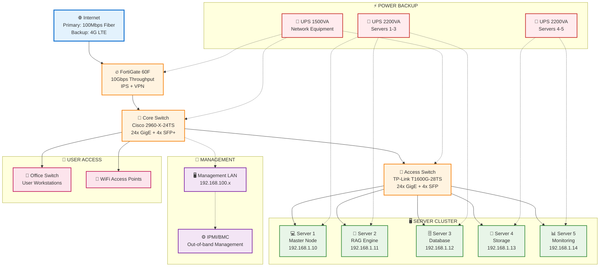

# 📋 DANH SÁCH THIẾT BỊ VÀ CẤU HÌNH TRIỂN KHAI

## 🖥️ **1. CẤU HÌNH MÁY CHỦ (5 PC)**

### **🎯 Server 1 - MASTER NODE (Control Plane)**
```
Vai trò: Kubernetes Master + API Gateway + Load Balancer
Cấu hình tối thiểu:
├── CPU: Intel i7-12700 (12 cores) hoặc AMD Ryzen 7 5700X
├── RAM: 32GB DDR4-3200
├── Storage: 
│   ├── 500GB NVMe SSD (OS + K8s)
│   └── 1TB SATA SSD (Logs + Config)
├── Network: 2x Gigabit Ethernet
├── OS: Ubuntu Server 22.04 LTS
└── Dự phòng: UPS 1500VA
```

### **🤖 Server 2 - RAG ENGINE NODE**
```
Vai trò: RAG Core + Business Logic Services
Cấu hình tối thiểu:
├── CPU: Intel i9-13700K (16 cores) hoặc AMD Ryzen 9 5900X
├── RAM: 64GB DDR4-3200 (cho Vector operations)
├── Storage:
│   ├── 1TB NVMe SSD (Applications)
│   └── 2TB NVMe SSD (Vector cache)
├── GPU: NVIDIA RTX 4060 Ti 16GB (nếu dùng local LLM)
├── Network: 2x Gigabit Ethernet
├── OS: Ubuntu Server 22.04 LTS
└── Dự phòng: UPS 2000VA
```

### **🗄️ Server 3 - DATABASE NODE**  
```
Vai trò: PostgreSQL + Vector Database + Redis
Cấu hình tối thiểu:
├── CPU: Intel i7-13700 (16 cores) hoặc AMD Ryzen 7 5800X
├── RAM: 64GB DDR4-3200 ECC (Database workload)
├── Storage:
│   ├── 500GB NVMe SSD (OS)
│   ├── 4TB NVMe SSD RAID-1 (PostgreSQL)
│   └── 2TB NVMe SSD (Vector DB + Redis)
├── Network: 2x Gigabit Ethernet + 1x 10Gb SFP+ (optional)
├── OS: Ubuntu Server 22.04 LTS
└── Dự phòng: UPS 2000VA + RAID Controller
```

### **📁 Server 4 - STORAGE & PROCESSING NODE**
```
Vai trò: File Storage + Data Processing Pipeline
Cấu hình tối thiểu:
├── CPU: Intel i5-13400 (10 cores) hoặc AMD Ryzen 5 5600X
├── RAM: 32GB DDR4-3200
├── Storage:
│   ├── 500GB NVMe SSD (OS)
│   ├── 8TB HDD RAID-5 (Document storage)
│   └── 2TB NVMe SSD (Processing cache)
├── Network: 2x Gigabit Ethernet
├── OS: Ubuntu Server 22.04 LTS
└── Dự phòng: UPS 1500VA + Hardware RAID
```

### **📊 Server 5 - MONITORING & BACKUP NODE**
```
Vai trò: Prometheus + Grafana + ELK + Backup Services
Cấu hình tối thiểu:
├── CPU: Intel i5-12400 (6 cores) hoặc AMD Ryzen 5 5500
├── RAM: 32GB DDR4-3200
├── Storage:
│   ├── 500GB NVMe SSD (OS + Apps)
│   ├── 4TB HDD (Logs + Metrics)
│   └── 8TB USB 3.0 External (Backup)
├── Network: 2x Gigabit Ethernet
├── OS: Ubuntu Server 22.04 LTS
└── Dự phòng: UPS 1500VA
```

---

## 🌐 **2. THIẾT BỊ MẠNG (NETWORK EQUIPMENT)**

### **🔗 Core Network Switch**
```
Model đề xuất: Cisco Catalyst 2960-X-24TS-L hoặc HP Aruba 2530-24G
Specifications:
├── Ports: 24x Gigabit Ethernet + 4x SFP+ uplinks
├── Switching Capacity: 56 Gbps
├── MAC Address Table: 16K entries
├── VLAN Support: 802.1Q (4096 VLANs)
├── Features: 
│   ├── Layer 2/3 switching
│   ├── LACP (Link Aggregation)
│   ├── STP/RSTP
│   ├── Port Security
│   └── SNMP monitoring
├── Management: Web UI + CLI + SNMP
└── Power: PoE+ capability (optional)
```

### **🛡️ Managed Access Switch**
```
Model đề xuất: TP-Link T1600G-28TS hoặc Netgear GS728T
Specifications:
├── Ports: 24x Gigabit + 4x SFP
├── Switching Capacity: 56 Gbps
├── Features:
│   ├── VLAN support
│   ├── Port mirroring
│   ├── Link Aggregation
│   └── QoS management
├── Management: Web-based + SNMP
└── Budget-friendly alternative
```

### **🔥 Firewall/Router**
```
Model đề xuất: Fortinet FortiGate 60F hoặc pfSense custom build
Specifications:
├── Throughput: 10+ Gbps firewall
├── Ports: 6x Gigabit Ethernet
├── Features:
│   ├── Stateful packet inspection
│   ├── VPN support (IPSec/SSL)
│   ├── Intrusion Prevention (IPS)
│   ├── Application Control
│   ├── Web filtering
│   └── High Availability support
├── Management: Web UI + CLI
└── Licensing: UTM bundle recommended
```

---

## ⚡ **3. HẠ TẦNG HỖ TRỢ (SUPPORTING INFRASTRUCTURE)**

### **🔌 Uninterruptible Power Supply (UPS)**
```
UPS cho Servers (3 units):
├── Model: APC Smart-UPS 2200VA/1980W
├── Runtime: 15-20 minutes at full load
├── Features:
│   ├── Pure sine wave output
│   ├── Automatic Voltage Regulation (AVR)
│   ├── Network monitoring card
│   ├── PowerChute software
│   └── Hot-swappable batteries
└── Backup time: 45+ minutes at 50% load

UPS cho Network Equipment:
├── Model: APC Smart-UPS 1500VA/980W  
├── Runtime: 30+ minutes
└── Dedicated for switches + firewall
```

### **❄️ Cooling & Environment**
```
Rack Cabinet (recommended):
├── 42U Server Rack với wheels
├── Ventilation fans (front + rear)
├── Cable management arms
├── Power Distribution Unit (PDU)
└── Temperature monitoring

Air Conditioning:
├── Dedicated AC unit cho server room
├── Target temperature: 18-24°C
├── Humidity control: 45-55%
└── 24/7 operation capability
```

### **🌐 Internet Connection**
```
Primary Internet:
├── Fiber Optic: 100Mbps+ symmetrical
├── Static IP addresses (minimum 5 IPs)
├── SLA: 99.5%+ uptime
└── Provider: Enterprise-grade (FPT, Viettel, VNPT)

Backup Internet:
├── 4G LTE backup connection
├── 50Mbps+ capability
└── Automatic failover
```

---

## 💰 **4. ƯỚC TÍNH NGÂN SÁCH (VNĐ)**

### **🖥️ Server Hardware:**
| Item | Quantity | Unit Price | Total |
|------|----------|------------|-------|
| Server 1 (Master) | 1 | 35,000,000 | 35,000,000 |
| Server 2 (RAG + GPU) | 1 | 65,000,000 | 65,000,000 |
| Server 3 (Database) | 1 | 45,000,000 | 45,000,000 |
| Server 4 (Storage) | 1 | 30,000,000 | 30,000,000 |
| Server 5 (Monitor) | 1 | 25,000,000 | 25,000,000 |
| **Subtotal Servers** | | | **200,000,000** |

### **🌐 Network Equipment:**
| Item | Quantity | Unit Price | Total |
|------|----------|------------|-------|
| Core Switch (24-port) | 1 | 15,000,000 | 15,000,000 |
| Access Switch | 1 | 5,000,000 | 5,000,000 |
| Firewall/Router | 1 | 12,000,000 | 12,000,000 |
| Network Cables | 1 lot | 2,000,000 | 2,000,000 |
| **Subtotal Network** | | | **34,000,000** |

### **⚡ Infrastructure Support:**
| Item | Quantity | Unit Price | Total |
|------|----------|------------|-------|
| UPS 2200VA | 3 | 8,000,000 | 24,000,000 |
| UPS 1500VA | 1 | 5,000,000 | 5,000,000 |
| Server Rack 42U | 1 | 8,000,000 | 8,000,000 |
| Cooling & Environment | 1 | 10,000,000 | 10,000,000 |
| **Subtotal Infrastructure** | | | **47,000,000** |

### **🌐 Connectivity & Services:**
| Item | Duration | Monthly Cost | Total (1 year) |
|------|----------|--------------|----------------|
| Fiber Internet (100Mbps) | 12 months | 3,000,000 | 36,000,000 |
| 4G Backup | 12 months | 500,000 | 6,000,000 |
| **Subtotal Services** | | | **42,000,000** |

### **💾 Software & Licensing:**
| Item | Type | Cost | Total |
|------|------|------|-------|
| Windows Server (nếu cần) | License | 0 | 0 (dùng Linux) |
| VMware vSphere (optional) | License | 15,000,000 | 15,000,000 |
| Backup Software | License | 5,000,000 | 5,000,000 |
| Monitoring Tools | License | 3,000,000 | 3,000,000 |
| **Subtotal Software** | | | **23,000,000** |

---

## 📊 **TỔNG NGÂN SÁCH THIẾT BỊ**

| Category | Amount (VNĐ) | Percentage |
|----------|--------------|------------|
| 🖥️ **Server Hardware** | 200,000,000 | 57.8% |
| 🌐 **Network Equipment** | 34,000,000 | 9.8% |
| ⚡ **Infrastructure Support** | 47,000,000 | 13.6% |
| 🌐 **Connectivity (1 year)** | 42,000,000 | 12.1% |
| 💾 **Software & Licensing** | 23,000,000 | 6.6% |
| **TỔNG CỘNG** | **346,000,000** | **100%** |

### **🎯 Phân bổ ngân sách theo priority:**
- **Essential (Giai đoạn 1)**: 250,000,000 VNĐ (Server + Network cơ bản)
- **Enhanced (Giai đoạn 2)**: 50,000,000 VNĐ (Infrastructure support)
- **Premium (Giai đoạn 3)**: 46,000,000 VNĐ (Advanced features)

---

## ⚙️ **5. NETWORK TOPOLOGY DIAGRAM**



## 🎯 **6. LỘ TRÌNH TRIỂN KHAI THIẾT BỊ**

### **Phase 1 (Tuần 1-2): Hardware Setup**
- [ ] Đặt mua và nhận servers (5 máy)
- [ ] Cài đặt server rack và cable management
- [ ] Setup UPS và power distribution
- [ ] Cấu hình BIOS và hardware RAID

### **Phase 2 (Tuần 3-4): Network Infrastructure**
- [ ] Cài đặt switches và firewall
- [ ] Cấu hình VLANs và network segmentation  
- [ ] Setup internet connectivity và failover
- [ ] Test network performance và security

### **Phase 3 (Tuần 5-6): Operating System**
- [ ] Cài đặt Ubuntu Server trên tất cả nodes
- [ ] Cấu hình SSH keys và user accounts
- [ ] Setup NTP, DNS và basic security
- [ ] Install Docker và Kubernetes prerequisites

### **Phase 4 (Tuần 7-8): Application Deployment**
- [ ] Deploy Kubernetes cluster
- [ ] Install và configure databases
- [ ] Deploy monitoring stack
- [ ] Basic application testing

Với cấu hình này, hệ thống sẽ có khả năng xử lý 100+ concurrent users và có thể scale up trong tương lai!

---
# 💰 **DANH SÁCH PHẦN MỀM, LICENSE VÀ CHI PHÍ**
## Giai đoạn Phát triển Sản phẩm (3 tháng + 1 năm vận hành)

---

## 🔴 **BẮT BUỘC PHẢI MUA LICENSE**

### **1. 🤖 LLM & AI Services**

| Sản phẩm | Loại License | Chi phí (USD/tháng) | Chi phí (VNĐ/tháng) | Ghi chú |
|----------|--------------|-------------------|-------------------|---------|
| **OpenAI GPT-4 API** | Pay-per-use | $500-2,000 | 12-48 triệu | **BẮT BUỘC** - Core LLM service |
| **OpenAI Embeddings API** | Pay-per-use | $100-500 | 2.5-12 triệu | **BẮT BUỘC** - Text embeddings |
| **Anthropic Claude API** | Pay-per-use | $300-1,000 | 7-24 triệu | Backup/Alternative LLM |

**🔥 Tổng AI Services: 21-84 triệu VNĐ/tháng**

### **2. 🏗️ Infrastructure & Container Platform**

| Sản phẩm | Loại License | Chi phí (USD/năm) | Chi phí (VNĐ/năm) | Ghi chú |
|----------|--------------|-------------------|------------------|---------|
| **Red Hat OpenShift** | Subscription | $10,000-25,000 | 240-600 triệu | Enterprise K8s với support |
| **Docker Enterprise** | Subscription | $2,000-5,000 | 48-120 triệu | Container platform |
| **VMware vSphere** | Perpetual + Support | $3,000-8,000 | 72-192 triệu | Virtualization (nếu on-prem) |

**🔥 Tổng Infrastructure: 360-912 triệu VNĐ/năm**

### **3. 🔒 Security & Compliance**

| Sản phẩm | Loại License | Chi phí (USD/năm) | Chi phí (VNĐ/năm) | Ghi chú |
|----------|--------------|-------------------|------------------|---------|
| **HashiCorp Vault Enterprise** | Subscription | $1,500-3,000 | 36-72 triệu | **BẮT BUỘC** - Secrets management |
| **Aqua Security** | Subscription | $2,000-4,000 | 48-96 triệu | Container security scanning |
| **CrowdStrike Falcon** | Subscription | $3,000-6,000 | 72-144 triệu | Endpoint protection |

**🔥 Tổng Security: 156-312 triệu VNĐ/năm**

### **4. 📊 Monitoring & APM**

| Sản phẩm | Loại License | Chi phí (USD/năm) | Chi phí (VNĐ/năm) | Ghi chú |
|----------|--------------|-------------------|------------------|---------|
| **Datadog Pro** | Subscription | $1,800-3,600 | 43-86 triệu | **BẮT BUỘC** - Full monitoring |
| **New Relic Pro** | Subscription | $1,200-2,400 | 29-58 triệu | Alternative APM |
| **Elastic Stack Gold** | Subscription | $1,000-2,000 | 24-48 triệu | ELK with security features |

**🔥 Tổng Monitoring: 96-192 triệu VNĐ/năm**

---

## 🟡 **KHUYẾN NGHỊ NÊN MUA**

### **5. 🛢️ Database & Storage**

| Sản phẩm | Loại License | Chi phí (USD/năm) | Chi phí (VNĐ/năm) | Ghi chú |
|----------|--------------|-------------------|------------------|---------|
| **PostgreSQL Enterprise** | Support Subscription | $2,000-4,000 | 48-96 triệu | Professional support |
| **Redis Enterprise** | Subscription | $3,000-6,000 | 72-144 triệu | High availability Redis |
| **MinIO Enterprise** | Subscription | $1,000-2,000 | 24-48 triệu | Object storage với support |

**🔥 Tổng Database: 144-288 triệu VNĐ/năm**

### **6. 🔧 Development & DevOps Tools**

| Sản phẩm | Loại License | Chi phí (USD/năm) | Chi phí (VNĐ/năm) | Ghi chú |
|----------|--------------|-------------------|------------------|---------|
| **JetBrains Team License** | Subscription | $500-1,000 | 12-24 triệu | IDE cho dev team |
| **GitHub Enterprise** | Subscription | $840-1,680 | 20-40 triệu | Code repository |
| **Atlassian Suite** | Subscription | $1,200-2,400 | 29-58 triệu | Jira + Confluence |
| **Terraform Enterprise** | Subscription | $1,500-3,000 | 36-72 triệu | Infrastructure as Code |

**🔥 Tổng DevOps Tools: 97-194 triệu VNĐ/năm**

### **7. 🧪 Testing & Quality Assurance**

| Sản phẩm | Loại License | Chi phí (USD/năm) | Chi phí (VNĐ/năm) | Ghi chú |
|----------|--------------|-------------------|------------------|---------|
| **Selenium Grid Enterprise** | Subscription | $500-1,000 | 12-24 triệu | Automated testing |
| **SonarQube Enterprise** | Subscription | $1,500-3,000 | 36-72 triệu | Code quality analysis |
| **Postman Team** | Subscription | $360-720 | 9-17 triệu | API testing |

**🔥 Tổng Testing Tools: 57-113 triệu VNĐ/năm**

---

## 🟢 **MIỄN PHÍ / OPEN SOURCE**

### **8. 🆓 Core Technologies (Không phải trả phí)**

| Sản phẩm | Loại | Chi phí | Ghi chú |
|----------|-----|---------|---------|
| **Kubernetes** | Open Source | FREE | Container orchestration |
| **Docker CE** | Open Source | FREE | Container platform |
| **PostgreSQL** | Open Source | FREE | Primary database |
| **Redis** | Open Source | FREE | Caching layer |
| **Nginx** | Open Source | FREE | Load balancer |
| **Python + FastAPI** | Open Source | FREE | Backend framework |
| **React.js** | Open Source | FREE | Frontend framework |
| **Chroma DB** | Open Source | FREE | Vector database |
| **FAISS** | Open Source | FREE | Vector similarity search |
| **Prometheus** | Open Source | FREE | Metrics collection |
| **Grafana** | Open Source | FREE | Visualization |
| **Elasticsearch** | Open Source | FREE | Search engine |
| **Logstash + Kibana** | Open Source | FREE | Log processing |

---

## 💰 **BẢNG TỔNG KẾT CHI PHÍ**

### **📊 Chi phí theo Giai đoạn**

| Giai đoạn | Thời gian | Chi phí Bắt buộc | Chi phí Khuyến nghị | Tổng cộng |
|-----------|-----------|------------------|-------------------|-----------|
| **Development (3 tháng)** | Q1 | 350-500 triệu | 200-300 triệu | **550-800 triệu VNĐ** |
| **Production (Năm 1)** | 12 tháng | 1,200-1,800 triệu | 600-900 triệu | **1,800-2,700 triệu VNĐ** |
| **Maintenance (Năm 2+)** | 12 tháng/năm | 800-1,200 triệu | 400-600 triệu | **1,200-1,800 triệu VNĐ/năm** |

### **🔥 CHI PHÍ BẮT BUỘC KHÔNG THỂ TRÁNH**

| Hạng mục | Chi phí/tháng | Chi phí/năm | Lý do bắt buộc |
|----------|---------------|-------------|----------------|
| **LLM APIs** | 21-84 triệu | 252-1,008 triệu | Core AI functionality |
| **HashiCorp Vault** | 3-6 triệu | 36-72 triệu | Security compliance |
| **Monitoring (Datadog)** | 4-7 triệu | 43-86 triệu | Production monitoring |
| **Container Platform** | 20-50 triệu | 240-600 triệu | Infrastructure base |

**🔥 Tối thiểu bắt buộc: 48-147 triệu VNĐ/tháng**

---

## 🛡️ **CHIẾN LƯỢC TIẾT KIỆM CHI PHÍ**

### **1. 🥇 Ưu tiên Cao (Giai đoạn đầu)**
- **Self-hosted LLM**: Sử dụng Llama 2, Mistral thay vì OpenAI
- **Open Source Alternatives**: PostgreSQL thay vì Oracle, Nginx thay vì F5
- **Community Versions**: Grafana, Prometheus thay vì commercial tools

### **2. 🥈 Ưu tiên Trung bình**
- **Hybrid Approach**: Combine cloud services với on-premise
- **Spot Instances**: Sử dụng spot instances cho non-critical workloads
- **Reserved Instances**: Commit dài hạn để được discount

### **3. 🥉 Tối ưu Dài hạn**
- **Custom Development**: Thay thế commercial tools bằng in-house solutions
- **Open Source Migration**: Chuyển từ commercial sang open source khi mature
- **Automation**: Giảm operational costs qua automation

---

## 📋 **KHUYẾN NGHỊ TRIỂN KHAI**

### **💡 Phase 1: MVP (3 tháng đầu)**
- Chỉ mua **licenses bắt buộc tối thiểu**: LLM APIs + Basic monitoring
- Sử dụng tối đa **open source solutions**
- **Budget cần thiết**: 550-800 triệu VNĐ

### **💡 Phase 2: Production (6-12 tháng)**
- Thêm **enterprise support** và **advanced security**
- Upgrade lên **commercial monitoring solutions**
- **Budget cần thiết**: 1,200-1,800 triệu VNĐ bổ sung

### **💡 Phase 3: Scale (Năm 2+)**
- **Optimize costs** qua automation và process improvements
- **Negotiate better rates** với vendors
- **Budget maintenance**: 1,200-1,800 triệu VNĐ/năm

---

**🎯 Kết luận: Để triển khai thành công, cần budget tối thiểu 550-800 triệu VNĐ cho giai đoạn development và 1,800-2,700 triệu VNĐ cho năm đầu production.**

---
# 💰 **DANH SÁCH PHẦN MỀM, LICENSE VÀ CHI PHÍ**
## CHIẾN LƯỢC TIẾT KIỆM CHI PHÍ - OPEN SOURCE FIRST

---

## 🟢 **OPEN SOURCE SOLUTIONS (MIỄN PHÍ)**

### **1. 🤖 AI/ML Stack - Self-hosted**

| Sản phẩm | Thay thế cho | Chi phí | Hardware yêu cầu | Ghi chú |
|----------|-------------|---------|------------------|---------|
| **Llama 2 70B** | OpenAI GPT-4 | **FREE** | 2x RTX 4090 (48GB VRAM) | Self-hosted LLM |
| **Mistral 7B** | OpenAI GPT-3.5 | **FREE** | 1x RTX 4090 (24GB VRAM) | Lightweight alternative |
| **Ollama** | LLM hosting platform | **FREE** | CPU + GPU | Easy LLM deployment |
| **Sentence Transformers** | OpenAI Embeddings | **FREE** | CPU/GPU | Local embeddings |
| **HuggingFace Transformers** | Commercial APIs | **FREE** | CPU/GPU | ML model library |

**🔥 Tiết kiệm: 252-1,008 triệu VNĐ/năm so với OpenAI APIs**

### **2. 🏗️ Infrastructure & Container - Open Source**

| Sản phẩm | Thay thế cho | Chi phí | Ghi chú |
|----------|-------------|---------|---------|
| **Kubernetes** | Red Hat OpenShift | **FREE** | Container orchestration |
| **Docker CE** | Docker Enterprise | **FREE** | Container platform |
| **containerd** | Commercial runtimes | **FREE** | Container runtime |
| **Helm** | Commercial package managers | **FREE** | K8s package manager |
| **Istio** | Commercial service mesh | **FREE** | Service mesh |

**🔥 Tiết kiệm: 360-912 triệu VNĐ/năm**

### **3. 🛢️ Database & Storage - Open Source**

| Sản phẩm | Thay thế cho | Chi phí | Ghi chú |
|----------|-------------|---------|---------|
| **PostgreSQL** | Oracle/SQL Server | **FREE** | Primary database |
| **Redis** | Redis Enterprise | **FREE** | Caching layer |
| **Chroma DB** | Pinecone/Weaviate | **FREE** | Vector database |
| **FAISS** | Commercial vector search | **FREE** | Facebook's vector library |
| **MinIO** | AWS S3 | **FREE** | Object storage |
| **GlusterFS** | Commercial NAS | **FREE** | Distributed file system |

**🔥 Tiết kiệm: 144-288 triệu VNĐ/năm**

### **4. 🔒 Security - Open Source**

| Sản phẩm | Thay thế cho | Chi phí | Ghi chú |
|----------|-------------|---------|---------|
| **Vault (Open Source)** | HashiCorp Vault Enterprise | **FREE** | Secrets management |
| **Falco** | Commercial security tools | **FREE** | Runtime security |
| **Open Policy Agent** | Commercial policy engines | **FREE** | Policy management |
| **Let's Encrypt** | Commercial SSL certificates | **FREE** | SSL/TLS certificates |
| **OpenVPN** | Commercial VPN | **FREE** | VPN solution |

**🔥 Tiết kiệm: 156-312 triệu VNĐ/năm**

### **5. 📊 Monitoring & Logging - Community Versions**

| Sản phẩm | Thay thế cho | Chi phí | Ghi chú |
|----------|-------------|---------|---------|
| **Prometheus** | Datadog/New Relic | **FREE** | Metrics collection |
| **Grafana** | Commercial dashboards | **FREE** | Visualization |
| **Elasticsearch** | Splunk | **FREE** | Search & analytics |
| **Logstash** | Commercial log processors | **FREE** | Log processing |
| **Kibana** | Commercial log viewers | **FREE** | Log visualization |
| **Jaeger** | Commercial APM | **FREE** | Distributed tracing |
| **AlertManager** | PagerDuty | **FREE** | Alerting system |

**🔥 Tiết kiệm: 96-192 triệu VNĐ/năm**

### **6. 🌐 Web & API Layer - Open Source**

| Sản phẩm | Thay thế cho | Chi phí | Ghi chú |
|----------|-------------|---------|---------|
| **Nginx** | F5 Load Balancer | **FREE** | Load balancer & reverse proxy |
| **HAProxy** | Commercial load balancers | **FREE** | High availability proxy |
| **Kong** | Commercial API gateways | **FREE** | API gateway |
| **Envoy Proxy** | Commercial proxies | **FREE** | Service proxy |

### **7. 🔧 Development Tools - Open Source**

| Sản phẩm | Thay thế cho | Chi phí | Ghi chú |
|----------|-------------|---------|---------|
| **GitLab CE** | GitHub Enterprise | **FREE** | Git repository + CI/CD |
| **Jenkins** | Commercial CI/CD | **FREE** | Continuous integration |
| **VS Code** | JetBrains IDEs | **FREE** | Development IDE |
| **Terraform** | Terraform Enterprise | **FREE** | Infrastructure as Code |
| **Ansible** | Commercial automation | **FREE** | Configuration management |

**🔥 Tiết kiệm: 97-194 triệu VNĐ/năm**

---

## 🔴 **CHI PHÍ KHÔNG THỂ TRÁNH (HARDWARE & SUPPORT)**

### **8. 🖥️ Hardware cho Self-hosted AI**

| Hardware | Số lượng | Chi phí/unit (VNĐ) | Tổng chi phí | Mục đích |
|----------|----------|-------------------|-------------|---------|
| **Server CPU** (AMD EPYC/Intel Xeon) | 2 servers | 150-200 triệu | 300-400 triệu | Application servers |
| **GPU RTX 4090** (24GB VRAM) | 4 cards | 50-60 triệu | 200-240 triệu | **BẮT BUỘC** - LLM inference |
| **RAM DDR4** (256GB/server) | 2 sets | 50-70 triệu | 100-140 triệu | Memory for AI workloads |
| **NVMe SSD** (4TB enterprise) | 6 drives | 15-20 triệu | 90-120 triệu | High-speed storage |
| **Network Switch** (10Gb) | 2 units | 30-40 triệu | 60-80 triệu | Internal networking |

**🔥 Hardware tổng cộng: 750-980 triệu VNĐ (one-time)**

### **9. 🌐 Internet & Connectivity**

| Service | Chi phí/tháng (VNĐ) | Chi phí/năm | Ghi chú |
|---------|-------------------|------------|---------|
| **Dedicated Internet** (100Mbps) | 10-15 triệu | 120-180 triệu | **BẮT BUỘC** |
| **Backup Internet** (50Mbps) | 5-8 triệu | 60-96 triệu | Redundancy |
| **Domain & SSL** | 0.5-1 triệu | 6-12 triệu | Let's Encrypt free |

**🔥 Connectivity: 186-288 triệu VNĐ/năm**

### **10. ⚡ Điện & Cooling**

| Service | Chi phí/tháng (VNĐ) | Chi phí/năm | Ghi chú |
|---------|-------------------|------------|---------|
| **Điện cho Servers + GPU** | 15-25 triệu | 180-300 triệu | ~10kW continuous |
| **UPS System** | 2-3 triệu | 24-36 triệu | Backup power |
| **Cooling/AC** | 5-8 triệu | 60-96 triệu | Server room cooling |

**🔥 Power & Cooling: 264-432 triệu VNĐ/năm**

### **11. 🛠️ Support & Training**

| Service | Chi phí/năm (VNĐ) | Ghi chú |
|---------|-------------------|---------|
| **Technical Training** | 50-100 triệu | Team training on open source tools |
| **External Consulting** | 100-200 triệu | Setup & optimization |
| **Hardware Warranty** | 50-80 triệu | 3-year warranty extension |

**🔥 Support: 200-380 triệu VNĐ/năm**

---

## 🔄 **HYBRID APPROACH - VÀI THÁNG ĐẦU**

### **12. 🤖 Fallback LLM Services (Tạm thời)**

| Service | Chi phí/tháng | Lý do | Thời gian sử dụng |
|---------|---------------|-------|------------------|
| **OpenAI GPT-4 API** | 5-10 triệu VNĐ | Backup khi self-hosted fail | 3-6 tháng đầu |
| **Claude API** | 3-7 triệu VNĐ | Alternative option | 3-6 tháng đầu |
| **Google Vertex AI** | 2-5 triệu VNĐ | Cost-effective option | 3-6 tháng đầu |

**🔥 Backup APIs: 10-22 triệu VNĐ/tháng (chỉ vài tháng đầu)**

---

## 💰 **BẢNG TỔNG KẾT CHI PHÍ - TIẾT KIỆM**

### **📊 So sánh Trước & Sau Tiết kiệm**

| Hạng mục | Chi phí Thương mại | Chi phí Open Source | Tiết kiệm |
|----------|-------------------|-------------------|-----------|
| **AI/LLM Services** | 252-1,008 triệu/năm | **FREE** (chỉ hardware) | **1,008 triệu** |
| **Infrastructure** | 360-912 triệu/năm | **FREE** | **912 triệu** |
| **Database & Storage** | 144-288 triệu/năm | **FREE** | **288 triệu** |
| **Security Tools** | 156-312 triệu/năm | **FREE** | **312 triệu** |
| **Monitoring** | 96-192 triệu/năm | **FREE** | **192 triệu** |
| **Development Tools** | 97-194 triệu/năm | **FREE** | **194 triệu** |

**🎉 Tổng tiết kiệm: 2,906 triệu VNĐ/năm**

### **🔥 Chi phí Thực tế với Chiến lược Tiết kiệm**

| Giai đoạn | Hardware (One-time) | Vận hành/năm | Tổng chi phí |
|-----------|-------------------|-------------|-------------|
| **Setup (Tháng 0)** | 750-980 triệu | - | **750-980 triệu** |
| **Năm 1** | - | 650-1,100 triệu | **650-1,100 triệu** |
| **Năm 2+** | - | 450-700 triệu | **450-700 triệu/năm** |

### **📋 Breakdown Chi phí Vận hành Hàng năm**

| Hạng mục | Chi phí/năm (VNĐ) | Ghi chú |
|----------|------------------|---------|
| **Internet & Connectivity** | 186-288 triệu | Dedicated internet |
| **Điện & Cooling** | 264-432 triệu | Power consumption |
| **Support & Training** | 200-380 triệu | Technical support |
| **Backup LLM APIs** | 0-120 triệu | Emergency fallback |
| **Hardware Replacement** | 50-100 triệu | Annual hardware refresh |

**🔥 Tổng vận hành: 700-1,320 triệu VNĐ/năm**

---

## 📋 **TIMELINE TRIỂN KHAI TIẾT KIỆM**

### **🗓️ Phase 1: Hardware Setup (Tháng 1-2)**
- Mua hardware servers và GPU
- Setup server room với cooling
- Cài đặt basic infrastructure (K8s, Docker)

### **🗓️ Phase 2: Software Stack (Tháng 2-3)**
- Deploy open source stack
- Setup monitoring (Prometheus + Grafana)
- Configure security (Vault, SSL)

### **🗓️ Phase 3: AI Integration (Tháng 3-4)**
- Deploy self-hosted LLM (Llama 2/Mistral)
- Setup embedding models
- Integrate với backup cloud APIs

### **🗓️ Phase 4: Testing & Optimization (Tháng 4-5)**
- Performance tuning
- Security hardening  
- Load testing với real traffic

---

## 🎯 **KẾT LUẬN CHIẾN LƯỢC TIẾT KIỆM**

### **✅ Ưu điểm:**
- **Tiết kiệm 2.9 tỷ VNĐ/năm** so với commercial solutions
- **Data privacy tối đa** - không gửi data ra bên ngoài
- **Control hoàn toàn** - không phụ thuộc external APIs
- **Customizable** - có thể fine-tune models cho domain cụ thể

### **⚠️ Thách thức:**
- **Initial investment cao** (750-980 triệu setup)
- **Technical expertise** cao để maintain
- **Power consumption** đáng kể
- **Single point of failure** nếu hardware hỏng

### **🏆 Khuyến nghị:**
**Triển khai hybrid approach:**
1. **Tháng 1-6**: Dùng commercial APIs + setup infrastructure
2. **Tháng 7-12**: Chuyển dần sang self-hosted 
3. **Năm 2+**: Hoàn toàn self-hosted với backup APIs

**💡 ROI Break-even**: ~8-12 tháng so với commercial solution**
---


