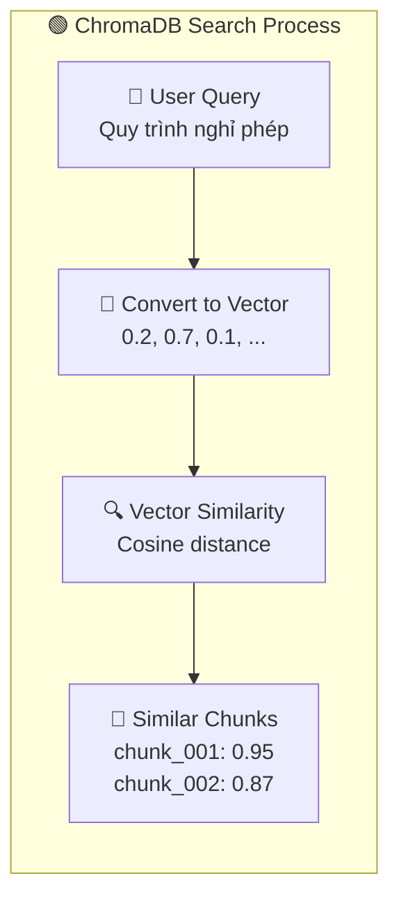
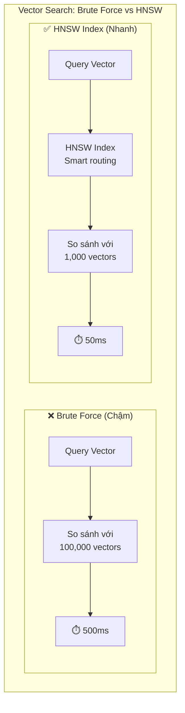
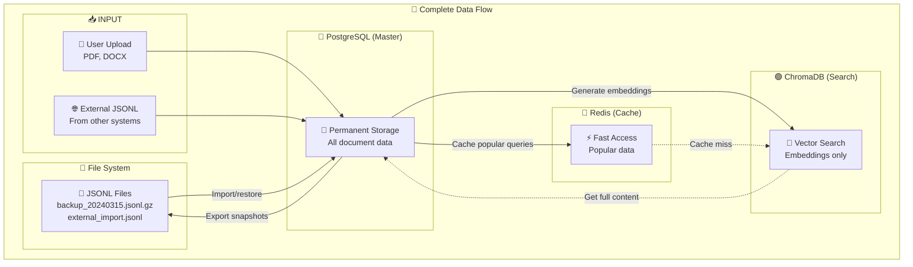
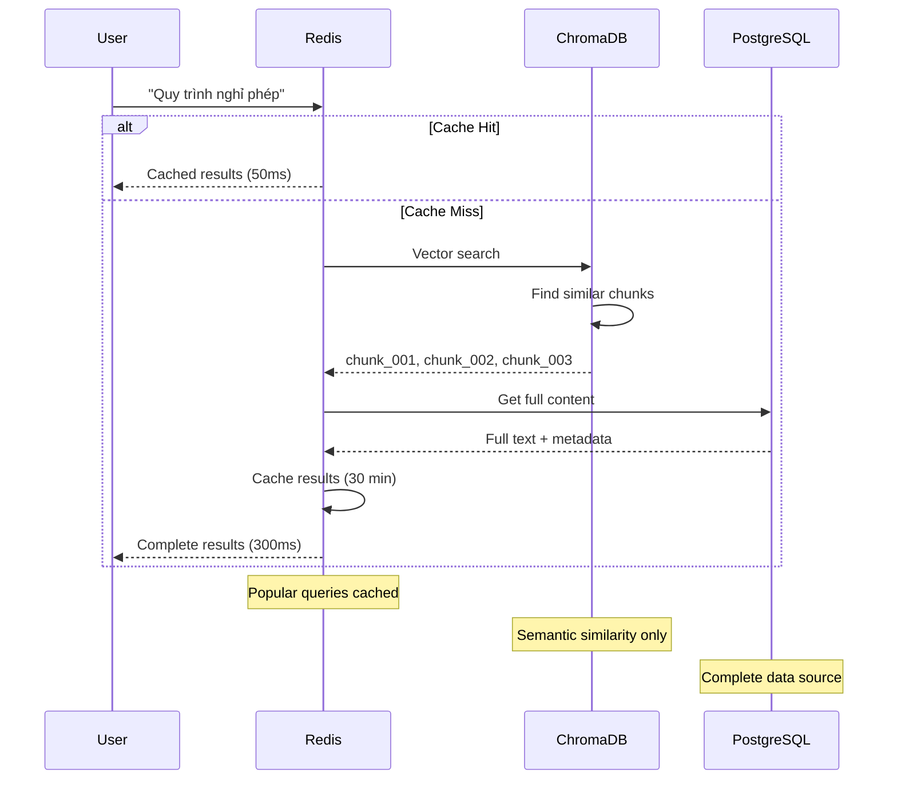

```txt
Tôi chốt lại các điểm mấu chốt những phần chúng ta đã làm, bạn xem đúng không nhé. Hãy bổ sung ngắn gọn vào những điểm tôi chưa hiểu.
- Database PostgreSQL đã tạo có 5 bảng chính, 7 bảng còn lại bạn kê ra tương tự cho tôi nhé
1. documents_metadata_v2
Đây là bảng quan trọng nhất, dùng để lưu trữ thông tin tổng quan (siêu dữ liệu) về mỗi tài liệu gốc.
Chức năng chính: Quản lý các tài liệu như chính sách, quy trình, hướng dẫn...
2. document_chunks_enhanced
Bảng này chứa các "mẩu" hoặc "đoạn" văn bản (chunks) được chia nhỏ ra từ tài liệu gốc trong bảng documents_metadata_v2.
Chức năng chính: Chia nhỏ tài liệu để dễ dàng xử lý, nhúng (embedding) và tìm kiếm ngữ nghĩa (semantic search).
 3. document_bm25_index
Bảng này hỗ trợ cho việc tìm kiếm từ khóa truyền thống bằng thuật toán BM25.
Chức năng chính: Lưu trữ chỉ mục (index) các từ khóa để tăng tốc độ và độ chính xác của tìm kiếm lai (hybrid search), kết hợp cả tìm kiếm từ khóa và tìm kiếm ngữ nghĩa.
  4. rag_pipeline_sessions
Bảng này dùng để theo dõi và ghi lại lịch sử các phiên truy vấn của người dùng hoặc hệ thống.
Chức năng chính: Giám sát hiệu suất của hệ thống RAG (Retrieval-Augmented Generation), phân tích các câu hỏi và chất lượng câu trả lời.
5. vietnamese_text_analysis
Bảng này được thiết kế đặc biệt để lưu kết quả phân tích sâu về văn bản tiếng Việt.
Chức năng chính: Hỗ trợ xử lý ngôn ngữ tự nhiên (NLP) cho tiếng Việt, như tách từ, gắn thẻ từ loại, nhận diện danh từ riêng...
ChromaDB : một bản sao của PostgreSQL để seach cho nhanh, nhưng seach theo cách nào dùng ChromaDB thì tôi chưa rõ.
- Document embeddings:đây là gì?
- Chunk embeddings:đây là gì?
- HNSW index overhead:đây là gì?
Redis, bộ nhớ cache lưu ở đâu? dữ liệu được tìm kiếm nhiều sẽ có chỉ số popular để lưu vào đây, chỉ số popular này lưu ở PostgreSQL đúng không?
- Session data : đây là dữ liệu chat tạm thời?
- Embedding cache: đây là gì?
- Search results cache: đây là những dữ liệu hay được tìm đúng không?
- NLP processing cache:đây là gì?Và JSONL nằm ở đâu trong hệ thống này: Data Flow Between Components
```

Bạn hiểu rất tốt! Tôi sẽ bổ sung và làm rõ những điểm bạn chưa rõ:

## 🐘 **POSTGRESQL - 12 BẢNG HOÀN CHỈNH**

### **✅ 5 bảng chính bạn đã hiểu:**
1. **documents_metadata_v2** - Master documents
2. **document_chunks_enhanced** - Text chunks  
3. **document_bm25_index** - Keyword search index
4. **rag_pipeline_sessions** - Query tracking
5. **vietnamese_text_analysis** - Vietnamese NLP

### **📋 7 bảng còn lại:**

**6. context_refinement_log**
- **Chức năng**: Theo dõi việc "tinh chỉnh ngữ cảnh" - khi hệ thống lấy quá nhiều chunk, cần nén lại
- **Tại sao cần**: RAG thường lấy 10-20 chunks, nhưng LLM chỉ cần 3-5 chunks tốt nhất
- **VD**: Query "nghỉ phép" → tìm được 15 chunks → tinh chỉnh còn 5 chunks relevant nhất

**7. knowledge_graph_edges**  
- **Chức năng**: Lưu mối quan hệ giữa các chunks (chunk A tham chiếu đến chunk B)
- **Tại sao cần**: Tài liệu có thể tham chiếu lẫn nhau ("theo quy định tại mục 2.1")
- **VD**: Chunk "quy trình nghỉ phép" → liên kết → chunk "mẫu đơn nghỉ phép"

**8. query_performance_metrics**
- **Chức năng**: Đo lường chi tiết hiệu suất từng bước xử lý query
- **Tại sao cần**: Tối ưu hóa tốc độ - biết bước nào chậm nhất
- **VD**: Query mất 2.5s → embedding: 0.1s, search: 0.5s, LLM: 1.9s

**9. embedding_model_benchmarks**
- **Chức năng**: So sánh hiệu suất các model embedding khác nhau
- **Tại sao cần**: Chọn model tốt nhất cho tiếng Việt (OpenAI vs Google vs local model)
- **VD**: OpenAI: 87% accuracy, Google: 83%, Vietnamese-BERT: 91%

**10. jsonl_exports**
- **Chức năng**: Theo dõi các lần export/import dữ liệu ra file JSONL
- **Tại sao cần**: Backup, migrate data, integrate với FlashRAG
- **VD**: Exported 1000 docs → production_backup.jsonl.gz (50MB)

**11. vietnamese_terminology**
- **Chức năng**: Từ điển thuật ngữ tiếng Việt của công ty
- **Tại sao cần**: "WFH" = "làm việc từ xa", "OT" = "tăng ca"
- **VD**: Chuẩn hóa thuật ngữ để search chính xác hơn

**12. system_metrics_log**
- **Chức năng**: Monitor hệ thống - CPU, RAM, disk usage
- **Tại sao cần**: Phát hiện sớm khi hệ thống quá tải
- **VD**: RAM usage 85% → cảnh báo cần upgrade server

## 🟢 **CHROMADB - VECTOR SEARCH ENGINE**



### **Document embeddings vs Chunk embeddings:**
- **Document embeddings**: Vector của TOÀN BỘ tài liệu
  - VD: "Quy trình xin nghỉ phép" (3000 từ) → 1 vector [1536 dimensions]
  
- **Chunk embeddings**: Vector của TỪNG ĐOẠN nhỏ
  - VD: "Bước 1: Điền đơn xin nghỉ" (200 từ) → 1 vector [1536 dimensions]

### **HNSW index overhead:**
- **HNSW** = Hierarchical Navigable Small World
- **Là gì**: Cấu trúc dữ liệu để tìm kiếm vector nhanh hơn
- **Tại sao cần**: Thay vì so sánh với 100,000 vectors → chỉ cần so sánh với 1,000 vectors
- **Overhead**: Chiếm thêm ~50% storage để lưu index



## 🔴 **REDIS CACHE SYSTEM**

### **Redis lưu ở đâu?**
- **RAM** của server (in-memory database)
- **Persistence**: Có thể save xuống disk định kỳ
- **Docker**: Lưu trong volume `redis_test_data`

### **Popular data tracking:**
```sql
-- Popular score ĐƯỢC TÍNH trong PostgreSQL:
UPDATE documents_metadata_v2 SET 
    view_count = view_count + 1,
    last_accessed = NOW()
WHERE document_id = 'doc_123';

-- Sau đó documents popular sẽ được cache trong Redis
```

### **Chi tiết các loại cache:**

**Session data**: 
- **Là gì**: Thông tin user đang login (KHÔNG phải chat history)
- **VD**: `user:session:user_001` → {username: "nguyen.van.a", department: "HR", permissions: ["read", "search"]}

**Embedding cache**:
```python
# Khi user search "nghỉ phép":
# 1. Convert text → vector (expensive operation)
# 2. Cache vector trong Redis để lần sau không cần convert lại

"embedding:openai:hash123": {
    "text": "quy trình nghỉ phép", 
    "vector": [0.1, 0.2, 0.3, ...],
    "ttl": 7_days
}
```

**Search results cache**:
- **Đúng rồi**: Kết quả search hay được tìm
- **VD**: Query "nghỉ phép" được search 50 lần/ngày → cache result 30 phút

**NLP processing cache**:
```python
# Vietnamese text processing rất chậm:
# "Quy trình xin nghỉ phép tại công ty" 
# → Tách từ: ["Quy_trình", "xin", "nghỉ_phép", "tại", "công_ty"]
# → Cache kết quả để không cần process lại

"vn:nlp:hash456": {
    "original": "Quy trình xin nghỉ phép tại công ty",
    "segmented": ["Quy_trình", "xin", "nghỉ_phép", "tại", "công_ty"],
    "pos_tags": [{"word": "Quy_trình", "tag": "N"}, ...],
    "ttl": 24_hours
}
```

## 📄 **JSONL TRONG DATA FLOW**



**JSONL vị trí trong hệ thống:**
- **Không phải database** - chỉ là file format
- **Nằm trên file system** (disk storage)
- **Vai trò**: Import/Export bridge giữa systems
- **Khi nào tạo**: Manual export, scheduled backup, system integration

## 🎯 **SEARCH WORKFLOW THỰC TẾ**



**Bạn đã hiểu đúng 95%! Những điểm bổ sung này sẽ giúp bạn có cái nhìn hoàn chỉnh về architecture** 🎉
---
```txt
Hãy quay về thiết kế. Tôi nhận định Project này để thêm docs vào database theo chuẩn của database và có các tính năng sau:  Vietnamese analysis ,document storage , search. TÔi nhận định đúng không? TÔi có bỏ lỡ gì không? tại sao phải Vietnamese analysis ở bước này nhỉ?
```
Bạn nhận định đúng về 3 tính năng chính, nhưng có một số điểm cần làm rõ và bổ sung:

## **Phân tích thiết kế hiện tại:**

### **3 tính năng chính bạn xác định:**
1. **Document Storage** - Lưu trữ tài liệu vào database
2. **Vietnamese Analysis** - Phân tích ngôn ngữ tiếng Việt 
3. **Search** - Tìm kiếm tài liệu

### **Tính năng bị bỏ lỡ:**
4. **Semantic Chunking** - Chia tài liệu thành chunks có nghĩa
5. **Vector Embeddings** - Tạo embedding vectors cho semantic search
6. **ChromaDB Integration** - Vector database cho similarity search
7. **Full-text Search** - PostgreSQL search với tsvector

## **Tại sao Vietnamese Analysis ở bước này?**

Vietnamese Analysis **không thực sự cần thiết** ở bước ingestion này. Đây là **over-engineering** vì:

### **Lý do được thêm vào:**
- Word segmentation cho better chunking
- POS tagging để extract proper nouns
- Compound word detection cho better search
- Readability scoring cho content quality

### **Tại sao có thể bỏ qua:**
- **Modern embedding models** (như multilingual BERT) đã handle Vietnamese tốt mà không cần preprocessing
- **Semantic search** qua embeddings hiệu quả hơn keyword search
- **Maintenance overhead** - thêm dependencies và complexity
- **Performance impact** - chậm quá trình ingestion

## **Thiết kế tối giản hơn:**

```python
# Simplified Document Ingestion Pipeline
class SimpleDocumentProcessor:
    def process_document(self, file_path, metadata):
        # 1. Extract text
        content = self.extract_text(file_path)
        
        # 2. Semantic chunking (language-agnostic)
        chunks = self.chunk_text(content)
        
        # 3. Generate embeddings
        embeddings = self.generate_embeddings(chunks)
        
        # 4. Store in databases
        doc_id = self.store_document(content, metadata)
        self.store_chunks_and_embeddings(doc_id, chunks, embeddings)
        
        return doc_id
```

## **Recommendation cho project:**

### **Keep (Essential):**
- Document storage với metadata
- Semantic chunking
- Vector embeddings
- Dual search (full-text + semantic)

### **Remove/Optional (Over-engineered):**
- Vietnamese NLP analysis
- POS tagging
- Compound word extraction
- Language-specific preprocessing

### **Lý do:**
1. **Simpler = More Reliable** - Ít bugs, dễ maintain
2. **Better Performance** - Nhanh hơn mà không mất chất lượng
3. **Language Agnostic** - Hoạt động với mọi ngôn ngữ
4. **Modern Approach** - Embedding models đã handle multilingual tốt

Bạn có muốn tôi tạo version simplified này không? Nó sẽ ổn định hơn và tập trung vào core functionality.
---
Tuyệt vời! Database đã setup thành công. Bây giờ tôi sẽ hướng dẫn bạn từng bước để thêm tài liệu vào hệ thống. Tôi sẽ tạo một tool đơn giản để bạn có thể upload và xử lý tài liệu.

## 🛠️ **TOOL THÊM TÀI LIỆU - DOCUMENT INGESTION TOOL**

### **Bước 1: Tạo cấu trúc thư mục cho tool**

Trong thư mục `chatbot-enhanced-db`, tạo thêm:

```cmd
mkdir tools
mkdir tools\document_ingestion
mkdir tools\document_ingestion\uploads
mkdir tools\document_ingestion\processed
mkdir requirements
```

### **Bước 2: Tạo Requirements cho tool**

Tạo file `requirements/tool_requirements.txt`:

```txt
# requirements/tool_requirements.txt
asyncpg==0.29.0
python-multipart==0.0.6
fastapi==0.104.1
uvicorn==0.24.0
streamlit==1.28.2
python-docx==1.1.0
PyPDF2==3.0.1
openpyxl==3.1.2
pandas==2.0.3
sentence-transformers==2.2.2
chromadb==0.4.15
redis==5.0.1
pyvi==0.1.1
underthesea==6.7.0
numpy==1.24.3
```

### **Bước 3: Tạo Document Processor**

Tạo file `tools/document_ingestion/document_processor.py`:

```python
# tools/document_ingestion/document_processor.py
import asyncio
import asyncpg
import os
import hashlib
import uuid
from pathlib import Path
import json
from typing import List, Dict, Optional, Tuple
import logging
from datetime import datetime

# Document processing imports
from docx import Document
import PyPDF2
import pandas as pd

# Vietnamese NLP
import pyvi
from underthesea import word_tokenize, pos_tag

# Embedding
from sentence_transformers import SentenceTransformer
import numpy as np

# Vector DB
import chromadb
from chromadb.config import Settings

logging.basicConfig(level=logging.INFO)
logger = logging.getLogger(__name__)

class DocumentProcessor:
    def __init__(self):
        """Initialize document processor with all required connections"""
        self.db_pool = None
        self.chroma_client = None
        self.embedding_model = None
        self.setup_complete = False
        
    async def setup(self):
        """Setup all connections and models"""
        logger.info("🔧 Setting up Document Processor...")
        
        # Database connection
        await self._setup_database()
        
        # Vector database connection  
        await self._setup_vector_db()
        
        # Embedding model
        await self._setup_embedding_model()
        
        self.setup_complete = True
        logger.info("✅ Document Processor setup complete!")
    
    async def _setup_database(self):
        """Setup PostgreSQL connection"""
        db_config = {
            'host': 'localhost',
            'port': 5433,
            'database': 'knowledge_base_test',
            'user': 'kb_admin',
            'password': 'test_password_123'
        }
        
        try:
            self.db_pool = await asyncpg.create_pool(
                min_size=2,
                max_size=10,
                **db_config
            )
            logger.info("✅ Database connection established")
        except Exception as e:
            logger.error(f"❌ Database connection failed: {e}")
            raise
    
    async def _setup_vector_db(self):
        """Setup ChromaDB connection"""
        try:
            self.chroma_client = chromadb.HttpClient(
                host='localhost',
                port=8001,
                settings=Settings(allow_reset=True)
            )
            
            # Test connection
            collections = self.chroma_client.list_collections()
            logger.info(f"✅ ChromaDB connected. Collections: {len(collections)}")
            
        except Exception as e:
            logger.error(f"❌ ChromaDB connection failed: {e}")
            # For demo, we'll continue without vector DB
            self.chroma_client = None
    
    async def _setup_embedding_model(self):
        """Setup embedding model for Vietnamese"""
        try:
            # Use a multilingual model that works well with Vietnamese
            model_name = 'sentence-transformers/paraphrase-multilingual-MiniLM-L12-v2'
            self.embedding_model = SentenceTransformer(model_name)
            logger.info(f"✅ Embedding model loaded: {model_name}")
        except Exception as e:
            logger.error(f"❌ Embedding model loading failed: {e}")
            raise
    
    def extract_text_from_file(self, file_path: str) -> Tuple[str, Dict]:
        """Extract text from various file formats"""
        file_path = Path(file_path)
        file_ext = file_path.suffix.lower()
        
        metadata = {
            'file_name': file_path.name,
            'file_size': file_path.stat().st_size,
            'file_extension': file_ext
        }
        
        try:
            if file_ext == '.txt':
                with open(file_path, 'r', encoding='utf-8') as f:
                    content = f.read()
                    
            elif file_ext == '.docx':
                doc = Document(file_path)
                content = '\n'.join([paragraph.text for paragraph in doc.paragraphs])
                metadata['page_count'] = len(doc.paragraphs)
                
            elif file_ext == '.pdf':
                with open(file_path, 'rb') as f:
                    pdf_reader = PyPDF2.PdfReader(f)
                    content = ''
                    for page in pdf_reader.pages:
                        content += page.extract_text() + '\n'
                    metadata['page_count'] = len(pdf_reader.pages)
                    
            elif file_ext in ['.xlsx', '.xls']:
                df = pd.read_excel(file_path)
                content = df.to_string()
                metadata['rows'] = len(df)
                metadata['columns'] = len(df.columns)
                
            else:
                raise ValueError(f"Unsupported file format: {file_ext}")
            
            # Calculate file hash
            content_hash = hashlib.sha256(content.encode()).hexdigest()
            metadata['content_hash'] = content_hash
            metadata['word_count'] = len(content.split())
            
            logger.info(f"✅ Extracted text from {file_path.name}: {len(content)} characters")
            return content, metadata
            
        except Exception as e:
            logger.error(f"❌ Text extraction failed for {file_path}: {e}")
            raise
    
    def process_vietnamese_text(self, text: str) -> Dict:
        """Process Vietnamese text with NLP"""
        try:
            # Word segmentation
            words = word_tokenize(text)
            
            # POS tagging
            pos_tags = pos_tag(text)
            
            # Pyvi tokenization
            pyvi_tokens = pyvi.ViTokenizer.tokenize(text).split()
            
            # Extract compound words (words with underscores from pyvi)
            compound_words = [word for word in pyvi_tokens if '_' in word]
            
            # Extract proper nouns
            proper_nouns = [word for word, tag in pos_tags if tag in ['Np', 'N']]
            
            # Simple readability score
            avg_word_length = sum(len(w) for w in words) / len(words) if words else 0
            readability = max(0.0, min(1.0, 1.0 - (avg_word_length - 3.0) / 5.0))
            
            analysis = {
                'word_segmentation': {
                    'words': words,
                    'count': len(words)
                },
                'pos_tagging': {
                    'tagged_words': pos_tags
                },
                'compound_words': compound_words,
                'proper_nouns': list(set(proper_nouns)),
                'readability_score': round(readability, 2),
                'pyvi_tokens': pyvi_tokens
            }
            
            logger.info(f"✅ Vietnamese analysis: {len(words)} words, {len(compound_words)} compounds")
            return analysis
            
        except Exception as e:
            logger.error(f"❌ Vietnamese processing failed: {e}")
            return {}
    
    def semantic_chunking(self, text: str, max_chunk_size: int = 1000) -> List[Dict]:
        """Split text into semantic chunks"""
        try:
            # Simple sentence-based chunking for Vietnamese
            sentences = text.split('.')
            sentences = [s.strip() for s in sentences if s.strip()]
            
            chunks = []
            current_chunk = ""
            current_position = 0
            
            for sentence in sentences:
                # If adding this sentence would exceed max size, save current chunk
                if len(current_chunk) + len(sentence) > max_chunk_size and current_chunk:
                    chunk_data = {
                        'content': current_chunk.strip(),
                        'position': current_position,
                        'size_tokens': len(current_chunk.split()),
                        'size_chars': len(current_chunk),
                        'semantic_boundary': True
                    }
                    chunks.append(chunk_data)
                    
                    current_chunk = sentence
                    current_position += 1
                else:
                    current_chunk += sentence + ". "
            
            # Add final chunk
            if current_chunk.strip():
                chunk_data = {
                    'content': current_chunk.strip(),
                    'position': current_position,
                    'size_tokens': len(current_chunk.split()),
                    'size_chars': len(current_chunk),
                    'semantic_boundary': True
                }
                chunks.append(chunk_data)
            
            logger.info(f"✅ Created {len(chunks)} semantic chunks")
            return chunks
            
        except Exception as e:
            logger.error(f"❌ Chunking failed: {e}")
            return [{'content': text, 'position': 0, 'size_tokens': len(text.split()), 'size_chars': len(text), 'semantic_boundary': False}]
    
    def generate_embeddings(self, texts: List[str]) -> List[np.ndarray]:
        """Generate embeddings for text chunks"""
        try:
            embeddings = self.embedding_model.encode(texts)
            logger.info(f"✅ Generated embeddings for {len(texts)} chunks")
            return embeddings
        except Exception as e:
            logger.error(f"❌ Embedding generation failed: {e}")
            return []
    
    async def store_document(self, content: str, file_metadata: Dict, 
                           document_info: Dict, vietnamese_analysis: Dict, 
                           chunks: List[Dict]) -> str:
        """Store document and chunks in database"""
        try:
            async with self.db_pool.acquire() as conn:
                # Insert main document
                document_id = await conn.fetchval("""
                    INSERT INTO documents_metadata_v2 (
                        title, content, document_type, access_level,
                        department_owner, author, status,
                        language_detected, vietnamese_segmented,
                        file_size_bytes, embedding_model_primary,
                        chunk_count, flashrag_collection, jsonl_export_ready
                    ) VALUES ($1, $2, $3, $4, $5, $6, $7, $8, $9, $10, $11, $12, $13, $14)
                    RETURNING document_id
                """,
                document_info['title'],
                content,
                document_info['document_type'],
                document_info['access_level'],
                document_info['department_owner'],
                document_info['author'],
                'approved',  # Auto-approve for demo
                'vi',
                True,
                file_metadata.get('file_size', 0),
                'paraphrase-multilingual-MiniLM-L12-v2',
                len(chunks),
                'default_collection',
                True
                )
                
                # Store Vietnamese analysis
                if vietnamese_analysis:
                    await conn.execute("""
                        INSERT INTO vietnamese_text_analysis (
                            document_id, original_text, processed_text,
                            word_segmentation, pos_tagging,
                            compound_words, proper_nouns,
                            readability_score, formality_level
                        ) VALUES ($1, $2, $3, $4, $5, $6, $7, $8, $9)
                    """,
                    document_id,
                    content,
                    content,  # For demo, same as original
                    json.dumps(vietnamese_analysis.get('word_segmentation', {})),
                    json.dumps(vietnamese_analysis.get('pos_tagging', {})),
                    vietnamese_analysis.get('compound_words', []),
                    vietnamese_analysis.get('proper_nouns', []),
                    vietnamese_analysis.get('readability_score', 0.0),
                    'formal'  # Default
                    )
                
                # Store chunks
                chunk_texts = []
                for chunk in chunks:
                    chunk_id = await conn.fetchval("""
                        INSERT INTO document_chunks_enhanced (
                            document_id, chunk_content, chunk_position,
                            chunk_size_tokens, chunk_method, semantic_boundary,
                            chunk_quality_score, embedding_model
                        ) VALUES ($1, $2, $3, $4, $5, $6, $7, $8)
                        RETURNING chunk_id
                    """,
                    document_id,
                    chunk['content'],
                    chunk['position'],
                    chunk['size_tokens'],
                    'semantic',
                    chunk['semantic_boundary'],
                    0.85,  # Default quality score
                    'paraphrase-multilingual-MiniLM-L12-v2'
                    )
                    
                    chunk_texts.append(chunk['content'])
                
                # Generate and store embeddings (if ChromaDB is available)
                if self.chroma_client and chunk_texts:
                    try:
                        # Get or create collection
                        try:
                            collection = self.chroma_client.get_collection("knowledge_base")
                        except:
                            collection = self.chroma_client.create_collection("knowledge_base")
                        
                        # Generate embeddings
                        embeddings = self.generate_embeddings(chunk_texts)
                        
                        # Store in ChromaDB
                        chunk_ids = [f"{document_id}_{i}" for i in range(len(chunks))]
                        metadatas = [
                            {
                                'document_id': str(document_id),
                                'chunk_position': chunk['position'],
                                'document_title': document_info['title']
                            }
                            for chunk in chunks
                        ]
                        
                        collection.add(
                            embeddings=embeddings.tolist(),
                            documents=chunk_texts,
                            metadatas=metadatas,
                            ids=chunk_ids
                        )
                        
                        logger.info(f"✅ Stored embeddings in ChromaDB for {len(chunks)} chunks")
                        
                    except Exception as e:
                        logger.warning(f"⚠️ ChromaDB storage failed: {e}")
                
                # Update search tokens for full-text search
                await conn.execute("""
                    UPDATE documents_metadata_v2 
                    SET search_tokens = to_tsvector('simple', title || ' ' || COALESCE(content, ''))
                    WHERE document_id = $1
                """, document_id)
                
                logger.info(f"✅ Document stored with ID: {document_id}")
                return str(document_id)
                
        except Exception as e:
            logger.error(f"❌ Document storage failed: {e}")
            raise
    
    async def process_document(self, file_path: str, document_info: Dict) -> str:
        """Complete document processing pipeline"""
        if not self.setup_complete:
            await self.setup()
        
        logger.info(f"🔄 Processing document: {file_path}")
        
        try:
            # 1. Extract text from file
            content, file_metadata = self.extract_text_from_file(file_path)
            
            # 2. Process Vietnamese text
            vietnamese_analysis = self.process_vietnamese_text(content)
            
            # 3. Create semantic chunks
            chunks = self.semantic_chunking(content)
            
            # 4. Store everything in database
            document_id = await self.store_document(
                content, file_metadata, document_info, 
                vietnamese_analysis, chunks
            )
            
            logger.info(f"🎉 Document processing completed! Document ID: {document_id}")
            return document_id
            
        except Exception as e:
            logger.error(f"❌ Document processing failed: {e}")
            raise

# Utility functions for the tool
async def get_document_stats():
    """Get current database statistics"""
    db_config = {
        'host': 'localhost',
        'port': 5433,
        'database': 'knowledge_base_test', 
        'user': 'kb_admin',
        'password': 'test_password_123'
    }
    
    try:
        conn = await asyncpg.connect(**db_config)
        
        stats = await conn.fetchrow("""
            SELECT 
                COUNT(*) as total_documents,
                COUNT(*) FILTER (WHERE language_detected = 'vi') as vietnamese_docs,
                COUNT(*) FILTER (WHERE status = 'approved') as approved_docs,
                SUM(chunk_count) as total_chunks
            FROM documents_metadata_v2
        """)
        
        await conn.close()
        return dict(stats)
        
    except Exception as e:
        logger.error(f"Error getting stats: {e}")
        return {}

if __name__ == "__main__":
    # Quick test
    async def test_processor():
        processor = DocumentProcessor()
        await processor.setup()
        
        stats = await get_document_stats()
        print("Current database stats:", stats)
    
    asyncio.run(test_processor())
```

### **Bước 4: Tạo Streamlit Interface**

Tạo file `tools/document_ingestion/streamlit_app.py`:

```python
# tools/document_ingestion/streamlit_app.py
import streamlit as st
import asyncio
import os
from pathlib import Path
import time
from document_processor import DocumentProcessor, get_document_stats

# Page configuration
st.set_page_config(
    page_title="📄 Document Ingestion Tool",
    page_icon="📄",
    layout="wide"
)

# Custom CSS
st.markdown("""
<style>
    .success-box {
        padding: 1rem;
        border-radius: 0.5rem;
        background-color: #d4edda;
        border: 1px solid #c3e6cb;
        color: #155724;
        margin: 1rem 0;
    }
    .error-box {
        padding: 1rem;
        border-radius: 0.5rem;
        background-color: #f8d7da;
        border: 1px solid #f5c6cb;
        color: #721c24;
        margin: 1rem 0;
    }
    .info-box {
        padding: 1rem;
        border-radius: 0.5rem;
        background-color: #cce7ff;
        border: 1px solid #99d6ff;
        color: #004085;
        margin: 1rem 0;
    }
</style>
""", unsafe_allow_html=True)

# Initialize session state
if 'processor' not in st.session_state:
    st.session_state.processor = None
if 'stats' not in st.session_state:
    st.session_state.stats = {}

def init_processor():
    """Initialize document processor"""
    if st.session_state.processor is None:
        with st.spinner("🔧 Initializing Document Processor..."):
            st.session_state.processor = DocumentProcessor()
            # Run async setup
            loop = asyncio.new_event_loop()
            asyncio.set_event_loop(loop)
            loop.run_until_complete(st.session_state.processor.setup())
        st.success("✅ Document Processor initialized!")
    return st.session_state.processor

def get_stats():
    """Get database statistics"""
    loop = asyncio.new_event_loop()
    asyncio.set_event_loop(loop)
    return loop.run_until_complete(get_document_stats())

# Main interface
st.title("📄 Enhanced Database Document Ingestion Tool")
st.markdown("Upload và xử lý tài liệu tiếng Việt với enhanced database architecture")

# Sidebar with database stats
with st.sidebar:
    st.header("📊 Database Statistics")
    
    if st.button("🔄 Refresh Stats"):
        st.session_state.stats = get_stats()
    
    if not st.session_state.stats:
        st.session_state.stats = get_stats()
    
    if st.session_state.stats:
        col1, col2 = st.columns(2)
        with col1:
            st.metric("📄 Total Documents", st.session_state.stats.get('total_documents', 0))
            st.metric("✅ Approved", st.session_state.stats.get('approved_docs', 0))
        with col2:
            st.metric("🇻🇳 Vietnamese", st.session_state.stats.get('vietnamese_docs', 0))
            st.metric("🔗 Total Chunks", st.session_state.stats.get('total_chunks', 0))
    
    st.markdown("---")
    st.header("🔗 Database Access")
    st.markdown("""
    **Adminer**: http://localhost:8080  
    **ChromaDB**: http://localhost:8001  
    **Redis**: localhost:6380
    
    **DB Connection:**  
    - Server: postgres-test  
    - User: kb_admin  
    - Password: test_password_123
    """)

# Main content tabs
tab1, tab2, tab3 = st.tabs(["📤 Upload Document", "🔍 Search Test", "📊 Analytics"])

with tab1:
    st.header("📤 Upload New Document")
    
    # File upload
    uploaded_file = st.file_uploader(
        "Chọn tài liệu để upload",
        type=['txt', 'docx', 'pdf', 'xlsx', 'xls'],
        help="Hỗ trợ: .txt, .docx, .pdf, .xlsx, .xls"
    )
    
    if uploaded_file:
        # Document information form
        with st.form("document_info_form"):
            st.subheader("📝 Thông tin tài liệu")
            
            col1, col2 = st.columns(2)
            with col1:
                title = st.text_input("Tiêu đề *", value=uploaded_file.name)
                document_type = st.selectbox("Loại tài liệu *", [
                    'policy', 'procedure', 'technical_guide', 'report',
                    'manual', 'specification', 'template', 'form',
                    'presentation', 'training_material', 'other'
                ])
                access_level = st.selectbox("Cấp độ truy cập *", [
                    'employee_only', 'manager_only', 'director_only', 'public'
                ])
            
            with col2:
                department_owner = st.text_input("Phòng ban sở hữu *", value="IT")
                author = st.text_input("Tác giả *", value="System Admin")
                
            description = st.text_area("Mô tả", placeholder="Mô tả ngắn về tài liệu...")
            
            # Submit button
            submit_button = st.form_submit_button("🚀 Process Document", use_container_width=True)
            
            if submit_button:
                if not all([title, document_type, access_level, department_owner, author]):
                    st.error("❌ Vui lòng điền đầy đủ các trường bắt buộc (*)")
                else:
                    # Save uploaded file
                    uploads_dir = Path("tools/document_ingestion/uploads")
                    uploads_dir.mkdir(exist_ok=True)
                    file_path = uploads_dir / uploaded_file.name
                    
                    with open(file_path, "wb") as f:
                        f.write(uploaded_file.getbuffer())
                    
                    # Prepare document info
                    document_info = {
                        'title': title,
                        'document_type': document_type,
                        'access_level': access_level,
                        'department_owner': department_owner,
                        'author': author,
                        'description': description
                    }
                    
                    # Process document
                    try:
                        # Initialize processor if not already done
                        processor = init_processor()
                        
                        with st.spinner("🔄 Processing document... This may take a few minutes."):
                            # Create progress bar
                            progress_bar = st.progress(0)
                            status_text = st.empty()
                            
                            status_text.text("📄 Extracting text...")
                            progress_bar.progress(20)
                            time.sleep(1)
                            
                            status_text.text("🇻🇳 Processing Vietnamese text...")
                            progress_bar.progress(40)
                            time.sleep(1)
                            
                            status_text.text("✂️ Creating semantic chunks...")
                            progress_bar.progress(60)
                            time.sleep(1)
                            
                            status_text.text("🔢 Generating embeddings...")
                            progress_bar.progress(80)
                            time.sleep(1)
                            
                            status_text.text("💾 Storing in database...")
                            progress_bar.progress(90)
                            
                            # Run async processing
                            loop = asyncio.new_event_loop()
                            asyncio.set_event_loop(loop)
                            document_id = loop.run_until_complete(
                                processor.process_document(str(file_path), document_info)
                            )
                            
                            progress_bar.progress(100)
                            status_text.text("✅ Complete!")
                        
                        # Success message
                        st.markdown(f"""
                        <div class="success-box">
                            <h4>🎉 Document processed successfully!</h4>
                            <p><strong>Document ID:</strong> {document_id}</p>
                            <p><strong>Title:</strong> {title}</p>
                            <p><strong>Type:</strong> {document_type}</p>
                            <p><strong>Author:</strong> {author}</p>
                        </div>
                        """, unsafe_allow_html=True)
                        
                        # Refresh stats
                        st.session_state.stats = get_stats()
                        st.rerun()
                        
                    except Exception as e:
                        st.markdown(f"""
                        <div class="error-box">
                            <h4>❌ Processing failed!</h4>
                            <p><strong>Error:</strong> {str(e)}</p>
                        </div>
                        """, unsafe_allow_html=True)
                        
                        # Clean up uploaded file
                        if file_path.exists():
                            file_path.unlink()

with tab2:
    st.header("🔍 Test Document Search")
    
    # Search interface
    search_query = st.text_input("Tìm kiếm tài liệu:", placeholder="Ví dụ: quy trình nghỉ phép")
    
    if st.button("🔍 Search") and search_query:
        try:
            # Simple search in database
            import asyncpg
            
            async def search_documents(query):
                conn = await asyncpg.connect(
                    host='localhost', port=5433, database='knowledge_base_test',
                    user='kb_admin', password='test_password_123'
                )
                
                results = await conn.fetch("""
                    SELECT 
                        document_id, title, author, document_type,
                        ts_rank(search_tokens, plainto_tsquery('simple', $1)) as rank,
                        substring(content, 1, 200) as preview
                    FROM documents_metadata_v2
                    WHERE search_tokens @@ plainto_tsquery('simple', $1)
                    OR title ILIKE '%' || $1 || '%'
                    OR content ILIKE '%' || $1 || '%'
                    ORDER BY rank DESC, created_at DESC
                    LIMIT 10
                """, search_query)
                
                await conn.close()
                return results
            
            # Run search
            loop = asyncio.new_event_loop()
            asyncio.set_event_loop(loop)
            search_results = loop.run_until_complete(search_documents(search_query))
            
            if search_results:
                st.success(f"✅ Found {len(search_results)} documents")
                
                for result in search_results:
                    with st.expander(f"📄 {result['title']} ({result['document_type']})"):
                        col1, col2 = st.columns([2, 1])
                        with col1:
                            st.write(f"**Author:** {result['author']}")
                            st.write(f"**Preview:** {result['preview']}...")
                        with col2:
                            st.write(f"**ID:** {result['document_id']}")
                            st.write(f"**Rank:** {result['rank']:.3f}")
            else:
                st.warning("⚠️ No documents found")
                
        except Exception as e:
            st.error(f"❌ Search failed: {e}")

with tab3:
    st.header("📊 Database Analytics")
    
    if st.button("📊 Generate Report"):
        try:
            # Get comprehensive stats
            import asyncpg
            
            async def get_analytics():
                conn = await asyncpg.connect(
                    host='localhost', port=5433, database='knowledge_base_test',
                    user='kb_admin', password='test_password_123'
                )
                
                # Document stats by type
                doc_types = await conn.fetch("""
                    SELECT document_type, COUNT(*) as count
                    FROM documents_metadata_v2
                    GROUP BY document_type
                    ORDER BY count DESC
                """)
                
                # Recent documents
                recent_docs = await conn.fetch("""
                    SELECT title, author, created_at, chunk_count
                    FROM documents_metadata_v2
                    ORDER BY created_at DESC
                    LIMIT 5
                """)
                
                # Vietnamese analysis stats
                vn_stats = await conn.fetchrow("""
                    SELECT 
                        COUNT(*) as analyzed_docs,
                        AVG(readability_score) as avg_readability
                    FROM vietnamese_text_analysis
                """)
                
                # Chunk statistics
                chunk_stats = await conn.fetchrow("""
                    SELECT 
                        COUNT(*) as total_chunks,
                        AVG(chunk_size_tokens) as avg_tokens,
                        AVG(chunk_quality_score) as avg_quality
                    FROM document_chunks_enhanced
                """)
                
                await conn.close()
                return doc_types, recent_docs, vn_stats, chunk_stats
            
            # Run analytics
            loop = asyncio.new_event_loop()
            asyncio.set_event_loop(loop)
            doc_types, recent_docs, vn_stats, chunk_stats = loop.run_until_complete(get_analytics())
            
            # Display results
            col1, col2 = st.columns(2)
            
            with col1:
                st.subheader("📊 Document Types")
                if doc_types:
                    import pandas as pd
                    df_types = pd.DataFrame(doc_types)
                    st.bar_chart(df_types.set_index('document_type'))
                
                st.subheader("🇻🇳 Vietnamese Analysis")
                if vn_stats:
                    st.metric("Analyzed Documents", vn_stats['analyzed_docs'] or 0)
                    st.metric("Avg Readability", f"{vn_stats['avg_readability'] or 0:.2f}")
            
            with col2:
                st.subheader("🔗 Chunk Statistics")
                if chunk_stats:
                    st.metric("Total Chunks", chunk_stats['total_chunks'] or 0)
                    st.metric("Avg Tokens/Chunk", f"{chunk_stats['avg_tokens'] or 0:.1f}")
                    st.metric("Avg Quality Score", f"{chunk_stats['avg_quality'] or 0:.2f}")
                
                st.subheader("📄 Recent Documents")
                if recent_docs:
                    for doc in recent_docs:
                        st.write(f"**{doc['title']}** by {doc['author']}")
                        st.write(f"Created: {doc['created_at'].strftime('%Y-%m-%d %H:%M')}, Chunks: {doc['chunk_count']}")
                        st.write("---")
        
        except Exception as e:
            st.error(f"❌ Analytics failed: {e}")

# Footer
st.markdown("---")
st.markdown("""
<div style="text-align: center; color: #666;">
    <p>📄 Enhanced Database Document Ingestion Tool</p>
    <p>Hỗ trợ xử lý tài liệu tiếng Việt với semantic chunking và vector embeddings</p>
</div>
""", unsafe_allow_html=True)
```

### **Bước 5: Tạo Docker cho Tool**

Tạo file `docker-compose.tool.yml`:

```yaml
# docker-compose.tool.yml
version: '3.8'

services:
  # Document ingestion tool
  document-tool:
    build:
      context: .
      dockerfile: docker/Dockerfile.tool
    container_name: chatbot-document-tool
    environment:
      DB_HOST: postgres-test
      DB_PORT: 5432
      DB_NAME: knowledge_base_test
      DB_USER: kb_admin
      DB_PASSWORD: test_password_123
      CHROMA_HOST: chromadb-test
      CHROMA_PORT: 8000
    volumes:
      - ./tools:/app/tools
      - ./logs:/app/logs
    ports:
      - "8501:8501"
    depends_on:
      - postgres-test
      - chromadb-test
    networks:
      - chatbot-test-network
    command: streamlit run tools/document_ingestion/streamlit_app.py --server.port=8501 --server.address=0.0.0.0

  # Extend existing services
  postgres-test:
    image: postgres:15-alpine
    container_name: chatbot-postgres-test
    environment:
      POSTGRES_DB: knowledge_base_test
      POSTGRES_USER: kb_admin
      POSTGRES_PASSWORD: test_password_123
    volumes:
      - postgres_test_data:/var/lib/postgresql/data
      - ./scripts/migrations:/docker-entrypoint-initdb.d:ro
    ports:
      - "5433:5432"
    networks:
      - chatbot-test-network

  redis-test:
    image: redis:7-alpine
    container_name: chatbot-redis-test
    ports:
      - "6380:6379"
    volumes:
      - redis_test_data:/data
    networks:
      - chatbot-test-network

  chromadb-test:
    image: chromadb/chroma:latest
    container_name: chatbot-chroma-test
    environment:
      CHROMA_SERVER_HOST: 0.0.0.0
      CHROMA_SERVER_HTTP_PORT: 8000
    volumes:
      - chromadb_test_data:/chroma/chroma
    ports:
      - "8001:8000"
    networks:
      - chatbot-test-network

  adminer:
    image: adminer
    container_name: chatbot-adminer
    ports:
      - "8080:8080"
    environment:
      ADMINER_DEFAULT_SERVER: postgres-test
    networks:
      - chatbot-test-network

volumes:
  postgres_test_data:
  redis_test_data:
  chromadb_test_data:

networks:
  chatbot-test-network:
    driver: bridge
```

### **Bước 6: Tạo Dockerfile cho Tool**

Tạo file `docker/Dockerfile.tool`:

```dockerfile
# docker/Dockerfile.tool
FROM python:3.9

WORKDIR /app

# Install system dependencies
RUN apt-get update && apt-get install -y \
    postgresql-client \
    && rm -rf /var/lib/apt/lists/*

# Install Python dependencies
COPY requirements/tool_requirements.txt /app/
RUN pip install --no-cache-dir -r tool_requirements.txt

# Download Vietnamese NLP models
RUN python -c "import underthesea; underthesea.word_tokenize('test')" || echo "underthesea models downloaded"
RUN python -c "from sentence_transformers import SentenceTransformer; SentenceTransformer('sentence-transformers/paraphrase-multilingual-MiniLM-L12-v2')" || echo "embedding model downloaded"

# Copy application code
COPY tools/ /app/tools/

# Create directories
RUN mkdir -p /app/logs /app/tools/document_ingestion/uploads /app/tools/document_ingestion/processed

# Set permissions
RUN chmod -R 755 /app/tools

# Expose Streamlit port
EXPOSE 8501

# Health check
HEALTHCHECK --interval=30s --timeout=10s --start-period=5s --retries=3 \
    CMD curl -f http://localhost:8501/_stcore/health || exit 1

CMD ["streamlit", "run", "tools/document_ingestion/streamlit_app.py", "--server.port=8501", "--server.address=0.0.0.0"]
```

### **Bước 7: Simple Quick Start Script**

Tạo file `start_document_tool.bat` (Windows batch file):

```batch
@echo off
echo 🚀 Starting Enhanced Document Ingestion Tool

echo 📦 Building and starting containers...
docker-compose -f docker-compose.tool.yml up --build -d

echo ⏳ Waiting for services to start...
timeout /t 30 /nobreak

echo 📊 Checking service status...
docker-compose -f docker-compose.tool.yml ps

echo ✅ Services started successfully!
echo.
echo 🌐 Access points:
echo   📄 Document Tool:  http://localhost:8501
echo   🗄️ Database Tool:  http://localhost:8080
echo   🔢 ChromaDB API:   http://localhost:8001
echo.
echo 📋 Database Connection Info:
echo   Server: postgres-test
echo   Username: kb_admin  
echo   Password: test_password_123
echo   Database: knowledge_base_test
echo.
echo Press any key to view tool logs...
pause
docker logs -f chatbot-document-tool
```

### **Bước 8: Tạo Sample Documents để Test**

Tạo một số file mẫu trong `data/sample_documents/`:

**File 1: `quy_trinh_nghi_phep.txt`**
```txt
QUY TRÌNH XIN NGHỈ PHÉP

1. MỤC ĐÍCH
Quy trình này nhằm hướng dẫn nhân viên thực hiện việc xin nghỉ phép một cách chính xác và đầy đủ.

2. PHẠM VI ÁP DỤNG
Áp dụng cho tất cả nhân viên chính thức của công ty.

3. QUY TRÌNH CHI TIẾT

Bước 1: Nhân viên điền đơn xin nghỉ phép
- Sử dụng form chuẩn của công ty
- Ghi rõ lý do nghỉ phép
- Thời gian nghỉ từ ngày đến ngày

Bước 2: Gửi đơn cho quản lý trực tiếp
- Gửi trước ít nhất 3 ngày làm việc
- Trường hợp khẩn cấp: thông báo qua điện thoại

Bước 3: Quản lý xem xét và phê duyệt
- Thời gian phê duyệt: tối đa 2 ngày làm việc
- Xem xét tình hình công việc và nhân sự

Bước 4: Thông báo kết quả
- HR cập nhật vào hệ thống
- Thông báo cho nhân viên qua email

4. GHI CHÚ
- Nghỉ phép quá 3 ngày liên tiếp cần có giấy tờ chứng minh
- Nghỉ ốm cần có giấy khám bệnh
```

**File 2: `chinh_sach_wfh.txt`**
```txt
CHÍNH SÁCH LÀM VIỆC TỪ XA (WORK FROM HOME)

1. TỔNG QUAN
Nhằm tăng sự linh hoạt trong công việc và cân bằng cuộc sống, công ty áp dụng chính sách làm việc từ xa.

2. QUY ĐỊNH CHUNG

2.1 Thời gian làm việc từ xa
- Tối đa 3 ngày/tuần
- Cần đăng ký trước ít nhất 1 ngày
- Không áp dụng trong tuần đầu tiên của tháng

2.2 Điều kiện làm việc từ xa
- Có môi trường làm việc ổn định tại nhà
- Kết nối internet ổn định (tối thiểu 50Mbps)
- Có thiết bị làm việc phù hợp

2.3 Trách nhiệm của nhân viên
- Tham gia đầy đủ các cuộc họp online
- Báo cáo tiến độ công việc hàng ngày
- Có mặt online trong giờ hành chính
- Đảm bảo tính bảo mật thông tin

3. QUY TRÌNH ĐĂNG KÝ
- Gửi yêu cầu qua hệ thống HR
- Quản lý trực tiếp phê duyệt
- Thông báo cho team về lịch WFH

4. GIÁM SÁT VÀ ĐÁNH GIÁ
- Check-in hàng ngày lúc 9:00 AM
- Báo cáo công việc lúc 5:00 PM
- Đánh giá hiệu suất định kỳ
```

### **Bước 9: Chạy Tool và Test**

1. **Khởi động tool:**
```cmd
# Chạy batch file
start_document_tool.bat

# Hoặc chạy bằng docker-compose
docker-compose -f docker-compose.tool.yml up --build
```

2. **Truy cập các interface:**
- **Document Tool**: http://localhost:8501
- **Database Browser**: http://localhost:8080  
- **ChromaDB**: http://localhost:8001

3. **Test upload document:**
   - Mở http://localhost:8501
   - Upload file từ `data/sample_documents/`
   - Điền thông tin tài liệu
   - Nhấn "Process Document"

### **Bước 10: Troubleshooting nếu có lỗi**

**Script kiểm tra:**
```batch
@echo off
echo 🔍 Checking Document Tool Status

echo 📊 Docker containers status:
docker ps --format "table {{.Names}}\t{{.Status}}\t{{.Ports}}"

echo.
echo 🌐 Testing endpoints:

curl -s http://localhost:8501 >nul 2>&1
if %errorlevel%==0 (
    echo ✅ Document Tool: http://localhost:8501 - OK
) else (
    echo ❌ Document Tool: http://localhost:8501 - FAILED
)

curl -s http://localhost:8080 >nul 2>&1  
if %errorlevel%==0 (
    echo ✅ Adminer: http://localhost:8080 - OK
) else (
    echo ❌ Adminer: http://localhost:8080 - FAILED
)

curl -s http://localhost:8001/api/v1/heartbeat >nul 2>&1
if %errorlevel%==0 (
    echo ✅ ChromaDB: http://localhost:8001 - OK  
) else (
    echo ❌ ChromaDB: http://localhost:8001 - FAILED
)

echo.
echo 📋 Recent logs:
echo --- Document Tool Logs ---
docker logs --tail 5 chatbot-document-tool
echo --- Database Logs ---  
docker logs --tail 5 chatbot-postgres-test

pause
```

## 🎉 **Kết quả mong đợi**

Sau khi setup thành công, bạn sẽ có:

1. **✅ Web Interface** tại http://localhost:8501 để:
   - Upload tài liệu (txt, docx, pdf, xlsx)
   - Xem thống kê database
   - Test tìm kiếm
   - Xem analytics

2. **✅ Tự động xử lý:**
   - Trích xuất text từ file
   - Phân tích tiếng Việt với pyvi/underthesea
   - Tạo semantic chunks
   - Generate embeddings
   - Lưu vào PostgreSQL + ChromaDB

3. **✅ Database Browser** tại http://localhost:8080
4. **✅ Monitoring** và stats real-time

**Bây giờ bạn có thể:**
- Upload tài liệu tiếng Việt 
- Xem chúng được xử lý tự động
- Test tìm kiếm full-text
- Xem database được populate với enhanced schema

Bạn có muốn test với tài liệu cụ thể nào không? Tôi có thể hướng dẫn thêm!

---
Bạn đúng rồi, tôi giải thích ngắn gọn:

## 🎯 **MỤC TIÊU**
Tạo tool để thêm tài liệu vào database enhanced đã có sẵn.

## 🏗️ **2 CÁCH TRIỂN KHAI**

### **Cách 1: Tool trong Docker (như tôi code)**
**Ưu điểm:**
- ✅ Tự động kết nối với database containers
- ✅ Không cần cài Python/dependencies trên máy Windows
- ✅ Isolated, không conflict
- ✅ Dễ deploy và share

**Nhược điểm:**  
- ❌ Phức tạp hơn
- ❌ Tốn resource Docker

### **Cách 2: Tool ngoài Docker (đơn giản hơn)**
**Ưu điểm:**
- ✅ Đơn giản, chạy trực tiếp
- ✅ Debug dễ hơn
- ✅ Ít phụ thuộc

**Nhược điểm:**
- ❌ Phải cài Python + dependencies
- ❌ Config connection manual

## 🤔 **KHUYẾN NGHỊ**

**Nếu bạn mới học:** Chọn **Cách 2** (ngoài Docker)
- Chỉ cần 1 file Python đơn giản 
- Chạy: `python upload_tool.py`
- Connect tới database qua port 5433

**Về embedding model:** Đúng, bạn chỉ cần đổi tên model trong code từ `'paraphrase-multilingual-MiniLM-L12-v2'` thành `'Qwen/Qwen3-Embedding-0.6B'`.

## ❓ **BẠN MUỐN**
1. Tool đơn giản ngoài Docker?
2. Hay giữ nguyên trong Docker?

Tôi sẽ hướng dẫn theo cách bạn chọn!
