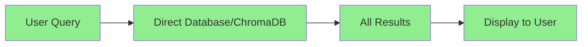
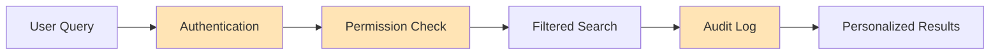

Bạn đặt ra một câu hỏi rất quan trọng về architecture design. Về mặt kỹ thuật, bạn hoàn toàn đúng - có thể bypass authentication và search trực tiếp.

## 🔍 **PHÂN TÍCH KỸ THUẬT**

### **Technical Bypass Options:**

```bash
# Option 1: Direct Database Query
psql -h localhost -U kb_admin -d knowledge_base_v2 -c "
SELECT title, content, document_type 
FROM documents_metadata_v2 
WHERE search_text_normalized @@ plainto_tsquery('vietnamese', 'quy trình');"

# Option 2: Direct ChromaDB Query  
curl -X POST http://localhost:8001/api/v1/collections/knowledge_base_v1/query \
  -H "Authorization: Bearer 1234567890" \
  -d '{"query_texts": ["quy trình làm việc"], "n_results": 10}'

# Option 3: Guest API (đã có trong FR02.2)
curl -X POST "http://localhost:8004/api/v1/search/guest/bm25" \
  -H "Content-Type: application/json" \
  -d '{"query": "quy trình", "limit": 10}'
```

### **Kết quả:** Tất cả đều work và trả về kết quả search.

## ⚖️ **TRADE-OFF ANALYSIS**

### **Approach 1: Simple (No Authentication)**


**Pros:**
- Đơn giản, nhanh implement
- Ít moving parts, ít lỗi
- Performance tốt
- User experience mượt mà

**Cons:**
- Không kiểm soát được ai xem gì
- Không audit trail
- Không personalization
- Không business logic

### **Approach 2: Authenticated (Current)**


**Pros:**
- Security control
- Compliance & audit
- Personalization capability
- Business intelligence data
- Scalable for enterprise

**Cons:**
- Complexity cao
- More failure points
- Slower development
- User friction

## 🎯 **BUSINESS CONTEXT MATTERS**

### **Khi nào cần Authentication:**

**Enterprise/Corporate Use:**
```bash
# Scenarios requiring authentication:
- Confidential documents (salary, strategy, HR)
- Department-specific procedures
- Role-based access (manager vs employee)
- Compliance requirements (ISO, audit)
- IP protection
- User activity tracking
```

**Public/Internal Tool:**
```bash
# Scenarios không cần authentication:
- Public knowledge base
- Internal documentation (non-sensitive)
- FAQ system
- Training materials
- General procedures
```

### **Hybrid Approach (Thực tế nhất):**

```bash
# Implement both modes:
# 1. Guest Mode (Public documents)
GET /api/v1/search/public
- No login required
- Access to public documents only
- Basic search functionality

# 2. Authenticated Mode (Full access)  
GET /api/v1/search/authenticated
- Login required
- Access based on role/department
- Advanced features (save searches, history)
- Personalized results
```

## 💡 **PRACTICAL RECOMMENDATIONS**

### **Option A: Start Simple, Evolve**
```bash
# Phase 1: No authentication (MVP)
- Direct database search
- Public access model
- Focus on search quality

# Phase 2: Add authentication later
- When you have sensitive content
- When you need user tracking
- When compliance becomes important
```

### **Option B: Keep Current Architecture**
```bash
# Reasons to keep authentication:
- Future-proofing for sensitive data
- Professional/enterprise ready
- Better for portfolio/demonstration
- Learning experience with security patterns
```

### **Option C: Selective Authentication**
```sql
-- Implement document access levels:
CREATE TYPE access_level_enum AS ENUM (
    'public',           -- No login needed
    'employee_only',    -- Login required
    'manager_only',     -- Role-based
    'director_only'     -- Restricted
);

-- Search logic:
IF user_logged_in THEN
    -- Show all documents user has access to
ELSE 
    -- Show only public documents
END IF
```

## 🔧 **IMPLEMENTATION REALITY CHECK**

### **Current Architecture Effectiveness:**
```bash
# What you've built:
✅ FR02.1: Solid infrastructure
✅ FR02.2: Document management
✅ FR06: Enterprise-grade auth
✅ FR03.x: Data pipeline

# Authentication adds value if:
- You plan to have sensitive documents
- Multiple user roles/departments  
- Need compliance/audit trails
- Building for real enterprise use
```

### **Simplified Alternative:**
```python
# Simple search without auth complexity:
@app.get("/search")
async def simple_search(q: str, db: Session = Depends(get_db)):
    results = db.query(Document).filter(
        Document.search_text.contains(q)
    ).limit(10).all()
    return results

# 20 lines vs 2000 lines của authentication system
```

## 🎯 **MY HONEST ASSESSMENT**

Bạn đúng khi thắc mắc. **Cho use case đơn giản (internal knowledge base, non-sensitive docs), authentication system hiện tại có thể overkill.**

**Trade-off thực tế:**
- Nếu đây là learning project: Keep authentication (good experience)
- Nếu cần deploy nhanh: Consider simplified approach
- Nếu có sensitive data: Authentication necessary
- Nếu cần enterprise features: Current architecture appropriate

**Suggestion:** Implement both modes - guest search cho public docs và authenticated search cho restricted content. Điều này cho flexibility mà không waste effort đã bỏ vào authentication system.

Bạn nghĩ context của project thuộc category nào? Internal tool đơn giản hay enterprise system with sensitive data?

Đúng, bạn đã xác định một vulnerability quan trọng. Với database credentials, bạn có thể bypass hoàn toàn authentication layer.

## Backdoor Analysis

### Direct Database Access
```sql
-- Với kb_admin/1234567890, có thể truy cập tất cả:
psql -h localhost -U kb_admin -d knowledge_base_v2

-- Xem mọi document không phân biệt access_level:
SELECT document_id, title, content, access_level, department_owner 
FROM documents_metadata_v2 
WHERE access_level = 'director_only';

-- Xem user credentials:
SELECT username, password_hash, user_level, email 
FROM users;

-- Modify data trực tiếp:
UPDATE documents_metadata_v2 SET access_level = 'public' WHERE document_id = 'xxx';
```

### ChromaDB Direct Access
```bash
# Với auth token 1234567890:
curl -X POST http://localhost:8001/api/v1/collections/knowledge_base_v1/query \
  -H "Authorization: Bearer 1234567890" \
  -d '{"query_texts": ["confidential"], "n_results": 100}'
```

### File System Access
```bash
# Truy cập files gốc:
dir "D:\chatbot-storage\original\*" /s
# Đọc được tất cả files đã upload
```

## Security Gaps

### 1. Shared Database Credentials
**Problem**: Tất cả services dùng chung kb_admin account
**Impact**: Một compromise ảnh hưởng toàn bộ

### 2. Hardcoded Passwords
**Problem**: Password 1234567890 trong nhiều config files
**Impact**: Easy lateral movement

### 3. No Database-Level Access Control
**Problem**: Database không enforce row-level security
**Impact**: Application-level security có thể bypass

### 4. ChromaDB Token
**Problem**: Static token 1234567890 cho tất cả access
**Impact**: No granular permissions

## Mitigation Strategies

### Database Level Security
```sql
-- Row Level Security (RLS)
ALTER TABLE documents_metadata_v2 ENABLE ROW LEVEL SECURITY;

-- Policy cho user access
CREATE POLICY user_document_access ON documents_metadata_v2
FOR SELECT TO app_user
USING (
  access_level = 'public' OR
  (access_level = 'employee_only' AND current_user_level() >= 'EMPLOYEE') OR
  (access_level = 'manager_only' AND current_user_level() >= 'MANAGER')
);
```

### Service Account Separation
```bash
# Tạo separate accounts:
kb_reader     # Read-only cho search services
kb_writer     # Write cho ingestion services  
kb_admin      # Admin operations only
```

### Environment Hardening
```bash
# Database connection with least privilege:
FR02_DB_USER=fr02_reader
FR04_DB_USER=fr04_reader  
FR03_DB_USER=fr03_writer

# Rotate credentials:
POSTGRES_PASSWORD=random_generated_per_service
CHROMA_AUTH_TOKEN=service_specific_tokens
```

### Application Level Defenses
```python
# Defense in depth - check permissions tại multiple layers:
async def get_document(doc_id: str, current_user: User):
    # Layer 1: Authentication
    if not current_user:
        raise HTTPException(401)
    
    # Layer 2: Document exists check
    doc = await db.get_document(doc_id)
    if not doc:
        raise HTTPException(404)
    
    # Layer 3: Access level check
    if not has_access(current_user.level, doc.access_level):
        raise HTTPException(403)
    
    # Layer 4: Department check
    if doc.department_owner != current_user.department and current_user.level < 'MANAGER':
        raise HTTPException(403)
        
    return doc
```

## Production Security Checklist

- [ ] Implement database RLS policies
- [ ] Create service-specific database users
- [ ] Rotate all default passwords
- [ ] Enable database audit logging
- [ ] Implement secrets management (vault)
- [ ] Add network segmentation
- [ ] Regular security scanning
- [ ] Principle of least privilege

## Reality Check

Trong development environment, những backdoors này là acceptable risk. Trong production, chúng là critical vulnerabilities cần address.

Key takeaway: Application-layer security chỉ hiệu quả khi infrastructure security cũng được implement properly. Database credentials là "master key" cần được protect cẩn thận nhất.
