Tuyệt vời! Tôi sẽ hướng dẫn bạn các phương pháp backup database chuẩn công nghiệp, đặc biệt cho hệ thống chatbot với kiến trúc phức tạp như chúng ta đã thiết kế.

## 🏭 **BACKUP STRATEGIES CHUẨN CÔNG NGHIỆP**

### **1. 📋 PHÂN LOẠI BACKUP THEO MỨC ĐỘ**

```mermaid
graph TB
    subgraph "🎯 BACKUP CLASSIFICATION"
        subgraph "Theo Frequency"
            Continuous[⚡ Continuous Backup<br/>Point-in-time recovery]
            Hourly[⏰ Hourly Backup<br/>Critical data]
            Daily[📅 Daily Backup<br/>Full system]
            Weekly[📊 Weekly Backup<br/>Deep archive]
            Monthly[📦 Monthly Backup<br/>Long-term storage]
        end
        
        subgraph "Theo Data Type"
            Structured[🗄️ Structured Data<br/>PostgreSQL/MySQL]
            Unstructured[📄 Unstructured Data<br/>Documents/Files]
            Vector[🧮 Vector Data<br/>Embeddings/ChromaDB]
            Cache[⚡ Cache Data<br/>Redis/Memcached]
            Config[⚙️ Configuration<br/>Settings/Secrets]
        end
        
        subgraph "Theo Recovery Time"
            RTO_Zero[🚀 RTO < 1min<br/>Hot standby]
            RTO_Fast[⚡ RTO < 15min<br/>Warm standby]
            RTO_Standard[📋 RTO < 1hour<br/>Cold backup]
            RTO_Archive[📦 RTO < 24hours<br/>Deep archive]
        end
    end
```



### **2. 🏗️ COMPREHENSIVE BACKUP ARCHITECTURE**

```yaml
# docker-compose.backup.yml - Production Backup System
version: '3.8'

services:
  # Primary Database with Streaming Replication
  postgres-primary:
    image: postgres:15
    container_name: postgres-primary
    environment:
      POSTGRES_DB: knowledge_base
      POSTGRES_USER: kb_admin
      POSTGRES_PASSWORD: ${POSTGRES_PASSWORD}
      POSTGRES_REPLICATION_USER: replicator
      POSTGRES_REPLICATION_PASSWORD: ${REPLICATION_PASSWORD}
    volumes:
      - postgres_primary_data:/var/lib/postgresql/data
      - ./config/postgres/postgresql.conf:/etc/postgresql/postgresql.conf
      - ./config/postgres/pg_hba.conf:/etc/postgresql/pg_hba.conf
      - ./backups/wal:/var/lib/postgresql/wal_archive
    command: postgres -c config_file=/etc/postgresql/postgresql.conf
    ports:
      - "5432:5432"
    networks:
      - backup_network

  # Streaming Replica for High Availability
  postgres-replica:
    image: postgres:15
    container_name: postgres-replica
    environment:
      POSTGRES_DB: knowledge_base
      POSTGRES_USER: kb_admin
      POSTGRES_PASSWORD: ${POSTGRES_PASSWORD}
      PGUSER: postgres
      POSTGRES_PRIMARY_USER: replicator
      POSTGRES_PRIMARY_PASSWORD: ${REPLICATION_PASSWORD}
      POSTGRES_PRIMARY_HOST: postgres-primary
      POSTGRES_PRIMARY_PORT: 5432
    volumes:
      - postgres_replica_data:/var/lib/postgresql/data
    command: |
      bash -c "
      until pg_basebackup -h postgres-primary -D /var/lib/postgresql/data -U replicator -v -P -W; do
        echo 'Waiting for primary to be ready...'
        sleep 5s
      done
      echo 'standby_mode = on' >> /var/lib/postgresql/data/recovery.conf
      echo 'primary_conninfo = ''host=postgres-primary port=5432 user=replicator''' >> /var/lib/postgresql/data/recovery.conf
      postgres
      "
    depends_on:
      - postgres-primary
    ports:
      - "5433:5432"
    networks:
      - backup_network

  # Automated Backup Service
  backup-manager:
    build:
      context: .
      dockerfile: docker/Dockerfile.backup
    container_name: backup-manager
    environment:
      PRIMARY_DB_HOST: postgres-primary
      REPLICA_DB_HOST: postgres-replica
      DB_USER: kb_admin
      DB_PASSWORD: ${POSTGRES_PASSWORD}
      DB_NAME: knowledge_base
      
      # Backup destinations
      S3_BUCKET: ${BACKUP_S3_BUCKET}
      S3_ACCESS_KEY: ${S3_ACCESS_KEY}
      S3_SECRET_KEY: ${S3_SECRET_KEY}
      
      # Retention policies
      DAILY_RETENTION: 30
      WEEKLY_RETENTION: 12
      MONTHLY_RETENTION: 12
      YEARLY_RETENTION: 7
      
      # Monitoring
      SLACK_WEBHOOK: ${SLACK_BACKUP_WEBHOOK}
      EMAIL_ALERTS: ${BACKUP_EMAIL_ALERTS}
    volumes:
      - ./backups:/app/backups
      - ./scripts/backup:/app/scripts
      - ./logs/backup:/app/logs
      - /var/run/docker.sock:/var/run/docker.sock:ro
    depends_on:
      - postgres-primary
      - postgres-replica
    command: python /app/scripts/backup_orchestrator.py
    networks:
      - backup_network

  # Vector Database Backup
  vector-backup:
    image: python:3.9-slim
    container_name: vector-backup
    environment:
      CHROMA_HOST: chromadb
      CHROMA_PORT: 8000
      BACKUP_SCHEDULE: "0 */6 * * *"  # Every 6 hours
    volumes:
      - chromadb_data:/source/chromadb:ro
      - ./backups/vector:/app/backups
    command: |
      bash -c "
      pip install schedule boto3 &&
      python /app/scripts/vector_backup.py
      "
    networks:
      - backup_network

  # Monitoring and Alerting
  backup-monitor:
    image: grafana/grafana:latest
    container_name: backup-monitor
    environment:
      GF_SECURITY_ADMIN_PASSWORD: ${GRAFANA_PASSWORD}
    volumes:
      - grafana_backup_data:/var/lib/grafana
      - ./config/grafana/backup-dashboard.json:/etc/grafana/provisioning/dashboards/backup.json
    ports:
      - "3000:3000"
    networks:
      - backup_network

volumes:
  postgres_primary_data:
  postgres_replica_data:
  chromadb_data:
  grafana_backup_data:

networks:
  backup_network:
    driver: bridge
```

### **3. 🛠️ INDUSTRIAL-GRADE BACKUP SCRIPTS**

#### **PostgreSQL Comprehensive Backup**

```python
# scripts/backup/postgres_backup_manager.py
import asyncio
import asyncpg
import subprocess
import boto3
import os
import gzip
import json
from datetime import datetime, timedelta
from pathlib import Path
import logging
import hashlib
from typing import Dict, List, Optional

logging.basicConfig(level=logging.INFO)
logger = logging.getLogger(__name__)

class PostgreSQLBackupManager:
    def __init__(self):
        self.db_config = {
            'host': os.getenv('PRIMARY_DB_HOST', 'localhost'),
            'port': 5432,
            'database': os.getenv('DB_NAME', 'knowledge_base'),
            'user': os.getenv('DB_USER', 'kb_admin'),
            'password': os.getenv('DB_PASSWORD')
        }
        
        self.backup_dir = Path('/app/backups/postgres')
        self.backup_dir.mkdir(parents=True, exist_ok=True)
        
        # S3 configuration
        self.s3_client = boto3.client(
            's3',
            aws_access_key_id=os.getenv('S3_ACCESS_KEY'),
            aws_secret_access_key=os.getenv('S3_SECRET_KEY'),
            region_name=os.getenv('S3_REGION', 'us-east-1')
        )
        self.s3_bucket = os.getenv('BACKUP_S3_BUCKET')
        
        # Retention configuration
        self.retention_policy = {
            'daily': int(os.getenv('DAILY_RETENTION', 30)),
            'weekly': int(os.getenv('WEEKLY_RETENTION', 12)),
            'monthly': int(os.getenv('MONTHLY_RETENTION', 12)),
            'yearly': int(os.getenv('YEARLY_RETENTION', 7))
        }

    async def create_full_backup(self, backup_type: str = 'daily') -> Dict:
        """Create a complete database backup"""
        timestamp = datetime.now().strftime('%Y%m%d_%H%M%S')
        backup_name = f"postgres_full_{backup_type}_{timestamp}"
        backup_path = self.backup_dir / f"{backup_name}.sql.gz"
        
        logger.info(f"🗄️ Starting {backup_type} full backup: {backup_name}")
        
        try:
            # 1. Pre-backup checks
            await self._verify_database_health()
            
            # 2. Create backup with pg_dump
            dump_command = [
                'pg_dump',
                '-h', self.db_config['host'],
                '-p', str(self.db_config['port']),
                '-U', self.db_config['user'],
                '-d', self.db_config['database'],
                '--verbose',
                '--format=custom',
                '--compress=9',
                '--no-password'
            ]
            
            # Set password via environment
            env = os.environ.copy()
            env['PGPASSWORD'] = self.db_config['password']
            
            # Execute backup
            with gzip.open(backup_path, 'wb') as gz_file:
                process = subprocess.Popen(
                    dump_command,
                    stdout=subprocess.PIPE,
                    stderr=subprocess.PIPE,
                    env=env
                )
                
                # Stream and compress output
                while True:
                    chunk = process.stdout.read(8192)
                    if not chunk:
                        break
                    gz_file.write(chunk)
                
                process.wait()
                
                if process.returncode != 0:
                    error_output = process.stderr.read().decode()
                    raise Exception(f"pg_dump failed: {error_output}")
            
            # 3. Verify backup integrity
            backup_size = backup_path.stat().st_size
            backup_hash = self._calculate_file_hash(backup_path)
            
            # 4. Create metadata
            metadata = {
                'backup_name': backup_name,
                'backup_type': backup_type,
                'timestamp': timestamp,
                'size_bytes': backup_size,
                'size_human': self._human_readable_size(backup_size),
                'sha256_hash': backup_hash,
                'database': self.db_config['database'],
                'pg_version': await self._get_postgres_version(),
                'tables_count': await self._get_tables_count(),
                'estimated_rows': await self._get_estimated_rows(),
                'backup_path': str(backup_path),
                'compression': 'gzip',
                'format': 'custom'
            }
            
            # 5. Save metadata
            metadata_path = backup_path.with_suffix('.json')
            with open(metadata_path, 'w') as f:
                json.dump(metadata, f, indent=2)
            
            # 6. Upload to S3 if configured
            if self.s3_bucket:
                s3_key = f"postgres-backups/{backup_type}/{backup_name}.sql.gz"
                await self._upload_to_s3(backup_path, s3_key)
                metadata['s3_location'] = f"s3://{self.s3_bucket}/{s3_key}"
                
                # Upload metadata to S3
                s3_metadata_key = f"postgres-backups/{backup_type}/{backup_name}.json"
                await self._upload_to_s3(metadata_path, s3_metadata_key)
            
            # 7. Test backup restore (on replica if available)
            if backup_type in ['weekly', 'monthly']:
                await self._test_backup_restore(backup_path)
            
            logger.info(f"✅ Backup completed: {backup_name}")
            logger.info(f"📊 Size: {metadata['size_human']}")
            logger.info(f"🔗 Hash: {backup_hash[:16]}...")
            
            return metadata
            
        except Exception as e:
            logger.error(f"❌ Backup failed: {e}")
            # Cleanup partial backup
            if backup_path.exists():
                backup_path.unlink()
            raise

    async def create_incremental_backup(self) -> Dict:
        """Create WAL-based incremental backup"""
        timestamp = datetime.now().strftime('%Y%m%d_%H%M%S')
        backup_name = f"postgres_incremental_{timestamp}"
        
        logger.info(f"📈 Starting incremental backup: {backup_name}")
        
        try:
            # 1. Get current WAL position
            async with asyncpg.connect(**self.db_config) as conn:
                wal_position = await conn.fetchval("SELECT pg_current_wal_lsn()")
                
            # 2. Archive WAL files since last backup
            wal_archive_dir = Path('/var/lib/postgresql/wal_archive')
            incremental_dir = self.backup_dir / 'incremental' / backup_name
            incremental_dir.mkdir(parents=True, exist_ok=True)
            
            # Find WAL files to backup
            last_backup_time = await self._get_last_backup_time()
            wal_files = self._find_wal_files_since(wal_archive_dir, last_backup_time)
            
            # 3. Compress and store WAL files
            for wal_file in wal_files:
                compressed_path = incremental_dir / f"{wal_file.name}.gz"
                with open(wal_file, 'rb') as src, gzip.open(compressed_path, 'wb') as dst:
                    dst.writelines(src)
            
            # 4. Create metadata
            metadata = {
                'backup_name': backup_name,
                'backup_type': 'incremental',
                'timestamp': timestamp,
                'wal_position': wal_position,
                'wal_files_count': len(wal_files),
                'size_bytes': sum(f.stat().st_size for f in incremental_dir.glob('*.gz')),
                'last_full_backup': await self._get_last_full_backup(),
                'backup_path': str(incremental_dir)
            }
            
            # 5. Save metadata
            metadata_path = incremental_dir / 'metadata.json'
            with open(metadata_path, 'w') as f:
                json.dump(metadata, f, indent=2)
            
            logger.info(f"✅ Incremental backup completed: {backup_name}")
            logger.info(f"📁 WAL files: {len(wal_files)}")
            
            return metadata
            
        except Exception as e:
            logger.error(f"❌ Incremental backup failed: {e}")
            raise

    async def create_schema_only_backup(self) -> Dict:
        """Create schema-only backup for structure versioning"""
        timestamp = datetime.now().strftime('%Y%m%d_%H%M%S')
        backup_name = f"postgres_schema_{timestamp}"
        backup_path = self.backup_dir / f"{backup_name}.sql"
        
        logger.info(f"🏗️ Creating schema backup: {backup_name}")
        
        try:
            dump_command = [
                'pg_dump',
                '-h', self.db_config['host'],
                '-p', str(self.db_config['port']),
                '-U', self.db_config['user'],
                '-d', self.db_config['database'],
                '--schema-only',
                '--no-owner',
                '--no-privileges',
                '--verbose',
                '--file', str(backup_path)
            ]
            
            env = os.environ.copy()
            env['PGPASSWORD'] = self.db_config['password']
            
            result = subprocess.run(dump_command, env=env, capture_output=True, text=True)
            
            if result.returncode != 0:
                raise Exception(f"Schema backup failed: {result.stderr}")
            
            # Calculate hash for version comparison
            schema_hash = self._calculate_file_hash(backup_path)
            
            metadata = {
                'backup_name': backup_name,
                'backup_type': 'schema',
                'timestamp': timestamp,
                'size_bytes': backup_path.stat().st_size,
                'schema_hash': schema_hash,
                'backup_path': str(backup_path)
            }
            
            logger.info(f"✅ Schema backup completed: {backup_name}")
            return metadata
            
        except Exception as e:
            logger.error(f"❌ Schema backup failed: {e}")
            raise

    async def restore_backup(self, backup_path: Path, target_db: str = None) -> bool:
        """Restore database from backup"""
        target_db = target_db or f"{self.db_config['database']}_restore_test"
        
        logger.info(f"🔄 Restoring backup to: {target_db}")
        
        try:
            # 1. Create target database
            await self._create_database(target_db)
            
            # 2. Restore from backup
            restore_command = [
                'pg_restore',
                '-h', self.db_config['host'],
                '-p', str(self.db_config['port']),
                '-U', self.db_config['user'],
                '-d', target_db,
                '--verbose',
                '--clean',
                '--if-exists',
                str(backup_path)
            ]
            
            env = os.environ.copy()
            env['PGPASSWORD'] = self.db_config['password']
            
            result = subprocess.run(restore_command, env=env, capture_output=True, text=True)
            
            if result.returncode != 0:
                logger.warning(f"Restore warnings: {result.stderr}")
            
            # 3. Verify restore
            is_valid = await self._verify_restored_database(target_db)
            
            if is_valid:
                logger.info(f"✅ Restore completed successfully")
                return True
            else:
                logger.error(f"❌ Restore verification failed")
                return False
                
        except Exception as e:
            logger.error(f"❌ Restore failed: {e}")
            return False

    async def cleanup_old_backups(self):
        """Clean up old backups based on retention policy"""
        logger.info("🧹 Starting backup cleanup...")
        
        try:
            for backup_type, retention_days in self.retention_policy.items():
                cutoff_date = datetime.now() - timedelta(days=retention_days)
                
                # Local cleanup
                pattern = f"postgres_*_{backup_type}_*.sql.gz"
                old_backups = [
                    f for f in self.backup_dir.glob(pattern)
                    if datetime.fromtimestamp(f.stat().st_mtime) < cutoff_date
                ]
                
                for backup_file in old_backups:
                    backup_file.unlink()
                    # Also remove metadata
                    metadata_file = backup_file.with_suffix('.json')
                    if metadata_file.exists():
                        metadata_file.unlink()
                    logger.info(f"🗑️ Removed old backup: {backup_file.name}")
                
                # S3 cleanup if configured
                if self.s3_bucket:
                    await self._cleanup_s3_backups(backup_type, retention_days)
            
            logger.info("✅ Backup cleanup completed")
            
        except Exception as e:
            logger.error(f"❌ Backup cleanup failed: {e}")

    # Helper methods
    async def _verify_database_health(self):
        """Verify database is healthy before backup"""
        async with asyncpg.connect(**self.db_config) as conn:
            # Check if database is accepting connections
            await conn.fetchval("SELECT 1")
            
            # Check for long-running transactions
            long_running = await conn.fetch("""
                SELECT pid, now() - pg_stat_activity.query_start AS duration
                FROM pg_stat_activity
                WHERE state = 'active' AND now() - pg_stat_activity.query_start > interval '10 minutes'
            """)
            
            if long_running:
                logger.warning(f"⚠️ Found {len(long_running)} long-running transactions")

    def _calculate_file_hash(self, file_path: Path) -> str:
        """Calculate SHA256 hash of file"""
        hash_sha256 = hashlib.sha256()
        with open(file_path, "rb") as f:
            for chunk in iter(lambda: f.read(4096), b""):
                hash_sha256.update(chunk)
        return hash_sha256.hexdigest()

    def _human_readable_size(self, size_bytes: int) -> str:
        """Convert bytes to human readable format"""
        for unit in ['B', 'KB', 'MB', 'GB', 'TB']:
            if size_bytes < 1024.0:
                return f"{size_bytes:.2f} {unit}"
            size_bytes /= 1024.0
        return f"{size_bytes:.2f} PB"

    async def _get_postgres_version(self) -> str:
        """Get PostgreSQL version"""
        async with asyncpg.connect(**self.db_config) as conn:
            return await conn.fetchval("SELECT version()")

    async def _get_tables_count(self) -> int:
        """Get number of tables"""
        async with asyncpg.connect(**self.db_config) as conn:
            return await conn.fetchval("""
                SELECT COUNT(*) FROM information_schema.tables 
                WHERE table_schema = 'public'
            """)

    async def _get_estimated_rows(self) -> int:
        """Get estimated total rows across all tables"""
        async with asyncpg.connect(**self.db_config) as conn:
            return await conn.fetchval("""
                SELECT SUM(n_tup_ins + n_tup_upd) 
                FROM pg_stat_user_tables
            """) or 0

    async def _upload_to_s3(self, file_path: Path, s3_key: str):
        """Upload file to S3"""
        try:
            self.s3_client.upload_file(str(file_path), self.s3_bucket, s3_key)
            logger.info(f"☁️ Uploaded to S3: s3://{self.s3_bucket}/{s3_key}")
        except Exception as e:
            logger.error(f"❌ S3 upload failed: {e}")
            raise

    async def _test_backup_restore(self, backup_path: Path):
        """Test backup by restoring to temporary database"""
        test_db = f"test_restore_{datetime.now().strftime('%Y%m%d_%H%M%S')}"
        
        try:
            logger.info(f"🧪 Testing backup restore: {test_db}")
            success = await self.restore_backup(backup_path, test_db)
            
            if success:
                logger.info("✅ Backup restore test passed")
            else:
                logger.error("❌ Backup restore test failed")
                
        finally:
            # Cleanup test database
            try:
                await self._drop_database(test_db)
            except:
                pass

    async def _create_database(self, db_name: str):
        """Create a new database"""
        # Connect to postgres database to create new one
        config = self.db_config.copy()
        config['database'] = 'postgres'
        
        async with asyncpg.connect(**config) as conn:
            await conn.execute(f'CREATE DATABASE "{db_name}"')

    async def _drop_database(self, db_name: str):
        """Drop database"""
        config = self.db_config.copy()
        config['database'] = 'postgres'
        
        async with asyncpg.connect(**config) as conn:
            await conn.execute(f'DROP DATABASE IF EXISTS "{db_name}"')

    async def _verify_restored_database(self, db_name: str) -> bool:
        """Verify restored database integrity"""
        try:
            config = self.db_config.copy()
            config['database'] = db_name
            
            async with asyncpg.connect(**config) as conn:
                # Check if major tables exist
                tables = await conn.fetchval("""
                    SELECT COUNT(*) FROM information_schema.tables 
                    WHERE table_schema = 'public'
                """)
                
                if tables == 0:
                    return False
                
                # Check if data exists
                for table in ['documents_metadata_v2', 'document_chunks_enhanced']:
                    try:
                        count = await conn.fetchval(f"SELECT COUNT(*) FROM {table}")
                        logger.info(f"✅ Table {table}: {count} rows")
                    except:
                        logger.warning(f"⚠️ Table {table} not found or empty")
                
                return True
                
        except Exception as e:
            logger.error(f"Database verification failed: {e}")
            return False

# Usage example
async def main():
    backup_manager = PostgreSQLBackupManager()
    
    # Create different types of backups
    daily_backup = await backup_manager.create_full_backup('daily')
    incremental_backup = await backup_manager.create_incremental_backup()
    schema_backup = await backup_manager.create_schema_only_backup()
    
    # Cleanup old backups
    await backup_manager.cleanup_old_backups()

if __name__ == "__main__":
    asyncio.run(main())
```

### **4. 🔄 VECTOR DATABASE BACKUP**

```python
# scripts/backup/vector_backup_manager.py
import asyncio
import aiofiles
import json
import tarfile
import gzip
from pathlib import Path
from datetime import datetime
import logging
import chromadb
from chromadb.config import Settings
import numpy as np

logger = logging.getLogger(__name__)

class VectorDatabaseBackupManager:
    def __init__(self):
        self.chroma_client = chromadb.Client(Settings(
            chroma_api_impl="rest",
            chroma_server_host=os.getenv('CHROMA_HOST', 'localhost'),
            chroma_server_http_port=int(os.getenv('CHROMA_PORT', 8000))
        ))
        
        self.backup_dir = Path('/app/backups/vector')
        self.backup_dir.mkdir(parents=True, exist_ok=True)

    async def create_vector_backup(self, backup_type: str = 'daily') -> Dict:
        """Create comprehensive vector database backup"""
        timestamp = datetime.now().strftime('%Y%m%d_%H%M%S')
        backup_name = f"vector_{backup_type}_{timestamp}"
        backup_path = self.backup_dir / f"{backup_name}.tar.gz"
        
        logger.info(f"🔢 Starting vector backup: {backup_name}")
        
        try:
            # 1. Get all collections
            collections = self.chroma_client.list_collections()
            
            # 2. Create temporary directory for backup data
            temp_dir = self.backup_dir / f"temp_{backup_name}"
            temp_dir.mkdir(exist_ok=True)
            
            backup_metadata = {
                'backup_name': backup_name,
                'backup_type': backup_type,
                'timestamp': timestamp,
                'collections': [],
                'total_embeddings': 0,
                'chroma_version': chromadb.__version__
            }
            
            # 3. Backup each collection
            for collection in collections:
                logger.info(f"📊 Backing up collection: {collection.name}")
                
                # Get all data from collection
                result = collection.get(include=['embeddings', 'documents', 'metadatas'])
                
                collection_data = {
                    'name': collection.name,
                    'count': collection.count(),
                    'metadata': collection.metadata,
                    'ids': result['ids'],
                    'embeddings': result['embeddings'],
                    'documents': result['documents'],
                    'metadatas': result['metadatas']
                }
                
                # Save collection data
                collection_file = temp_dir / f"collection_{collection.name}.json"
                async with aiofiles.open(collection_file, 'w') as f:
                    await f.write(json.dumps(collection_data, indent=2))
                
                # Compress embeddings separately for efficiency
                if collection_data['embeddings']:
                    embeddings_array = np.array(collection_data['embeddings'])
                    embeddings_file = temp_dir / f"embeddings_{collection.name}.npz"
                    np.savez_compressed(embeddings_file, embeddings=embeddings_array)
                
                backup_metadata['collections'].append({
                    'name': collection.name,
                    'count': collection_data['count'],
                    'embedding_dimensions': len(collection_data['embeddings'][0]) if collection_data['embeddings'] else 0
                })
                backup_metadata['total_embeddings'] += collection_data['count']
            
            # 4. Save backup metadata
            metadata_file = temp_dir / 'backup_metadata.json'
            async with aiofiles.open(metadata_file, 'w') as f:
                await f.write(json.dumps(backup_metadata, indent=2))
            
            # 5. Create compressed archive
            with tarfile.open(backup_path, 'w:gz') as tar:
                tar.add(temp_dir, arcname=backup_name)
            
            # 6. Cleanup temporary directory
            import shutil
            shutil.rmtree(temp_dir)
            
            # 7. Calculate final metadata
            backup_metadata['size_bytes'] = backup_path.stat().st_size
            backup_metadata['size_human'] = self._human_readable_size(backup_metadata['size_bytes'])
            backup_metadata['backup_path'] = str(backup_path)
            
            logger.info(f"✅ Vector backup completed: {backup_name}")
            logger.info(f"📊 Collections: {len(collections)}")
            logger.info(f"🔢 Total embeddings: {backup_metadata['total_embeddings']}")
            logger.info(f"📦 Size: {backup_metadata['size_human']}")
            
            return backup_metadata
            
        except Exception as e:
            logger.error(f"❌ Vector backup failed: {e}")
            raise

    async def restore_vector_backup(self, backup_path: Path, target_client=None) -> bool:
        """Restore vector database from backup"""
        target_client = target_client or self.chroma_client
        
        logger.info(f"🔄 Restoring vector backup: {backup_path}")
        
        try:
            # 1. Extract backup archive
            temp_dir = self.backup_dir / f"restore_{datetime.now().strftime('%Y%m%d_%H%M%S')}"
            temp_dir.mkdir(exist_ok=True)
            
            with tarfile.open(backup_path, 'r:gz') as tar:
                tar.extractall(temp_dir)
            
            # 2. Find the extracted backup directory
            backup_contents = list(temp_dir.iterdir())
            if len(backup_contents) == 1 and backup_contents[0].is_dir():
                extracted_dir = backup_contents[0]
            else:
                extracted_dir = temp_dir
            
            # 3. Load backup metadata
            metadata_file = extracted_dir / 'backup_metadata.json'
            async with aiofiles.open(metadata_file, 'r') as f:
                metadata = json.loads(await f.read())
            
            logger.info(f"📊 Restoring {len(metadata['collections'])} collections")
            
            # 4. Restore each collection
            for collection_info in metadata['collections']:
                collection_name = collection_info['name']
                logger.info(f"🔄 Restoring collection: {collection_name}")
                
                # Load collection data
                collection_file = extracted_dir / f"collection_{collection_name}.json"
                async with aiofiles.open(collection_file, 'r') as f:
                    collection_data = json.loads(await f.read())
                
                # Load embeddings
                embeddings_file = extracted_dir / f"embeddings_{collection_name}.npz"
                if embeddings_file.exists():
                    embeddings_data = np.load(embeddings_file)
                    embeddings = embeddings_data['embeddings'].tolist()
                else:
                    embeddings = collection_data['embeddings']
                
                # Create or get collection
                try:
                    collection = target_client.get_collection(collection_name)
                    # Clear existing data
                    existing_ids = collection.get()['ids']
                    if existing_ids:
                        collection.delete(ids=existing_ids)
                except:
                    # Create new collection
                    collection = target_client.create_collection(
                        name=collection_name,
                        metadata=collection_data['metadata']
                    )
                
                # Add data in batches
                batch_size = 1000
                ids = collection_data['ids']
                documents = collection_data['documents']
                metadatas = collection_data['metadatas']
                
                for i in range(0, len(ids), batch_size):
                    batch_ids = ids[i:i+batch_size]
                    batch_embeddings = embeddings[i:i+batch_size] if embeddings else None
                    batch_documents = documents[i:i+batch_size] if documents else None
                    batch_metadatas = metadatas[i:i+batch_size] if metadatas else None
                    
                    collection.add(
                        ids=batch_ids,
                        embeddings=batch_embeddings,
                        documents=batch_documents,
                        metadatas=batch_metadatas
                    )
                
                logger.info(f"✅ Restored collection: {collection_name} ({collection_info['count']} items)")
            
            # 5. Cleanup
            import shutil
            shutil.rmtree(temp_dir)
            
            logger.info(f"✅ Vector restore completed successfully")
            return True
            
        except Exception as e:
            logger.error(f"❌ Vector restore failed: {e}")
            return False

    def _human_readable_size(self, size_bytes: int) -> str:
        """Convert bytes to human readable format"""
        for unit in ['B', 'KB', 'MB', 'GB', 'TB']:
            if size_bytes < 1024.0:
                return f"{size_bytes:.2f} {unit}"
            size_bytes /= 1024.0
        return f"{size_bytes:.2f} PB"
```

### **5. 🔄 REDIS BACKUP MANAGER**

```python
# scripts/backup/redis_backup_manager.py
import asyncio
import aioredis
import json
import gzip
from pathlib import Path
from datetime import datetime
import logging
import subprocess

logger = logging.getLogger(__name__)

class RedisBackupManager:
    def __init__(self):
        self.redis_url = f"redis://{os.getenv('REDIS_HOST', 'localhost')}:{os.getenv('REDIS_PORT', 6379)}"
        self.backup_dir = Path('/app/backups/redis')
        self.backup_dir.mkdir(parents=True, exist_ok=True)

    async def create_redis_backup(self, backup_type: str = 'daily') -> Dict:
        """Create Redis backup using RDB dump"""
        timestamp = datetime.now().strftime('%Y%m%d_%H%M%S')
        backup_name = f"redis_{backup_type}_{timestamp}"
        
        logger.info(f"🔴 Starting Redis backup: {backup_name}")
        
        try:
            # Connect to Redis
            redis = aioredis.from_url(self.redis_url)
            
            # 1. Get Redis info
            info = await redis.info()
            
            # 2. Force background save
            await redis.bgsave()
            
            # 3. Wait for save to complete
            while True:
                save_time = await redis.lastsave()
                await asyncio.sleep(1)
                new_save_time = await redis.lastsave()
                if new_save_time > save_time:
                    break
            
            # 4. Copy RDB file
            rdb_source = Path('/data/dump.rdb')  # Default Redis RDB location
            rdb_backup = self.backup_dir / f"{backup_name}.rdb"
            
            if rdb_source.exists():
                # Copy and compress RDB file
                with open(rdb_source, 'rb') as src, gzip.open(f"{rdb_backup}.gz", 'wb') as dst:
                    dst.writelines(src)
                
                backup_path = f"{rdb_backup}.gz"
            else:
                # Fallback: manual key export
                backup_path = await self._manual_redis_export(backup_name, redis)
            
            # 5. Create metadata
            metadata = {
                'backup_name': backup_name,
                'backup_type': backup_type,
                'timestamp': timestamp,
                'redis_version': info.get('redis_version', 'unknown'),
                'used_memory': info.get('used_memory_human', 'unknown'),
                'total_keys': await self._count_keys(redis),
                'backup_path': backup_path,
                'backup_method': 'rdb' if rdb_source.exists() else 'manual'
            }
            
            await redis.close()
            
            logger.info(f"✅ Redis backup completed: {backup_name}")
            return metadata
            
        except Exception as e:
            logger.error(f"❌ Redis backup failed: {e}")
            raise

    async def _manual_redis_export(self, backup_name: str, redis) -> str:
        """Manual Redis data export when RDB is not accessible"""
        backup_path = self.backup_dir / f"{backup_name}.json.gz"
        
        export_data = {
            'timestamp': datetime.now().isoformat(),
            'databases': {}
        }
        
        # Get all databases
        for db_num in range(16):  # Redis default 16 databases
            try:
                await redis.select(db_num)
                keys = await redis.keys('*')
                
                if keys:
                    db_data = {}
                    for key in keys:
                        key_type = await redis.type(key)
                        
                        if key_type == 'string':
                            db_data[key] = await redis.get(key)
                        elif key_type == 'hash':
                            db_data[key] = await redis.hgetall(key)
                        elif key_type == 'list':
                            db_data[key] = await redis.lrange(key, 0, -1)
                        elif key_type == 'set':
                            db_data[key] = list(await redis.smembers(key))
                        elif key_type == 'zset':
                            db_data[key] = await redis.zrange(key, 0, -1, withscores=True)
                    
                    if db_data:
                        export_data['databases'][str(db_num)] = db_data
                        
            except Exception as e:
                logger.warning(f"Error backing up Redis DB {db_num}: {e}")
                continue
        
        # Save compressed JSON
        with gzip.open(backup_path, 'wt', encoding='utf-8') as f:
            json.dump(export_data, f, indent=2, default=str)
        
        return str(backup_path)

    async def _count_keys(self, redis) -> int:
        """Count total keys across all databases"""
        total_keys = 0
        for db_num in range(16):
            try:
                await redis.select(db_num)
                db_size = await redis.dbsize()
                total_keys += db_size
            except:
                continue
        return total_keys
```

### **6. 🤖 AUTOMATED BACKUP ORCHESTRATOR**

```python
# scripts/backup/backup_orchestrator.py
import asyncio
import schedule
import time
from datetime import datetime, timedelta
import logging
import json
import os
from pathlib import Path
import smtplib
from email.mime.text import MimeText
from email.mime.multipart import MimeMultipart
import requests

from postgres_backup_manager import PostgreSQLBackupManager
from vector_backup_manager import VectorDatabaseBackupManager
from redis_backup_manager import RedisBackupManager

logging.basicConfig(
    level=logging.INFO,
    format='%(asctime)s - %(name)s - %(levelname)s - %(message)s',
    handlers=[
        logging.FileHandler('/app/logs/backup_orchestrator.log'),
        logging.StreamHandler()
    ]
)
logger = logging.getLogger(__name__)

class BackupOrchestrator:
    def __init__(self):
        self.postgres_manager = PostgreSQLBackupManager()
        self.vector_manager = VectorDatabaseBackupManager()
        self.redis_manager = RedisBackupManager()
        
        self.notification_config = {
            'slack_webhook': os.getenv('SLACK_WEBHOOK'),
            'email_smtp_server': os.getenv('EMAIL_SMTP_SERVER'),
            'email_smtp_port': int(os.getenv('EMAIL_SMTP_PORT', 587)),
            'email_username': os.getenv('EMAIL_USERNAME'),
            'email_password': os.getenv('EMAIL_PASSWORD'),
            'email_recipients': os.getenv('EMAIL_ALERTS', '').split(',')
        }
        
        self.backup_history = []

    async def run_full_backup_suite(self, backup_type: str = 'daily'):
        """Run comprehensive backup of all systems"""
        start_time = datetime.now()
        logger.info(f"🚀 Starting {backup_type} backup suite at {start_time}")
        
        backup_results = {
            'backup_type': backup_type,
            'start_time': start_time.isoformat(),
            'results': {},
            'total_duration': None,
            'overall_status': 'SUCCESS'
        }
        
        try:
            # 1. PostgreSQL Backup
            logger.info("🗄️ Starting PostgreSQL backup...")
            try:
                if backup_type == 'daily':
                    pg_result = await self.postgres_manager.create_full_backup('daily')
                elif backup_type == 'incremental':
                    pg_result = await self.postgres_manager.create_incremental_backup()
                elif backup_type == 'weekly':
                    pg_result = await self.postgres_manager.create_full_backup('weekly')
                elif backup_type == 'monthly':
                    pg_result = await self.postgres_manager.create_full_backup('monthly')
                else:
                    pg_result = await self.postgres_manager.create_full_backup(backup_type)
                
                backup_results['results']['postgresql'] = {
                    'status': 'SUCCESS',
                    'metadata': pg_result
                }
                logger.info("✅ PostgreSQL backup completed")
                
            except Exception as e:
                backup_results['results']['postgresql'] = {
                    'status': 'FAILED',
                    'error': str(e)
                }
                backup_results['overall_status'] = 'PARTIAL_FAILURE'
                logger.error(f"❌ PostgreSQL backup failed: {e}")

            # 2. Vector Database Backup
            logger.info("🔢 Starting Vector database backup...")
            try:
                vector_result = await self.vector_manager.create_vector_backup(backup_type)
                backup_results['results']['vector_db'] = {
                    'status': 'SUCCESS',
                    'metadata': vector_result
                }
                logger.info("✅ Vector database backup completed")
                
            except Exception as e:
                backup_results['results']['vector_db'] = {
                    'status': 'FAILED',
                    'error': str(e)
                }
                backup_results['overall_status'] = 'PARTIAL_FAILURE'
                logger.error(f"❌ Vector database backup failed: {e}")

            # 3. Redis Backup
            logger.info("🔴 Starting Redis backup...")
            try:
                redis_result = await self.redis_manager.create_redis_backup(backup_type)
                backup_results['results']['redis'] = {
                    'status': 'SUCCESS',
                    'metadata': redis_result
                }
                logger.info("✅ Redis backup completed")
                
            except Exception as e:
                backup_results['results']['redis'] = {
                    'status': 'FAILED',
                    'error': str(e)
                }
                backup_results['overall_status'] = 'PARTIAL_FAILURE'
                logger.error(f"❌ Redis backup failed: {e}")

            # 4. Cleanup old backups (weekly)
            if backup_type in ['weekly', 'monthly']:
                logger.info("🧹 Running backup cleanup...")
                try:
                    await self.postgres_manager.cleanup_old_backups()
                    logger.info("✅ Backup cleanup completed")
                except Exception as e:
                    logger.error(f"❌ Backup cleanup failed: {e}")

            # 5. Calculate final metrics
            end_time = datetime.now()
            duration = end_time - start_time
            backup_results['end_time'] = end_time.isoformat()
            backup_results['total_duration'] = str(duration)
            
            # 6. Save backup history
            self.backup_history.append(backup_results)
            await self._save_backup_history()
            
            # 7. Send notifications
            await self._send_backup_notification(backup_results)
            
            logger.info(f"🎉 {backup_type} backup suite completed in {duration}")
            logger.info(f"📊 Overall status: {backup_results['overall_status']}")
            
            return backup_results
            
        except Exception as e:
            backup_results['overall_status'] = 'FAILED'
            backup_results['error'] = str(e)
            logger.error(f"❌ Backup suite failed: {e}")
            await self._send_failure_notification(backup_results, str(e))
            return backup_results

    async def _save_backup_history(self):
        """Save backup history to file"""
        history_file = Path('/app/logs/backup_history.json')
        
        # Keep only last 100 backup records
        if len(self.backup_history) > 100:
            self.backup_history = self.backup_history[-100:]
        
        with open(history_file, 'w') as f:
            json.dump(self.backup_history, f, indent=2, default=str)

    async def _send_backup_notification(self, backup_results: dict):
        """Send backup completion notification"""
        status_emoji = "✅" if backup_results['overall_status'] == 'SUCCESS' else "⚠️"
        
        # Create summary
        successful_backups = sum(1 for result in backup_results['results'].values() if result['status'] == 'SUCCESS')
        total_backups = len(backup_results['results'])
        
        message = f"""
{status_emoji} **Backup Suite Completed**

**Type**: {backup_results['backup_type']}
**Status**: {backup_results['overall_status']}
**Duration**: {backup_results['total_duration']}
**Success Rate**: {successful_backups}/{total_backups}

**Component Results**:
"""
        
        for component, result in backup_results['results'].items():
            status_icon = "✅" if result['status'] == 'SUCCESS' else "❌"
            message += f"• {status_icon} **{component.title()}**: {result['status']}\n"
            
            if result['status'] == 'SUCCESS' and 'metadata' in result:
                metadata = result['metadata']
                if 'size_human' in metadata:
                    message += f"  📦 Size: {metadata['size_human']}\n"
                if 'total_embeddings' in metadata:
                    message += f"  🔢 Embeddings: {metadata['total_embeddings']}\n"

        # Send to Slack
        if self.notification_config['slack_webhook']:
            await self._send_slack_notification(message)
        
        # Send email
        if self.notification_config['email_recipients'][0]:  # Check if email is configured
            await self._send_email_notification("Backup Completion Report", message)

    async def _send_failure_notification(self, backup_results: dict, error_message: str):
        """Send backup failure notification"""
        message = f"""
🚨 **BACKUP FAILURE ALERT**

**Type**: {backup_results['backup_type']}
**Status**: FAILED
**Error**: {error_message}
**Time**: {datetime.now().strftime('%Y-%m-%d %H:%M:%S')}

**Immediate Action Required**:
1. Check backup system logs
2. Verify database connectivity
3. Check storage space
4. Contact DevOps team if issues persist
"""
        
        # Send urgent notifications
        if self.notification_config['slack_webhook']:
            await self._send_slack_notification(message, urgent=True)
        
        if self.notification_config['email_recipients'][0]:
            await self._send_email_notification("🚨 URGENT: Backup System Failure", message)

    async def _send_slack_notification(self, message: str, urgent: bool = False):
        """Send notification to Slack"""
        try:
            webhook_url = self.notification_config['slack_webhook']
            if not webhook_url:
                return
            
            payload = {
                'text': message,
                'username': 'Backup Bot',
                'icon_emoji': ':floppy_disk:' if not urgent else ':rotating_light:'
            }
            
            response = requests.post(webhook_url, json=payload)
            response.raise_for_status()
            
        except Exception as e:
            logger.error(f"Failed to send Slack notification: {e}")

    async def _send_email_notification(self, subject: str, message: str):
        """Send email notification"""
        try:
            config = self.notification_config
            if not all([config['email_smtp_server'], config['email_username'], config['email_password']]):
                return
            
            msg = MimeMultipart()
            msg['From'] = config['email_username']
            msg['To'] = ', '.join(config['email_recipients'])
            msg['Subject'] = f"[Chatbot DB] {subject}"
            
            msg.attach(MimeText(message, 'plain'))
            
            server = smtplib.SMTP(config['email_smtp_server'], config['email_smtp_port'])
            server.starttls()
            server.login(config['email_username'], config['email_password'])
            
            text = msg.as_string()
            server.sendmail(config['email_username'], config['email_recipients'], text)
            server.quit()
            
        except Exception as e:
            logger.error(f"Failed to send email notification: {e}")

    def setup_backup_schedule(self):
        """Setup automated backup schedule"""
        logger.info("📅 Setting up backup schedule...")
        
        # Incremental backups every 4 hours
        schedule.every(4).hours.do(lambda: asyncio.create_task(self.run_full_backup_suite('incremental')))
        
        # Daily full backup at 2 AM
        schedule.every().day.at("02:00").do(lambda: asyncio.create_task(self.run_full_backup_suite('daily')))
        
        # Weekly backup on Sunday at 1 AM
        schedule.every().sunday.at("01:00").do(lambda: asyncio.create_task(self.run_full_backup_suite('weekly')))
        
        # Monthly backup on 1st of month at midnight
        schedule.every().month.do(lambda: asyncio.create_task(self.run_full_backup_suite('monthly')))
        
        logger.info("✅ Backup schedule configured")
        logger.info("📋 Schedule:")
        logger.info("  • Incremental: Every 4 hours")
        logger.info("  • Daily: 02:00 AM")
        logger.info("  • Weekly: Sunday 01:00 AM")
        logger.info("  • Monthly: 1st day 00:00 AM")

    async def run_scheduler(self):
        """Run the backup scheduler"""
        logger.info("🚀 Starting backup scheduler...")
        
        while True:
            schedule.run_pending()
            await asyncio.sleep(60)  # Check every minute

# Health check endpoint
async def health_check():
    """Health check for backup system"""
    try:
        # Check if recent backups exist
        backup_dir = Path('/app/backups')
        recent_backups = [
            f for f in backup_dir.rglob('*')
            if f.is_file() and 
            datetime.fromtimestamp(f.stat().st_mtime) > datetime.now() - timedelta(days=1)
        ]
        
        return {
            'status': 'healthy',
            'recent_backups_count': len(recent_backups),
            'last_check': datetime.now().isoformat()
        }
    except Exception as e:
        return {
            'status': 'unhealthy',
            'error': str(e),
            'last_check': datetime.now().isoformat()
        }

async def main():
    """Main orchestrator function"""
    orchestrator = BackupOrchestrator()
    
    # Setup schedule
    orchestrator.setup_backup_schedule()
    
    # Run initial backup to test
    logger.info("🧪 Running initial test backup...")
    initial_result = await orchestrator.run_full_backup_suite('daily')
    
    if initial_result['overall_status'] == 'SUCCESS':
        logger.info("✅ Initial backup successful, starting scheduler...")
        await orchestrator.run_scheduler()
    else:
        logger.error("❌ Initial backup failed, check configuration")
        return False

if __name__ == "__main__":
    asyncio.run(main())
```

### **7. 📊 BACKUP MONITORING DASHBOARD**

Tạo file `config/grafana/backup-dashboard.json`:

```json
{
  "dashboard": {
    "id": null,
    "title": "Database Backup Monitoring",
    "tags": ["backup", "database"],
    "timezone": "browser",
    "panels": [
      {
        "id": 1,
        "title": "Backup Success Rate (24h)",
        "type": "stat",
        "targets": [
          {
            "expr": "backup_success_rate_24h",
            "refId": "A"
          }
        ],
        "fieldConfig": {
          "defaults": {
            "unit": "percent",
            "min": 0,
            "max": 100,
            "thresholds": {
              "steps": [
                {"color": "red", "value": 0},
                {"color": "yellow", "value": 80},
                {"color": "green", "value": 95}
              ]
            }
          }
        }
      },
      {
        "id": 2,
        "title": "Backup Size Trends",
        "type": "graph",
        "targets": [
          {
            "expr": "backup_size_bytes",
            "refId": "A"
          }
        ]
      },
      {
        "id": 3,
        "title": "Backup Duration",
        "type": "graph", 
        "targets": [
          {
            "expr": "backup_duration_seconds",
            "refId": "A"
          }
        ]
      }
    ],
    "time": {
      "from": "now-7d",
      "to": "now"
    },
    "refresh": "5m"
  }
}
```

### **8. 🚀 DEPLOYMENT VÀ USAGE**

Tạo file `start_backup_system.sh`:

```bash
#!/bin/bash
# start_backup_system.sh

echo "🚀 Starting Industrial Backup System"

# Create necessary directories
mkdir -p ./backups/{postgres,vector,redis}
mkdir -p ./logs/backup
mkdir -p ./config/{postgres,grafana}

# Set environment variables
export POSTGRES_PASSWORD="secure_password_123"
export REPLICATION_PASSWORD="replication_password_456"
export BACKUP_S3_BUCKET="your-backup-bucket"
export S3_ACCESS_KEY="your-s3-access-key"
export S3_SECRET_KEY="your-s3-secret-key"
export SLACK_BACKUP_WEBHOOK="your-slack-webhook"
export BACKUP_EMAIL_ALERTS="admin@company.com"

# Start backup system
docker-compose -f docker-compose.backup.yml up -d

echo "✅ Backup system started!"
echo "📊 Monitoring: http://localhost:3000"
echo "📋 Logs: ./logs/backup/"
echo "💾 Backups: ./backups/"

# Show status
docker-compose -f docker-compose.backup.yml ps
```

### **9. 🧪 DISASTER RECOVERY TESTING**

```python
# scripts/backup/disaster_recovery_test.py
import asyncio
import logging
from datetime import datetime
import subprocess
from pathlib import Path

class DisasterRecoveryTester:
    async def run_full_dr_test(self):
        """Run comprehensive disaster recovery test"""
        logger.info("🧪 Starting Disaster Recovery Test")
        
        # 1. Create test backup
        backup_result = await self.create_test_backup()
        
        # 2. Simulate disaster (destroy test database)
        await self.simulate_disaster()
        
        # 3. Restore from backup
        restore_result = await self.restore_from_backup(backup_result)
        
        # 4. Verify data integrity
        integrity_result = await self.verify_data_integrity()
        
        # 5. Performance test
        performance_result = await self.test_performance()
        
        # 6. Generate DR report
        await self.generate_dr_report({
            'backup': backup_result,
            'restore': restore_result,
            'integrity': integrity_result,
            'performance': performance_result
        })
        
        return restore_result and integrity_result and performance_result
```

## 📋 **BACKUP BEST PRACTICES SUMMARY**

### **🎯 Chiến lược Backup 3-2-1:**
- **3** copies của data (1 original + 2 backups)
- **2** different storage media 
- **1** offsite backup

### **⚡ Recovery Objectives:**
- **RPO (Recovery Point Objective)**: < 1 hour
- **RTO (Recovery Time Objective)**: < 15 minutes
- **Data Integrity**: 99.99%

### **🔒 Security:**
- Encryption at rest và in transit
- Access control với IAM
- Audit logging cho tất cả backup operations
- Regular security reviews

### **📊 Monitoring:**
- Real-time backup status
- Storage usage alerts
- Performance metrics
- Automated health checks

**Với hệ thống backup này, bạn có:**
- ✅ **Production-ready** backup solution
- ✅ **Automated** scheduling và monitoring
- ✅ **Multi-tier** backup strategy
- ✅ **Disaster recovery** capability
- ✅ **Cloud integration** (S3)
- ✅ **Real-time alerting**

Bạn muốn tôi hướng dẫn triển khai phần nào trước?
