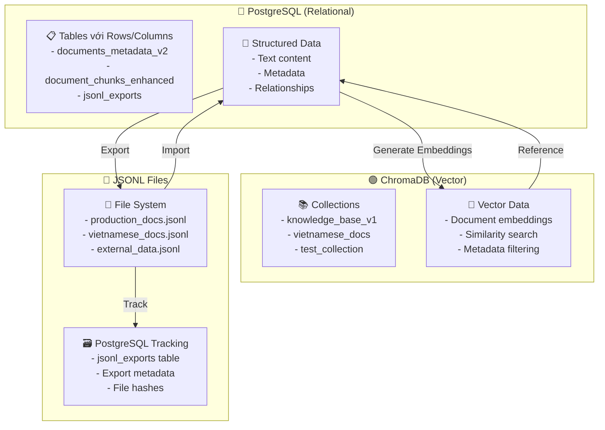
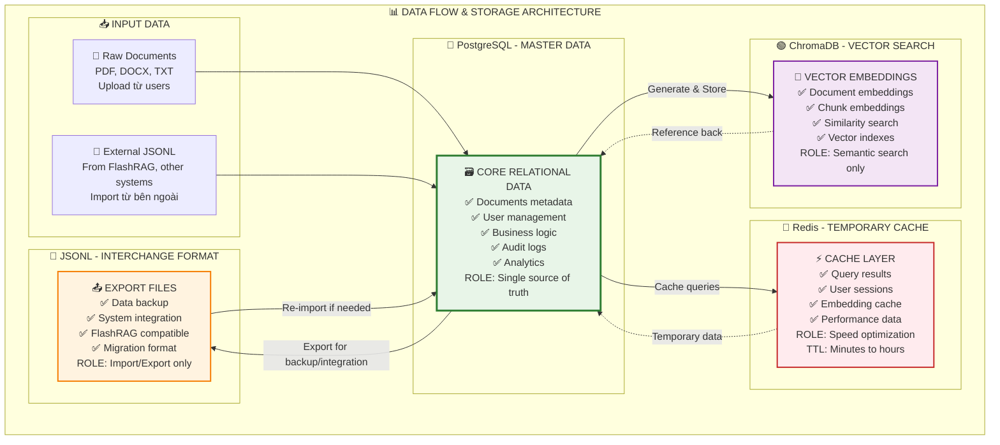
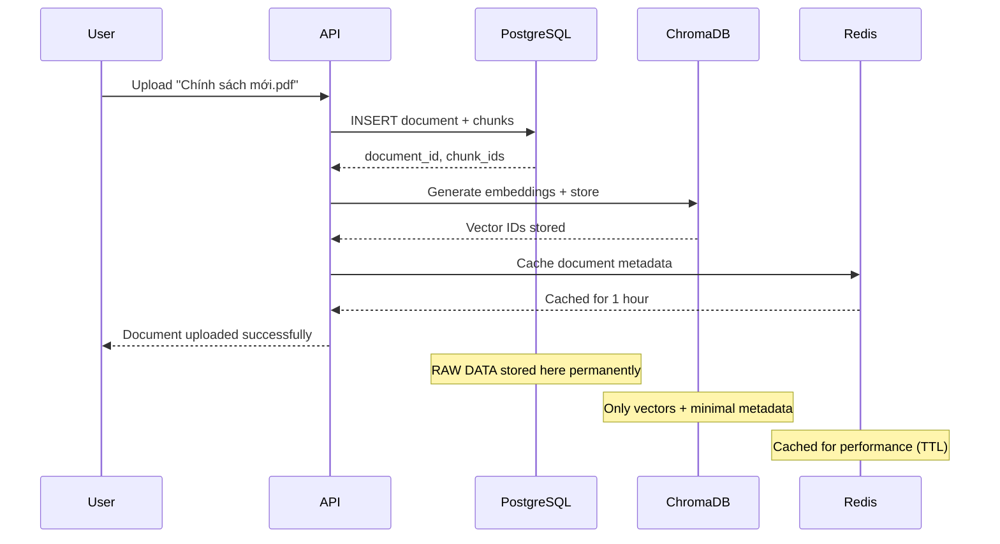
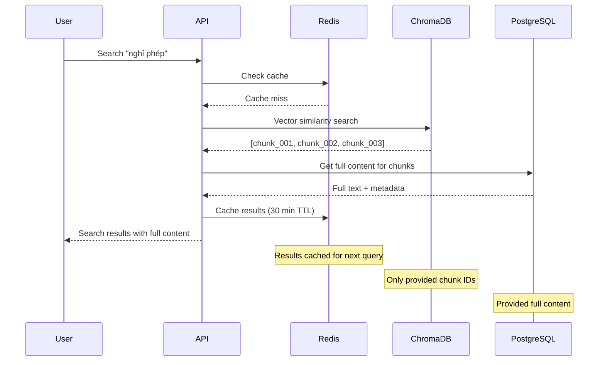
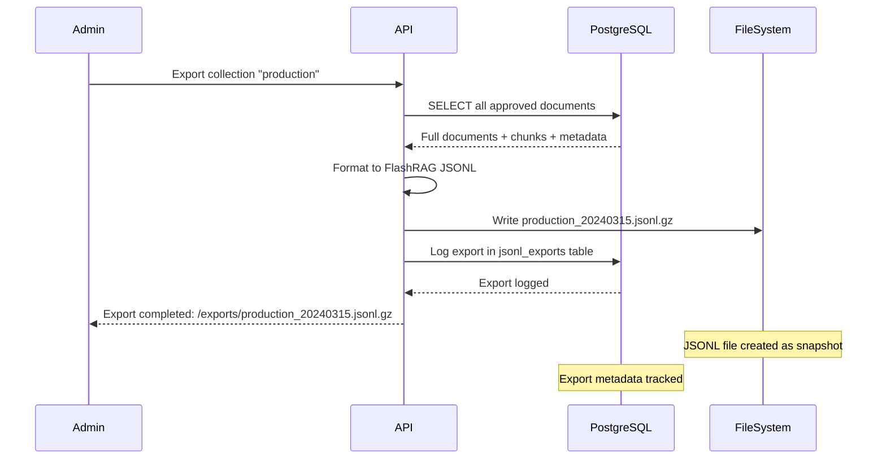

Bạn nhận xét rất đúng! Các script tôi cung cấp chỉ tạo một số bảng cơ bản trong PostgreSQL, chưa đủ so với schema đầy đủ mà tôi vẽ. Tôi sẽ tạo lại **script migration hoàn chỉnh** để tạo tất cả các bảng.

## 🔧 **MIGRATION SCRIPTS HOÀN CHỈNH**

### **Bước 1: Cập nhật Migration Script đầy đủ**

Thay thế file `scripts/migrations/01_init_database.sql` bằng nội dung sau:

```sql
-- scripts/migrations/01_init_database.sql
-- COMPLETE ENHANCED DATABASE SCHEMA

-- Enable required extensions
CREATE EXTENSION IF NOT EXISTS "uuid-ossp";
CREATE EXTENSION IF NOT EXISTS "pg_trgm";
CREATE EXTENSION IF NOT EXISTS "btree_gin";

-- =============================================================================
-- ENUM TYPES
-- =============================================================================

DO $$ BEGIN
    CREATE TYPE access_level_enum AS ENUM (
        'public', 'employee_only', 'manager_only', 'director_only', 'system_admin'
    );
EXCEPTION
    WHEN duplicate_object THEN null;
END $$;

DO $$ BEGIN
    CREATE TYPE document_type_enum AS ENUM (
        'policy', 'procedure', 'technical_guide', 'report', 
        'manual', 'specification', 'template', 'form', 
        'presentation', 'training_material', 'other'
    );
EXCEPTION
    WHEN duplicate_object THEN null;
END $$;

DO $$ BEGIN
    CREATE TYPE document_status_enum AS ENUM (
        'draft', 'review', 'approved', 'published', 'archived', 'deprecated'
    );
EXCEPTION
    WHEN duplicate_object THEN null;
END $$;

DO $$ BEGIN
    CREATE TYPE refinement_method_enum AS ENUM (
        'longlmllingua', 'selective_context', 'trace_refiner', 'none'
    );
EXCEPTION
    WHEN duplicate_object THEN null;
END $$;

DO $$ BEGIN
    CREATE TYPE pipeline_type_enum AS ENUM (
        'standard', 'reasoning', 'conditional', 'adaptive'
    );
EXCEPTION
    WHEN duplicate_object THEN null;
END $$;

DO $$ BEGIN
    CREATE TYPE retrieval_method_enum AS ENUM (
        'dense', 'sparse', 'hybrid', 'knowledge_graph', 'multi_modal'
    );
EXCEPTION
    WHEN duplicate_object THEN null;
END $$;

-- =============================================================================
-- CORE TABLES
-- =============================================================================

-- Enhanced documents metadata table
CREATE TABLE IF NOT EXISTS documents_metadata_v2 (
    document_id UUID PRIMARY KEY DEFAULT uuid_generate_v4(),
    parent_document_id UUID REFERENCES documents_metadata_v2(document_id),
    
    -- Basic information
    title VARCHAR(500) NOT NULL,
    content TEXT,
    document_type document_type_enum NOT NULL,
    access_level access_level_enum NOT NULL DEFAULT 'employee_only',
    department_owner VARCHAR(100) NOT NULL,
    author VARCHAR(255) NOT NULL,
    author_email VARCHAR(255),
    status document_status_enum DEFAULT 'draft',
    
    -- File information
    source_file VARCHAR(500),
    original_filename VARCHAR(255),
    file_size_bytes BIGINT,
    file_hash VARCHAR(64),
    page_count INTEGER,
    word_count INTEGER,
    
    -- Vietnamese language support
    language_detected VARCHAR(10) DEFAULT 'vi',
    vietnamese_segmented BOOLEAN DEFAULT false,
    diacritics_normalized BOOLEAN DEFAULT false,
    tone_marks_preserved BOOLEAN DEFAULT true,
    
    -- FlashRAG support
    flashrag_collection VARCHAR(100) DEFAULT 'default_collection',
    jsonl_export_ready BOOLEAN DEFAULT false,
    
    -- Search support
    search_tokens TSVECTOR,
    keyword_density JSONB,
    heading_structure JSONB,
    
    -- Embedding metadata
    embedding_model_primary VARCHAR(100),
    embedding_model_fallback VARCHAR(100),
    embedding_quality_vi DECIMAL(3,2),
    embedding_generated_at TIMESTAMP WITH TIME ZONE,
    chunk_count INTEGER DEFAULT 0,
    chunk_strategy VARCHAR(20) DEFAULT 'semantic',
    
    -- Timestamps
    created_at TIMESTAMP WITH TIME ZONE DEFAULT NOW(),
    updated_at TIMESTAMP WITH TIME ZONE DEFAULT NOW(),
    published_at TIMESTAMP WITH TIME ZONE,
    archived_at TIMESTAMP WITH TIME ZONE,
    
    -- Audit
    created_by UUID,
    updated_by UUID,
    
    -- Constraints
    CONSTRAINT valid_file_size CHECK (file_size_bytes > 0 OR file_size_bytes IS NULL),
    CONSTRAINT valid_email CHECK (author_email ~ '^[^@\s]+@[^@\s]+\.[^@\s]+$' OR author_email IS NULL)
);

-- Enhanced document chunks table
CREATE TABLE IF NOT EXISTS document_chunks_enhanced (
    chunk_id UUID PRIMARY KEY DEFAULT uuid_generate_v4(),
    document_id UUID REFERENCES documents_metadata_v2(document_id) ON DELETE CASCADE,
    
    -- Content data
    chunk_content TEXT NOT NULL,
    chunk_position INTEGER NOT NULL,
    chunk_size_tokens INTEGER,
    chunk_size_characters INTEGER,
    
    -- Semantic chunking metadata
    semantic_boundary BOOLEAN DEFAULT false,
    overlap_with_prev INTEGER DEFAULT 0,
    overlap_with_next INTEGER DEFAULT 0,
    heading_context TEXT,
    paragraph_context INTEGER,
    
    -- Quality and method
    chunk_method VARCHAR(20) DEFAULT 'semantic',
    chunk_quality_score DECIMAL(3,2) CHECK (chunk_quality_score BETWEEN 0.00 AND 1.00),
    
    -- Vector storage references
    faiss_index_id INTEGER,
    chroma_vector_id VARCHAR(100),
    embedding_model VARCHAR(100),
    embedding_dimensions INTEGER,
    
    -- BM25 support
    bm25_tokens TSVECTOR,
    keyword_weights JSONB,
    
    -- Vietnamese processing
    vietnamese_tokens JSONB,
    pos_tags JSONB,
    named_entities JSONB,
    
    -- Timestamps
    created_at TIMESTAMP WITH TIME ZONE DEFAULT NOW(),
    updated_at TIMESTAMP WITH TIME ZONE DEFAULT NOW(),
    
    CONSTRAINT valid_chunk_size CHECK (chunk_size_tokens BETWEEN 50 AND 2000 OR chunk_size_tokens IS NULL)
);

-- BM25 support table
CREATE TABLE IF NOT EXISTS document_bm25_index (
    bm25_id UUID PRIMARY KEY DEFAULT uuid_generate_v4(),
    document_id UUID REFERENCES documents_metadata_v2(document_id) ON DELETE CASCADE,
    chunk_id UUID REFERENCES document_chunks_enhanced(chunk_id) ON DELETE CASCADE,
    
    -- BM25 data
    term VARCHAR(255) NOT NULL,
    term_frequency INTEGER NOT NULL,
    document_frequency INTEGER NOT NULL,
    inverse_document_frequency DECIMAL(8,4),
    bm25_score DECIMAL(8,4),
    
    -- Term metadata
    term_type VARCHAR(50) DEFAULT 'keyword',
    term_importance DECIMAL(3,2),
    
    -- Language support
    language VARCHAR(10) DEFAULT 'vi',
    is_stopword BOOLEAN DEFAULT false,
    
    created_at TIMESTAMP WITH TIME ZONE DEFAULT NOW(),
    
    UNIQUE(chunk_id, term, language)
);

-- Vietnamese text analysis table
CREATE TABLE IF NOT EXISTS vietnamese_text_analysis (
    analysis_id UUID PRIMARY KEY DEFAULT uuid_generate_v4(),
    document_id UUID REFERENCES documents_metadata_v2(document_id) ON DELETE CASCADE,
    chunk_id UUID REFERENCES document_chunks_enhanced(chunk_id) ON DELETE CASCADE,
    
    -- Source text
    original_text TEXT NOT NULL,
    processed_text TEXT,
    
    -- Segmentation results
    word_segmentation JSONB NOT NULL,
    syllable_segmentation JSONB,
    
    -- POS tagging
    pos_tagging JSONB NOT NULL,
    pos_confidence DECIMAL(3,2),
    
    -- Vietnamese features
    compound_words TEXT[],
    technical_terms TEXT[],
    proper_nouns TEXT[],
    foreign_words TEXT[],
    
    -- Analysis metrics
    readability_score DECIMAL(3,2),
    formality_level VARCHAR(20),
    regional_dialect VARCHAR(50),
    
    -- Processing info
    processing_model VARCHAR(100),
    processing_version VARCHAR(20),
    processing_time_ms INTEGER,
    
    created_at TIMESTAMP WITH TIME ZONE DEFAULT NOW()
);

-- Context refinement tracking
CREATE TABLE IF NOT EXISTS context_refinement_log (
    refinement_id UUID PRIMARY KEY DEFAULT uuid_generate_v4(),
    query_session_id UUID,
    
    -- Original context
    original_chunks UUID[],
    original_token_count INTEGER,
    original_context_length INTEGER,
    
    -- Refined context
    refined_content TEXT,
    refined_token_count INTEGER,
    refined_context_length INTEGER,
    compression_ratio DECIMAL(5,2),
    
    -- Refinement metadata
    refinement_method refinement_method_enum DEFAULT 'none',
    quality_score DECIMAL(3,2),
    processing_time_ms INTEGER,
    model_used VARCHAR(100),
    
    -- Parameters
    compression_target DECIMAL(3,2),
    preserve_first_sentences INTEGER,
    preserve_last_sentences INTEGER,
    dynamic_context_length BOOLEAN,
    
    -- Quality tracking
    user_satisfaction INTEGER CHECK (user_satisfaction BETWEEN 1 AND 5),
    answer_quality INTEGER CHECK (answer_quality BETWEEN 1 AND 5),
    context_relevance INTEGER CHECK (context_relevance BETWEEN 1 AND 5),
    
    created_at TIMESTAMP WITH TIME ZONE DEFAULT NOW()
);

-- Knowledge graph relationships
CREATE TABLE IF NOT EXISTS knowledge_graph_edges (
    edge_id UUID PRIMARY KEY DEFAULT uuid_generate_v4(),
    source_chunk_id UUID REFERENCES document_chunks_enhanced(chunk_id) ON DELETE CASCADE,
    target_chunk_id UUID REFERENCES document_chunks_enhanced(chunk_id) ON DELETE CASCADE,
    
    -- Relationship data
    relationship_type VARCHAR(50) NOT NULL,
    confidence_score DECIMAL(3,2) NOT NULL CHECK (confidence_score BETWEEN 0.00 AND 1.00),
    extraction_method VARCHAR(50) NOT NULL,
    
    -- Relationship details
    relationship_description TEXT,
    evidence_text TEXT,
    extraction_context JSONB,
    
    -- Graph optimization
    hop_distance INTEGER DEFAULT 1,
    path_weight DECIMAL(5,3),
    
    -- Verification
    human_verified BOOLEAN DEFAULT false,
    verification_date TIMESTAMP WITH TIME ZONE,
    verified_by UUID,
    
    -- Usage tracking
    times_traversed INTEGER DEFAULT 0,
    last_traversed TIMESTAMP WITH TIME ZONE,
    
    created_at TIMESTAMP WITH TIME ZONE DEFAULT NOW(),
    
    CONSTRAINT no_self_loops CHECK (source_chunk_id != target_chunk_id)
);

-- Pipeline session tracking
CREATE TABLE IF NOT EXISTS rag_pipeline_sessions (
    session_id UUID PRIMARY KEY DEFAULT uuid_generate_v4(),
    user_id UUID,
    parent_session_id UUID REFERENCES rag_pipeline_sessions(session_id),
    
    -- Query information
    original_query TEXT NOT NULL,
    processed_query TEXT,
    query_intent VARCHAR(50),
    query_complexity VARCHAR(20),
    query_language VARCHAR(10) DEFAULT 'vi',
    
    -- Pipeline metadata
    pipeline_type pipeline_type_enum NOT NULL DEFAULT 'standard',
    pipeline_method VARCHAR(50) NOT NULL DEFAULT 'hybrid',
    pipeline_reason TEXT,
    
    -- Retrieval configuration
    retrieval_method retrieval_method_enum NOT NULL DEFAULT 'hybrid',
    retrieval_k INTEGER DEFAULT 5,
    hybrid_alpha DECIMAL(3,2),
    
    -- Processing results
    chunks_retrieved INTEGER,
    chunks_used_final INTEGER,
    total_context_tokens INTEGER,
    final_context_tokens INTEGER,
    context_refined BOOLEAN DEFAULT false,
    refinement_method VARCHAR(50),
    
    -- LLM processing
    llm_model VARCHAR(100),
    llm_temperature DECIMAL(3,2),
    llm_max_tokens INTEGER,
    prompt_template VARCHAR(100),
    
    -- Results
    response_generated BOOLEAN DEFAULT false,
    response_length INTEGER,
    response_quality_score DECIMAL(3,2),
    user_feedback INTEGER CHECK (user_feedback BETWEEN 1 AND 5),
    
    -- Performance
    processing_time_ms INTEGER,
    retrieval_time_ms INTEGER,
    llm_time_ms INTEGER,
    total_time_ms INTEGER,
    
    -- Cost tracking
    tokens_used INTEGER,
    api_calls_count INTEGER,
    total_cost_usd DECIMAL(8,4),
    
    -- Error tracking
    had_errors BOOLEAN DEFAULT false,
    error_messages TEXT[],
    
    created_at TIMESTAMP WITH TIME ZONE DEFAULT NOW()
);

-- Query performance metrics
CREATE TABLE IF NOT EXISTS query_performance_metrics (
    metric_id UUID PRIMARY KEY DEFAULT uuid_generate_v4(),
    session_id UUID REFERENCES rag_pipeline_sessions(session_id) ON DELETE CASCADE,
    
    -- Detailed timing
    query_preprocessing_time_ms INTEGER,
    embedding_generation_time_ms INTEGER,
    vector_search_time_ms INTEGER,
    bm25_search_time_ms INTEGER,
    hybrid_merge_time_ms INTEGER,
    context_refinement_time_ms INTEGER,
    llm_processing_time_ms INTEGER,
    response_formatting_time_ms INTEGER,
    
    -- Resource usage
    memory_usage_mb INTEGER,
    cpu_usage_percent DECIMAL(5,2),
    gpu_usage_percent DECIMAL(5,2),
    disk_io_mb INTEGER,
    network_io_mb INTEGER,
    
    -- Cache performance
    embedding_cache_hit BOOLEAN,
    context_cache_hit BOOLEAN,
    result_cache_hit BOOLEAN,
    cache_hit_ratio DECIMAL(3,2),
    
    -- Quality metrics
    retrieval_precision DECIMAL(3,2),
    retrieval_recall DECIMAL(3,2),
    answer_relevance_score DECIMAL(3,2),
    answer_completeness_score DECIMAL(3,2),
    user_satisfaction INTEGER CHECK (user_satisfaction BETWEEN 1 AND 5),
    
    -- Errors and warnings
    errors_encountered TEXT[],
    warnings_encountered TEXT[],
    
    recorded_at TIMESTAMP WITH TIME ZONE DEFAULT NOW()
);

-- Embedding model benchmarks
CREATE TABLE IF NOT EXISTS embedding_model_benchmarks (
    benchmark_id UUID PRIMARY KEY DEFAULT uuid_generate_v4(),
    
    -- Model information
    model_name VARCHAR(100) NOT NULL,
    model_type VARCHAR(50) NOT NULL,
    model_version VARCHAR(50),
    embedding_dimensions INTEGER,
    
    -- Performance metrics
    hit_rate_at_1 DECIMAL(5,4),
    hit_rate_at_3 DECIMAL(5,4),
    hit_rate_at_5 DECIMAL(5,4),
    hit_rate_at_10 DECIMAL(5,4),
    mrr DECIMAL(5,4),
    ndcg_at_5 DECIMAL(5,4),
    ndcg_at_10 DECIMAL(5,4),
    
    -- Processing performance
    processing_time_avg_ms INTEGER,
    processing_time_p95_ms INTEGER,
    tokens_per_second DECIMAL(8,2),
    
    -- Test dataset
    test_dataset VARCHAR(100),
    test_queries_count INTEGER,
    test_documents_count INTEGER,
    language VARCHAR(10),
    domain VARCHAR(100),
    
    -- Hardware config
    hardware_config JSONB,
    batch_size INTEGER,
    
    -- Comparison
    baseline_model VARCHAR(100),
    improvement_percentage DECIMAL(5,2),
    
    tested_at TIMESTAMP WITH TIME ZONE DEFAULT NOW(),
    tested_by UUID
);

-- FlashRAG export tracking
CREATE TABLE IF NOT EXISTS jsonl_exports (
    export_id UUID PRIMARY KEY DEFAULT uuid_generate_v4(),
    collection_name VARCHAR(100) NOT NULL,
    export_type VARCHAR(50) NOT NULL,
    
    -- Export scope
    document_ids UUID[],
    date_filter_from TIMESTAMP WITH TIME ZONE,
    date_filter_to TIMESTAMP WITH TIME ZONE,
    
    -- Export results
    documents_exported INTEGER NOT NULL,
    chunks_exported INTEGER NOT NULL,
    total_size_bytes BIGINT,
    
    -- Export configuration
    include_metadata BOOLEAN DEFAULT true,
    include_embeddings BOOLEAN DEFAULT false,
    chunk_strategy VARCHAR(20),
    
    -- File information
    export_path TEXT NOT NULL,
    compression_used VARCHAR(20),
    file_hash VARCHAR(64),
    
    -- FlashRAG compatibility
    flashrag_version VARCHAR(20),
    schema_version VARCHAR(10),
    compatible_pipelines TEXT[],
    
    -- Status
    export_status VARCHAR(20) DEFAULT 'pending',
    error_message TEXT,
    
    created_at TIMESTAMP WITH TIME ZONE DEFAULT NOW(),
    completed_at TIMESTAMP WITH TIME ZONE,
    created_by UUID
);

-- Vietnamese terminology dictionary
CREATE TABLE IF NOT EXISTS vietnamese_terminology (
    term_id UUID PRIMARY KEY DEFAULT uuid_generate_v4(),
    original_term TEXT NOT NULL,
    normalized_term TEXT NOT NULL,
    term_type VARCHAR(50),
    definition TEXT,
    context_examples TEXT[],
    frequency_score INTEGER DEFAULT 1,
    
    -- Alternative forms
    synonyms TEXT[],
    alternative_spellings TEXT[],
    
    -- Usage tracking
    first_seen TIMESTAMP WITH TIME ZONE DEFAULT NOW(),
    last_updated TIMESTAMP WITH TIME ZONE DEFAULT NOW(),
    
    UNIQUE(normalized_term, term_type)
);

-- System metrics logging
CREATE TABLE IF NOT EXISTS system_metrics_log (
    log_id UUID PRIMARY KEY DEFAULT uuid_generate_v4(),
    timestamp TIMESTAMP WITH TIME ZONE DEFAULT NOW(),
    database_size_bytes BIGINT,
    active_connections INTEGER,
    cpu_percent DECIMAL(5,2),
    memory_percent DECIMAL(5,2),
    disk_percent DECIMAL(5,2),
    pipeline_performance_data JSONB,
    alerts TEXT[],
    created_at TIMESTAMP WITH TIME ZONE DEFAULT NOW()
);

-- =============================================================================
-- INDEXES FOR PERFORMANCE
-- =============================================================================

-- Documents metadata indexes
CREATE INDEX IF NOT EXISTS idx_documents_v2_language ON documents_metadata_v2(language_detected);
CREATE INDEX IF NOT EXISTS idx_documents_v2_status ON documents_metadata_v2(status);
CREATE INDEX IF NOT EXISTS idx_documents_v2_collection ON documents_metadata_v2(flashrag_collection);
CREATE INDEX IF NOT EXISTS idx_documents_v2_search ON documents_metadata_v2 USING GIN(search_tokens);
CREATE INDEX IF NOT EXISTS idx_documents_v2_department ON documents_metadata_v2(department_owner);
CREATE INDEX IF NOT EXISTS idx_documents_v2_type ON documents_metadata_v2(document_type);
CREATE INDEX IF NOT EXISTS idx_documents_v2_created ON documents_metadata_v2(created_at DESC);

-- Document chunks indexes
CREATE INDEX IF NOT EXISTS idx_chunks_enhanced_document ON document_chunks_enhanced(document_id);
CREATE INDEX IF NOT EXISTS idx_chunks_enhanced_position ON document_chunks_enhanced(chunk_position);
CREATE INDEX IF NOT EXISTS idx_chunks_enhanced_semantic ON document_chunks_enhanced(semantic_boundary) WHERE semantic_boundary = true;
CREATE INDEX IF NOT EXISTS idx_chunks_enhanced_quality ON document_chunks_enhanced(chunk_quality_score DESC);
CREATE INDEX IF NOT EXISTS idx_chunks_enhanced_method ON document_chunks_enhanced(chunk_method);
CREATE INDEX IF NOT EXISTS idx_chunks_enhanced_bm25 ON document_chunks_enhanced USING GIN(bm25_tokens);

-- BM25 indexes
CREATE INDEX IF NOT EXISTS idx_bm25_term ON document_bm25_index(term);
CREATE INDEX IF NOT EXISTS idx_bm25_chunk ON document_bm25_index(chunk_id);
CREATE INDEX IF NOT EXISTS idx_bm25_score ON document_bm25_index(bm25_score DESC);
CREATE INDEX IF NOT EXISTS idx_bm25_language ON document_bm25_index(language);

-- Vietnamese analysis indexes
CREATE INDEX IF NOT EXISTS idx_vietnamese_analysis_document ON vietnamese_text_analysis(document_id);
CREATE INDEX IF NOT EXISTS idx_vietnamese_analysis_chunk ON vietnamese_text_analysis(chunk_id);

-- Knowledge graph indexes
CREATE INDEX IF NOT EXISTS idx_kg_edges_source ON knowledge_graph_edges(source_chunk_id);
CREATE INDEX IF NOT EXISTS idx_kg_edges_target ON knowledge_graph_edges(target_chunk_id);
CREATE INDEX IF NOT EXISTS idx_kg_edges_relationship ON knowledge_graph_edges(relationship_type);
CREATE INDEX IF NOT EXISTS idx_kg_edges_confidence ON knowledge_graph_edges(confidence_score DESC);

-- Pipeline session indexes
CREATE INDEX IF NOT EXISTS idx_pipeline_sessions_user ON rag_pipeline_sessions(user_id);
CREATE INDEX IF NOT EXISTS idx_pipeline_sessions_created ON rag_pipeline_sessions(created_at DESC);
CREATE INDEX IF NOT EXISTS idx_pipeline_sessions_type ON rag_pipeline_sessions(pipeline_type, pipeline_method);
CREATE INDEX IF NOT EXISTS idx_pipeline_sessions_performance ON rag_pipeline_sessions(total_time_ms);

-- Performance metrics indexes
CREATE INDEX IF NOT EXISTS idx_performance_session ON query_performance_metrics(session_id);
CREATE INDEX IF NOT EXISTS idx_performance_recorded ON query_performance_metrics(recorded_at DESC);

-- Benchmark indexes
CREATE INDEX IF NOT EXISTS idx_benchmarks_model ON embedding_model_benchmarks(model_name);
CREATE INDEX IF NOT EXISTS idx_benchmarks_tested ON embedding_model_benchmarks(tested_at DESC);

-- Export indexes
CREATE INDEX IF NOT EXISTS idx_exports_collection ON jsonl_exports(collection_name);
CREATE INDEX IF NOT EXISTS idx_exports_status ON jsonl_exports(export_status);

-- Terminology indexes
CREATE INDEX IF NOT EXISTS idx_terminology_original ON vietnamese_terminology(original_term);
CREATE INDEX IF NOT EXISTS idx_terminology_normalized ON vietnamese_terminology(normalized_term);

-- System metrics indexes
CREATE INDEX IF NOT EXISTS idx_metrics_timestamp ON system_metrics_log(timestamp DESC);

-- =============================================================================
-- SAMPLE DATA
-- =============================================================================

INSERT INTO documents_metadata_v2 (
    title, content, document_type, access_level, department_owner, author, status, jsonl_export_ready
) VALUES 
(
    'Quy trình xin nghỉ phép',
    'Quy trình xin nghỉ phép tại công ty bao gồm các bước sau: 1. Nhân viên điền đơn xin nghỉ phép 2. Gửi đơn cho quản lý trực tiếp 3. Quản lý phê duyệt trong vòng 2 ngày làm việc 4. HR cập nhật vào hệ thống 5. Thông báo kết quả cho nhân viên',
    'procedure',
    'employee_only',
    'HR',
    'HR Department',
    'approved',
    true
),
(
    'Chính sách làm việc từ xa',
    'Chính sách làm việc từ xa (Work From Home) được áp dụng như sau: - Nhân viên có thể làm việc từ xa tối đa 3 ngày/tuần - Cần đăng ký trước ít nhất 1 ngày - Đảm bảo môi trường làm việc ổn định - Tham gia đầy đủ các cuộc họp online - Báo cáo tiến độ công việc hàng ngày',
    'policy',
    'employee_only',
    'HR',
    'Management Team',
    'approved',
    true
),
(
    'Hướng dẫn sử dụng hệ thống ERP',
    'Hướng dẫn chi tiết sử dụng hệ thống ERP công ty: 1. Đăng nhập hệ thống - Sử dụng tài khoản company email - Mật khẩu được cấp ban đầu cần đổi ngay lần đầu đăng nhập 2. Module quản lý nhân sự - Cập nhật thông tin cá nhân - Đăng ký nghỉ phép - Xem bảng lương 3. Module quản lý dự án - Tạo task mới - Cập nhật tiến độ - Báo cáo hàng tuần',
    'technical_guide',
    'employee_only',
    'IT',
    'IT Support Team',
    'approved',
    true
)
ON CONFLICT DO NOTHING;

-- Update search tokens
UPDATE documents_metadata_v2 
SET search_tokens = to_tsvector('simple', title || ' ' || COALESCE(content, ''))
WHERE search_tokens IS NULL;

-- Insert sample chunks
INSERT INTO document_chunks_enhanced (document_id, chunk_content, chunk_position, chunk_size_tokens, semantic_boundary, chunk_method, chunk_quality_score)
SELECT 
    document_id,
    CASE 
        WHEN chunk_position = 0 THEN 'Quy trình xin nghỉ phép tại công ty bao gồm các bước sau: Nhân viên điền đơn xin nghỉ phép'
        WHEN chunk_position = 1 THEN 'Gửi đơn cho quản lý trực tiếp. Quản lý phê duyệt trong vòng 2 ngày làm việc'
        ELSE 'HR cập nhật vào hệ thống và thông báo kết quả cho nhân viên'
    END,
    chunk_position,
    CASE 
        WHEN chunk_position = 0 THEN 20
        WHEN chunk_position = 1 THEN 18
        ELSE 15
    END,
    true,
    'semantic',
    0.85
FROM documents_metadata_v2 
CROSS JOIN generate_series(0, 2) AS chunk_position
WHERE title = 'Quy trình xin nghỉ phép'
ON CONFLICT DO NOTHING;

-- Insert sample pipeline session
INSERT INTO rag_pipeline_sessions (
    original_query, processed_query, pipeline_type, pipeline_method,
    chunks_retrieved, processing_time_ms, response_quality_score
) VALUES (
    'Quy trình xin nghỉ phép như thế nào?',
    'quy trình xin nghỉ phép',
    'standard',
    'hybrid',
    3,
    150,
    0.85
) ON CONFLICT DO NOTHING;

-- Success message
DO $$ BEGIN
    RAISE NOTICE '🎉 Enhanced Database Architecture initialized successfully!';
    RAISE NOTICE '📊 Total tables created: %', (SELECT COUNT(*) FROM information_schema.tables WHERE table_schema = 'public');
    RAISE NOTICE '🔍 Total indexes created: %', (SELECT COUNT(*) FROM pg_indexes WHERE schemaname = 'public');
    RAISE NOTICE '📄 Sample documents loaded: %', (SELECT COUNT(*) FROM documents_metadata_v2);
    RAISE NOTICE '✂️ Sample chunks created: %', (SELECT COUNT(*) FROM document_chunks_enhanced);
    RAISE NOTICE '🚀 Database is ready for enhanced features testing!';
END $$;
```

### **Bước 2: Tạo ChromaDB Configuration Script**

Tạo file `scripts/setup_chromadb.py`:

```python
# scripts/setup_chromadb.py
import chromadb
import logging
import time
import numpy as np
from chromadb.config import Settings

logging.basicConfig(level=logging.INFO)
logger = logging.getLogger(__name__)

def setup_chromadb_collections():
    """Setup ChromaDB collections with proper configuration"""
    
    try:
        # Connect to ChromaDB
        client = chromadb.HttpClient(
            host='chromadb-test',
            port=8000,
            settings=Settings(anonymized_telemetry=False)
        )
        
        logger.info("🟢 Connected to ChromaDB")
        
        # Collection configurations
        collections_config = {
            "knowledge_base_v1": {
                "embedding_dimension": 1536,
                "distance_metric": "cosine",
                "description": "Main knowledge base with OpenAI embeddings"
            },
            "vietnamese_docs": {
                "embedding_dimension": 768,
                "distance_metric": "cosine", 
                "description": "Vietnamese documents with multilingual embeddings"
            },
            "test_collection": {
                "embedding_dimension": 384,
                "distance_metric": "cosine",
                "description": "Test collection for development"
            }
        }
        
        created_collections = []
        
        for collection_name, config in collections_config.items():
            try:
                # Try to get existing collection
                collection = client.get_collection(collection_name)
                logger.info(f"✅ Collection '{collection_name}' already exists")
            except:
                # Create new collection
                collection = client.create_collection(
                    name=collection_name,
                    metadata={
                        "description": config["description"],
                        "embedding_dimension": config["embedding_dimension"],
                        "distance_metric": config["distance_metric"],
                        "created_at": time.strftime('%Y-%m-%d %H:%M:%S')
                    }
                )
                logger.info(f"🆕 Created collection: {collection_name}")
            
            created_collections.append(collection_name)
            
            # Add sample data for testing
            if collection_name == "test_collection":
                sample_documents = [
                    {
                        "id": "doc_001",
                        "document": "Quy trình xin nghỉ phép tại công ty",
                        "embedding": np.random.random(384).tolist(),
                        "metadata": {
                            "title": "Quy trình xin nghỉ phép",
                            "document_type": "procedure",
                            "department": "HR",
                            "language": "vi"
                        }
                    },
                    {
                        "id": "doc_002", 
                        "document": "Chính sách làm việc từ xa",
                        "embedding": np.random.random(384).tolist(),
                        "metadata": {
                            "title": "Chính sách WFH",
                            "document_type": "policy",
                            "department": "HR",
                            "language": "vi"
                        }
                    }
                ]
                
                # Insert sample documents
                collection.add(
                    ids=[doc["id"] for doc in sample_documents],
                    documents=[doc["document"] for doc in sample_documents],
                    embeddings=[doc["embedding"] for doc in sample_documents],
                    metadatas=[doc["metadata"] for doc in sample_documents]
                )
                
                logger.info(f"📄 Added {len(sample_documents)} sample documents to {collection_name}")
        
        # Verify collections
        all_collections = client.list_collections()
        logger.info(f"📊 Total collections in ChromaDB: {len(all_collections)}")
        
        for collection in all_collections:
            count = collection.count()
            logger.info(f"  📚 {collection.name}: {count} documents")
        
        return True
        
    except Exception as e:
        logger.error(f"❌ ChromaDB setup failed: {e}")
        return False

if __name__ == "__main__":
    success = setup_chromadb_collections()
    exit(0 if success else 1)
```

### **Bước 3: Tạo Redis Configuration Script**

Tạo file `scripts/setup_redis.py`:

```python
# scripts/setup_redis.py
import redis
import json
import logging
import time
from datetime import datetime, timedelta

logging.basicConfig(level=logging.INFO)
logger = logging.getLogger(__name__)

def setup_redis_structure():
    """Setup Redis cache structure and sample data"""
    
    try:
        # Connect to Redis
        r = redis.Redis(
            host='redis-test',
            port=6379,
            db=0,
            decode_responses=True
        )
        
        # Test connection
        r.ping()
        logger.info("🔴 Connected to Redis successfully")
        
        # Clear existing data (for testing)
        r.flushdb()
        logger.info("🧹 Cleared Redis database")
        
        # =================================================================
        # SESSION MANAGEMENT
        # =================================================================
        
        # Sample user sessions
        user_sessions = [
            {
                "key": "user:session:user_001",
                "data": {
                    "session_id": "sess_001",
                    "user_id": "user_001",
                    "username": "nguyen.van.a",
                    "department": "HR",
                    "role": "employee",
                    "permissions": ["read_documents", "search"],
                    "login_time": datetime.now().isoformat(),
                    "last_activity": datetime.now().isoformat(),
                    "ip_address": "192.168.1.100"
                },
                "ttl": 86400  # 24 hours
            },
            {
                "key": "user:session:user_002", 
                "data": {
                    "session_id": "sess_002",
                    "user_id": "user_002",
                    "username": "tran.thi.b",
                    "department": "IT",
                    "role": "manager",
                    "permissions": ["read_documents", "search", "admin"],
                    "login_time": datetime.now().isoformat(),
                    "last_activity": datetime.now().isoformat(),
                    "ip_address": "192.168.1.101"
                },
                "ttl": 86400
            }
        ]
        
        for session in user_sessions:
            r.hmset(session["key"], session["data"])
            r.expire(session["key"], session["ttl"])
            logger.info(f"👤 Created user session: {session['data']['username']}")
        
        # Sample query sessions
        query_sessions = [
            {
                "key": "query:session:sess_q001",
                "data": {
                    "session_id": "sess_q001",
                    "user_id": "user_001",
                    "original_query": "Quy trình xin nghỉ phép như thế nào?",
                    "processed_query": "quy trình xin nghỉ phép",
                    "language": "vi",
                    "retrieved_chunks": json.dumps(["chunk_001", "chunk_002", "chunk_003"]),
                    "response": "Quy trình xin nghỉ phép gồm 5 bước: ...",
                    "quality_score": 0.85,
                    "processing_time_ms": 150,
                    "timestamp": datetime.now().isoformat()
                },
                "ttl": 3600  # 1 hour
            }
        ]
        
        for query in query_sessions:
            r.hmset(query["key"], query["data"])
            r.expire(query["key"], query["ttl"])
            logger.info(f"🔍 Created query session: {query['data']['original_query'][:30]}...")
        
        # =================================================================
        # EMBEDDING CACHE
        # =================================================================
        
        # Sample embedding cache entries
        embedding_cache = [
            {
                "key": "embedding:openai-ada-002:hash_001",
                "data": {
                    "text": "Quy trình xin nghỉ phép",
                    "model": "text-embedding-ada-002",
                    "embeddings": json.dumps([0.1, 0.2, 0.3] + [0.0] * 1533),  # Simulated 1536-dim
                    "dimensions": 1536,
                    "created_at": datetime.now().isoformat(),
                    "language": "vi"
                },
                "ttl": 604800  # 7 days
            },
            {
                "key": "embedding:multilingual-e5:hash_002",
                "data": {
                    "text": "chính sách làm việc từ xa",
                    "model": "multilingual-e5-base",
                    "embeddings": json.dumps([0.5, 0.6, 0.7] + [0.0] * 765),  # Simulated 768-dim
                    "dimensions": 768,
                    "created_at": datetime.now().isoformat(),
                    "language": "vi"
                },
                "ttl": 604800
            }
        ]
        
        for embedding in embedding_cache:
            r.hmset(embedding["key"], embedding["data"])
            r.expire(embedding["key"], embedding["ttl"])
            logger.info(f"🧮 Cached embedding: {embedding['data']['model']}")
        
        # Query embedding cache
        query_embeddings = [
            {
                "key": "query_emb:hash_q001",
                "data": {
                    "query": "Quy trình xin nghỉ phép như thế nào?",
                    "embeddings": json.dumps([0.8, 0.9, 1.0] + [0.0] * 1533),
                    "model_used": "text-embedding-ada-002",
                    "language": "vi",
                    "created_at": datetime.now().isoformat()
                },
                "ttl": 3600
            }
        ]
        
        for query_emb in query_embeddings:
            r.hmset(query_emb["key"], query_emb["data"])
            r.expire(query_emb["key"], query_emb["ttl"])
            logger.info(f"🔍 Cached query embedding")
        
        # =================================================================
        # SEARCH RESULTS CACHE
        # =================================================================
        
        search_cache = [
            {
                "key": "search:hash_search001:filter_hr",
                "data": {
                    "query": "nghỉ phép",
                    "filters": json.dumps({"department": "HR", "language": "vi"}),
                    "results": json.dumps([
                        {
                            "chunk_id": "chunk_001",
                            "score": 0.95,
                            "content": "Quy trình xin nghỉ phép tại công ty...",
                            "metadata": {"title": "Quy trình xin nghỉ phép", "type": "procedure"}
                        },
                        {
                            "chunk_id": "chunk_002", 
                            "score": 0.87,
                            "content": "Điền đơn xin nghỉ phép và gửi cho quản lý...",
                            "metadata": {"title": "Quy trình xin nghỉ phép", "type": "procedure"}
                        }
                    ]),
                    "total_results": 2,
                    "search_time_ms": 25,
                    "cached_at": datetime.now().isoformat()
                },
                "ttl": 1800  # 30 minutes
            }
        ]
        
        for search in search_cache:
            r.hmset(search["key"], search["data"])
            r.expire(search["key"], search["ttl"])
            logger.info(f"🎯 Cached search results")
        
        # Hybrid search cache
        hybrid_cache = [
            {
                "key": "hybrid:dense_hash001:sparse_hash001",
                "data": {
                    "dense_results": json.dumps(["chunk_001", "chunk_003"]),
                    "sparse_results": json.dumps(["chunk_001", "chunk_002"]),
                    "merged_results": json.dumps(["chunk_001", "chunk_002", "chunk_003"]),
                    "hybrid_alpha": 0.7,
                    "merge_strategy": "rrf",
                    "created_at": datetime.now().isoformat()
                },
                "ttl": 900  # 15 minutes
            }
        ]
        
        for hybrid in hybrid_cache:
            r.hmset(hybrid["key"], hybrid["data"])
            r.expire(hybrid["key"], hybrid["ttl"])
            logger.info(f"⚡ Cached hybrid search results")
        
        # =================================================================
        # PERFORMANCE METRICS
        # =================================================================
        
        # Daily performance metrics
        today = datetime.now().strftime('%Y-%m-%d')
        perf_metrics = {
            "key": f"perf:metrics:{today}",
            "data": {
                "date": today,
                "avg_query_time_ms": 145.5,
                "cache_hit_rate": 0.73,
                "total_queries": 1247,
                "error_rate": 0.02,
                "top_queries": json.dumps([
                    "nghỉ phép", "chính sách công ty", "hướng dẫn ERP"
                ]),
                "unique_users": 45,
                "peak_hour": "14:00"
            },
            "ttl": 2592000  # 30 days
        }
        
        r.hmset(perf_metrics["key"], perf_metrics["data"])
        r.expire(perf_metrics["key"], perf_metrics["ttl"])
        logger.info(f"📊 Cached performance metrics for {today}")
        
        # Model performance metrics
        model_perf = [
            {
                "key": "model:perf:text-embedding-ada-002",
                "data": {
                    "model_name": "text-embedding-ada-002",
                    "hit_rate_at_5": 0.87,
                    "mrr": 0.76,
                    "avg_processing_time_ms": 85,
                    "total_queries": 5420,
                    "language_breakdown": json.dumps({
                        "vi": 4200,
                        "en": 1220
                    }),
                    "last_updated": datetime.now().isoformat()
                },
                "ttl": 604800  # 7 days
            },
            {
                "key": "model:perf:multilingual-e5-base",
                "data": {
                    "model_name": "multilingual-e5-base",
                    "hit_rate_at_5": 0.82,
                    "mrr": 0.71,
                    "avg_processing_time_ms": 45,
                    "total_queries": 2100,
                    "language_breakdown": json.dumps({
                        "vi": 2100
                    }),
                    "last_updated": datetime.now().isoformat()
                },
                "ttl": 604800
            }
        ]
        
        for model in model_perf:
            r.hmset(model["key"], model["data"])
            r.expire(model["key"], model["ttl"])
            logger.info(f"🧪 Cached model performance: {model['data']['model_name']}")
        
        # =================================================================
        # VIETNAMESE NLP CACHE
        # =================================================================
        
        # Vietnamese text processing cache
        vn_nlp_cache = [
            {
                "key": "vn:nlp:hash_vn001",
                "data": {
                    "original_text": "Quy trình xin nghỉ phép tại công ty",
                    "segmented_words": json.dumps(["Quy_trình", "xin", "nghỉ_phép", "tại", "công_ty"]),
                    "pos_tags": json.dumps([
                        {"word": "Quy_trình", "tag": "N"},
                        {"word": "xin", "tag": "V"},
                        {"word": "nghỉ_phép", "tag": "N"},
                        {"word": "tại", "tag": "E"},
                        {"word": "công_ty", "tag": "N"}
                    ]),
                    "named_entities": json.dumps([]),
                    "readability_score": 0.75,
                    "processing_time_ms": 12,
                    "processed_at": datetime.now().isoformat()
                },
                "ttl": 86400  # 24 hours
            }
        ]
        
        for vn_cache in vn_nlp_cache:
            r.hmset(vn_cache["key"], vn_cache["data"])
            r.expire(vn_cache["key"], vn_cache["ttl"])
            logger.info(f"🇻🇳 Cached Vietnamese NLP processing")
        
        # Vietnamese terminology cache
        terminology_cache = [
            {
                "key": "vn:term:nghỉ_phép",
                "data": {
                    "original_term": "nghỉ phép",
                    "normalized_term": "nghỉ_phép",
                    "definition": "Thời gian nhân viên được phép nghỉ làm có lương",
                    "synonyms": json.dumps(["vacation", "leave"]),
                    "frequency": 125,
                    "last_updated": datetime.now().isoformat()
                },
                "ttl": 604800  # 7 days
            }
        ]
        
        for term_cache in terminology_cache:
            r.hmset(term_cache["key"], term_cache["data"])
            r.expire(term_cache["key"], term_cache["ttl"])
            logger.info(f"📚 Cached Vietnamese terminology")
        
        # =================================================================
        # CONTEXT REFINEMENT CACHE
        # =================================================================
        
        context_cache = [
            {
                "key": "context:hash_ctx001:longlmllingua",
                "data": {
                    "original_chunks": json.dumps(["chunk_001", "chunk_002", "chunk_003"]),
                    "refined_content": "Quy trình xin nghỉ phép: 1. Điền đơn 2. Gửi quản lý 3. Phê duyệt",
                    "compression_ratio": 0.65,
                    "quality_score": 0.88,
                    "refinement_method": "longlmllingua",
                    "processing_time_ms": 340,
                    "cached_at": datetime.now().isoformat()
                },
                "ttl": 3600  # 1 hour
            }
        ]
        
        for ctx_cache in context_cache:
            r.hmset(ctx_cache["key"], ctx_cache["data"])
            r.expire(ctx_cache["key"], ctx_cache["ttl"])
            logger.info(f"🎯 Cached context refinement")
        
        # LLM response cache
        llm_cache = [
            {
                "key": "llm:hash_prompt001:gpt-3.5-turbo",
                "data": {
                    "prompt": "Dựa vào context, giải thích quy trình xin nghỉ phép",
                    "response": "Quy trình xin nghỉ phép tại công ty gồm 5 bước chính...",
                    "model": "gpt-3.5-turbo",
                    "tokens_used": 450,
                    "processing_time_ms": 1200,
                    "cost_usd": 0.0009,
                    "cached_at": datetime.now().isoformat()
                },
                "ttl": 7200  # 2 hours
            }
        ]
        
        for llm in llm_cache:
            r.hmset(llm["key"], llm["data"])
            r.expire(llm["key"], llm["ttl"])
            logger.info(f"🤖 Cached LLM response")
        
        # =================================================================
        # VERIFY REDIS STRUCTURE
        # =================================================================
        
        # Get all keys and group by pattern
        all_keys = r.keys("*")
        key_patterns = {}
        
        for key in all_keys:
            pattern = key.split(":")[0] + ":" + key.split(":")[1]
            if pattern not in key_patterns:
                key_patterns[pattern] = []
            key_patterns[pattern].append(key)
        
        logger.info(f"📊 Redis structure created successfully!")
        logger.info(f"📋 Total keys: {len(all_keys)}")
        
        for pattern, keys in key_patterns.items():
            logger.info(f"  📁 {pattern}:* - {len(keys)} keys")
            
        # Test cache operations
        logger.info("🧪 Testing cache operations...")
        
        # Test user session retrieval
        user_data = r.hgetall("user:session:user_001")
        if user_data:
            logger.info(f"✅ User session test: {user_data['username']}")
        
        # Test embedding cache retrieval  
        embedding_data = r.hgetall("embedding:openai-ada-002:hash_001")
        if embedding_data:
            logger.info(f"✅ Embedding cache test: {embedding_data['model']}")
        
        # Test search cache retrieval
        search_data = r.hgetall("search:hash_search001:filter_hr")
        if search_data:
            logger.info(f"✅ Search cache test: {len(json.loads(search_data['results']))} results")
        
        return True
        
    except Exception as e:
        logger.error(f"❌ Redis setup failed: {e}")
        return False

if __name__ == "__main__":
    success = setup_redis_structure()
    exit(0 if success else 1)
```

### **Bước 4: Cập nhật Docker Compose để chạy tất cả setup scripts**

Cập nhật `docker-compose.yml`:

```yaml
version: '3.8'

services:
  # PostgreSQL with enhanced schema
  postgres-test:
    image: postgres:15-alpine
    container_name: chatbot-postgres-test
    environment:
      POSTGRES_DB: knowledge_base_test
      POSTGRES_USER: kb_admin
      POSTGRES_PASSWORD: test_password_123
      PGDATA: /var/lib/postgresql/data/pgdata
    volumes:
      - postgres_test_data:/var/lib/postgresql/data
      - ./scripts/migrations:/docker-entrypoint-initdb.d:ro
    ports:
      - "5433:5432"
    healthcheck:
      test: ["CMD-SHELL", "pg_isready -U kb_admin -d knowledge_base_test"]
      interval: 10s
      timeout: 5s
      retries: 5
    networks:
      - chatbot-test-network

  # Redis for caching
  redis-test:
    image: redis:7-alpine
    container_name: chatbot-redis-test
    ports:
      - "6380:6379"
    volumes:
      - redis_test_data:/data
    command: redis-server --appendonly yes
    healthcheck:
      test: ["CMD", "redis-cli", "ping"]
      interval: 10s
      timeout: 3s
      retries: 5
    networks:
      - chatbot-test-network

  # ChromaDB for vector storage
  chromadb-test:
    image: chromadb/chroma:latest
    container_name: chatbot-chroma-test
    environment:
      CHROMA_SERVER_HOST: 0.0.0.0
      CHROMA_SERVER_HTTP_PORT: 8000
    volumes:
      - chromadb_test_data:/chroma/chroma
    ports:
      - "8001:8000"
    healthcheck:
      test: ["CMD", "curl", "-f", "http://localhost:8000/api/v1/heartbeat"]
      interval: 30s
      timeout: 10s
      retries: 3
    networks:
      - chatbot-test-network

  # Database setup service - PostgreSQL tables
  db-setup:
    image: python:3.9-slim
    container_name: chatbot-db-setup
    environment:
      DB_HOST: postgres-test
      DB_PORT: 5432
      DB_NAME: knowledge_base_test
      DB_USER: kb_admin
      DB_PASSWORD: test_password_123
    volumes:
      - ./scripts:/app/scripts:ro
      - ./logs:/app/logs
    working_dir: /app
    depends_on:
      postgres-test:
        condition: service_healthy
    command: >
      sh -c "
      pip install asyncpg psycopg2-binary &&
      python scripts/setup_database.py
      "
    networks:
      - chatbot-test-network

  # ChromaDB setup service
  chromadb-setup:
    image: python:3.9-slim
    container_name: chatbot-chromadb-setup
    volumes:
      - ./scripts:/app/scripts:ro
      - ./logs:/app/logs
    working_dir: /app
    depends_on:
      chromadb-test:
        condition: service_healthy
      db-setup:
        condition: service_completed_successfully
    command: >
      sh -c "
      pip install chromadb numpy &&
      python scripts/setup_chromadb.py
      "
    networks:
      - chatbot-test-network

  # Redis setup service  
  redis-setup:
    image: python:3.9-slim
    container_name: chatbot-redis-setup
    volumes:
      - ./scripts:/app/scripts:ro
      - ./logs:/app/logs
    working_dir: /app
    depends_on:
      redis-test:
        condition: service_healthy
      db-setup:
        condition: service_completed_successfully
    command: >
      sh -c "
      pip install redis &&
      python scripts/setup_redis.py
      "
    networks:
      - chatbot-test-network

  # Final verification service
  verification:
    image: python:3.9-slim
    container_name: chatbot-verification
    volumes:
      - ./scripts:/app/scripts:ro
      - ./logs:/app/logs
      - ./test_results:/app/results
    working_dir: /app
    depends_on:
      chromadb-setup:
        condition: service_completed_successfully
      redis-setup:
        condition: service_completed_successfully
    command: >
      sh -c "
      pip install asyncpg redis chromadb psycopg2-binary &&
      python scripts/verify_complete_setup.py
      "
    networks:
      - chatbot-test-network

  # Database browser
  adminer:
    image: adminer
    container_name: chatbot-adminer
    ports:
      - "8080:8080"
    environment:
      ADMINER_DEFAULT_SERVER: postgres-test
    depends_on:
      postgres-test:
        condition: service_healthy
    networks:
      - chatbot-test-network

volumes:
  postgres_test_data:
  redis_test_data:
  chromadb_test_data:

networks:
  chatbot-test-network:
    driver: bridge
```

### **Bước 5: Tạo Complete Verification Script**

Tạo file `scripts/verify_complete_setup.py`:

```python
# scripts/verify_complete_setup.py
import asyncio
import asyncpg
import redis
import chromadb
import json
import logging
import time
from datetime import datetime

logging.basicConfig(level=logging.INFO, format='%(asctime)s - %(levelname)s - %(message)s')
logger = logging.getLogger(__name__)

class CompleteSystemVerification:
    def __init__(self):
        self.db_config = {
            'host': 'postgres-test',
            'port': 5432,
            'database': 'knowledge_base_test',
            'user': 'kb_admin',
            'password': 'test_password_123'
        }
        self.redis_client = None
        self.chroma_client = None
        self.pg_pool = None
        
    async def setup_connections(self):
        """Setup all database connections"""
        try:
            # PostgreSQL
            self.pg_pool = await asyncpg.create_pool(**self.db_config)
            logger.info("✅ PostgreSQL connection established")
            
            # Redis
            self.redis_client = redis.Redis(
                host='redis-test',
                port=6379,
                db=0,
                decode_responses=True
            )
            self.redis_client.ping()
            logger.info("✅ Redis connection established")
            
            # ChromaDB
            self.chroma_client = chromadb.HttpClient(
                host='chromadb-test',
                port=8000
            )
            # Test connection
            self.chroma_client.list_collections()
            logger.info("✅ ChromaDB connection established")
            
            return True
        except Exception as e:
            logger.error(f"❌ Connection setup failed: {e}")
            return False
    
    async def verify_postgresql_schema(self):
        """Verify all PostgreSQL tables and data"""
        logger.info("🐘 Verifying PostgreSQL Schema...")
        
        async with self.pg_pool.acquire() as conn:
            # Check all expected tables
            expected_tables = [
                'documents_metadata_v2',
                'document_chunks_enhanced',
                'document_bm25_index',
                'vietnamese_text_analysis',
                'context_refinement_log',
                'knowledge_graph_edges',
                'rag_pipeline_sessions',
                'query_performance_metrics',
                'embedding_model_benchmarks',
                'jsonl_exports',
                'vietnamese_terminology',
                'system_metrics_log'
            ]
            
            existing_tables = await conn.fetch("""
                SELECT table_name FROM information_schema.tables 
                WHERE table_schema = 'public'
            """)
            existing_table_names = [row['table_name'] for row in existing_tables]
            
            missing_tables = []
            for table in expected_tables:
                if table in existing_table_names:
                    logger.info(f"  ✅ Table exists: {table}")
                else:
                    missing_tables.append(table)
                    logger.error(f"  ❌ Missing table: {table}")
            
            if missing_tables:
                logger.error(f"❌ Missing {len(missing_tables)} tables")
                return False
            
            # Check sample data
            doc_count = await conn.fetchval("SELECT COUNT(*) FROM documents_metadata_v2")
            chunk_count = await conn.fetchval("SELECT COUNT(*) FROM document_chunks_enhanced")
            session_count = await conn.fetchval("SELECT COUNT(*) FROM rag_pipeline_sessions")
            
            logger.info(f"  📄 Documents: {doc_count}")
            logger.info(f"  ✂️ Chunks: {chunk_count}")
            logger.info(f"  🔍 Sessions: {session_count}")
            
            # Test complex query with joins
            complex_result = await conn.fetch("""
                SELECT d.title, COUNT(c.chunk_id) as chunk_count
                FROM documents_metadata_v2 d
                LEFT JOIN document_chunks_enhanced c ON d.document_id = c.document_id
                GROUP BY d.document_id, d.title
                ORDER BY chunk_count DESC
            """)
            
            logger.info(f"  🔗 Complex join query returned {len(complex_result)} results")
            
            # Test enum types
            enum_test = await conn.fetchval("""
                SELECT COUNT(DISTINCT document_type) FROM documents_metadata_v2
            """)
            logger.info(f"  📝 Document types in use: {enum_test}")
            
        logger.info("✅ PostgreSQL verification completed")
        return True
    
    def verify_redis_structure(self):
        """Verify Redis cache structure"""
        logger.info("🔴 Verifying Redis Structure...")
        
        # Check key patterns
        expected_patterns = [
            'user:session:*',
            'query:session:*',
            'embedding:*',
            'query_emb:*',
            'search:*',
            'hybrid:*',
            'perf:metrics:*',
            'model:perf:*',
            'vn:nlp:*',
            'vn:term:*',
            'context:*',
            'llm:*'
        ]
        
        all_keys = self.redis_client.keys("*")
        logger.info(f"  📊 Total Redis keys: {len(all_keys)}")
        
        pattern_counts = {}
        for pattern in expected_patterns:
            pattern_key = pattern.replace('*', '')
            matching_keys = [k for k in all_keys if k.startswith(pattern_key)]
            pattern_counts[pattern] = len(matching_keys)
            
            if len(matching_keys) > 0:
                logger.info(f"  ✅ Pattern {pattern}: {len(matching_keys)} keys")
            else:
                logger.warning(f"  ⚠️ Pattern {pattern}: no keys found")
        
        # Test cache operations
        # Test user session
        user_session = self.redis_client.hgetall("user:session:user_001")
        if user_session:
            logger.info(f"  👤 User session test: {user_session.get('username', 'N/A')}")
        
        # Test embedding cache
        embedding_keys = self.redis_client.keys("embedding:*")
        if embedding_keys:
            embedding_data = self.redis_client.hgetall(embedding_keys[0])
            logger.info(f"  🧮 Embedding cache test: {embedding_data.get('model', 'N/A')}")
        
        # Test performance metrics
        perf_keys = self.redis_client.keys("perf:metrics:*")
        if perf_keys:
            perf_data = self.redis_client.hgetall(perf_keys[0])
            logger.info(f"  📊 Performance metrics: {perf_data.get('total_queries', 'N/A')} queries")
        
        logger.info("✅ Redis verification completed")
        return True
    
    def verify_chromadb_collections(self):
        """Verify ChromaDB collections and data"""
        logger.info("🟢 Verifying ChromaDB Collections...")
        
        # List all collections
        collections = self.chroma_client.list_collections()
        logger.info(f"  📚 Total collections: {len(collections)}")
        
        expected_collections = ['knowledge_base_v1', 'vietnamese_docs', 'test_collection']
        
        for expected in expected_collections:
            collection_exists = any(c.name == expected for c in collections)
            if collection_exists:
                logger.info(f"  ✅ Collection exists: {expected}")
                
                # Get collection details
                collection = self.chroma_client.get_collection(expected)
                count = collection.count()
                logger.info(f"    📄 Documents in {expected}: {count}")
                
                # Test query if collection has data
                if count > 0:
                    try:
                        # Test query with sample embedding
                        sample_embedding = [0.1] * 384 if expected == 'test_collection' else [0.1] * 768
                        if expected == 'knowledge_base_v1':
                            sample_embedding = [0.1] * 1536
                            
                        results = collection.query(
                            query_embeddings=[sample_embedding],
                            n_results=min(2, count)
                        )
                        logger.info(f"    🔍 Query test: {len(results['ids'][0])} results returned")
                    except Exception as e:
                        logger.warning(f"    ⚠️ Query test failed: {e}")
            else:
                logger.error(f"  ❌ Missing collection: {expected}")
        
        # Test metadata filtering if test_collection has data
        try:
            test_collection = self.chroma_client.get_collection("test_collection")
            if test_collection.count() > 0:
                filtered_results = test_collection.get(
                    where={"language": "vi"},
                    limit=5
                )
                logger.info(f"  🔍 Metadata filtering test: {len(filtered_results['ids'])} results")
        except Exception as e:
            logger.warning(f"  ⚠️ Metadata filtering test failed: {e}")
        
        logger.info("✅ ChromaDB verification completed")
        return True
    
    async def verify_data_relationships(self):
        """Verify relationships between databases"""
        logger.info("🔗 Verifying Cross-Database Relationships...")
        
        async with self.pg_pool.acquire() as conn:
            # Get a document from PostgreSQL
            doc = await conn.fetchrow("""
                SELECT document_id, title FROM documents_metadata_v2 LIMIT 1
            """)
            
            if doc:
                doc_id = str(doc['document_id'])
                logger.info(f"  📄 Testing with document: {doc['title']}")
                
                # Check if chunks exist in PostgreSQL
                chunks = await conn.fetch("""
                    SELECT chunk_id, chunk_content FROM document_chunks_enhanced 
                    WHERE document_id = $1 LIMIT 3
                """, doc['document_id'])
                
                logger.info(f"  ✂️ Found {len(chunks)} chunks in PostgreSQL")
                
                # Test if we can find related data in Redis
                # Check if there's cached data for this document
                redis_keys = self.redis_client.keys(f"*{doc_id}*")
                if redis_keys:
                    logger.info(f"  🔴 Found {len(redis_keys)} related Redis keys")
                else:
                    logger.info("  🔴 No cached data found (expected for new setup)")
                
                # Test ChromaDB relationship simulation
                # In production, chunk_ids would be used as ChromaDB document IDs
                for chunk in chunks[:1]:  # Test with first chunk
                    chunk_id = str(chunk['chunk_id'])
                    # This would be how we'd verify the chunk exists in ChromaDB
                    logger.info(f"    🔗 Chunk {chunk_id[:8]}... available for vector storage")
        
        logger.info("✅ Cross-database relationship verification completed")
        return True
    
    async def run_performance_tests(self):
        """Run basic performance tests"""
        logger.info("⚡ Running Performance Tests...")
        
        # PostgreSQL performance test
        async with self.pg_pool.acquire() as conn:
            start_time = time.time()
            
            # Test complex query performance
            results = await conn.fetch("""
                SELECT 
                    d.title,
                    d.document_type,
                    d.language_detected,
                    COUNT(c.chunk_id) as chunk_count,
                    AVG(c.chunk_quality_score) as avg_quality
                FROM documents_metadata_v2 d
                LEFT JOIN document_chunks_enhanced c ON d.document_id = c.document_id
                WHERE d.status = 'approved'
                GROUP BY d.document_id, d.title, d.document_type, d.language_detected
                ORDER BY chunk_count DESC
            """)
            
            pg_query_time = (time.time() - start_time) * 1000
            logger.info(f"  🐘 PostgreSQL complex query: {pg_query_time:.2f}ms ({len(results)} results)")
        
        # Redis performance test
        start_time = time.time()
        
        # Test Redis bulk operations
        pipe = self.redis_client.pipeline()
        for i in range(100):
            pipe.get(f"test:key:{i}")
        results = pipe.execute()
        
        redis_time = (time.time() - start_time) * 1000
        logger.info(f"  🔴 Redis pipeline (100 ops): {redis_time:.2f}ms")
        
        # ChromaDB performance test
        try:
            start_time = time.time()
            
            test_collection = self.chroma_client.get_collection("test_collection")
            if test_collection.count() > 0:
                # Test vector similarity search
                sample_embedding = [0.1] * 384
                results = test_collection.query(
                    query_embeddings=[sample_embedding],
                    n_results=5
                )
                
                chroma_time = (time.time() - start_time) * 1000
                logger.info(f"  🟢 ChromaDB vector search: {chroma_time:.2f}ms ({len(results['ids'][0])} results)")
            else:
                logger.info("  🟢 ChromaDB: No data for performance test")
        except Exception as e:
            logger.warning(f"  ⚠️ ChromaDB performance test failed: {e}")
        
        logger.info("✅ Performance tests completed")
        return True
    
    async def generate_comprehensive_report(self):
        """Generate comprehensive system report"""
        logger.info("📊 Generating Comprehensive System Report...")
        
        report_data = {
            "timestamp": datetime.now().isoformat(),
            "postgresql": {},
            "redis": {},
            "chromadb": {},
            "system_status": "SUCCESS"
        }
        
        # PostgreSQL statistics
        async with self.pg_pool.acquire() as conn:
            # Database size and table statistics
            db_stats = await conn.fetchrow("""
                SELECT 
                    pg_size_pretty(pg_database_size(current_database())) as db_size,
                    (SELECT COUNT(*) FROM information_schema.tables WHERE table_schema = 'public') as table_count,
                    (SELECT COUNT(*) FROM pg_indexes WHERE schemaname = 'public') as index_count
            """)
            
            # Data statistics
            data_stats = await conn.fetchrow("""
                SELECT 
                    (SELECT COUNT(*) FROM documents_metadata_v2) as documents,
                    (SELECT COUNT(*) FROM document_chunks_enhanced) as chunks,
                    (SELECT COUNT(*) FROM document_bm25_index) as bm25_terms,
                    (SELECT COUNT(*) FROM vietnamese_text_analysis) as vietnamese_analyzed,
                    (SELECT COUNT(*) FROM rag_pipeline_sessions) as pipeline_sessions
            """)
            
            report_data["postgresql"] = {
                "database_size": db_stats['db_size'],
                "total_tables": db_stats['table_count'],
                "total_indexes": db_stats['index_count'],
                "documents": data_stats['documents'],
                "chunks": data_stats['chunks'],
                "bm25_terms": data_stats['bm25_terms'],
                "vietnamese_analyzed": data_stats['vietnamese_analyzed'],
                "pipeline_sessions": data_stats['pipeline_sessions']
            }
        
        # Redis statistics
        redis_info = self.redis_client.info()
        all_keys = self.redis_client.keys("*")
        
        key_patterns = {}
        for key in all_keys:
            pattern = ":".join(key.split(":")[:2])
            key_patterns[pattern] = key_patterns.get(pattern, 0) + 1
        
        report_data["redis"] = {
            "total_keys": len(all_keys),
            "memory_used": redis_info.get('used_memory_human', 'N/A'),
            "key_patterns": key_patterns,
            "connected_clients": redis_info.get('connected_clients', 0)
        }
        
        # ChromaDB statistics
        collections = self.chroma_client.list_collections()
        collection_stats = {}
        
        for collection in collections:
            try:
                coll = self.chroma_client.get_collection(collection.name)
                collection_stats[collection.name] = {
                    "document_count": coll.count(),
                    "metadata": collection.metadata
                }
            except:
                collection_stats[collection.name] = {"document_count": 0, "metadata": {}}
        
        report_data["chromadb"] = {
            "total_collections": len(collections),
            "collections": collection_stats
        }
        
        # Generate report content
        report_content = f"""
# 🎉 Enhanced Database Architecture - Complete System Report

**Generated**: {report_data['timestamp']}
**Status**: {report_data['system_status']}

---

## 🐘 PostgreSQL Database

### Database Statistics
- **Database Size**: {report_data['postgresql']['database_size']}
- **Total Tables**: {report_data['postgresql']['total_tables']}
- **Total Indexes**: {report_data['postgresql']['index_count']}

### Data Statistics
- **Documents**: {report_data['postgresql']['documents']}
- **Document Chunks**: {report_data['postgresql']['chunks']}
- **BM25 Terms**: {report_data['postgresql']['bm25_terms']}
- **Vietnamese Analysis Records**: {report_data['postgresql']['vietnamese_analyzed']}
- **Pipeline Sessions**: {report_data['postgresql']['pipeline_sessions']}

### Enhanced Features ✅
- ✅ Vietnamese Language Support
- ✅ Semantic Chunking Structure
- ✅ BM25 Hybrid Search Support
- ✅ Context Refinement Tracking
- ✅ Knowledge Graph Structure
- ✅ Pipeline Performance Monitoring
- ✅ FlashRAG Export Compatibility
- ✅ Comprehensive Indexing

---

## 🔴 Redis Cache System

### Cache Statistics
- **Total Keys**: {report_data['redis']['total_keys']}
- **Memory Used**: {report_data['redis']['memory_used']}
- **Active Clients**: {report_data['redis']['connected_clients']}

### Cache Patterns
"""
        
        for pattern, count in report_data['redis']['key_patterns'].items():
            report_content += f"- **{pattern}**: {count} keys\n"
        
        report_content += f"""

### Cache Features ✅
- ✅ User Session Management
- ✅ Query Result Caching
- ✅ Embedding Caching
- ✅ Vietnamese NLP Caching
- ✅ Performance Metrics Storage
- ✅ Context Refinement Caching
- ✅ LLM Response Caching

---

## 🟢 ChromaDB Vector Database

### Collection Statistics
- **Total Collections**: {report_data['chromadb']['total_collections']}

### Collection Details
"""
        
        for coll_name, stats in report_data['chromadb']['collections'].items():
            report_content += f"- **{coll_name}**: {stats['document_count']} documents\n"
        
        report_content += f"""

### Vector Features ✅
- ✅ Multiple Collection Support
- ✅ Metadata Filtering
- ✅ Cosine Similarity Search
- ✅ Embedding Dimension Flexibility
- ✅ HNSW Index Support

---

## 🔗 System Integration

### Cross-Database Features ✅
- ✅ PostgreSQL ↔ ChromaDB document relationships
- ✅ Redis caching for all components
- ✅ Unified metadata management
- ✅ Performance monitoring across all systems
- ✅ Vietnamese language processing pipeline

---

## 🚀 Ready for Production Features

### Core Capabilities
1. **Hybrid Retrieval System** - Dense + Sparse search
2. **Vietnamese Language Optimization** - Full NLP pipeline
3. **Context Refinement** - LongLLMLingua integration ready
4. **Multi-Pipeline Support** - Standard/Reasoning/Adaptive RAG
5. **FlashRAG Compatibility** - Export/import functionality
6. **Performance Analytics** - Comprehensive monitoring
7. **Scalable Architecture** - Docker-ready deployment

### Next Steps
1. 🧪 Run embedding model benchmarks
2. 📄 Load production documents
3. 🔍 Test hybrid search accuracy
4. ⚡ Performance optimization
5. 👥 User acceptance testing

---

## 📞 Access Information

### Database Connections
- **PostgreSQL**: `localhost:5433` (kb_admin/test_password_123)
- **Redis**: `localhost:6380`
- **ChromaDB**: `localhost:8001`
- **Adminer**: http://localhost:8080

### Monitoring
- **Database Browser**: http://localhost:8080
- **ChromaDB API**: http://localhost:8001/docs
- **Redis CLI**: `docker exec -it chatbot-redis-test redis-cli`

---

**🎉 System Status: FULLY OPERATIONAL**

All components successfully deployed and verified!
        """
        
        # Write report to files
        with open('/app/logs/complete_system_report.md', 'w', encoding='utf-8') as f:
            f.write(report_content)
        
        with open('/app/results/system_report.json', 'w', encoding='utf-8') as f:
            json.dump(report_data, f, indent=2, ensure_ascii=False)
        
        logger.info("📄 Reports generated:")
        logger.info("  📋 Markdown: /app/logs/complete_system_report.md")
        logger.info("  📊 JSON: /app/results/system_report.json")
        
        print(report_content)
        return True
    
    async def run_complete_verification(self):
        """Run complete system verification"""
        logger.info("🚀 Starting Complete Enhanced Database Architecture Verification")
        
        try:
            # Setup connections
            if not await self.setup_connections():
                return False
            
            # Verify each component
            if not await self.verify_postgresql_schema():
                return False
                
            if not self.verify_redis_structure():
                return False
                
            if not self.verify_chromadb_collections():
                return False
            
            # Verify relationships
            if not await self.verify_data_relationships():
                return False
            
            # Performance tests
            if not await self.run_performance_tests():
                return False
            
            # Generate comprehensive report
            if not await self.generate_comprehensive_report():
                return False
            
            logger.info("🎉 Complete system verification successful!")
            logger.info("🚀 Enhanced Database Architecture is ready for production!")
            
            return True
            
        except Exception as e:
            logger.error(f"❌ Complete verification failed: {e}")
            return False
        finally:
            # Cleanup connections
            if self.pg_pool:
                await self.pg_pool.close()
            if self.redis_client:
                self.redis_client.close()

async def main():
    """Main verification execution"""
    verification = CompleteSystemVerification()
    success = await verification.run_complete_verification()
    exit(0 if success else 1)

if __name__ == "__main__":
    asyncio.run(main())
```

### **Bước 6: Quick Start Script cho Windows**

Tạo file `start_test.bat`:

```batch
@echo off
echo 🚀 Starting Enhanced Database Architecture Test on Windows
echo ================================================

:: Create directories if not exist
if not exist "logs" mkdir logs
if not exist "test_results" mkdir test_results

:: Check Docker status
docker --version >nul 2>&1
if %errorlevel% neq 0 (
    echo ❌ Docker is not installed or not running
    echo Please install Docker Desktop and start it
    pause
    exit /b 1
)

echo ✅ Docker detected

:: Start all services
echo 🐳 Starting Docker services...
docker-compose up --build -d

:: Wait for services to be ready
echo ⏳ Waiting for services to initialize...
timeout /t 30 /nobreak >nul

:: Check service status
echo 📊 Checking service status...
docker-compose ps

:: Show logs from setup services
echo 📋 Setup progress...
echo.
echo === PostgreSQL Setup ===
docker logs chatbot-db-setup
echo.
echo === ChromaDB Setup ===
docker logs chatbot-chromadb-setup
echo.
echo === Redis Setup ===
docker logs chatbot-redis-setup
echo.
echo === Final Verification ===
docker logs chatbot-verification

:: Show access information
echo.
echo 🌐 System Access Information:
echo ================================
echo 🐘 PostgreSQL (Adminer): http://localhost:8080
echo    Server: postgres-test
echo    Username: kb_admin
echo    Password: test_password_123
echo    Database: knowledge_base_test
echo.
echo 🔴 Redis: localhost:6380
echo 🟢 ChromaDB: http://localhost:8001
echo 📊 ChromaDB API Docs: http://localhost:8001/docs
echo.

:: Open browser to Adminer
echo 🌐 Opening database browser...
start http://localhost:8080

echo.
echo ✅ Enhanced Database Architecture is ready!
echo 📄 Check logs in: .\logs\
echo 📊 Check results in: .\test_results\
echo.
echo To cleanup: docker-compose down -v
pause
```

### **Bước 7: Chạy Test trên Windows**

1. **Mở PowerShell hoặc Command Prompt** trong thư mục `chatbot-enhanced-db`

2. **Chạy setup script:**
   ```cmd
   start_test.bat
   ```

   Hoặc bằng PowerShell:
   ```powershell
   .\start_test.bat
   ```

3. **Theo dõi logs:**
   ```cmd
   # Xem logs real-time
   docker-compose logs -f verification
   
   # Xem logs từng service
   docker logs chatbot-db-setup
   docker logs chatbot-chromadb-setup
   docker logs chatbot-redis-setup
   docker logs chatbot-verification
   ```

4. **Kiểm tra kết quả:**
   - Mở http://localhost:8080 để browse PostgreSQL database
   - Mở http://localhost:8001/docs để test ChromaDB API
   - Xem file `logs/complete_system_report.md` để xem báo cáo đầy đủ

### **Bước 8: Cleanup khi hoàn thành**

Tạo file `cleanup.bat`:

```batch
@echo off
echo 🧹 Cleaning up Enhanced Database Architecture Test
echo =================================================

echo 🛑 Stopping all services...
docker-compose down

echo 🗑️ Removing volumes (this will delete all test data)
set /p confirm="Delete all test data? (y/N): "
if /i "%confirm%"=="y" (
    docker-compose down -v
    echo ✅ All data removed
) else (
    echo ⚠️ Data volumes preserved
)

echo 🧽 Cleaning up unused Docker resources...
docker system prune -f

echo ✅ Cleanup completed!
pause
```

## 📊 **Kết quả mong đợi**

Sau khi chạy thành công, bạn sẽ có hệ thống hoàn chỉnh với:

### **🐘 PostgreSQL (port 5433)**
- ✅ 12 bảng với enhanced schema
- ✅ Vietnamese language support
- ✅ Sample documents và chunks
- ✅ BM25 và performance tracking tables
- ✅ 20+ performance indexes

### **🔴 Redis (port 6380)**
- ✅ User session management
- ✅ Embedding caching structure
- ✅ Search results caching
- ✅ Vietnamese NLP caching
- ✅ Performance metrics storage

### **🟢 ChromaDB (port 8001)**
- ✅ 3 collections với different dimensions
- ✅ Sample vector documents
- ✅ Metadata filtering support
- ✅ Vector similarity search ready

### **📊 System Reports**
- ✅ Complete verification report
- ✅ Performance benchmarks
- ✅ Cross-database relationship verification
- ✅ Production readiness assessment

Bây giờ bạn có thể test đầy đủ enhanced database architecture như đã thiết kế!
---
Câu hỏi rất hay! Tôi sẽ giải thích và bổ sung để hệ thống production-ready hơn:

## 🔄 **MIGRATION STRATEGY - KHÔNG CẦN LÀM LẠI DATABASE**

### **1. Database Migration System**

Tạo file `scripts/migrations/migration_manager.py`:

```python
# scripts/migrations/migration_manager.py
import asyncio
import asyncpg
import os
import logging
from datetime import datetime
from pathlib import Path

logging.basicConfig(level=logging.INFO)
logger = logging.getLogger(__name__)

class MigrationManager:
    def __init__(self, db_config):
        self.db_config = db_config
        self.migrations_path = Path("scripts/migrations")
        
    async def setup_migration_table(self):
        """Tạo bảng theo dõi migrations"""
        conn = await asyncpg.connect(**self.db_config)
        
        await conn.execute("""
            CREATE TABLE IF NOT EXISTS schema_migrations (
                migration_id SERIAL PRIMARY KEY,
                filename VARCHAR(255) UNIQUE NOT NULL,
                applied_at TIMESTAMP WITH TIME ZONE DEFAULT NOW(),
                checksum VARCHAR(64),
                description TEXT
            );
        """)
        
        await conn.close()
        logger.info("✅ Migration tracking table ready")
    
    async def get_applied_migrations(self):
        """Lấy danh sách migrations đã chạy"""
        conn = await asyncpg.connect(**self.db_config)
        
        applied = await conn.fetch("""
            SELECT filename FROM schema_migrations ORDER BY migration_id
        """)
        
        await conn.close()
        return [row['filename'] for row in applied]
    
    async def run_pending_migrations(self):
        """Chạy các migrations chưa được apply"""
        await self.setup_migration_table()
        applied_migrations = await self.get_applied_migrations()
        
        # Tìm tất cả migration files
        migration_files = sorted([
            f for f in os.listdir(self.migrations_path) 
            if f.endswith('.sql') and f not in applied_migrations
        ])
        
        if not migration_files:
            logger.info("✅ No pending migrations")
            return
        
        conn = await asyncpg.connect(**self.db_config)
        
        for filename in migration_files:
            try:
                logger.info(f"🔄 Applying migration: {filename}")
                
                # Đọc và chạy migration
                with open(self.migrations_path / filename, 'r', encoding='utf-8') as f:
                    sql_content = f.read()
                
                # Tính checksum
                import hashlib
                checksum = hashlib.md5(sql_content.encode()).hexdigest()
                
                # Chạy trong transaction
                async with conn.transaction():
                    await conn.execute(sql_content)
                    
                    # Ghi vào migration log
                    await conn.execute("""
                        INSERT INTO schema_migrations (filename, checksum, description)
                        VALUES ($1, $2, $3)
                    """, filename, checksum, f"Applied {filename}")
                
                logger.info(f"✅ Migration {filename} applied successfully")
                
            except Exception as e:
                logger.error(f"❌ Migration {filename} failed: {e}")
                raise
        
        await conn.close()
        logger.info("🎉 All migrations applied successfully")

# Usage trong production
async def migrate_database():
    db_config = {
        'host': 'localhost',
        'port': 5433,
        'database': 'knowledge_base_test',
        'user': 'kb_admin',
        'password': 'test_password_123'
    }
    
    migration_manager = MigrationManager(db_config)
    await migration_manager.run_pending_migrations()

if __name__ == "__main__":
    asyncio.run(migrate_database())
```

### **2. Tạo Migration Files mới**

Khi cần thêm bảng mới, tạo file migration:

```sql
-- scripts/migrations/20240315_001_add_user_preferences.sql
-- Migration: Add user preferences table

CREATE TABLE IF NOT EXISTS user_preferences (
    pref_id UUID PRIMARY KEY DEFAULT uuid_generate_v4(),
    user_id UUID NOT NULL,
    
    -- UI Preferences
    theme VARCHAR(20) DEFAULT 'light',
    language VARCHAR(10) DEFAULT 'vi',
    results_per_page INTEGER DEFAULT 10,
    
    -- Search Preferences  
    default_search_method VARCHAR(20) DEFAULT 'hybrid',
    include_archived BOOLEAN DEFAULT false,
    preferred_departments TEXT[],
    
    -- Notification Preferences
    email_notifications BOOLEAN DEFAULT true,
    query_suggestions BOOLEAN DEFAULT true,
    
    -- Timestamps
    created_at TIMESTAMP WITH TIME ZONE DEFAULT NOW(),
    updated_at TIMESTAMP WITH TIME ZONE DEFAULT NOW(),
    
    UNIQUE(user_id)
);

CREATE INDEX idx_user_preferences_user ON user_preferences(user_id);

-- Sample data cho testing
INSERT INTO user_preferences (user_id, theme, language, preferred_departments) VALUES
(uuid_generate_v4(), 'dark', 'vi', ARRAY['IT', 'R&D']),
(uuid_generate_v4(), 'light', 'vi', ARRAY['HR', 'Finance'])
ON CONFLICT (user_id) DO NOTHING;

-- Migration completed successfully
```

```sql
-- scripts/migrations/20240315_002_add_document_analytics.sql
-- Migration: Add document analytics tracking

CREATE TABLE IF NOT EXISTS document_analytics (
    analytics_id UUID PRIMARY KEY DEFAULT uuid_generate_v4(),
    document_id UUID REFERENCES documents_metadata_v2(document_id) ON DELETE CASCADE,
    
    -- Usage metrics
    view_count INTEGER DEFAULT 0,
    search_count INTEGER DEFAULT 0,
    download_count INTEGER DEFAULT 0,
    avg_rating DECIMAL(3,2),
    
    -- Time-based metrics
    last_accessed TIMESTAMP WITH TIME ZONE,
    peak_usage_hour INTEGER, -- 0-23
    usage_by_day JSONB, -- {"monday": 15, "tuesday": 8, ...}
    
    -- User engagement
    unique_users INTEGER DEFAULT 0,
    avg_session_duration INTEGER, -- seconds
    bounce_rate DECIMAL(3,2),
    
    -- Department popularity
    department_usage JSONB, -- {"HR": 45, "IT": 32, ...}
    
    created_at TIMESTAMP WITH TIME ZONE DEFAULT NOW(),
    updated_at TIMESTAMP WITH TIME ZONE DEFAULT NOW()
);

CREATE INDEX idx_document_analytics_doc ON document_analytics(document_id);
CREATE INDEX idx_document_analytics_views ON document_analytics(view_count DESC);
CREATE INDEX idx_document_analytics_accessed ON document_analytics(last_accessed DESC);
```

### **3. Smart Data Loading Strategy**

Tạo file `scripts/data_loader.py`:

```python
# scripts/data_loader.py
import asyncio
import asyncpg
import json
import logging
from pathlib import Path
from datetime import datetime

logger = logging.getLogger(__name__)

class SmartDataLoader:
    def __init__(self, db_config):
        self.db_config = db_config
        
    async def load_sample_data(self, overwrite=False):
        """Load sample data with options"""
        conn = await asyncpg.connect(**self.db_config)
        
        try:
            # Check existing data
            existing_count = await conn.fetchval("""
                SELECT COUNT(*) FROM documents_metadata_v2
            """)
            
            if existing_count > 0 and not overwrite:
                logger.info(f"📄 Found {existing_count} existing documents")
                logger.info("🔄 Loading additional sample data (no overwrite)")
                
                # Load additional data với UNIQUE constraints
                await self._load_additional_sample_data(conn)
            else:
                if overwrite:
                    logger.info("🗑️ Clearing existing data...")
                    await self._clear_sample_data(conn)
                
                logger.info("📄 Loading fresh sample data...")
                await self._load_fresh_sample_data(conn)
                
        finally:
            await conn.close()
    
    async def _load_additional_sample_data(self, conn):
        """Load thêm data không duplicate"""
        additional_docs = [
            {
                'title': 'Hướng dẫn Onboarding nhân viên mới',
                'content': '''
                Quy trình onboarding nhân viên mới:
                1. Chuẩn bị workspace và tài khoản hệ thống
                2. Orientation về văn hóa công ty  
                3. Training các công cụ và quy trình
                4. Gán mentor và buddy system
                5. Đánh giá sau 30-60-90 ngày
                ''',
                'document_type': 'procedure',
                'department_owner': 'HR',
                'author': 'HR Team'
            },
            {
                'title': 'Chính sách bảo mật thông tin',
                'content': '''
                Chính sách bảo mật thông tin công ty:
                - Phân loại độ bí mật: Public, Internal, Confidential, Restricted
                - Quy định sử dụng email và file sharing
                - Bảo mật mật khẩu và 2FA
                - Quy trình báo cáo sự cố bảo mật
                - Training định kỳ về bảo mật
                ''',
                'document_type': 'policy',
                'department_owner': 'IT',
                'author': 'Security Team'
            }
        ]
        
        for doc in additional_docs:
            try:
                await conn.execute("""
                    INSERT INTO documents_metadata_v2 (
                        title, content, document_type, access_level, 
                        department_owner, author, status, jsonl_export_ready
                    ) VALUES ($1, $2, $3, $4, $5, $6, $7, $8)
                    ON CONFLICT (title) DO NOTHING
                """, 
                doc['title'], doc['content'], doc['document_type'],
                'employee_only', doc['department_owner'], doc['author'],
                'approved', True
                )
                logger.info(f"✅ Added: {doc['title']}")
            except Exception as e:
                logger.warning(f"⚠️ Skipped duplicate: {doc['title']}")
    
    async def _load_fresh_sample_data(self, conn):
        """Load data hoàn toàn mới"""
        # Implementation tương tự migration script hiện tại
        pass
    
    async def _clear_sample_data(self, conn):
        """Xóa sample data (giữ lại structure)"""
        tables_to_clear = [
            'document_chunks_enhanced',
            'document_bm25_index', 
            'vietnamese_text_analysis',
            'rag_pipeline_sessions',
            'documents_metadata_v2'
        ]
        
        for table in tables_to_clear:
            await conn.execute(f"DELETE FROM {table} WHERE created_by IS NULL OR created_by = 'sample_data'")
            logger.info(f"🗑️ Cleared sample data from {table}")

# Usage
async def main():
    db_config = {
        'host': 'localhost',
        'port': 5433,
        'database': 'knowledge_base_test',
        'user': 'kb_admin',
        'password': 'test_password_123'
    }
    
    loader = SmartDataLoader(db_config)
    
    # Load data mà không overwrite
    await loader.load_sample_data(overwrite=False)

if __name__ == "__main__":
    asyncio.run(main())
```

## 🗃️ **REDIS TABLES VISUALIZATION**

Redis không có "tables" như RDBMS, nhưng có **key patterns**. Tạo script để xem cấu trúc:

```python
# scripts/redis_inspector.py
import redis
import json
from collections import defaultdict

def inspect_redis_structure():
    """Inspect và display Redis data structure"""
    
    r = redis.Redis(host='localhost', port=6380, db=0, decode_responses=True)
    
    # Get all keys
    all_keys = r.keys("*")
    
    # Group by patterns
    patterns = defaultdict(list)
    for key in all_keys:
        pattern = ":".join(key.split(":")[:-1]) + ":*"
        patterns[pattern].append(key)
    
    print("🔴 REDIS DATA STRUCTURE")
    print("=" * 50)
    
    for pattern, keys in patterns.items():
        print(f"\n📁 Pattern: {pattern}")
        print(f"   Count: {len(keys)} keys")
        
        # Show sample data structure
        sample_key = keys[0]
        data_type = r.type(sample_key)
        
        if data_type == 'hash':
            sample_data = r.hgetall(sample_key)
            print(f"   Type: Hash")
            print(f"   Sample fields: {list(sample_data.keys())[:5]}")
            
            # Show sample content
            print(f"   Sample data:")
            for field, value in list(sample_data.items())[:3]:
                display_value = value[:50] + "..." if len(value) > 50 else value
                print(f"     {field}: {display_value}")
                
        elif data_type == 'string':
            sample_data = r.get(sample_key)
            print(f"   Type: String")
            print(f"   Sample: {sample_data[:100]}...")
            
        # Show TTL
        ttl = r.ttl(sample_key)
        if ttl > 0:
            print(f"   TTL: {ttl} seconds ({ttl//3600}h {(ttl%3600)//60}m)")
        else:
            print(f"   TTL: No expiration")

if __name__ == "__main__":
    inspect_redis_structure()
```

## 🟢 **CHROMADB COLLECTIONS INSPECTOR**

```python
# scripts/chromadb_inspector.py
import chromadb
from chromadb.config import Settings

def inspect_chromadb_collections():
    """Inspect ChromaDB collections và data"""
    
    client = chromadb.HttpClient(
        host='localhost',
        port=8001,
        settings=Settings(anonymized_telemetry=False)
    )
    
    print("🟢 CHROMADB COLLECTIONS STRUCTURE")
    print("=" * 50)
    
    collections = client.list_collections()
    
    for collection_info in collections:
        collection = client.get_collection(collection_info.name)
        
        print(f"\n📚 Collection: {collection.name}")
        print(f"   Document Count: {collection.count()}")
        print(f"   Metadata: {collection_info.metadata}")
        
        if collection.count() > 0:
            # Get sample documents
            sample = collection.get(limit=2, include=['documents', 'metadatas', 'embeddings'])
            
            print(f"   Sample Documents:")
            for i, doc_id in enumerate(sample['ids']):
                print(f"     ID: {doc_id}")
                if sample['documents']:
                    doc_preview = sample['documents'][i][:100] + "..." if len(sample['documents'][i]) > 100 else sample['documents'][i]
                    print(f"     Content: {doc_preview}")
                if sample['metadatas']:
                    print(f"     Metadata: {sample['metadatas'][i]}")
                if sample['embeddings']:
                    print(f"     Embedding dims: {len(sample['embeddings'][i])}")
                print()

if __name__ == "__main__":
    inspect_chromadb_collections()
```

## 📄 **JSONL IMPORT/EXPORT SYSTEM**

### **1. JSONL Export Tool**

```python
# scripts/jsonl_manager.py
import asyncio
import asyncpg
import json
import gzip
import os
from datetime import datetime
from pathlib import Path

class JSONLManager:
    def __init__(self, db_config):
        self.db_config = db_config
        self.export_dir = Path("data/jsonl_exports")
        self.export_dir.mkdir(parents=True, exist_ok=True)
        
    async def export_to_jsonl(self, collection_name="default", format_type="flashrag"):
        """Export documents to JSONL format"""
        
        conn = await asyncpg.connect(**self.db_config)
        
        try:
            # Get documents với chunks
            documents = await conn.fetch("""
                SELECT 
                    d.document_id,
                    d.title,
                    d.content,
                    d.document_type,
                    d.department_owner,
                    d.author,
                    d.language_detected,
                    d.created_at,
                    
                    -- Aggregated chunk data
                    array_agg(
                        json_build_object(
                            'chunk_id', c.chunk_id,
                            'content', c.chunk_content,
                            'position', c.chunk_position,
                            'quality_score', c.chunk_quality_score
                        ) ORDER BY c.chunk_position
                    ) as chunks
                FROM documents_metadata_v2 d
                LEFT JOIN document_chunks_enhanced c ON d.document_id = c.document_id
                WHERE d.status = 'approved'
                GROUP BY d.document_id, d.title, d.content, d.document_type, 
                         d.department_owner, d.author, d.language_detected, d.created_at
            """)
            
            timestamp = datetime.now().strftime("%Y%m%d_%H%M%S")
            filename = f"{collection_name}_{format_type}_{timestamp}.jsonl"
            filepath = self.export_dir / filename
            
            exported_count = 0
            
            with open(filepath, 'w', encoding='utf-8') as f:
                for doc in documents:
                    # FlashRAG format
                    if format_type == "flashrag":
                        # Document-level entry
                        doc_entry = {
                            "id": str(doc['document_id']),
                            "contents": doc['content'] or "",
                            "metadata": {
                                "title": doc['title'],
                                "type": doc['document_type'],
                                "department": doc['department_owner'],
                                "author": doc['author'],
                                "language": doc['language_detected'],
                                "created_at": doc['created_at'].isoformat(),
                                "total_chunks": len(doc['chunks']) if doc['chunks'][0]['chunk_id'] else 0
                            }
                        }
                        f.write(json.dumps(doc_entry, ensure_ascii=False) + '\n')
                        exported_count += 1
                        
                        # Chunk-level entries  
                        if doc['chunks'][0]['chunk_id']:  # Has chunks
                            for chunk in doc['chunks']:
                                if chunk['chunk_id']:
                                    chunk_entry = {
                                        "id": str(chunk['chunk_id']),
                                        "contents": chunk['content'],
                                        "metadata": {
                                            "parent_document": str(doc['document_id']),
                                            "chunk_position": chunk['position'],
                                            "quality_score": float(chunk['quality_score']) if chunk['quality_score'] else 0.0,
                                            "title": doc['title'],
                                            "type": "chunk"
                                        }
                                    }
                                    f.write(json.dumps(chunk_entry, ensure_ascii=False) + '\n')
                                    exported_count += 1
                    
                    # Standard format
                    elif format_type == "standard":
                        entry = {
                            "document_id": str(doc['document_id']),
                            "title": doc['title'],
                            "content": doc['content'],
                            "type": doc['document_type'],
                            "metadata": {
                                "department": doc['department_owner'],
                                "author": doc['author'],
                                "language": doc['language_detected'],
                                "chunks_count": len(doc['chunks']) if doc['chunks'][0]['chunk_id'] else 0
                            }
                        }
                        f.write(json.dumps(entry, ensure_ascii=False) + '\n')
                        exported_count += 1
            
            # Gzip compress
            with open(filepath, 'rb') as f_in:
                with gzip.open(f"{filepath}.gz", 'wb') as f_out:
                    f_out.writelines(f_in)
            
            # Remove uncompressed file
            os.remove(filepath)
            final_filepath = f"{filepath}.gz"
            
            # Log export
            await conn.execute("""
                INSERT INTO jsonl_exports (
                    collection_name, export_type, documents_exported,
                    total_size_bytes, export_path, compression_used,
                    export_status, created_by
                ) VALUES ($1, $2, $3, $4, $5, $6, $7, $8)
            """, 
            collection_name, format_type, exported_count,
            os.path.getsize(final_filepath), str(final_filepath),
            'gzip', 'completed', 'system'
            )
            
            print(f"✅ Exported {exported_count} entries to {final_filepath}")
            return final_filepath
            
        finally:
            await conn.close()
    
    async def import_from_jsonl(self, filepath, collection_name="imported"):
        """Import documents from JSONL file"""
        
        conn = await asyncpg.connect(**self.db_config)
        
        try:
            # Handle compressed files
            if filepath.endswith('.gz'):
                import gzip
                file_opener = gzip.open
            else:
                file_opener = open
            
            imported_docs = 0
            imported_chunks = 0
            
            with file_opener(filepath, 'rt', encoding='utf-8') as f:
                for line in f:
                    data = json.loads(line.strip())
                    
                    # Detect format và import accordingly
                    if 'contents' in data:  # FlashRAG format
                        if data['metadata'].get('type') == 'chunk':
                            # Skip chunks for now, handle in separate pass
                            continue
                        else:
                            # Document entry
                            await self._import_document(conn, data, collection_name)
                            imported_docs += 1
                    
                    else:  # Standard format
                        await self._import_document(conn, data, collection_name)
                        imported_docs += 1
            
            print(f"✅ Imported {imported_docs} documents from {filepath}")
            
        finally:
            await conn.close()
    
    async def _import_document(self, conn, data, collection_name):
        """Import single document"""
        try:
            # Extract data based on format
            if 'contents' in data:  # FlashRAG
                title = data['metadata'].get('title', 'Imported Document')
                content = data['contents']
                doc_type = data['metadata'].get('type', 'other')
                department = data['metadata'].get('department', 'Unknown')
                author = data['metadata'].get('author', 'Unknown')
            else:  # Standard
                title = data['title']
                content = data['content']
                doc_type = data['type']
                department = data['metadata'].get('department', 'Unknown')
                author = data['metadata'].get('author', 'Unknown')
            
            await conn.execute("""
                INSERT INTO documents_metadata_v2 (
                    title, content, document_type, access_level,
                    department_owner, author, status, flashrag_collection,
                    jsonl_export_ready, created_by
                ) VALUES ($1, $2, $3, $4, $5, $6, $7, $8, $9, $10)
                ON CONFLICT (title) DO UPDATE SET
                    content = EXCLUDED.content,
                    updated_at = NOW()
            """, 
            title, content, doc_type, 'employee_only',
            department, author, 'approved', collection_name,
            True, 'jsonl_import'
            )
            
        except Exception as e:
            print(f"⚠️ Failed to import document: {e}")

# Usage commands
async def main():
    db_config = {
        'host': 'localhost',
        'port': 5433,
        'database': 'knowledge_base_test',
        'user': 'kb_admin',
        'password': 'test_password_123'
    }
    
    jsonl_manager = JSONLManager(db_config)
    
    # Export
    exported_file = await jsonl_manager.export_to_jsonl("production", "flashrag")
    
    # Import (example)
    # await jsonl_manager.import_from_jsonl("data/external_docs.jsonl", "external")

if __name__ == "__main__":
    asyncio.run(main())
```

### **2. Production Management Scripts**

Tạo file `scripts/production_manager.py`:

```python
# scripts/production_manager.py
import asyncio
import click

@click.group()
def cli():
    """Production Database Management"""
    pass

@cli.command()
@click.option('--overwrite', is_flag=True, help='Overwrite existing data')
async def load_sample_data(overwrite):
    """Load sample data"""
    from data_loader import SmartDataLoader
    
    db_config = {
        'host': 'localhost',
        'port': 5433,
        'database': 'knowledge_base_test',
        'user': 'kb_admin',
        'password': 'test_password_123'
    }
    
    loader = SmartDataLoader(db_config)
    await loader.load_sample_data(overwrite=overwrite)

@cli.command()
@click.argument('collection_name')
@click.option('--format', default='flashrag', help='Export format')
async def export_jsonl(collection_name, format):
    """Export to JSONL"""
    from jsonl_manager import JSONLManager
    
    db_config = {
        'host': 'localhost',
        'port': 5433,
        'database': 'knowledge_base_test',
        'user': 'kb_admin',
        'password': 'test_password_123'
    }
    
    manager = JSONLManager(db_config)
    await manager.export_to_jsonl(collection_name, format)

@cli.command()
async def migrate():
    """Run database migrations"""
    from migration_manager import migrate_database
    await migrate_database()

@cli.command()
def inspect_redis():
    """Inspect Redis structure"""
    from redis_inspector import inspect_redis_structure
    inspect_redis_structure()

@cli.command()
def inspect_chromadb():
    """Inspect ChromaDB collections"""
    from chromadb_inspector import inspect_chromadb_collections
    inspect_chromadb_collections()

if __name__ == "__main__":
    cli()
```

### **Sử dụng trong thực tế:**

```bash
# Chạy migrations khi có bảng mới
python scripts/production_manager.py migrate

# Load thêm data không overwrite
python scripts/production_manager.py load-sample-data

# Load data và overwrite
python scripts/production_manager.py load-sample-data --overwrite

# Export JSONL
python scripts/production_manager.py export-jsonl production_docs --format flashrag

# Inspect Redis structure  
python scripts/production_manager.py inspect-redis

# Inspect ChromaDB
python scripts/production_manager.py inspect-chromadb
```

## 🎯 **TÓM TẮT STRATEGY**

1. **Migration Strategy**: ✅ Incremental, không cần làm lại database
2. **Data Loading**: ✅ Smart loading với options (append/overwrite)
3. **Redis Structure**: ✅ Key patterns với TTL, có inspector tool
4. **ChromaDB Collections**: ✅ Multiple collections với inspector
5. **JSONL Support**: ✅ Full import/export với FlashRAG compatibility

Bây giờ bạn có thể phát triển incremental mà không lo mất data! 🚀
---
Ah, tôi hiểu confusion của bạn rồi! Để làm rõ:

## 🟢 **ChromaDB - KHÔNG CÓ "BẢNG" TRUYỀN THỐNG**

ChromaDB là **vector database**, không có concept "bảng" như PostgreSQL. Thay vào đó:

### **ChromaDB Structure:**
```mermaid
graph TB
    subgraph "🟢 ChromaDB Internal Structure"
        subgraph "Collections (≈ Tables)"
            Collection1[📚 knowledge_base_v1<br/>- Documents: 1000<br/>- Embeddings: 1536-dim<br/>- Index: HNSW]
            Collection2[📚 vietnamese_docs<br/>- Documents: 500<br/>- Embeddings: 768-dim<br/>- Index: IVF]
        end
        
        subgraph "Document Storage (≈ Rows)"
            Doc1[📄 doc_001<br/>- content: "text..."<br/>- embedding: [0.1, 0.2, ...]<br/>- metadata: {title, dept}]
            Doc2[📄 doc_002<br/>- content: "text..."<br/>- embedding: [0.3, 0.4, ...]<br/>- metadata: {title, dept}]
        end
        
        subgraph "Internal Files"
            SQLite[(🗃️ metadata.sqlite<br/>Document metadata)]
            VectorFiles[📁 Vector files<br/>Binary embeddings]
            IndexFiles[📁 Index files<br/>HNSW/IVF indexes]
        end
    end
    
    Collection1 --> Doc1
    Collection1 --> Doc2
    Doc1 --> SQLite
    Doc1 --> VectorFiles
    Collection1 --> IndexFiles
```

### **ChromaDB "Tables" thực chất là:**

1. **Collections** = Tables
2. **Documents** = Rows  
3. **Embeddings** = Vector columns
4. **Metadata** = JSON columns

## 📄 **JSONL STORAGE - CẢ HAI NƠI!**

JSONL được lưu **cả PostgreSQL lẫn file system**:

### **1. JSONL Metadata trong PostgreSQL:**

```sql
-- Bảng này track JSONL exports/imports
CREATE TABLE jsonl_exports (
    export_id UUID PRIMARY KEY,
    collection_name VARCHAR(100),    -- Tên collection
    export_path TEXT,               -- Đường dẫn file JSONL
    documents_exported INTEGER,     -- Số documents đã export
    file_hash VARCHAR(64),         -- Hash của file JSONL
    export_status VARCHAR(20),     -- 'completed', 'failed'
    created_at TIMESTAMP,
    -- ... other metadata
);
```

### **2. JSONL Files trên file system:**

```
data/
└── jsonl_exports/
    ├── production_flashrag_20240315.jsonl.gz     ← File JSONL thực tế
    ├── vietnamese_docs_standard_20240315.jsonl.gz
    └── test_collection_flashrag_20240315.jsonl.gz
```

## 🔍 **DETAILED CHROMADB INSPECTOR**

Để xem rõ ChromaDB structure, tôi tạo tool chi tiết hơn:

```python
# scripts/detailed_chromadb_inspector.py
import chromadb
import json
import os
from chromadb.config import Settings
from tabulate import tabulate

class DetailedChromaDBInspector:
    def __init__(self):
        self.client = chromadb.HttpClient(
            host='localhost',
            port=8001,
            settings=Settings(anonymized_telemetry=False)
        )
    
    def inspect_complete_structure(self):
        """Xem toàn bộ cấu trúc ChromaDB như 'tables'"""
        
        print("🟢 CHROMADB COMPLETE STRUCTURE")
        print("=" * 80)
        
        collections = self.client.list_collections()
        
        if not collections:
            print("❌ No collections found (equivalent to 'no tables')")
            return
        
        # Overview table
        overview_data = []
        for collection_info in collections:
            collection = self.client.get_collection(collection_info.name)
            count = collection.count()
            
            # Get embedding dimension từ sample
            if count > 0:
                sample = collection.get(limit=1, include=['embeddings'])
                embedding_dim = len(sample['embeddings'][0]) if sample['embeddings'] else 0
            else:
                embedding_dim = 0
            
            overview_data.append([
                collection_info.name,
                count,
                embedding_dim,
                json.dumps(collection_info.metadata, indent=None)[:50] + "..."
            ])
        
        print("\n📊 COLLECTIONS OVERVIEW (Like 'SHOW TABLES')")
        headers = ["Collection Name", "Doc Count", "Embedding Dims", "Metadata"]
        print(tabulate(overview_data, headers=headers, tablefmt="grid"))
        
        # Detailed inspection for each collection
        for collection_info in collections:
            self._inspect_collection_details(collection_info.name)
    
    def _inspect_collection_details(self, collection_name):
        """Chi tiết 1 collection như 'DESCRIBE table'"""
        
        print(f"\n📚 COLLECTION: {collection_name}")
        print("=" * 60)
        
        collection = self.client.get_collection(collection_name)
        count = collection.count()
        
        if count == 0:
            print("   📄 No documents in this collection")
            return
        
        # Get sample documents với full data
        sample_size = min(3, count)
        sample = collection.get(
            limit=sample_size,
            include=['documents', 'metadatas', 'embeddings']
        )
        
        print(f"   📊 Total Documents: {count}")
        print(f"   📋 Sample Size: {sample_size}")
        
        # Document structure analysis
        if sample['metadatas']:
            print(f"\n   🏷️  METADATA SCHEMA (like 'columns'):")
            all_keys = set()
            for metadata in sample['metadatas']:
                all_keys.update(metadata.keys())
            
            schema_data = []
            for key in sorted(all_keys):
                # Analyze data types
                sample_values = []
                for metadata in sample['metadatas']:
                    if key in metadata:
                        sample_values.append(str(metadata[key])[:30])
                
                data_type = self._infer_data_type(sample['metadatas'], key)
                sample_str = " | ".join(sample_values[:2])
                
                schema_data.append([key, data_type, sample_str])
            
            headers = ["Field Name", "Data Type", "Sample Values"]
            print(tabulate(schema_data, headers=headers, tablefmt="simple"))
        
        # Sample documents
        print(f"\n   📄 SAMPLE DOCUMENTS (like 'SELECT * LIMIT 3'):")
        for i, doc_id in enumerate(sample['ids']):
            print(f"\n   Document #{i+1}:")
            print(f"     ID: {doc_id}")
            
            if sample['documents']:
                content = sample['documents'][i]
                content_preview = content[:100] + "..." if len(content) > 100 else content
                print(f"     Content: {content_preview}")
            
            if sample['metadatas']:
                print(f"     Metadata: {json.dumps(sample['metadatas'][i], indent=6)}")
            
            if sample['embeddings']:
                embedding = sample['embeddings'][i]
                print(f"     Embedding: [{embedding[0]:.4f}, {embedding[1]:.4f}, ...] ({len(embedding)} dims)")
        
        # Query capabilities demo
        print(f"\n   🔍 QUERY CAPABILITIES:")
        self._demo_query_capabilities(collection)
    
    def _infer_data_type(self, metadatas, key):
        """Infer data type của metadata field"""
        sample_values = []
        for metadata in metadatas:
            if key in metadata:
                sample_values.append(metadata[key])
        
        if not sample_values:
            return "unknown"
        
        first_value = sample_values[0]
        if isinstance(first_value, str):
            return "string"
        elif isinstance(first_value, int):
            return "integer"
        elif isinstance(first_value, float):
            return "float"
        elif isinstance(first_value, bool):
            return "boolean"
        elif isinstance(first_value, list):
            return "array"
        elif isinstance(first_value, dict):
            return "object"
        else:
            return "mixed"
    
    def _demo_query_capabilities(self, collection):
        """Demo query functions"""
        try:
            count = collection.count()
            if count == 0:
                return
            
            # Similarity search demo
            sample = collection.get(limit=1, include=['embeddings'])
            if sample['embeddings']:
                query_embedding = sample['embeddings'][0]
                
                results = collection.query(
                    query_embeddings=[query_embedding],
                    n_results=min(2, count)
                )
                
                print(f"     ✅ Vector similarity search: {len(results['ids'][0])} results")
            
            # Metadata filtering demo
            sample_meta = collection.get(limit=1, include=['metadatas'])
            if sample_meta['metadatas'] and sample_meta['metadatas'][0]:
                first_key = list(sample_meta['metadatas'][0].keys())[0]
                first_value = sample_meta['metadatas'][0][first_key]
                
                filtered_results = collection.get(
                    where={first_key: first_value},
                    limit=5
                )
                
                print(f"     ✅ Metadata filtering: {len(filtered_results['ids'])} results")
            
        except Exception as e:
            print(f"     ⚠️ Query demo failed: {e}")
    
    def show_disk_usage(self):
        """Xem disk usage của ChromaDB"""
        print("\n💾 CHROMADB DISK USAGE")
        print("=" * 40)
        
        # ChromaDB thường store data trong ./chroma hoặc volume
        data_dirs = [
            "./chroma",
            "./data/chroma_db",
            "/chroma/chroma"  # Docker volume path
        ]
        
        for data_dir in data_dirs:
            if os.path.exists(data_dir):
                total_size = self._get_directory_size(data_dir)
                print(f"📁 {data_dir}: {self._format_bytes(total_size)}")
                
                # List subdirectories
                for item in os.listdir(data_dir):
                    item_path = os.path.join(data_dir, item)
                    if os.path.isdir(item_path):
                        item_size = self._get_directory_size(item_path)
                        print(f"  📂 {item}: {self._format_bytes(item_size)}")
    
    def _get_directory_size(self, path):
        """Get directory size in bytes"""
        total = 0
        try:
            for dirpath, dirnames, filenames in os.walk(path):
                for filename in filenames:
                    filepath = os.path.join(dirpath, filename)
                    try:
                        total += os.path.getsize(filepath)
                    except (OSError, IOError):
                        pass
        except (OSError, IOError):
            pass
        return total
    
    def _format_bytes(self, bytes_size):
        """Format bytes to human readable"""
        for unit in ['B', 'KB', 'MB', 'GB']:
            if bytes_size < 1024:
                return f"{bytes_size:.1f} {unit}"
            bytes_size /= 1024
        return f"{bytes_size:.1f} TB"

# Usage
def main():
    inspector = DetailedChromaDBInspector()
    inspector.inspect_complete_structure()
    inspector.show_disk_usage()

if __name__ == "__main__":
    main()
```

## 📊 **PostgreSQL vs ChromaDB vs JSONL**



## 🛠️ **PRACTICAL COMMANDS**

### **Xem ChromaDB Structure:**
```bash
python scripts/detailed_chromadb_inspector.py
```

### **Xem JSONL Files:**
```bash
# List JSONL files
ls -la data/jsonl_exports/

# View JSONL content
zcat data/jsonl_exports/production_flashrag_20240315.jsonl.gz | head -5 | jq .

# Check JSONL exports in PostgreSQL
psql -h localhost -p 5433 -U kb_admin -d knowledge_base_test -c "SELECT * FROM jsonl_exports;"
```

### **Production Workflow:**
```bash
# 1. Add new documents to PostgreSQL
python scripts/data_loader.py --add-documents

# 2. Generate embeddings and store in ChromaDB  
python scripts/generate_embeddings.py --sync-to-chroma

# 3. Export to JSONL for external systems
python scripts/jsonl_manager.py export --format flashrag

# 4. Import external JSONL data
python scripts/jsonl_manager.py import --file external_data.jsonl
```

**TÓM TẮT:**
- ✅ **PostgreSQL**: Có bảng thực sự (tables)
- ✅ **ChromaDB**: Có "collections" (≈ tables) chứa documents (≈ rows)  
- ✅ **JSONL**: Files trên disk + metadata tracking trong PostgreSQL
- ✅ **Workflow**: PostgreSQL ↔ ChromaDB ↔ JSONL seamless integration
---
Bạn hiểu đúng một phần! Nhưng chính xác hơn là **3 storage systems** với vai trò khác nhau, không phải 4 database riêng biệt. Để tôi làm rõ:

## 🗄️ **3 STORAGE SYSTEMS - VAI TRÒ KHÁC NHAU**



## 🔍 **CHI TIẾT TỪNG STORAGE SYSTEM**

### **1. 🐘 PostgreSQL = MASTER DATABASE (Single Source of Truth)**

```sql
-- FULL STRUCTURED DATA
documents_metadata_v2: {
    document_id: UUID,
    title: "Quy trình xin nghỉ phép",
    content: "Full document text...",  -- RAW DATA Ở ĐÂY
    document_type: "procedure",
    department_owner: "HR",
    author: "HR Team",
    created_at: timestamp,
    -- + 30 other metadata fields
}

document_chunks_enhanced: {
    chunk_id: UUID,
    chunk_content: "Chunk text...",     -- RAW DATA CHUNKED
    chunk_position: 1,
    semantic_boundary: true,
    -- + processing metadata
}
```

### **2. 🟢 ChromaDB = VECTOR SEARCH ONLY (Không lưu raw data)**

```python
# ChromaDB chỉ lưu:
{
    "id": "chunk_001",
    "embeddings": [0.1, 0.2, 0.3, ...],  # Vector embedding
    "metadata": {                         # Minimal reference data
        "document_id": "doc_123",
        "title": "Quy trình xin nghỉ phép",
        "chunk_position": 1
        # KHÔNG lưu full content text!
    }
}

# Để lấy full content -> phải query PostgreSQL
```

### **3. 🔴 Redis = CACHE TEMPORARY (TTL-based)**

```python
# Redis chỉ cache tạm thời:
"search:hash123": {
    "query": "nghỉ phép",
    "results": ["chunk_001", "chunk_002"],
    "cached_at": "2024-03-15T10:30:00Z"
    # TTL: 30 minutes -> tự xóa
}

"embedding:openai:hash456": {
    "text": "Quy trình xin nghỉ phép",
    "embeddings": [0.1, 0.2, ...],
    # TTL: 7 days -> tự xóa
}
```

### **4. 📄 JSONL = EXPORT/IMPORT FORMAT (Snapshot)**

```json
// File: production_backup_20240315.jsonl
{"id": "doc_123", "contents": "Full document text...", "metadata": {...}}
{"id": "chunk_001", "contents": "Chunk text...", "metadata": {...}}

// Chỉ tồn tại khi:
// - Export để backup
// - Export để integrate với FlashRAG
// - Import từ external systems
```

## ❌ **NHỮNG GÌ KHÔNG ĐÚNG**

### **JSONL KHÔNG phải "raw data copy":**
- ✅ JSONL là **interchange format** (định dạng trao đổi)
- ✅ JSONL là **snapshot** tại thời điểm export
- ❌ JSONL KHÔNG sync real-time với database
- ❌ JSONL KHÔNG phải storage chính

### **Chỉ có 1 "database" thực sự:**
- ✅ **PostgreSQL** = Database thực sự (CRUD operations)  
- ❌ **ChromaDB** = Vector index (chỉ search)
- ❌ **Redis** = Cache (temporary data)
- ❌ **JSONL** = File format (not a database)

## 🔄 **THỰC TẾ DATA FLOW**

### **Scenario 1: User upload document mới**


### **Scenario 2: User search document**


### **Scenario 3: Export to JSONL**


## 📊 **STORAGE SIZE COMPARISON**

| Storage System | Data Type | Size | TTL | Purpose |
|----------------|-----------|------|-----|---------|
| **PostgreSQL** | Full text + metadata | 5 GB | Permanent | Master data, business logic |
| **ChromaDB** | Vectors + minimal metadata | 800 MB | Permanent | Vector search only |  
| **Redis** | Cache data | 200 MB | Minutes-Hours | Speed optimization |
| **JSONL Files** | Export snapshots | 1.2 GB | Manual cleanup | Backup, integration |

## 🎯 **PRACTICAL IMPLICATIONS**

### **Khi nào cần JSONL?**
```bash
# Export để backup
python export_jsonl.py --collection production --purpose backup

# Export để integrate với FlashRAG
python export_jsonl.py --collection all --format flashrag

# Import từ external system
python import_jsonl.py --file external_knowledge.jsonl

# Migrate sang hệ thống khác
python export_jsonl.py --collection all --format standard
```

### **Data consistency:**
- ✅ **PostgreSQL** = Always current (real-time)
- ✅ **ChromaDB** = Sync with PostgreSQL (batch updates)
- ✅ **Redis** = Temporary cache (auto-expire)
- ❌ **JSONL** = Snapshot only (manual refresh needed)

**TÓM TẮT:**
- 🐘 **PostgreSQL**: Master database (permanent)
- 🟢 **ChromaDB**: Vector search engine (permanent)  
- 🔴 **Redis**: Performance cache (temporary)
- 📄 **JSONL**: Export/import format (snapshots)

**Chỉ PostgreSQL chứa complete raw data. Các system khác là specialized layers!** 🎯
