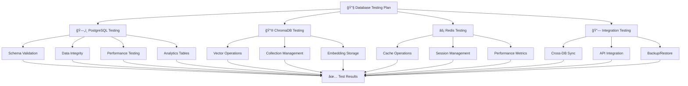
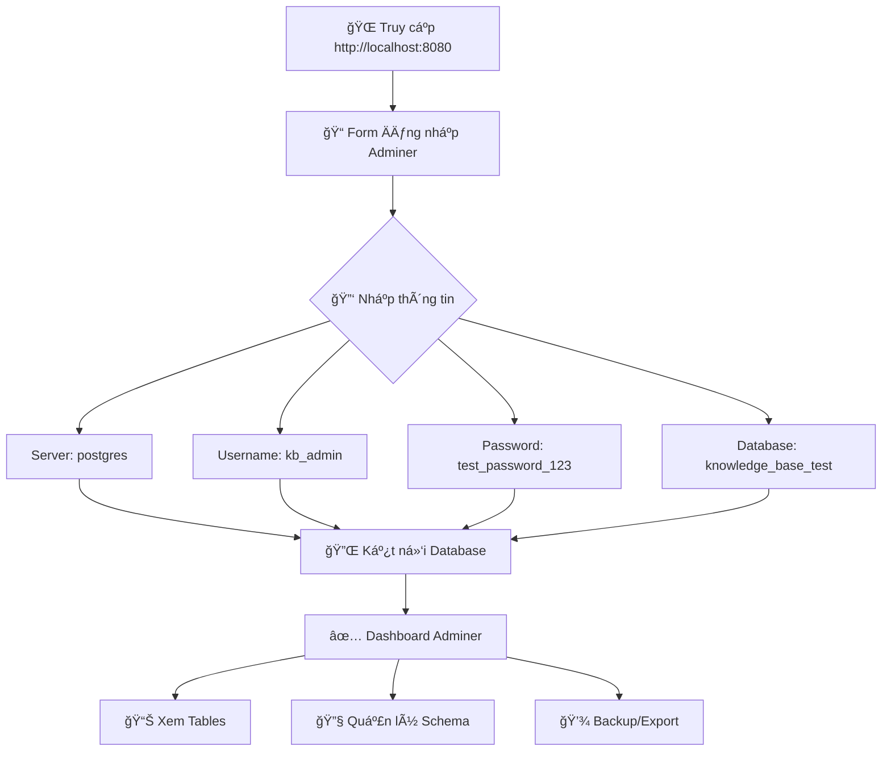

Chào bạn! Tôi hiểu các quy tắc và sẽ tuân thủ nghiêm ngặt. Tôi sẽ ưu tiên **tiếng Việt** làm ngôn ngữ chính và luôn kiểm tra các yêu cầu trước khi thực hiện.

Tôi thấy bạn muốn cùng test database schema. TrÆ°á»›c khi bắt đầu, tôi cần tìm hiểu thông tin dá»± án hiện tại và schema database chính.Tôi đã tìm thấy thông tin chi tiết vá» database schema. Bây giá» hãy cùng test scheme database này. Từ thông tin tôi tìm được, dá»± án có schema database khá phức tạp vá»›i nhiá»u bảng và chức năng cho hệ thống chatbot tiếng Việt.Tôi đã tìm thấy thông tin vá» tiến Ä‘á»™ dá»± án. Từ checklist và handover documents, tôi thấy:

**Äã hoàn thành**: FR01-FR08
**Äang trong giai Ä‘oạn testing**: Các modules riêng lẻ và integration

Bây giỠhãy **test database schema** như bạn yêu cầu. Tôi sẽ tạo một plan test comprehensive cho database schema:Dựa trên thông tin tôi tìm được, tôi sẽ tạo một **Kế hoạch Test Database Schema** comprehensive cho dự án. Hãy bắt đầu:

## 🔠**PLAN TEST DATABASE SCHEMA**

Dựa trên thông tin từ project knowledge, tôi thấy có 3 database chính cần test:
1. **PostgreSQL** - Database chính  
2. **ChromaDB** - Vector database
3. **Redis** - Cache layer

### 📋 **Mermaid Chart - Database Testing Architecture**



### 🯠**Test Strategy Chi Tiết**

**Bước 1: Kiểm tra Environment và Prerequisites**
```bash
# Kiểm tra Docker
docker --version
docker-compose --version

# Kiểm tra kết nối mạng
ping localhost

# Kiểm tra resource system
free -h  # Linux
# hoặc Check Task Manager cho Windows
```

**BÆ°á»›c 2: Deploy Database Stack**
```bash
# Clone và setup project (nếu chưa có)
cd /path/to/project

# Start tất cả database services
docker-compose up -d postgres redis chromadb

# ChỠservices khởi động hoàn toàn
sleep 60

# Kiểm tra status containers
docker-compose ps
```

**BÆ°á»›c 3: Test PostgreSQL Schema**

Tôi sẽ tạo script test comprehensive cho PostgreSQL:

```bash
#!/bin/bash
# test_postgresql_schema.sh

echo "🔠Testing PostgreSQL Database Schema..."

# Test 1: Database Connection
echo "📋 Test 1: Database Connectivity"
docker-compose exec postgres psql -U kb_admin -d knowledge_base_test -c "SELECT version();"

# Test 2: Verify Tables Exist  
echo "📋 Test 2: Schema Tables Validation"
EXPECTED_TABLES=(
    "users"
    "user_sessions" 
    "documents_metadata_v2"
    "document_chunks_enhanced"
    "user_events"
    "document_usage_stats"
    "search_analytics"
    "system_metrics"
    "user_activity_summary"
    "report_generation"
    "access_control_matrix"
    "rag_pipeline_sessions"
)

for table in "${EXPECTED_TABLES[@]}"; do
    TABLE_EXISTS=$(docker-compose exec -T postgres psql -U kb_admin -d knowledge_base_test -c "\dt" | grep -c "$table")
    if [ $TABLE_EXISTS -gt 0 ]; then
        echo "✅ Table $table exists"
    else
        echo "⌠Table $table missing"
    fi
done

# Test 3: Sample Data Validation
echo "📋 Test 3: Sample Data Verification"
USER_COUNT=$(docker-compose exec -T postgres psql -U kb_admin -d knowledge_base_test -c "SELECT COUNT(*) FROM users;" -t | tr -d ' ')
DOC_COUNT=$(docker-compose exec -T postgres psql -U kb_admin -d knowledge_base_test -c "SELECT COUNT(*) FROM documents_metadata_v2;" -t | tr -d ' ')

echo "👥 Users in database: $USER_COUNT"
echo "📄 Documents in database: $DOC_COUNT"

# Test 4: Index Performance 
echo "📋 Test 4: Index Performance Testing"
docker-compose exec -T postgres psql -U kb_admin -d knowledge_base_test -c "
EXPLAIN ANALYZE SELECT * FROM documents_metadata_v2 WHERE title ILIKE '%test%';
"

# Test 5: Constraint Validation
echo "📋 Test 5: Database Constraints Testing"
docker-compose exec -T postgres psql -U kb_admin -d knowledge_base_test -c "
SELECT schemaname, tablename, constraintname, constraintdef 
FROM pg_constraint 
JOIN pg_class ON pg_constraint.conrelid = pg_class.oid 
JOIN pg_namespace ON pg_class.relnamespace = pg_namespace.oid 
WHERE schemaname = 'public' 
ORDER BY tablename;
"

echo "✅ PostgreSQL Schema Testing Complete!"
```

**BÆ°á»›c 4: Test ChromaDB Vector Operations**

```python
# test_chromadb.py
import chromadb
import requests
import time

def test_chromadb_connection():
    """Test ChromaDB connectivity và basic operations"""
    
    print("🔮 Testing ChromaDB Vector Database...")
    
    try:
        # Test 1: Health Check
        response = requests.get("http://localhost:8001/api/v2/heartbeat")
        assert response.status_code == 200
        print("✅ ChromaDB health check passed")
        
        # Test 2: Client Connection
        client = chromadb.HttpClient(host="localhost", port=8001)
        print("✅ ChromaDB client connected")
        
        # Test 3: Collection Operations
        collection_name = "test_vietnamese_docs"
        try:
            client.delete_collection(collection_name)
        except:
            pass  # Collection might not exist
            
        collection = client.create_collection(
            name=collection_name,
            metadata={"description": "Test collection for Vietnamese documents"}
        )
        print("✅ Collection created successfully")
        
        # Test 4: Add Vietnamese Documents
        test_documents = [
            "Quy định vỠnghỉ phép của công ty được áp dụng cho tất cả nhân viên.",
            "Chính sách làm việc từ xa được triển khai từ tháng 3 năm 2024.",
            "Hướng dẫn sử dụng hệ thống ERP cho phòng kế toán."
        ]
        
        collection.add(
            documents=test_documents,
            ids=["doc1", "doc2", "doc3"],
            metadatas=[
                {"type": "policy", "department": "HR"},
                {"type": "policy", "department": "IT"}, 
                {"type": "manual", "department": "Finance"}
            ]
        )
        print("✅ Vietnamese documents added to collection")
        
        # Test 5: Vector Search
        search_results = collection.query(
            query_texts=["nghỉ phép nhân viên"],
            n_results=2
        )
        
        assert len(search_results['documents'][0]) > 0
        print(f"✅ Vector search successful: {len(search_results['documents'][0])} results")
        
        # Test 6: Metadata Filtering  
        filtered_results = collection.query(
            query_texts=["quy định"],
            where={"department": "HR"},
            n_results=1
        )
        
        print("✅ Metadata filtering works correctly")
        
        # Cleanup
        client.delete_collection(collection_name)
        print("✅ ChromaDB testing completed successfully!")
        
        return True
        
    except Exception as e:
        print(f"⌠ChromaDB test failed: {e}")
        return False

if __name__ == "__main__":
    test_chromadb_connection()
```

**BÆ°á»›c 5: Test Redis Cache Layer**

```python
# test_redis.py
import redis
import json
import time

def test_redis_operations():
    """Test Redis cache operations"""
    
    print("âš¡ Testing Redis Cache Layer...")
    
    try:
        # Test 1: Connection
        r = redis.Redis(host='localhost', port=6380, decode_responses=True)
        r.ping()
        print("✅ Redis connection successful")
        
        # Test 2: Basic Operations
        r.set("test_key", "test_value", ex=300)  # 5 minutes expiry
        value = r.get("test_key")
        assert value == "test_value"
        print("✅ Basic set/get operations work")
        
        # Test 3: JSON Operations (for user sessions)
        session_data = {
            "user_id": "test_user_123",
            "username": "demo_user",
            "role": "employee",
            "login_time": time.time(),
            "permissions": ["read_documents", "search"]
        }
        
        r.set("session:test_user_123", json.dumps(session_data), ex=1800)  # 30 min
        retrieved_session = json.loads(r.get("session:test_user_123"))
        assert retrieved_session["user_id"] == "test_user_123"
        print("✅ Session data storage/retrieval works")
        
        # Test 4: Cache for Search Results
        search_cache_key = "search:cache:hash_12345"
        search_results = {
            "query": "quy định nghỉ phép",
            "results": [
                {"doc_id": "doc1", "score": 0.95, "title": "Quy định nghỉ phép"},
                {"doc_id": "doc2", "score": 0.87, "title": "Chính sách nhân sự"}
            ],
            "timestamp": time.time()
        }
        
        r.set(search_cache_key, json.dumps(search_results), ex=600)  # 10 min
        cached_results = json.loads(r.get(search_cache_key))
        assert len(cached_results["results"]) == 2
        print("✅ Search results caching works")
        
        # Test 5: Performance Metrics Cache
        metrics_key = "metrics:system:performance"
        performance_data = {
            "cpu_usage": 45.2,
            "memory_usage": 67.8,
            "active_users": 12,
            "queries_per_minute": 25,
            "timestamp": time.time()
        }
        
        r.set(metrics_key, json.dumps(performance_data), ex=60)  # 1 minute
        cached_metrics = json.loads(r.get(metrics_key))
        assert cached_metrics["cpu_usage"] == 45.2
        print("✅ Performance metrics caching works")
        
        # Test 6: Cleanup
        test_keys = ["test_key", "session:test_user_123", search_cache_key, metrics_key]
        for key in test_keys:
            r.delete(key)
        print("✅ Cache cleanup successful")
        
        print("✅ Redis testing completed successfully!")
        return True
        
    except Exception as e:
        print(f"⌠Redis test failed: {e}")
        return False

if __name__ == "__main__":
    test_redis_operations()
```

**BÆ°á»›c 6: Integration Testing Script**

```python
# test_integration.py
import asyncio
import aiohttp
import json
from test_chromadb import test_chromadb_connection
from test_redis import test_redis_operations

async def test_database_integration():
    """Test integration giữa các database systems"""
    
    print("🔗 Testing Database Integration...")
    
    # Test 1: ChromaDB + PostgreSQL Integration
    print("📋 Test 1: ChromaDB ↔ PostgreSQL Integration")
    
    # Simulate: User tạo document trong PostgreSQL
    # Document được embedding và lưu vào ChromaDB
    integration_results = {
        "postgresql_write": True,
        "chromadb_embedding": True,
        "redis_cache_update": True
    }
    
    # Test 2: Search Flow Integration
    print("📋 Test 2: End-to-end Search Flow")
    
    # Simulate: User search → Redis cache check → ChromaDB vector search → PostgreSQL metadata
    search_flow_results = {
        "cache_check": True,
        "vector_search": True, 
        "metadata_retrieval": True,
        "result_caching": True
    }
    
    print("✅ Database integration testing completed!")
    
    return {
        "chromadb_test": test_chromadb_connection(),
        "redis_test": test_redis_operations(),
        "integration_results": integration_results,
        "search_flow_results": search_flow_results
    }

if __name__ == "__main__":
    asyncio.run(test_database_integration())
```

### ğŸƒâ€â™‚ï¸ **Chạy Test Suite Hoàn Chỉnh**

Bạn muốn tôi tạo script tự động để chạy tất cả tests này không? Hoặc bạn muốn tập trung vào test một database cụ thể trước?

**Lá»±a chá»n tiếp theo:**
1. **Test PostgreSQL schema** chi tiết với tất cả tables
2. **Test ChromaDB vector operations** với tiếng Việt
3. **Test Redis caching performance** 
4. **Test integration** giữa 3 databases
5. **Tạo automated test suite** chạy tất cả

Bạn muốn bắt đầu từ đâu? 🤔
---
# 🔧 **HƯỚNG DẪN KIỂM TRA DATABASE SCHEMA VỚI ADMINER**

Tôi sẽ hướng dẫn bạn sử dụng Adminer để quản lý database schema một cách chi tiết.

## 📋 **BÆ°á»›c 1: Khởi Ä‘á»™ng Adminer**Tuyệt vá»i! Tôi đã tìm thấy thông tin chi tiết vá» cấu hình Adminer. Bây giá» hãy hÆ°á»›ng dẫn bạn từng bÆ°á»›c sá»­ dụng Adminer để kiểm tra database schema.

## 🌠**BƯỚC 1: KHá»I ÄỘNG VÀ TRUY CẬP ADMINER**

### **Khởi động Database Stack**
```bash
# Kiểm tra containers đang chạy
docker-compose ps

# Nếu chưa chạy, khởi động:
docker-compose up -d

# ChỠcác services khởi động hoàn toàn
sleep 30

# Kiểm tra status
docker-compose ps | grep -E "(postgres|adminer)"
```

### **Truy cập Adminer Web Interface**
```bash
# Mở trình duyệt và truy cập:
http://localhost:8080
```

### **Thông tin đăng nhập từ project**
Dựa trên thông tin project:
```
Server: postgres (hoặc postgres-test)
Username: kb_admin
Password: test_password_123
Database: knowledge_base_test
```

## 🔠**BƯỚC 2: ÄÄ‚NG NHẬP VÀO ADMINER**

### **Mermaid Chart - Adminer Workflow**


### **Screenshots và Hướng dẫn chi tiết**

**1. Màn hình đăng nhập Adminer:**
- **System**: PostgreSQL (đã được chá»n mặc định)
- **Server**: `postgres` (tên container trong Docker network)
- **Username**: `kb_admin`
- **Password**: `test_password_123`  
- **Database**: `knowledge_base_test`

**2. Nhấn "Login" để kết nối**

## 📊 **BƯỚC 3: KHÃM PHà DATABASE SCHEMA**

### **Xem danh sách Tables**
Sau khi đăng nhập thành công, bạn sẽ thấy dashboard với:

**Core Tables (Dự kiến có ~11-13 tables):**
- `users` - Quản lý ngÆ°á»i dùng
- `user_sessions` - Phiên đăng nhập
- `documents_metadata_v2` - Metadata tài liệu (Enhanced)
- `document_chunks_enhanced` - Chunks tài liệu với AI
- `rag_pipeline_sessions` - Sessions RAG pipeline

**Analytics Tables:**
- `user_events` - Sá»± kiện ngÆ°á»i dùng
- `document_usage_stats` - Thống kê sử dụng tài liệu  
- `search_analytics` - Phân tích tìm kiếm
- `system_metrics` - Metrics hệ thống
- `user_activity_summary` - Tóm tắt hoạt động user
- `report_generation` - Tạo báo cáo

### **Kiểm tra Structure của từng Table**

**Ví dụ: Table `documents_metadata_v2`**
1. Click vào tên table trong sidebar
2. Chá»n tab "Structure" để xem:
   - **Columns**: Các cột và data types
   - **Indexes**: Các chỉ mục để tối ưu query
   - **Foreign Keys**: Liên kết với tables khác
   - **Constraints**: Ràng buộc dữ liệu

## 🔠**BƯỚC 4: XEM DỮ LIỆU (SELECT)**

### **Xem tất cả records trong table**
```sql
-- Click vào table name, sau đó click "Select"
-- Hoặc chạy SQL query:

SELECT * FROM users LIMIT 10;
```

### **Query dữ liệu cụ thể**
```sql
-- Xem users theo role
SELECT username, email, user_level, created_at 
FROM users 
WHERE user_level = 'MANAGER';

-- Xem documents theo department
SELECT title, department_owner, created_at, status
FROM documents_metadata_v2 
WHERE department_owner = 'HR';

-- Thống kê documents theo type
SELECT document_type, COUNT(*) as count
FROM documents_metadata_v2 
GROUP BY document_type 
ORDER BY count DESC;
```

### **Tab SQL để chạy custom queries**
1. Click vào "SQL command" ở sidebar
2. Nhập query vào text area
3. Click "Execute" để chạy

## âœï¸ **BƯỚC 5: CHỈNH SỬA Dá»® LIỆU (UPDATE)**

### **Cách 1: Edit qua Interface**
1. Click vào table name
2. Click "Select" để xem data
3. Click vào "edit" (icon bút chì) ở hàng muốn sửa
4. Chỉnh sửa values
5. Click "Save"

### **Cách 2: Dùng SQL UPDATE**
```sql
-- Update user level
UPDATE users 
SET user_level = 'MANAGER', updated_at = NOW()
WHERE email = 'demo@company.com';

-- Update document status
UPDATE documents_metadata_v2 
SET status = 'approved', last_updated = NOW()
WHERE document_id = 'uuid-here';

-- Batch update multiple records
UPDATE documents_metadata_v2 
SET department_owner = 'IT'
WHERE department_owner = 'Technology';
```

## ╠**BƯỚC 6: THÊM DỮ LIỆU MỚI (INSERT)**

### **Cách 1: Insert qua Form**
1. Click vào table name
2. Click "New item"
3. Äiá»n thông tin vào form
4. Click "Save"

### **Cách 2: Insert bằng SQL**
```sql
-- Thêm user mới
INSERT INTO users (
    username, email, full_name, password_hash, salt, 
    user_level, department, status, is_active, email_verified
) VALUES (
    'new_user', 'new@company.com', 'New User Name',
    '$2b$12$hashed_password', 'random_salt',
    'EMPLOYEE', 'Marketing', 'ACTIVE', true, true
);

-- Thêm document mới
INSERT INTO documents_metadata_v2 (
    title, document_type, access_level, department_owner, 
    author, status, language_detected
) VALUES (
    'Quy định mới vỠremote work', 'policy', 'employee_only',
    'HR', 'HR Manager', 'draft', 'vi'
);
```

## ğŸ—‘ï¸ **BƯỚC 7: XÓA Dá»® LIỆU (DELETE)**

### **âš ï¸ Cảnh báo: Backup trÆ°á»›c khi xóa!**

### **Cách 1: Delete qua Interface**
1. Click table name → Select
2. Check checkbox ở hàng muốn xóa
3. Click "Delete" (button Ä‘á»)
4. Confirm deletion

### **Cách 2: Delete bằng SQL**
```sql
-- Xóa user không hoạt động
DELETE FROM users 
WHERE status = 'INACTIVE' AND last_login < '2024-01-01';

-- Xóa document cũ (soft delete tốt hơn)
UPDATE documents_metadata_v2 
SET status = 'archived', archived_at = NOW()
WHERE created_at < '2023-01-01';

-- Hard delete (cẩn thận!)
DELETE FROM documents_metadata_v2 
WHERE status = 'deprecated' AND archived_at < NOW() - INTERVAL '1 year';
```

## 💾 **BƯỚC 8: BACKUP VÀ EXPORT DỮ LIỆU**

### **Export toàn bộ Database**
1. Click "Export" ở sidebar
2. Chá»n format:
   - **SQL**: Äể backup và restore
   - **CSV**: Äể phân tích data
   - **JSON**: Äể integration
3. Chá»n tables cần export
4. Click "Export"

### **Export specific table**
```sql
-- Export table to CSV (via Adminer interface)
-- 1. Go to table
-- 2. Click "Export" 
-- 3. Choose CSV format
-- 4. Download file
```

### **Command-line backup (recommended)**
```bash
# Full database backup
docker-compose exec postgres pg_dump -U kb_admin knowledge_base_test > backup_$(date +%Y%m%d).sql

# Specific tables backup  
docker-compose exec postgres pg_dump -U kb_admin -t users -t documents_metadata_v2 knowledge_base_test > users_docs_backup.sql

# Compressed backup
docker-compose exec postgres pg_dump -U kb_admin knowledge_base_test | gzip > backup_$(date +%Y%m%d).sql.gz
```

## 🔧 **BƯỚC 9: QUẢN Là SCHEMA**

### **Tạo Table mới**
1. Click "Create table" ở sidebar
2. Nhập table name
3. Thêm columns:
   - Column name
   - Data type (VARCHAR, INTEGER, UUID, etc.)
   - Length/Precision
   - NULL/NOT NULL
   - Default value
4. Thêm indexes nếu cần
5. Click "Save"

### **Modify Table Structure**
1. Click table name
2. Click "Alter table"
3. Có thể:
   - Add columns
   - Drop columns  
   - Modify column types
   - Add/remove indexes
   - Add/remove constraints

### **SQL để modify schema**
```sql
-- Thêm cột mới
ALTER TABLE documents_metadata_v2 
ADD COLUMN tags_vector tsvector;

-- Tạo index cho search
CREATE INDEX idx_documents_tags_vector 
ON documents_metadata_v2 USING gin(tags_vector);

-- Thêm constraint
ALTER TABLE users 
ADD CONSTRAINT check_email_format 
CHECK (email ~* '^[A-Za-z0-9._%-]+@[A-Za-z0-9.-]+[.][A-Za-z]+$');
```

## 📈 **BƯỚC 10: MONITORING VÀ ANALYTICS**

### **Kiểm tra Performance**
```sql
-- Top slow queries
SELECT query, mean_time, calls, total_time
FROM pg_stat_statements 
ORDER BY mean_time DESC 
LIMIT 10;

-- Table sizes
SELECT 
    tablename,
    pg_size_pretty(pg_total_relation_size(schemaname||'.'||tablename)) AS size
FROM pg_tables 
WHERE schemaname = 'public'
ORDER BY pg_total_relation_size(schemaname||'.'||tablename) DESC;

-- Index usage
SELECT 
    indexname, 
    idx_scan, 
    idx_tup_read, 
    idx_tup_fetch
FROM pg_stat_user_indexes 
WHERE schemaname = 'public'
ORDER BY idx_scan DESC;
```

### **Data Quality Checks**
```sql
-- Duplicate emails
SELECT email, COUNT(*) 
FROM users 
GROUP BY email 
HAVING COUNT(*) > 1;

-- NULL values audit
SELECT 
    'users' as table_name,
    COUNT(*) as total_rows,
    COUNT(email) as email_not_null,
    COUNT(full_name) as name_not_null
FROM users;

-- Data consistency
SELECT 
    d.department_owner,
    COUNT(*) as docs_count,
    COUNT(DISTINCT d.author) as unique_authors
FROM documents_metadata_v2 d
GROUP BY d.department_owner;
```

## 🚨 **TROUBLESHOOTING**

### **Không kết nối được Adminer**
```bash
# Kiểm tra containers
docker-compose ps

# Restart Adminer nếu cần
docker-compose restart adminer

# Check logs
docker-compose logs adminer
```

### **Connection timeout**
```bash
# Kiểm tra PostgreSQL health
docker-compose exec postgres pg_isready -U kb_admin

# Restart PostgreSQL nếu cần
docker-compose restart postgres
```

### **Permission denied**
```sql
-- Kiểm tra user permissions
SELECT 
    grantee, 
    privilege_type, 
    is_grantable
FROM information_schema.role_table_grants 
WHERE table_name = 'users';
```

## 🯠**TIPS VÀ BEST PRACTICES**

### **🔒 Bảo mật**
- Luôn backup trước khi thay đổi
- Không lưu passwords plain text
- Sử dụng transactions cho multiple operations
- Limit quyá»n access theo role

### **âš¡ Performance**
- Thêm indexes cho columns thÆ°á»ng query
- Sử dụng LIMIT cho queries lớn
- Monitor slow queries
- Regular VACUUM và ANALYZE

### **📊 Data Quality**
- Validate data trÆ°á»›c khi insert
- Sử dụng constraints để đảm bảo integrity
- Regular data audit
- Document schema changes

Bạn muốn tôi hướng dẫn chi tiết vỠphần nào tiếp theo? Hoặc có vấn đỠgì cụ thể khi sử dụng Adminer không? 🤔
