Tài liệu này dùng để kiểm tra hiểu về database tạo trong docker
Câu hỏi rất hay! Tôi sẽ giải thích và bổ sung để hệ thống production-ready hơn:

## 🔄 **MIGRATION STRATEGY - KHÔNG CẦN LÀM LẠI DATABASE**

### **1. Database Migration System**

Tạo file `scripts/migrations/migration_manager.py`:

```python
# scripts/migrations/migration_manager.py
import asyncio
import asyncpg
import os
import logging
from datetime import datetime
from pathlib import Path

logging.basicConfig(level=logging.INFO)
logger = logging.getLogger(__name__)

class MigrationManager:
    def __init__(self, db_config):
        self.db_config = db_config
        self.migrations_path = Path("scripts/migrations")
        
    async def setup_migration_table(self):
        """Tạo bảng theo dõi migrations"""
        conn = await asyncpg.connect(**self.db_config)
        
        await conn.execute("""
            CREATE TABLE IF NOT EXISTS schema_migrations (
                migration_id SERIAL PRIMARY KEY,
                filename VARCHAR(255) UNIQUE NOT NULL,
                applied_at TIMESTAMP WITH TIME ZONE DEFAULT NOW(),
                checksum VARCHAR(64),
                description TEXT
            );
        """)
        
        await conn.close()
        logger.info("✅ Migration tracking table ready")
    
    async def get_applied_migrations(self):
        """Lấy danh sách migrations đã chạy"""
        conn = await asyncpg.connect(**self.db_config)
        
        applied = await conn.fetch("""
            SELECT filename FROM schema_migrations ORDER BY migration_id
        """)
        
        await conn.close()
        return [row['filename'] for row in applied]
    
    async def run_pending_migrations(self):
        """Chạy các migrations chưa được apply"""
        await self.setup_migration_table()
        applied_migrations = await self.get_applied_migrations()
        
        # Tìm tất cả migration files
        migration_files = sorted([
            f for f in os.listdir(self.migrations_path) 
            if f.endswith('.sql') and f not in applied_migrations
        ])
        
        if not migration_files:
            logger.info("✅ No pending migrations")
            return
        
        conn = await asyncpg.connect(**self.db_config)
        
        for filename in migration_files:
            try:
                logger.info(f"🔄 Applying migration: {filename}")
                
                # Đọc và chạy migration
                with open(self.migrations_path / filename, 'r', encoding='utf-8') as f:
                    sql_content = f.read()
                
                # Tính checksum
                import hashlib
                checksum = hashlib.md5(sql_content.encode()).hexdigest()
                
                # Chạy trong transaction
                async with conn.transaction():
                    await conn.execute(sql_content)
                    
                    # Ghi vào migration log
                    await conn.execute("""
                        INSERT INTO schema_migrations (filename, checksum, description)
                        VALUES ($1, $2, $3)
                    """, filename, checksum, f"Applied {filename}")
                
                logger.info(f"✅ Migration {filename} applied successfully")
                
            except Exception as e:
                logger.error(f"❌ Migration {filename} failed: {e}")
                raise
        
        await conn.close()
        logger.info("🎉 All migrations applied successfully")

# Usage trong production
async def migrate_database():
    db_config = {
        'host': 'localhost',
        'port': 5433,
        'database': 'knowledge_base_test',
        'user': 'kb_admin',
        'password': 'test_password_123'
    }
    
    migration_manager = MigrationManager(db_config)
    await migration_manager.run_pending_migrations()

if __name__ == "__main__":
    asyncio.run(migrate_database())
```

### **2. Tạo Migration Files mới**

Khi cần thêm bảng mới, tạo file migration:

```sql
-- scripts/migrations/20240315_001_add_user_preferences.sql
-- Migration: Add user preferences table

CREATE TABLE IF NOT EXISTS user_preferences (
    pref_id UUID PRIMARY KEY DEFAULT uuid_generate_v4(),
    user_id UUID NOT NULL,
    
    -- UI Preferences
    theme VARCHAR(20) DEFAULT 'light',
    language VARCHAR(10) DEFAULT 'vi',
    results_per_page INTEGER DEFAULT 10,
    
    -- Search Preferences  
    default_search_method VARCHAR(20) DEFAULT 'hybrid',
    include_archived BOOLEAN DEFAULT false,
    preferred_departments TEXT[],
    
    -- Notification Preferences
    email_notifications BOOLEAN DEFAULT true,
    query_suggestions BOOLEAN DEFAULT true,
    
    -- Timestamps
    created_at TIMESTAMP WITH TIME ZONE DEFAULT NOW(),
    updated_at TIMESTAMP WITH TIME ZONE DEFAULT NOW(),
    
    UNIQUE(user_id)
);

CREATE INDEX idx_user_preferences_user ON user_preferences(user_id);

-- Sample data cho testing
INSERT INTO user_preferences (user_id, theme, language, preferred_departments) VALUES
(uuid_generate_v4(), 'dark', 'vi', ARRAY['IT', 'R&D']),
(uuid_generate_v4(), 'light', 'vi', ARRAY['HR', 'Finance'])
ON CONFLICT (user_id) DO NOTHING;

-- Migration completed successfully
```

```sql
-- scripts/migrations/20240315_002_add_document_analytics.sql
-- Migration: Add document analytics tracking

CREATE TABLE IF NOT EXISTS document_analytics (
    analytics_id UUID PRIMARY KEY DEFAULT uuid_generate_v4(),
    document_id UUID REFERENCES documents_metadata_v2(document_id) ON DELETE CASCADE,
    
    -- Usage metrics
    view_count INTEGER DEFAULT 0,
    search_count INTEGER DEFAULT 0,
    download_count INTEGER DEFAULT 0,
    avg_rating DECIMAL(3,2),
    
    -- Time-based metrics
    last_accessed TIMESTAMP WITH TIME ZONE,
    peak_usage_hour INTEGER, -- 0-23
    usage_by_day JSONB, -- {"monday": 15, "tuesday": 8, ...}
    
    -- User engagement
    unique_users INTEGER DEFAULT 0,
    avg_session_duration INTEGER, -- seconds
    bounce_rate DECIMAL(3,2),
    
    -- Department popularity
    department_usage JSONB, -- {"HR": 45, "IT": 32, ...}
    
    created_at TIMESTAMP WITH TIME ZONE DEFAULT NOW(),
    updated_at TIMESTAMP WITH TIME ZONE DEFAULT NOW()
);

CREATE INDEX idx_document_analytics_doc ON document_analytics(document_id);
CREATE INDEX idx_document_analytics_views ON document_analytics(view_count DESC);
CREATE INDEX idx_document_analytics_accessed ON document_analytics(last_accessed DESC);
```

### **3. Smart Data Loading Strategy**

Tạo file `scripts/data_loader.py`:

```python
# scripts/data_loader.py
import asyncio
import asyncpg
import json
import logging
from pathlib import Path
from datetime import datetime

logger = logging.getLogger(__name__)

class SmartDataLoader:
    def __init__(self, db_config):
        self.db_config = db_config
        
    async def load_sample_data(self, overwrite=False):
        """Load sample data with options"""
        conn = await asyncpg.connect(**self.db_config)
        
        try:
            # Check existing data
            existing_count = await conn.fetchval("""
                SELECT COUNT(*) FROM documents_metadata_v2
            """)
            
            if existing_count > 0 and not overwrite:
                logger.info(f"📄 Found {existing_count} existing documents")
                logger.info("🔄 Loading additional sample data (no overwrite)")
                
                # Load additional data với UNIQUE constraints
                await self._load_additional_sample_data(conn)
            else:
                if overwrite:
                    logger.info("🗑️ Clearing existing data...")
                    await self._clear_sample_data(conn)
                
                logger.info("📄 Loading fresh sample data...")
                await self._load_fresh_sample_data(conn)
                
        finally:
            await conn.close()
    
    async def _load_additional_sample_data(self, conn):
        """Load thêm data không duplicate"""
        additional_docs = [
            {
                'title': 'Hướng dẫn Onboarding nhân viên mới',
                'content': '''
                Quy trình onboarding nhân viên mới:
                1. Chuẩn bị workspace và tài khoản hệ thống
                2. Orientation về văn hóa công ty  
                3. Training các công cụ và quy trình
                4. Gán mentor và buddy system
                5. Đánh giá sau 30-60-90 ngày
                ''',
                'document_type': 'procedure',
                'department_owner': 'HR',
                'author': 'HR Team'
            },
            {
                'title': 'Chính sách bảo mật thông tin',
                'content': '''
                Chính sách bảo mật thông tin công ty:
                - Phân loại độ bí mật: Public, Internal, Confidential, Restricted
                - Quy định sử dụng email và file sharing
                - Bảo mật mật khẩu và 2FA
                - Quy trình báo cáo sự cố bảo mật
                - Training định kỳ về bảo mật
                ''',
                'document_type': 'policy',
                'department_owner': 'IT',
                'author': 'Security Team'
            }
        ]
        
        for doc in additional_docs:
            try:
                await conn.execute("""
                    INSERT INTO documents_metadata_v2 (
                        title, content, document_type, access_level, 
                        department_owner, author, status, jsonl_export_ready
                    ) VALUES ($1, $2, $3, $4, $5, $6, $7, $8)
                    ON CONFLICT (title) DO NOTHING
                """, 
                doc['title'], doc['content'], doc['document_type'],
                'employee_only', doc['department_owner'], doc['author'],
                'approved', True
                )
                logger.info(f"✅ Added: {doc['title']}")
            except Exception as e:
                logger.warning(f"⚠️ Skipped duplicate: {doc['title']}")
    
    async def _load_fresh_sample_data(self, conn):
        """Load data hoàn toàn mới"""
        # Implementation tương tự migration script hiện tại
        pass
    
    async def _clear_sample_data(self, conn):
        """Xóa sample data (giữ lại structure)"""
        tables_to_clear = [
            'document_chunks_enhanced',
            'document_bm25_index', 
            'vietnamese_text_analysis',
            'rag_pipeline_sessions',
            'documents_metadata_v2'
        ]
        
        for table in tables_to_clear:
            await conn.execute(f"DELETE FROM {table} WHERE created_by IS NULL OR created_by = 'sample_data'")
            logger.info(f"🗑️ Cleared sample data from {table}")

# Usage
async def main():
    db_config = {
        'host': 'localhost',
        'port': 5433,
        'database': 'knowledge_base_test',
        'user': 'kb_admin',
        'password': 'test_password_123'
    }
    
    loader = SmartDataLoader(db_config)
    
    # Load data mà không overwrite
    await loader.load_sample_data(overwrite=False)

if __name__ == "__main__":
    asyncio.run(main())
```

## 🗃️ **REDIS TABLES VISUALIZATION**

Redis không có "tables" như RDBMS, nhưng có **key patterns**. Tạo script để xem cấu trúc:

```python
# scripts/redis_inspector.py
import redis
import json
from collections import defaultdict

def inspect_redis_structure():
    """Inspect và display Redis data structure"""
    
    r = redis.Redis(host='localhost', port=6380, db=0, decode_responses=True)
    
    # Get all keys
    all_keys = r.keys("*")
    
    # Group by patterns
    patterns = defaultdict(list)
    for key in all_keys:
        pattern = ":".join(key.split(":")[:-1]) + ":*"
        patterns[pattern].append(key)
    
    print("🔴 REDIS DATA STRUCTURE")
    print("=" * 50)
    
    for pattern, keys in patterns.items():
        print(f"\n📁 Pattern: {pattern}")
        print(f"   Count: {len(keys)} keys")
        
        # Show sample data structure
        sample_key = keys[0]
        data_type = r.type(sample_key)
        
        if data_type == 'hash':
            sample_data = r.hgetall(sample_key)
            print(f"   Type: Hash")
            print(f"   Sample fields: {list(sample_data.keys())[:5]}")
            
            # Show sample content
            print(f"   Sample data:")
            for field, value in list(sample_data.items())[:3]:
                display_value = value[:50] + "..." if len(value) > 50 else value
                print(f"     {field}: {display_value}")
                
        elif data_type == 'string':
            sample_data = r.get(sample_key)
            print(f"   Type: String")
            print(f"   Sample: {sample_data[:100]}...")
            
        # Show TTL
        ttl = r.ttl(sample_key)
        if ttl > 0:
            print(f"   TTL: {ttl} seconds ({ttl//3600}h {(ttl%3600)//60}m)")
        else:
            print(f"   TTL: No expiration")

if __name__ == "__main__":
    inspect_redis_structure()
```

## 🟢 **CHROMADB COLLECTIONS INSPECTOR**

```python
# scripts/chromadb_inspector.py
import chromadb
from chromadb.config import Settings

def inspect_chromadb_collections():
    """Inspect ChromaDB collections và data"""
    
    client = chromadb.HttpClient(
        host='localhost',
        port=8001,
        settings=Settings(anonymized_telemetry=False)
    )
    
    print("🟢 CHROMADB COLLECTIONS STRUCTURE")
    print("=" * 50)
    
    collections = client.list_collections()
    
    for collection_info in collections:
        collection = client.get_collection(collection_info.name)
        
        print(f"\n📚 Collection: {collection.name}")
        print(f"   Document Count: {collection.count()}")
        print(f"   Metadata: {collection_info.metadata}")
        
        if collection.count() > 0:
            # Get sample documents
            sample = collection.get(limit=2, include=['documents', 'metadatas', 'embeddings'])
            
            print(f"   Sample Documents:")
            for i, doc_id in enumerate(sample['ids']):
                print(f"     ID: {doc_id}")
                if sample['documents']:
                    doc_preview = sample['documents'][i][:100] + "..." if len(sample['documents'][i]) > 100 else sample['documents'][i]
                    print(f"     Content: {doc_preview}")
                if sample['metadatas']:
                    print(f"     Metadata: {sample['metadatas'][i]}")
                if sample['embeddings']:
                    print(f"     Embedding dims: {len(sample['embeddings'][i])}")
                print()

if __name__ == "__main__":
    inspect_chromadb_collections()
```

## 📄 **JSONL IMPORT/EXPORT SYSTEM**

### **1. JSONL Export Tool**

```python
# scripts/jsonl_manager.py
import asyncio
import asyncpg
import json
import gzip
import os
from datetime import datetime
from pathlib import Path

class JSONLManager:
    def __init__(self, db_config):
        self.db_config = db_config
        self.export_dir = Path("data/jsonl_exports")
        self.export_dir.mkdir(parents=True, exist_ok=True)
        
    async def export_to_jsonl(self, collection_name="default", format_type="flashrag"):
        """Export documents to JSONL format"""
        
        conn = await asyncpg.connect(**self.db_config)
        
        try:
            # Get documents với chunks
            documents = await conn.fetch("""
                SELECT 
                    d.document_id,
                    d.title,
                    d.content,
                    d.document_type,
                    d.department_owner,
                    d.author,
                    d.language_detected,
                    d.created_at,
                    
                    -- Aggregated chunk data
                    array_agg(
                        json_build_object(
                            'chunk_id', c.chunk_id,
                            'content', c.chunk_content,
                            'position', c.chunk_position,
                            'quality_score', c.chunk_quality_score
                        ) ORDER BY c.chunk_position
                    ) as chunks
                FROM documents_metadata_v2 d
                LEFT JOIN document_chunks_enhanced c ON d.document_id = c.document_id
                WHERE d.status = 'approved'
                GROUP BY d.document_id, d.title, d.content, d.document_type, 
                         d.department_owner, d.author, d.language_detected, d.created_at
            """)
            
            timestamp = datetime.now().strftime("%Y%m%d_%H%M%S")
            filename = f"{collection_name}_{format_type}_{timestamp}.jsonl"
            filepath = self.export_dir / filename
            
            exported_count = 0
            
            with open(filepath, 'w', encoding='utf-8') as f:
                for doc in documents:
                    # FlashRAG format
                    if format_type == "flashrag":
                        # Document-level entry
                        doc_entry = {
                            "id": str(doc['document_id']),
                            "contents": doc['content'] or "",
                            "metadata": {
                                "title": doc['title'],
                                "type": doc['document_type'],
                                "department": doc['department_owner'],
                                "author": doc['author'],
                                "language": doc['language_detected'],
                                "created_at": doc['created_at'].isoformat(),
                                "total_chunks": len(doc['chunks']) if doc['chunks'][0]['chunk_id'] else 0
                            }
                        }
                        f.write(json.dumps(doc_entry, ensure_ascii=False) + '\n')
                        exported_count += 1
                        
                        # Chunk-level entries  
                        if doc['chunks'][0]['chunk_id']:  # Has chunks
                            for chunk in doc['chunks']:
                                if chunk['chunk_id']:
                                    chunk_entry = {
                                        "id": str(chunk['chunk_id']),
                                        "contents": chunk['content'],
                                        "metadata": {
                                            "parent_document": str(doc['document_id']),
                                            "chunk_position": chunk['position'],
                                            "quality_score": float(chunk['quality_score']) if chunk['quality_score'] else 0.0,
                                            "title": doc['title'],
                                            "type": "chunk"
                                        }
                                    }
                                    f.write(json.dumps(chunk_entry, ensure_ascii=False) + '\n')
                                    exported_count += 1
                    
                    # Standard format
                    elif format_type == "standard":
                        entry = {
                            "document_id": str(doc['document_id']),
                            "title": doc['title'],
                            "content": doc['content'],
                            "type": doc['document_type'],
                            "metadata": {
                                "department": doc['department_owner'],
                                "author": doc['author'],
                                "language": doc['language_detected'],
                                "chunks_count": len(doc['chunks']) if doc['chunks'][0]['chunk_id'] else 0
                            }
                        }
                        f.write(json.dumps(entry, ensure_ascii=False) + '\n')
                        exported_count += 1
            
            # Gzip compress
            with open(filepath, 'rb') as f_in:
                with gzip.open(f"{filepath}.gz", 'wb') as f_out:
                    f_out.writelines(f_in)
            
            # Remove uncompressed file
            os.remove(filepath)
            final_filepath = f"{filepath}.gz"
            
            # Log export
            await conn.execute("""
                INSERT INTO jsonl_exports (
                    collection_name, export_type, documents_exported,
                    total_size_bytes, export_path, compression_used,
                    export_status, created_by
                ) VALUES ($1, $2, $3, $4, $5, $6, $7, $8)
            """, 
            collection_name, format_type, exported_count,
            os.path.getsize(final_filepath), str(final_filepath),
            'gzip', 'completed', 'system'
            )
            
            print(f"✅ Exported {exported_count} entries to {final_filepath}")
            return final_filepath
            
        finally:
            await conn.close()
    
    async def import_from_jsonl(self, filepath, collection_name="imported"):
        """Import documents from JSONL file"""
        
        conn = await asyncpg.connect(**self.db_config)
        
        try:
            # Handle compressed files
            if filepath.endswith('.gz'):
                import gzip
                file_opener = gzip.open
            else:
                file_opener = open
            
            imported_docs = 0
            imported_chunks = 0
            
            with file_opener(filepath, 'rt', encoding='utf-8') as f:
                for line in f:
                    data = json.loads(line.strip())
                    
                    # Detect format và import accordingly
                    if 'contents' in data:  # FlashRAG format
                        if data['metadata'].get('type') == 'chunk':
                            # Skip chunks for now, handle in separate pass
                            continue
                        else:
                            # Document entry
                            await self._import_document(conn, data, collection_name)
                            imported_docs += 1
                    
                    else:  # Standard format
                        await self._import_document(conn, data, collection_name)
                        imported_docs += 1
            
            print(f"✅ Imported {imported_docs} documents from {filepath}")
            
        finally:
            await conn.close()
    
    async def _import_document(self, conn, data, collection_name):
        """Import single document"""
        try:
            # Extract data based on format
            if 'contents' in data:  # FlashRAG
                title = data['metadata'].get('title', 'Imported Document')
                content = data['contents']
                doc_type = data['metadata'].get('type', 'other')
                department = data['metadata'].get('department', 'Unknown')
                author = data['metadata'].get('author', 'Unknown')
            else:  # Standard
                title = data['title']
                content = data['content']
                doc_type = data['type']
                department = data['metadata'].get('department', 'Unknown')
                author = data['metadata'].get('author', 'Unknown')
            
            await conn.execute("""
                INSERT INTO documents_metadata_v2 (
                    title, content, document_type, access_level,
                    department_owner, author, status, flashrag_collection,
                    jsonl_export_ready, created_by
                ) VALUES ($1, $2, $3, $4, $5, $6, $7, $8, $9, $10)
                ON CONFLICT (title) DO UPDATE SET
                    content = EXCLUDED.content,
                    updated_at = NOW()
            """, 
            title, content, doc_type, 'employee_only',
            department, author, 'approved', collection_name,
            True, 'jsonl_import'
            )
            
        except Exception as e:
            print(f"⚠️ Failed to import document: {e}")

# Usage commands
async def main():
    db_config = {
        'host': 'localhost',
        'port': 5433,
        'database': 'knowledge_base_test',
        'user': 'kb_admin',
        'password': 'test_password_123'
    }
    
    jsonl_manager = JSONLManager(db_config)
    
    # Export
    exported_file = await jsonl_manager.export_to_jsonl("production", "flashrag")
    
    # Import (example)
    # await jsonl_manager.import_from_jsonl("data/external_docs.jsonl", "external")

if __name__ == "__main__":
    asyncio.run(main())
```

### **2. Production Management Scripts**

Tạo file `scripts/production_manager.py`:

```python
# scripts/production_manager.py
import asyncio
import click

@click.group()
def cli():
    """Production Database Management"""
    pass

@cli.command()
@click.option('--overwrite', is_flag=True, help='Overwrite existing data')
async def load_sample_data(overwrite):
    """Load sample data"""
    from data_loader import SmartDataLoader
    
    db_config = {
        'host': 'localhost',
        'port': 5433,
        'database': 'knowledge_base_test',
        'user': 'kb_admin',
        'password': 'test_password_123'
    }
    
    loader = SmartDataLoader(db_config)
    await loader.load_sample_data(overwrite=overwrite)

@cli.command()
@click.argument('collection_name')
@click.option('--format', default='flashrag', help='Export format')
async def export_jsonl(collection_name, format):
    """Export to JSONL"""
    from jsonl_manager import JSONLManager
    
    db_config = {
        'host': 'localhost',
        'port': 5433,
        'database': 'knowledge_base_test',
        'user': 'kb_admin',
        'password': 'test_password_123'
    }
    
    manager = JSONLManager(db_config)
    await manager.export_to_jsonl(collection_name, format)

@cli.command()
async def migrate():
    """Run database migrations"""
    from migration_manager import migrate_database
    await migrate_database()

@cli.command()
def inspect_redis():
    """Inspect Redis structure"""
    from redis_inspector import inspect_redis_structure
    inspect_redis_structure()

@cli.command()
def inspect_chromadb():
    """Inspect ChromaDB collections"""
    from chromadb_inspector import inspect_chromadb_collections
    inspect_chromadb_collections()

if __name__ == "__main__":
    cli()
```

### **Sử dụng trong thực tế:**

```bash
# Chạy migrations khi có bảng mới
python scripts/production_manager.py migrate

# Load thêm data không overwrite
python scripts/production_manager.py load-sample-data

# Load data và overwrite
python scripts/production_manager.py load-sample-data --overwrite

# Export JSONL
python scripts/production_manager.py export-jsonl production_docs --format flashrag

# Inspect Redis structure  
python scripts/production_manager.py inspect-redis

# Inspect ChromaDB
python scripts/production_manager.py inspect-chromadb
```

## 🎯 **TÓM TẮT STRATEGY**

1. **Migration Strategy**: ✅ Incremental, không cần làm lại database
2. **Data Loading**: ✅ Smart loading với options (append/overwrite)
3. **Redis Structure**: ✅ Key patterns với TTL, có inspector tool
4. **ChromaDB Collections**: ✅ Multiple collections với inspector
5. **JSONL Support**: ✅ Full import/export với FlashRAG compatibility


Bây giờ bạn có thể phát triển incremental mà không lo mất data! 🚀

Ah, tôi hiểu confusion của bạn rồi! Để làm rõ:

## 🟢 **ChromaDB - KHÔNG CÓ "BẢNG" TRUYỀN THỐNG**

ChromaDB là **vector database**, không có concept "bảng" như PostgreSQL. Thay vào đó:

### **ChromaDB Structure:**

```mermaid
graph TB
    subgraph "🟢 ChromaDB Internal Structure"
        subgraph "Collections (≈ Tables)"
            Collection1[📚 knowledge_base_v1<br/>- Documents: 1000<br/>- Embeddings: 1536-dim<br/>- Index: HNSW]
            Collection2[📚 vietnamese_docs<br/>- Documents: 500<br/>- Embeddings: 768-dim<br/>- Index: IVF]
        end
        
        subgraph "Document Storage (≈ Rows)"
            Doc1[📄 doc_001<br/>- content: text...<br/>- embedding: 0.1, 0.2, ...<br/>- metadata: 'title, dept']
            Doc2[📄 doc_002<br/>- content: text...<br/>- embedding: 0.3, 0.4, ...<br/>- metadata: 'title, dept']
        end
        
        subgraph "Internal Files"
            SQLite[(🗃️ metadata.sqlite<br/>Document metadata)]
            VectorFiles[📁 Vector files<br/>Binary embeddings]
            IndexFiles[📁 Index files<br/>HNSW/IVF indexes]
        end
    end
    
    Collection1 --> Doc1
    Collection1 --> Doc2
    Doc1 --> SQLite
    Doc1 --> VectorFiles
    Collection1 --> IndexFiles
```


### **ChromaDB "Tables" thực chất là:**

1. **Collections** = Tables
2. **Documents** = Rows  
3. **Embeddings** = Vector columns
4. **Metadata** = JSON columns

## 📄 **JSONL STORAGE - CẢ HAI NƠI!**

JSONL được lưu **cả PostgreSQL lẫn file system**:

### **1. JSONL Metadata trong PostgreSQL:**

```sql
-- Bảng này track JSONL exports/imports
CREATE TABLE jsonl_exports (
    export_id UUID PRIMARY KEY,
    collection_name VARCHAR(100),    -- Tên collection
    export_path TEXT,               -- Đường dẫn file JSONL
    documents_exported INTEGER,     -- Số documents đã export
    file_hash VARCHAR(64),         -- Hash của file JSONL
    export_status VARCHAR(20),     -- 'completed', 'failed'
    created_at TIMESTAMP,
    -- ... other metadata
);
```

### **2. JSONL Files trên file system:**

```
data/
└── jsonl_exports/
    ├── production_flashrag_20240315.jsonl.gz     ← File JSONL thực tế
    ├── vietnamese_docs_standard_20240315.jsonl.gz
    └── test_collection_flashrag_20240315.jsonl.gz
```

## 🔍 **DETAILED CHROMADB INSPECTOR**

Để xem rõ ChromaDB structure, tôi tạo tool chi tiết hơn:

```python
# scripts/detailed_chromadb_inspector.py
import chromadb
import json
import os
from chromadb.config import Settings
from tabulate import tabulate

class DetailedChromaDBInspector:
    def __init__(self):
        self.client = chromadb.HttpClient(
            host='localhost',
            port=8001,
            settings=Settings(anonymized_telemetry=False)
        )
    
    def inspect_complete_structure(self):
        """Xem toàn bộ cấu trúc ChromaDB như 'tables'"""
        
        print("🟢 CHROMADB COMPLETE STRUCTURE")
        print("=" * 80)
        
        collections = self.client.list_collections()
        
        if not collections:
            print("❌ No collections found (equivalent to 'no tables')")
            return
        
        # Overview table
        overview_data = []
        for collection_info in collections:
            collection = self.client.get_collection(collection_info.name)
            count = collection.count()
            
            # Get embedding dimension từ sample
            if count > 0:
                sample = collection.get(limit=1, include=['embeddings'])
                embedding_dim = len(sample['embeddings'][0]) if sample['embeddings'] else 0
            else:
                embedding_dim = 0
            
            overview_data.append([
                collection_info.name,
                count,
                embedding_dim,
                json.dumps(collection_info.metadata, indent=None)[:50] + "..."
            ])
        
        print("\n📊 COLLECTIONS OVERVIEW (Like 'SHOW TABLES')")
        headers = ["Collection Name", "Doc Count", "Embedding Dims", "Metadata"]
        print(tabulate(overview_data, headers=headers, tablefmt="grid"))
        
        # Detailed inspection for each collection
        for collection_info in collections:
            self._inspect_collection_details(collection_info.name)
    
    def _inspect_collection_details(self, collection_name):
        """Chi tiết 1 collection như 'DESCRIBE table'"""
        
        print(f"\n📚 COLLECTION: {collection_name}")
        print("=" * 60)
        
        collection = self.client.get_collection(collection_name)
        count = collection.count()
        
        if count == 0:
            print("   📄 No documents in this collection")
            return
        
        # Get sample documents với full data
        sample_size = min(3, count)
        sample = collection.get(
            limit=sample_size,
            include=['documents', 'metadatas', 'embeddings']
        )
        
        print(f"   📊 Total Documents: {count}")
        print(f"   📋 Sample Size: {sample_size}")
        
        # Document structure analysis
        if sample['metadatas']:
            print(f"\n   🏷️  METADATA SCHEMA (like 'columns'):")
            all_keys = set()
            for metadata in sample['metadatas']:
                all_keys.update(metadata.keys())
            
            schema_data = []
            for key in sorted(all_keys):
                # Analyze data types
                sample_values = []
                for metadata in sample['metadatas']:
                    if key in metadata:
                        sample_values.append(str(metadata[key])[:30])
                
                data_type = self._infer_data_type(sample['metadatas'], key)
                sample_str = " | ".join(sample_values[:2])
                
                schema_data.append([key, data_type, sample_str])
            
            headers = ["Field Name", "Data Type", "Sample Values"]
            print(tabulate(schema_data, headers=headers, tablefmt="simple"))
        
        # Sample documents
        print(f"\n   📄 SAMPLE DOCUMENTS (like 'SELECT * LIMIT 3'):")
        for i, doc_id in enumerate(sample['ids']):
            print(f"\n   Document #{i+1}:")
            print(f"     ID: {doc_id}")
            
            if sample['documents']:
                content = sample['documents'][i]
                content_preview = content[:100] + "..." if len(content) > 100 else content
                print(f"     Content: {content_preview}")
            
            if sample['metadatas']:
                print(f"     Metadata: {json.dumps(sample['metadatas'][i], indent=6)}")
            
            if sample['embeddings']:
                embedding = sample['embeddings'][i]
                print(f"     Embedding: [{embedding[0]:.4f}, {embedding[1]:.4f}, ...] ({len(embedding)} dims)")
        
        # Query capabilities demo
        print(f"\n   🔍 QUERY CAPABILITIES:")
        self._demo_query_capabilities(collection)
    
    def _infer_data_type(self, metadatas, key):
        """Infer data type của metadata field"""
        sample_values = []
        for metadata in metadatas:
            if key in metadata:
                sample_values.append(metadata[key])
        
        if not sample_values:
            return "unknown"
        
        first_value = sample_values[0]
        if isinstance(first_value, str):
            return "string"
        elif isinstance(first_value, int):
            return "integer"
        elif isinstance(first_value, float):
            return "float"
        elif isinstance(first_value, bool):
            return "boolean"
        elif isinstance(first_value, list):
            return "array"
        elif isinstance(first_value, dict):
            return "object"
        else:
            return "mixed"
    
    def _demo_query_capabilities(self, collection):
        """Demo query functions"""
        try:
            count = collection.count()
            if count == 0:
                return
            
            # Similarity search demo
            sample = collection.get(limit=1, include=['embeddings'])
            if sample['embeddings']:
                query_embedding = sample['embeddings'][0]
                
                results = collection.query(
                    query_embeddings=[query_embedding],
                    n_results=min(2, count)
                )
                
                print(f"     ✅ Vector similarity search: {len(results['ids'][0])} results")
            
            # Metadata filtering demo
            sample_meta = collection.get(limit=1, include=['metadatas'])
            if sample_meta['metadatas'] and sample_meta['metadatas'][0]:
                first_key = list(sample_meta['metadatas'][0].keys())[0]
                first_value = sample_meta['metadatas'][0][first_key]
                
                filtered_results = collection.get(
                    where={first_key: first_value},
                    limit=5
                )
                
                print(f"     ✅ Metadata filtering: {len(filtered_results['ids'])} results")
            
        except Exception as e:
            print(f"     ⚠️ Query demo failed: {e}")
    
    def show_disk_usage(self):
        """Xem disk usage của ChromaDB"""
        print("\n💾 CHROMADB DISK USAGE")
        print("=" * 40)
        
        # ChromaDB thường store data trong ./chroma hoặc volume
        data_dirs = [
            "./chroma",
            "./data/chroma_db",
            "/chroma/chroma"  # Docker volume path
        ]
        
        for data_dir in data_dirs:
            if os.path.exists(data_dir):
                total_size = self._get_directory_size(data_dir)
                print(f"📁 {data_dir}: {self._format_bytes(total_size)}")
                
                # List subdirectories
                for item in os.listdir(data_dir):
                    item_path = os.path.join(data_dir, item)
                    if os.path.isdir(item_path):
                        item_size = self._get_directory_size(item_path)
                        print(f"  📂 {item}: {self._format_bytes(item_size)}")
    
    def _get_directory_size(self, path):
        """Get directory size in bytes"""
        total = 0
        try:
            for dirpath, dirnames, filenames in os.walk(path):
                for filename in filenames:
                    filepath = os.path.join(dirpath, filename)
                    try:
                        total += os.path.getsize(filepath)
                    except (OSError, IOError):
                        pass
        except (OSError, IOError):
            pass
        return total
    
    def _format_bytes(self, bytes_size):
        """Format bytes to human readable"""
        for unit in ['B', 'KB', 'MB', 'GB']:
            if bytes_size < 1024:
                return f"{bytes_size:.1f} {unit}"
            bytes_size /= 1024
        return f"{bytes_size:.1f} TB"

# Usage
def main():
    inspector = DetailedChromaDBInspector()
    inspector.inspect_complete_structure()
    inspector.show_disk_usage()

if __name__ == "__main__":
    main()
```

## 📊 **PostgreSQL vs ChromaDB vs JSONL**

```mermaid
graph TB
    subgraph "🐘 PostgreSQL (Relational)"
        PGTables[📋 Tables với Rows/Columns<br/>- documents_metadata_v2<br/>- document_chunks_enhanced<br/>- jsonl_exports]
        PGData[📄 Structured Data<br/>- Text content<br/>- Metadata<br/>- Relationships]
    end
    
    subgraph "🟢 ChromaDB (Vector)"
        ChromaColls[📚 Collections<br/>- knowledge_base_v1<br/>- vietnamese_docs<br/>- test_collection]
        ChromaData[🧮 Vector Data<br/>- Document embeddings<br/>- Similarity search<br/>- Metadata filtering]
    end
    
    subgraph "📄 JSONL Files"
        JSONLFiles[📁 File System<br/>- production_docs.jsonl<br/>- vietnamese_docs.jsonl<br/>- external_data.jsonl]
        JSONLMeta[🗃️ PostgreSQL Tracking<br/>- jsonl_exports table<br/>- Export metadata<br/>- File hashes]
    end
    
    PGData -->|Generate Embeddings| ChromaData
    PGData -->|Export| JSONLFiles
    JSONLFiles -->|Import| PGData
    JSONLFiles -->|Track| JSONLMeta
    ChromaData -->|Reference| PGData
```



## 🛠️ **PRACTICAL COMMANDS**

### **Xem ChromaDB Structure:**
```bash
python scripts/detailed_chromadb_inspector.py
```

### **Xem JSONL Files:**
```bash
# List JSONL files
ls -la data/jsonl_exports/

# View JSONL content
zcat data/jsonl_exports/production_flashrag_20240315.jsonl.gz | head -5 | jq .

# Check JSONL exports in PostgreSQL
psql -h localhost -p 5433 -U kb_admin -d knowledge_base_test -c "SELECT * FROM jsonl_exports;"
```

### **Production Workflow:**
```bash
# 1. Add new documents to PostgreSQL
python scripts/data_loader.py --add-documents

# 2. Generate embeddings and store in ChromaDB  
python scripts/generate_embeddings.py --sync-to-chroma

# 3. Export to JSONL for external systems
python scripts/jsonl_manager.py export --format flashrag

# 4. Import external JSONL data
python scripts/jsonl_manager.py import --file external_data.jsonl
```

**TÓM TẮT:**
- ✅ **PostgreSQL**: Có bảng thực sự (tables)
- ✅ **ChromaDB**: Có "collections" (≈ tables) chứa documents (≈ rows)  
- ✅ **JSONL**: Files trên disk + metadata tracking trong PostgreSQL
- ✅ **Workflow**: PostgreSQL ↔ ChromaDB ↔ JSONL seamless integration

---
Bạn hiểu đúng một phần! Nhưng chính xác hơn là **3 storage systems** với vai trò khác nhau, không phải 4 database riêng biệt. Để tôi làm rõ:

## 🗄️ **3 STORAGE SYSTEMS - VAI TRÒ KHÁC NHAU**

```mermaid
graph TB
    subgraph "📊 DATA FLOW & STORAGE ARCHITECTURE"
        subgraph "📥 INPUT DATA"
            RawDocs[📄 Raw Documents<br/>PDF, DOCX, TXT<br/>Upload từ users]
            ExternalJSONL[📁 External JSONL<br/>From FlashRAG, other systems<br/>Import từ bên ngoài]
        end
        
        subgraph "🐘 PostgreSQL - MASTER DATA"
            PGCore[🗃️ CORE RELATIONAL DATA<br/>✅ Documents metadata<br/>✅ User management<br/>✅ Business logic<br/>✅ Audit logs<br/>✅ Analytics<br/>ROLE: Single source of truth]
        end
        
        subgraph "🟢 ChromaDB - VECTOR SEARCH"
            ChromaVectors[🧮 VECTOR EMBEDDINGS<br/>✅ Document embeddings<br/>✅ Chunk embeddings<br/>✅ Similarity search<br/>✅ Vector indexes<br/>ROLE: Semantic search only]
        end
        
        subgraph "🔴 Redis - TEMPORARY CACHE"
            RedisCache[⚡ CACHE LAYER<br/>✅ Query results<br/>✅ User sessions<br/>✅ Embedding cache<br/>✅ Performance data<br/>ROLE: Speed optimization<br/>TTL: Minutes to hours]
        end
        
        subgraph "📄 JSONL - INTERCHANGE FORMAT"
            JSONLExport[📤 EXPORT FILES<br/>✅ Data backup<br/>✅ System integration<br/>✅ FlashRAG compatible<br/>✅ Migration format<br/>ROLE: Import/Export only]
        end
        
        %% Data flow
        RawDocs --> PGCore
        ExternalJSONL --> PGCore
        
        PGCore -->|Generate & Store| ChromaVectors
        PGCore -->|Cache queries| RedisCache
        PGCore -->|Export for backup/integration| JSONLExport
        
        ChromaVectors -.->|Reference back| PGCore
        RedisCache -.->|Temporary data| PGCore
        JSONLExport -->|Re-import if needed| PGCore
        
        %% Styling
        classDef master fill:#e8f5e8,stroke:#2e7d32,stroke-width:3px
        classDef vector fill:#f3e5f5,stroke:#7b1fa2,stroke-width:2px
        classDef cache fill:#ffebee,stroke:#c62828,stroke-width:2px
        classDef interchange fill:#fff3e0,stroke:#f57c00,stroke-width:2px
        
        class PGCore master
        class ChromaVectors vector
        class RedisCache cache
        class JSONLExport interchange
    end
```



## 🔍 **CHI TIẾT TỪNG STORAGE SYSTEM**

### **1. 🐘 PostgreSQL = MASTER DATABASE (Single Source of Truth)**

```sql
-- FULL STRUCTURED DATA
documents_metadata_v2: {
    document_id: UUID,
    title: "Quy trình xin nghỉ phép",
    content: "Full document text...",  -- RAW DATA Ở ĐÂY
    document_type: "procedure",
    department_owner: "HR",
    author: "HR Team",
    created_at: timestamp,
    -- + 30 other metadata fields
}

document_chunks_enhanced: {
    chunk_id: UUID,
    chunk_content: "Chunk text...",     -- RAW DATA CHUNKED
    chunk_position: 1,
    semantic_boundary: true,
    -- + processing metadata
}
```

### **2. 🟢 ChromaDB = VECTOR SEARCH ONLY (Không lưu raw data)**

```python
# ChromaDB chỉ lưu:
{
    "id": "chunk_001",
    "embeddings": [0.1, 0.2, 0.3, ...],  # Vector embedding
    "metadata": {                         # Minimal reference data
        "document_id": "doc_123",
        "title": "Quy trình xin nghỉ phép",
        "chunk_position": 1
        # KHÔNG lưu full content text!
    }
}

# Để lấy full content -> phải query PostgreSQL
```

### **3. 🔴 Redis = CACHE TEMPORARY (TTL-based)**

```python
# Redis chỉ cache tạm thời:
"search:hash123": {
    "query": "nghỉ phép",
    "results": ["chunk_001", "chunk_002"],
    "cached_at": "2024-03-15T10:30:00Z"
    # TTL: 30 minutes -> tự xóa
}

"embedding:openai:hash456": {
    "text": "Quy trình xin nghỉ phép",
    "embeddings": [0.1, 0.2, ...],
    # TTL: 7 days -> tự xóa
}
```

### **4. 📄 JSONL = EXPORT/IMPORT FORMAT (Snapshot)**

```json
// File: production_backup_20240315.jsonl
{"id": "doc_123", "contents": "Full document text...", "metadata": {...}}
{"id": "chunk_001", "contents": "Chunk text...", "metadata": {...}}

// Chỉ tồn tại khi:
// - Export để backup
// - Export để integrate với FlashRAG
// - Import từ external systems
```

## ❌ **NHỮNG GÌ KHÔNG ĐÚNG**

### **JSONL KHÔNG phải "raw data copy":**
- ✅ JSONL là **interchange format** (định dạng trao đổi)
- ✅ JSONL là **snapshot** tại thời điểm export
- ❌ JSONL KHÔNG sync real-time với database
- ❌ JSONL KHÔNG phải storage chính

### **Chỉ có 1 "database" thực sự:**
- ✅ **PostgreSQL** = Database thực sự (CRUD operations)  
- ❌ **ChromaDB** = Vector index (chỉ search)
- ❌ **Redis** = Cache (temporary data)
- ❌ **JSONL** = File format (not a database)

## 🔄 **THỰC TẾ DATA FLOW**

### **Scenario 1: User upload document mới**


### **Scenario 2: User search document**

```mermaid
sequenceDiagram
    participant User
    participant API
    participant Redis
    participant ChromaDB
    participant PostgreSQL
    
    User->>API: Search "nghỉ phép"
    
    API->>Redis: Check cache
    Redis-->>API: Cache miss
    
    API->>ChromaDB: Vector similarity search
    ChromaDB-->>API: [chunk_001, chunk_002, chunk_003]
    
    API->>PostgreSQL: Get full content for chunks
    PostgreSQL-->>API: Full text + metadata
    
    API->>Redis: Cache results (30 min TTL)
    
    API-->>User: Search results with full content
    
    Note over Redis: Results cached for next query
    Note over ChromaDB: Only provided chunk IDs
    Note over PostgreSQL: Provided full content
```


### **Scenario 3: Export to JSONL**


## 📊 **STORAGE SIZE COMPARISON**

| Storage System | Data Type | Size | TTL | Purpose |
|----------------|-----------|------|-----|---------|
| **PostgreSQL** | Full text + metadata | 5 GB | Permanent | Master data, business logic |
| **ChromaDB** | Vectors + minimal metadata | 800 MB | Permanent | Vector search only |  
| **Redis** | Cache data | 200 MB | Minutes-Hours | Speed optimization |
| **JSONL Files** | Export snapshots | 1.2 GB | Manual cleanup | Backup, integration |

## 🎯 **PRACTICAL IMPLICATIONS**

### **Khi nào cần JSONL?**
```bash
# Export để backup
python export_jsonl.py --collection production --purpose backup

# Export để integrate với FlashRAG
python export_jsonl.py --collection all --format flashrag

# Import từ external system
python import_jsonl.py --file external_knowledge.jsonl

# Migrate sang hệ thống khác
python export_jsonl.py --collection all --format standard
```

### **Data consistency:**
- ✅ **PostgreSQL** = Always current (real-time)
- ✅ **ChromaDB** = Sync with PostgreSQL (batch updates)
- ✅ **Redis** = Temporary cache (auto-expire)
- ❌ **JSONL** = Snapshot only (manual refresh needed)

**TÓM TẮT:**
- 🐘 **PostgreSQL**: Master database (permanent)
- 🟢 **ChromaDB**: Vector search engine (permanent)  
- 🔴 **Redis**: Performance cache (temporary)
- 📄 **JSONL**: Export/import format (snapshots)

**Chỉ PostgreSQL chứa complete raw data. Các system khác là specialized layers!** 🎯

