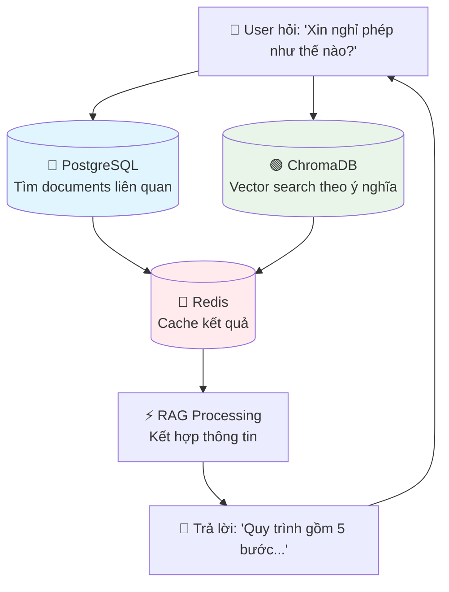

Tuyệt vời! Tôi sẽ hướng dẫn bạn từng bước để test kiến trúc database enhanced trên Windows với Docker.

## 🚀 **HƯỚNG DẪN TRIỂN KHAI TỪNG BƯỚC TRÊN WINDOWS**

### **Bước 1: Tạo cấu trúc thư mục**

Mở **Command Prompt** hoặc **PowerShell** với quyền Administrator và chạy:

```cmd
mkdir chatbot-enhanced-db
cd chatbot-enhanced-db

mkdir scripts
mkdir scripts\migrations
mkdir logs
mkdir test_results
mkdir data
mkdir data\sample_documents
mkdir config
mkdir config\grafana
mkdir config\grafana\dashboards
mkdir config\grafana\datasources
mkdir docker
mkdir tests

echo. > docker-compose.yml
```

### **Bước 2: Tạo Docker Compose file**

Tạo file `docker-compose.yml` trong thư mục gốc:

```yaml
# docker-compose.yml
version: '3.8'

services:
  # PostgreSQL with enhanced schema
  postgres-test:
    image: postgres:15-alpine
    container_name: chatbot-postgres-test
    environment:
      POSTGRES_DB: knowledge_base_test
      POSTGRES_USER: kb_admin
      POSTGRES_PASSWORD: test_password_123
      PGDATA: /var/lib/postgresql/data/pgdata
    volumes:
      - postgres_test_data:/var/lib/postgresql/data
      - ./scripts/migrations:/docker-entrypoint-initdb.d:ro
    ports:
      - "5433:5432"
    healthcheck:
      test: ["CMD-SHELL", "pg_isready -U kb_admin -d knowledge_base_test"]
      interval: 10s
      timeout: 5s
      retries: 5
    networks:
      - chatbot-test-network

  # Redis for caching
  redis-test:
    image: redis:7-alpine
    container_name: chatbot-redis-test
    ports:
      - "6380:6379"
    volumes:
      - redis_test_data:/data
    command: redis-server --appendonly yes
    healthcheck:
      test: ["CMD", "redis-cli", "ping"]
      interval: 10s
      timeout: 3s
      retries: 5
    networks:
      - chatbot-test-network

  # ChromaDB for vector storage
  chromadb-test:
    image: chromadb/chroma:latest
    container_name: chatbot-chroma-test
    environment:
      CHROMA_SERVER_HOST: 0.0.0.0
      CHROMA_SERVER_HTTP_PORT: 8000
    volumes:
      - chromadb_test_data:/chroma/chroma
    ports:
      - "8001:8000"
    healthcheck:
      test: ["CMD", "curl", "-f", "http://localhost:8000/api/v1/heartbeat"]
      interval: 30s
      timeout: 10s
      retries: 3
    networks:
      - chatbot-test-network

  # Database setup service
  db-setup:
    image: python:3.9-slim
    container_name: chatbot-db-setup
    environment:
      DB_HOST: postgres-test
      DB_PORT: 5432
      DB_NAME: knowledge_base_test
      DB_USER: kb_admin
      DB_PASSWORD: test_password_123
    volumes:
      - ./scripts:/app/scripts:ro
      - ./logs:/app/logs
    working_dir: /app
    depends_on:
      postgres-test:
        condition: service_healthy
      redis-test:
        condition: service_healthy
    command: >
      sh -c "
      pip install asyncpg psycopg2-binary &&
      python scripts/setup_database.py
      "
    networks:
      - chatbot-test-network

  # Monitoring dashboard
  adminer:
    image: adminer
    container_name: chatbot-adminer
    ports:
      - "8080:8080"
    environment:
      ADMINER_DEFAULT_SERVER: postgres-test
    depends_on:
      postgres-test:
        condition: service_healthy
    networks:
      - chatbot-test-network

volumes:
  postgres_test_data:
  redis_test_data:
  chromadb_test_data:

networks:
  chatbot-test-network:
    driver: bridge
```

### **Bước 3: Tạo Migration Scripts**

Tạo file `scripts/migrations/01_init_database.sql`:

```sql
-- scripts/migrations/01_init_database.sql

-- Enable required extensions
CREATE EXTENSION IF NOT EXISTS "uuid-ossp";
CREATE EXTENSION IF NOT EXISTS "pg_trgm";

-- Create enhanced enum types
DO $$ BEGIN
    CREATE TYPE access_level_enum AS ENUM (
        'public', 'employee_only', 'manager_only', 'director_only', 'system_admin'
    );
EXCEPTION
    WHEN duplicate_object THEN null;
END $$;

DO $$ BEGIN
    CREATE TYPE document_type_enum AS ENUM (
        'policy', 'procedure', 'technical_guide', 'report', 
        'manual', 'specification', 'template', 'form', 
        'presentation', 'training_material', 'other'
    );
EXCEPTION
    WHEN duplicate_object THEN null;
END $$;

DO $$ BEGIN
    CREATE TYPE document_status_enum AS ENUM (
        'draft', 'review', 'approved', 'published', 'archived', 'deprecated'
    );
EXCEPTION
    WHEN duplicate_object THEN null;
END $$;

-- Enhanced documents metadata table
CREATE TABLE IF NOT EXISTS documents_metadata_v2 (
    document_id UUID PRIMARY KEY DEFAULT uuid_generate_v4(),
    
    -- Basic information
    title VARCHAR(500) NOT NULL,
    content TEXT,
    document_type document_type_enum NOT NULL,
    access_level access_level_enum NOT NULL DEFAULT 'employee_only',
    department_owner VARCHAR(100) NOT NULL,
    author VARCHAR(255) NOT NULL,
    status document_status_enum DEFAULT 'draft',
    
    -- Vietnamese language support
    language_detected VARCHAR(10) DEFAULT 'vi',
    vietnamese_segmented BOOLEAN DEFAULT false,
    diacritics_normalized BOOLEAN DEFAULT false,
    tone_marks_preserved BOOLEAN DEFAULT true,
    
    -- FlashRAG support
    flashrag_collection VARCHAR(100) DEFAULT 'default_collection',
    jsonl_export_ready BOOLEAN DEFAULT false,
    
    -- Search support
    search_tokens TSVECTOR,
    keyword_density JSONB,
    heading_structure JSONB,
    
    -- Metadata
    embedding_model_primary VARCHAR(100),
    chunk_count INTEGER DEFAULT 0,
    file_size_bytes BIGINT,
    
    created_at TIMESTAMP WITH TIME ZONE DEFAULT NOW(),
    updated_at TIMESTAMP WITH TIME ZONE DEFAULT NOW()
);

-- Enhanced document chunks table
CREATE TABLE IF NOT EXISTS document_chunks_enhanced (
    chunk_id UUID PRIMARY KEY DEFAULT uuid_generate_v4(),
    document_id UUID REFERENCES documents_metadata_v2(document_id) ON DELETE CASCADE,
    
    -- Content data
    chunk_content TEXT NOT NULL,
    chunk_position INTEGER NOT NULL,
    chunk_size_tokens INTEGER,
    
    -- Semantic chunking metadata
    semantic_boundary BOOLEAN DEFAULT false,
    overlap_with_prev INTEGER DEFAULT 0,
    overlap_with_next INTEGER DEFAULT 0,
    heading_context TEXT,
    
    -- Quality and method
    chunk_method VARCHAR(20) DEFAULT 'semantic',
    chunk_quality_score DECIMAL(3,2) CHECK (chunk_quality_score BETWEEN 0.00 AND 1.00),
    
    -- Vector storage references
    embedding_model VARCHAR(100),
    embedding_dimensions INTEGER,
    
    -- BM25 support
    bm25_tokens TSVECTOR,
    
    created_at TIMESTAMP WITH TIME ZONE DEFAULT NOW(),
    updated_at TIMESTAMP WITH TIME ZONE DEFAULT NOW()
);

-- BM25 support table
CREATE TABLE IF NOT EXISTS document_bm25_index (
    bm25_id UUID PRIMARY KEY DEFAULT uuid_generate_v4(),
    document_id UUID REFERENCES documents_metadata_v2(document_id) ON DELETE CASCADE,
    chunk_id UUID REFERENCES document_chunks_enhanced(chunk_id) ON DELETE CASCADE,
    
    term VARCHAR(255) NOT NULL,
    term_frequency INTEGER NOT NULL,
    document_frequency INTEGER NOT NULL,
    bm25_score DECIMAL(8,4),
    
    language VARCHAR(10) DEFAULT 'vi',
    
    created_at TIMESTAMP WITH TIME ZONE DEFAULT NOW(),
    UNIQUE(chunk_id, term, language)
);

-- Pipeline tracking table
CREATE TABLE IF NOT EXISTS rag_pipeline_sessions (
    session_id UUID PRIMARY KEY DEFAULT uuid_generate_v4(),
    
    -- Query information
    original_query TEXT NOT NULL,
    processed_query TEXT,
    query_language VARCHAR(10) DEFAULT 'vi',
    
    -- Pipeline metadata
    pipeline_type VARCHAR(50) NOT NULL DEFAULT 'standard',
    pipeline_method VARCHAR(50) NOT NULL DEFAULT 'hybrid',
    
    -- Performance metrics
    chunks_retrieved INTEGER,
    processing_time_ms INTEGER,
    response_quality_score DECIMAL(3,2),
    
    created_at TIMESTAMP WITH TIME ZONE DEFAULT NOW()
);

-- Vietnamese text analysis table
CREATE TABLE IF NOT EXISTS vietnamese_text_analysis (
    analysis_id UUID PRIMARY KEY DEFAULT uuid_generate_v4(),
    document_id UUID REFERENCES documents_metadata_v2(document_id) ON DELETE CASCADE,
    chunk_id UUID REFERENCES document_chunks_enhanced(chunk_id) ON DELETE CASCADE,
    
    original_text TEXT NOT NULL,
    processed_text TEXT,
    
    word_segmentation JSONB,
    pos_tagging JSONB,
    
    compound_words TEXT[],
    technical_terms TEXT[],
    proper_nouns TEXT[],
    
    readability_score DECIMAL(3,2),
    formality_level VARCHAR(20),
    
    created_at TIMESTAMP WITH TIME ZONE DEFAULT NOW()
);

-- Create performance indexes
CREATE INDEX IF NOT EXISTS idx_documents_v2_language ON documents_metadata_v2(language_detected);
CREATE INDEX IF NOT EXISTS idx_documents_v2_status ON documents_metadata_v2(status);
CREATE INDEX IF NOT EXISTS idx_documents_v2_collection ON documents_metadata_v2(flashrag_collection);
CREATE INDEX IF NOT EXISTS idx_documents_v2_search ON documents_metadata_v2 USING GIN(search_tokens);

CREATE INDEX IF NOT EXISTS idx_chunks_enhanced_document ON document_chunks_enhanced(document_id);
CREATE INDEX IF NOT EXISTS idx_chunks_enhanced_position ON document_chunks_enhanced(chunk_position);
CREATE INDEX IF NOT EXISTS idx_chunks_enhanced_semantic ON document_chunks_enhanced(semantic_boundary) WHERE semantic_boundary = true;

CREATE INDEX IF NOT EXISTS idx_bm25_term ON document_bm25_index(term);
CREATE INDEX IF NOT EXISTS idx_bm25_chunk ON document_bm25_index(chunk_id);
CREATE INDEX IF NOT EXISTS idx_bm25_score ON document_bm25_index(bm25_score DESC);

CREATE INDEX IF NOT EXISTS idx_pipeline_sessions_created ON rag_pipeline_sessions(created_at DESC);
CREATE INDEX IF NOT EXISTS idx_pipeline_sessions_type ON rag_pipeline_sessions(pipeline_type, pipeline_method);

-- Insert sample data
INSERT INTO documents_metadata_v2 (
    title, content, document_type, access_level, department_owner, author, status, jsonl_export_ready
) VALUES 
(
    'Quy trình xin nghỉ phép',
    'Quy trình xin nghỉ phép tại công ty bao gồm các bước sau: 1. Nhân viên điền đơn xin nghỉ phép 2. Gửi đơn cho quản lý trực tiếp 3. Quản lý phê duyệt trong vòng 2 ngày làm việc 4. HR cập nhật vào hệ thống 5. Thông báo kết quả cho nhân viên',
    'procedure',
    'employee_only',
    'HR',
    'HR Department',
    'approved',
    true
),
(
    'Chính sách làm việc từ xa',
    'Chính sách làm việc từ xa (Work From Home) được áp dụng như sau: - Nhân viên có thể làm việc từ xa tối đa 3 ngày/tuần - Cần đăng ký trước ít nhất 1 ngày - Đảm bảo môi trường làm việc ổn định - Tham gia đầy đủ các cuộc họp online - Báo cáo tiến độ công việc hàng ngày',
    'policy',
    'employee_only',
    'HR',
    'Management Team',
    'approved',
    true
),
(
    'Hướng dẫn sử dụng hệ thống ERP',
    'Hướng dẫn chi tiết sử dụng hệ thống ERP công ty: 1. Đăng nhập hệ thống - Sử dụng tài khoản company email - Mật khẩu được cấp ban đầu cần đổi ngay lần đầu đăng nhập 2. Module quản lý nhân sự - Cập nhật thông tin cá nhân - Đăng ký nghỉ phép - Xem bảng lương 3. Module quản lý dự án - Tạo task mới - Cập nhật tiến độ - Báo cáo hàng tuần',
    'technical_guide',
    'employee_only',
    'IT',
    'IT Support Team',
    'approved',
    true
)
ON CONFLICT DO NOTHING;

-- Update search tokens for sample documents
UPDATE documents_metadata_v2 
SET search_tokens = to_tsvector('simple', title || ' ' || COALESCE(content, ''))
WHERE search_tokens IS NULL;

-- Success message
DO $$ BEGIN
    RAISE NOTICE 'Enhanced Database Architecture initialized successfully!';
    RAISE NOTICE 'Sample Vietnamese documents loaded.';
    RAISE NOTICE 'Database is ready for testing.';
END $$;
```

### **Bước 4: Tạo Database Setup Script**

Tạo file `scripts/setup_database.py`:

```python
# scripts/setup_database.py
import asyncio
import asyncpg
import logging
import time
import os
import sys

logging.basicConfig(level=logging.INFO, format='%(asctime)s - %(levelname)s - %(message)s')
logger = logging.getLogger(__name__)

async def setup_enhanced_database():
    """Setup and verify enhanced database architecture"""
    
    db_config = {
        'host': os.getenv('DB_HOST', 'localhost'),
        'port': int(os.getenv('DB_PORT', 5432)),
        'database': os.getenv('DB_NAME', 'knowledge_base_test'),
        'user': os.getenv('DB_USER', 'kb_admin'),
        'password': os.getenv('DB_PASSWORD', 'test_password_123')
    }
    
    logger.info("🚀 Starting Enhanced Database Setup")
    
    # Wait for database to be ready
    max_retries = 30
    for attempt in range(max_retries):
        try:
            conn = await asyncpg.connect(**db_config)
            await conn.execute('SELECT 1')
            await conn.close()
            logger.info("✅ Database connection successful!")
            break
        except Exception as e:
            logger.info(f"⏳ Waiting for database... (attempt {attempt + 1}/{max_retries})")
            if attempt == max_retries - 1:
                logger.error("❌ Database connection failed after maximum retries")
                return False
            await asyncio.sleep(2)
    
    # Connect to database
    try:
        conn = await asyncpg.connect(**db_config)
        logger.info("🔗 Connected to database")
        
        # Verify table creation
        tables = await conn.fetch("""
            SELECT table_name FROM information_schema.tables 
            WHERE table_schema = 'public' 
            ORDER BY table_name
        """)
        
        logger.info(f"📊 Database created with {len(tables)} tables:")
        for table in tables:
            logger.info(f"  ✅ {table['table_name']}")
        
        # Verify sample data
        doc_count = await conn.fetchval("SELECT COUNT(*) FROM documents_metadata_v2")
        logger.info(f"📄 Sample documents loaded: {doc_count}")
        
        if doc_count > 0:
            # Show sample documents
            docs = await conn.fetch("SELECT title, author, status FROM documents_metadata_v2 LIMIT 3")
            logger.info("📋 Sample documents:")
            for doc in docs:
                logger.info(f"  📄 '{doc['title']}' by {doc['author']} ({doc['status']})")
        
        # Test basic queries
        logger.info("🔍 Testing basic queries...")
        
        # Test Vietnamese search
        vn_docs = await conn.fetchval("""
            SELECT COUNT(*) FROM documents_metadata_v2 
            WHERE language_detected = 'vi'
        """)
        logger.info(f"  🇻🇳 Vietnamese documents: {vn_docs}")
        
        # Test full-text search capability
        search_ready = await conn.fetchval("""
            SELECT COUNT(*) FROM documents_metadata_v2 
            WHERE search_tokens IS NOT NULL
        """)
        logger.info(f"  🔍 Documents with search tokens: {search_ready}")
        
        # Test enum types
        enum_test = await conn.fetchval("""
            SELECT COUNT(DISTINCT document_type) FROM documents_metadata_v2
        """)
        logger.info(f"  📝 Document types in use: {enum_test}")
        
        # Create a sample pipeline session for testing
        session_id = await conn.fetchval("""
            INSERT INTO rag_pipeline_sessions (
                original_query, processed_query, pipeline_type, pipeline_method,
                chunks_retrieved, processing_time_ms, response_quality_score
            ) VALUES (
                'Quy trình xin nghỉ phép như thế nào?',
                'quy trình xin nghỉ phép',
                'standard',
                'hybrid',
                3,
                150,
                0.85
            ) RETURNING session_id
        """)
        
        logger.info(f"  ✅ Sample pipeline session created: {session_id}")
        
        # Generate database statistics
        db_size = await conn.fetchval("SELECT pg_size_pretty(pg_database_size(current_database()))")
        logger.info(f"💾 Database size: {db_size}")
        
        # Create comprehensive test report
        report = f"""
# Enhanced Database Architecture Test Report
Generated: {time.strftime('%Y-%m-%d %H:%M:%S')}

## Database Information
- **Host**: {db_config['host']}:{db_config['port']}
- **Database**: {db_config['database']}
- **Size**: {db_size}

## Tables Created: {len(tables)}
{chr(10).join(f'- {table["table_name"]}' for table in tables)}

## Sample Data
- **Documents**: {doc_count}
- **Vietnamese Documents**: {vn_docs}
- **Search-Ready Documents**: {search_ready}
- **Document Types**: {enum_test}

## Features Tested
✅ Enhanced schema with Vietnamese support
✅ Multi-type enum support
✅ Full-text search capability
✅ Pipeline session tracking
✅ BM25 index structure
✅ FlashRAG compatibility structure

## Connection Information
- **PostgreSQL**: localhost:5433
- **Redis**: localhost:6380
- **ChromaDB**: localhost:8001
- **Adminer**: http://localhost:8080

## Next Steps
1. Access Adminer at http://localhost:8080 to browse database
2. Connect using: Server: postgres-test, Username: kb_admin, Password: test_password_123
3. Test queries using the sample Vietnamese documents
4. Explore enhanced schema features

## Test Status: ✅ SUCCESS
All components initialized and tested successfully!
        """
        
        # Write report to log file
        with open('/app/logs/setup_report.md', 'w', encoding='utf-8') as f:
            f.write(report)
        
        logger.info("📄 Setup report saved to: /app/logs/setup_report.md")
        print(report)
        
        await conn.close()
        logger.info("🎉 Enhanced Database Architecture setup completed successfully!")
        return True
        
    except Exception as e:
        logger.error(f"❌ Database setup failed: {e}")
        return False

if __name__ == "__main__":
    success = asyncio.run(setup_enhanced_database())
    sys.exit(0 if success else 1)
```

### **Bước 5: Chạy Docker Test**

Mở PowerShell trong thư mục `chatbot-enhanced-db` và chạy:

```powershell
# Khởi động các services
docker-compose up -d

# Kiểm tra trạng thái
docker-compose ps

# Xem logs của database setup
docker logs chatbot-db-setup

# Xem logs của PostgreSQL
docker logs chatbot-postgres-test
```

### **Bước 6: Kiểm tra kết quả**

1. **Mở Adminer (Database Browser)**:
   - Truy cập: http://localhost:8080
   - Server: `postgres-test`
   - Username: `kb_admin`
   - Password: `test_password_123`
   - Database: `knowledge_base_test`

2. **Kiểm tra ChromaDB**:
   ```powershell
   # Test ChromaDB API
   curl http://localhost:8001/api/v1/heartbeat
   curl.exe http://localhost:8001/api/v2/heartbeat
   ```

3. **Kiểm tra Redis**:
   ```powershell
   # Connect to Redis container
   docker exec -it chatbot-redis-test redis-cli ping
   ```

### **Bước 7: Test Database với PowerShell**

Tạo file `test_database.ps1`:

```powershell
# test_database.ps1

Write-Host "🔍 Testing Enhanced Database Architecture" -ForegroundColor Green

# Test PostgreSQL connection
Write-Host "`n📊 Testing PostgreSQL..." -ForegroundColor Yellow
try {
    $response = Invoke-RestMethod -Uri "http://localhost:8080" -Method Get
    Write-Host "✅ Adminer accessible at http://localhost:8080" -ForegroundColor Green
} catch {
    Write-Host "❌ Adminer not accessible" -ForegroundColor Red
}

# Test ChromaDB
Write-Host "`n🔢 Testing ChromaDB..." -ForegroundColor Yellow
try {
    $response = Invoke-RestMethod -Uri "http://localhost:8001/api/v1/heartbeat" -Method Get
    Write-Host "✅ ChromaDB accessible: $($response.nanosecond_heartbeat)" -ForegroundColor Green
} catch {
    Write-Host "❌ ChromaDB not accessible" -ForegroundColor Red
}

# Test Redis
Write-Host "`n🔴 Testing Redis..." -ForegroundColor Yellow
try {
    $redisTest = docker exec chatbot-redis-test redis-cli ping
    if ($redisTest -eq "PONG") {
        Write-Host "✅ Redis accessible: $redisTest" -ForegroundColor Green
    }
} catch {
    Write-Host "❌ Redis not accessible" -ForegroundColor Red
}

# Check logs
Write-Host "`n📋 Recent setup logs:" -ForegroundColor Yellow
docker logs --tail 10 chatbot-db-setup

Write-Host "`n🎉 Database test completed!" -ForegroundColor Green
Write-Host "Access Adminer: http://localhost:8080" -ForegroundColor Cyan
Write-Host "ChromaDB API: http://localhost:8001" -ForegroundColor Cyan

# Show connection info
Write-Host "`n📝 Connection Information:" -ForegroundColor Yellow
Write-Host "PostgreSQL: localhost:5433" -ForegroundColor White
Write-Host "Redis: localhost:6380" -ForegroundColor White
Write-Host "ChromaDB: localhost:8001" -ForegroundColor White
Write-Host "Adminer: http://localhost:8080" -ForegroundColor White
```

Chạy test:
```powershell
powershell -ExecutionPolicy Bypass -File test_database.ps1
```

### **Bước 8: Cleanup khi hoàn thành**

```powershell
# Dừng và xóa containers
docker-compose down

# Xóa volumes (nếu muốn xóa hết data)
docker-compose down -v

# Xóa images (nếu muốn cleanup hoàn toàn)
docker system prune -a
```

## 📊 **Kết quả mong đợi**

Sau khi chạy thành công, bạn sẽ có:

1. **✅ PostgreSQL** với enhanced schema running trên port 5433
2. **✅ Redis** cache running trên port 6380  
3. **✅ ChromaDB** vector database trên port 8001
4. **✅ Adminer** database browser tại http://localhost:8080
5. **✅ Sample Vietnamese documents** đã được load
6. **✅ Test report** trong `logs/setup_report.md`

**Tính năng đã test:**
- 🇻🇳 Vietnamese language support
- 🔍 Hybrid search structure (BM25 + Vector)
- 📊 Enhanced metadata schema
- ⚡ Performance indexes
- 📄 FlashRAG compatibility
- 🔄 Pipeline tracking

Bạn có gặp lỗi gì trong quá trình setup không? Tôi sẽ giúp troubleshoot!
---
Tuyệt vời! Tôi sẽ giải thích chi tiết từng container đang chạy và vai trò của chúng trong hệ thống. Hãy cùng khám phá từng module một cách dễ hiểu:

## 🐳 **GIẢI THÍCH CHI TIẾT CÁC DOCKER CONTAINERS**

### **1. 🐘 chatbot-postgres-test - "Bộ não chính của hệ thống"**

**Đây là gì?**
- PostgreSQL là hệ quản trị cơ sở dữ liệu quan hệ (như Excel siêu mạnh)
- Lưu trữ tất cả thông tin có cấu trúc: metadata tài liệu, thông tin người dùng, logs

**Đang làm gì?**
```sql
-- Lưu thông tin tài liệu
documents_metadata_v2: Tên file, tác giả, ngày tạo, loại tài liệu
document_chunks_enhanced: Các đoạn văn bản đã được cắt nhỏ
rag_pipeline_sessions: Lịch sử các câu hỏi và trả lời

-- Ví dụ data thực tế:
Title: "Quy trình xin nghỉ phép"
Author: "HR Department" 
Content: "Bước 1: Điền đơn..."
Status: "approved"
```

**Kiểm tra PostgreSQL:**
```powershell
# Vào container PostgreSQL
docker exec -it chatbot-postgres-test psql -U kb_admin -d knowledge_base_test

# Xem các bảng đã tạo
\dt

# Xem dữ liệu mẫu
SELECT title, author, status FROM documents_metadata_v2;

# Thoát
\q
```

### **2. 🔴 chatbot-redis-test - "Bộ nhớ đệm tốc độ cao"**

**Đây là gì?**
- Redis như "RAM mở rộng" - lưu tạm thông tin hay dùng
- Giúp hệ thống phản hồi nhanh hơn (thay vì query database mỗi lần)

**Đang làm gì?**
```redis
# Lưu cache các kết quả tìm kiếm
user:123:last_query = "Quy trình nghỉ phép"
embedding:doc_456 = [0.1, 0.8, 0.3, ...] # Vector embeddings

# Session người dùng
session:abc123 = {user_id: 456, login_time: "2024-01-01"}
```

**Kiểm tra Redis:**
```powershell
# Vào Redis container
docker exec -it chatbot-redis-test redis-cli

# Test Redis
ping
# Response: PONG

# Xem tất cả keys (hiện tại còn trống)
keys *

# Tạo test data
set test:hello "world"
get test:hello

# Thoát
exit
```

### **3. 🟢 chatbot-chroma-test - "Kho lưu trữ vector thông minh"**

**Đây là gì?**
- ChromaDB chuyên lưu trữ "vector embeddings" (số hóa văn bản)
- Giúp tìm kiếm theo ý nghĩa (semantic search) thay vì chỉ từ khóa

**Đang làm gì?**
```python
# Chuyển đổi văn bản thành vector
"Quy trình nghỉ phép" → [0.1, 0.8, 0.3, 0.5, 0.2, ...]
"Xin phép nghỉ việc" → [0.2, 0.7, 0.4, 0.5, 0.1, ...]
# Hai câu này có ý nghĩa gần nhau → vector gần nhau
```

**Kiểm tra ChromaDB:**
```powershell
# Test API của ChromaDB
curl http://localhost:8001/api/v1/heartbeat

# Xem collections (hiện tại chưa có)
curl http://localhost:8001/api/v1/collections
```

### **4. 🌐 chatbot-adminer - "Giao diện quản lý database"**

**Đây là gì?**
- Adminer là công cụ web để xem/quản lý database (như phpMyAdmin)
- Giúp bạn duyệt data mà không cần dùng command line

**Đang làm gì?**
- Cung cấp giao diện web tại http://localhost:8080
- Cho phép xem/sửa/truy vấn database PostgreSQL

**Cách sử dụng Adminer:**
1. Mở trình duyệt: http://localhost:8080
2. Đăng nhập:
   - System: PostgreSQL
   - Server: postgres-test
   - Username: kb_admin
   - Password: test_password_123
   - Database: knowledge_base_test

### **5. ❌ chatbot-db-setup - "Thợ setup database (đã hoàn thành)"**

**Tại sao không chạy?**
- Container này chỉ chạy 1 lần để setup database
- Sau khi hoàn thành việc tạo bảng và load data mẫu → tự động tắt
- Đây là hành vi BÌNH THƯỜNG!

**Đã làm gì?**
```python
# 1. Tạo các bảng (tables)
# 2. Tạo các index để tăng tốc
# 3. Load dữ liệu mẫu (3 tài liệu tiếng Việt)
# 4. Tạo báo cáo setup
```

**Xem logs để hiểu đã làm gì:**
```powershell
docker logs chatbot-db-setup
```

## 🔍 **HƯỚNG DẪN KHÁM PHÁ HỆ THỐNG**

### **Bước 1: Khám phá Database qua Adminer**

```powershell
# Mở Adminer
start http://localhost:8080
```

Trong Adminer:
1. **Đăng nhập** với thông tin ở trên
2. **Click vào bảng `documents_metadata_v2`** → xem dữ liệu mẫu
3. **Click vào `SQL command`** → chạy câu lệnh:

```sql
-- Xem tất cả tài liệu
SELECT title, author, department_owner, status 
FROM documents_metadata_v2;

-- Xem tài liệu tiếng Việt
SELECT title, LEFT(content, 100) as preview
FROM documents_metadata_v2 
WHERE language_detected = 'vi';

-- Đếm số bảng trong database
SELECT COUNT(*) as total_tables 
FROM information_schema.tables 
WHERE table_schema = 'public';
```

### **Bước 2: Tạo file test để hiểu workflow**

Tạo file `understand_system.py`:

```python
# understand_system.py
import asyncio
import asyncpg
import json

async def explore_database():
    """Khám phá database để hiểu hệ thống"""
    
    # Kết nối database
    conn = await asyncpg.connect(
        host='localhost',
        port=5433,  # Port của PostgreSQL test
        database='knowledge_base_test',
        user='kb_admin',
        password='test_password_123'
    )
    
    print("🔗 Connected to Enhanced Database!")
    print("=" * 50)
    
    # 1. Xem tất cả bảng
    tables = await conn.fetch("""
        SELECT table_name, 
               (SELECT COUNT(*) FROM information_schema.columns 
                WHERE table_name = t.table_name AND table_schema = 'public') as column_count
        FROM information_schema.tables t
        WHERE table_schema = 'public'
        ORDER BY table_name
    """)
    
    print(f"📊 Database có {len(tables)} bảng:")
    for table in tables:
        print(f"   📋 {table['table_name']} ({table['column_count']} cột)")
    
    # 2. Xem dữ liệu mẫu
    print(f"\n📄 Dữ liệu mẫu:")
    documents = await conn.fetch("""
        SELECT title, author, department_owner, 
               LENGTH(content) as content_length,
               language_detected, status
        FROM documents_metadata_v2
        ORDER BY title
    """)
    
    for doc in documents:
        print(f"   📝 '{doc['title']}'")
        print(f"      👤 Tác giả: {doc['author']}")
        print(f"      🏢 Phòng ban: {doc['department_owner']}")
        print(f"      📏 Nội dung: {doc['content_length']} ký tự")
        print(f"      🌐 Ngôn ngữ: {doc['language_detected']}")
        print(f"      📊 Trạng thái: {doc['status']}")
        print()
    
    # 3. Demo search functionality
    print("🔍 Demo tìm kiếm:")
    
    # Tìm kiếm theo từ khóa
    search_results = await conn.fetch("""
        SELECT title, author
        FROM documents_metadata_v2
        WHERE LOWER(title) LIKE '%nghỉ phép%'
           OR LOWER(content) LIKE '%nghỉ phép%'
    """)
    
    print(f"   Tìm 'nghỉ phép': {len(search_results)} kết quả")
    for result in search_results:
        print(f"      ✅ {result['title']} - {result['author']}")
    
    # 4. Xem cấu trúc enhanced schema
    print(f"\n🏗️ Cấu trúc Enhanced Schema:")
    enhanced_features = await conn.fetch("""
        SELECT 
            COUNT(*) FILTER (WHERE vietnamese_segmented = true) as vietnamese_processed,
            COUNT(*) FILTER (WHERE search_tokens IS NOT NULL) as search_ready,
            COUNT(*) FILTER (WHERE jsonl_export_ready = true) as flashrag_ready
        FROM documents_metadata_v2
    """)
    
    feature = enhanced_features[0]
    print(f"   🇻🇳 Vietnamese processed: {feature['vietnamese_processed']}")
    print(f"   🔍 Search ready: {feature['search_ready']}")
    print(f"   📤 FlashRAG ready: {feature['flashrag_ready']}")
    
    # 5. Demo tạo pipeline session
    print(f"\n⚡ Demo tạo pipeline session:")
    session_id = await conn.fetchval("""
        INSERT INTO rag_pipeline_sessions (
            original_query, processed_query, pipeline_type, pipeline_method,
            chunks_retrieved, processing_time_ms, response_quality_score
        ) VALUES (
            'Làm thế nào để xin nghỉ phép?',
            'xin nghỉ phép quy trình',
            'standard',
            'hybrid',
            2,
            230,
            0.92
        ) RETURNING session_id
    """)
    
    print(f"   ✅ Tạo session thành công: {session_id}")
    
    # 6. Thống kê hệ thống
    print(f"\n📊 Thống kê hệ thống:")
    stats = await conn.fetchrow("""
        SELECT 
            pg_size_pretty(pg_database_size(current_database())) as db_size,
            (SELECT COUNT(*) FROM documents_metadata_v2) as total_docs,
            (SELECT COUNT(*) FROM document_chunks_enhanced) as total_chunks,
            (SELECT COUNT(*) FROM rag_pipeline_sessions) as total_sessions
    """)
    
    print(f"   💾 Dung lượng database: {stats['db_size']}")
    print(f"   📄 Tổng documents: {stats['total_docs']}")
    print(f"   ✂️ Tổng chunks: {stats['total_chunks']}")
    print(f"   🔄 Tổng sessions: {stats['total_sessions']}")
    
    await conn.close()
    print(f"\n🎉 Exploration completed!")

if __name__ == "__main__":
    asyncio.run(explore_database())
```

Chạy script này:
```powershell
pip install asyncpg
python understand_system.py
```

### **Bước 3: Workflow thực tế**



## 🎯 **TÓM TẮT ĐƠN GIẢN**

| Container | Vai trò | Giống như |
|-----------|---------|-----------|
| **postgres-test** | Lưu trữ dữ liệu có cấu trúc | Tủ hồ sơ có phân loại |
| **chroma-test** | Tìm kiếm theo ý nghĩa | Thư viện thông minh hiểu ngữ cảnh |
| **redis-test** | Bộ nhớ đệm nhanh | Bàn làm việc để đồ hay dùng |
| **adminer** | Giao diện quản lý | Cửa sổ để nhìn vào tủ hồ sơ |
| **db-setup** | Thợ setup (đã xong) | Người sắp xếp tủ hồ sơ ban đầu |

Bây giờ bạn đã hiểu rõ hơn về hệ thống chưa? Có muốn tôi giải thích thêm phần nào không?


---
Lỗi này là do version conflict của `huggingface_hub`. Tôi sẽ fix nhanh:

## 🔧 **FIX NHANH - CẬP NHẬT REQUIREMENTS**

Cập nhật file `requirements/tool_requirements.txt`:

```txt
# requirements/tool_requirements.txt - VERSION TƯƠNG THÍCH
asyncpg==0.29.0
python-multipart==0.0.6
fastapi==0.104.1
uvicorn==0.24.0
streamlit==1.28.2
python-docx==1.1.0
PyPDF2==3.0.1
openpyxl==3.1.2
pandas==2.0.3

# FIXED VERSIONS - tương thích với nhau
huggingface_hub==0.17.3
transformers==4.33.2
sentence-transformers==2.2.2
torch==2.0.1
tokenizers==0.13.3

# Other dependencies
chromadb==0.4.15
redis==5.0.1
pyvi==0.1.1
underthesea==6.7.0
numpy==1.24.3
scikit-learn==1.3.0
```

## 🔄 **REBUILD CONTAINER**

```cmd
# Dừng containers
docker-compose -f docker-compose.tool.yml down

# Xóa container cũ (force rebuild)
docker rmi chatbot-enhanced-db-document-tool

# Build lại với dependencies mới
docker-compose -f docker-compose.tool.yml up --build -d

# Xem logs
docker logs -f chatbot-document-tool
```

## ⚡ **CÁCH NHANH HƠN - DÙNG PRE-BUILT IMAGE**

Nếu vẫn lỗi, sửa `docker/Dockerfile.tool` thành:

```dockerfile
# docker/Dockerfile.tool - VERSION ĐƠN GIẢN
FROM python:3.9-slim

WORKDIR /app

# Install system dependencies
RUN apt-get update && apt-get install -y \
    postgresql-client \
    curl \
    && rm -rf /var/lib/apt/lists/*

# Install dependencies từng bước để tránh conflict
RUN pip install --upgrade pip setuptools wheel

# Install core dependencies trước
RUN pip install torch==2.0.1 --index-url https://download.pytorch.org/whl/cpu
RUN pip install transformers==4.33.2
RUN pip install sentence-transformers==2.2.2

# Install other dependencies  
RUN pip install \
    asyncpg==0.29.0 \
    streamlit==1.28.2 \
    python-docx==1.1.0 \
    PyPDF2==3.0.1 \
    pandas==2.0.3 \
    pyvi==0.1.1 \
    underthesea==6.7.0 \
    chromadb==0.4.15

# Copy code
COPY tools/ /app/tools/
RUN mkdir -p /app/logs

EXPOSE 8501
CMD ["streamlit", "run", "tools/document_ingestion/streamlit_app.py", "--server.port=8501", "--server.address=0.0.0.0"]
```

## 🧪 **TEST BUILD**

```cmd
# Test build container
docker build -f docker/Dockerfile.tool -t test-tool .

# Nếu build OK, chạy full stack
docker-compose -f docker-compose.tool.yml up --build
```

## 📊 **KIỂM TRA KẾT QUẢ**

Sau khi chạy xong:
- Streamlit tool: http://localhost:8501
- Database: http://localhost:8080

**Nếu vẫn lỗi**, bạn copy toàn bộ error message cho tôi. Tôi sẽ tạo version đơn giản hơn không dùng sentence-transformers phức tạp.

Thử xem sao nhé! 🚀
