Tuyệt vời! Tôi sẽ hướng dẫn bạn từng bước để test kiến trúc database enhanced trên Windows với Docker.

## 🚀 **HƯỚNG DẪN TRIỂN KHAI TỪNG BƯỚC TRÊN WINDOWS**

### **Bước 1: Tạo cấu trúc thư mục**

Mở **Command Prompt** hoặc **PowerShell** với quyền Administrator và chạy:

```cmd
mkdir chatbot-enhanced-db
cd chatbot-enhanced-db

mkdir scripts
mkdir scripts\migrations
mkdir logs
mkdir test_results
mkdir data
mkdir data\sample_documents
mkdir config
mkdir config\grafana
mkdir config\grafana\dashboards
mkdir config\grafana\datasources
mkdir docker
mkdir tests

echo. > docker-compose.yml
```

### **Bước 2: Tạo Docker Compose file**

Tạo file `docker-compose.yml` trong thư mục gốc:

```yaml
# docker-compose.yml
version: '3.8'

services:
  # PostgreSQL with enhanced schema
  postgres-test:
    image: postgres:15-alpine
    container_name: chatbot-postgres-test
    environment:
      POSTGRES_DB: knowledge_base_test
      POSTGRES_USER: kb_admin
      POSTGRES_PASSWORD: test_password_123
      PGDATA: /var/lib/postgresql/data/pgdata
    volumes:
      - postgres_test_data:/var/lib/postgresql/data
      - ./scripts/migrations:/docker-entrypoint-initdb.d:ro
    ports:
      - "5433:5432"
    healthcheck:
      test: ["CMD-SHELL", "pg_isready -U kb_admin -d knowledge_base_test"]
      interval: 10s
      timeout: 5s
      retries: 5
    networks:
      - chatbot-test-network

  # Redis for caching
  redis-test:
    image: redis:7-alpine
    container_name: chatbot-redis-test
    ports:
      - "6380:6379"
    volumes:
      - redis_test_data:/data
    command: redis-server --appendonly yes
    healthcheck:
      test: ["CMD", "redis-cli", "ping"]
      interval: 10s
      timeout: 3s
      retries: 5
    networks:
      - chatbot-test-network

  # ChromaDB for vector storage
  chromadb-test:
    image: chromadb/chroma:latest
    container_name: chatbot-chroma-test
    environment:
      CHROMA_SERVER_HOST: 0.0.0.0
      CHROMA_SERVER_HTTP_PORT: 8000
    volumes:
      - chromadb_test_data:/chroma/chroma
    ports:
      - "8001:8000"
    healthcheck:
      test: ["CMD", "curl", "-f", "http://localhost:8000/api/v1/heartbeat"]
      interval: 30s
      timeout: 10s
      retries: 3
    networks:
      - chatbot-test-network

  # Database setup service
  db-setup:
    image: python:3.9-slim
    container_name: chatbot-db-setup
    environment:
      DB_HOST: postgres-test
      DB_PORT: 5432
      DB_NAME: knowledge_base_test
      DB_USER: kb_admin
      DB_PASSWORD: test_password_123
    volumes:
      - ./scripts:/app/scripts:ro
      - ./logs:/app/logs
    working_dir: /app
    depends_on:
      postgres-test:
        condition: service_healthy
      redis-test:
        condition: service_healthy
    command: >
      sh -c "
      pip install asyncpg psycopg2-binary &&
      python scripts/setup_database.py
      "
    networks:
      - chatbot-test-network

  # Monitoring dashboard
  adminer:
    image: adminer
    container_name: chatbot-adminer
    ports:
      - "8080:8080"
    environment:
      ADMINER_DEFAULT_SERVER: postgres-test
    depends_on:
      postgres-test:
        condition: service_healthy
    networks:
      - chatbot-test-network

volumes:
  postgres_test_data:
  redis_test_data:
  chromadb_test_data:

networks:
  chatbot-test-network:
    driver: bridge
```

### **Bước 3: Tạo Migration Scripts**

Tạo file `scripts/migrations/01_init_database.sql`:

```sql
-- scripts/migrations/01_init_database.sql

-- Enable required extensions
CREATE EXTENSION IF NOT EXISTS "uuid-ossp";
CREATE EXTENSION IF NOT EXISTS "pg_trgm";

-- Create enhanced enum types
DO $$ BEGIN
    CREATE TYPE access_level_enum AS ENUM (
        'public', 'employee_only', 'manager_only', 'director_only', 'system_admin'
    );
EXCEPTION
    WHEN duplicate_object THEN null;
END $$;

DO $$ BEGIN
    CREATE TYPE document_type_enum AS ENUM (
        'policy', 'procedure', 'technical_guide', 'report', 
        'manual', 'specification', 'template', 'form', 
        'presentation', 'training_material', 'other'
    );
EXCEPTION
    WHEN duplicate_object THEN null;
END $$;

DO $$ BEGIN
    CREATE TYPE document_status_enum AS ENUM (
        'draft', 'review', 'approved', 'published', 'archived', 'deprecated'
    );
EXCEPTION
    WHEN duplicate_object THEN null;
END $$;

-- Enhanced documents metadata table
CREATE TABLE IF NOT EXISTS documents_metadata_v2 (
    document_id UUID PRIMARY KEY DEFAULT uuid_generate_v4(),
    
    -- Basic information
    title VARCHAR(500) NOT NULL,
    content TEXT,
    document_type document_type_enum NOT NULL,
    access_level access_level_enum NOT NULL DEFAULT 'employee_only',
    department_owner VARCHAR(100) NOT NULL,
    author VARCHAR(255) NOT NULL,
    status document_status_enum DEFAULT 'draft',
    
    -- Vietnamese language support
    language_detected VARCHAR(10) DEFAULT 'vi',
    vietnamese_segmented BOOLEAN DEFAULT false,
    diacritics_normalized BOOLEAN DEFAULT false,
    tone_marks_preserved BOOLEAN DEFAULT true,
    
    -- FlashRAG support
    flashrag_collection VARCHAR(100) DEFAULT 'default_collection',
    jsonl_export_ready BOOLEAN DEFAULT false,
    
    -- Search support
    search_tokens TSVECTOR,
    keyword_density JSONB,
    heading_structure JSONB,
    
    -- Metadata
    embedding_model_primary VARCHAR(100),
    chunk_count INTEGER DEFAULT 0,
    file_size_bytes BIGINT,
    
    created_at TIMESTAMP WITH TIME ZONE DEFAULT NOW(),
    updated_at TIMESTAMP WITH TIME ZONE DEFAULT NOW()
);

-- Enhanced document chunks table
CREATE TABLE IF NOT EXISTS document_chunks_enhanced (
    chunk_id UUID PRIMARY KEY DEFAULT uuid_generate_v4(),
    document_id UUID REFERENCES documents_metadata_v2(document_id) ON DELETE CASCADE,
    
    -- Content data
    chunk_content TEXT NOT NULL,
    chunk_position INTEGER NOT NULL,
    chunk_size_tokens INTEGER,
    
    -- Semantic chunking metadata
    semantic_boundary BOOLEAN DEFAULT false,
    overlap_with_prev INTEGER DEFAULT 0,
    overlap_with_next INTEGER DEFAULT 0,
    heading_context TEXT,
    
    -- Quality and method
    chunk_method VARCHAR(20) DEFAULT 'semantic',
    chunk_quality_score DECIMAL(3,2) CHECK (chunk_quality_score BETWEEN 0.00 AND 1.00),
    
    -- Vector storage references
    embedding_model VARCHAR(100),
    embedding_dimensions INTEGER,
    
    -- BM25 support
    bm25_tokens TSVECTOR,
    
    created_at TIMESTAMP WITH TIME ZONE DEFAULT NOW(),
    updated_at TIMESTAMP WITH TIME ZONE DEFAULT NOW()
);

-- BM25 support table
CREATE TABLE IF NOT EXISTS document_bm25_index (
    bm25_id UUID PRIMARY KEY DEFAULT uuid_generate_v4(),
    document_id UUID REFERENCES documents_metadata_v2(document_id) ON DELETE CASCADE,
    chunk_id UUID REFERENCES document_chunks_enhanced(chunk_id) ON DELETE CASCADE,
    
    term VARCHAR(255) NOT NULL,
    term_frequency INTEGER NOT NULL,
    document_frequency INTEGER NOT NULL,
    bm25_score DECIMAL(8,4),
    
    language VARCHAR(10) DEFAULT 'vi',
    
    created_at TIMESTAMP WITH TIME ZONE DEFAULT NOW(),
    UNIQUE(chunk_id, term, language)
);

-- Pipeline tracking table
CREATE TABLE IF NOT EXISTS rag_pipeline_sessions (
    session_id UUID PRIMARY KEY DEFAULT uuid_generate_v4(),
    
    -- Query information
    original_query TEXT NOT NULL,
    processed_query TEXT,
    query_language VARCHAR(10) DEFAULT 'vi',
    
    -- Pipeline metadata
    pipeline_type VARCHAR(50) NOT NULL DEFAULT 'standard',
    pipeline_method VARCHAR(50) NOT NULL DEFAULT 'hybrid',
    
    -- Performance metrics
    chunks_retrieved INTEGER,
    processing_time_ms INTEGER,
    response_quality_score DECIMAL(3,2),
    
    created_at TIMESTAMP WITH TIME ZONE DEFAULT NOW()
);

-- Vietnamese text analysis table
CREATE TABLE IF NOT EXISTS vietnamese_text_analysis (
    analysis_id UUID PRIMARY KEY DEFAULT uuid_generate_v4(),
    document_id UUID REFERENCES documents_metadata_v2(document_id) ON DELETE CASCADE,
    chunk_id UUID REFERENCES document_chunks_enhanced(chunk_id) ON DELETE CASCADE,
    
    original_text TEXT NOT NULL,
    processed_text TEXT,
    
    word_segmentation JSONB,
    pos_tagging JSONB,
    
    compound_words TEXT[],
    technical_terms TEXT[],
    proper_nouns TEXT[],
    
    readability_score DECIMAL(3,2),
    formality_level VARCHAR(20),
    
    created_at TIMESTAMP WITH TIME ZONE DEFAULT NOW()
);

-- Create performance indexes
CREATE INDEX IF NOT EXISTS idx_documents_v2_language ON documents_metadata_v2(language_detected);
CREATE INDEX IF NOT EXISTS idx_documents_v2_status ON documents_metadata_v2(status);
CREATE INDEX IF NOT EXISTS idx_documents_v2_collection ON documents_metadata_v2(flashrag_collection);
CREATE INDEX IF NOT EXISTS idx_documents_v2_search ON documents_metadata_v2 USING GIN(search_tokens);

CREATE INDEX IF NOT EXISTS idx_chunks_enhanced_document ON document_chunks_enhanced(document_id);
CREATE INDEX IF NOT EXISTS idx_chunks_enhanced_position ON document_chunks_enhanced(chunk_position);
CREATE INDEX IF NOT EXISTS idx_chunks_enhanced_semantic ON document_chunks_enhanced(semantic_boundary) WHERE semantic_boundary = true;

CREATE INDEX IF NOT EXISTS idx_bm25_term ON document_bm25_index(term);
CREATE INDEX IF NOT EXISTS idx_bm25_chunk ON document_bm25_index(chunk_id);
CREATE INDEX IF NOT EXISTS idx_bm25_score ON document_bm25_index(bm25_score DESC);

CREATE INDEX IF NOT EXISTS idx_pipeline_sessions_created ON rag_pipeline_sessions(created_at DESC);
CREATE INDEX IF NOT EXISTS idx_pipeline_sessions_type ON rag_pipeline_sessions(pipeline_type, pipeline_method);

-- Insert sample data
INSERT INTO documents_metadata_v2 (
    title, content, document_type, access_level, department_owner, author, status, jsonl_export_ready
) VALUES 
(
    'Quy trình xin nghỉ phép',
    'Quy trình xin nghỉ phép tại công ty bao gồm các bước sau: 1. Nhân viên điền đơn xin nghỉ phép 2. Gửi đơn cho quản lý trực tiếp 3. Quản lý phê duyệt trong vòng 2 ngày làm việc 4. HR cập nhật vào hệ thống 5. Thông báo kết quả cho nhân viên',
    'procedure',
    'employee_only',
    'HR',
    'HR Department',
    'approved',
    true
),
(
    'Chính sách làm việc từ xa',
    'Chính sách làm việc từ xa (Work From Home) được áp dụng như sau: - Nhân viên có thể làm việc từ xa tối đa 3 ngày/tuần - Cần đăng ký trước ít nhất 1 ngày - Đảm bảo môi trường làm việc ổn định - Tham gia đầy đủ các cuộc họp online - Báo cáo tiến độ công việc hàng ngày',
    'policy',
    'employee_only',
    'HR',
    'Management Team',
    'approved',
    true
),
(
    'Hướng dẫn sử dụng hệ thống ERP',
    'Hướng dẫn chi tiết sử dụng hệ thống ERP công ty: 1. Đăng nhập hệ thống - Sử dụng tài khoản company email - Mật khẩu được cấp ban đầu cần đổi ngay lần đầu đăng nhập 2. Module quản lý nhân sự - Cập nhật thông tin cá nhân - Đăng ký nghỉ phép - Xem bảng lương 3. Module quản lý dự án - Tạo task mới - Cập nhật tiến độ - Báo cáo hàng tuần',
    'technical_guide',
    'employee_only',
    'IT',
    'IT Support Team',
    'approved',
    true
)
ON CONFLICT DO NOTHING;

-- Update search tokens for sample documents
UPDATE documents_metadata_v2 
SET search_tokens = to_tsvector('simple', title || ' ' || COALESCE(content, ''))
WHERE search_tokens IS NULL;

-- Success message
DO $$ BEGIN
    RAISE NOTICE 'Enhanced Database Architecture initialized successfully!';
    RAISE NOTICE 'Sample Vietnamese documents loaded.';
    RAISE NOTICE 'Database is ready for testing.';
END $$;
```

### **Bước 4: Tạo Database Setup Script**

Tạo file `scripts/setup_database.py`:

```python
# scripts/setup_database.py
import asyncio
import asyncpg
import logging
import time
import os
import sys

logging.basicConfig(level=logging.INFO, format='%(asctime)s - %(levelname)s - %(message)s')
logger = logging.getLogger(__name__)

async def setup_enhanced_database():
    """Setup and verify enhanced database architecture"""
    
    db_config = {
        'host': os.getenv('DB_HOST', 'localhost'),
        'port': int(os.getenv('DB_PORT', 5432)),
        'database': os.getenv('DB_NAME', 'knowledge_base_test'),
        'user': os.getenv('DB_USER', 'kb_admin'),
        'password': os.getenv('DB_PASSWORD', 'test_password_123')
    }
    
    logger.info("🚀 Starting Enhanced Database Setup")
    
    # Wait for database to be ready
    max_retries = 30
    for attempt in range(max_retries):
        try:
            conn = await asyncpg.connect(**db_config)
            await conn.execute('SELECT 1')
            await conn.close()
            logger.info("✅ Database connection successful!")
            break
        except Exception as e:
            logger.info(f"⏳ Waiting for database... (attempt {attempt + 1}/{max_retries})")
            if attempt == max_retries - 1:
                logger.error("❌ Database connection failed after maximum retries")
                return False
            await asyncio.sleep(2)
    
    # Connect to database
    try:
        conn = await asyncpg.connect(**db_config)
        logger.info("🔗 Connected to database")
        
        # Verify table creation
        tables = await conn.fetch("""
            SELECT table_name FROM information_schema.tables 
            WHERE table_schema = 'public' 
            ORDER BY table_name
        """)
        
        logger.info(f"📊 Database created with {len(tables)} tables:")
        for table in tables:
            logger.info(f"  ✅ {table['table_name']}")
        
        # Verify sample data
        doc_count = await conn.fetchval("SELECT COUNT(*) FROM documents_metadata_v2")
        logger.info(f"📄 Sample documents loaded: {doc_count}")
        
        if doc_count > 0:
            # Show sample documents
            docs = await conn.fetch("SELECT title, author, status FROM documents_metadata_v2 LIMIT 3")
            logger.info("📋 Sample documents:")
            for doc in docs:
                logger.info(f"  📄 '{doc['title']}' by {doc['author']} ({doc['status']})")
        
        # Test basic queries
        logger.info("🔍 Testing basic queries...")
        
        # Test Vietnamese search
        vn_docs = await conn.fetchval("""
            SELECT COUNT(*) FROM documents_metadata_v2 
            WHERE language_detected = 'vi'
        """)
        logger.info(f"  🇻🇳 Vietnamese documents: {vn_docs}")
        
        # Test full-text search capability
        search_ready = await conn.fetchval("""
            SELECT COUNT(*) FROM documents_metadata_v2 
            WHERE search_tokens IS NOT NULL
        """)
        logger.info(f"  🔍 Documents with search tokens: {search_ready}")
        
        # Test enum types
        enum_test = await conn.fetchval("""
            SELECT COUNT(DISTINCT document_type) FROM documents_metadata_v2
        """)
        logger.info(f"  📝 Document types in use: {enum_test}")
        
        # Create a sample pipeline session for testing
        session_id = await conn.fetchval("""
            INSERT INTO rag_pipeline_sessions (
                original_query, processed_query, pipeline_type, pipeline_method,
                chunks_retrieved, processing_time_ms, response_quality_score
            ) VALUES (
                'Quy trình xin nghỉ phép như thế nào?',
                'quy trình xin nghỉ phép',
                'standard',
                'hybrid',
                3,
                150,
                0.85
            ) RETURNING session_id
        """)
        
        logger.info(f"  ✅ Sample pipeline session created: {session_id}")
        
        # Generate database statistics
        db_size = await conn.fetchval("SELECT pg_size_pretty(pg_database_size(current_database()))")
        logger.info(f"💾 Database size: {db_size}")
        
        # Create comprehensive test report
        report = f"""
# Enhanced Database Architecture Test Report
Generated: {time.strftime('%Y-%m-%d %H:%M:%S')}

## Database Information
- **Host**: {db_config['host']}:{db_config['port']}
- **Database**: {db_config['database']}
- **Size**: {db_size}

## Tables Created: {len(tables)}
{chr(10).join(f'- {table["table_name"]}' for table in tables)}

## Sample Data
- **Documents**: {doc_count}
- **Vietnamese Documents**: {vn_docs}
- **Search-Ready Documents**: {search_ready}
- **Document Types**: {enum_test}

## Features Tested
✅ Enhanced schema with Vietnamese support
✅ Multi-type enum support
✅ Full-text search capability
✅ Pipeline session tracking
✅ BM25 index structure
✅ FlashRAG compatibility structure

## Connection Information
- **PostgreSQL**: localhost:5433
- **Redis**: localhost:6380
- **ChromaDB**: localhost:8001
- **Adminer**: http://localhost:8080

## Next Steps
1. Access Adminer at http://localhost:8080 to browse database
2. Connect using: Server: postgres-test, Username: kb_admin, Password: test_password_123
3. Test queries using the sample Vietnamese documents
4. Explore enhanced schema features

## Test Status: ✅ SUCCESS
All components initialized and tested successfully!
        """
        
        # Write report to log file
        with open('/app/logs/setup_report.md', 'w', encoding='utf-8') as f:
            f.write(report)
        
        logger.info("📄 Setup report saved to: /app/logs/setup_report.md")
        print(report)
        
        await conn.close()
        logger.info("🎉 Enhanced Database Architecture setup completed successfully!")
        return True
        
    except Exception as e:
        logger.error(f"❌ Database setup failed: {e}")
        return False

if __name__ == "__main__":
    success = asyncio.run(setup_enhanced_database())
    sys.exit(0 if success else 1)
```

### **Bước 5: Chạy Docker Test**

Mở PowerShell trong thư mục `chatbot-enhanced-db` và chạy:

```powershell
# Khởi động các services
docker-compose up -d

# Kiểm tra trạng thái
docker-compose ps

# Xem logs của database setup
docker logs chatbot-db-setup

# Xem logs của PostgreSQL
docker logs chatbot-postgres-test
```

### **Bước 6: Kiểm tra kết quả**

1. **Mở Adminer (Database Browser)**:
   - Truy cập: http://localhost:8080
   - Server: `postgres-test`
   - Username: `kb_admin`
   - Password: `test_password_123`
   - Database: `knowledge_base_test`

2. **Kiểm tra ChromaDB**:
   ```powershell
   # Test ChromaDB API
   curl http://localhost:8001/api/v1/heartbeat
   curl.exe http://localhost:8001/api/v2/heartbeat
   ```

3. **Kiểm tra Redis**:
   ```powershell
   # Connect to Redis container
   docker exec -it chatbot-redis-test redis-cli ping
   ```

### **Bước 7: Test Database với PowerShell**

Tạo file `test_database.ps1`:

```powershell
# test_database.ps1

Write-Host "🔍 Testing Enhanced Database Architecture" -ForegroundColor Green

# Test PostgreSQL connection
Write-Host "`n📊 Testing PostgreSQL..." -ForegroundColor Yellow
try {
    $response = Invoke-RestMethod -Uri "http://localhost:8080" -Method Get
    Write-Host "✅ Adminer accessible at http://localhost:8080" -ForegroundColor Green
} catch {
    Write-Host "❌ Adminer not accessible" -ForegroundColor Red
}

# Test ChromaDB
Write-Host "`n🔢 Testing ChromaDB..." -ForegroundColor Yellow
try {
    $response = Invoke-RestMethod -Uri "http://localhost:8001/api/v1/heartbeat" -Method Get
    Write-Host "✅ ChromaDB accessible: $($response.nanosecond_heartbeat)" -ForegroundColor Green
} catch {
    Write-Host "❌ ChromaDB not accessible" -ForegroundColor Red
}

# Test Redis
Write-Host "`n🔴 Testing Redis..." -ForegroundColor Yellow
try {
    $redisTest = docker exec chatbot-redis-test redis-cli ping
    if ($redisTest -eq "PONG") {
        Write-Host "✅ Redis accessible: $redisTest" -ForegroundColor Green
    }
} catch {
    Write-Host "❌ Redis not accessible" -ForegroundColor Red
}

# Check logs
Write-Host "`n📋 Recent setup logs:" -ForegroundColor Yellow
docker logs --tail 10 chatbot-db-setup

Write-Host "`n🎉 Database test completed!" -ForegroundColor Green
Write-Host "Access Adminer: http://localhost:8080" -ForegroundColor Cyan
Write-Host "ChromaDB API: http://localhost:8001" -ForegroundColor Cyan

# Show connection info
Write-Host "`n📝 Connection Information:" -ForegroundColor Yellow
Write-Host "PostgreSQL: localhost:5433" -ForegroundColor White
Write-Host "Redis: localhost:6380" -ForegroundColor White
Write-Host "ChromaDB: localhost:8001" -ForegroundColor White
Write-Host "Adminer: http://localhost:8080" -ForegroundColor White
```

Chạy test:
```powershell
powershell -ExecutionPolicy Bypass -File test_database.ps1
```

### **Bước 8: Cleanup khi hoàn thành**

```powershell
# Dừng và xóa containers
docker-compose down

# Xóa volumes (nếu muốn xóa hết data)
docker-compose down -v

# Xóa images (nếu muốn cleanup hoàn toàn)
docker system prune -a
```

## 📊 **Kết quả mong đợi**

Sau khi chạy thành công, bạn sẽ có:

1. **✅ PostgreSQL** với enhanced schema running trên port 5433
2. **✅ Redis** cache running trên port 6380  
3. **✅ ChromaDB** vector database trên port 8001
4. **✅ Adminer** database browser tại http://localhost:8080
5. **✅ Sample Vietnamese documents** đã được load
6. **✅ Test report** trong `logs/setup_report.md`

**Tính năng đã test:**
- 🇻🇳 Vietnamese language support
- 🔍 Hybrid search structure (BM25 + Vector)
- 📊 Enhanced metadata schema
- ⚡ Performance indexes
- 📄 FlashRAG compatibility
- 🔄 Pipeline tracking

Bạn có gặp lỗi gì trong quá trình setup không? Tôi sẽ giúp troubleshoot!
---

Dựa trên đoạn mã bạn cung cấp, các file `docker-compose.yml` và `setup_database.py` **không có vấn đề nghiêm trọng** và được viết khá tốt để thực hiện mục đích đã đề ra. Tuy nhiên, có một vài điểm nhỏ cần lưu ý để tối ưu và phòng tránh lỗi trong các kịch bản khác nhau.

---

Chào bạn, sau khi chạy tất cả các lệnh trong hướng dẫn, cơ sở dữ liệu PostgreSQL của bạn (tên là `knowledge_base_test`) sẽ có **5 bảng chính**.

Các bảng này được tạo ra bởi file script `scripts/migrations/01_init_database.sql`. Dưới đây là danh sách và chức năng của từng bảng:

---

### ## 1. `documents_metadata_v2`
Đây là bảng quan trọng nhất, dùng để lưu trữ thông tin tổng quan (siêu dữ liệu) về mỗi tài liệu gốc.
* **Chức năng chính**: Quản lý các tài liệu như chính sách, quy trình, hướng dẫn...
* **Các cột đáng chú ý**:
    * `document_id`: Khóa chính định danh cho mỗi tài liệu.
    * `title`, `content`: Tiêu đề và nội dung chính của tài liệu.
    * `document_type`, `access_level`, `status`: Các trường dùng kiểu dữ liệu `ENUM` để phân loại tài liệu (ví dụ: 'policy', 'procedure'), quy định quyền truy cập và trạng thái ('draft', 'approved').
    * `search_tokens`: Trường `TSVECTOR` để hỗ trợ tìm kiếm toàn văn (full-text search).

---

### ## 2. `document_chunks_enhanced`
Bảng này chứa các "mẩu" hoặc "đoạn" văn bản (chunks) được chia nhỏ ra từ tài liệu gốc trong bảng `documents_metadata_v2`.
* **Chức năng chính**: Chia nhỏ tài liệu để dễ dàng xử lý, nhúng (embedding) và tìm kiếm ngữ nghĩa (semantic search).
* **Các cột đáng chú ý**:
    * `chunk_id`: Khóa chính cho mỗi đoạn văn bản.
    * `document_id`: Khóa ngoại, liên kết đoạn văn bản này với tài liệu gốc của nó.
    * `chunk_content`: Nội dung của đoạn văn bản.
    * `chunk_position`: Vị trí của đoạn văn bản trong tài liệu gốc.

---

### ## 3. `document_bm25_index`
Bảng này hỗ trợ cho việc tìm kiếm từ khóa truyền thống bằng thuật toán BM25.
* **Chức năng chính**: Lưu trữ chỉ mục (index) các từ khóa để tăng tốc độ và độ chính xác của tìm kiếm lai (hybrid search), kết hợp cả tìm kiếm từ khóa và tìm kiếm ngữ nghĩa.
* **Các cột đáng chú ý**:
    * `chunk_id`: Liên kết đến đoạn văn bản chứa từ khóa.
    * `term`: Từ khóa được tìm thấy.
    * `term_frequency`: Tần suất xuất hiện của từ khóa.

---

### ## 4. `rag_pipeline_sessions`
Bảng này dùng để theo dõi và ghi lại lịch sử các phiên truy vấn của người dùng hoặc hệ thống.
* **Chức năng chính**: Giám sát hiệu suất của hệ thống RAG (Retrieval-Augmented Generation), phân tích các câu hỏi và chất lượng câu trả lời.
* **Các cột đáng chú ý**:
    * `session_id`: Định danh cho mỗi phiên làm việc.
    * `original_query`: Câu hỏi gốc của người dùng.
    * `processing_time_ms`: Thời gian xử lý để đưa ra câu trả lời.
    * `response_quality_score`: Điểm chất lượng của câu trả lời.

---

### ## 5. `vietnamese_text_analysis`
Bảng này được thiết kế đặc biệt để lưu kết quả phân tích sâu về văn bản tiếng Việt.
* **Chức năng chính**: Hỗ trợ xử lý ngôn ngữ tự nhiên (NLP) cho tiếng Việt, như tách từ, gắn thẻ từ loại, nhận diện danh từ riêng...
* **Các cột đáng chú ý**:
    * `document_id`, `chunk_id`: Liên kết đến tài liệu/đoạn văn bản được phân tích.
    * `word_segmentation`, `pos_tagging`: Lưu kết quả tách từ và gắn thẻ từ loại dưới dạng `JSONB`.
    * `technical_terms`, `proper_nouns`: Lưu các mảng (array) chứa thuật ngữ kỹ thuật hoặc danh từ riêng.

Tóm lại, 5 bảng này cùng nhau tạo nên một kiến trúc cơ sở dữ liệu hoàn chỉnh để xây dựng và quản lý một hệ thống hỏi đáp thông minh (chatbot/RAG) có hỗ trợ chuyên sâu cho tiếng Việt.
---
### ## 📂 File `docker-compose.yml`

Nhìn chung, file này được cấu hình tốt, rõ ràng và tuân thủ các thực tiễn tốt nhất.

**✅ Ưu điểm:**
* **Tách biệt dịch vụ:** Các dịch vụ `postgres`, `redis`, `chromadb` được định nghĩa rõ ràng, dễ quản lý.
* **Sử dụng `healthcheck`:** Đây là một điểm rất tốt, giúp đảm bảo các dịch vụ phụ thuộc (như `db-setup` và `adminer`) chỉ khởi động khi dịch vụ chính (như `postgres-test`) đã thực sự sẵn sàng, giảm thiểu lỗi kết nối.
* **Quản lý volumes và networks:** Sử dụng volumes được đặt tên (`postgres_test_data`) và một mạng chung (`chatbot-test-network`) là cách làm chuẩn mực, giúp dữ liệu bền vững và các container giao tiếp an toàn.
* **Gắn script migrations:** Việc mount thư mục `./scripts/migrations` vào `/docker-entrypoint-initdb.d` là cách chính xác để tự động chạy các file `.sql` khi PostgreSQL khởi tạo lần đầu.

**⚠️ Điểm cần lưu ý:**
1.  **Mật khẩu trong file:** Mật khẩu `test_password_123` được ghi trực tiếp trong file. Điều này chấp nhận được cho môi trường test, nhưng trong môi trường thực tế (production), bạn nên sử dụng Docker secrets hoặc file biến môi trường (`.env`) để quản lý thông tin nhạy cảm.
2.  **Phiên bản `latest`:** Image `chromadb/chroma:latest` có thể gây ra lỗi không mong muốn trong tương lai nếu có một bản cập nhật lớn không tương thích. Để đảm bảo tính ổn định, bạn nên ghim vào một phiên bản cụ thể (ví dụ: `chromadb/chroma:0.4.24`).

---

### ## 🐍 File `scripts/setup_database.py`

Đây là một script Python chắc chắn, sử dụng `asyncio` và `asyncpg` hiệu quả để kiểm tra và xác thực cơ sở dữ liệu.

**✅ Ưu điểm:**
* **Cơ chế chờ (Wait Mechanism):** Vòng lặp `for attempt in range(max_retries)` để chờ database sẵn sàng là rất quan trọng và được triển khai đúng cách. Nó giúp script không bị lỗi ngay lập tức nếu container `db-setup` khởi động nhanh hơn `postgres-test`.
* **Xác thực toàn diện:** Script không chỉ kết nối mà còn kiểm tra sự tồn tại của bảng, số lượng dữ liệu mẫu và các tính năng như full-text search, đảm bảo database đã được khởi tạo đúng như mong đợi.
* **Báo cáo chi tiết:** Việc tạo ra một file báo cáo (`setup_report.md`) rất hữu ích cho việc gỡ lỗi và kiểm tra nhanh trạng thái hệ thống.
* **Sử dụng biến môi trường:** Lấy thông tin cấu hình từ biến môi trường (`os.getenv`) là một thực tiễn tốt, giúp script linh hoạt và không cần sửa code khi thay đổi cấu hình.

**⚠️ Điểm cần lưu ý:**
1.  **Thiếu thư viện trong image:** Service `db-setup` sử dụng image `python:3.9-slim` và sau đó cài đặt thư viện bằng `pip install`. Điều này hoạt động tốt nhưng mỗi lần container chạy lại, nó sẽ thực hiện cài đặt lại. Để tối ưu, bạn có thể tạo một `Dockerfile` riêng cho `db-setup`, cài sẵn các thư viện cần thiết, và build thành một image tùy chỉnh. Điều này giúp container khởi động nhanh hơn và đảm bảo môi trường nhất quán.
2.  **Thoát với mã lỗi:** Dòng `sys.exit(0 if success else 1)` là một cách làm đúng đắn, giúp Docker Compose biết được liệu service `db-setup` đã hoàn thành thành công hay thất bại.

### ## 🎯 Kết luận

Cả hai file đều **an toàn để chạy** cho mục đích thử nghiệm và học tập. Các "vấn đề" được đề cập ở trên chỉ là những gợi ý để tối ưu và tăng cường bảo mật khi bạn chuyển sang một môi trường phức tạp hơn hoặc triển khai thực tế. Với hướng dẫn hiện tại, bạn có thể tự tin chạy các lệnh mà không gặp lỗi do cấu hình sai.

---
Tuyệt vời! Tôi sẽ giải thích chi tiết từng container đang chạy và vai trò của chúng trong hệ thống. Hãy cùng khám phá từng module một cách dễ hiểu:

## 🐳 **GIẢI THÍCH CHI TIẾT CÁC DOCKER CONTAINERS**

### **1. 🐘 chatbot-postgres-test - "Bộ não chính của hệ thống"**

**Đây là gì?**
- PostgreSQL là hệ quản trị cơ sở dữ liệu quan hệ (như Excel siêu mạnh)
- Lưu trữ tất cả thông tin có cấu trúc: metadata tài liệu, thông tin người dùng, logs

**Đang làm gì?**
```sql
-- Lưu thông tin tài liệu
documents_metadata_v2: Tên file, tác giả, ngày tạo, loại tài liệu
document_chunks_enhanced: Các đoạn văn bản đã được cắt nhỏ
rag_pipeline_sessions: Lịch sử các câu hỏi và trả lời

-- Ví dụ data thực tế:
Title: "Quy trình xin nghỉ phép"
Author: "HR Department" 
Content: "Bước 1: Điền đơn..."
Status: "approved"
```

**Kiểm tra PostgreSQL:**
```powershell
# Vào container PostgreSQL
docker exec -it chatbot-postgres-test psql -U kb_admin -d knowledge_base_test

# Xem các bảng đã tạo
\dt

# Xem dữ liệu mẫu
SELECT title, author, status FROM documents_metadata_v2;

# Thoát
\q
```

### **2. 🔴 chatbot-redis-test - "Bộ nhớ đệm tốc độ cao"**

**Đây là gì?**
- Redis như "RAM mở rộng" - lưu tạm thông tin hay dùng
- Giúp hệ thống phản hồi nhanh hơn (thay vì query database mỗi lần)

**Đang làm gì?**
```redis
# Lưu cache các kết quả tìm kiếm
user:123:last_query = "Quy trình nghỉ phép"
embedding:doc_456 = [0.1, 0.8, 0.3, ...] # Vector embeddings

# Session người dùng
session:abc123 = {user_id: 456, login_time: "2024-01-01"}
```

**Kiểm tra Redis:**
```powershell
# Vào Redis container
docker exec -it chatbot-redis-test redis-cli

# Test Redis
ping
# Response: PONG

# Xem tất cả keys (hiện tại còn trống)
keys *

# Tạo test data
set test:hello "world"
get test:hello

# Thoát
exit
```

### **3. 🟢 chatbot-chroma-test - "Kho lưu trữ vector thông minh"**

**Đây là gì?**
- ChromaDB chuyên lưu trữ "vector embeddings" (số hóa văn bản)
- Giúp tìm kiếm theo ý nghĩa (semantic search) thay vì chỉ từ khóa

**Đang làm gì?**
```python
# Chuyển đổi văn bản thành vector
"Quy trình nghỉ phép" → [0.1, 0.8, 0.3, 0.5, 0.2, ...]
"Xin phép nghỉ việc" → [0.2, 0.7, 0.4, 0.5, 0.1, ...]
# Hai câu này có ý nghĩa gần nhau → vector gần nhau
```

**Kiểm tra ChromaDB:**
```powershell
# Test API của ChromaDB
curl.exe http://localhost:8001/api/v1/heartbeat
curl.exe http://localhost:8001/api/v2/version
# Xem collections (hiện tại chưa có)
curl.exe http://localhost:8001/api/v1/collections
```

### **4. 🌐 chatbot-adminer - "Giao diện quản lý database"**

**Đây là gì?**
- Adminer là công cụ web để xem/quản lý database (như phpMyAdmin)
- Giúp bạn duyệt data mà không cần dùng command line

**Đang làm gì?**
- Cung cấp giao diện web tại http://localhost:8080
- Cho phép xem/sửa/truy vấn database PostgreSQL

**Cách sử dụng Adminer:**
1. Mở trình duyệt: http://localhost:8080
2. Đăng nhập:
   - System: PostgreSQL
   - Server: postgres-test
   - Username: kb_admin
   - Password: test_password_123
   - Database: knowledge_base_test

### **5. ❌ chatbot-db-setup - "Thợ setup database (đã hoàn thành)"**

**Tại sao không chạy?**
- Container này chỉ chạy 1 lần để setup database
- Sau khi hoàn thành việc tạo bảng và load data mẫu → tự động tắt
- Đây là hành vi BÌNH THƯỜNG!

**Đã làm gì?**
```python
# 1. Tạo các bảng (tables)
# 2. Tạo các index để tăng tốc
# 3. Load dữ liệu mẫu (3 tài liệu tiếng Việt)
# 4. Tạo báo cáo setup
```

**Xem logs để hiểu đã làm gì:**
```powershell
docker logs chatbot-db-setup
```

## 🔍 **HƯỚNG DẪN KHÁM PHÁ HỆ THỐNG**

### **Bước 1: Khám phá Database qua Adminer**

```powershell
# Mở Adminer
start http://localhost:8080
```

Trong Adminer:
1. **Đăng nhập** với thông tin ở trên
2. **Click vào bảng `documents_metadata_v2`** → xem dữ liệu mẫu
3. **Click vào `SQL command`** → chạy câu lệnh:

```sql
-- Xem tất cả tài liệu
SELECT title, author, department_owner, status 
FROM documents_metadata_v2;

-- Xem tài liệu tiếng Việt
SELECT title, LEFT(content, 100) as preview
FROM documents_metadata_v2 
WHERE language_detected = 'vi';

-- Đếm số bảng trong database
SELECT COUNT(*) as total_tables 
FROM information_schema.tables 
WHERE table_schema = 'public';
```

### **Bước 2: Tạo file test để hiểu workflow**

Tạo file `understand_system.py`:

```python
# understand_system.py
import asyncio
import asyncpg
import json

async def explore_database():
    """Khám phá database để hiểu hệ thống"""
    
    # Kết nối database
    conn = await asyncpg.connect(
        host='localhost',
        port=5433,  # Port của PostgreSQL test
        database='knowledge_base_test',
        user='kb_admin',
        password='test_password_123'
    )
    
    print("🔗 Connected to Enhanced Database!")
    print("=" * 50)
    
    # 1. Xem tất cả bảng
    tables = await conn.fetch("""
        SELECT table_name, 
               (SELECT COUNT(*) FROM information_schema.columns 
                WHERE table_name = t.table_name AND table_schema = 'public') as column_count
        FROM information_schema.tables t
        WHERE table_schema = 'public'
        ORDER BY table_name
    """)
    
    print(f"📊 Database có {len(tables)} bảng:")
    for table in tables:
        print(f"   📋 {table['table_name']} ({table['column_count']} cột)")
    
    # 2. Xem dữ liệu mẫu
    print(f"\n📄 Dữ liệu mẫu:")
    documents = await conn.fetch("""
        SELECT title, author, department_owner, 
               LENGTH(content) as content_length,
               language_detected, status
        FROM documents_metadata_v2
        ORDER BY title
    """)
    
    for doc in documents:
        print(f"   📝 '{doc['title']}'")
        print(f"      👤 Tác giả: {doc['author']}")
        print(f"      🏢 Phòng ban: {doc['department_owner']}")
        print(f"      📏 Nội dung: {doc['content_length']} ký tự")
        print(f"      🌐 Ngôn ngữ: {doc['language_detected']}")
        print(f"      📊 Trạng thái: {doc['status']}")
        print()
    
    # 3. Demo search functionality
    print("🔍 Demo tìm kiếm:")
    
    # Tìm kiếm theo từ khóa
    search_results = await conn.fetch("""
        SELECT title, author
        FROM documents_metadata_v2
        WHERE LOWER(title) LIKE '%nghỉ phép%'
           OR LOWER(content) LIKE '%nghỉ phép%'
    """)
    
    print(f"   Tìm 'nghỉ phép': {len(search_results)} kết quả")
    for result in search_results:
        print(f"      ✅ {result['title']} - {result['author']}")
    
    # 4. Xem cấu trúc enhanced schema
    print(f"\n🏗️ Cấu trúc Enhanced Schema:")
    enhanced_features = await conn.fetch("""
        SELECT 
            COUNT(*) FILTER (WHERE vietnamese_segmented = true) as vietnamese_processed,
            COUNT(*) FILTER (WHERE search_tokens IS NOT NULL) as search_ready,
            COUNT(*) FILTER (WHERE jsonl_export_ready = true) as flashrag_ready
        FROM documents_metadata_v2
    """)
    
    feature = enhanced_features[0]
    print(f"   🇻🇳 Vietnamese processed: {feature['vietnamese_processed']}")
    print(f"   🔍 Search ready: {feature['search_ready']}")
    print(f"   📤 FlashRAG ready: {feature['flashrag_ready']}")
    
    # 5. Demo tạo pipeline session
    print(f"\n⚡ Demo tạo pipeline session:")
    session_id = await conn.fetchval("""
        INSERT INTO rag_pipeline_sessions (
            original_query, processed_query, pipeline_type, pipeline_method,
            chunks_retrieved, processing_time_ms, response_quality_score
        ) VALUES (
            'Làm thế nào để xin nghỉ phép?',
            'xin nghỉ phép quy trình',
            'standard',
            'hybrid',
            2,
            230,
            0.92
        ) RETURNING session_id
    """)
    
    print(f"   ✅ Tạo session thành công: {session_id}")
    
    # 6. Thống kê hệ thống
    print(f"\n📊 Thống kê hệ thống:")
    stats = await conn.fetchrow("""
        SELECT 
            pg_size_pretty(pg_database_size(current_database())) as db_size,
            (SELECT COUNT(*) FROM documents_metadata_v2) as total_docs,
            (SELECT COUNT(*) FROM document_chunks_enhanced) as total_chunks,
            (SELECT COUNT(*) FROM rag_pipeline_sessions) as total_sessions
    """)
    
    print(f"   💾 Dung lượng database: {stats['db_size']}")
    print(f"   📄 Tổng documents: {stats['total_docs']}")
    print(f"   ✂️ Tổng chunks: {stats['total_chunks']}")
    print(f"   🔄 Tổng sessions: {stats['total_sessions']}")
    
    await conn.close()
    print(f"\n🎉 Exploration completed!")

if __name__ == "__main__":
    asyncio.run(explore_database())
```

Chạy script này:
```powershell
pip install asyncpg
python understand_system.py
```

### **Bước 3: Workflow thực tế**

```mermaid
graph TD
    User[👤 User hỏi: 'Xin nghỉ phép như thế nào?']
    
    PostgreSQL[(🐘 PostgreSQL<br/>Tìm documents liên quan)]
    ChromaDB[(🟢 ChromaDB<br/>Vector search theo ý nghĩa)]
    Redis[(🔴 Redis<br/>Cache kết quả)]
    
    Processing[⚡ RAG Processing<br/>Kết hợp thông tin]
    Response[💬 Trả lời: 'Quy trình gồm 5 bước...']
    
    User --> PostgreSQL
    User --> ChromaDB
    PostgreSQL --> Redis
    ChromaDB --> Redis
    Redis --> Processing
    Processing --> Response
    Response --> User
    
    style PostgreSQL fill:#e1f5fe
    style ChromaDB fill:#e8f5e8
    style Redis fill:#ffebee
```



## 🎯 **TÓM TẮT ĐƠN GIẢN**

| Container | Vai trò | Giống như |
|-----------|---------|-----------|
| **postgres-test** | Lưu trữ dữ liệu có cấu trúc | Tủ hồ sơ có phân loại |
| **chroma-test** | Tìm kiếm theo ý nghĩa | Thư viện thông minh hiểu ngữ cảnh |
| **redis-test** | Bộ nhớ đệm nhanh | Bàn làm việc để đồ hay dùng |
| **adminer** | Giao diện quản lý | Cửa sổ để nhìn vào tủ hồ sơ |
| **db-setup** | Thợ setup (đã xong) | Người sắp xếp tủ hồ sơ ban đầu |

Bây giờ bạn đã hiểu rõ hơn về hệ thống chưa? Có muốn tôi giải thích thêm phần nào không?


---
Lỗi này là do version conflict của `huggingface_hub`. Tôi sẽ fix nhanh:

## 🔧 **FIX NHANH - CẬP NHẬT REQUIREMENTS**

Cập nhật file `requirements/tool_requirements.txt`:

```txt
# requirements/tool_requirements.txt 
# pip install -r tool_requirements.txt --extra-index-url https://download.pytorch.org/whl/cu126

asyncpg==0.29.0
python-multipart==0.0.6
fastapi==0.115.9
uvicorn==0.24.0
streamlit==1.28.2
python-docx==1.1.0
PyPDF2==3.0.1
openpyxl==3.1.2
pandas==2.0.3

# FIXED VERSIONS - tương thích với nhau
huggingface_hub==0.17.3
transformers==4.33.2
sentence-transformers==2.2.2
torch==2.8.0+cu126
torchvision==0.23.0+cu126
torchaudio==2.8.0+cu126

tokenizers==0.13.3

# Other dependencies
chromadb==1.0.0
redis==5.0.1
pyvi==0.1.1
underthesea==6.7.0
numpy==1.24.3
scikit-learn==1.3.0

```

## 🔄 **REBUILD CONTAINER**

```cmd
# Dừng containers
docker-compose -f docker-compose.tool.yml down

# Xóa container cũ (force rebuild)
docker rmi chatbot-enhanced-db-document-tool

# Build lại với dependencies mới
docker-compose -f docker-compose.tool.yml up --build -d

# Xem logs
docker logs -f chatbot-document-tool
```

## ⚡ **CÁCH NHANH HƠN - DÙNG PRE-BUILT IMAGE**

Nếu vẫn lỗi, sửa `docker/Dockerfile.tool` thành:

```dockerfile
# docker/Dockerfile.tool - VERSION ĐƠN GIẢN
FROM python:3.9-slim

WORKDIR /app

# Install system dependencies
RUN apt-get update && apt-get install -y \
    postgresql-client \
    curl \
    && rm -rf /var/lib/apt/lists/*

# Install dependencies từng bước để tránh conflict
RUN pip install --upgrade pip setuptools wheel

# Install core dependencies trước
RUN pip install torch==2.0.1 --index-url https://download.pytorch.org/whl/cpu
RUN pip install transformers==4.33.2
RUN pip install sentence-transformers==2.2.2

# Install other dependencies  
RUN pip install \
    asyncpg==0.29.0 \
    streamlit==1.28.2 \
    python-docx==1.1.0 \
    PyPDF2==3.0.1 \
    pandas==2.0.3 \
    pyvi==0.1.1 \
    underthesea==6.7.0 \
    chromadb==0.4.15

# Copy code
COPY tools/ /app/tools/
RUN mkdir -p /app/logs

EXPOSE 8501
CMD ["streamlit", "run", "tools/document_ingestion/streamlit_app.py", "--server.port=8501", "--server.address=0.0.0.0"]
```

## 🧪 **TEST BUILD**

```cmd
# Test build container
docker build -f docker/Dockerfile.tool -t test-tool .

# Nếu build OK, chạy full stack
docker-compose -f docker-compose.tool.yml up --build
```

## 📊 **KIỂM TRA KẾT QUẢ**

Sau khi chạy xong:
- Streamlit tool: http://localhost:8501
- Database: http://localhost:8080

**Nếu vẫn lỗi**, bạn copy toàn bộ error message cho tôi. Tôi sẽ tạo version đơn giản hơn không dùng sentence-transformers phức tạp.

Thử xem sao nhé! 🚀
