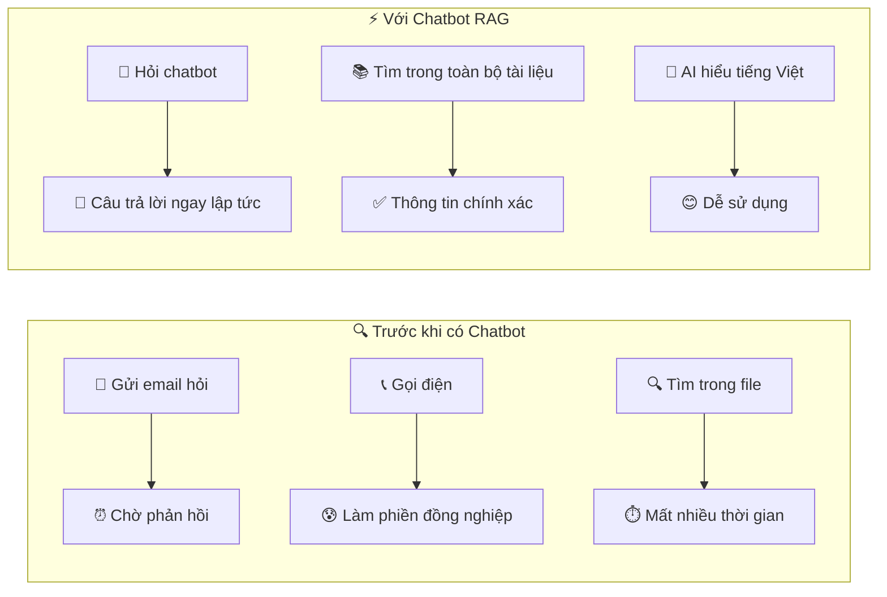

# 📋 **USER CASES ĐƠN GIẢN - HỆ THỐNG RAG KNOWLEDGE ASSISTANT**

## 🌐 **GUEST (KHÁCH) - Không cần đăng nhập**

### **🔍 Guest có thể tra cứu những gì?**

**Thông tin công khai của công ty:**
- 📄 Chính sách nghỉ phép, quy định chung
- 🏢 Thông tin về công ty, lịch sử, tầm nhìn
- 📞 Thông tin liên hệ các phòng ban
- 🎯 Sản phẩm/dịch vụ công ty cung cấp
- 📅 Lịch nghỉ lễ, sự kiện công khai

**Ví dụ câu hỏi Guest có thể đặt:**
- _"Công ty có bao nhiêu ngày nghỉ phép mỗi năm?"_
- _"Địa chỉ văn phòng công ty ở đâu?"_
- _"Công ty hoạt động trong lĩnh vực gì?"_
- _"Giờ làm việc của công ty là mấy giờ?"_

### **💡 Lợi ích khi Guest sử dụng chatbot:**

✅ **Truy cập nhanh thông tin:** Không cần tìm kiếm website hay gọi điện  
✅ **24/7 có sẵn:** Hỏi đáp bất cứ lúc nào  
✅ **Câu trả lời chính xác:** Thông tin từ tài liệu chính thức  
✅ **Dễ sử dụng:** Chỉ cần gõ câu hỏi bằng tiếng Việt  
✅ **Không cần tài khoản:** Dùng ngay lập tức  

---

## 👤 **EMPLOYEE (NHÂN VIÊN) - Sau khi đăng nhập**

### **📚 Employee có thể tra cứu thêm:**

**Ngoài thông tin Guest + thêm:**
- 📋 Quy trình làm việc nội bộ
- 📝 Hướng dẫn sử dụng phần mềm công ty
- 🏥 Thông tin bảo hiểm, phúc lợi
- 📊 Template báo cáo, biểu mẫu
- 🔧 Hướng dẫn kỹ thuật cơ bản

**Ví dụ câu hỏi Employee:**
- _"Làm thế nào để xin nghỉ phép trong hệ thống?"_
- _"Quy trình onboarding nhân viên mới như thế nào?"_
- _"Cách sử dụng phần mềm CRM của công ty?"_
- _"Template báo cáo hàng tháng ở đâu?"_

### **🎯 Tính năng đặc biệt cho Employee:**

✅ **Upload tài liệu:** Tải file lên để hỏi về nội dung cụ thể  
✅ **Xuất cuộc trò chuyện:** Lưu chat thành file PDF/Word  
✅ **Tìm kiếm nâng cao:** Lọc theo tags, loại tài liệu  
✅ **Thông tin phòng ban:** Xem quy trình riêng của phòng mình  

---

## 👨‍💼 **MANAGER (TRƯỞNG PHÒNG)**

### **📈 Manager có thể tra cứu thêm:**

**Tất cả thông tin Employee + thêm:**
- 📊 Báo cáo quản lý, KPI phòng ban
- 💼 Kế hoạch chiến lược, budget
- 👥 Thông tin quản lý nhân sự
- 📋 Quy trình phê duyệt, ký duyệt
- 📈 Dữ liệu performance team

**Ví dụ câu hỏi Manager:**
- _"Kế hoạch tuyển dụng Q1 2025 như thế nào?"_
- _"Quy trình phê duyệt đơn xin việc?"_
- _"Budget marketing tháng này còn bao nhiêu?"_
- _"Cách đánh giá performance nhân viên?"_

### **🛠️ Tính năng quản lý:**

✅ **Xem báo cáo team:** Thống kê hoạt động nhân viên  
✅ **Phê duyệt yêu cầu:** Duyệt quyền truy cập cho nhân viên  
✅ **Quản lý tài liệu:** Upload/chỉnh sửa tài liệu phòng ban  

---

## 🏢 **DIRECTOR (GIÁM ĐỐC)**

### **🎯 Director có quyền truy cập cao nhất:**

**Mọi thông tin trong công ty:**
- 💰 Báo cáo tài chính tổng thể
- 📊 Analytics toàn công ty
- 🎯 Chiến lược phát triển
- 👥 Thông tin nhân sự cấp cao
- 🔍 Dữ liệu quyết định chiến lược

**Ví dụ câu hỏi Director:**
- _"Tình hình tài chính Q4 2024 của tất cả phòng ban?"_
- _"Phân tích khả năng mở rộng thị trường Đông Nam Á?"_
- _"So sánh performance với đối thủ cạnh tranh?"_
- _"Kế hoạch đầu tư công nghệ 5 năm tới?"_

### **📊 Dashboard điều hành:**

✅ **Báo cáo tổng quan:** Metrics toàn công ty  
✅ **AI hỗ trợ quyết định:** Phân tích dữ liệu phức tạp  
✅ **Cấu hình hệ thống:** Điều chỉnh chính sách truy cập  

---

## 🎯 **TẠI SAO SỬ DỤNG CHATBOT RAG?**

### **🚀 Lợi ích chính:**

**Cho cá nhân:**
- ⚡ **Nhanh chóng:** Tìm thông tin trong vài giây
- 🎯 **Chính xác:** Thông tin từ tài liệu chính thức
- 🇻🇳 **Tiếng Việt:** Hiểu và trả lời bằng tiếng Việt tự nhiên
- 📱 **Tiện lợi:** Dùng trên máy tính, điện thoại

**Cho công ty:**
- 💰 **Tiết kiệm thời gian:** Giảm email/cuộc gọi hỏi thông tin
- 📈 **Tăng hiệu quả:** Nhân viên tự tìm được thông tin
- 🔒 **Bảo mật:** Chỉ xem được thông tin có quyền
- 📊 **Thống kê:** Biết nhân viên quan tâm thông tin gì

### **💡 Ví dụ thực tế sử dụng:**

**Tình huống 1:** Nhân viên mới cần biết quy trình xin nghỉ phép
- ❌ **Cũ:** Hỏi đồng nghiệp, tìm file, đọc 10 trang tài liệu
- ✅ **Mới:** Hỏi chatbot _"Làm sao để xin nghỉ phép?"_ → Nhận hướng dẫn chi tiết ngay

**Tình huống 2:** Manager cần kiểm tra budget marketing
- ❌ **Cũ:** Mở Excel, tìm sheet, tính toán thủ công
- ✅ **Mới:** Hỏi _"Budget marketing tháng này còn bao nhiêu?"_ → Có kết quả ngay

**Tình huống 3:** Khách hàng muốn biết giờ làm việc
- ❌ **Cũ:** Gọi điện, chờ tổng đài
- ✅ **Mới:** Vào website, hỏi chatbot → Biết ngay lập tức

Hệ thống này giúp **mọi người tiết kiệm thời gian, tăng hiệu quả làm việc** và **luôn có thông tin chính xác** khi cần!
