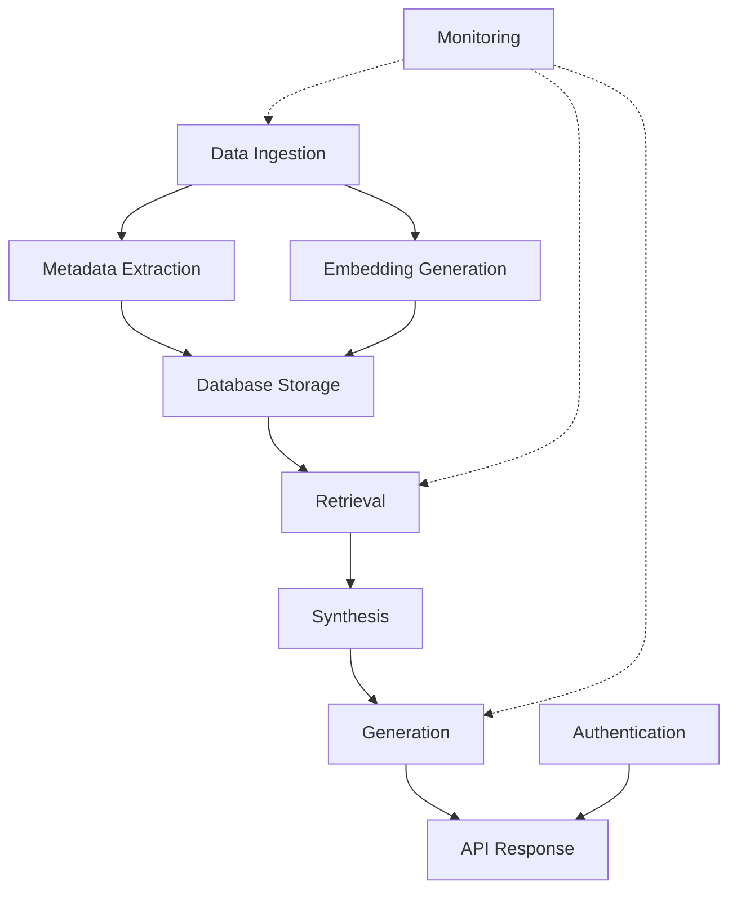

# Vietnamese RAG System - Master Skills Index

## 📚 Overview

Đây là bộ skill hoàn chỉnh cho việc phát triển Vietnamese RAG Knowledge Assistant System với Claude Code. Mỗi skill file tập trung vào một domain cụ thể với code examples, best practices, và troubleshooting guides.

## 🗂️ Skill Files Structure

```
vietnamese-rag-skills/
│
├── VIETNAMESE_GRAPH_RAG_SKILL.md (User-provided)
│   └── FR03.1: Metadata Extraction & Document Relationships
│
├── data_ingestion_pipeline_skill.md
│   └── FR03.3: File Upload, Parsing, Validation, Async Processing
│
├── embedding_model_selection_skill.md
│   └── FR01.1: Model Selection, Benchmarking, Optimization
│
├── rag_retrieval_synthesis_generation_skill.md
│   ├── FR04.1: Hybrid Retrieval (Vector + BM25 + Graph)
│   ├── FR04.2: Context Building & Synthesis
│   └── FR04.3: LLM Generation & Citation
│
├── backend_complete_skills.md
│   ├── FR04.4: FastAPI Development
│   ├── FR06: Authentication & Security (JWT, RBAC)
│   ├── FR07-08: Monitoring & Analytics (Prometheus, Grafana)
│   ├── Testing: Unit, Integration, Load Testing
│   └── Deployment: Docker, Kubernetes, CI/CD
│
└── debugging_troubleshooting_skill.md ⭐ NEW
    ├── Quick Error Finder (30+ common errors)
    ├── Essential Debugging Tools (pdb, logging, profiling)
    ├── Vietnamese Encoding Issues
    ├── GPU Memory Debugging
    ├── Database Connection Issues
    ├── ChromaDB Troubleshooting
    ├── Performance Profiling
    ├── LLM Integration Debugging
    ├── File Upload Issues
    ├── Authentication Problems
    └── Memory Leak Detection
```

## 🎯 Quick Task Finder

### "Tôi cần làm gì?" → "Đọc skill nào?"

| Task | Skill File | Section |
|------|-----------|---------|
| Upload và xử lý file PDF/DOCX | `data_ingestion_pipeline_skill.md` | Format Parsers |
| Validate file trước khi xử lý | `data_ingestion_pipeline_skill.md` | File Upload Handler |
| Xử lý async với Celery | `data_ingestion_pipeline_skill.md` | Async Task Processing |
| Trích xuất metadata từ văn bản tiếng Việt | `VIETNAMESE_GRAPH_RAG_SKILL.md` | MetadataEnricher Class |
| Xây dựng document relationships | `VIETNAMESE_GRAPH_RAG_SKILL.md` | Relationship Extraction |
| Chọn embedding model cho tiếng Việt | `embedding_model_selection_skill.md` | Model Candidates |
| Benchmark embedding models | `embedding_model_selection_skill.md` | Benchmark Framework |
| Optimize embedding inference speed | `embedding_model_selection_skill.md` | Model Optimization |
| Implement hybrid search (Vector + BM25) | `rag_retrieval_synthesis_generation_skill.md` | FR04.1 - Retrieval |
| Query expansion cho tiếng Việt | `rag_retrieval_synthesis_generation_skill.md` | Query Expansion |
| Reranking search results | `rag_retrieval_synthesis_generation_skill.md` | Reranking Module |
| Build context từ retrieved docs | `rag_retrieval_synthesis_generation_skill.md` | FR04.2 - Synthesis |
| Deduplicate documents | `rag_retrieval_synthesis_generation_skill.md` | Context Builder |
| LLM integration (Claude/GPT) | `rag_retrieval_synthesis_generation_skill.md` | FR04.3 - Generation |
| Streaming responses | `rag_retrieval_synthesis_generation_skill.md` | LLM Integration |
| Citation injection | `rag_retrieval_synthesis_generation_skill.md` | Citation Injector |
| Tạo FastAPI endpoints | `backend_complete_skills.md` | API Development |
| Rate limiting | `backend_complete_skills.md` | API Development |
| JWT authentication | `backend_complete_skills.md` | Authentication |
| Role-based access control | `backend_complete_skills.md` | RBAC |
| Document-level permissions | `backend_complete_skills.md` | Security |
| Prometheus metrics | `backend_complete_skills.md` | Monitoring |
| Structured logging | `backend_complete_skills.md` | Analytics |
| Grafana dashboards | `backend_complete_skills.md` | Monitoring |
| Unit testing | `backend_complete_skills.md` | Testing |
| Load testing | `backend_complete_skills.md` | Testing |
| Docker deployment | `backend_complete_skills.md` | Deployment |
| Kubernetes setup | `backend_complete_skills.md` | Deployment |
| CI/CD pipeline | `backend_complete_skills.md` | Deployment |
| Debug UnicodeDecodeError | `debugging_troubleshooting_skill.md` | Vietnamese Encoding Issues |
| Fix CUDA out of memory | `debugging_troubleshooting_skill.md` | GPU Memory Issues |
| Debug database connection | `debugging_troubleshooting_skill.md` | Database Debugging |
| ChromaDB collection not found | `debugging_troubleshooting_skill.md` | ChromaDB Issues |
| Profile slow code | `debugging_troubleshooting_skill.md` | Performance Debugging |
| Debug LLM API errors | `debugging_troubleshooting_skill.md` | LLM Integration Issues |
| Fix file upload failures | `debugging_troubleshooting_skill.md` | File Upload Debugging |
| Debug JWT token issues | `debugging_troubleshooting_skill.md` | Authentication Debugging |
| Detect memory leaks | `debugging_troubleshooting_skill.md` | Memory Leak Detection |
| Vietnamese text corrupted | `debugging_troubleshooting_skill.md` | Vietnamese Text Issues |

## 🚀 Development Workflows

### Workflow 1: Thêm Document Mới Vào Hệ Thống

**Mục tiêu**: User upload PDF → Xử lý → Lưu vào database

**Các skill cần dùng**:
1. `data_ingestion_pipeline_skill.md` → File upload & parsing
2. `VIETNAMESE_GRAPH_RAG_SKILL.md` → Metadata extraction
3. `embedding_model_selection_skill.md` → Generate embeddings
4. `backend_complete_skills.md` → API endpoints & async processing

**Code flow**:
```python
# 1. Upload (data_ingestion_pipeline_skill.md)
file_id = upload_manager.upload_file(file, user_id, doc_type)

# 2. Parse (data_ingestion_pipeline_skill.md)
extractor = UniversalTextExtractor()
parsed_data = extractor.extract(file_path)

# 3. Extract metadata (VIETNAMESE_GRAPH_RAG_SKILL.md)
enricher = MetadataEnricher()
metadata = enricher.extract_metadata(parsed_data['text'])

# 4. Generate embeddings (embedding_model_selection_skill.md)
model = SentenceTransformer("Qwen/Qwen3-Embedding-0.6B")
embeddings = model.encode(chunks)

# 5. Store (backend_complete_skills.md)
store_in_postgresql(file_id, metadata, chunks)
store_in_chromadb(file_id, chunks, embeddings)
```

### Workflow 2: Xử Lý Query từ User

**Mục tiêu**: User query → Retrieve docs → Generate answer

**Các skill cần dùng**:
1. `rag_retrieval_synthesis_generation_skill.md` → Complete RAG pipeline
2. `embedding_model_selection_skill.md` → Query embedding
3. `backend_complete_skills.md` → API & authentication

**Code flow**:
```python
# 1. Authenticate (backend_complete_skills.md)
user = get_current_user(token)

# 2. Initialize pipeline (rag_retrieval_synthesis_generation_skill.md)
pipeline = RAGPipeline(retriever, context_builder, generator)

# 3. Execute query (rag_retrieval_synthesis_generation_skill.md)
result = await pipeline.query(
    user_query=query,
    top_k=5,
    filters={"access_level": user.access_level}
)

# 4. Return response (backend_complete_skills.md)
return QueryResponse(
    answer=result['response'],
    sources=result['citations'],
    metadata=result['metadata']
)
```

### Workflow 3: Optimize Retrieval Quality

**Mục tiêu**: Cải thiện độ chính xác của retrieval

**Các skill cần dùng**:
1. `embedding_model_selection_skill.md` → Benchmark models
2. `rag_retrieval_synthesis_generation_skill.md` → Hybrid search tuning
3. `VIETNAMESE_GRAPH_RAG_SKILL.md` → Relationship enhancement

**Steps**:
```python
# 1. Benchmark current model (embedding_model_selection_skill.md)
benchmark = EmbeddingBenchmark()
results = benchmark.benchmark_model(current_model, test_data)

# 2. Try hybrid search (rag_retrieval_synthesis_generation_skill.md)
retriever = HybridRetriever(chroma, bm25_corpus)
results = retriever.retrieve(query, alpha=0.5)  # Adjust alpha

# 3. Add graph enhancement (rag_retrieval_synthesis_generation_skill.md)
results = retriever._enhance_with_graph(results, expand_to=10)

# 4. Use reranking (rag_retrieval_synthesis_generation_skill.md)
reranker = Reranker()
final_results = reranker.rerank(query, results, top_k=5)
```

### Workflow 4: Deploy to Production

**Mục tiêu**: Deploy hệ thống lên production server

**Các skill cần dùng**:
1. `backend_complete_skills.md` → Docker & Kubernetes
2. Tất cả các skill khác → Testing trước khi deploy

**Steps**:
```bash
# 1. Run all tests (backend_complete_skills.md)
pytest tests/ -v --cov=src

# 2. Build Docker image (backend_complete_skills.md)
docker build -t rag-api:v2.0 .

# 3. Deploy with docker-compose (backend_complete_skills.md)
docker-compose -f docker-compose.prod.yml up -d

# 4. Or deploy to Kubernetes (backend_complete_skills.md)
kubectl apply -f k8s/deployment.yml
kubectl rollout status deployment/rag-api

# 5. Monitor (backend_complete_skills.md)
# Access Grafana at http://localhost:3000
# Check Prometheus metrics at http://localhost:9090
```

### Workflow 5: Debug Production Issues ⭐ NEW

**Mục tiêu**: Tìm và fix lỗi khi gặp sự cố trong production

**Các skill cần dùng**:
1. `debugging_troubleshooting_skill.md` → Comprehensive debugging guide
2. Các skill khác tùy vào loại lỗi

**Steps**:
```python
# Step 1: Identify error type (debugging_troubleshooting_skill.md)
# - Check logs
# - Check error messages
# - Use Quick Error Finder table

# Step 2: Run appropriate diagnostic
# Example: Unicode error
from debugging_skill import debug_file_encoding
debug_file_encoding('problem_file.txt')

# Example: GPU memory issue
from debugging_skill import debug_gpu_memory
debug_gpu_memory()

# Example: Database connection
from debugging_skill import debug_postgres_connection
debug_postgres_connection()

# Example: Slow query
from debugging_skill import profile_function
@profile_function
def slow_function():
    # Your code
    pass

# Step 3: Apply fix from skill file
# Each error in debugging_troubleshooting_skill.md has:
# - Root cause analysis
# - Step-by-step solution
# - Prevention tips

# Step 4: Verify fix
# - Run tests
# - Check metrics
# - Monitor for 24h
```

## 🔧 Common Development Scenarios

### Scenario 1: "Tôi muốn thêm một loại document mới"

**Ví dụ**: Thêm support cho file Excel

**Read**: `data_ingestion_pipeline_skill.md` → Section "Format Parsers"

**Code to write**:
```python
# In data_ingestion_pipeline_skill.md
class ExcelParser:
    def parse(self, file_path: str) -> Dict:
        # Implementation from skill file
        ...
```

### Scenario 2: "Search results không accurate, cần improve"

**Read**:
1. `embedding_model_selection_skill.md` → Benchmark different models
2. `rag_retrieval_synthesis_generation_skill.md` → Hybrid search tuning

**Actions**:
- Compare embedding models với Vietnamese test set
- Adjust hybrid search alpha parameter
- Enable reranking
- Add graph traversal

### Scenario 3: "Cần add permission system phức tạp hơn"

**Read**: `backend_complete_skills.md` → Authentication & Security section

**Implement**:
- JWT authentication
- Role-based access control (4 levels)
- Document-level permissions
- API key management

### Scenario 4: "System chậm, cần optimize"

**Read**:
1. `embedding_model_selection_skill.md` → Optimization techniques
2. `rag_retrieval_synthesis_generation_skill.md` → Caching
3. `backend_complete_skills.md` → Load balancing

**Optimize**:
- Enable embedding cache
- Use dynamic batching
- Implement Redis caching
- Scale with Docker Compose

### Scenario 5: "Cần monitor system performance"

**Read**: `backend_complete_skills.md` → Monitoring & Analytics section

**Setup**:
- Prometheus metrics
- Grafana dashboards
- Structured logging
- Analytics API endpoints

### Scenario 6: "Gặp lỗi không biết fix thế nào" ⭐ NEW

**Read**: `debugging_troubleshooting_skill.md` → Quick Error Finder

**Process**:
1. Copy error message
2. Search trong Quick Error Finder table
3. Jump to relevant section
4. Follow diagnostic steps
5. Apply solution

**Common errors với quick solutions**:
- **UnicodeDecodeError**: Always use `encoding='utf-8'`
- **CUDA OOM**: Reduce batch size, clear cache
- **Connection refused**: Check service status, firewall
- **Vietnamese text ��**: Fix encoding, normalize Unicode
- **Slow queries**: Add indexes, use EXPLAIN ANALYZE
- **JWT invalid**: Check expiration, verify SECRET_KEY

### Scenario 7: "Code chạy chậm, cần optimize" ⭐ NEW

**Read**: `debugging_troubleshooting_skill.md` → Performance Debugging section

**Tools to use**:
```python
# Profile function
from debugging_skill import profile_function
@profile_function
def slow_function():
    pass

# Time code blocks
from debugging_skill import timer
with timer("Database query"):
    results = db.query(...)

# Identify bottlenecks
from debugging_skill import debug_retrieval_pipeline
debug_retrieval_pipeline(query)
```

**Optimize based on findings**:
- Slow database: Add indexes, connection pooling
- Slow embedding: Batch processing, caching, smaller model
- Slow LLM: Reduce context size, use streaming

## 📊 Module Dependencies



**Skill mapping**:
- A: `data_ingestion_pipeline_skill.md`
- B: `VIETNAMESE_GRAPH_RAG_SKILL.md`
- C: `embedding_model_selection_skill.md`
- D: `backend_complete_skills.md` (Database section)
- E: `rag_retrieval_synthesis_generation_skill.md` (Retrieval)
- F: `rag_retrieval_synthesis_generation_skill.md` (Synthesis)
- G: `rag_retrieval_synthesis_generation_skill.md` (Generation)
- H: `backend_complete_skills.md` (API)
- I: `backend_complete_skills.md` (Auth)
- J: `backend_complete_skills.md` (Monitoring)

## 🎓 Learning Path

### For New Developers

**Week 1**: Understand core architecture
- Read: ALL skill files (overview sections only)
- Focus: System architecture diagrams
- Goal: Hiểu tổng quan hệ thống

**Week 2**: Data ingestion pipeline
- Read: `data_ingestion_pipeline_skill.md`
- Practice: Upload và parse các file formats
- Goal: Implement file upload endpoint

**Week 3**: Vietnamese NLP processing
- Read: `VIETNAMESE_GRAPH_RAG_SKILL.md`
- Read: `embedding_model_selection_skill.md`
- Practice: Extract metadata from Vietnamese docs
- Goal: Understand Vietnamese-specific challenges

**Week 4**: RAG pipeline
- Read: `rag_retrieval_synthesis_generation_skill.md`
- Practice: Implement retrieval → synthesis → generation
- Goal: Build complete RAG pipeline

**Week 5**: Backend & deployment
- Read: `backend_complete_skills.md`
- Practice: Setup API, auth, monitoring
- Goal: Deploy to Docker

### For Experienced Developers

**Day 1**: Architecture review
- Skim all skill files
- Review code examples
- Understand Vietnamese-specific optimizations

**Day 2-3**: Implement critical path
- Data ingestion
- Retrieval pipeline
- API endpoints

**Day 4-5**: Production readiness
- Authentication
- Monitoring
- Deployment

## 🆘 Troubleshooting Guide

### Problem: "Embedding model quá chậm"
**Check**: `embedding_model_selection_skill.md` → Optimization section
**Solutions**:
- Quantization
- Dynamic batching
- Caching
- Use smaller model

### Problem: "Search results không relevant"
**Check**: `rag_retrieval_synthesis_generation_skill.md` → Retrieval section
**Solutions**:
- Adjust hybrid search alpha
- Enable reranking
- Add query expansion
- Check embedding quality

### Problem: "Vietnamese characters bị lỗi"
**Check**: 
- `data_ingestion_pipeline_skill.md` → Vietnamese Preprocessing
- `VIETNAMESE_GRAPH_RAG_SKILL.md` → NLP Processing
**Solutions**:
- Ensure UTF-8 encoding
- Use NFC normalization
- Check underthesea tokenization

### Problem: "API response time cao"
**Check**: `backend_complete_skills.md` → Monitoring section
**Solutions**:
- Check Prometheus metrics
- Enable caching
- Optimize database queries
- Scale horizontally

### Problem: "Memory usage cao"
**Check**: `embedding_model_selection_skill.md` → Memory optimization
**Solutions**:
- Use smaller model
- Implement batch processing
- Clear GPU cache
- Use quantized models

## 📖 Best Practices Checklist

### Code Quality
- [ ] Follow PEP 8 style guide
- [ ] Add type hints to all functions
- [ ] Write docstrings for public APIs
- [ ] Use meaningful variable names
- [ ] Keep functions < 50 lines

### Vietnamese-Specific
- [ ] Always use UTF-8 encoding
- [ ] Normalize Unicode (NFC)
- [ ] Preserve legal document codes
- [ ] Test với diacritics
- [ ] Use underthesea for tokenization

### Performance
- [ ] Enable caching where possible
- [ ] Use async for I/O operations
- [ ] Batch database operations
- [ ] Monitor memory usage
- [ ] Profile slow functions

### Security
- [ ] Never commit secrets to Git
- [ ] Use environment variables
- [ ] Implement rate limiting
- [ ] Validate all inputs
- [ ] Use HTTPS in production

### Testing
- [ ] Write unit tests (>80% coverage)
- [ ] Integration tests for critical paths
- [ ] Load test before deployment
- [ ] Test with real Vietnamese data
- [ ] Monitor error rates

### Deployment
- [ ] Use Docker for consistency
- [ ] Implement health checks
- [ ] Setup monitoring (Prometheus + Grafana)
- [ ] Configure auto-scaling
- [ ] Plan backup strategy

## 🔗 External Resources

### Official Documentation
- FastAPI: https://fastapi.tiangolo.com
- ChromaDB: https://docs.trychroma.com
- Sentence Transformers: https://www.sbert.net
- underthesea: https://github.com/undertheseanlp/underthesea

### Vietnamese NLP
- PhoBERT paper: https://arxiv.org/abs/2003.00744
- Vietnamese word tokenization: https://github.com/vncorenlp/VnCoreNLP

### RAG Research
- LangChain docs: https://docs.langchain.com
- LlamaIndex docs: https://docs.llamaindex.ai
- RAG papers: https://arxiv.org/search/?query=retrieval+augmented+generation

## 📝 Skill File Version History

| File | Version | Last Updated | Major Changes |
|------|---------|--------------|---------------|
| VIETNAMESE_GRAPH_RAG_SKILL.md | v1.0 | User-provided | Original metadata extraction |
| data_ingestion_pipeline_skill.md | v1.0 | Jan 2026 | Complete ingestion pipeline |
| embedding_model_selection_skill.md | v1.0 | Jan 2026 | Model selection & benchmarking |
| rag_retrieval_synthesis_generation_skill.md | v1.0 | Jan 2026 | Complete RAG pipeline |
| backend_complete_skills.md | v1.0 | Jan 2026 | API, auth, monitoring, deployment |
| debugging_troubleshooting_skill.md | v1.0 | Jan 2026 | Comprehensive debugging guide |

## 🎯 Success Metrics

### Development Velocity
- ✅ New feature development: < 3 days
- ✅ Bug fix turnaround: < 24 hours
- ✅ Deployment frequency: Weekly
- ✅ Code review time: < 4 hours

### System Performance
- ✅ API response time: < 200ms (p95)
- ✅ Retrieval accuracy: > 80%
- ✅ System uptime: > 99.9%
- ✅ Concurrent users: 100+

### Code Quality
- ✅ Test coverage: > 80%
- ✅ Documentation coverage: 100% of public APIs
- ✅ Type hint coverage: > 90%
- ✅ Linting passes: 100%

## 🤝 Contributing

When adding new skills or updating existing ones:

1. **Follow the template**:
   - Overview section
   - Code examples with comments
   - Vietnamese-specific considerations
   - Testing guidelines
   - Troubleshooting
   - Quick reference commands

2. **Include real examples**:
   - Use actual Vietnamese text
   - Show complete code, not pseudocode
   - Include error cases

3. **Test everything**:
   - All code examples must run
   - Test with Vietnamese inputs
   - Verify on target environment (Python 3.10.11, CUDA 11.8)

4. **Update this index**:
   - Add to task finder table
   - Update workflow examples if needed
   - Add to troubleshooting guide

## 📞 Support

For questions about using these skills:
1. Check the troubleshooting section in relevant skill file
2. Search for error message in all skill files
3. Review the workflow examples
4. Check external documentation links

---

**Remember**: Các skill files này được tạo để sử dụng với Claude Code. Khi chat với Claude Code, chỉ cần tham chiếu tên skill file và section cụ thể, Claude sẽ tự động đọc và apply best practices từ skill đó.

**Example prompt**: 
> "Claude, hãy implement file upload endpoint theo data_ingestion_pipeline_skill.md, section File Upload Handler. Nhớ thêm validation và error handling như trong skill file nhé."

**End of Master Index**
